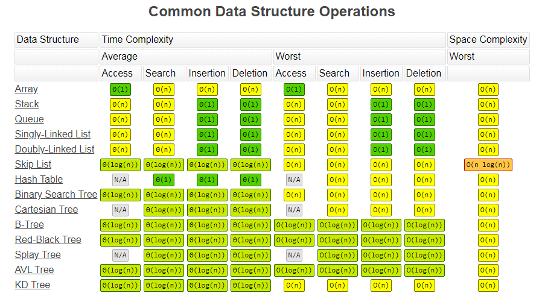
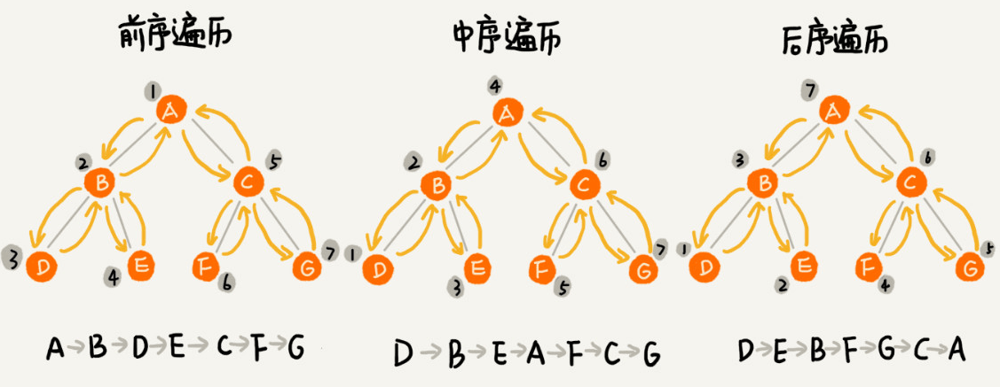

## 时间复杂度和空间复杂度




### 时间空间的选择
- 用时间换空间：内存紧缺情况下，选择空间复杂度低，时间复杂度高的。
- 用空间换时间：空间充足、追求执行速度情况下，选择空间复杂度高，时间复杂度低的。

### 线性表 or 非线性表
- 线性表：数组、链表、队列、栈
- 非线性表：二叉树、堆、图等

## 数组
### 特点
1、属于线性表,只有前后两个方向
2、一组连续的内存空间
3、随机访问高效，根据下标随机访问的时间复杂度为O(1)，公式计算该存储的地址。
4、插入和删除是低效的，插入第k个位置需要将k~n的元素都往后移动，删除第k个元素同样也要移动元素(特殊情况是比较快，比如添加/删除最后一个元素)。但平均时间复杂度为O(n)

## 链表
### 特点
1、属于线性表,只有前后两个方向，头结点（第一个）记录链表的基地址，尾结点（最后一个）的next指针指向NULL
2、由零散的内存块串联
3、随机访问低效，根据下标随机访问的时间复杂度为O(n)，得从第一个往后查找。
4、插入和删除是高效的，本身是不连续的内存空间，可以直接改变相邻结点的指针即可。时间复杂度为O(1），双向链表还会更高效，适合更多情况。

### 分类
- 单链表：尾结点指针指向空地址
- 循环链表：尾结点指针指向链表的头结点，首尾相连
- 双链表：有两个方向，有next后指针和prev前指针，占用更多内存空间。某些情况插入、删除比单链表更高效。如：删除给定指针指向的结点，需要找到前结点。此时双向链表复杂度为O(1)，单链表还要从头遍历查找为O(n)。
- 双向循环链表：前两个结合。

### 技巧
1、理解：指针其实就是引用，指针中保存变量的内存地址，指向该变量，可通过指针找到变量。
2、注意：指针丢失和内存泄漏（比如注意插入的操作顺序，先将新节点的next指向前个节点的next，再将前个节点的next指向新节点。）
  ```js
  x->next = p->next; // 将x的结点的next指针指向b结点；
  p->next = x;       // 将p的next指针指向x结点；
  ```
3、使用哨兵解决边界问题，针对链表的插入、删除操作，需要对插入第一个结点和删除最后一个结点的情况进行特殊处理。为了简化，使用带头链表（head指针指向哨兵节点）
4、考虑边界：
如果链表为空时，代码是否能正常工作？
如果链表只包含一个结点时，代码是否能正常工作？
如果链表只包含两个结点时，代码是否能正常工作？
代码逻辑在处理头结点和尾结点的时候，是否能正常工作？
5、使用画图法让思路清晰
6、多练，常用链表操作
- 单链表反转：迭代；递归
- 链表中是否有环：哈希表保存，看是否访问过；快慢指针（慢1块2）；
- 两个有序的链表合并
- 删除链表倒数第 n 个结点
- 求链表的中间结点

## 堆栈

- 如何实现栈：
  - 可基于数组（顺序栈）
  - 或基于链表（链式栈）
- 复杂度：
  - 访问和查找时间复杂度为O(n)
  - 入栈和出栈时间/空间复杂度都是O(1)
  - 入栈、出栈只涉及栈顶个别数据的操作，所以时间复杂度都是 O(1)。
  - 一两个临时变量存储空间，所以空间复杂度是 O(1)。
- 场景应用：
  - 函数调用栈
  - 表达式运算（两个栈实现，一个放操作数，一个放运算符）
  - 判断括号嵌套匹配是否正确（遍历将左括号压入，遇到右括号取出）
  - 浏览器前进后退（两个栈实现，后退则压入另一个栈，前进从栈取出）

## 队列

- 场景：
  - 线程池的请求排队，先进先服务，资源有限的场景，没有空闲资源，可通过队列这种数据结构实现请求排队。
- 操作：
  - 入队：enqueue()
  - 出队：dequeue()
- 复杂度：
  - 访问和查找时间复杂度为O(n)
  - 插入和删除时间/空间复杂度都是O(1)
- 实现
  - 数组实现：顺序队列，两个指针，一个head指向对头，一个tail指向 队尾，出队head和入队的tail指针都会持续向后移动，当空间用满之后，需要做数据搬移，在入队时候进行一次搬移，将剩下的任务搬到下标为0的位置。
  - 链表实现：链式队列
- 循环队列：
  - tail指针循环回到头部位置0的下标，而不是加1，解决数据搬移问题，需要做好队空和队满的判断。

## 散列表Hash
## 二叉树
### 树的概念
- 节点：树中的每个元素称为节点
- 根节点:没有父节点的节点
- 父节点:指向子节点的节点
- 子节点:被父节点指向的节点
- 兄弟节点:具有相同父节点的多个节点称为兄弟节点关系
- 叶子节点：没有子节点的节点
---
- 节点的高度：节点到叶子节点的最长路径(边数)
- 节点的深度：根节点到节点的路径所包含的边数
- 节点的层数：节点的深度+1（根节点的层数是1）
- 树的高度：等于根节点的高度

---
- 二叉树：每个节点最多两个叉，也就是两个子节点。
- 完全二叉树：叶子节点都在最底下两层，最后一层的叶子节点都靠左排列，并且除了最后一层，其他层的节点个数都要达到最大，也就是铺满完整。
- 满二叉树：满二叉树又是完全二叉树的一种特殊情况。叶子节点全都在最底层，除了叶子节点之外，每个节点都有左右两个子节点。

---
两种存储方式：
- 链式存储法:每个节点有三个字段，其中一个存储数据，另外两个是指向左右子节点的指针。
- 基于数组的顺序存储法：根节点存储在下标 i = 1 的位置，那左子节点存储在下标 2 * i = 2 的位置，右子节点存储在 2 * i + 1 = 3 的位置。只要知道根节点存储的位置（一般情况下，为了方便计算子节点，根节点会存储在下标为 1 的位置），这样就可以通过下标计算，串起整棵树。

### 二叉树的遍历

#### 前序遍历（根左右）
> 对于树中的任意节点来说，先打印这个节点，然后再打印它的左子树，最后打印它的右子树。
#### 中序遍历（左根右）
> 对于树中的任意节点来说，先打印它的左子树，然后再打印它本身，最后打印它的右子树。
#### 后序遍历（左右根）
> 对于树中的任意节点来说，先打印它的左子树，然后再打印它的右子树，最后打印这个节点本身。

### 二叉搜索（查找）树 - Binary Search Tree
> 有序的、左子树的所有值都小于根节点、右子树的值都大于根节点，或者空节点也是合理的查找树。
- 支持动态数据集合的快速插入、删除、查找操作。
- 搜索更快速，平均O(logn)，最坏O(n)。


## 堆
- 概念：一种特殊的树
- 需要满足：完全二叉树、每个节点的值都大于等于或小于等于它的左右子节点的值
- 分类
  - 大顶堆：每个节点的值都大于等于子树中每个节点值
  - 小顶堆：每个节点的值都小于等于子树中每个节点值
- 存储：使用数组结构来存储，节省空间
- 核心操作：堆中插入元素、删除堆顶元素
- 插入一个元素：复杂度O(logn)
  - 堆化：调整交换元素的位置，使其满足堆的特性（大于等于或者小于等于）
  - 插在最后叶子节点，与父节点对比大小，不满足则互换节点，从下往上堆化，直到满足条件为止。

- 删除堆顶元素：复杂度O(logn)
  - 根据关系：堆顶要么是最大值（大顶堆），要么是最小值（小顶堆）
  - 删除堆顶元素后，将最后一个节点放到堆顶，从上往下堆化，这样就可以满足堆的结构


## 递归
- 优缺点：（需要根据实际情况选择是否用递归解决问题）
  - 优点：代码简洁，表达能力强
  - 缺点：重复计算，过多调用导致时间空间复杂度高。
- 递归需要满足三个条件：
  - 一个问题的解可分解为子问题的解
  - 数据规模不同，但思路相同
  - 存在终止条件
- 如何编写：
  - 写出递推公式
  - 找到终止条件
  - 思路：大问题分解小问题，写出递推公式，推敲终止条件，翻译为代码。
  - 注意：不需要想一层层的调用关系，只需要抽象成一个公式即可。
- 控制副作用：
  - 避免堆栈溢出（设置调用深度，超出则报错）
  - 避免重复计算（通过数据结构如散列表，保存计算过的值）
- 应用：
  - DFS 深度优先搜索
  - 前中后序二叉树遍历
  - 分治算法（中间值有重复计算，效果需优化）


## 排序
## 二分查找
> BFS和DFS两种搜索算法仅适用于树或者图不大的搜索。
> 树的节点搜索不会重复，图就可能会出现重复，要进行判断是否已经出现过，可使用set结构保存已经出现过的。


## 广度优先搜索BFS
- 一般使用队列实现
- 从起始顶点开始，一层一层往外遍历
- 它的特点是越是接近根结点的结点将越早地遍历
- 题目：二叉树的层次遍历

## 深度优先搜索DFS
- 一般使用栈实现
- 回溯思想，先一杆子叉到底，回头看看有没有漏网之鱼
- 解题推荐递归写法
- 题目：二叉树的最大深度

## 动态规划
## 贪心算法
## 分治算法
## 回溯算法