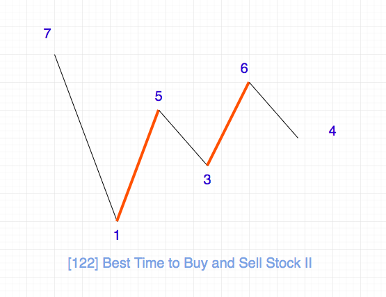

## 递归
### LeetCode50.Pow(x,n)
实现 pow(x, n) ，即计算 x 的 n 次幂函数。

输入: 2.00000, 10
输出: 1024.00000

输入: 2.00000, -2
输出: 0.25000
解释: 2-2 = 1/22 = 1/4 = 0.25

##### 法1：快速幂+递归法

- 示例
  ```
  x→x^2→x^4→x^8→x^16→x^32→x^64
  ```

- 思路
  - 边界：0次方=1，1次方=x本身。
  - 返回：x传入x的平方，再传入2 / n次幂。
  - 注意：负幂为倒数，奇数还需要乘多一次x。

- 实现
  ```js
  var myPow = function(x, n) {
    // 判断小于0为倒数
    // 判断=0返回1
    // 判断是整数还是奇数，整数为x平方的n/2幂向下取整，奇数为x平方的n/2幂向下取整，再乘x。
    // 偶数除以2最终会变成1，也就是奇数，return 1*x ，或者写成n=1时，返回x。
    if(n < 0) return 1 / myPow(x, -n);
    if(n === 0) return 1;
    if(n === 1) return x;
    if(n % 2 === 0) return myPow(x * x, Math.floor(n / 2));
    return myPow(x * x, Math.floor(n / 2)) * x;
  };
  ```

- 时间复杂度：O(log n)，即为递归的层数。
- 空间复杂度：O(log n)，即为递归的层数。这是由于递归的函数调用会使用栈空间。

## 二叉树
### LeetCode-94 二叉树的中序遍历
给定一个二叉树，返回它的中序 遍历。

示例:
```
树结构:
TreeNode: {
  val: 1,
  right: {
    val: 2,
    right: null,
    left: {
      val: 3,
      right: null,
      left: null,
    },
  },
  left: null
}
```
```
输入: [1,null,2,3]
   1
    \
     2
    /
   3

输出: [1,3,2]
```
##### 法1：递归法
- 思路
- 实现
```js
const inorderTraversal = (root) => {
    const result = [];
    const midSeq = (root) => {
        if(!root) return;
        const { left, right, val } = root;
        left && midSeq(left);
        val && result.push(val); // 这一步是关键，代表根在中间插入。
        right && midSeq(right);
    }
    midSeq(root);
    return result;
}
```
- 时间复杂度：O(n)​ 递归函数 T(n)=2∗T(n/2)+1 ，因此时间复杂度为 O(n)​
- 空间复杂度：O(logn)
##### 法2：迭代法
- 思路
  - 声明一个临时堆栈存放左子节点和result存放结果，一直向下查找，找到有node.left存在，则push进临时堆栈中，continue 继续判断有无left，直到查不到左子节点。
  - 开始处理刚才插入的左子节点，类似堆栈，pop弹出最后插入的node，把node.val值推入result结果数组中。（循环判断条件要加上堆栈不为空，只要不为空，就还得继续执行弹出操作）
  - 将该节点的右节点作为下一次迭代对象。最后返回result。

- 实现
  - 取跟节点为目标节点，开始遍历
  - 1.左孩子入栈 -> 直至左孩子为空的节点
  - 2.节点出栈 -> 访问该节点
  - 3.以右孩子为目标节点，再依次执行1、2、3

```js
const inorderTraversal = (root) => {
    const result = [];
    const stack = [];
    let node = root;
    while (node || stack.length > 0) {
        if(node) {
            stack.push(node);
            node = node.left;
            continue;
        }
        node = stack.pop();
        result.push(node.val);
        node = node.right;
    }
    return result;
}
```
- 时间复杂度：O(n) 查询所有节点需要O(n)的时间
- 空间复杂度：O(n) 创建了长度为n的数组

## 广度搜索
### LeetCode-102 二叉树的层序遍历
给你一个二叉树，请你返回其按 层序遍历 得到的节点值。 （即逐层地，从左到右访问所有节点）。
示例：
二叉树：[3,9,20,null,null,15,7],
```
    3
   / \
  9  20
    /  \
   15   7
```
返回其层次遍历结果：
```
[
  [3],
  [9,20],
  [15,7]
]
```
##### 法1：BFS

- 思路
  - 初始化 queue，用于存储当前层的节点，一开始存储根节点
  - 检查 queue 是否为空
  - 如果不为空：依次遍历当前 queue 内的所有节点，将node.val的值存入arr中，再检查每个节点的左右子节点，将不为空的子节点放入 queue，继续循环
  - 如果为空：跳出循环
  - 每层queue循环结束，将每层将res.push(arr)，最后返回res
- 实现
```js
var levelOrder = function(root) {
    if(!root) return [];
    let queue = [root];
    let res = [];
    while(queue.length) {
        let len = queue.length;
        let arr = [];
        while(len) {
            let node = queue.shift();
            arr.push(node.val);
            if(node.left) queue.push(node.left);
            if(node.right) queue.push(node.right);
            len--;
        }
        res.push(arr);
    }
    return res;
}
```
- 时间复杂度：O(n)
- 空间复杂度：O(n)


## 深度搜索
### LeetCode-101 对称二叉树
给定一个二叉树，检查它是否是镜像对称的。

例如，二叉树 [1,2,2,3,4,4,3] 是对称的。
```
    1
   / \
  2   2
 / \ / \
3  4 4  3
```

但是下面这个 [1,2,2,null,3,null,3] 则不是镜像对称的:
```
    1
   / \
  2   2
   \   \
   3    3
```
##### 法1：DFS
- 思路
  - 判断根节点为空的话，返回true；
  - 返回递归根节点的左右子树
  - 递归函数里判断左右节点是否为空，空的话对应的位置也要为空才返回true；
  - 如果都不为空则判断值是否相等，如果不等，返回false；
  - 相等继续递归下去，（左节点的右孩子和右节点的左孩子）&& （左节点的左孩子和右节点的右孩子）这两个条件都为true才是对称二叉树。
- 实现
```js
var isSymmetric = function(root) {
    if(!root) {
        return true;
    }
    return isSameTree(root.left,root.right);
};

const isSameTree = (r,l) => {
    if(r === null) return l === null;
    if(l === null) return r === null;
    if(r.val !== l.val) return false;
    return isSameTree(r.left, l.right) && isSameTree(r.right, l.left);
}
```
- 时间复杂度：O(n)​ 我们需要对这个树中的每个节点都要进行遍历
- 空间复杂度：O(n)​ 当树是线性时，由栈上的递归调用造成的空间复杂度为 O(n)


### LeetCode-104 二叉树的最大深度
给定一个二叉树，找出其最大深度。

二叉树的深度为根节点到最远叶子节点的最长路径上的节点数。

说明: 叶子节点是指没有子节点的节点。
示例：
给定二叉树 [3,9,20,null,null,15,7]，
```
    3
   / \
  9  20
    /  \
   15   7
```
返回它的最大深度 3 。

##### 法1：DFS
- 思路
  - 判断二叉树是否为空，空的直接返回 0，结束，非空二叉树继续
  - 分别递归计算左右子树的最大深度
  - 返回左子树深度和右子树最大深度的最大值 + 1，就是整个树的最大深度。
- 实现
```js
var maxDepth = function(root) {
    if(!root) {
        return 0;
    } else {
        const left = maxDepth(root.left);
        const right = maxDepth(root.right);
        return Math.max(left, right) + 1;
    }
}
```
- 时间复杂度：O(n) 通过递归的方式查询了数的所有子节点。查询花费 O(n) 的时间
- 空间复杂度：O(n) 每次递归都需要创建新的临时空间，空间复杂度 O(n)


### LeetCode-108

## 动态规划
### LeetCode-70 爬楼梯
假设你正在爬楼梯。需要 n 阶你才能到达楼顶。

每次你可以爬 1 或 2 个台阶。你有多少种不同的方法可以爬到楼顶呢？

注意：给定 n 是一个正整数。
示例 1：
```
输入： 2
输出： 2
解释： 有两种方法可以爬到楼顶。
1.  1 阶 + 1 阶
2.  2 阶
```
示例 2：
```
输入： 3
输出： 3
解释： 有三种方法可以爬到楼顶。
1.  1 阶 + 1 阶 + 1 阶
2.  1 阶 + 2 阶
3.  2 阶 + 1 阶
```

##### 法1：动态规划
> dp状态定义（f(n)表示到第n阶的总走法个数）、dp方程写出来
- 思路
  - 本问题其实常规解法可以分成多个子问题，爬第n阶楼梯的方法数量，等于 2 部分之和
    - 1、爬上 n-1阶楼梯的方法数量。因为再爬1阶就能到第n阶
    - 2、爬上 n-2 阶楼梯的方法数量。因为再爬2阶就能到第n阶
  - 所以我们得到公式 dp[n] = dp[n-1] + dp[n-2]
  - 同时需要初始化 dp[1]=1和 dp[2]=2

- 实现
```js
var climbStairs = function(n) {
    let result = [];
    result[1] = 1;
    result[2] = 2;
    for(let i = 3; i <= n; i++) {
        result[i] = result[i - 1] + result[i - 2];
    }
    return result[n];
};
```
- 时间复杂度：O(n)，对 n 进行了一次循环遍历，运行次数与输入 n 成正比
- 空间复杂度：O(n)，创建了一个长度为 n 的空间，空间复杂度是 O(n)
##### 法2：递归+记忆化
- 思路
f（n）= f（n-1）+f（n-2）
- 实现
```js
// 递归函数（无记忆）
const climbStairs = function (n) {
    if (n <= 2) {
        return n;
    } else {
        return climbStairs(n - 1) + climbStairs(n - 2);
    }
};
// 递归函数（记忆化）
const fn = (n, map) => {
    if(n <= 2) {
      return n
    }
    const result = map[n];
    if(result) {
        return result;
    } else {
      let num = fn(n - 1, map) + fn(n - 2, map);
      map[n] = num;
      return num
    }
}

const climbStairs = (n) => {
    const map = {};
    return fn(n, map) 
};
```
- 时间复杂度：
  - 递归（无记忆）为 O(2^n)​；每个节点都要计算，为二叉树的节点O(2^n - 1)​
  - 递归（记忆化）为O(n)​；避免了重复计算，为二叉树高度O(n)​
- 空间复杂度：O(n)

### LeetCode-121 买卖股票的最佳时机
给定一个数组，它的第 i 个元素是一支给定股票第 i 天的价格。

如果你最多只允许完成一笔交易（即买入和卖出一支股票一次），设计一个算法来计算你所能获取的最大利润。

注意：你不能在买入股票前卖出股票。
示例 1:
```
输入: [7,1,5,3,6,4]
输出: 5
解释: 在第 2 天（股票价格 = 1）的时候买入，在第 5 天（股票价格 = 6）的时候卖出，最大利润 = 6-1 = 5 。
     注意利润不能是 7-1 = 6, 因为卖出价格需要大于买入价格；同时，你不能在买入前卖出股票。
```
示例 2:
```
输入: [7,6,4,3,1]
输出: 0
解释: 在这种情况下, 没有交易完成, 所以最大利润为 0。
```

##### 法1：一次遍历法
- 思路
  - 设置【最低价格】minPrice，再设置【最大收益】maxProfit。
  - 然后遍历价格数组，如果当天价格比最小价格更低，则将当天价格赋值给最小价格。
  - 每天计算：之前的历史最低价格与当天价格的差值收益，和前面的最大收益比较。
  - 若差值大于最大收益，则将差值赋值给最大收益，否则不处理。
  - 最后遍历一遍即可获得最大收益maxProfit。
- 实现
```js
var maxProfit = function(prices) {
    let minPrice = 0;
    let maxProfit = 0;
    for(let i = 0; i < prices.length; i++) {
        if(i === 0) {                       // 初始化最小价格为第一个元素
            minPrice = prices[i];
        } else if(prices[i] < minPrice) {   // 遍历过程中发现最小价格，则重新赋值
            minPrice = prices[i];
        } else if(prices[i] - minPrice > maxProfit) { // 比较当日卖出收益与当前已获取的最大收益
            maxProfit = prices[i] - minPrice;
        }
    }
    return maxProfit;
};
```
- 时间复杂度：O(n)
- 空间复杂度：O(1)，在算法中，我们使用两个公共变量保存最大收益以及最小卖出价格，所以空间复杂度为常数级。

##### 法2：动态规划
- 思路
  - 设置【每日最大收益数组】profits，并初始化第一天为0；再设置【最大收益】maxProfit；
  - 遍历价格数组，计算每日可获取的最大收益值，每日有两种情况，取二者的最大值。
    - 一种是买入：最大收益为0；
    - 一种是卖出，最大收益为【前一天的最大收益】+【前一天和今天的价格差值（就是上涨/下跌多少）】（等于说昨天不卖等到今天卖，是亏了还是赚更多了）
  - 计算完每日的最大收益，和maxProfit进行比较，若大于maxProfit，就将最大收益赋值给maxProfit，最终遍历完成，可得到最大收益。
- 实现
```js
var maxProfit = function(prices) {
    let profits = [0];
    let maxProfit = 0;
    for(let i = 1; i < prices.length; i++) {
        profits[i] = Math.max(0, profits[i - 1] + (prices[i] - prices[i - 1]));
        if(profits[i] > maxProfit) {
            maxProfit = profits[i];
        }
    }
    return maxProfit;
};
```
- 时间复杂度：O(n)​
- 空间复杂度：O(n)​

## 贪心算法

### LeetCode-122 买卖股票的最佳时机 II

给定一个数组，它的第 i 个元素是一支给定股票第 i 天的价格。

设计一个算法来计算你所能获取的最大利润。你可以尽可能地完成更多的交易（多次买卖一支股票）。

注意：你不能同时参与多笔交易（你必须在再次购买前出售掉之前的股票）。
示例 1:
```
输入: [7,1,5,3,6,4]
输出: 7
解释: 在第 2 天（股票价格 = 1）的时候买入，在第 3 天（股票价格 = 5）的时候卖出, 这笔交易所能获得利润 = 5-1 = 4 。
     随后，在第 4 天（股票价格 = 3）的时候买入，在第 5 天（股票价格 = 6）的时候卖出, 这笔交易所能获得利润 = 6-3 = 3 。
```
示例 2:
```
输入: [1,2,3,4,5]
输出: 4
解释: 在第 1 天（股票价格 = 1）的时候买入，在第 5 天 （股票价格 = 5）的时候卖出, 这笔交易所能获得利润 = 5-1 = 4 。
     注意你不能在第 1 天和第 2 天接连购买股票，之后再将它们卖出。
     因为这样属于同时参与了多笔交易，你必须在再次购买前出售掉之前的股票。
```
示例 3:
```
输入: [7,6,4,3,1]
输出: 0
解释: 在这种情况下, 没有交易完成, 所以最大利润为 0。
```

提示：
1 <= prices.length <= 3 * 10 ^ 4
0 <= prices[i] <= 10 ^ 4

##### 法1：贪心算法
> 由于我们是想获取到最大的收益，我们的策略应该是低点买入，高点卖出。由于题目对于交易次数没有限制，因此只要能够赚钱的机会我们都不应该放过。

> 如下图，我们只需要求出加粗部分的总和即可


- 思路
  - 例子【1，2，3，4，5】
  - 判断明天比今天高，就今天买入，明天卖出，每天都这么判断，这样每天锁定1块钱收益，因为特殊条件存在（无手续费也没有交易次数限制），所以每天买卖和一直持股到最后才卖，收益是一样的，都是4块收益。
- 实现
```js
var maxProfit = function(prices) {
    let profit = 0;
    for(let i = 1; i < prices.length; i++) {
        if (prices[i] > prices[i -1]) {
            profit  = profit + prices[i] - prices[i - 1];
        }
    }
    return profit;
};
```
- 时间复杂度：O(n)
- 空间复杂度：O(1)

## 回溯算法

## 模板
### LeetCode-
##### 法1：
- 思路
- 实现
```js

```
- 时间复杂度：
- 空间复杂度：

