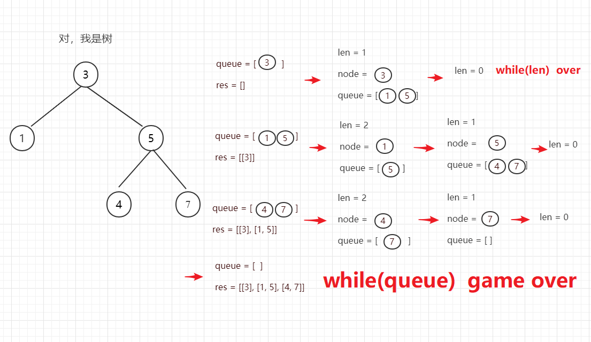
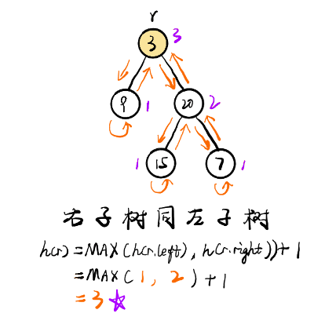

## 递归
### LeetCode50.Pow(x,n)
实现 pow(x, n) ，即计算 x 的 n 次幂函数。

输入: 2.00000, 10
输出: 1024.00000

输入: 2.00000, -2
输出: 0.25000
解释: 2-2 = 1/22 = 1/4 = 0.25

##### 法1：快速幂+递归法

- 示例
  ```
  x→x^2→x^4→x^8→x^16→x^32→x^64
  ```

- 思路
  - 边界：0次方=1，1次方=x本身。
  - 返回：x传入x的平方，再传入2 / n次幂。
  - 注意：负幂为倒数，奇数还需要乘多一次x。

- 实现
  ```js
  var myPow = function(x, n) {
    // 判断小于0为倒数
    // 判断=0返回1
    // 判断是整数还是奇数，整数为x平方的n/2幂向下取整，奇数为x平方的n/2幂向下取整，再乘x。
    // 偶数除以2最终会变成1，也就是奇数，return 1*x ，或者写成n=1时，返回x。
    if(n < 0) return 1 / myPow(x, -n);
    if(n === 0) return 1;
    if(n === 1) return x;
    if(n % 2 === 0) return myPow(x * x, Math.floor(n / 2));
    return myPow(x * x, Math.floor(n / 2)) * x;
  };
  ```

- 时间复杂度：O(log n)，即为递归的层数。
- 空间复杂度：O(log n)，即为递归的层数。这是由于递归的函数调用会使用栈空间。

## 二叉树
### LeetCode-94 二叉树的中序遍历
给定一个二叉树，返回它的中序 遍历。

示例:
```
树结构:
TreeNode: {
  val: 1,
  right: {
    val: 2,
    right: null,
    left: {
      val: 3,
      right: null,
      left: null,
    },
  },
  left: null
}
```
```
输入: [1,null,2,3]
   1
    \
     2
    /
   3

输出: [1,3,2]
```
##### 法1：递归法
- 思路
- 实现
```js
const inorderTraversal = (root) => {
    const result = [];
    const midSeq = (root) => {
        if(!root) return;
        const { left, right, val } = root;
        left && midSeq(left);
        val && result.push(val); // 这一步是关键，代表根在中间插入。
        right && midSeq(right);
    }
    midSeq(root);
    return result;
}
```
- 时间复杂度：O(n)​ 递归函数 T(n)=2∗T(n/2)+1 ，因此时间复杂度为 O(n)​
- 空间复杂度：O(logn)
##### 法2：迭代法
- 思路
  - 声明一个临时堆栈存放左子节点和result存放结果，一直向下查找，找到有node.left存在，则push进临时堆栈中，continue 继续判断有无left，直到查不到左子节点。
  - 开始处理刚才插入的左子节点，类似堆栈，pop弹出最后插入的node，把node.val值推入result结果数组中。（循环判断条件要加上堆栈不为空，只要不为空，就还得继续执行弹出操作）
  - 将该节点的右节点作为下一次迭代对象。最后返回result。

- 实现
  - 取跟节点为目标节点，开始遍历
  - 1.左孩子入栈 -> 直至左孩子为空的节点
  - 2.节点出栈 -> 访问该节点
  - 3.以右孩子为目标节点，再依次执行1、2、3

```js
const inorderTraversal = (root) => {
    const result = [];
    const stack = [];
    let node = root;
    while (node || stack.length > 0) {
        if(node) {
            stack.push(node);
            node = node.left;
            continue;
        }
        node = stack.pop();
        result.push(node.val);
        node = node.right;
    }
    return result;
}
```
- 时间复杂度：O(n) 查询所有节点需要O(n)的时间
- 空间复杂度：O(n) 创建了长度为n的数组

## 广度搜索
### LeetCode-102 二叉树的层序遍历
给你一个二叉树，请你返回其按 层序遍历 得到的节点值。 （即逐层地，从左到右访问所有节点）。
示例：
二叉树：[3,9,20,null,null,15,7],
```
    3
   / \
  9  20
    /  \
   15   7
```
返回其层次遍历结果：
```
[
  [3],
  [9,20],
  [15,7]
]
```
##### 法1：BFS

- 思路
  - 初始化 queue，用于存储当前层的节点，一开始存储根节点
  - 检查 queue 是否为空
  - 如果不为空：依次遍历当前 queue 内的所有节点，将node.val的值存入arr中，再检查每个节点的左右子节点，将不为空的子节点放入 queue，继续循环
  - 如果为空：跳出循环
  - 每层queue循环结束，将每层将res.push(arr)，最后返回res
- 实现
```js
var levelOrder = function(root) {
    if(!root) return [];
    let queue = [root];
    let res = [];
    while(queue.length) {
        let len = queue.length;
        let arr = [];
        while(len) {
            let node = queue.shift();
            arr.push(node.val);
            if(node.left) queue.push(node.left);
            if(node.right) queue.push(node.right);
            len--;
        }
        res.push(arr);
    }
    return res;
}
```
- 时间复杂度：O(n)
- 空间复杂度：O(n)


## 深度搜索
### LeetCode-101 对称二叉树
给定一个二叉树，检查它是否是镜像对称的。

例如，二叉树 [1,2,2,3,4,4,3] 是对称的。
```
    1
   / \
  2   2
 / \ / \
3  4 4  3
```

但是下面这个 [1,2,2,null,3,null,3] 则不是镜像对称的:
```
    1
   / \
  2   2
   \   \
   3    3
```
##### 法1：DFS
- 思路
  - 判断根节点为空的话，返回true；
  - 返回递归根节点的左右子树
  - 递归函数里判断左右节点是否为空，空的话对应的位置也要为空才返回true；
  - 如果都不为空则判断值是否相等，如果不等，返回false；
  - 相等继续递归下去，（左节点的右孩子和右节点的左孩子）&& （左节点的左孩子和右节点的右孩子）这两个条件都为true才是对称二叉树。
- 实现
```js
var isSymmetric = function(root) {
    if(!root) {
        return true;
    }
    return isSameTree(root.left,root.right);
};

const isSameTree = (r,l) => {
    if(r === null) return l === null;
    if(l === null) return r === null;
    if(r.val !== l.val) return false;
    return isSameTree(r.left, l.right) && isSameTree(r.right, l.left);
}
```
- 时间复杂度：O(n)​ 我们需要对这个树中的每个节点都要进行遍历
- 空间复杂度：O(n)​ 当树是线性时，由栈上的递归调用造成的空间复杂度为 O(n)


### LeetCode-104 二叉树的最大深度
给定一个二叉树，找出其最大深度。

二叉树的深度为根节点到最远叶子节点的最长路径上的节点数。

说明: 叶子节点是指没有子节点的节点。
示例：
给定二叉树 [3,9,20,null,null,15,7]，
```
    3
   / \
  9  20
    /  \
   15   7
```
返回它的最大深度 3 。

##### 法1：DFS
- 思路
  - 判断二叉树是否为空，空的直接返回 0，结束，非空二叉树继续
  - 分别递归计算左右子树的最大深度
  - 返回左子树深度和右子树最大深度的最大值 + 1，就是整个树的最大深度。
- 实现
```js
var maxDepth = function(root) {
    if(!root) {
        return 0;
    } else {
        const left = maxDepth(root.left);
        const right = maxDepth(root.right);
        return Math.max(left, right) + 1;
    }
}
```
- 时间复杂度：O(n) 通过递归的方式查询了数的所有子节点。查询花费 O(n) 的时间
- 空间复杂度：O(n) 每次递归都需要创建新的临时空间，空间复杂度 O(n)


### LeetCode-108

## 动态规划
## 回溯算法
## 贪心算法