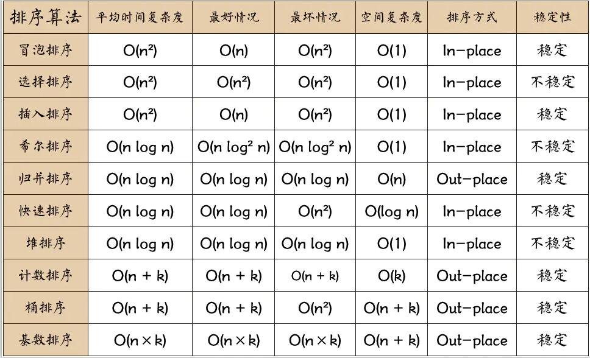
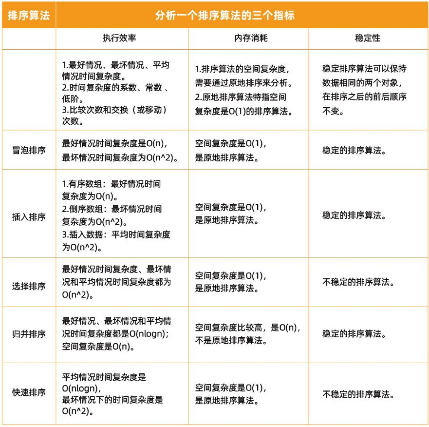
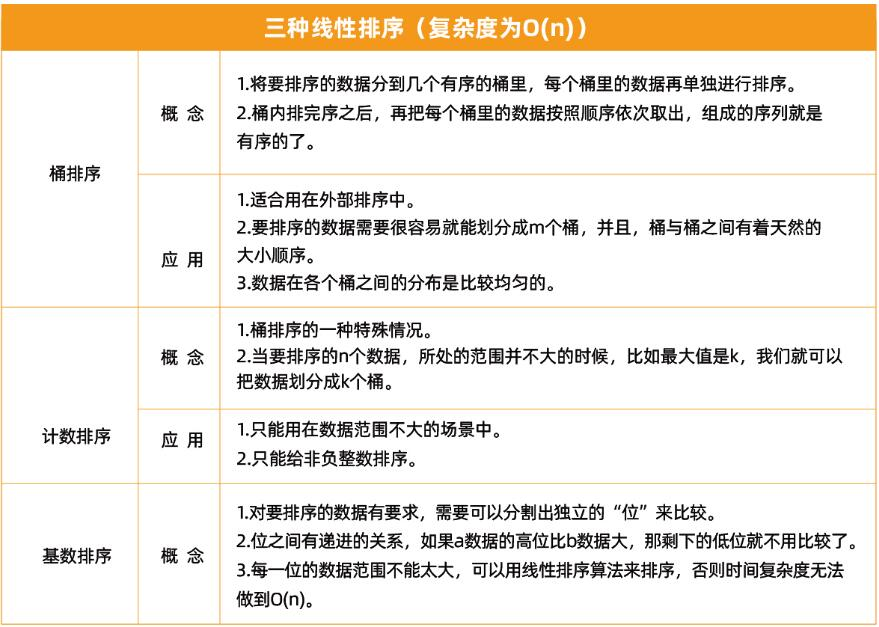
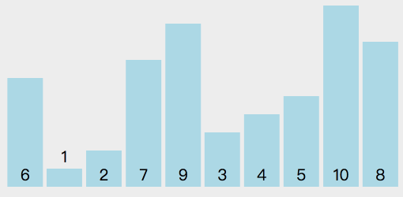
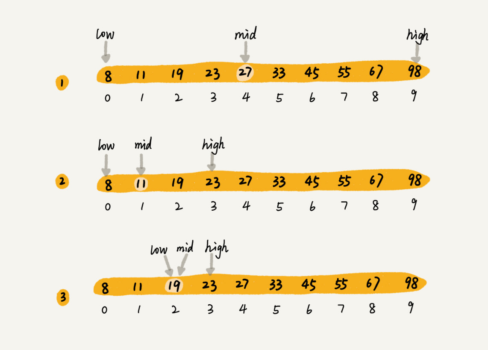

## 总览




#### 名词解释
- k: “桶”的个数
- In-place: 占用常数内存，不占用额外内存
- Out-place: 占用额外内存
- 稳定: 排序后2个相等键值的顺序和排序之前它们的顺序相同

## 冒泡排序

> 循环数组，比较前后元素，较大者往后冒泡。


#### 思路

- 第一次循环后，最后一个数为数组的最大数。
- 下一次循环继续上面操作，不循环已排序好的数。
- 优化：设置标志位complete，当一次循环没有发生冒泡，表示排序完成，跳出循环并返回。

#### 代码实现
  ```js
  // 第一层i < len - 1      因为最后一次就只有一个数，不用再循环了。
  // 第二层j < len - 1 - i  忽略尾部已经排好序的i项(也就是较大值)。
  function bubbleSort(arr) {
    let len = arr.length;
    for(let i = 0; i < len - 1; i++) {
      let complete = true;
      for(let j = 0; j < len - 1 - i; j++) {
        if(arr[j] > arr[j + 1]) {
          [arr[j], arr[j + 1]] = [arr[j + 1], arr[j]];
          complete = false;
        }
      }
      if(complete) {
        break;
      }
    }
    return arr;
  }
  ```

#### 复杂度和稳定性

- 时间复杂度：平均O(n^2)、最坏O(n^2)、最好O(n)
- 空间复杂度：O(1)
- 稳定性：稳定

## 插入排序

> 类似扑克摸牌后插入，左侧看成有序序列，每次将一个数字插入该序列对应的位置。


#### 思路

- 插入时按从有序序列最右侧比较，比较大的数后移一位。
- 第一层循环从下标1开始，和下标0进行比较
- 当target小于前一位j的值，则互换位置，把大的值后移，target大于j，则退出该次循环。

#### 代码实现
  ```js
  function insertSort(arr) {
    let len = arr.length;
    for(let i = 1; i < len; i++) {
      let target = i;
      for(let j = i - 1; j >= 0; j--) {
        if(arr[target] < arr[j]) {
          [arr[target], arr[j]] = [arr[j], arr[target]];
          target = j;
        } else {
          break;
        }
      }
    }
    return arr;
  }
  ```

#### 复杂度和稳定性

- 时间复杂度：平均O(n^2)、最坏O(n^2)、最好O(n)
- 空间复杂度：O(1)
- 稳定性：稳定

## 选择排序

> 每次循环选后面最小的一个数字放到前面的有序序列。


#### 思路

- i=0开始外层循环，假设下标i为最小坐标minIndex，j=i+1开始内层循环，每次循环如果j的值比最小坐标minIndex的值小，则将最小坐标minIndex替换成j。
- 然后i和最小坐标minIndex互换位置。

#### 代码实现
  ```js
  function selectSort(arr) {
    let len = arr.length;
    for(let i = 0; i < len - 1; i++) {
      let minIndex = i;
      for(let j = i + 1; j < len; j++) {
        if(arr[j] < arr[minIndex]) {
          minIndex = j;
        }
      }
      [arr[minIndex], arr[i]] = [arr[i], arr[minIndex]];
    }
    return arr;
  }
  ```

#### 复杂度和稳定性

- 时间复杂度：平均、最好、最坏均为O(n^2)
- 空间复杂度：O(1)
- 稳定性：不稳定
  - 如[5, 8, 5, 2] 第一次选择最小为2，把2和第一个5交换后，两个5的顺序就变了

#### 以上三种排序总结：

- 选择顺序：插入>冒泡>选择（插入还是比较有用）
- 优点：实现简单，适合小规模数据排序，比较高效。
- 缺点：大规模数据时间复杂度有点高。
- 相同：都是原地排序算法，都是用比较的算法，涉及两种操作，比较和交换。

#### 下面介绍常用的两种O(nlogn)的排序：归并和快排

## 归并排序
> 核心思想是分治，将复杂的数组分解成足够小的数组（只包含一个元素），然后通过合并两个有序数组（单元素数组可认为是有序数组）来达到综合子问题解决方案的目的。


#### 思路
- 将数组从中间分开两个子数组、子数组进行递归的归并排序（调用自己函数进行切割）
- 将两个子数组执行合并函数并返回
- 重点在于合并，那如何合并？
  - 创建一个临时存储数组temp，比较两数组第一个元素，将较小的元素加入临时数组
  - 若左右数组有一个为空，那么此时另一个数组一定大于temp中的所有元素，直接将其所有元素加入temp
#### 代码实现
  ```js
  function mergeSort(arr) {
    let len = arr.length;
    if(len < 2) {
      return arr;
    }
    let mid = Math.floor(len / 2);
    let left = arr.slice(0, mid);
    let right = arr.slice(mid);
    return merge(mergeSort(left), mergeSort(right));
  }

  function merge(left, right) {
    let temp = [];
    console.time('归并排序耗时');
    while(left.length && right.length) {
      if(left[0] < right[0]) {
        temp.push(left.shift());
      } else {
        temp.push(right.shift());
      }
    }
    while(left.length) {
      temp.push(left.shift());
    }
    while(right.length) {
      temp.push(right.shift());
    }
    console.timeEnd('归并排序耗时');
    return temp;
  }
  ```
#### 复杂度和稳定性
- 时间复杂度：平均、最好、最坏均为O(nlogn)
- 空间复杂度：O(n)
- 稳定性：稳定


## 快速排序
> 选择一个目标值，比目标值小的放左边，比目标值大的放右边，目标值的位置已排好，将左右两侧再进行快排。


#### 思路
- 选择一个基准元素target（一般选择第一个数）（动图演示里是选择最后一个数）
- 将比target小的元素移动到数组左边，比target大的元素移动到数组右边
- 返回concat连接target和左侧右侧的数组的递归的快速排序（调用自身函数）
#### 代码实现
  ```js
  function quickSort(arr) {
    let len = arr.length;
    if(len < 2) {
      return arr; //递归出口
    }
    let target = arr[0];
    let left = [];
    let right = [];
    for(let i = 1; i < len; i++) {
      if(arr[i] < target) {
        left.push(arr[i]);
      } else {
        right.push(arr[i]);
      }
    }
    return quickSort(left).concat(target, quickSort(right));
  }
  ```
#### 复杂度和稳定性
- 时间复杂度：平均、最好均为O(nlogn)、最坏O(n^2)
- 空间复杂度：O(logn)
- 稳定性：不稳定

## 二分查找
> 针对的是一个有序的数据集合，查找思想有点类似分治思想。每次都通过跟区间的中间元素对比，将待查找的区间缩小为之前的一半，直到找到要查找的元素，或者区间被缩小为 0。适合处理静态数据。

- 如下图使用二分查找有序数组中的19，low 和 high 表示待查找区间的下标，mid 表示待查找区间的中间元素下标


#### 思路
- 选取start和end的中间值作为mid
- 让target和arr[mid]做比较，如果相等则返回该mid下标
- 若小于中间值，则取(start, mid-1)的区间，返回递归函数
- 若大于中间值，则取(mid+1, end)的区间，返回递归函数
#### 代码实现
  ```js
  // start & mid & end 表示下标, target表示目标元素
  function binarySearch(target, arr, start, end) {
    if(start > end) {
      return -1;  // 未找到返回-1
    }
    let mid = Math.floor((start + end) / 2);
    if(target === arr[mid]) {
      return mid;
    } else if(target < arr[mid]) {
      return binarySearch(target, arr, start, mid - 1);
    } else {
      return binarySearch(target, arr, mid + 1, end);
    }
  }

  let arr = [0, 1, 1, 1, 1, 1, 4, 6, 7, 8]
  console.log(binarySearch(7, arr, 0, arr.length-1)); 
  // 8
  ```
#### 复杂度
- 时间复杂度：平均O(nlogn)

#### 局限性
- 依赖数组（如果使用链表的话，随机访问复杂度很高）
- 针对有序数据（先排好序，排序的时间复杂度最低是 O(nlogn)）
- 经常动态插入或删除的、数据量太大或太小（直接顺序遍历即可）都不适合二分查找

#### 场景
- 如：如何在 1000 万个整数中快速查找某个整数？
- 答：先将1000 万保存在数组中，从小到大排序，再使用二分查找。