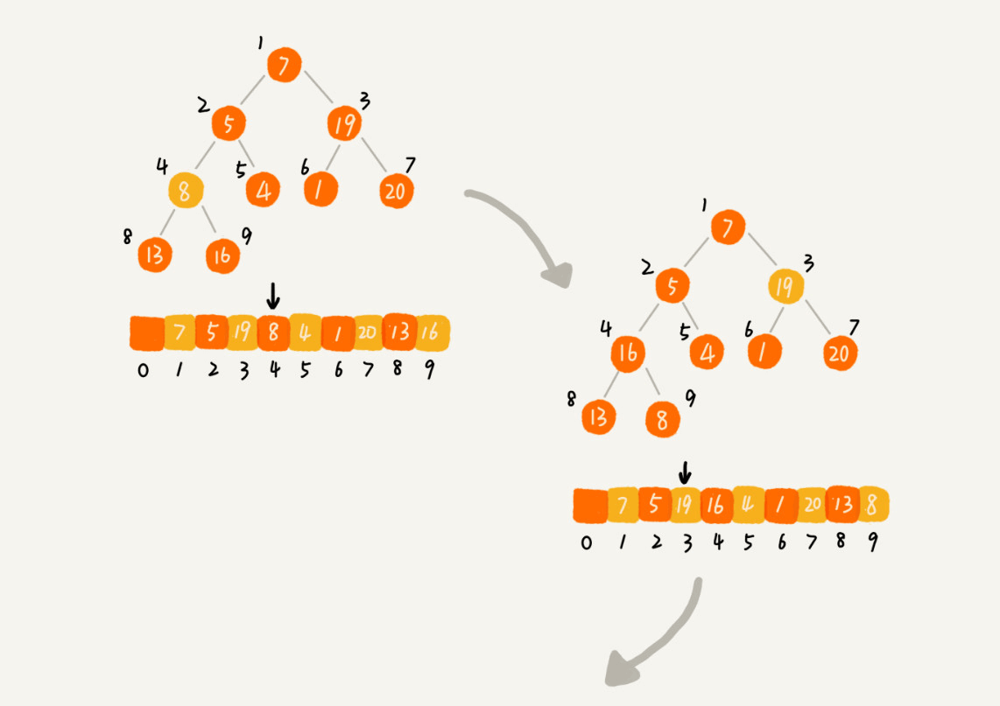
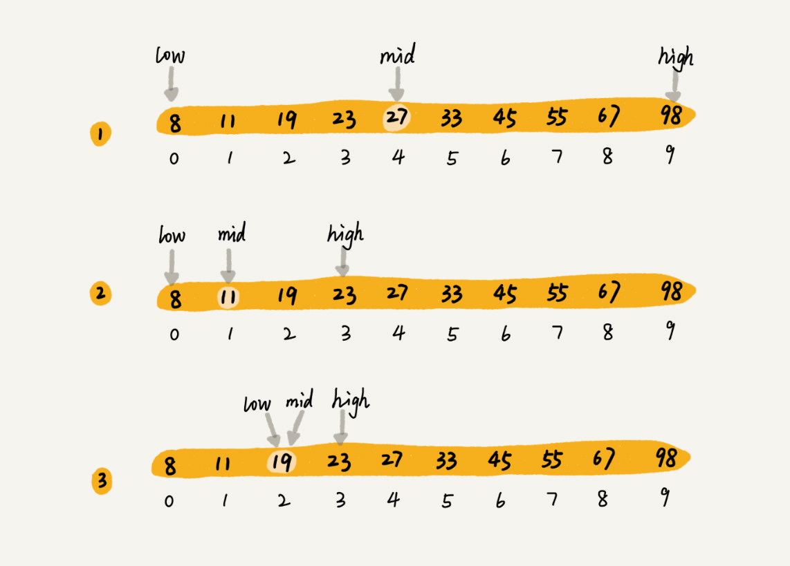

## 总览


#### 名词解释

- k: “桶”的个数
- In-place: 占用常数内存，不占用额外内存
- Out-place: 占用额外内存
- 稳定: 排序后 2 个相等键值的顺序和排序之前它们的顺序相同

## 数组的 sort 方法

> 在 V8 引擎 7.0 版本之前，数组长度小于 10 时， Array.prototype.sort() 使用的是插入排序，否则用快速排序。

> 在 V8 引擎 7.0 版本之后就舍弃了快速排序，因为它不是稳定的排序算法，在最坏情况下，时间复杂度会降级到 O(n2)。

> 而是采用了一种混合排序的算法：TimSort 。

> 在数据量小的子数组中使用插入排序，然后再使用归并排序将有序的子数组进行合并排序，时间复杂度为 O(nlogn) 。

```js
// 按字符串Unicode码点升序
[12, 4, 16, 3].sort()[
  // [12, 16, 3, 4]

  // 其他标准排序需提供比较函数
  (12, 4, 16, 3)
].sort((a, b) => {
  return a - b;
});
// [3, 4, 12, 16]
```

## 打乱数组

1. 不稳定乱序

- 排序后，**大概率分布在自己位置上**，原因是 chrome v8 引擎 sort 源码小于 10 的长度使用插入排序，大于 10 使用快排，数组中每两个元素都要进行比较才是最完全比较，大部分排序算法时间复杂度介于 O(n) 到 O(n^2) ，达不到 n(n-1)的最完全比较次数。

```js
[12, 4, 16, 3].sort(function () {
  return 0.5 - Math.random();
});
```

2. 洗牌算法实现

- 遍历数组项
- 从第二个数开始(i = 1)，选择前面的随机位置(0 或 1)进行交换，直到最后一个数，选择前面任何随机位置进行交换位置。
- 遍历完成，数组完成乱序

```js
const arr = [0, 1, 2, 3, 4];
for (let i = 1; i < arr.length; i++) {
  const random = Math.floor(Math.random() * (i + 1));
  [arr[i], arr[random]] = [arr[random], arr[i]];
}
```

3. 有一组数字，从 1 到 n，中间少了 3 个数，且顺序被打乱。 也就是生成一个 n-3 的数组。

- 思路一：生成顺序数组，洗牌算法打乱，再删除其中 3 个数

```js
const f1 = function (n) {
  let arr = Array.from({ length: n }, (x, i) => i + 1); //Array.from接收对象，带map函数生成数组
  for (let i = 1; i < arr.length; i++) {
    // 洗牌算法打乱
    const random = Math.floor(Math.random() * (i + 1));
    [arr[i], arr[random]] = [arr[random], arr[i]];
  }
  for (let j = 0; j < 3; j++) {
    arr.splice(Math.random() * (n - j), 1); //切割时注意边界变化
  }
  return arr;
};
console.log(f1(6));
// [6, 3, 5]
```

- 思路二：生成顺序数组，随机抽取 n-3 个数，保存在新数组

## 冒泡排序

> 循环数组，比较前后元素，较大者往后冒泡。


#### 思路

- 第一次循环后，最后一个数为数组的最大数。
- 下一次循环继续上面操作，不循环已排序好的数。
- 优化：设置标志位 complete，当一次循环没有发生冒泡，表示排序完成，跳出循环并返回。

#### 简单实现

```js
function bubbleSort(arr) {
  const len = arr.length;
  for (let i = 0; i < len; i++) {
    // 总共多少个元素要执行比较
    for (let j = 0; j < len - 1; j++) {
      // 当前元素要和后面多少元素比较
      if (arr[j] > arr[j + 1]) {
        [arr[j], arr[j + 1]] = [arr[j + 1], arr[j]];
      }
    }
  }
  return arr;
}
```

#### 优化代码实现

```js
// 第一层i < len - 1      因为最后一次就只有一个数，不用再循环了。
// 第二层j < len - 1 - i  忽略尾部已经排好序的i项(也就是较大值)。
function bubbleSort(arr) {
  const len = arr.length;
  for (let i = 0; i < len - 1; i++) {
    let complete = true;
    for (let j = 0; j < len - 1 - i; j++) {
      if (arr[j] > arr[j + 1]) {
        [arr[j], arr[j + 1]] = [arr[j + 1], arr[j]];
        complete = false;
      }
    }
    if (complete) {
      break;
    }
  }
  return arr;
}
```

#### 复杂度和稳定性

- 时间复杂度：平均 O(n^2)、最坏 O(n^2)、最好 O(n)
- 空间复杂度：O(1)
- 稳定性：稳定

## 插入排序

> 类似扑克摸牌后插入，左侧看成有序序列，每次将一个数字插入该序列对应的位置。


#### 思路

- 插入时按从有序序列最右侧比较，比较大的数后移一位。
- 第一层循环从下标 1 开始，和下标 0 进行比较
- 当 target 小于前一位 j 的值，则互换位置，把大的值后移，target 大于 j，则退出该次循环。

#### 代码实现

```js
function insertSort(arr) {
  let len = arr.length;
  for (let i = 1; i < len; i++) {
    let target = i;
    for (let j = i - 1; j >= 0; j--) {
      if (arr[target] < arr[j]) {
        [arr[target], arr[j]] = [arr[j], arr[target]];
        target = j;
      } else {
        break;
      }
    }
  }
  return arr;
}
```

#### 复杂度和稳定性

- 时间复杂度：平均 O(n^2)、最坏 O(n^2)、最好 O(n)
- 空间复杂度：O(1)
- 稳定性：稳定

## 选择排序

> 每次循环选后面最小的一个数字放到前面的有序序列。


#### 思路

- i=0 开始外层循环，假设下标 i 为最小坐标 minIndex，j=i+1 开始内层循环，每次循环如果 j 的值比最小坐标 minIndex 的值小，则将最小坐标 minIndex 替换成 j。
- 然后 i 和最小坐标 minIndex 互换位置。

#### 代码实现

```js
function selectSort(arr) {
  let len = arr.length;
  for (let i = 0; i < len - 1; i++) {
    let minIndex = i;
    for (let j = i + 1; j < len; j++) {
      if (arr[j] < arr[minIndex]) {
        minIndex = j;
      }
    }
    [arr[minIndex], arr[i]] = [arr[i], arr[minIndex]];
  }
  return arr;
}
```

#### 复杂度和稳定性

- 时间复杂度：平均、最好、最坏均为 O(n^2)
- 空间复杂度：O(1)
- 稳定性：不稳定
  - 如[5, 8, 5, 2] 第一次选择最小为 2，把 2 和第一个 5 交换后，两个 5 的顺序就变了

#### 以上三种排序总结：

- 选择顺序：插入>冒泡>选择（插入和选择比较快，冒泡最慢，但选择不稳定）
- 优点：实现简单，适合小规模数据排序，比较高效。
- 缺点：大规模数据时间复杂度有点高。
- 相同：都是原地排序算法，都是用比较的算法，涉及两种操作，比较和交换。

#### 下面介绍常用的两种 O(nlogn)的排序：归并和快排

## 归并排序

> 核心思想是分治，将复杂的数组分解成足够小的数组（只包含一个元素），然后通过合并两个有序数组（单元素数组可认为是有序数组）来达到综合子问题解决方案的目的。


#### 思路

- 将数组从中间分开两个子数组、子数组进行递归的归并排序（调用自己函数进行切割）
- 将两个子数组执行合并函数并返回
- 重点在于合并，那如何合并？
  - 创建一个临时存储数组 temp，比较两数组第一个元素，将较小的元素加入临时数组
  - 若左右数组有一个为空，那么此时另一个数组一定大于 temp 中的所有元素，直接将其所有元素加入 temp

#### 代码实现

```js
function mergeSort(arr) {
  let len = arr.length;
  if (len < 2) {
    return arr;
  }
  let mid = Math.floor(len / 2);
  let left = arr.slice(0, mid);
  let right = arr.slice(mid);
  return merge(mergeSort(left), mergeSort(right));
}

function merge(left, right) {
  let temp = [];
  console.time("归并排序耗时");
  while (left.length && right.length) {
    if (left[0] < right[0]) {
      temp.push(left.shift());
    } else {
      temp.push(right.shift());
    }
  }
  while (left.length) {
    temp.push(left.shift());
  }
  while (right.length) {
    temp.push(right.shift());
  }
  console.timeEnd("归并排序耗时");
  return temp;
}
```

#### 复杂度和稳定性

- 时间复杂度：平均、最好、最坏均为 O(nlogn)
- 空间复杂度：O(n)
- 稳定性：稳定

## 快速排序

> 选择一个目标值，比目标值小的放左边，比目标值大的放右边，目标值的位置已排好，将左右两侧再进行快排。


#### 思路

- 选择一个基准元素 target（一般选择第一个数）
- 将比 target 小的元素移动到数组左边，比 target 大的元素移动到数组右边
- 返回 concat 连接 target 和左侧右侧的数组的递归的快速排序（调用自身函数）

#### 代码实现

```js
function quickSort(arr) {
  const len = arr.length;
  if (len < 2) {
    return arr; //递归出口
  }
  const target = arr[0];
  const left = [];
  const right = [];
  for (let i = 1; i < len; i++) {
    if (arr[i] < target) {
      left.push(arr[i]);
    } else {
      right.push(arr[i]);
    }
  }
  return [...quickSort(left), target, ...quickSort(right)];
}
```

#### 复杂度和稳定性

- 时间复杂度：平均、最好均为 O(nlogn)、最坏 O(n^2)
- 空间复杂度：O(logn)
- 稳定性：不稳定

## 堆排序

> 实际：快排性能比堆排序更好，虽然时间复杂度都是 O(n logn)，原因是堆排序的比较次数比快排多。

- 两步：建堆、排序
  
  
  
- 思路： 三个函数：建大顶堆、堆化函数、排序函数

  - 建大顶堆：从 n / 2 - 1 的坐标开始，直到[0]，每个值循环从上往下堆化（下沉）。
  - 堆化函数：i = 2 \* target + 1 的坐标开始，表示左子节点，i + 1 表示右子节点，判断左右节点谁大。target 值和孩子的大节点比较，若小于孩子，则交换位置，将 target 设为孩子的节点，也就是 i，继续下次循环。直到超出数组长度。
  - 排序函数：先根据传入的 arr 创建大顶堆，循环交换第一个和最后一个元素，调整大顶堆，每次长度-1，直到元素全部排完，返回 arr。

  ```js
  // 建堆函数
  function createHeap(arr) {
    let len = arr.length;
    let start = parseInt(len / 2) - 1;
    // 从n / 2 - 1的坐标开始，其他为叶子坐标。
    for (let i = start; i >= 0; i--) {
      adjust(arr, i, len);
    }
  }
  // 向下堆化函数
  function adjust(arr, target, len) {
    for (let i = 2 * target + 1; i < len; i = 2 * i + 1) {
      // 找到target的左右子节点中较大的一个
      if (i + 1 < len && arr[i + 1] > arr[i]) {
        i = i + 1;
      }
      // 满足条件则下沉，交换位置，target变为下一个位置，不满足则退出for循环。
      if (arr[i] > arr[target]) {
        [arr[i], arr[target]] = [arr[target], arr[i]];
        target = i;
      } else {
        break;
      }
    }
  }
  // 堆排序函数
  function heapSort(arr) {
    createHeap(arr);
    // 打印大顶堆
    console.log(arr);
    // 循环交换第一个和最后一个元素，调整大顶堆，每次长度-1
    for (let i = arr.length - 1; i > 0; i--) {
      [arr[i], arr[0]] = [arr[0], arr[i]];
      adjust(arr, 0, i);
    }
    return arr;
  }

  let arr = [7, 5, 19, 8, 4, 1, 20, 13, 16];
  heapSort(arr);
  // 建好的大顶堆
  // [20, 16, 19, 13, 4, 1, 7, 5, 8]
  // 完成堆排序
  // [1, 4, 5, 7, 8, 13, 16, 19, 20]
  ```

#### 复杂度和稳定性

- 时间复杂度：平均、最好、最坏均为 O(nlogn)
- 空间复杂度：O(1)
- 稳定性：不稳定

## 二分查找

> 针对的是一个有序的数据集合，查找思想有点类似分治思想。每次都通过跟区间的中间元素对比，将待查找的区间缩小为之前的一半，直到找到要查找的元素，或者区间被缩小为 0。适合处理静态数据。

- 如下图使用二分查找有序数组中的 19，low 和 high 表示待查找区间的下标，mid 表示待查找区间的中间元素下标



#### 思路

- 选取 start 和 end 的中间值作为 mid
- 让 target 和 arr[mid]做比较，如果相等则返回该 mid 下标
- 若小于中间值，则取(start, mid-1)的区间，返回递归函数
- 若大于中间值，则取(mid+1, end)的区间，返回递归函数

#### 代码实现

```js
// start & mid & end 表示下标, target表示目标元素
function binarySearch(target, arr, start, end) {
  if (start > end) {
    return -1; // 未找到返回-1
  }
  let mid = Math.floor((start + end) / 2);
  if (target === arr[mid]) {
    return mid;
  } else if (target < arr[mid]) {
    return binarySearch(target, arr, start, mid - 1);
  } else {
    return binarySearch(target, arr, mid + 1, end);
  }
}

let arr = [0, 1, 1, 1, 1, 1, 4, 6, 7, 8];
console.log(binarySearch(7, arr, 0, arr.length - 1));
// 8
```

#### 复杂度

- 时间复杂度：平均 O(nlogn)

#### 局限性

- 依赖数组（如果使用链表的话，随机访问复杂度很高）
- 针对有序数据（先排好序，排序的时间复杂度最低是 O(nlogn)）
- 经常动态插入或删除的、数据量太大或太小（直接顺序遍历即可）都不适合二分查找

#### 场景

- 如：如何在 1000 万个整数中快速查找某个整数？
- 答：先将 1000 万保存在数组中，从小到大排序，再使用二分查找。
