## 输入URL到看到页面发生什么

> DNS解析 -> TCP连接 -> http请求/响应 -> 浏览器解析渲染 -> 连接结束

1. 浏览器根据请求的URL交给DNS域名解析，通过域名找到真实IP；
2. TCP连接三次握手
    - 客户端向服务器发送一个建立连接的请求 syn（您好，我是A）
    - 服务器接到请求后发送同意连接的信号 syn+ack（收到，我是B）；
    - 客户端接到同意连接的信号后，再次向服务器发送确认信号 ack（那我们建立连接了），客户端与服务器建立了连接。
3. 请求：浏览器设置请求报文（请求行、头、主体），发起HTTP请求。
4. 响应: 服务器处理完成后返回响应报文,（起始行（状态码），响应头、主体）浏览器接收文件（HTML、JS、CSS、图象等）；
5. 浏览器对加载到的资源（HTML、JS、CSS等）进行语法解析，建立相应的内部数据结构（如HTML的DOM）；
6. 载入解析好的资源文件，进行渲染UI页面，完成。

- 从总体看优化：
    - 优化目的是将信息**快速并友好**的展示给用户并能够与用户进行交互。
    - 缩短连接时间：DNS优化
    - 减少响应内容大小：进行压缩和懒加载
    - 解析过程：减少回流重绘

### 细节：DNS解析
- 解析过程：
    - 首先在本地域名服务器中查询IP地址，没有找到就去com顶级域名服务器请求查找，找到后把IP地址缓存在本地域名服务器便于下次使用。
        ```
         . -> .com -> google.com. -> www.google.com.
         // 根域名服务器->com顶级域名服务器->一直找到对应的完整域名
        ```
- 优化（减少耗时，一般20-120ms，控制200ms以内）
    - DNS的缓存
        - 多级缓存顺序：浏览器缓存，系统缓存，路由器缓存，IPS服务器缓存，根域名服务器缓存，顶级域名服务器缓存，主域名服务器缓存。
    - dns-prefetch预解析
        - 适用于：引用很多第三方域名的资源的提前解析域名，如taobao。如果资源都在本域名下， 那就作用不大。   
        - 当我们从该 URL 请求一个资源时，就不再需要等待 DNS 的解析过程。
            ```
            <link rel="dns-prefetch" href="//example.com">
            ```
        - 浏览器会对a标签的href自动启用DNS Prefetching，所以a标签里包含的域名不需要在head中手动设置link。
        - HTTPS下不起作用，需要meta来强制开启a标签域名预解析。
            ```
            <meta http-equiv="x-dns-prefetch-control" content="on">
            ```
        
    - DNS的负载均衡
        - 又叫DNS重定向，根据每台机器负载量和距离返回一个合适的IP给用户。(CDN也是利用重定向)


### 细节：TCP三次握手
- 三次握手而不是两次，是因为要保证client和server均让对方知道自己**的接收和发送能力**没问题而保证的最小次数
- 每次握手都会带一个标识 seq，后续的ACK都会**对seq+1**来进行确认，保证每个数据包之间的顺序。
- 三次握手的本质，中间的一次动作是（ACK和SYN）的合并。
- 过程：
    - 客户端向服务器发送一个建立连接的请求 SYN（您好，我是A），客户端为syn_sent状态（主动半打开）
    - 服务器接到请求后发送同意连接的信号 ACK + SYN （收到，我是B），服务器端为syn_rcvd状态（被动半打开）
    - 客户端接到同意连接的信号后，客户端变成Estalished状态，再次向服务器发送确认信号 ACK（那我们建立连接了），服务器变成Estalished状态，客户端与服务器建立了连接。
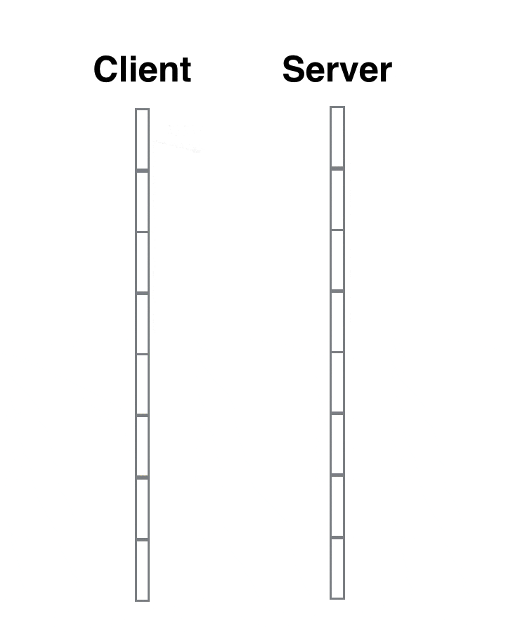

### 细节：TCP数据传输
- 过程：一方发送data，另一方发送ack确认。
- 重传：客户端发送data，服务端没ack，需要TCP重传。
- 去重：服务端收到两次重复data，需要进行去重。
- 双工：双方都可以主动发起数据传输。

### 细节：TCP四次挥手
- 客户端 -- **FIN --> 服务端**， 客户端变成FIN—WAIT-1状态
- 服务端 -- **ACK --> 客户端**，  服务端变成CLOSE-WAIT状态，客户端变成FIN—WAIT-2状态（先回应ACK，等服务端还未发送完的所有报文发送完毕，才能发送FIN，不然还没发完就关闭了）
- 服务端 -- **FIN --> 客户端**， 服务端变成LAST-ACK状态，客户端变成TIME—WAIT状态
- 客户端 -- **ACK --> 服务端**，服务端收到ACK后变成CLOSED状态，**等待2MSL后**（2个报文最大生存时间，每个MSL是2min，共4min），客户端变成CLOSED状态
- 2个MSL: 一个保证最后的ACK能够到对面，一个保证重传的报文能到达。
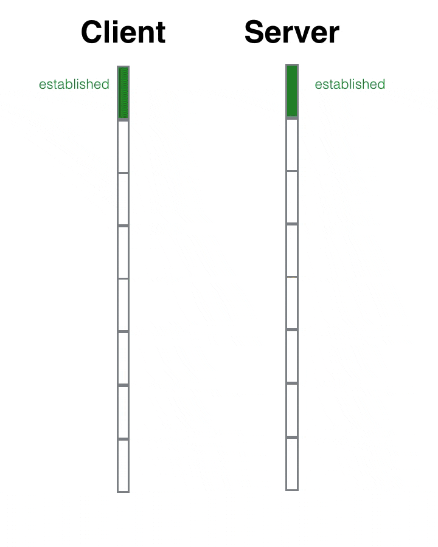

#### 缩写
- SYN：Synchronize 同步
- ACK: 应答，确认
- SYN-SENT：在发送连接请求后等待匹配的连接请求
- SYN-RECEIVED：在收到和发送一个连接请求后等待对连接请求的确认
- FIN：Finally 最终
- Estalished：建立

### 细节：TCP/IP 四(五)层协议
- 应用层(HTTP) -> 传输层(TCP/UDP) -> 网络层(IP和MAC) -> 链路层(驱动)

- 应用层：HTTP
    - TCP/IP 分层中，会话层，表示层，应用层集中在一起
    - 网络管理通过 SNMP 协议
- 传输层：通用的 TCP 和 UDP 协议
    - TCP 协议**面向有连接**，能正确处理丢包，传输顺序错乱的问题，但是为了建立与断开连接，需要至少7次的发包收包，资源浪费
    - UDP **面向无连接**，不管对方有没有收到，如果要得到通知，需要通过应用层
- 网络层：IP和MAC地址
    - 使用 IP 协议，IP 协议基于 IP 转发分包数据
    - IP 协议是个不可靠协议，不会重发
    - IP 协议发送失败会使用ICMP 协议通知失败
    - ARP 解析 IP 中的 MAC 地址，MAC 地址由网卡出厂提供
    - IP 还隐含链路层的功能，不管双方底层的链路层是啥，都能通信
- 链路层：代表驱动
- 物理层：将二进制的0和1和电压高低，光的闪灭和电波的强弱信号进行转换

### 细节：TCP/UDP的区别

- 区别
    - TCP有连接。UDP无连接。
    - TCP可靠，每个包加序号，有流量控制和拥挤机制。UDP不可靠，不关心是否收到，无流量控制和拥挤机制。
    - TCP一对一。UD可一对多、多对一、多对多。
    - TCP传不保留报文边界的字节流。UDP传一个一个报文。
- 场景
    - TCP适合可靠传输。如文件传输
    - UDP适合实时应用。如视频会议、直播

- 具体如下：
- UDP
    - 无连接：不需要握手连接，想发数据就直接发，不会对数据进行拆分和拼接。
        - 在发送端，应用层将数据传递给传输层的 UDP 协议，UDP 只会给数据增加一个 UDP 头标识下是 UDP 协议，然后就传递给网络层了
        - 在接收端，网络层将数据传递给传输层，UDP 只去除 IP 报文头就传递给应用层，不会任何拼接操作
    - 支持一对多，多对多，多对一
    - 不可靠：不关心对方是否正确收到数据、网络不好可能丢包、
    - 头部开销小，传输高效
- TCP
    - TCP 是面向连接的、可靠的流协议。
    - 仅支持一对一
    - 以字节流方式传输
    - 可靠的：为了保证报文传输的可靠，给每个包一个序号，也保证了按顺序接收。
    - 网络拥挤时，减少速率和数量来缓解

### 细节：HTTP传输流
- 发送端在层与层间传输数据时，每经过一层都会被加上首部信息，接收端每经过一层都会删除一条首部。
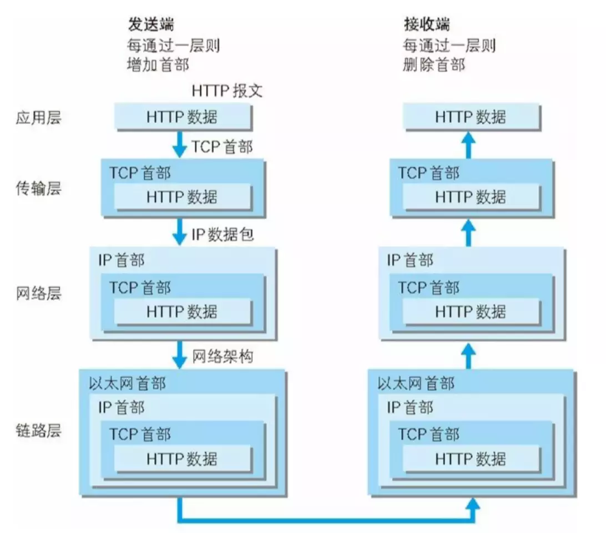

### 细节：TCP和HTTP关系
- TCP协议对应于传输层，而HTTP协议对应于应用层，Http是基于Tcp协议的。
- HTTP会通过TCP建立起一个到服务器的连接通道，当本次请求需要的数据完毕后，HTTP会立即将TCP连接断开，这个过程是很短的。所以HTTP连接是一种短连接，是一种无状态的连接。


### 细节：HTTP请求
- 步骤：
    - 构建HTTP请求报文
    - 通过TCP协议发送到服务器指定端口(HTTP协议80/8080, HTTPS协议443)。
- 请求报文：
    - 请求行
    - 请求报头
    - 请求体(正文)
    
    ```
    // 请求行
    POST /query HTTP/1.1
    // 请求头
    Accept: */*
    Origin: https://juejin.im
    Accept-Encoding: gzip, deflate, br
    Accept-Language: zh-CN,zh;q=0.9,en;q=0.8
    Content-Type: application/json;
    Cookie：Cookie: ab={}; _ga=GA1.2.1711725290.1560907409;
    
    // 如json请求体
    {"operationName":"","query":"","variables":{"type":"ALL","query":"url到页面","after":"","period":"ALL","first":20},"extensions":{"query":{"id":"a53db5867466eddc50d16a38cfeb0890"}}}
    ```

### 细节：HTTP响应
- 步骤：
    - 从端口接收到TCP报文，对请求进行解析
    - 请求处理完后，通过构建响应报文发送会客户端。
- 响应报文：
    - 状态行
    - 响应报头
    - 响应体(正文)

### 细节：HTTP报文结构
- 组成部分：起始行 + 头部(header) + 空行 + 实体(body)
    - 请求报文的起始行(请求行)：方法 + 路径 + http版本 
        ```
        GET /home HTTP/1.1
        ```
    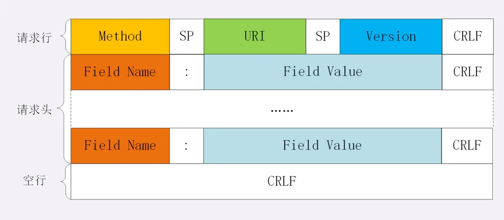
    - 响应报文的起始行(状态行)：http版本 + 状态码 + 原因
        ```
        HTTP/1.1 200 OK
        ```
    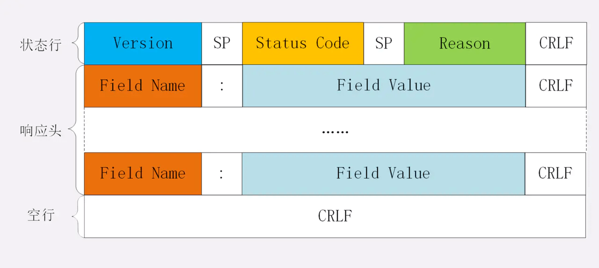
    - 空行：用来分开头部和实体 

### 细节：HTTP报头
- Origin：源
- Referer：来源
- Connection: keep-alive 长连接
- Content-Length: 825 内容长度
- Cookie：凭证
- Accept系列字段：
    - 数据格式：Content-Type
        ```
        // 发送端
        Content-Type: ...
        // 接收端
        Accept: ...
        
        可取值范围：
        text： text/html, text/plain, text/css 等
        image: image/gif, image/jpeg, image/png 等
        audio/video: audio/mpeg, video/mp4 等
        application: application/json, application/javascript, application/pdf, application/octet-stream 等
        ```
    - 压缩方式：Content-Encoding
        ```
        // 发送端
        Content-Encoding: gzip
        // 接收端
        Accept-Encoding: gzip
        ```
    - 支持语言：Content-Language
        ```
        // 发送端
        Content-Language: zh-CN, zh, en
        // 接收端
        Accept-Language: zh-CN, zh, en
        ```
    - 字符集：放在Content-Type中
        ```
        // 发送端
        Content-Type: text/html; charset=utf-8
        // 接收端
        Accept-Charset: charset=utf-8
        ```
    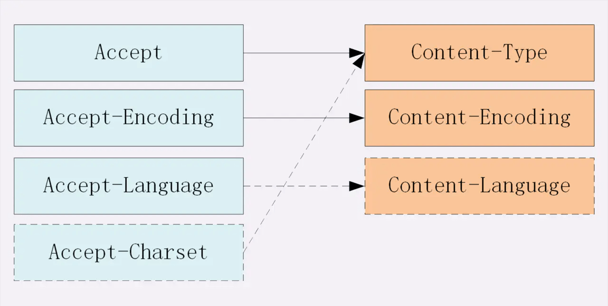

- 响应的强缓存和协商缓存头如：Expires和Cache-Control、 ETag和Last-Modified    
- 其他自定义头如：token


### 渲染UI页面的过程
1. 解析HTML生成DOM树。
2. 解析CSS生成CSS规则树。
3. 将DOM树与CSS规则树合并在一起生成渲染树Render Tree。
4. 遍历渲染树开始布局（Layout），计算每个节点的大小和坐标。
5. 调用GPU进行绘制（Paint），遍历节点，生成渲染层、图形层、再转为位图，绘制到屏幕显示。
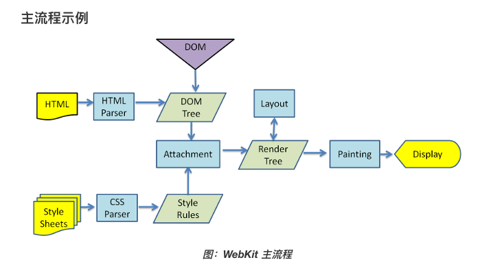

### 细节：HTML建立dom树-词法解析和语法解析
- 词法解析：
    - 生成Tokens: 二进制转为字符串后，浏览器会将HTML字符串解析成Tokens
- 语法解析：
    - 构建Nodes: 开始结束标签配对、添加属性、父子兄弟关系连接，构成DOM Tree

### 细节：CSS规则树如何与dom结合成render树
- 实现：对dom树进行遍历，将css附着对应的元素上
- 顺序：浏览器选择器解析顺序（右->左），性能较好
- 原理：先找最右节点,再向上找对应的类或者标签，一开始就筛除大量不符合条件的节点。

### 重排（回流）和重绘
- 重排（回流）：节点尺寸需要重新计算，重新排列元素，引起局部或整个页面重新渲染
- 重绘：样式发生变化，更新外观内容
- 重绘不一定出现重排
- 重排一定会出现重绘

### 如何触发
- display: none隐藏一个DOM节点 -> 回流和重绘
- visibility: hidden隐藏一个DOM节点 -> 重绘
- 增加、删除、更新dom
- 移动dom或者动画
- 调整窗口大小

### 如何优化
- 集中改变样式
    - 改变class（类名）的方式
        ```js
        // 判断是否是黑色系样式
        const theme = isDark ? 'dark' : 'light'
        // 根据判断来设置不同的class
        ele.setAttribute('className', theme)
        ```
- 离线操作dom：DocumentFragment
    - createDocumentFragment在dom树之外创建游离节点，该节点上批量操作，再插入dom，一次重排
        ```js
        var fragment = document.createDocumentFragment();
        for (let i = 0;i<10;i++){
          let node = document.createElement("p");
          node.innerHTML = i;
          fragment.appendChild(node);
        }
        document.body.appendChild(fragment);
        ```
- 提升至合成层
    - CSS 的 will-change  
        ```css
        #target {
          will-change: transform;
        }
        ```
    - 重绘时只会影响合成层，不会影响其它层
    - transform 和 opacity 效果，不会触发 layout 和 paint
    
### 阻塞问题
- 资源文件异步不阻塞：浏览器在解析过程中，如果遇到请求外部资源时，如图像,iconfont,JS等。请求过程是异步的，并不会影响HTML文档进行加载。
- JS阻塞后续资源下载：当文档加载过程中遇到JS文件，HTML文档会挂起渲染过程，等到文档中JS文件加载完毕+解析+执行完毕，才会继续HTML的渲染过程。因为JS可能会修改DOM结构。
- CSS不影响JS加载，但影响JS的执行。

## HTTP/HTTPS/HTTP2 协议
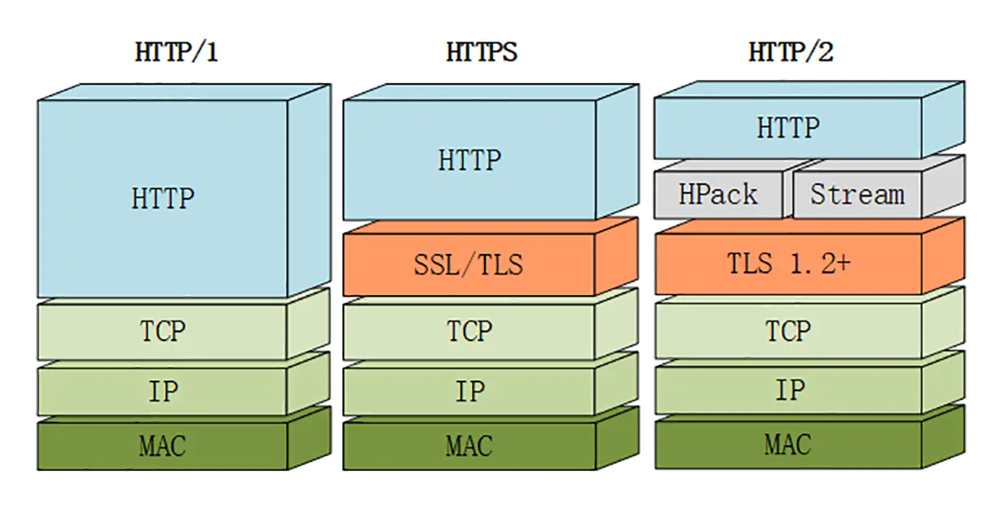
- 主要区别：
    - HTTP1.0【无法复用连接，要手动添加keep-alive】【等待响应后才发送下个请求】
    - HTTP1.1【默认长连接keep-alive可复用】【管道化】【无须等待响应即可请求，但响应顺序要保持一致，导致队头阻塞】
    - HTTP2.0【多路复用】【无须等待响应即可请求，响应顺序无顺序要求】

- HTTP1.0
    - 定义了三种请求方法： GET, POST 和 HEAD方法
    - 无连接：无法复用链接，完成即断开，重新慢启动和 TCP 3次握手，需要手动添加keep-alive达到长连接。
    - 一个TCP连接中，在前一个请求响应到达之后，下一个请求才能发送，如果前一个阻塞，后续的请求也会被阻塞。
- HTTP1.1
    - 新增了五种请求方法：OPTIONS, PUT, DELETE, TRACE 和 CONNECT
    - 默认长连接(Connection: keep-alive):返回本次请求结果后保持连接
        - 减少延迟，无须再握手
        - 较少的CPU和内存的使用
    - 新增功能:
        - 管道化(pipelining)【默认不开启】：基于长连接，管道化可以不等第一个请求响应继续发送后面的请求，也就是一次性发多个请求，但是会存在【队头阻塞】(Head of line blocking)：响应的顺序必须按照请求的顺序返回，如果第一个请求耗时太长，后面的响应也无法提前到达。
        - 断点续传：客户端请求头，RANGE:bytes=XXXX 从XX字节开始传送。服务端响应是 Content-Range 头字段。
        - cache缓存增强（ETag，If-None-Match）
        - 新增状态响应码
        
- HTTP/1.x的问题
    - HTTP/1.x中的存在队头阻塞问题
    - HTTP/1.x大量、重复的请求头在网络上传输，使网络负载了很大一部分本需要传输的数据量。
    - HTTP 1.x 中，如果想并发多个请求，必须使用多个TCP链接，因为管道化默认关闭，是无效的。浏览器为了控制资源，单个域名有6-8个的TCP链接请求限制，如Chrome 最多允许对同一个 Host 域名建立6个 TCP 连接。
    - 为什么不能实现多路复用：HTTP/1.1 是通过文本进行传输，不是二进制传输。由于没有流的概念，在使用并行传输（多路复用）传递数据时，接收端在接收到响应后，并不能区分多个响应分别对应的请求，所以无法将多个响应的结果重新进行组装，也就实现不了多路复用。

- HTTP2相对于HTTP1.x的优势(新特性)
    - 二进制分帧：二进制格式替换之前文本格式传输数据，解析更高效，请求响应消息由一个或多个帧组成，分割为更小的帧，可乱序发送，根据流标示重组。
    - 头部压缩：只发送有差异头部，减少冗余头部数据传输，“首部哈希表”
    - 多路复用(Multiplexing)：同域名下所有通信都在单个TCP连接上，**可以有多条流，每个流都有自己的帧**，避免每次都要建立TCP连接，可以同时发送请求或响应，且不按照顺序。实际就是每个request-response拆分为更小的帧，前面响应耗时太久时，后面响应可以先到达。
    - 服务器推送：发送页面HTML时主动推送JS和CSS资源，不需要等解析到再请求


- HTTP2的头部压缩算法原理
    > 在HTTP1中起始行中的请求方法、URI、状态码，在HTTP2起始行被废弃，一起变为请求头，前面加：以便和其他请求头区分开。
    - HTTP/2 采用了HPACK压缩算法（哈希表+哈夫曼编码），对请求头进行压缩。
    - 首先是在服务器和客户端之间建立哈希表，将用到的字段存放在这张表中，那么在传输的时候对于之前出现过的值，只需要把索引(比如0，1，2，...)传给对方即可，对方拿到索引进行查表就行了。让请求头字段实现精简和复用。
    - 其次如果若索引空间中不存在，对于整数和字符串进行哈夫曼编码然后传输，哈夫曼编码的原理就是先将所有出现的字符建立一张索引表，然后让出现次数多的字符对应的索引尽可能短，传输这样的索引序列，可以达到非常高的压缩率。

- HTTPS是安全版的HTTP，区别如下
    - HTTP协议的数据都是明文传输的，HTTPS的TLS/SSL 进行加密
    - HTTPS需要到CA机构申请证书(一般收费)
    - HTTP是80端口，HTTPS是443端口
- 加密方案
    - 对称密钥：加密和解密同一个密钥，但秘钥容易被截获
    - 非对称密钥：秘钥对= 公钥+私钥，使用公钥加密的只有对应的私钥能解开，私钥加密只有公钥能解开，先将公钥发给对方，对方用公钥加密并返回数据，再用私钥解开。不过RSA算法太慢,影响性能
    - 结合：使用非对称密钥的方法将对称密钥发送给对方，后续用对称密钥解密。
    - 第三方认证CA(数字证书):保证首次将公钥发过去不被中间人篡改
        - 用经过hash的信息生成摘要（包括公钥 + 企业、网站信息），再用私钥加密，成为数字签名。
        - 公钥/信息+签名组合成数字证书
        - 获取数字证书，将原始信息同样hash生成摘要
        - 使用CA公钥解密签名生成的摘要，对比原始信息的摘要是否一致
- HTTPS总流程：
    - 服务器将公钥放在CA用私钥加密的数字证书中
    - 客户端收到数字证书，使用CA的公钥解密证书获取公钥并验证
    - 通过获得的公钥加密客户端生成的对称密钥，发给服务器，服务器用自己的私钥解密获得对称密钥
    - 此后加密连接就使用这个对称密钥进行加密通信。
- 中间人攻击（http中明文数据被窃听、篡改、冒充）

    > 攻击者与通讯的两端分别创建独立的联系, 并交换其所收到的数据, 使通讯的两端认为他们正在通过一个私密的连接与对方直接对话, 但事实上整个会话都被攻击者完全控制. 

    - 客户端发送请求到服务端，请求被中间人截获
    - 服务器向客户端发送公钥
    - 中间人截获公钥，保留在自己手上。然后自己生成一个【伪造的】公钥，发给客户端
    - 客户端收到伪造的公钥后，进行加密对称密钥发给服务器
    - 中间人用自己的私钥解密获得对称秘钥,同时生成假的对称密钥，发给服务器
    - 服务器用私钥解密获得假密钥,然后用假密钥加密数据传输给客户端

## 一个 TCP 连接能发几个 HTTP 请求？
- [知乎参考](https://zhuanlan.zhihu.com/p/61423830)
- HTTP 1.0：一个 TCP 发送一个 HTTP 请求，【默认不开启】长连接，请求发送完毕， TCP 连接断开。
- HTTP 1.1：【默认开启】长连接Connection: Keep-Alive，只要不断开就可以一直发送 HTTP 请求，无上限。只有在请求报头中声明 Connection: close 才会在请求完成后关闭连接。
- HTTP 2.0 ：【多路复用】，一个 TCP 连接可以【并发】多个 HTTP 请求，支持长连接，无上限。

- 多个图片加载问题：
    - HTTPS 连接下，先询问能否使用HTTP2，可以就进入HTTP2。若不是HTTPS，或者HTTPS下HTTP2用不了，进入HTTP 1.1。
    - HTTP 2.0情况下：多路复用
    - HTTP 1.1情况下：一个 HOST 上建立多个 TCP 连接，限制数（一般为6）由浏览器设置。
    - 具体数量：10张
        - HTTP 1.1情况下：6 + 4，可用多域名实现全部一起请求：5个A域图片+5个B域图片。
        - HTTP 2.0情况下：全部并发请求图片。

## 状态码
- 进行一个http请求的时候，我们看到的只是最后服务器返回来的状态码
- 1XX  信息 (服务器收到请求，需要继续处理)
- 2XX 成功
    - 200 OK，表示从客户端发来的请求在服务器端被正确处理 ✨
    - 204 No content，表示请求成功，但没有返回任何内容。
    - 206 Partial Content，客户端通过发送范围请求头Range抓取到资源的部分数据，断点下载/上传
- 3XX 重定向
    - 301 moved permanently，永久性重定向，表示资源已被分配了新的 URL
    - 302 found，临时性重定向，表示资源临时被分配了新的 URL ✨，请求还是原url
    - 304 not modified，未修改，可使用缓存✨（强缓存/协商缓存）
    - 307 temporary redirect，临时重定向，和302含义相同
    - 308 Permanent Redirect 类似301，但不允许浏览器将原本为 POST 的请求重定向到 GET 请求上。
    - 重定向307，308，303，302的区别？
        - 302是http1.0的协议状态码，在http1.1版本的时候为了细化302状态码又出来了两个303和307
        - 303明确表示客户端应当采用get方法获取资源，他会把POST请求变为GET请求进行重定向。
        - 307会遵照浏览器标准，不会从post变为get。
        - 308类似301，不会从post变为get。
- 4XX 客户端错误
    - 400 (错误请求)bad request，请求存在语法错误 ✨
    - 401 (未授权)unauthorized，请求要求身份验证。 ✨
    - 403 (禁止)forbidden，服务器拒绝请求 ✨
    - 404 (未找到)not found，请求的资源不存在 ✨
    - 405 (方法禁用)， 禁用请求中指定的方法。
    - 409 (冲突)Conflict，请求的资源可能引起
    - 415 (支持的媒体类型)请求的格式不受请求页面的支持，如json传成formdata。
- 5XX 服务器错误
    - 500 (服务器内部错误)internal sever error，表示服务器端内部错误 ✨
    - 501 (尚未执行)Not Implemented， 不支持请求的功能（无法完成请求方法）
    - 502 (错误网关) 服务器作为网关或代理，从上游服务器收到无效响应。
    - 503 (服务不可用) service unavailable，服务器暂时处于超负载或正在停机维护(暂时状态)
    - 504 (网关超时) Gateway Time-out， 服务器作为网关或代理，但是没有及时从远端服务器收到请求。
    - 505 (HTTP 版本不受支持)， 服务器不支持请求中所用的 HTTP 协议版本。

## Content-Type
> 取决后端需要什么格式的数据，但是文件必须使用multipart/form-data

- JSON
    - application/json(一般为接口请求和响应数据的头部)
        - 格式为json字符串
            ```js
            {"id":"123","name":"joe"}
            ```
- 三种表单数据编码方式
    - form标签的enctype属性：form表单在发送到服务器时候编码方式
        - 1、`application/x-www-form-urlencoded`。默认的编码方式。其实不是不能上传文件，是只能上传文本格式的文件。
        - 2、`multipart/form-data` 。表单数据有多部分构成，既有文本数据，又有文件等二进制数据的意思。将文件以二进制的形式上传，这样可以实现多种类型的文件上传。
        - 3、`text/plain`。纯文本的传输。空格转换为 “+” 加号，但不对特殊字符编码。
    - application/x-www-form-urlencoded(默认，不可用于文件上传)
        - 键值对格式：`key=value&key=value`
        - get方式放在url后面，用?分割；post放在http body中。
        - 会进行url编码（键值对的参数用&连接；空格转为+加号；字符`"a"-"z"，"A"-"Z"，"0"-"9"，"."，"-"，"*"`，和`"_"`都不会被编码；其他符号(&@#)转为 【% + ASCII十六进制值】如%xy;）
            ```
            First name:Joe&Joan
            Last name:
            如：FirstName=Joe%26Joan&LastName=6+6+6
            ```
    - multipart/form-data(混合资源由多种元素组成，可用于文件上传，或者大数据json传输如埋点)
        - 每个表单控件元素变为独立资源，同时method必须为post方法。
        - 每部分会有http头描述如`Content-Type`(默认为text/plain，表示内容的 MIME 类型，是图片还是文本还是二进制数据)、`Content-Disposition`(form-data表示一个表单元素或者file)、name(表单元素name)、name 表示表单元素的 名称，回车换行后面就是name的值，如果是上传文件就是文件的二进制内容。`boundary`值表示分割符：最后以加上--结尾。
            ```
            // headers
            Content-Type: multipart/form-data; boundary=----WebKitFormBoundary1XNKw5IGSxIzisBM
            
            // Form Data
            ------WebKitFormBoundary1XNKw5IGSxIzisBM
            Content-Disposition: form-data; name="deviceTypeIconFile"; filename="产品图.png"
            Content-Type: image/png
        
            
            ------WebKitFormBoundary1XNKw5IGSxIzisBM
            Content-Disposition: form-data; name="deviceTypeCode"
            
            0x1C
            ------WebKitFormBoundary1XNKw5IGSxIzisBM
            Content-Disposition: form-data; name="deviceType"
            
            空调
            ------WebKitFormBoundary1XNKw5IGSxIzisBM--
            ```


## AJAX
- [XMLHttpRequest](https://developer.mozilla.org/zh-CN/docs/Web/API/XMLHttpRequest)
- 概念：异步JS和XML缩写，现在一般用JSON代替XML。
- 用处：在不刷新页面的情况下，向浏览器发起请求和接受响应，最后局部更新页面。
- 实现：基于XMLHttpRequest对象，可发起HTTP请求，监听readystate的变化获得响应，然后执行刷新。
- 使用：
    ```js
    var xhr = new XMLHttpRequest();      // 声明一个请求对象
    xhr.open('GET', 'url/xxxx', true);   // (默认为true，异步请求)
    xhr.setRequestHeader('Content-Type', 'application/json'); 
    // 设置请求头 xhr.setRequestHeader(header, value);
    xhr.send(null); // get方法 send null(亦或者不传) , post 的 send 则是传递值("firstName=Henry&lastName=Ford")
    
    xhr.onreadystatechange = function() {
        if(xhr.readyState === 4) {     // readyState 4 代表已向服务器发送请求
            if(xhr.status === 200) {   // status 200 代表服务器返回成功
               var json = JSON.parse(xhr.responseText);;  // 这是返回的文本
            } else {
                console.log("Error: "+ xhr.status); // 连接失败的时候抛出错误
            }
        }
    }
    ```
- 优点：无刷新请求数据
- 缺点：浏览器限制不能跨域，跨域看下面的方案。


## Axios使用
- 简介：Axios 是一个基于 promise 的 HTTP 库，可以用在浏览器和 node.js 中。
- 创建axios实例：
    - 单独建个http.js独立维护
    - 引入axios并进行配置
    ```js
    // api/http.js
    import axios from 'axios'
    // 创建 axios 实例
    const Request = axios.create({
      // 配置项
      baseURL: '', // url = base url + request url
      timeout: 120 * 1000 //  请求超时中断：ms  0表示不限制+
      withCredentials: false, // 默认的,表示跨域请求时是否需要使用cookie凭证
      headers: {'X-Requested-With': 'XMLHttpRequest'},// `headers` 是即将被发送的自定义请求头
    })
    // 暴露给外部api去封装自己的接口
    export default Request
    ```
- 配置的优先级
    - 在 lib/defaults.js 找到的库的默认值 < 实例的 defaults 属性 < 请求的 config 参数。
- 拦截器
    - 请求拦截器
        ```js
        Request.interceptors.request.use(
            config => {
                // 配置：如添加请求头，进行token验证
                config.headers['x-requested-with'] = 'XMLHttpRequest'
                return config
            },
            error => {
                // 对请求错误做些什么
                console.log(error)
                return Promise.reject(error);
            }
        )
        ```
    - 响应拦截器
        
        ```js
        Request.interceptors.response.use(
            response => {
                // 配置：如对response.status状态码进行判断，输出错误信息
                const res = response.data
                if (response.status === 200) {
                  return res
                } else {
                  return Promise.reject(new Error(res.message || 'Error'))
                } 
            },
            error => {
                // 拿到错误里的响应体数据
                const { response } = error
                if(response) {
                    // 针对特定的状态码错误，对应处理提示
                    errorHandle(response.status, response.data.message) 
                    return Promise.reject(response)
                } else {
                    return Promise.reject(response)
                }
            }
        )
        ```

- API封装和使用
    ```js
    // .env.production 配置接口地址常量
    
    # base api
    VUE_APP_BASE_API = 'https://3.123.xxx.xxx:28100'
    
    
    // api/pluginManagement/index.js  接口封装的js文件
    
    import Request from '../http.js'
    const domain = process.env.VUE_APP_BASE_API
    // 查询APP列表
    export function queryApp(data) {
      return Request({
        url: `${domain}/appInfo/getAll/page`,
        method: 'post',
        data: data
      })
    }
    
    // product.vue 页面组件使用
    
    import { queryApp } from '@/api/pluginManagement/index'
    queryApp(this.searchForm)
        .then(res => {
          
        })
        .catch(err => {
          
        })
    ```

## 域名
- 一个完整的域名由二个或二个以上部分组成，各部分之间用英文的句号"."来分隔。
- 倒数第一个"."的右边部分称为顶级域名（TLD，也称为一级域名）
- 顶级域名的左边部分字符串到下个"."为止称为二级域名（SLD）
- 二级域名的左边部分称为三级域名，以此类推
- 每一级的域名控制它下一级域名的分配。

## 跨域
- 同源：“协议+域名+端口”三者相同
    - 非同源会被限制：无法完成AJAX请求，无法读写其他域localStorage，非指定域名的Cookie不会发送。
- 不同域之间相互请求资源，就算作“跨域”。
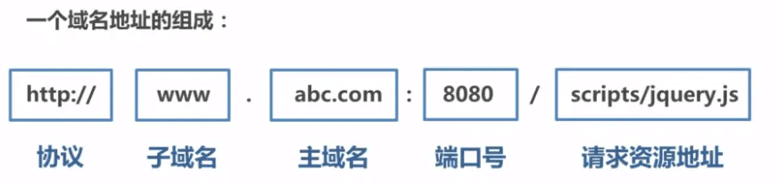

```
URL                                      说明                    是否允许通信
http://www.domain.com/a.js
http://www.domain.com/b.js         同一域名，不同文件或路径           允许
http://www.domain.com/lab/c.js

http://www.domain.com:8000/a.js
http://www.domain.com/b.js         同一域名，不同端口                不允许
 
http://www.domain.com/a.js
https://www.domain.com/b.js        同一域名，不同协议                不允许
 
http://www.domain.com/a.js
http://192.168.4.12/b.js           域名和域名对应相同ip              不允许
 
http://www.domain.com/a.js
http://x.domain.com/b.js           主域相同，子域不同                不允许
http://domain.com/c.js
 
http://www.domain1.com/a.js
http://www.domain2.com/b.js        不同域名                         不允许
```
- 浏览器这些标签不受同源策略
    ```html
    
    <link href=XXX>
    <script src=XXX>
    ```
- 注意：跨域请求能发出去，服务端能收到请求并正常返回结果，只是响应结果被浏览器拦截了
- jsonp
    - 本质：利用`<script>`标签不受同源策略限制的特性进行跨域操作
    - 核心实现：创建script标签发起get请求，前端定义函数，在后端把数据放入回调，然后返回前端执行。
    - 优点：简单就可实现跨域、兼容好
    - 缺点：只支持get请求，`<script>`标签只能get，且容易受xss攻击
    - 具体：创建一个`<script>`标签，src为跨域的API数据接口,声明一个回调函数，window[show]=function(){ resolve(data)}参数值为函数名(如show)在地址中向服务器传递该函数名（可以通过问号传参:?callback=show），服务器特殊处理show(data)返回给客户端，客户端再调用执行回调函数（show），对返回的数据进行操作。
- cors跨域资源共享
    - 主流跨域方案:http头告诉浏览器允许访问不同源服务器上的资源
    - 优点：简单配置即可跨域，支持所有类型的HTTP请求
    - 缺点：某些老旧浏览器不支持CORS
    - 允许该Origin请求，则响应里加入下面的头信息
    - Access-Control-Allow-Origin(简单请求+预检都会返回)：目标源
    - Access-Control-Allow-Methods(预检返回)： 允许的方法
    - Access-Control-Allow-Headers(预检返回)：允许的请求头
    - Access-Control-Max-Age(预检返回)：预检请求的有效期(有效期内不需要再发Option请求,浏览器有自己的最长时间限制，如600s)
- Nginx反向代理
    - 本质：利用服务器之间通信不受同源策略影响
    - 优点：最方便，支持所有浏览器，不需要改代码。
    - 实现：客户端所有请求经过nginx处理，nginx作为代理转发请求给服务器，服务器拿到响应，nginx返回给客户端。
    - 配置nginx.conf
    - add_header Access-Control-Allow-Origin *; 设置nginx允许跨域请求
    - location /api {... proxy_pass http://192.168.0.103:8080; } 转发地址
- vue开发环境的proxy
    - vue-cli3的vue.config.js的devServer的proxy
    - target、changeOrigin、pathRewrite
    - 底层使用了http-proxy-middleware（中间件代理）
        ```js
        module.exports = {
          devServer: {
            proxy: {
              '/api': {
                target: '<url>',
                ws: true,
                changeOrigin: true
              },
              '/foo': {
                target: '<other_url>'
              }
            }
          }
        }
        ```
- postMessage/onmessage
    - 允许来自不同源的脚本采用异步方式进行通信，可以实现跨文本档、多窗口、跨域消息传递。

## CORS
- 简单请求： GET、POST、HEAD 
- 非简单请求：请求方法 PUT和DELETE，或者Content-Type为application/json（POST时常用），或特殊请求头如Token
- 非简单请求（两步走）：浏览器检测到非简单请求，先进行一次预检(OPTIONS)请求，第二步才是真实请求。
    - 请求头包括源 + HTTP方法 + 额外头信息
    - 预检完返回CORS允许请求的头和方法（一般返回所有方法）和源，如果通过则发起请求
    - 预检失败，返回时不包括CORS头信息，浏览器认定失败。
    ```
    // 预检头信息
    Origin: http://api.bob.com
    Access-Control-Request-Method: PUT
    Access-Control-Request-Headers: X-Custom-Header
    // 预检响应
    Access-Control-Allow-Origin: http://api.bob.com
    Access-Control-Allow-Methods: GET, POST, PUT
    Access-Control-Allow-Headers: X-Custom-Header
    
    // 预检通过的再次请求
    Origin: http://api.bob.com
    X-Custom-Header: value
    // 正常响应
    Access-Control-Allow-Origin: http://api.bob.com
    ```
- 如何支持发送cookie（a.com请求 -> b.com的接口）
    - 默认情况下，跨域不携带cookie，所以要进行设置
    - 前端：
        - AJAX请求中打开xhr.withCredentials= true;属性允许发送cookie和接收服务器set-cookie。
    - 服务器：
        - Access-Control-Allow-Credentials：true(服务器同意发送cookie)
        - Access-Control-Allow-Origin就不能设为星号（*），必须指定明确的、与发起跨域请求网页一致的的域名(a.com)。
    - 遵循同源政策：服务器(b.com)设置cookie的才会上传，其他域的cookie不会上传，跨域原网页代码也获取不到服务器设置的cookie

## 正向代理和反向代理
- [解释和优缺点](https://juejin.im/post/5cc26dfef265da037b611738#heading-18)
- 正向代理
    - 代理的对象是客户端、隐藏真实客户端
    - 应用：国外搭建一个代理服务器，代理请求google
- 反向代理(通过负载均衡设备实现)
    - 代理的对象是服务端、隐藏真实服务端
    - 应用：www.baidu.com就是我们的反向代理服务器。Nginx就是性能非常好的反向代理服务器，用来做负载均衡，将过多请求分布给多个真实的服务器。隐藏IP端口号，更安全。

## get和post
- 参数
    - get通过url传输，post通过请求体传输
- 类型
    - get只允许ASCII字符，post无限制
- 限制
    - get有长度限制(浏览器限制)，post无限制，
- 安全
    - get不安全，通过历史记录可查，post安全，数据在请求体里
- 有害
    - get无害，刷新后退不会引起重复提交。
- 幂等性
    - get幂等，post非幂等(幂等表示执行相同的操作，效果一样)
- TCP数据包
    - get一个，post两个(先发header，返回100再发body的数据)
- 场景
    - get一般用于获取资源，post一般用来创建资源。
    - axios的get方法不支持在body传参，只支持params，如果要传递，需要使用post。或者自己xhr封装实现，理论上是可以在body里传，但一般不这么做。

## cookie和session区别
- [知乎参考](https://zhuanlan.zhihu.com/p/63061864)
- 安全性： Session 比 Cookie 安全，Session 是存储在服务器端的，Cookie 是存储在客户端的。
- 存取值的类型不同：Cookie 只支持存字符串数据，想要设置其他类型的数据，需要将其转换成字符串，Session 可以存任意数据类型。
- 有效期不同： Cookie 可设置为长时间保持，比如我们经常使用的默认登录功能，Session 一般失效时间较短，客户端关闭（默认情况下，sessionId被删导致失效的）或者 Session 超时都会失效。
- 存储大小不同： 单个 Cookie 保存的数据不能超过 4K，Session 可存储数据远高于 Cookie，但是当访问量过多，会占用过多的服务器资源。

- 跨域和跨站
    - 首先要理解的一点就是跨站和跨域是不同的。同站(same-site)/跨站(cross-site)」和第一方(first-party)/第三方(third-party)是等价的。但是与浏览器同源策略（SOP）中的「同源(same-origin)/跨域(cross-origin)」是完全不同的概念。
    - 同源策略的同源是指两个 URL 的协议/主机名/端口一致。例如，www.taobao.com/pages/...，它的协议是 https，主机名是 www.taobao.com，端口是 443。
同源策略作为浏览器的安全基石，其「同源」判断是比较严格的，相对而言，Cookie中的「同站」判断就比较宽松：只要两个 URL 的 eTLD+1 相同即可，不需要考虑协议和端口。其中，eTLD 表示有效顶级域名，注册于 Mozilla 维护的公共后缀列表（Public Suffix List）中，例如，.com、.co.uk、.github.io 等。eTLD+1 则表示，有效顶级域名+二级域名，例如 taobao.com 等。
    - 举几个例子，www.taobao.com 和 www.baidu.com 是跨站，www.a.taobao.com 和 www.b.taobao.com 是同站，a.github.io 和 b.github.io 是跨站(注意是跨站)。


## cookie、sessionStorage、localStorage
- 共同点：都是保存在浏览器端，同源。
- 生命周期：
    - cookie：可设置失效时间，没有设置的话，默认是关闭浏览器后失效
    - sessionStorage： 仅在当前网页会话下有效，关闭页面或浏览器后就会被清除。
    - localStorage：除非被手动清除，否则将会永久保存。
- 存放数据大小：
    - cookie：4KB左右
    - localStorage和sessionStorage：可以保存5MB。 
- http请求：
    - cookie：每次都会携带在HTTP头中，浪费带宽，如果使用cookie保存过多数据会带来性能问题
    - localStorage和sessionStorage：仅在客户端（即浏览器）中保存，不参与和服务器的通信
- 应用：
    -  cookie一般用于验证用户登录信息、个性化设置、购物车
    -  其他情况大部分用storage（jwt、token、健康打卡缓存）

- 共享：
    - sessionStorage同源下也其他窗口无法共享
    - cookie、localStorage所有同源窗口中都是共享的
        - 每次 localStorage 中有任何变动都会触发一个 storage 事件，所有窗口都监听这个事件，一旦有窗口更新 localStorage，其他窗口都会收到通知


## 缓存策略
> 好的缓存策略不仅可以优化网站性能、提高用户体验；还能控制更少请求和更少流量，节省成本。

- 缓存策略可分为 强缓存 和 协商缓存（未过期时，直接使用强缓存，过期使用协商缓存）
    - 客户端请求资源，服务端设置`Cache-Control`和`ETag`，在强缓存没过期时，直接使用本地缓存200`from cache`，过期了才发起请求询问是否有新资源，有则拉取新资源。
    - 协商缓存，下次请求头携带，传给服务器对比，若有更改，则返回新资源200，若无更改，则返回304`Not Modified`，使用本地缓存即可。
    - 不加Cache-Control的情况：
        - 默认强缓存Expires = (响应头Date - Last-Modified) * 10%
        - 响应头的Date时间与`Last-Modified`的时间差的十分之一作为缓存的过期时间
- 强缓存
    - `Cache-Control`(缓存的时间长度)(优先)(HTTP / 1.1)
        - `Cache-Control:max-age=600`（单位s）
        - `Cache-Control`:
            - `no-cache`，允许缓存，但每次都和服务器协商,验证是否新鲜。相当于max-age=0
            - `no-store`，不会缓存，每次都去拉资源。
            - `private`，仅客户端可以缓存
            - `public`，客户端和代理服务器都可以缓存
    - `Expires`(特定过期时间))(http1.0)
        - `expires`: Wed, 07 Aug 2019 23:15:20 GMT
        - 到期时间是服务器端的时间，客户端时间可修改，有误差
- 协商缓存
    - `ETag`(唯一标识)(优先)
        - `ETag`(response 携带)根据hash或size/mtime :"50b1c1d4f775c61:df3"
        - `If-None-Match`(再次请求由request携带，上一次返回的 Etag)
    - `Last-Modified`(最后一次修改时间mtime)
        - `Last-Modified`(response携带) : Wed, 21 Oct 2015 07:28:00 GMT
        - `If-Modified-Since` (再次请求由request携带，上一次返回的Last-Modified)
        - 周期修改但内容没变，缓存会失效
        - s以内的改动监测不到
        
- 最佳实践：
    - 两种情况：
        - 不带hash(指纹)的资源：每次都使用协商缓存，进行新鲜度校验。
        - 带hash(指纹)的资源：使用强缓存，一年过期时间，即 31536000秒，可以认为永久缓存。
    - 不带hash(指纹)的资源：如**index.html**
        - `Cache-Control：no-cache`，每次都去协商，校验资源是否过期，没有过期则返回304`Not Modified`，继续使用本地缓存。
    - 带hash(指纹)的资源：如**JS、CSS等**
        - `Cache-Control：31536000`，设置一年过期，在此期间不发送请求。当资源内容发生变化，webpack打包为文件添加新hash值，导致hash变化后，会发起新的请求请求最新的资源。
        - 切割缓存：当所有js打包在一个文件里时，只要一个小更改，整个包缓存就会失效，所以要分开。
            - 每个页面独立分开
            - 不常用第三方且较大的模块(更新频率低)，单独打包，如echarts。
            - 常用的第三方模块(更新频率高)，集中打包在一起，如lodash放在vendor。

    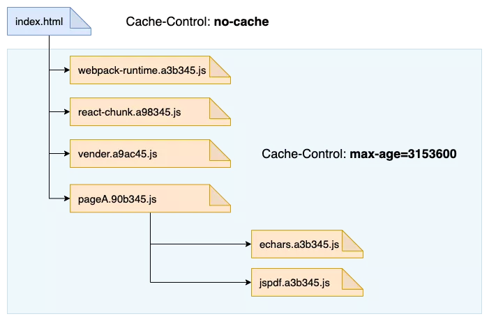

## 鉴权相关
- 几种方式
    - cookie和session：用户登录后，服务端保存用户信息在session中，将对应的sessionId通过set-cookie保存在客户端，客户端每次携带包含sessionId的cookie，服务端进行验证。
    - Token: 用id+时间戳+hash生成一串token，通过请求响应给客户端，客户端进行保存，每次请求在header上携带，服务器验证，避免CSRF攻击。
    - JWT: 包含了用户信息，服务端进行解密即可获取该用户信息，无需查数据库或者少查。
    - SSO: 单点登录，常用CAS 中央认证服务

### cookie和session
- cookie注意
    - 用途：
        - 会话状态管理（如用户登录状态、购物车、游戏分数或其它需要记录的信息）
        - 个性化设置（如用户自定义设置、主题等）
        - 浏览器行为跟踪（如跟踪分析用户行为等）
    - 无法跨域
    - HttpOnly：禁止js通过 document.cookie 读取cookie（提高安全性，防范xss攻击）
    - Secure 设为true，在HTTPS才有效
    - MaxAge表示失效时间（秒），负数表示临时 cookie，关闭浏览器就删除。默认-1，为0表示删除。
    - Expires 设置过期时间，以客户端时间为准。不设置表示临时cookie，保存在客户端内存，关闭浏览器失效。
    - Domain 指定cookie所属域名，默认为当前主机，如使用单点登录时设置为二级域名`.taobao.com`，子域名下(`a.taobao.com` 还是 `b.taobao.com`)都可以使用该cookie，自动发送cookie，携带登录信息。注意：不能跨域设置 Cookie，只能设置跟自己同域的。
    - Path 指定了一个 URL 路径，子路径也会匹配，该路径下的可接收cookie。比如设置 `Path=/docs`，`/docs/Web/` 下的资源会带 Cookie 首部，`/test` 则不会携带 Cookie 首部。
    - **SameSite：主流浏览器得到支持，在 Chrome80 版本之前是none，之后默认屏蔽了第三方的 Cookie（Lax）**
        - SameSite 属性可以让 Cookie 在跨站请求时不会被发送，从而可以阻止跨站请求伪造攻击（CSRF）。
        - Strict 这个 Cookie 在任何情况下都不可能作为第三方 Cookie，跨站请求不能携带（即使CORS也行不通）。
        - Lax 允许部分第三方请求携带 Cookie（比如get）
        - None 无论是否跨站都会发送 Cookie  
        - 影响：Post 表单，iframe（广告），AJAX，Image（埋点），`<script>`（jsonp）不发送三方 Cookie
        - 改造：SameSite=none，允许同站、跨站请求携带该cookie
        - 注意：SameSite=none，不支持HTTP，需要设置cookie的Secure属性，只有在HTTPS协议才发送。
    - 三方cookie
        - 通常cookie的域和浏览器地址的域匹配，这被称为第一方cookie。那么第三方cookie就是cookie的域和地址栏中的域不匹配。
        - 用途：前端日志打点监控、行为分析、广告推荐
        - 实现：A站写入第三方cookie(域名为第三方)，页面操作过程将携带第三方cookie向第三方域发起请求，第三方域获取到数据。(如请求第三方广告商网站的图片，响应成功顺便设置第三方cookie，去另一个网站，还是请求同个广告商图片，会将这个第三方cookie发送到广告商，这样会收集到用户的数据)
        - 现状：Firefox、Safari 默认禁止、Chrome —— SameSite Cookie、2022将全面禁止
        - 解决：转成一方cookie（js操作document.cookie设置第三方cookie，而不是set-cookie，请求将cookie放在请求参数中，而不是放在cookie中，模拟三方cookie的标识用户的过程），不过第三方sdk能获取信息就更多，风险大。
    - 服务器创建cookie
        - 通过Set-cookie响应头(一次Set一个cookie)
            ```
            Set-Cookie: <cookie-name>=<cookie-value>; Expires=<date>; Domain=<domain-value>; Path=<path-value>; Secure; HttpOnly; SameSite=Lax
            ```
    - 通过JS创建cookie
        - 可添加过期日期expires、可添加path设置路径（默认属于当前页）
            ```js
            document.cookie = "username=Joe; expires=Sun, 31 Dec 2017 12:00:00 UTC; path=/";
            ``` 
           
- session注意
    - session 是基于 cookie 实现的，session 存储在服务器端，sessionId 会被存储到客户端的cookie 中
    - session失效两种情况
        - 一是cookie是会话有效，关闭浏览器，sessionid被清理。
        - 二是服务器设置session失效时间，到期就清理掉该session
    - 用户比较多时，数据大占内存，**给session设置失效时间**，定期清理过期的session
    - 集群部署，多台服务器要做session共享
        - 可通过复制，广播给其他节点来同步session
            - 网络负荷压力大
        - 或者更优的分布式缓存方案Redis（集群） 来缓存 session
            - 方便扩展、跨平台
        - session 持久化
            - 数据库压力大
    - 如果cookie被禁止，sessionId可在url参数后传递。

### Token和JWT
- Access Token注意（令牌）
    - uid+time+sign（用户标识+时间戳+哈希签名）
    - 服务器签发token，客户端保存localStorage或者cookie ，每次请求放在header上，服务器接收验证。
    - 可避免CSRF攻击
    - 移动端常用，一般Access Token设置一周，Refresh Token一个月
    - Refresh Token 设置更长有效期，当Access Token过期，可通过携带Refresh Token去请求新的Acesss Token。当Refresh Token过期只能重新登录 了 
- JWT注意（JSON Web Token）
    - Header（头部）+Payload（负载）+Signature（签名）：字符串：Header.Payload.Signature
      ```
        // Header
        {
          "alg": "HS256",
          "typ": "JWT"
        }
        // Payload
        {
          "sub": "1234567890",
          "name": "John Doe",
          "admin": true
        }
        // Signature
          HMACSHA256(
              base64UrlEncode(header) + "." +
              base64UrlEncode(payload),
              secret)
      ```
    - 服务器签发token，客户端保存localStorage或者cookie ，每次请求放在header上的Authorization ，服务器接收解密验证。
    - 优点：无状态认证，不保存session数据，降低查询数据库次数，服务器认方便扩展
    - 缺点：服务器不保存session，无法废弃某个token，一旦 JWT 签发了，到期之前就会始终有效
    - 减少盗用的方式：使用HTTPS、和 有效期设置短一些
- JWT和token的区别
    - token验证发过来的token后，还要查数据库获取用户信息，验证是否有效。
    - JWT包含用户信息和加密数据，服务端只需要使用密钥解密进行校验，不需要查数据库或者少查。

### 单点登录(SSO)
> 在A系统登录后，去B 、C等系统，已经是登录状态。

主要解决两个问题
- session不共享
    - sessionId对应的用户信息放在redis中
- cookie存在跨域不能发送的问题
    - 同域名：后端可直接获取自动发送过来的cookie中的sessionId
    - 不同子域名：通过将cookie设置在父级域名上，可以使子域名实现共享cookie
    - 完全不同域名：无法直接共享。
        - 可将token存储在localStorage中，然后用postMessage来实现跨域共享。
        - 或可使用cors设置对应域名+xhr配置withCredentials，实现跨域获取cookie，识别用户的登录态。

- CAS 中央认证服务: 通过跳转中间域名的方式来实现登录，多个系统都跳转到这个中间域来认证，同个SSO的cookie可以携带，然后多系统都找SSO验证该用户是否通过。
    - A系统登录：
        - 进入A系统，发现未登录（无sessionId），302重定向跳转到SSO登录页
        - 在SSO登录页通过请求有无SSO的session，来验证是否登录过
        - 未登录，则去SSO登录页，输入密码提交后，SSO验证通过，设置一个SSOsession的key值在cookie中，且将ST放在url上，并302重定向到系统A，系统A请求SSO判断ST是否正确，若正确，SSO发送一些信息给系统A。
        - 系统A设置自己的sessionId存到客户端的cookie，下次访问携带该cookie即可。
    - B系统登录：
        - 系统B进行登录，发现未登录（无sessionId），302重定向跳转到SSO登录页，由于之前登录过，SSO的cookie会自动携带发送，SSO验证通过，将ST放在url上，然后302重定向回系统B，系统B请求SSO判断ST是否正确，正确则返回一些信息给系统B
        - 系统B设置自己的sessionId存到客户端的cookie，下次访问携带该cookie即可。
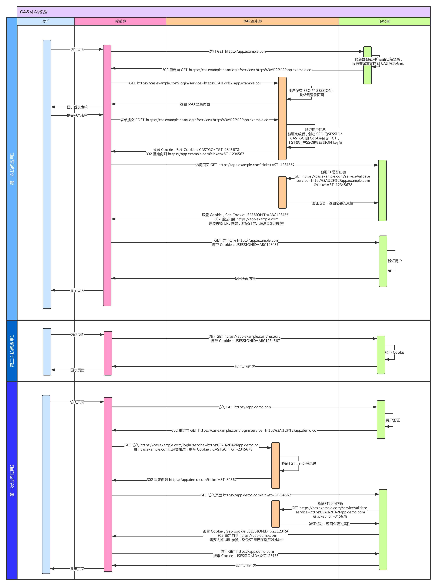

## DOM和BOM

- DOM 指的是文档对象模型
    - 把文档当做一个对象来对待
    - 定义处理页面内容的方法和接口
    - document对象指每个载入浏览器的html文档的只读引用，是window对象的一部分

- BOM 指的是浏览器对象模型
    - 把浏览器当做一个对象来对待
    - 定义了与浏览器进行交互的方法和接口
    - 核心是window全局对象、包含了location(URL相关) 对象、navigator (浏览器类型)对象

## DOM的事件模型
- DOM 0/2/3级别
    ```js
    // DOM0
    element.onclick = function (event) {}
    // DOM2
    element.addEventListener('click', function(event){},false)
    // DOM3
    element.addEventListener('keyup', function(event){},false)
    ```

- DOM2事件模型
    - 捕获和冒泡
    - 三个阶段：第一阶段捕获，第二阶段目标阶段，第三阶段冒泡阶段
    - 捕获流程：window -> document -> html -> body ->... -> 目标元素
    - 冒泡流程：目标元素-> ... -> body-> html -> document -> window
    - 当addEventListener方法的**第三个参数为true时，表示在捕获阶段调用事件处理函数**；**当第三个参数为false，表示在冒泡阶段才调用事件处理函数**（默认情况）

- IE事件模型
    - `attachEvent()`和`detachEvent()`
    - 参数是（事件名称，处理函数）如：`btn.attachEvent('onclick', function(){})`，移除监听时必须是相同的参数，包括事件处理函数。
    - 注意：事件处理函数作用域是全局作用域，而DOM0是所属元素的作用域

- DOM3级事件在DOM2级事件的基础上添加了更多的事件类型,全部类型如下：
    - UI事件，当用户与页面上的元素交互时触发，如：load、scroll、resize
    - 焦点事件，当元素获得或失去焦点时触发，如：blur、focus
    - 鼠标事件，当用户通过鼠标在页面执行操作时触发如：click、dbclick、mouseup
    - 滚轮事件，当使用鼠标滚轮或类似设备时触发，如：mousewheel（已废弃，现为WheelEvent.deltaX横线滚动量）
    - 文本事件，当在文档中输入文本时触发，如：textInput
    - 键盘事件，当用户通过键盘在页面上执行操作时触发，如：keydown、keypress、keyup
    - 合成事件，当为IME（输入法编辑器）输入字符时触发，如：compositionstart

- event对象
    - event.preventDefault() 阻止默认事件（如a标签点击默认跳转）
    - event.stopPropagation() 阻止事件捕获或冒泡（父元素不响应）
    - event.stopImmediatePropagation() 阻止捕获或冒泡，且阻止其他事件执行。如同个按钮两个函数，可在a中阻止b。
    - event.currentTarget 正在处理事件的对象（挂载onclick的对象），总是等于事件处理函数内部this
    - event.target 父元素绑定事件监听子元素，表示被触发的那个子元素。
    - 当挂载监听事件和触发是同个dom，则target和currentTarget和this是同一个。

- 事件代理
    - 概念：事件委托，利用了浏览器事件冒泡的机制。祖先级DOM元素绑定事件，触发子孙DOM元素，事件冒泡至祖先DOM，由祖先的监听函数统一处理多个子元素的事件。
比如列表li的点击事件可以放在ul上注册。
    - 作用：减少事件注册数量，减少内存消耗。适应动态绑定新增的子元素。


## JS 的DOM操作(Node节点获取及增删查改)

示例：
```js
// get Node
var element = document.querySelector('#test');

// 追加
element.appendChild(Node);

// 删除
element.removeChild(Node);

// 查找
element.nextSibling // 获取元素之后的兄弟节点 , 会拿到注释文本,空白符这些
element.nextElementSibling  // 等同, 获取标签(不会拿到注释文本这些)

element.previousSibling // 和上面同理,往前找兄弟节点
element.previousElementSibling

// 改动,比如 属性这些
element.setAttribute(name, value); // 增加属性
element.removeAttribute(attrName); //删除属性

// 来一个简易的练习题,随便一个网页追加插入一块DOM(非覆盖:不能 innerHTML);
/*
<div id="test">
   <span>Hello, World</span>
</div>
*/

// 以上面的例子为例
var test = document.createElement('div');  // 创建一个块级元素
test.setAttribute("id","test"); // 设置其id 属性
var span = document.createElement('span'); // 创建一个 span
span.innerText = "Hello,world"; // 插入 span 的文本内容
test.appendChild(span); // 组合节点

element.appendChild(test); //追加到某个节点区域
```
- 创建新节点
```js
  createDocumentFragment()    //创建一个DOM片段
  createElement()   //创建一个具体的元素
  createTextNode()   //创建一个文本节点
```
- 添加、移除、替换、插入
```js
appendChild(node)
removeChild(node)
replaceChild(new, old)
insertBefore(new, old)
```
- 查找
```js
getElementById();
getElementsByName();
getElementsByTagName();
getElementsByClassName();
querySelector();
querySelectorAll();
```
- 属性操作
```js
getAttribute(key);
setAttribute(key, value);
hasAttribute(key);
removeAttribute(key);
```

## 前端安全

- XSS：跨站脚本攻击
    - 攻击：在URL或者页面输入框中插入恶意JS代码，用户访问时完成攻击，如获取cookie。
    - 存储型：将恶意代码存入服务器的数据库，如发表文章、评论等，访问即会触发，比较危险。属于服务端的安全漏洞。是持久化的。
    - 反射型：引诱点击带恶意代码的url，如带参数的搜索，跳转，服务器响应返回，属于服务端的安全漏洞。是非持久化的。
    - DOM型：构造包含恶意代码的URL，前端取出URL的恶意代码，不小心地执行了该代码，获取用户数据，调用相关接口，属于前端代码漏洞。
    ```html
    <!-- 链接内包含恶意代码 -->
    <a href="代码">1</a>

    <script>
    // setTimeout()/setInterval() 中调用恶意代码
    setTimeout("恶意代码")
    setInterval("恶意代码")
    // location 调用恶意代码
    location.href = '恶意代码'
    </script>
    ```
    - 反射型 XSS 跟存储型 XSS 的区别：存储型 XSS 的恶意代码存在数据库里，反射型 XSS 的恶意代码存在 URL 里。
    - DOM 型 XSS 跟前两种 XSS 的区别：DOM 型 XSS 攻击中，取出和执行恶意代码由浏览器端完成，属于前端 JavaScript 自身的安全漏洞，而其他两种 XSS 都属于服务端的安全漏洞。
    - 防范
        - 设置HttpOnly ：禁止JS读取`document.cookie`，解决XSS后的Cookie劫持攻击。
        - 输入检查：检查用户输入的数据，过滤非法值或者编码再存入服务器（style节点，script节点，iframe节点），可用开源的一些XSS Filter。
        - 输出转义：输出到HTML页面时，潜在威胁的字符`& < > " ' /`进行HTMLEncode编码、转义
        - 合理地限定长度：增加XSS攻击难度
        - DOM型：避免拼接字符串传入一些API，导致代码执行。不要把不可信的数据作为 HTML 插到页面上，例如不使用v-html。
        
- CSRF/XSRF: 跨站请求伪造
    - 攻击：攻击者通过第三方网站（如图片链接src、自动提交的表单）发送跨站请求，访问一个用户曾经认证过的网站（带有cookie），利用登录凭证，请求一些接口执行恶意操作（只借用cookie，不能获取）
    - 防范1：阻止不明外域的访问
        - 同源检测：header里的`Origin`和 `Referer` 字段：服务器判断请求来源，校验该地址是否合法。
        - `Samesite=Strict`: Set-Cookie时将同站cookie属性设为严格模式，表明这个 Cookie 在任何情况下都能作为第三方 Cookie
    - 防范2：提交时要求附加本域才能获取的信息
        - 服务器生成CSRF token（常用）：服务器根据用户信息 哈希算法生成 token 字符串 发给前端，前端存储在localStorage中，再次请求时前端请求头带上token，服务端验证token是否正确（请求头可通过拦截器在接口调用时添加token），一次性有效token，每次接口校验完返回新token。
        - 双重提交Cookie：用户访问后，返回一个随机字符串注入cookie，下次请求时取出，添加到URL参数上，验证与cookie是否一致。
        - 输入验证码：明确当前是本人操作的，用户体验差。

- 网络劫持
    - http劫持（明文修改响应，加广告）：全站HTTPS，将HTTP加密，这使得运营商无法获取明文，就无法劫持你的响应内容

- JSON劫持(JSON Hijacking)
    - 属于CSRF范畴
    - 通过已认证过的凭证，构造jsonp执行跨域请求，获取数据执行回调，将数据通过new Image的方式发送到攻击者的服务器上。造成信息泄露。
    - 防御：
        - API设置为post，因为jsonp只能get
        - 检查请求头表示有ajax发起的请求`X-Requested-With:XMLHttpRequest`
        - 请求的参数加上与后端约定好的签名（带上时间戳）

## CDN「内容分发网络」
[知乎- 闲话 CDN](https://zhuanlan.zhihu.com/p/39028766)
- 最简单的CDN网络：一个DNS 服务器+几台缓存服务器，本质是离得很近的一个缓存。
- 原理：**通过dns服务器来实现优质节点的选择，通过缓存来减少源站的压力。**
- 过程：输入URL -> 本地DNS解析 -> CDN专用DNS服务器(阿里云、腾讯云) -> DNS负载均衡设备 -> 接收请求 -> 转发请求至最优质节点服务器（距离、负载、响应最快）-> 第一次访问该内容 -> 请求源站并缓存 -> 用户获取内容 -> 再次访问 -> 直接从缓存节点中获取内容
- 作用：用户就近获取内容，减轻服务器负载，提高网站响应速度
- 简单来说：将内容从总部分发运到各地仓库，由DNS指向最近的仓库，用户从那里获取内容，但有延迟，不能保证内容是最新的。

## WebSocket

- 轮询和长轮询

> 早期为了实现推送技术，都是使用轮询，每隔一段时间向服务器发出HTTP请求，服务器返回最新的数据。分为轮询和长轮询，轮询数据更新可能有延时。当轮询都是请求-应答模式，服务器无法主动推动消息。
- 优点：兼容性强，实现简单
- 缺点：非常消耗请求资源，影响性能

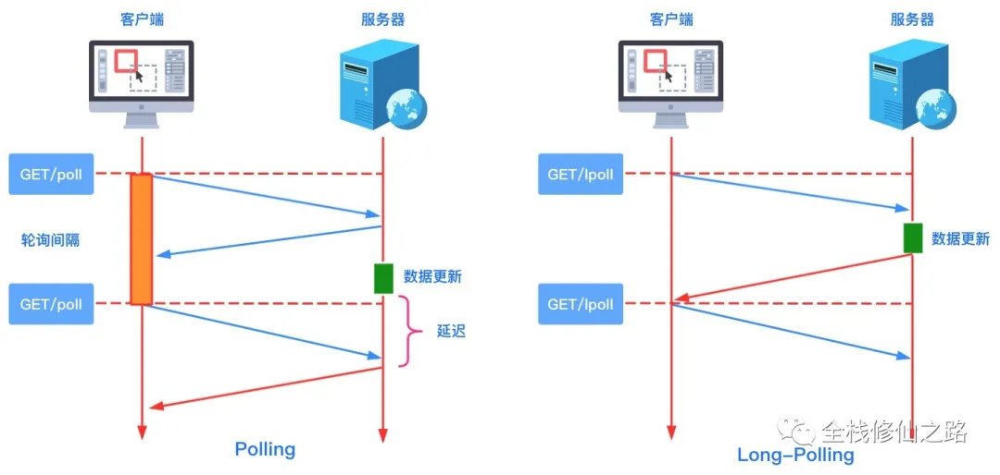

- WebSocket 和 HTTP
    - HTTP通信无状态，且只能由客户端发起
    - WebSocket有状态，全双工TCP通道，服务器也可以主动向客户端推送消息。
    - 主要应用：即时通信、实时音视频、在线教育等
    - 优点:
        - 实时性：服务器可以主动给客户端下发数据
        - 开销少：交换数据时的头部较小
        - 保持状态：是有状态的协议
    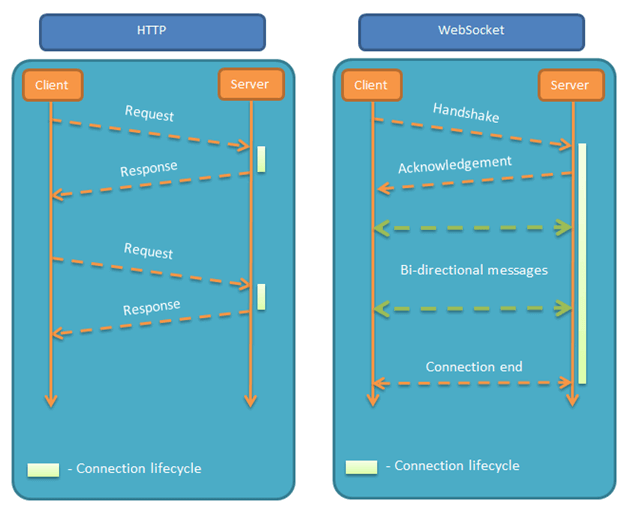

-  WebSocket 与 长轮询
    - 长轮询收到客户端的请求，先挂起，判断数据有更新再响应，无更新等待一定时间再返回。仍然是一问一答（请求 — 响应）的模式
    - WebSocket 在握手成功后，就是全双工的 TCP 通道，数据可以主动从服务端发送到客户端。
    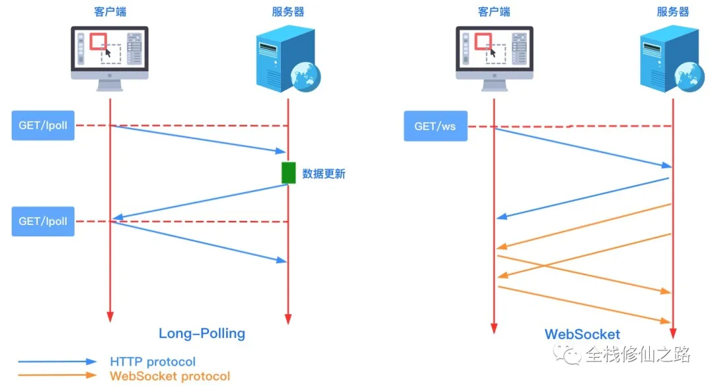

- 特点：
    - 握手阶段采用HTTP协议
    - 无同源限制，客户端可以跟任意服务器通信
    - 协议标识为ws，加密为wss，如ws://example.com:80/some/path


- 客户端的使用
    ```js
    var ws = new WebSocket("wss://echo.websocket.org");
    
    ws.onopen = function(evt) { 
      console.log("Connection open ..."); 
      ws.send("Hello WebSockets!");
    };
    
    ws.onmessage = function(evt) {
      console.log( "Received Message: " + evt.data);
      ws.close();
    };
    
    ws.onclose = function(evt) {
      console.log("Connection closed.");
    };      
    ```

- API解释
    - WebSocket构造函数：新建WebSocket 实例
        ```js
        var ws = new WebSocket('ws://localhost:8080');
        // 执行完后，客户端与服务器进行连接
        ```
    - ws.readyState：返回实例对象的当前状态
        ```js
        switch (ws.readyState) {
          case WebSocket.CONNECTING: // 常量：0，表示正在连接
            // do something
            break;
          case WebSocket.OPEN: // 常量：1，表示连接成功，可以通信了。
            // do something
            break;
          case WebSocket.CLOSING: // 常量：2，表示连接正在关闭。
            // do something
            break;
          case WebSocket.CLOSED: // 常量：3，表示连接已经关闭，或者打开连接失败。
            // do something
            break;
          default:
            // this never happens
            break;
        }
        ```
    - ws.onopen：连接成功后的回调函数
        ```js
        ws.onopen = function (event) {
          ws.send('Hello Server!');
        }
        ws.addEventListener('open', function (event) {
            ws.send('Hello Server!');
        });
        ```
    - ws.onclose：连接关闭后的回调函数
        ```js
        ws.onclose = function(event) {
          var code = event.code;
          var reason = event.reason;
          var wasClean = event.wasClean;
          // handle close event
        };
        ```
    - ws.onmessage：收到服务器的数据后的回调函数
        ```js
        ws.onmessage = function(event) {
          var data = event.data;
          // 处理数据
        };
        // 多个回调可以使用下面监听
        ws.addEventListener("message", function(event) {
          var data = event.data;
          // 处理数据
        });
        ```
    - ws.send：向服务器发送数据
        ```js
        ws.send('your message');
        // 发送文件
        var file = document.querySelector('input[type="file"]').files[0];
        ws.send(file);
        ```
    - ws.onerror： 报错时的回调函数
        ```js
        socket.onerror = function(event) {
          // handle error event
        };
        ```
    - ws.bufferedAmount：表示还有多少字节的二进制没发送出去，为0表示发送结束。
        ```js
        var data = new ArrayBuffer(10000000);
        socket.send(data);
        
        if (socket.bufferedAmount === 0) {
          // 发送完毕
        } else {
          // 发送还没结束
        }
        ```
        