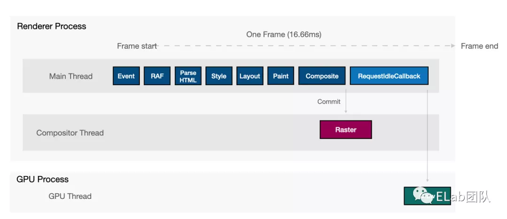
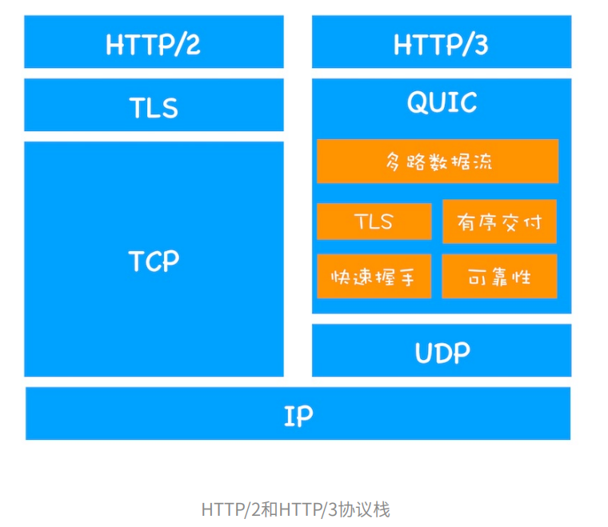
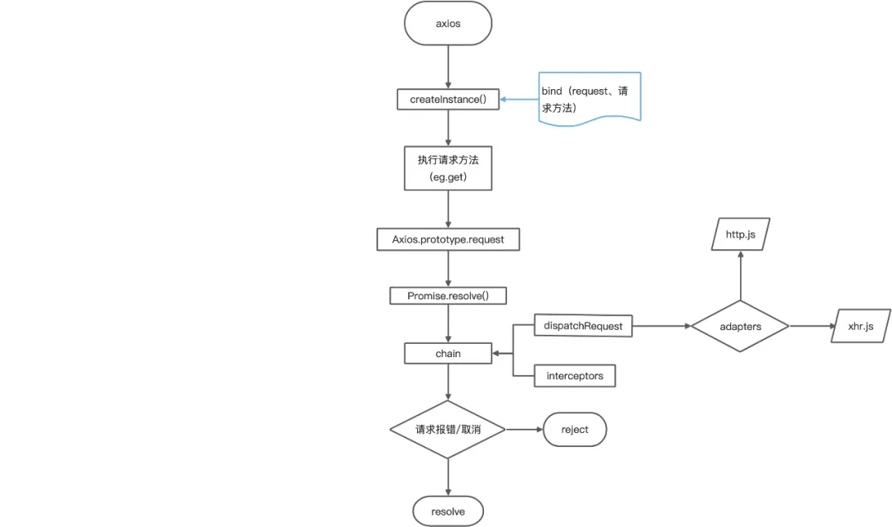
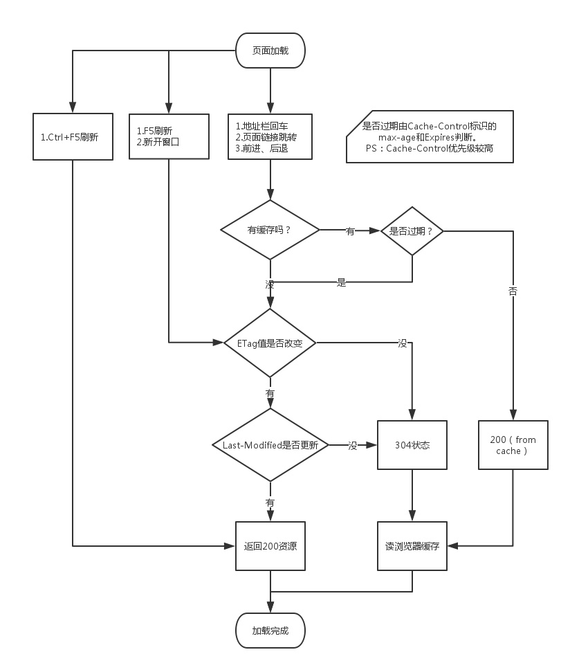
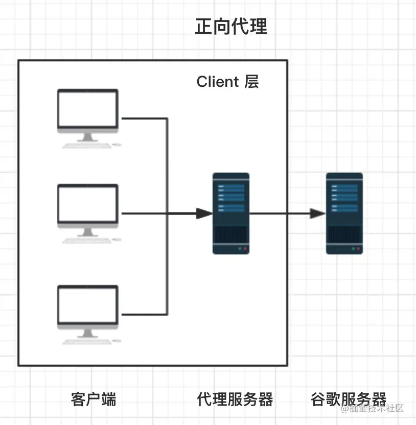

## 输入 URL 到看到页面发生什么

> DNS 解析 -> TCP 连接 -> http 请求/响应 -> 浏览器解析渲染 -> 连接结束

1. 浏览器根据请求的 URL 交给 DNS 域名解析，通过域名找到真实 IP；
2. TCP 连接三次握手
   - 客户端向服务器发送一个建立连接的请求 syn（您好，我是 A）
   - 服务器接到请求后发送同意连接的信号 syn+ack（收到，我是 B）；
   - 客户端接到同意连接的信号后，再次向服务器发送确认信号 ack（那我们建立连接了），客户端与服务器建立了连接。
3. 请求：浏览器设置请求报文（请求行、请求头、主体），发起 HTTP 请求。
4. 响应: 服务器处理完成后返回响应报文,（起始行（状态码），响应头、主体）浏览器接收文件（HTML、JS、CSS、图象等）；
5. 浏览器对加载到的资源（HTML、JS、CSS 等）进行语法解析，建立相应的内部数据结构（如 HTML 的 DOM）；
6. 载入解析好的资源文件，进行渲染 UI 页面，完成。

- 从总体看优化
  - 优化目的是将信息**快速并友好**的展示给用户并能够与用户进行交互。
  - 缩短连接时间：DNS 优化
  - 减少响应内容大小：进行压缩和懒加载
  - JS 加载：使用 defer 模式，先异步加载，等 HTML 渲染完成再执行。async 是异步加载，加载完马上执行，会阻塞渲染。webworker 用来做大数据处理
  - 解析过程：减少回流重绘
- 生命周期
  - DOMContentLoaded：HTML 加载完毕，使用 defer 的脚本会在此之前完成加载
  - load：所有资源加载完毕
  - beforeunload：即将离开，用来询问
  - unload：已经离开，可以做一些统计

### 细节：DNS 解析

- 解析过程
  - 首先在本地域名服务器中查询 IP 地址，没有找到就去 com 顶级域名服务器请求查找，找到后把 IP 地址缓存在本地域名服务器便于下次使用。
    ```
     . -> .com -> google.com. -> www.google.com.
     // 根域名服务器->com顶级域名服务器->一直找到对应的完整域名
    ```
- 优化（减少耗时，一般 20-120ms，控制 200ms 以内）
  - DNS 的缓存
    - 多级缓存顺序：浏览器缓存，系统缓存，路由器缓存，IPS 服务器缓存，根域名服务器缓存，顶级域名服务器缓存，主域名服务器缓存。
  - dns-prefetch 预解析
    - 适用于：引用很多第三方域名的资源的提前解析域名，如 taobao。如果资源都在本域名下， 那就作用不大。
    - 当我们从该 URL 请求一个资源时，就不再需要等待 DNS 的解析过程。
      ```
      <link rel="dns-prefetch" href="//example.com">
      ```
    - 浏览器会对 a 标签的 href 自动启用 DNS Prefetching，所以 a 标签里包含的域名不需要在 head 中手动设置 link。
    - HTTPS 下不起作用，需要 meta 来强制开启 a 标签域名预解析。
      ```
      <meta http-equiv="x-dns-prefetch-control" content="on">
      ```
  - DNS 的负载均衡
    - 又叫 DNS 重定向，根据每台机器负载量和距离返回一个合适的 IP 给用户。(CDN 也是利用重定向)

### 细节：TCP 三次握手

- 三次握手而不是两次，是因为要保证 client 和 server 均让对方知道自己**的接收和发送能力**没问题而保证的最小次数
- 每次握手都会带一个标识 seq，后续的 ACK 都会**对 seq+1**来进行确认，保证每个数据包之间的顺序。
- 三次握手的本质，中间的一次动作是（ACK 和 SYN）的合并。
- 过程：
  - 客户端向服务器发送一个建立连接的请求 SYN（您好，我是 A），客户端为 syn_sent 状态（主动半打开）
  - 服务器接到请求后发送同意连接的信号 ACK + SYN （收到，我是 B），服务器端为 syn_rcvd 状态（被动半打开）
  - 客户端接到同意连接的信号后，客户端变成 Estalished 状态，再次向服务器发送确认信号 ACK（那我们建立连接了），服务器变成 Estalished 状态，客户端与服务器建立了连接。
    

### 细节：TCP 数据传输

- 过程：一方发送 data，另一方发送 ack 确认。
- 重传：客户端发送 data，服务端没 ack，需要 TCP 重传。
- 去重：服务端收到两次重复 data，需要进行去重。
- 双工：双方都可以主动发起数据传输。

### 细节：TCP 四次挥手

- 客户端 -- **FIN --> 服务端**， 客户端变成 FIN—WAIT-1 状态
- 服务端 -- **ACK --> 客户端**， 服务端变成 CLOSE-WAIT 状态，客户端变成 FIN—WAIT-2 状态（先回应 ACK，等服务端还未发送完的所有报文发送完毕，才能发送 FIN，不然还没发完就关闭了）
- 服务端 -- **FIN --> 客户端**， 服务端变成 LAST-ACK 状态，客户端变成 TIME—WAIT 状态
- 客户端 -- **ACK --> 服务端**，服务端收到 ACK 后变成 CLOSED 状态，**等待 2MSL 后**（2 个报文最大生存时间，每个 MSL 是 2min，共 4min），客户端变成 CLOSED 状态
- 2 个 MSL: 一个保证最后的 ACK 能够到对面，一个保证重传的报文能到达。
  

#### 缩写

- SYN：Synchronize 同步
- ACK: 应答，确认
- SYN-SENT：在发送连接请求后等待匹配的连接请求
- SYN-RECEIVED：在收到和发送一个连接请求后等待对连接请求的确认
- FIN：Finally 最终
- Estalished：建立

### 细节：TCP/IP 四(五)层协议

- 应用层(HTTP) -> 传输层(TCP/UDP) -> 网络层(IP 和 MAC) -> 链路层(驱动)

- 应用层：HTTP
  - TCP/IP 分层中，会话层，表示层，应用层集中在一起
  - 网络管理通过 SNMP 协议
- 传输层：通用的 TCP 和 UDP 协议
  - TCP 协议**面向有连接**，能正确处理丢包，传输顺序错乱的问题，但是为了建立与断开连接，需要至少 7 次的发包收包，资源浪费
  - UDP **面向无连接**，不管对方有没有收到，如果要得到通知，需要通过应用层
- 网络层：IP 和 MAC 地址
  - 使用 IP 协议，IP 协议基于 IP 转发分包数据
  - IP 协议是个不可靠协议，不会重发
  - IP 协议发送失败会使用 ICMP 协议通知失败
  - ARP 解析 IP 中的 MAC 地址，MAC 地址由网卡出厂提供
  - IP 还隐含链路层的功能，不管双方底层的链路层是啥，都能通信
- 链路层：代表驱动
- 物理层：将二进制的 0 和 1 和电压高低，光的闪灭和电波的强弱信号进行转换

### 细节：TCP/UDP 的区别

- 区别
  - TCP 基于连接。UDP 无连接。
  - TCP 保证数据正确性，每个包加序号。UDP 不保证，可能会丢包
  - TCP 保证数据顺序。UDP 不保证。
  - TCP 一对一。UD 可一对多、多对一、多对多。
  - TCP 传的是字节流。UDP 传的是一个一个报文。
- 场景

  - TCP 适合可靠传输。如文件传输
  - UDP 适合实时应用。如视频会议、直播

- 具体如下：
- UDP
  - 无连接：不需要握手连接，想发数据就直接发，不会对数据进行拆分和拼接。
    - 在发送端，应用层将数据传递给传输层的 UDP 协议，UDP 只会给数据增加一个 UDP 头标识下是 UDP 协议，然后就传递给网络层了
    - 在接收端，网络层将数据传递给传输层，UDP 只去除 IP 报文头就传递给应用层，不会任何拼接操作
  - 支持一对多，多对多，多对一
  - 不可靠：不关心对方是否正确收到数据、网络不好可能丢包、
  - 头部开销小，传输高效
- TCP
  - TCP 是面向连接的、可靠的流协议。
  - 仅支持一对一
  - 以字节流方式传输
  - 可靠的：为了保证报文传输的可靠，给每个包一个序号，也保证了按顺序接收。
  - 网络拥挤时，减少速率和数量来缓解

### 细节：HTTP 传输流

- 发送端在层与层间传输数据时，每经过一层都会被加上首部信息，接收端每经过一层都会删除一条首部。
  

### 细节：TCP 和 HTTP 关系

- TCP 协议对应于传输层，而 HTTP 协议对应于应用层，Http 是基于 Tcp 协议的。
- HTTP 会通过 TCP 建立起一个到服务器的连接通道，当本次请求需要的数据完毕后，HTTP 会立即将 TCP 连接断开，这个过程是很短的。所以 HTTP 连接是一种短连接，是一种无状态的连接。

### 细节：HTTP 请求

- 步骤
  - 构建 HTTP 请求报文
  - 通过 TCP 协议发送到服务器指定端口(HTTP 协议 80/8080, HTTPS 协议 443)。
- 请求报文

  - 请求行
  - 请求报头
  - 请求体(正文)

  ```
  // 请求行
  POST /query HTTP/1.1
  // 请求头
  Accept: */*
  Origin: https://juejin.im
  Accept-Encoding: gzip, deflate, br
  Accept-Language: zh-CN,zh;q=0.9,en;q=0.8
  Content-Type: application/json;
  Cookie：Cookie: ab={}; _ga=GA1.2.1711725290.1560907409;

  // 如json请求体
  {"operationName":"","query":"","variables":{"type":"ALL","query":"url到页面","after":"","period":"ALL","first":20},"extensions":{"query":{"id":"a53db5867466eddc50d16a38cfeb0890"}}}
  ```

### 细节：HTTP 响应

- 步骤
  - 从端口接收到 TCP 报文，对请求进行解析
  - 请求处理完后，通过构建响应报文发送会客户端。
- 响应报文
  - 状态行
  - 响应报头
  - 响应体(正文)

### 细节：HTTP 报文结构

- 组成部分：起始行 + 头部(header) + 空行 + 实体(body)
  - 请求报文的起始行(请求行)：方法 + 路径 + http 版本
    `GET /home HTTP/1.1`
    
  - 响应报文的起始行(状态行)：http 版本 + 状态码 + 原因
    `HTTP/1.1 200 OK`
    
  - 空行：用来分开头部和实体

### 细节：HTTP 报头

- Origin：源
- Referer：来源
- Connection: keep-alive 长连接
- Content-Length: 825 内容长度
- Cookie：凭证
- Accept 系列字段：

  - 数据格式：Content-Type

    ```
    // 发送端
    Content-Type: ...
    // 接收端
    Accept: ...

    可取值范围：
    text： text/html, text/plain, text/css 等
    image: image/gif, image/jpeg, image/png 等
    audio/video: audio/mpeg, video/mp4 等
    application: application/json, application/javascript, application/pdf, application/octet-stream 等
    ```

  - 压缩方式：Content-Encoding
    ```
    // 发送端
    Content-Encoding: gzip
    // 接收端
    Accept-Encoding: gzip
    ```
  - 支持语言：Content-Language
    ```
    // 发送端
    Content-Language: zh-CN, zh, en
    // 接收端
    Accept-Language: zh-CN, zh, en
    ```
  - 字符集：放在 Content-Type 中
    `// 发送端 Content-Type: text/html; charset=utf-8 // 接收端 Accept-Charset: charset=utf-8`
    

- 响应的强缓存和协商缓存头如：Expires 和 Cache-Control、 ETag 和 Last-Modified
- 其他自定义头如：token

### 渲染 UI 页面的过程

1. 解析 HTML 生成 DOM 树。
2. 解析 CSS 生成 CSS 规则树。
3. 将 DOM 树与 CSS 规则树合并在一起生成渲染树 Render Tree。
4. 遍历渲染树开始布局（Layout），计算每个节点的大小和坐标。
5. 调用 GPU 进行绘制（Paint），遍历节点，生成渲染层、图形层、再转为位图，绘制到屏幕显示。
   

### 一帧的渲染进程和 RAF 的关系



- 简单描述一帧的生命周期: 优先处理事件回调，然后执行 RAF，最后有空闲执行 RequestIdleCallback
- 如果有高耗时任务，对高耗时任务进行分步骤处理，可以采用在一帧空闲时 RequestIdleCallback 处理拆分的小任务。

1. 一帧开始。

2. 主线程:

- **Event Handlers: UI 交互输入的事件回调, 例如 input、click、wheel 等。**

- **RAF: 执行 requestAnimationFrame 回调。**

- DOM Tree: 解析 HTML, 构建 DOM Tree, 当 JS 对 DOM 有变更会重新触发该流程。

- CSS Tree: 构建 CSS Tree。至此构建出 Render Tree。

- Layout: 所有元素的 position、size 信息。

- Paint: 像素填充, 例如颜色、文字、边框等可视部分。

- Composite: 绘制的指令信息传到合成线程中。

- **RequestIdleCallback: 如果此时一帧还有空余时间, 则执行该回调。**

3. 合成线程:

- Raster: 合成线程将信息分块, 并把每块发送给光栅线程, 光栅线程创建位图, 并通知 GPU 进程刷新这一帧。

4. 一帧结束。

### 细节：HTML 建立 dom 树-词法解析和语法解析

- 词法解析：
  - 生成 Tokens: 二进制转为字符串后，浏览器会将 HTML 字符串解析成 Tokens
- 语法解析：
  - 构建 Nodes: 开始结束标签配对、添加属性、父子兄弟关系连接，构成 DOM Tree

### 细节：CSS 规则树如何与 dom 结合成 render 树

- 实现：对 dom 树进行遍历，将 css 附着对应的元素上
- 顺序：浏览器选择器解析顺序（右->左），性能较好
- 原理：先找最右节点,再向上找对应的类或者标签，一开始就筛除大量不符合条件的节点。

### 重排（回流）和重绘

- 重排（回流）：节点尺寸需要重新计算，重新排列元素，引起局部或整个页面重新渲染
- 重绘：样式发生变化，更新外观内容
- 重绘不一定出现重排
- 重排一定会出现重绘

### 如何触发

- display: none 隐藏一个 DOM 节点 -> 回流和重绘
- visibility: hidden 隐藏一个 DOM 节点 -> 重绘
- 增加、删除、更新 dom
- 移动 dom 或者动画
- 调整窗口大小

### 如何优化

- 集中改变样式
  - 改变 class（类名）的方式
    ```js
    // 判断是否是黑色系样式
    const theme = isDark ? "dark" : "light";
    // 根据判断来设置不同的class
    ele.setAttribute("className", theme);
    ```
- 离线操作 dom：DocumentFragment
  - createDocumentFragment 在 dom 树之外创建游离节点，该节点上批量操作，再插入 dom，一次重排
    ```js
    var fragment = document.createDocumentFragment();
    for (let i = 0; i < 10; i++) {
      let node = document.createElement("p");
      node.innerHTML = i;
      fragment.appendChild(node);
    }
    document.body.appendChild(fragment);
    ```
- 提升至合成层
  - CSS 的 will-change
    ```css
    #target {
      will-change: transform;
    }
    ```
  - 重绘时只会影响合成层，不会影响其它层
  - transform 和 opacity 效果，不会触发 layout 和 paint

### 阻塞问题

- 资源文件异步不阻塞：浏览器在解析过程中，如果遇到请求外部资源时，如图像,iconfont 等。请求过程是异步的，并不会影响 HTML 文档进行加载。
- JS 阻塞后续资源下载：当文档加载过程中遇到 JS 文件，HTML 文档会挂起渲染过程，等到文档中 JS 文件加载完毕+解析+执行完毕，才会继续 HTML 的渲染过程。因为 JS 可能会修改 DOM 结构。
- CSS 不影响 JS 加载，但影响 JS 的执行。

## HTTP/HTTPS/HTTP2 协议


- 主要区别：

  - HTTP1.0 【增加请求头和响应头】【无法复用连接，要手动添加 keep-alive】
  - HTTP1.1【默认开启持久连接 keep-alive 可复用】【并发 6 个 TCP 连接】【开启持久连接，同一个 TCP 连接中会队头阻塞：等待响应后才发送下个请求】【管道化：无须等待响应即可请求，但响应顺序要保持一致，因不成熟被厂商放弃】
  - HTTP2.0【多路复用】【可解决队头阻塞，无须等待响应即可请求，响应顺序无顺序要求，根据 id 重新组合】【一个域名同一个 TCP 连接】

- HTTP1.0
  - 定义了三种请求方法： GET, POST 和 HEAD 方法
  - 引入请求头和响应头
  - 新增状态响应码
  - 无状态：无法复用链接，完成即断开，重新慢启动和 TCP 3 次握手，需要手动添加 keep-alive 达到长连接。
- HTTP1.1
  - 新增了五种请求方法：OPTIONS, PUT, DELETE, TRACE 和 CONNECT
  - 默认开启持久连接(Connection: keep-alive):返回本次请求结果后保持连接
    - 减少延迟，无须再握手
    - 较少的 CPU 和内存的使用
  - 新增功能:
    - 管道化(pipelining)【原本为了解决队头阻塞，默认不开启】：基于长连接，管道化可以不等第一个请求响应继续发送后面的请求，也就是一次性发多个请求，但是响应的顺序必须按照请求的顺序返回，因不成熟被各厂商放弃。【队头阻塞】(Head of line blocking)：一个 TCP 连接中，在前一个请求响应到达之后，下一个请求才能发送，如果前一个阻塞，后续的请求也会被阻塞。
    - 断点续传：客户端请求头，RANGE:bytes=XXXX 从 XX 字节开始传送。服务端响应是 Content-Range 头字段。
    - cache 缓存增强（ETag，If-None-Match）
- HTTP/1.x 的问题

  - TCP 慢启动
  - HTTP/1.x 中的存在**队头阻塞**问题。
  - HTTP/1.x 大量、重复的请求头在网络上传输，使网络负载了很大一部分本需要传输的数据量。
  - HTTP 1.x 多条 TCP 连接**竞争带宽**。如果想并发多个请求解决队头阻塞问题，必须使用多个 TCP 链接，因为管道化默认关闭，是无效的。浏览器为了控制资源，单个域名有 6-8 个的 TCP 链接请求限制，如 Chrome 最多允许对同一个 Host 域名建立 6 个 TCP 连接。
  - 为什么不能实现多路复用：HTTP/1.1 是通过文本进行传输，不是二进制传输。由于没有流的概念，在使用并行传输（多路复用）传递数据时，接收端在接收到响应后，并不能区分多个响应分别对应的请求，所以无法将多个响应的结果重新进行组装，也就实现不了多路复用。

- HTTP2 相对于 HTTP1.x 的优势(新特性)

  - 二进制分帧层：二进制格式替换之前文本格式传输数据，解析更高效，请求响应消息由一个或多个帧组成，分割为更小的帧，可乱序发送，根据请求的 id 标识进行重组合并为完整的请求或响应。
  - 头部压缩：只发送有差异头部，减少冗余头部数据传输，“首部哈希表”
  - 多路复用(Multiplexing)：同域名下所有通信都在单个 TCP 连接上，**可以有多条流，每个流都有自己的帧**，避免每次都要建立 TCP 连接，可以同时发送请求或响应，且不按照顺序。实际就是每个 request-response 拆分为更小的帧，前面响应耗时太久时，后面响应可以先到达。
  - 服务器推送：发送页面 HTML 时主动推送页面所需要的 JS 和 CSS 资源，不需要等解析到再请求

- HTTP2 的头部压缩算法原理

  > 在 HTTP1 中起始行中的请求方法、URI、状态码，在 HTTP2 起始行被废弃，一起变为请求头，前面加：以便和其他请求头区分开。

  - HTTP/2 采用了 HPACK 压缩算法（哈希表+哈夫曼编码），对请求头进行压缩。
  - 首先是在服务器和客户端之间建立哈希表，将用到的字段存放在这张表中，那么在传输的时候对于之前出现过的值，只需要把索引(比如 0，1，2，...)传给对方即可，对方拿到索引进行查表就行了。让请求头字段实现精简和复用。
  - 其次如果若索引空间中不存在，对于整数和字符串进行哈夫曼编码然后传输，哈夫曼编码的原理就是先将所有出现的字符建立一张索引表，然后让出现次数多的字符对应的索引尽可能短，传输这样的索引序列，可以达到非常高的压缩率。

- HTTP3
  - 基于 UDP 实现的 QUIC 协议（HTTP/2 的问题都是 TCP 内部的问题）
    - 实现的 HTTP/2 的多路复用功能
    - 增加了一层保证数据可靠性传输（包括数据包重传）
    - 快速握手，减少连接的时间 RTT，以前 3~4 个 RTT，现在 0~1 个 RTT
  - 缺点
    - 浏览器和服务器没有比较完整的支持，QUIC 协议存在差异
    - 由于中间设备僵化，丢包率大
      
- HTTPS 是安全版的 HTTP，区别如下
  - HTTP 协议的数据都是明文传输的，HTTPS 在应用层中增加 TLS/SSL 安全层进行加密
  - 安全层有两个主要的职责：对发起 HTTP 请求的数据进⾏加密操作和对接收到 HTTP 的内容进⾏解密操作。
  - HTTPS 需要到 CA 机构申请证书(一般收费)
  - HTTP 是 80 端口，HTTPS 是 443 端口
- 优点：安全，防止速度被窃取，篡改
- 缺点：访问耗时增加；消耗服务器资源导致成本增加；
- 优化方式：握手时使用会话缓存复用方式，携带上一次的“Session ID”，能复用则不进行后面的握手 、客户端“Session Ticket”
- 场景
  - 输入密码，支付等个人信息传输时使用。如电商、银行、政府。
  - 要用 HTTP2 也必须是 HTTPS
- 加密方案

  - 对称密钥：加密和解密同一个密钥，但秘钥容易被截获
  - 非对称密钥：秘钥对= 公钥+私钥，使用公钥加密的只有对应的私钥能解开，私钥加密只有公钥能解开，先将公钥发给对方，对方用公钥加密并返回数据，再用私钥解开。不过 RSA 算法太慢,影响性能
  - 公钥是每个⼈都能获取到的，⽽私钥只有服务器才能知道，不对任何⼈公开
  - 结合：使用非对称密钥的方法将对称密钥发送给对方，后续用对称密钥解密。
  - 第三方认证 CA(数字证书):保证首次将公钥发过去不被中间人篡改。服务器没有直接返回公钥给浏览器，⽽是返回了数字证书，⽽公钥正是包含在数字证书中的；在浏览器端多了⼀个证书验证的操作，才继续后续流程。

    - 用经过 hash 的信息生成摘要（包括公钥 + 企业、网站信息），再用私钥加密，成为数字签名。
    - 公钥/信息+签名组合成数字证书
    - 获取数字证书，将原始信息同样 hash 生成摘要
    - 浏览器使用 CA 公钥解密签名生成的摘要，对比原始信息的摘要是否一致

- HTTPS 总流程：在 SSL 层中进行认证
  - 服务器将公钥放在 CA 用私钥加密的数字证书中，客户端请求时传一份给它。
  - 客户端收到数字证书，使用 CA 的公钥解密证书获取公钥并验证
  - 通过获得的公钥加密客户端生成的对称密钥，发给服务器，服务器用自己的私钥解密获得对称密钥
  - 此后加密连接就使用这个对称密钥进行加密通信。
- 握手过程
  - 正常的 TCP 连接三次握手
  - 若是 HTTP 会 302 跳转到 HTTPS
  - 再次 TCP 连接
  - 完成协商和证书签名算法
  - 获取 CA 域名
  - 与 CA 三次握手
  - 获取证书状态（有效、过期、未知）
  - 浏览器解析证书签名，密钥交换，应用层对数据加解密。
- 中间人攻击（http 中明文数据被窃听、篡改、冒充）（可用第三方认证 CA 证书解决）

  > 攻击者与通讯的两端分别创建独立的联系, 并交换其所收到的数据, 使通讯的两端认为他们正在通过一个私密的连接与对方直接对话, 但事实上整个会话都被攻击者完全控制.

  - 客户端发送请求到服务端，请求被中间人截获（比如通过 DNS 劫持，换成黑客的 ip 服务器）
  - 服务器向客户端发送公钥
  - 中间人截获公钥，保留在自己手上。然后自己生成一个【伪造的】公钥，发给客户端
  - 客户端收到伪造的公钥后，进行加密对称密钥发给服务器
  - 中间人用自己的私钥解密获得对称秘钥，同时生成假的对称密钥，发给服务器
  - 服务器用私钥解密获得假密钥，然后用假密钥加密数据传输给客户端

## 网页打不开如何排查

- 排查 URL 拼写是否正确
- 排查服务(server 或 CDN)是否正常
- 可能是用户防火墙设置，直接关掉试试是否恢复正常
- 可能是 DNS 的问题，先尝试用 IP 地址来访问，如果可以访问，"运行"中执行`ipconfig /flushdns`来重建本地 DNS 缓存。
- 排查是否为 HTTP 劫持

## 一个 TCP 连接能发几个 HTTP 请求？

- [知乎参考](https://zhuanlan.zhihu.com/p/61423830)
- HTTP 1.0：一个 TCP 发送一个 HTTP 请求，【默认不开启】长连接，请求发送完毕， TCP 连接断开。
- HTTP 1.1：【默认开启】长连接 Connection: Keep-Alive，只要不断开就可以一直发送 HTTP 请求，无上限。只有在请求报头中声明 Connection: close 才会在请求完成后关闭连接。
- HTTP 2.0 ：【多路复用】，一个 TCP 连接可以【并发】多个 HTTP 请求，支持长连接，无上限。

- 多个图片加载问题：
  - HTTPS 连接下，先询问能否使用 HTTP2，可以就进入 HTTP2。若不是 HTTPS，或者 HTTPS 下 HTTP2 用不了，进入 HTTP 1.1。
  - HTTP 2.0 情况下：多路复用
  - HTTP 1.1 情况下：一个 HOST 上建立多个 TCP 连接，限制数（一般为 6）由浏览器设置。
  - 具体数量：10 张
    - HTTP 1.1 情况下：6 + 4，可用多域名实现全部一起请求：5 个 A 域图片+5 个 B 域图片。
    - HTTP 2.0 情况下：全部并发请求图片。

## 状态码

- 进行一个 http 请求的时候，可以根据服务器返回来的状态码进行对应的处理，可分为以下几类
- 1XX 信息 (服务器收到请求，需要继续处理)
- 2XX 成功
  - 200 OK，表示从客户端发来的请求在服务器端被正确处理 ✨
    - 200 (from disk cache) 命中强缓存，从磁盘获取内容
    - 200 (from memory cache) 命中强缓存，从内存获取内容
  - 204 No content，表示请求成功，但没有返回任何内容。
  - 206 Partial Content，客户端通过发送范围请求头 Range 抓取到资源的部分数据，断点下载/上传
- 3XX 重定向和缓存
  - 301 moved permanently，永久性重定向，表示资源已被分配了新的 URL
  - 302 found，临时性重定向，表示资源临时被分配了新的 URL ✨，请求还是原 url
  - 304 not modified，未修改，可使用缓存 ✨（协商缓存）
  - 307 temporary redirect，临时重定向，和 302 含义相同
  - 308 Permanent Redirect 类似 301，但不允许浏览器将原本为 POST 的请求重定向到 GET 请求上。
  - 重定向 307，308，303，302 的区别？
    - 302 是 http1.0 的协议状态码，在 http1.1 版本细化 302 状态码又加入 303 和 307
    - 303 （跟 302 处理方式一致）明确表示客户端应当采用 get 方法获取资源，他会把 POST 请求变为 GET 请求进行重定向
    - 307 （跟 302 处理方式不一致）类似 302，但不会从 post 变为 get
    - 308 类似 301，但不会从 post 变为 get
- 4XX 客户端错误
  - 400 (错误请求)bad request，请求存在语法错误 ✨
  - 401 (未授权)unauthorized，请求要求身份验证 ✨
  - 403 (禁止)forbidden，服务器拒绝请求 ✨
  - 404 (未找到)not found，请求的资源不存在 ✨
  - 405 (方法禁用)， 禁用请求中指定的方法
  - 409 (冲突)Conflict，请求的资源可能引起服务端数据冲突
  - 415 (支持的媒体类型)请求的格式不受请求页面的支持，如 json 传成 formdata
- 5XX 服务器错误
  - 500 (服务器内部错误)internal sever error，表示服务器端内部错误 ✨
  - 501 (尚未执行)Not Implemented， 不支持请求的功能（无法完成请求方法）
  - 502 (错误网关) 服务器作为网关或代理，从上游服务器收到无效响应
  - 503 (服务不可用) service unavailable，服务器暂时处于超负载或正在停机维护(暂时状态)
  - 504 (网关超时) Gateway Time-out， 服务器作为网关或代理，但是没有及时从远端服务器收到请求
  - 505 (HTTP 版本不受支持)， 服务器不支持请求中所用的 HTTP 协议版本

## Content-Type

> 取决后端需要什么格式的数据，但是文件必须使用 multipart/form-data

- JSON
  - application/json(一般为接口请求和响应数据的头部)
    - 格式为 json 字符串
      ```js
      {"id":"123","name":"joe"}
      ```
- 三种表单数据编码方式

  - form 标签的 enctype 属性：form 表单在发送到服务器时候编码方式
    - 1、`application/x-www-form-urlencoded`。默认的编码方式。其实不是不能上传文件，是只能上传文本格式的文件。
    - 2、`multipart/form-data` 。表单数据有多部分构成，既有文本数据，又有文件等二进制数据的意思。将文件以二进制的形式上传，这样可以实现多种类型的文件上传。
    - 3、`text/plain`。纯文本的传输。空格转换为 “+” 加号，但不对特殊字符编码。
  - application/x-www-form-urlencoded(默认，不可用于文件上传，因为这种编码方式对文件二进制数据非常低效)
    - 键值对格式：`key=value&key=value`
    - get 方式放在 url 后面，用?分割；post 放在 http body 中。
    - 会进行 url 编码（键值对的参数用&连接；空格转为+加号；字符`"a"-"z"，"A"-"Z"，"0"-"9"，"."，"-"，"*"`，和`"_"`都不会被编码；其他符号(&@#)转为 【% + ASCII 十六进制值】如%xy;）
      ```
      First name:Joe&Joan
      Last name:
      如：FirstName=Joe%26Joan&LastName=6+6+6
      ```
  - multipart/form-data(混合资源由多种元素组成，可用于文件上传，或者大数据 json 传输如埋点)

    - 每个表单控件元素变为独立资源，同时 method 必须为 post 方法。
    - 每部分会有 http 头描述如`Content-Type`(默认为 text/plain，表示内容的 MIME 类型，是图片还是文本还是二进制数据)、`Content-Disposition`(form-data 表示一个表单元素或者 file)、name(表单元素 name)、name 表示表单元素的 名称，回车换行后面就是 name 的值，如果是上传文件就是文件的二进制内容。`boundary`值表示分割符：最后以加上--结尾。

      ```
      // headers
      Content-Type: multipart/form-data; boundary=----WebKitFormBoundary1XNKw5IGSxIzisBM

      // Form Data
      ------WebKitFormBoundary1XNKw5IGSxIzisBM
      Content-Disposition: form-data; name="deviceTypeIconFile"; filename="产品图.png"
      Content-Type: image/png


      ------WebKitFormBoundary1XNKw5IGSxIzisBM
      Content-Disposition: form-data; name="deviceTypeCode"

      0x1C
      ------WebKitFormBoundary1XNKw5IGSxIzisBM
      Content-Disposition: form-data; name="deviceType"

      空调
      ------WebKitFormBoundary1XNKw5IGSxIzisBM--
      ```

## AJAX

- [XMLHttpRequest](https://developer.mozilla.org/zh-CN/docs/Web/API/XMLHttpRequest)
- 概念：异步 JS 和 XML 缩写，现在一般用 JSON 代替 XML。
- 用处：在不刷新页面的情况下，向浏览器发起请求和接受响应，最后局部更新页面。
- 实现：基于 XMLHttpRequest 对象，可发起 HTTP 请求，监听 readyState 的变化获得响应，然后执行刷新。
- 使用：

  ```js
  let xhr = new XMLHttpRequest(); // 声明一个请求对象

  xhr.onreadystatechange = function () {
    // 保证兼容，在调用open之前先赋值
    if (xhr.readyState === 4) {
      // readyState 4 代表已向服务器发送请求
      if (xhr.status === 200) {
        // status 200 代表服务器返回成功
        var json = JSON.parse(xhr.responseText); // 这是返回的响应体文本
      } else {
        console.log("Error: " + xhr.status); // 连接失败的时候抛出错误
      }
    }
  };

  xhr.open("GET", "url/xxxx", true); // 默认为true，异步请求
  xhr.setRequestHeader("Content-Type", "application/json");
  // xhr.setRequestHeader(header, value); 设置请求头
  xhr.send(null); // get方法 send null , post 的 send 则是传递值("firstName=Henry&lastName=Ford")
  ```

- 优点：无刷新请求数据
- 缺点：浏览器限制不能跨域，跨域看下面的方案。

- xhr 对象的 readyState 属性

  - 0 未初始化： 尚未调用 open() 方法
  - 1 已打开： open() 方法已经被调用
  - 2 已发送： send() 方法已经被调用，但未收到响应
  - 3 接收中； 收到部分响应 ，responseText 属性已经包含部分数据
  - 4 完成： 已收到所有响应，可使用

- xhr 对象的 responseText 属性：表示响应体数据
- xhr 对象的 timeout 属性: 设置超时时间(毫秒)

- `xhr.open()`方法
  - 参数：请求类型(get/post 等)，请求的 URL(相对或绝对路径)，布尔值(是否异步)
  - 为发送请求做好准备，并未发送请求
- `xhr.send()`方法
  - 参数：请求体的数据，如果不需要必须传 null
  - 调用 send 后，请求就发到服务器
  - get 方法 `send(null)` , post 的 send 则是传递值("firstName=Henry&lastName=Ford")，或者使用`send(new FormData(form))`序列化表单内容
- `xhr.abort()`方法
  - 调用这个方法后，取消异步请求,xhr 对象会停止触发事件，并阻止访问有关响应的任何属性。
  - 取消后请求后，建议取消对 xhr 对象的引用
- 应用：利用事件监听其他项目或不可控代码的 AJAX 请求
  - 原理：监听 xhr 对象的一些事件，再合适的事件节点做对应的操作，比如说 onreadystatechange 请求加密，onload 响应解密。
  - 事件类型：直接 on + 事件监听执行回调（DOM0 风格）
    ```js
    xhr.onload = function () {
      // 此处readyState 为 4 ，可处理取回的数据
    };
    ```
    - readystatechange： readyState 属性发生变化，调用处理函数
    - loadstart：接收到响应的第一个字节触发。
    - progress：响应数据接收中，反复触发
    - load：请求成功时，数据接收完毕
    - abort：请求被取消时触发
    - error：请求遇到错误时触发
    - loadend：请求结束时（无论是 load、abort、error 都会触发）
    - timeout：预设时间中没有收到响应时
- 进度事件 onprogress 的 event 对象属性
  - lengthComputable 进度信息是否可用
  - position 接收到的字节数
  - totalSize 总字节数

```js
xhr.onprogress = function (event) {
  if (event.lengthComputable) {
    // event.position
    // event.totalSize
  }
};
```

## Axios 使用

- 简介：Axios 是一个基于 promise 的 HTTP 库，可以用在浏览器和 node.js 中。
- 创建 axios 实例：
  - 单独建个 http.js 独立维护
  - 引入 axios 并进行配置
  ```js
  // api/http.js
  import axios from 'axios'
  // 创建 axios 实例
  const Request = axios.create({
    // 配置项
    baseURL: '', // url = base url + request url
    timeout: 120 * 1000 //  请求超时中断：ms  0表示不限制+
    withCredentials: false, // 默认的,表示跨域请求时是否需要使用cookie凭证
    headers: {'X-Requested-With': 'XMLHttpRequest'},// `headers` 是即将被发送的自定义请求头
  })
  // 暴露给外部api去封装自己的接口
  export default Request
  ```
- 配置的优先级
  - 在 lib/defaults.js 找到的库的默认值 < 实例的 defaults 属性 < 请求的 config 参数。
- 拦截器

  - 请求拦截器
    ```js
    Request.interceptors.request.use(
      (config) => {
        // 配置：如添加请求头，进行token验证
        config.headers["x-requested-with"] = "XMLHttpRequest";
        return config;
      },
      (error) => {
        // 对请求错误做些什么
        console.log(error);
        return Promise.reject(error);
      }
    );
    ```
  - 响应拦截器
    ```js
    Request.interceptors.response.use(
      (response) => {
        // 配置：如对response.status状态码进行判断，输出错误信息
        const res = response.data;
        if (response.status === 200) {
          return res;
        } else {
          return Promise.reject(new Error(res.message || "Error"));
        }
      },
      (error) => {
        // 拿到错误里的响应体数据
        const { response } = error;
        if (response) {
          // 针对特定的状态码错误，对应处理提示
          errorHandle(response.status, response.data.message);
          return Promise.reject(response);
        } else {
          return Promise.reject(response);
        }
      }
    );
    ```

- API 封装和使用

  ```js
  // .env.production 配置接口地址常量

  # base api
  VUE_APP_BASE_API = 'https://3.123.xxx.xxx:28100'


  // api/pluginManagement/index.js  接口封装的js文件

  import Request from '../http.js'
  const domain = process.env.VUE_APP_BASE_API
  // 查询APP列表
  export function queryApp(data) {
    return Request({
      url: `${domain}/appInfo/getAll/page`,
      method: 'post',
      data: data
    })
  }

  // product.vue 页面组件使用

  import { queryApp } from '@/api/pluginManagement/index'
  queryApp(this.searchForm)
      .then(res => {

      })
      .catch(err => {

      })
  ```

- axios 源码解读

  - 责任链 chain，按顺序调用

    - 遍历`chain.unshift()` 请求拦截器
    - 请求 `dispatchRequest`
    - 遍历`chain.push()` 响应拦截器
    - 通过循环 promise.then 调用链表，按顺序请求
    - 最后返回 promise 给业务处理

      ```js
      while (chain.length) {
        promise = promise.then(chain.shift(), chain.shift());
      }
      return promise;
      ```

  - dispatchRequest
    - 根据适配器不同，选择请求前后的数据包装方式
  - 流程图示意

    

## fetch

- 它是一个原生 API，提供基于 promise 的 ajax 请求
- 收到响应会将 Promise 设为 resolve（包括响应码是 500 之类的），在网络故障时或请求被阻止时，返回 reject
- 可以发送跨域 cookie，默认不会发送，需要设置`credentials` 为 `include` 或 `same-origin`（表示同源 cookie），`omit` 表示不含 cookie
  ```js
  fetch("https://example.com", {
    credentials: "include",
  });
  ```
- 使用方式

  ```js
  fetch("http://example.com/movies.json")
    .then(function (response) {
      return response.json();
    })
    .then(function (myJson) {
      console.log(myJson);
    });
  ```

- 对比 axios，它是原生支持的，但 axios 封装东西更多。

## 域名

- 一个完整的域名由二个或二个以上部分组成，各部分之间用英文的句号"."来分隔。
- 倒数第一个"."的右边部分称为顶级域名（TLD，也称为一级域名）
- 顶级域名的左边部分字符串到下个"."为止称为二级域名（SLD）
- 二级域名的左边部分称为三级域名，以此类推
- 每一级的域名控制它下一级域名的分配。

## 跨域 ✨

- 同源：“协议+域名+端口”三者相同
  - 非同源会被限制：无法完成 AJAX 请求，无法读写其他域 localStorage，非指定域名的 Cookie 不会发送。
- 不同源之间相互请求资源，就算作“跨域”。
  

```
URL                                      说明                    是否允许通信
http://www.domain.com/a.js
http://www.domain.com/b.js         同一域名，不同文件或路径           允许
http://www.domain.com/lab/c.js

http://www.domain.com:8000/a.js
http://www.domain.com/b.js         同一域名，不同端口                不允许

http://www.domain.com/a.js
https://www.domain.com/b.js        同一域名，不同协议                不允许

http://www.domain.com/a.js
http://192.168.4.12/b.js           域名和域名对应相同ip              不允许

http://www.domain.com/a.js
http://x.domain.com/b.js           主域相同，子域不同                不允许
http://domain.com/c.js

http://www.domain1.com/a.js
http://www.domain2.com/b.js        不同域名                         不允许
```

- 浏览器这些标签不受同源策略
  ```html
  
  <link href=XXX>
  <script src=XXX>
  ```
- 注意：跨域请求能发出去，服务端能收到请求并正常返回结果，只是响应结果被浏览器拦截了
- jsonp
  - 本质：利用`<script>`标签不受同源策略限制的特性进行跨域操作
  - 核心实现：创建 script 标签发起 get 请求，前端定义函数，在后端把数据放入回调，然后返回前端执行。
  - 优点：简单就可实现跨域、兼容好
  - 缺点：只支持 get 请求，`<script>`标签只能 get，且容易受 xss 攻击
  - 具体：创建一个`<script>`标签，src 为跨域的 API 数据接口,声明一个回调函数，`window[show]=function(){ resolve(data)}` 在地址中向服务器传递该函数名(如 show)（问号 query 形式传参:`?callback=show`），服务器特殊处理把数据放在回调函数中 `show(data)` 返回给客户端，客户端再调用执行回调函数（show），对返回的数据进行操作。
- CORS 跨域资源共享
  - 主流跨域方案:http 头告诉浏览器允许访问不同源服务器上的资源
  - 优点：简单配置即可跨域，支持所有类型的 HTTP 请求
  - 缺点：某些老旧浏览器不支持 CORS
  - 允许该 Origin 请求，则响应里加入下面的头信息
  - Access-Control-Allow-Origin(简单请求+预检都会返回)：目标源
  - Access-Control-Allow-Methods(预检返回)： 允许的方法
  - Access-Control-Allow-Headers(预检返回)：允许的请求头
  - Access-Control-Max-Age(预检返回)：预检请求的有效期(有效期内不需要再发 Option 请求,浏览器有自己的最长时间限制，如 600s)
- Nginx 反向代理
  - 本质：利用服务器之间通信不受同源策略影响
  - 优点：最方便，支持所有浏览器，不需要改代码。
  - 实现：客户端所有请求经过 nginx 处理，nginx 作为代理转发请求给服务器，服务器拿到响应，nginx 返回给客户端。
  - 配置 nginx.conf
  - add_header Access-Control-Allow-Origin \*; 设置 nginx 允许跨域请求
  - location /api {... proxy_pass http://192.168.0.103:8080; } 转发地址
- vue 开发环境的 proxy
  - vue-cli3 的 vue.config.js 的 devServer 的 proxy
  - target、changeOrigin、pathRewrite
  - 底层使用了 http-proxy-middleware（中间件代理）
    ```js
    module.exports = {
      devServer: {
        proxy: {
          "/api": {
            target: "<url>",
            ws: true,
            changeOrigin: true,
          },
          "/foo": {
            target: "<other_url>",
          },
        },
      },
    };
    ```
- postMessage/onmessage
  - 允许来自不同源的脚本采用异步方式进行通信，可以实现跨文本档、多窗口、跨域消息传递。

## CORS 跨域资源共享

- 简单请求： GET、POST、HEAD
- 非简单请求：请求方法 PUT 和 DELETE，或者 Content-Type 为 application/json（POST 时常用），或特殊请求头如 Token
- 非简单请求（两步走）：浏览器检测到非简单请求，先进行一次预检(OPTIONS)请求，第二步才是真实请求。

  - 请求头包括源 + HTTP 方法 + 额外头信息
  - 预检完返回 CORS 允许请求的头和方法（一般返回所有方法）和源，如果通过则发起请求
  - 预检失败，返回时不包括 CORS 头信息，浏览器认定失败。

  ```
  // 预检头信息
  Origin: http://api.bob.com
  Access-Control-Request-Method: PUT
  Access-Control-Request-Headers: X-Custom-Header
  // 预检响应
  Access-Control-Allow-Origin: http://api.bob.com
  Access-Control-Allow-Methods: GET, POST, PUT
  Access-Control-Allow-Headers: X-Custom-Header

  // 预检通过的再次请求
  Origin: http://api.bob.com
  X-Custom-Header: value
  // 正常响应
  Access-Control-Allow-Origin: http://api.bob.com
  ```

- 如何支持发送 cookie（a.com 请求 -> b.com 的接口）
  - 默认情况下，跨域不携带 cookie，所以要进行设置
  - 前端
    - AJAX 请求中打开 `xhr.withCredentials= true;` 属性允许发送 cookie 和接收服务器 set-cookie。
  - 服务器
    - `Access-Control-Allow-Credentials：true` (服务器同意发送 cookie)
    - `Access-Control-Allow-Origin ` 就不能设为星号（\*），必须指定明确的、与发起跨域请求网页一致的的域名(a.com)。
  - 遵循同源政策：服务器(b.com)设置 cookie 的才会上传，其他域的 cookie 不会上传，跨域原网页代码也获取不到服务器设置的 cookie

## get 和 post ✨


- 概述：GET 和 POST 本质上就是 TCP 链接，并无差别。最大的区别就是语义不同：get 一般用于获取资源，post 一般用来创建或修改资源。
- 参数
  - get 通过 url 传输，post 通过请求体 body 传输
  - HTTP 协议本身没有这个限制。浏览器的 Ajax api，Postman 工具发出来的 GET 和 POST 请求符合 http 规范，不受参数携带位置的限制。get 方法可以在 body 中传递数据，post 可以在 url 传递数据。
  - 但是由于浏览器/服务器的限制，不一定能收到，不同浏览器和服务器处理方式不同
  - 限制
    - get 有长度限制(浏览器限制 URL 的长度、Chrome 的 URL 限制是 8K 个字符)，post 无限制
  - 编码
    - get 只允许 ASCII 字符(其实是 URL 用的编码)，post 无限制(其实是 body 用的编码)
- 安全
  - get 不安全，参数一般在 url 上，通过地址栏/代理/历史记录可查到。
  - post 较安全，数据在请求体里。不过也是可以被记录的，最安全的还是 https。
- 幂等性
  - get 幂等(反复读取不会对访问的数据有副作用)
  - post 非幂等(比如请求会让服务器做事情，如下单，有副作用)
  - 不过开发者可以将 GET 实现为有副作用，POST 实现为没有副作用，只是和与浏览器预期不符
- 有害
  - get 无害，刷新后退不会引起重复提交
- 场景

  - 私密数据，合理选择是用 POST + body，比如登录
  - axios 的 get 方法不支持在 body 传参，只支持 params，如果要传递，需要使用 post。或者自己 xhr 封装实现，理论上是可以在 body 里传，但一般不这么做

- get 能传图片吗

  - base64 放在 URL 上
  - file 放在 body 中，不过可能要一些特殊实现，在 postman 是可以发送的。
  - 底层的 XMLHttpRequest 和 fetchAPI 不允许 GET/HEAD 请求带 body。
  - XMLHttpRequest.send() -方法接受一个可选的参数，其作为请求主体；如果请求方法是 GET 或者 HEAD，则应将请求主体设置为 null。

    ```js
    var xhr = new XMLHttpRequest();
    xhr.open("GET", "/server", true);

    xhr.onload = function () {
      // 请求结束后,在此处写处理代码
    };

    xhr.send(null);
    ```

    ```js
    var xhr = new XMLHttpRequest();
    xhr.open("POST", "/server", true);

    //发送合适的请求头信息
    xhr.setRequestHeader("Content-type", "application/x-www-form-urlencoded");

    xhr.onload = function () {
      // 请求结束后,在此处写处理代码
    };
    xhr.send("foo=bar&lorem=ipsum");
    ```

## cookie 和 session 区别

- [知乎参考](https://zhuanlan.zhihu.com/p/63061864)
- 安全性： Session 比 Cookie 安全，Session 是存储在服务器端的，Cookie 是存储在客户端的。
- 有效期不同： Cookie 可设置为长时间保持，比如我们经常使用的默认登录功能，Session 一般失效时间较短，客户端关闭（默认情况下，sessionId 被删导致失效的）或者 Session 超时都会失效。
- 存储大小不同： 单个 Cookie 保存的数据不能超过 4K，Session 可存储数据远高于 Cookie，但是当访问量过多，会占用过多的服务器资源。
- 存取值的类型不同：Cookie 只支持存字符串数据，想要设置其他类型的数据，需要将其转换成字符串，Session 可以存任意数据类型。

- 跨域和跨站
  - 首先要理解的一点就是跨站和跨域是不同的。同站(same-site)/跨站(cross-site)和第一方(first-party)/第三方(third-party)是等价的。但是与浏览器同源策略（SOP）中的「同源(same-origin)/跨域(cross-origin)」是完全不同的概念。
  - 同源策略的同源是指两个 URL 的协议/主机名/端口一致。例如，www.taobao.com/pages/...，它的协议是 https，主机名是 www.taobao.com，端口是 443。同源策略作为浏览器的安全基石，其「同源」判断是比较严格的。
  - 相对而言，Cookie 中的「同站」判断就比较宽松：**只要两个 URL 的 eTLD+1 相同即可**，不需要考虑协议和端口。
  - 其中，eTLD 表示有效顶级域名，注册于 Mozilla 维护的公共后缀列表（Public Suffix List）中，例如，`.com`、`.co.uk`、`.github.io` 等。eTLD+1 则表示，有效顶级域名+二级域名，例如 taobao.com 等。
  - 举几个例子，www.taobao.com 和 www.baidu.com 是跨站，www.a.taobao.com 和 www.b.taobao.com 是同站，a.github.io 和 b.github.io 是跨站(注意是跨站)。

## cookie、sessionStorage、localStorage

- 共同点：都是保存在浏览器端，同源。
- 生命周期
  - cookie：可设置失效时间，没有设置的话，默认是关闭浏览器后失效
  - sessionStorage： 仅在当前网页会话下有效，关闭页面或浏览器后就会被清除。
  - localStorage：除非被手动清除，否则将会永久保存。
- 存放数据大小
  - cookie：4KB 左右
  - localStorage 和 sessionStorage：可以保存 5MB。
- http 请求
  - cookie：每次都会携带在 HTTP 头中，浪费带宽，如果使用 cookie 保存过多数据会带来性能问题
  - localStorage 和 sessionStorage：仅在客户端（即浏览器）中保存，不参与和服务器的通信
- 应用

  - cookie 一般用于验证用户登录信息、个性化设置、购物车
  - 其他情况大部分用 storage（jwt、token、筛选项缓存）

- 共享
  - sessionStorage 同源下其他窗口也无法共享
  - cookie、localStorage 所有同源窗口中都是共享的
    - 每次 localStorage 中有任何变动都会触发一个  storage  事件，所有窗口都监听这个事件，一旦有窗口更新 localStorage，其他窗口都会收到通知

## 缓存策略

> 好的缓存策略不仅可以优化网站性能、提高用户体验；还能控制更少请求和更少流量，节省成本。

- 缓存策略可分为 强缓存 和 协商缓存（未过期时，直接使用强缓存，过期使用协商缓存）
  - 客户端请求资源，服务端设置`Cache-Control`和`ETag`，在强缓存没过期时，直接使用本地缓存，状态码 `200 (from disk/memory cache)`，过期了才发起请求询问是否有新资源，有则拉取新资源。
  - 协商缓存，下次请求头携带，传给服务器对比，若有更改，则返回新资源 200，若无更改，则返回状态码 `304 Not Modified`，使用本地缓存即可。
  - 不加 Cache-Control 的情况
    - **默认强缓存时间** Expires = (响应头 Date - Last-Modified) \* 10%
    - 响应头的 Date 时间与`Last-Modified`的时间差的十分之一作为缓存的过期时间
- 强缓存【命中返回 200】
  - `Cache-Control`(缓存的时间长度)(优先)(HTTP / 1.1)
    - `Cache-Control:max-age=600`（单位 s）
    - `Cache-Control`:
      - `no-cache`，允许缓存，但每次都和服务器协商，验证是否新鲜。相当于 max-age=0
      - `no-store`，不会缓存，每次都去拉资源。
      - `private`，仅客户端可以缓存
      - `public`，客户端和代理服务器都可以缓存
  - `Expires`(特定过期时间)(HTTP / 1.0)
    - `expires`: Wed, 07 Aug 2019 23:15:20 GMT
    - 到期时间是服务器端的时间，客户端时间可修改，有误差
- 协商缓存【命中返回 304】
  - `ETag`(唯一标识)(优先)
    - `ETag`(response 携带)根据 hash 或 size/mtime :"50b1c1d4f775c61:df3"
    - `If-None-Match`(再次请求由 request 携带，上一次响应返回的 `ETag`)
  - `Last-Modified`(最后一次修改时间 mtime)
    - `Last-Modified`(response 携带) : Wed, 21 Oct 2015 07:28:00 GMT
    - `If-Modified-Since` (再次请求由 request 携带，上一次返回的 Last-Modified)
    - 缺点
      - 周期修改但内容没变，缓存会失效
      - s 以内的改动监测不到
- 流程图
  

- 最佳实践

  - 两种情况
    - 不带 hash(指纹)的资源：每次都使用协商缓存，进行新鲜度校验。
    - 带 hash(指纹)的资源：使用强缓存，一年过期时间，即 31536000 秒，可以认为永久缓存。
  - 不带 hash(指纹)的资源：如**index.html**
    - `Cache-Control:no-cache`，每次都去协商，校验资源是否过期，没有过期则返回 304`Not Modified`，继续使用本地缓存。
  - 带 hash(指纹)的资源：如**JS、CSS 等**
    - `Cache-Control:31536000`，设置一年过期，在此期间不发送请求。当资源内容发生变化，webpack 打包为文件添加新 hash 值，导致 hash 变化后，会发起新的请求请求最新的资源。
    - 切割缓存：当所有 js 打包在一个文件里时，只要一个小更改，整个包缓存就会失效，所以要分开。
      - 每个页面独立分开
      - 不常用第三方且较大的模块(更新频率低)，单独打包，如 echarts。
      - 常用的第三方模块(更新频率高)，集中打包在一起，如 lodash 放在 vendor。

  

## 鉴权相关

- 几种方式
  - 服务器 session+客户端 cookie 中的 sessionId
    - 服务器收到账户密码校验通过后存储 session，之后通过 sessionId 查找该用户 session
    - 服务器 set-cookie 将 sessionId 返回给客户端，可设置 domain 域名，允许请求二级域名。
    - 客户端再次请求，服务器通过 cookie 中的 sessionId 找到对应 session，知道是谁发来请求
    - 优点：同域下，HTTP 请求自动携带
    - 缺点：不好扩展，服务器集群需要共享 session
  - JWT token（用解析 token 时间换取 session 的空间）
    - 用户登录后，将用户信息内容存在加密后的字符串 token 中，返回给客户端保存
    - 推荐放在请求头 Authorization，解决 cookie 跨域不会携带的问题
    - 优点：无需查数据库或者少查数据库
    - 缺点：有效期前一直有效，比如修改密码，无法阻止异常登录
  - Token: 用 id+时间戳+hash 生成一串 token，通过请求响应给客户端，客户端进行保存，每次请求在 header 上携带，服务器验证请求头上的 token 是否正确，避免 CSRF 攻击。
  - SSO: 单点登录，常用 CAS 中央认证服务

### cookie 和 session

- cookie 注意
  - 用途：
    - 会话状态管理（如用户登录状态、购物车、游戏分数或其它需要记录的信息）
    - 个性化设置（如用户自定义设置、主题等）
    - 浏览器行为跟踪（如跟踪分析用户行为等）
  - 无法跨域
  - HttpOnly：禁止 js 通过 document.cookie 读取 cookie（提高安全性，防范 xss 攻击）
  - Secure 设为 true，在 HTTPS 才有效
  - MaxAge 表示多久后失效（秒），负数表示临时 cookie，关闭浏览器就删除。默认-1，为 0 表示删除。
  - Expires 设置过期时间点，以客户端时间为准。不设置表示临时 cookie，保存在客户端内存，关闭浏览器失效。
  - Domain 指定 cookie 所属域名，默认为当前主机，如使用单点登录时设置为二级域名`.taobao.com`，子域名下(`a.taobao.com` 还是 `b.taobao.com`)都可以使用该 cookie，自动发送 cookie，携带登录信息。注意：不能跨域设置 Cookie，只能设置跟自己同域的。
  - Path 指定了一个 URL 路径，子路径也会匹配，该路径下的可接收 cookie。比如设置 `Path=/docs`，`/docs/Web/` 下的资源会带 Cookie 首部，`/test` 则不会携带 Cookie 首部。
  - **SameSite：主流浏览器得到支持，在 Chrome80 版本之前是 none，之后默认屏蔽了第三方的 Cookie（Lax）**
    - SameSite 属性可以让 Cookie 在跨站请求时不会被发送，从而可以阻止跨站请求伪造攻击（CSRF）。
    - Strict 这个 Cookie 在任何情况下都不可能作为第三方 Cookie，跨站请求不能携带（即使 CORS 也行不通）。
    - Lax 允许部分第三方请求携带 Cookie（比如 get）
    - None 无论是否跨站都允许发送该 Cookie
    - 影响：Post 表单，iframe（广告），AJAX，Image（埋点），`<script>`（jsonp）不发送三方 Cookie
    - 改造：SameSite=none，允许同站、跨站请求携带该 cookie
    - 注意：SameSite=none，不支持 HTTP，需要设置 cookie 的 Secure 属性，只有在 HTTPS 协议才发送。
  - 三方 cookie
    - 通常 cookie 的域和浏览器地址的域匹配，这被称为第一方 cookie。那么第三方 cookie 就是 cookie 的域和地址栏中的域不匹配。
    - 用途：前端日志打点监控、行为分析、广告推荐
    - 实现：A 站写入第三方 cookie(域名为第三方)，页面操作过程将携带第三方 cookie 向第三方域发起请求，第三方域获取到数据。(如请求第三方广告商网站的图片，响应成功顺便设置第三方 cookie，去另一个网站，还是请求同个广告商图片，会将这个第三方 cookie 发送到广告商，这样会收集到用户的数据)
    - 现状：Firefox、Safari 默认禁止、Chrome —— SameSite Cookie、2022 将全面禁止
    - 解决：转成一方 cookie（js 操作 document.cookie 设置第三方 cookie，而不是 set-cookie，请求将 cookie 放在请求参数中，而不是放在 cookie 中，模拟三方 cookie 的标识用户的过程），不过第三方 sdk 能获取信息就更多，风险大。
  - 服务器创建 cookie
    - 通过 Set-cookie 响应头(一次 Set 一个 cookie)
      ```
      Set-Cookie: <cookie-name>=<cookie-value>; Expires=<date>; Domain=<domain-value>; Path=<path-value>; Secure; HttpOnly; SameSite=Lax
      ```
  - 通过 JS 创建 cookie
    - 可添加过期日期 expires、可添加 path 设置路径（默认属于当前页）
      ```js
      document.cookie =
        "username=Joe; expires=Sun, 31 Dec 2017 12:00:00 UTC; path=/";
      ```
- session 注意
  - session 是基于 cookie 实现的，session 存储在服务器端，sessionId 会被存储到客户端的 cookie 中
  - session 失效两种情况
    - 一是 cookie 是会话有效，关闭浏览器，sessionid 被清理。
    - 二是服务器设置 session 失效时间，到期就清理掉该 session
  - 用户比较多时，数据大占内存，**给 session 设置失效时间**，定期清理过期的 session
  - 集群部署，多台服务器要做 session 共享
    - 可通过复制，广播给其他节点来同步 session
      - 网络负荷压力大
    - 或者更优的分布式缓存方案 Redis（集群） 来缓存 session
      - 方便扩展、跨平台
    - session 持久化
      - 数据库压力大
  - 如果 cookie 被禁止，sessionId 可在 url 参数后传递。

### Token 和 JWT

- Access Token 注意（令牌）
  - uid+time+sign（用户标识+时间戳+哈希签名）
  - 服务器签发 token，客户端保存 localStorage 或者 cookie ，每次请求放在 header 上，服务器接收验证。
  - 可避免 CSRF 攻击
  - 移动端常用，一般 Access Token 设置一周，Refresh Token 一个月
  - Refresh Token 设置更长有效期，当 Access Token 过期，可通过携带 Refresh Token 去请求新的 Acesss Token。当 Refresh Token 过期只能重新登录 了
- JWT 注意（JSON Web Token）

  - 本质是用秘钥 secret 对 header 和 payload 的 base64 编码进行签名，不是隐藏或保密数据，而是确保数据不被篡改。
  - Header（头部）+Payload（负载）+Signature（签名）：字符串：Header.Payload.Signature

    ```
      // Header
      {
        "alg": "HS256",
        "typ": "JWT"
      }
      // Payload
      {
        "sub": "1234567890",
        "name": "John Doe",
        "admin": true
      }
      // Signature： HMACSHA256 算法进行签名
        HMACSHA256(
            base64UrlEncode(header) + "." +
            base64UrlEncode(payload),
            secret)
    ```

  - 应用：可用于接口调用验证合法性，无状态登录认证，注册邮箱链接验证。
    - 做法：服务器签发 token，客户端保存 localStorage 或者 cookie ，每次请求放在 header 上的 Authorization ，服务器接收解密验证。
  - 优点：无状态认证，不保存 session 数据，降低查询数据库次数，服务器方便扩展
  - 缺点：
    - 服务器不保存 session，无法废弃某个 token，一旦 JWT 签发了，到期之前就会始终有效。
    - 如果涉及登录设备数量的控制，session 会更方便些。
  - 减少盗用的方式：使用 HTTPS、和 有效期设置短一些

- JWT 和 token 的区别
  - token 验证发过来的 token 后，还要查数据库获取用户信息，验证是否有效。
  - JWT 包含用户信息和加密数据，服务端只需要使用密钥解密进行校验，不需要查数据库或者少查。

### 单点登录(SSO)

> 在 A 系统登录后，去 B 、C 等系统，已经是登录状态。

主要解决两个问题

- session 不共享
  - sessionId 对应的用户信息放在 redis 中
- cookie 存在跨域不能发送的问题

  - 同域名：后端可直接获取自动发送过来的 cookie 中的 sessionId
  - 不同子域名：通过将 cookie 设置在父级域名上，可以使子域名实现共享 cookie
  - 完全不同域名：无法直接共享。
    - 可将 token 存储在 localStorage 中，然后用 postMessage 来实现跨域共享。
    - 或可使用 cors 设置对应域名+xhr 配置 withCredentials，实现跨域获取 cookie 和设置 cookie，注意，只会发送同域的 cookie。

- CAS 中央认证服务: 通过跳转中间域名的方式来实现登录，多个系统都跳转到这个中间域来认证，同个 SSO 的 cookie 可以携带，然后多系统都找 SSO 验证该用户是否通过。

  - A 系统登录
    - 进入 A 系统，发现未登录（无 sessionId），302 重定向跳转到 SSO 登录页
    - 在 SSO 登录页通过请求有无 SSO 的 session，来验证是否登录过
    - 未登录，则去 SSO 登录页，输入密码提交后，SSO 验证通过，设置一个 SSOsession 的 key 值在 cookie 中，且将 ST 放在 url 上，并 302 重定向到系统 A，系统 A 请求 SSO 判断 ST 是否正确，若正确，SSO 发送一些信息给系统 A。
    - 系统 A 设置自己的 sessionId 存到客户端的 cookie，下次访问携带该 cookie 即可。
  - B 系统登录

    - 系统 B 进行登录，发现未登录（无 sessionId），302 重定向跳转到 SSO 登录页，由于之前登录过，SSO 的 cookie 会自动携带发送，SSO 验证通过，将 ST 放在 url 上，然后 302 重定向回系统 B，系统 B 请求 SSO 判断 ST 是否正确，正确则返回一些信息给系统 B
    - 系统 B 设置自己的 sessionId 存到客户端的 cookie，下次访问携带该 cookie 即可。

      

## DOM 和 BOM

- DOM 指的是文档对象模型

  - 把文档当做一个对象来对待
  - 定义处理页面内容的方法和接口
  - document 对象指每个载入浏览器的 html 文档的只读引用，是 window 对象的一部分

- BOM 指的是浏览器对象模型
  - 把浏览器当做一个对象来对待
  - 定义了与浏览器进行交互的方法和接口
  - 核心是 window 全局对象、包含了 location(URL 相关) 对象、navigator (浏览器类型)对象

## DOM 的事件模型

- DOM 0/2/3 级别

  ```js
  // DOM0
  element.onclick = function (event) {};
  // DOM2
  element.addEventListener("click", function (event) {}, false);
  // DOM3
  element.addEventListener("keyup", function (event) {}, false);
  ```

- DOM2 事件模型

  - 捕获和冒泡
  - 三个阶段：第一阶段捕获，第二阶段目标阶段，第三阶段冒泡阶段
  - 捕获流程：window -> document -> html -> body ->... -> 目标元素 div
  - 冒泡流程：目标元素 div -> ... -> body-> html -> document -> window
  - 当 addEventListener 方法的**第三个参数为 true 时，表示在捕获阶段调用事件处理函数**；**当第三个参数为 false，表示在冒泡阶段才调用事件处理函数**（默认情况）

- IE 事件模型

  - `attachEvent()`和`detachEvent()`
  - 参数是（事件名称，处理函数）如：`btn.attachEvent('onclick', function(){})`，移除监听时必须是相同的参数，包括事件处理函数。
  - 注意：事件处理函数作用域是全局作用域，而 DOM0 是所属元素的作用域

- DOM3 级事件在 DOM2 级事件的基础上添加了更多的事件类型，全部类型如下：

  - UI 事件，当用户与页面上的元素交互时触发，如：load、unload、scroll、resize
  - 焦点事件，当元素获得或失去焦点时触发，如：blur、focus
  - 鼠标事件，当用户通过鼠标在页面执行操作时触发如：click、dblclick、mousedown、mousemove、mouseup
  - 滚轮事件，当使用鼠标滚轮或类似设备时触发，如：mousewheel（已废弃，现为 WheelEvent.deltaX 横线滚动量）
  - 输入事件，当在文档中输入文本时触发，如：textInput
  - 键盘事件，当用户通过键盘在页面上执行操作时触发，如：keydown、keypress、keyup
  - HTML5 事件，beforeunload 页面卸载时触发，DOMContentLoaded 在 DOM 树构建完成后触发（不用等其他 css/js），hashchange 在 URL#后面的散列值变化后触发
  - 设备事件，orientationchange 设备旋转改变模式触发（取 window.orientation 属性：0 垂直/90 左转/-90 右转）
  - 触摸和手势事件，touchstart、touchmove、touchend
  - 合成事件，当为 IME（输入法编辑器）输入字符时触发，如：compositionstart

- event 对象

  - `event.preventDefault()` 阻止默认事件（如 a 标签点击默认跳转）
  - `event.stopPropagation()` 阻止事件捕获或冒泡（父元素不响应）
  - `event.stopImmediatePropagation()` 阻止事件捕获或冒泡，且阻止调用任何事件处理函数。如同个按钮两个函数，可在 a 中阻止 b
  - `event.bubbles` 布尔值，事件是否冒泡
  - `event.defaultPrevented` 布尔值，是否已经调用 preventDefault 方法
  - `event.currentTarget` 正在处理事件的对象（挂载 onclick 的对象），总是等于事件处理函数内部 this
  - `event.target` 触发事件的真正目标，比如父元素绑定事件监听子元素，表示被触发的那个子元素
  - 当挂载监听事件和触发是同个 dom，则 target 和 currentTarget 和 this 是同一个
  - 其他修饰键属性：shiftKey、ctrlKey、altKey、metaKey(Command/Window 键) 被按下为 true，没有则为 false

- 事件代理

  - 概念：也叫事件委托，利用了浏览器事件冒泡的机制。祖先级 DOM 元素绑定事件，触发子孙 DOM 元素，事件冒泡至祖先 DOM，由祖先的监听函数统一处理多个子元素的事件。比如列表 li 的点击事件可以放在 ul 上注册。
  - 作用：减少事件注册数量，减少内存消耗。适应动态绑定新增的子元素。

- 注意
  - 作为事件处理函数，如果是匿名函数，是无法移除的，正确的做法是传递该函数的引用。
  - 在页面卸载时或者删除页面 DOM 节点时，为了避免引用残留，要尽量把所有事件处理函数清除`btn.onclick = null`

## JS 的 DOM 操作(Node 节点获取及增删查改)

示例：

```js
// get Node
var element = document.querySelector("#test");

// 追加
element.appendChild(Node);

// 删除
element.removeChild(Node);

// 查找
element.nextSibling; // 获取元素之后的兄弟节点 , 会拿到注释文本,空白符这些
element.nextElementSibling; // 等同, 获取标签(不会拿到注释文本这些)

element.previousSibling; // 和上面同理,往前找兄弟节点
element.previousElementSibling;

// 改动,比如 属性这些
element.setAttribute(name, value); // 增加属性
element.removeAttribute(attrName); //删除属性

// 来一个简易的练习题,随便一个网页追加插入一块DOM(非覆盖:不能 innerHTML);
/*
<div id="test">
   <span>Hello, World</span>
</div>
*/

// 以上面的例子为例
var test = document.createElement("div"); // 创建一个块级元素
test.setAttribute("id", "test"); // 设置其id 属性
var span = document.createElement("span"); // 创建一个 span
span.innerText = "Hello,world"; // 插入 span 的文本内容
test.appendChild(span); // 组合节点

element.appendChild(test); //追加到某个节点区域
```

- 创建新节点

```js
createDocumentFragment(); //创建一个DOM片段
createElement(); //创建一个具体的元素
createTextNode(); //创建一个文本节点
```

- 添加、移除、替换、插入

```js
appendChild(node)
removeChild(node)
replaceChild(new, old)
insertBefore(new, old)
```

- 查找

```js
getElementById();
getElementsByName();
getElementsByTagName();
getElementsByClassName();
querySelector();
querySelectorAll();
```

- 属性操作

```js
getAttribute(key);
setAttribute(key, value);
hasAttribute(key);
removeAttribute(key);
```

## 进程和线程

- 关系
  - 一个进程可以有多个线程（至少有一个主线程）
  - 一个线程只能属于一个进程
  - 线程不能单独存在，是由进程启动和管理的
- 区别
  - 进程作为拥有资源的基本单位，它拥有资源(地址空间，数据，代码)。
  - 线程作为调度和分配的单位，不拥有资源，但线程共享进程内的所有资源。
- 其他
  - 进程之间是相互隔离的，用 IPC 进行通信。
  - 进程退出后，它申请的所有资源会被回收，即使其中有线程导致内存泄漏，也会正确回收，比如关闭页面或整个浏览器关闭。
- 进程和线程是操作系统中的概念

  - 在操作系统中，一个任务就是一个进程，比如你在电脑上打开了一个浏览器来观看视频，便是打开了一个浏览器进程，此时又想记录视频中的重要信息，于是你打开了备忘录，这便是一个备忘录进程，系统会为每个进程分配它所需要的地址空间，数据，代码等系统资源。
  - 如果把一个进程看做一个小的车间，车间里有很多工人，有的负责操作机器，有的负责搬运材料，每个工人可以看做一个线程，线程可以共享进程的资源。
  - 简单来说，**线程是进程的最小单位，一个进程可以包含多个线程。**

- JavaScript 在设计之初便是单线程，程序运行时，只有一个线程存在，在特定的时候只能有特定的代码被执行。这和 JavaScript 的用途有关，它是一门浏览器脚本语言，通常是用来操作 DOM 的，如果是多线程，一个线程进行了删除 DOM 操作，另一个添加 DOM，此时该如何处理？所以 JavaScript 在设计之初便是单线程的。

- 虽然 HTML5 增加了 Web Work 可用来另开一个线程，但是该线程仍受主线程的控制，所以 JavaScript 的本质依然是单线程。

## 浏览器的多进程架构

> 通过打开 Chrome 浏览器的任务管理器，可以查看有几个进程在运行

- chrome 浏览器包括以下进程

  - 1 个浏览器主进程：负责界面显示、交互、子进程管理和存储功能
  - 1 个 GPU 进程：用于绘制
  - 1 个网络进程：用于网络资源加载
  - 多个渲染进程：将 HTML、CSS、JS 转为可交互的网页（V8 引擎就在其中，也就是 JS 运行的地方）
  - 多个插件进程：负责插件的运行，隔离开，避免插件奔溃影响页面

- 默认情况，创建一个 Tab 会创建一个渲染进程。

- 优缺点
  - 优点：提高稳定性和安全性
  - 缺点：资源占用更多，架构较复杂
- Node 中的进程和线程
  - 全局对象
    - 进程 Process
    - 创建进程：child_process 模块

## CDN「内容分发网络」✨

[知乎- 闲话 CDN](https://zhuanlan.zhihu.com/p/39028766)

- 核心有两个
  - 缓存：把资源 copy 一份到 CND 服务器
  - 回源：CDN 发现自己没有资源，去源站获取资源。
- 最简单的 CDN 网络：一个 DNS 服务器+几台缓存服务器，本质是离得很近的一个缓存。
- 原理：**通过 dns 服务器来实现优质节点的选择，通过缓存来减少源站的压力。**
- 过程：输入 URL -> 本地 DNS 解析 -> CDN 专用 DNS 服务器(阿里云、腾讯云) -> DNS 负载均衡设备 -> 接收请求 -> 转发请求至最优质节点服务器（距离、负载、响应最快）-> 第一次访问该内容 -> 请求源站并缓存 -> 用户获取内容 -> 再次访问 -> 直接从缓存节点中获取内容
- 作用：用户就近获取内容，减轻服务器负载，提高网站响应速度
- 简单来说：将内容从总部分发运到各地仓库，由 DNS 指向最近的仓库，用户从那里获取内容，但有延迟，不能保证内容是最新的。
- 优化细节：一般 CDN 服务器和源站服务器域名是不同的，可以防止同个域名下自动携带 cookie 的问题，因为这些静态资源并不需要这些认证信息。

## WebSocket

- WebSocket(socket.io 库)主要应用：即时通信、实时音视频、在线教育等
- 轮询和长轮询

> 早期为了实现推送技术，都是使用轮询，每隔一段时间向服务器发出 HTTP 请求，服务器返回最新的数据。分为轮询和长轮询，轮询数据更新可能有延时。但轮询都是请求-应答模式，服务器无法主动推动消息。

- 优点：兼容性强，实现简单
- 缺点：非常消耗请求资源，影响性能


- WebSocket 和 HTTP

  - HTTP 通信无状态，且只能由客户端发起
  - WebSocket 有状态，长连接，全双工 TCP 通道，服务器也可以主动向客户端推送消息。
  - WebSocket 优点
    - 实时性：服务器可以主动给客户端下发数据
    - 开销少：交换数据时的头部较小
    - 保持状态：是有状态的协议
      

- WebSocket 与 长轮询

  - WebSocket 在握手成功后，就是全双工的 TCP 通道，数据可以主动从服务端发送到客户端。
  - 长轮询收到客户端的请求，先挂起，判断数据有更新再响应，无更新等待一定时间再返回。仍然是一问一答（请求 — 响应）的模式
    

- 特点

  - 握手阶段采用 HTTP 协议
  - 无同源限制，客户端可以跟任意服务器通信
  - 协议标识为 ws，加密为 wss，如 ws://example.com:80/some/path

- 客户端的使用

  ```js
  const ws = new WebSocket("wss://echo.websocket.org");

  ws.onopen = function (evt) {
    console.log("Connection open ...");
    ws.send("Hello WebSockets!");
  };

  ws.onmessage = function (evt) {
    console.log("Received Message: " + evt.data);
    ws.close();
  };

  ws.onclose = function (evt) {
    console.log("Connection closed.");
  };
  ```

- API 解释

  - WebSocket 构造函数：新建 WebSocket 实例
    ```js
    const ws = new WebSocket("ws://localhost:8080");
    // 执行完后，客户端与服务器进行连接
    ```
  - 属性
    - readyState 实例的状态
    - bufferedAmount
  - 方法
    - send() 发送
    - close() 关闭
  - 事件
    - open
    - close
    - message
    - error
  - ws.readyState：返回实例对象的当前状态
    ```js
    switch (ws.readyState) {
      case WebSocket.CONNECTING: // 常量：0，表示正在连接
        // do something
        break;
      case WebSocket.OPEN: // 常量：1，表示连接成功，可以通信了。
        // do something
        break;
      case WebSocket.CLOSING: // 常量：2，表示连接正在关闭。
        // do something
        break;
      case WebSocket.CLOSED: // 常量：3，表示连接已经关闭，或者打开连接失败。
        // do something
        break;
      default:
        // this never happens
        break;
    }
    ```
  - ws.onopen：连接成功后的回调函数
    ```js
    ws.onopen = function (event) {
      ws.send("Hello Server!");
    };
    ws.addEventListener("open", function (event) {
      ws.send("Hello Server!");
    });
    ```
  - ws.onclose：连接关闭后的回调函数
    ```js
    ws.onclose = function (event) {
      const { code, reason, wasClean } = event;
      // handle close event
    };
    ```
  - ws.onmessage：收到服务器的数据后的回调函数
    ```js
    ws.onmessage = function (event) {
      let data = event.data;
      // 处理数据
    };
    // 多个回调可以使用下面监听
    ws.addEventListener("message", function (event) {
      let data = event.data;
      // 处理数据
    });
    ```
  - ws.onerror： 报错时的回调函数
    ```js
    socket.onerror = function (event) {
      // handle error event
    };
    ```
  - 方法 ws.send：向服务器发送数据
    ```js
    ws.send("your message");
    // 发送文件
    var file = document.querySelector('input[type="file"]').files[0];
    ws.send(file);
    ```
  - 属性 ws.bufferedAmount：队里中剩下多少字节的二进制没发送出去，为 0 表示发送结束。

    ```js
    const data = new ArrayBuffer(10000000);
    ws.send(data);

    if (ws.bufferedAmount === 0) {
      // 发送完毕
    } else {
      // 发送还没结束
    }
    ```

## nginx 用途

- 在前端的应用

  - 解决跨域
  - 进行 ip 访问控制
  - 配置静态服务器
  - 反向代理的负载均衡

- 反向代理

  - 使用代理服务器接受 internet 的请求，将请求转发到内部网络的服务器上，将服务器得到的结果返回给 internet 请求连接的那个客户端。
  - 隐藏真实的服务器，不直接被外部网络访问。代理服务器可以直接被外部网络访问。代理服务器和真实服务器在同个网络环境。设置 location 的 proxy_pass 作为目标服务器如下面的 8080

  ```
  server {
  listen 80;
  server_name  localhost;
  client_max_body_size 1024M;

  location / {
      proxy_pass http://localhost:8080;
      proxy_set_header Host $host:$server_port;
  }
  }
  ```

- 负载均衡
  - 当有 2 台或以上服务器时，根据策略，随机地将请求分发到指定的服务器上处理。
  - 自带 3 种负载均衡策略（Upstream 模块）
    - RR（默认）：按请求时间顺序逐一分配，如果其中一台服务器挂掉，自动避开
      ```
      upstream test {
          server localhost:8080;
          server localhost:8081;
      }
      ```
    - 权重：按照设置的比例 weight 来分配请求
      ```
      upstream test {
          server localhost:8080 weight=9;
          server localhost:8081 weight=1;
      }
      ```
    - ip_hash：每个请求按访问 ip 的 hash 结果分配，这样每个访客固定访问一个后端服务器，可以解决 session 的问题
      ```
      upstream test {
          ip_hash;
          server localhost:8080;
          server localhost:8081;
      }
      ```
- gzip 压缩
  ```
  // nginx的配置方式
  http {
    gzip on;
    gzip_static on;
    gzip_min_length 1024;
    gzip_buffers 4 16k;
    gzip_comp_level 2;
    gzip_types text/plain application/javascript application/x-javascript text/css application/xml text/javascript application/x-httpd-php application/vnd.ms-fontobject font/ttf font/opentype font/x-woff image/svg+xml;
    gzip_vary off;
    gzip_disable "MSIE [1-6]\.";
  }
  ```
- 启动和停止

  ```
  /etc/init.d/nginx start/restart # 启动/重启Nginx服务

  /etc/init.d/nginx stop # 停止Nginx服务

  /etc/nginx/nginx.conf # Nginx配置文件位置
  ```

- 热启动重新读取配置
  ```
  nginx -s reload
  // window
  nginx.exe -s reload
  ```
- 停止服务
  ```
  nginx -s stop
  ```

## 正向代理和反向代理

- [解释和优缺点](https://juejin.im/post/5cc26dfef265da037b611738#heading-18)
- 正向代理

  - 代理的对象是客户端、隐藏真实客户端（目标服务器无法分清是用户还是代理访问的）
  - 应用：VPN 翻墙，国外搭建一个代理服务器，由这台服务器请求谷歌，再返回给用户。

  

- 反向代理(通过负载均衡设备实现)

  - 代理的对象是服务端、隐藏真实服务端（用户不知道自己访问的具体是哪个服务器）
  - 应用：可通过隐藏真实服务器和权限校验保证安全，可进行负载均衡保证服务器稳定。比如www.baidu.com就是我们的反向代理服务器。用来做负载均衡，将过多请求分布给多个真实的服务器。隐藏IP端口号，更安全。

  
