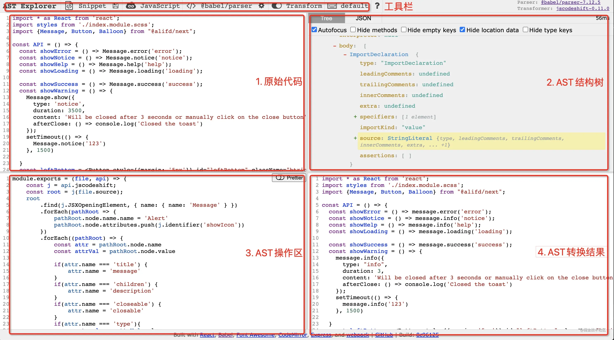
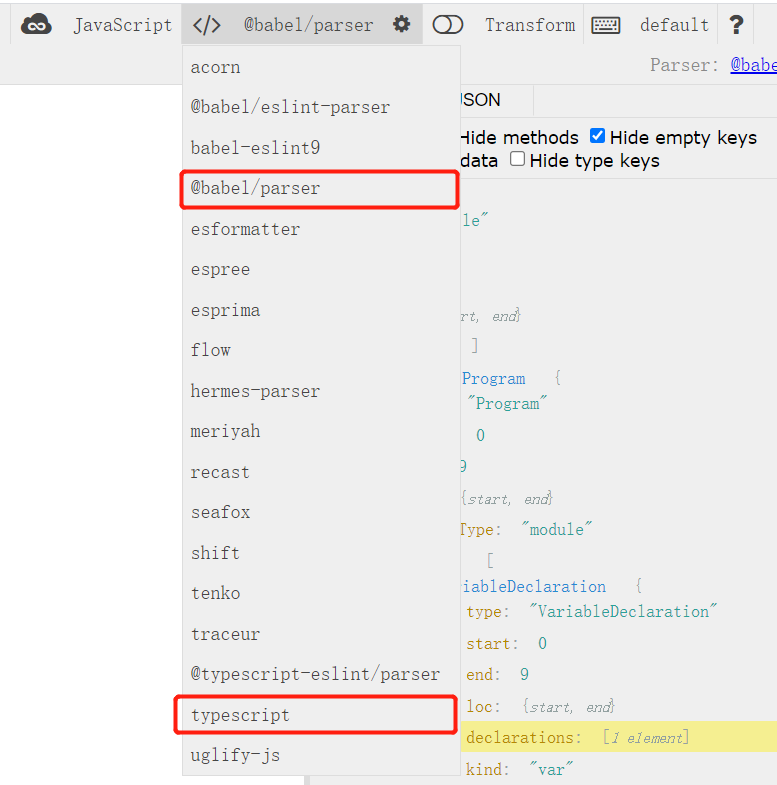
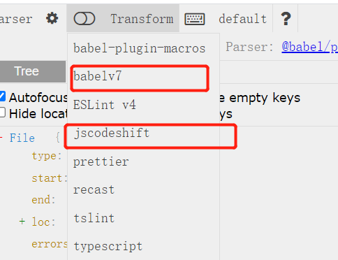
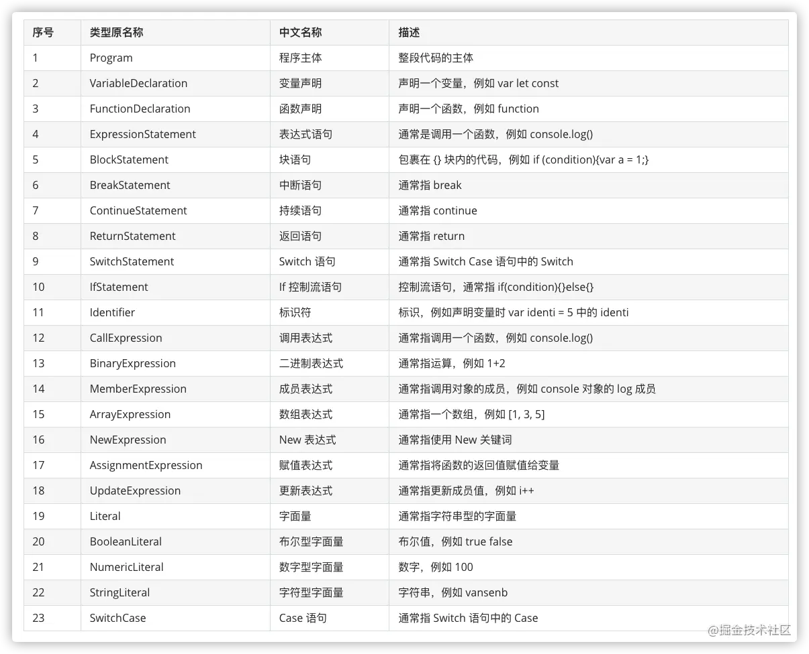
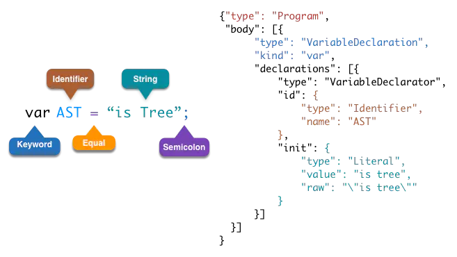
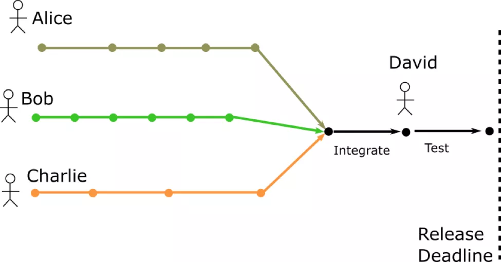
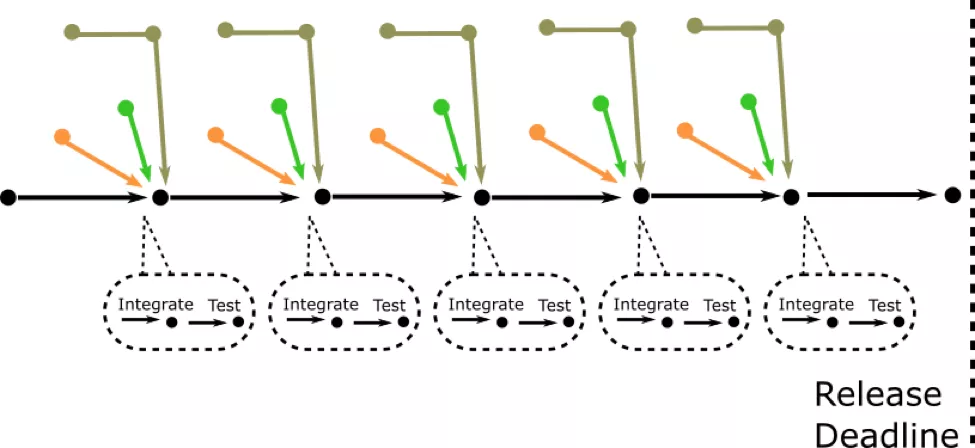
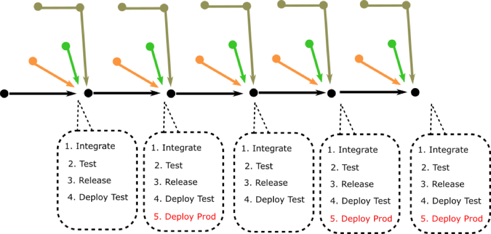
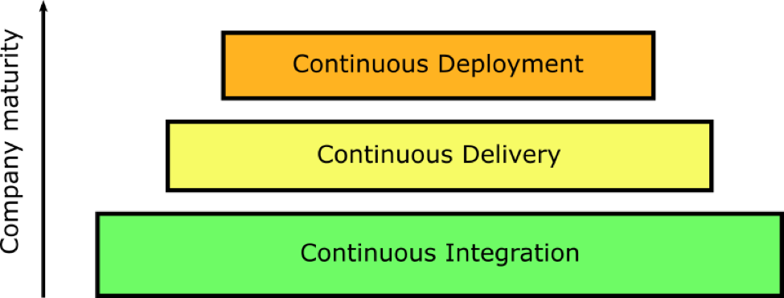
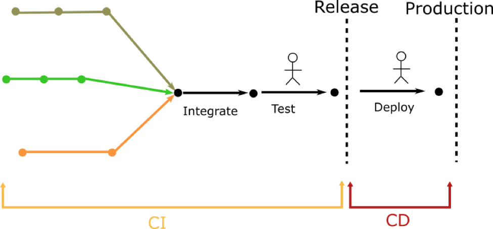

## AST

- 概念
  - 抽象语法树（abstract syntax code，AST）是源代码的抽象语法结构的树状表示，树上的每个节点都表示源代码中的一种结构
  - 之所以说是抽象的，抽象表示把 js 代码进行了结构化的转化，转化为一种数据结构。这种数据结构其实就是一个大的 json 对象
- 应用

  - JavaScript/TypeScript 的编译
  - eslint
  - babel 将 ES6 转为 ES5
  - CSS 预处理器
  - ...
  - UglifyJS 代码压缩、混淆
  - 根据注释生成可交互文档
  - 代码批量转换
  - ...

- 遍历 AST 原理【遍历 key，深度优先】
  - 前端领域的编译工具有挺多的，它们都是基于 AST，而操作 AST 就需要遍历来查找。
  - 先给结论：编译工具的遍历实现思路只有一种，就是找到每种 AST 的可遍历的 keys，深度优先的遍历。
  - eslint、babel、postcss、typescript compiler 这些编译工具的遍历 AST 的实现，有的用递归、有的用循环，有的是面向对象、有的是函数，有的是抽离 visitorKeys、有的是写死在代码里，但思路都是一样的。
- 工具：[AST Explorer](https://astexplorer.net/)
  - 可以看代码转为 AST 结构
  - 可以通过 babel 和 jscodeshift 的自定义规则进行代码转换
  - 
  - 
  - 
- 举个例子

  - var a = 1

  ```js

  {
    "type": "Program",
    "sourceType": "script",
    "body": [
      {
        "type": "VariableDeclaration",
        "kind": "var",
        "declarations": [
          {
            "type": "VariableDeclarator",
            "id": {
              "type": "Identifier",
              "name": "a"
            },
            "init": {
              "type": "Literal",
              "value": 1
            }
          }
        ]
      }
    ]
  }
  ```

  - 当我操作对象 init 中 value 的值 1 改为 2 时，对应的 js 也会跟着改变为 var a = 2 当我操作对象 id 中的 name 的值 a 改为 b 时， 对应的 js 也会跟着改变为 var b = 2
  - 操作 AST 无非就是操作一组有规则的 JSON， 那么只要明白规则，很快就可以掌握转换方法

- AST [节点类型](https://babeljs.io/docs/en/babel-types)
  - 

## babel 原理

- 它的功能：是个编译器，将源代码字符串传入，返回一段新的代码字符串，即不运行代码，也不组合打包代码，比如输入 ES6+的代码，编译为 ES5。除此之外，还可以压缩代码等。
- 底层依赖解析器生成 AST，babel 使用了 Babylon
- 示例是一个简单的声明赋值语句，经过 AST 转化后各部分内容的含义就更为清晰明了
  
- 有三个步骤：

  - 第一步解析：将代码字符串解析成 AST 抽象语法树，字符串变为对象结构
    - 词法分析(将字符串形式的代码转换为一个语法片段数组 Tokens )
    - 语义分析(依据标准进行判断，如语句、表达式、声明，把 Tokens 转换成 AST 形式)
  - 第二步变换：遍历 AST 抽象语法树进行修改，变换成另一个 AST 树【.babelrc 里配置的 presets 和 plugins 在此处工作】
    - 遍历器 traverser 接收两个参数,一个是 ast 节点对象,一个是 visitor,visitor 本质是挂载不同方法的 JavaScript 对象,visitor 也叫做访问者,顾名思义它会访问 ast 上每个节点,然后根据针对不同节点用相应的方法做出不同的转换.
  - 第三步再建：遍历变换后的 AST 抽象语法树再生成代码字符串

- Babel 的自定义转换代码流程

在 Babel 中我们使用者最常使用的地方就是代码转换，大家常用的 Babel 插件就是定义代码转换规则而生的，而代码解析和生成这一头一尾都主要是 Babel 负责。
比如我们要用 babel 做一个 React 转小程序的转换器，babel 工作流程的粗略情况是这样的：

1. babel 将 React 代码解析为抽象语法树
2. 开发者利用 **babel 插件**定义转换规则，根据原本的抽象语法树生成一个符合小程序规则的新抽象语法树
3. babel 则根据新的抽象语法树生成代码，此时的代码就是符合小程序规则的新代码

例如 Taro 就是用 babel 完成的小程序语法转换.

```js
// webpack.base.conf.js
module.exports = {
    module: {
        rules: [
        {
            test: /\.js$/,
            loader: 'babel-loader',
            include: [resolve('src'), resolve('test'), resolve('node_modules/webpack-dev-server/client')]
        },
        ]
    }
}

// .babelrc配置文件
{
  "presets": ["es2015", "stage-0"],           // 一组插件集合
  "plugins": ["transform-object-rest-spread", // 单独的每个插件
    [
      "transform-runtime", // 对于ES6+新特性，会自动引用模块babel-runtime中的polyfill(helper)
      {
        "helpers": false,
        "polyfill": false, //是否切换（Promise，Set，Map等）为使用非全局污染的 polyfill。
        "regenerator": true,
        "moduleName": "babel-runtime" //引入 helper要使用的模块的名称/路径
      }
    ]]
}
```

## CI/CD

### CI/CD 三部分

1. 持续集成 就是把多个码农写的代码集成到同一个分支，然后经过编译、测试、打包之后将程序保存到仓库中。
2. 持续交付 就是定时地、自动地从仓库中将最新的程序部署到测试环境里。
3. 持续部署 就是定时地、自动地将过去一个稳定的发布版本部署到生产环境里。

谁才是世界上最好的 CI/CD 工具？TeamCity、Jenkins、Travis CI、AppVeyor 或是 Azure Pipelines ？我的答案是“和开发流程不割裂的工具才是最好的工具”，在我们公司内部常用的代码托管平台是 Gitlab，同时其也向用户提供了 CI/CD 的集成工具，这样的话就为我们去定制一些前端的 CI/CD 流程提供了更多的想象空间。

### 持续集成

- 非持续集成（“简单”集成）
  

- 持续集成
  

- 合并和测试并不是在一个单一的有压力的集成时刻进行，集成一直在连续的时刻发生。

- 持续集成是开发软件的一种更好的方法（相比于“简单”集成），因为它：

  - 减少在合并 feature 时出现的意外次数
  - 解决“在我的机子上没问题”的问题
  - 将测试周期切片到每个 feature 逐渐合并到主线中的阶段（而不是一次性的）
  - 其结果就是，一个使用 CI 的团队不是生活在过山车上 (在开发时期很平静，伴随着的是有压力的 release)，而是可以在如何接近完成项目的渐进方式中得到更好的可见性。

### 持续交付（Delivery）

- 持续交付是尽可能频繁地组装和准备软件（就像它会被发布到生产那样）的实践。
- CD，让 CI 走得更远一步。在每个 feature 合并到主线中，软件不仅要测试正确性，而且也要包装和部署到测试环境（比较理想地符合生产环境）。所有这一切都是以完全自动化的方式。
  

### 持续部署（Deployment）

- CD 的 D 也可以表示部署，在持续交付的基础上，取消所有人工干预，发现准备好的 release candidate（候选版本）直接推送到生产。

- 正常来走 CI/CD，需要保证每个基础是稳固的，先 CI 再 CD。
  

  

## Jenkins

- 概念
  - 开源的持续集成、交付、部署的平台，基于 java 语言开发
  - 支持 CI、CD
  - 支持丰富插件：如 git，docker 等
- 使用
  - 安装 JDK8、Git、Jenkins
  - 安装 Jenkins 插件：git、gitlab、github、nodejs、Publish Over SSH
  - 配置 Webhook：管理前端项目的钩子，填写推送地址
  - 新建任务：Jenkins 新建任务，进行配置（地址和分支、构建触发器、构建环境、执行构建的 shell 也就是 npm install 那些）
  - 发布远程服务器（使用 publish over ssh 插件），配置 ip 地址，账号密码，目录地址
- 回滚
  - 通过打 tag 之后，配置参数化构建
  - 通过选择 Git 参数，设置为 tag
  - 立即构建转为 参数构建，可以通过选 tag 执行对应版本的构建，也方便做回滚操作

## Monorepo

- 概念：即一个仓库，多个逻辑子包 package
- 作用
  - 统一代码管理（只需要 clone 一个仓库）
  - 统一研发技术（开发语言、构建工具）
  - 简化跨项目调试（不需要 npm link 跨多个项目）
- 实现
  - 在管理多包单仓库上使用 npm@7 最新的 workspace 特性
  - 在开发语言上采用 TypeScript，代码本地调试（ts-node-debug）
  - 在构建工具上使用 Webpack
- 技术架构和组织结构有很大关系，选择适合组织的技术架构更重要。
  - 如果一个组织是分散的，使用 Monorepo 会有很大的协同成本
  - 如果一个组织是内聚的，Monorepo 能极大提效，比如前端研发工具链（qiankun 改造脚本、规范配置脚本、sentry 配置脚本）
- 避免了版本不对齐的问题

  - 对于 2C 产品，不需要多版本多主干分支，但多个 npm 依赖对齐版本也不容易
  - 对于 2B 产品，由于多环境、多版本，会更加复杂，复杂度极高。Monorepo 通过分支来统一内部依赖的版本

- 工程化和架构底座是团队的事情，靠个人很难去推动。
  - 短期可以靠战役靠照搬，长期要形成文化才能持续迭代。
  - 组织沟通成本高应该通过组织来解，通过技术来解的力量是渺小的。技术可以做的是充分发挥工具的优势，让变化快速发生。
