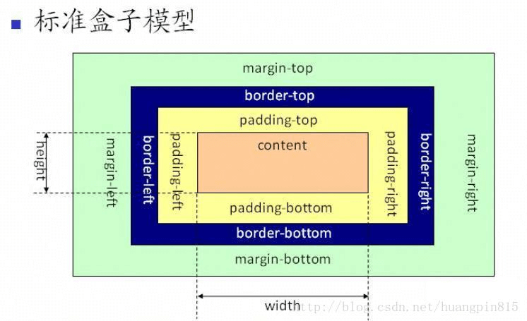
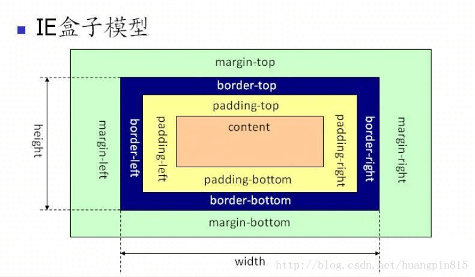
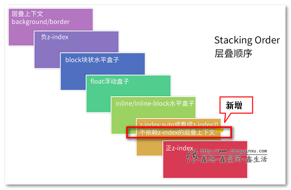

## Normal flow 
- 正常流(文档流)：块级元素从上往下纵向排布，行内元素从左向右排列。是传统的HTML文档布局。
- 浮动(float)、position中的绝对定位(absolute)和固定定位(fixed)三种方式定位会脱离文档流。
    - 浮动后，后面的元素无视它占据的区域，直接在它身下布局。但是后面文字会认同浮动元素的区域，围绕它布局，没有脱离文本流。
    - 绝对定位就既脱出文档流又脱出文本流，后面文字无视它占据的区域，不会环绕，直接身下布局。

## 盒子模型
- 盒模型由content（内容）、padding（内边距）、border（边框）、margin（外边距）组成。
- 标准模型（w3c）
    - box-sizing：content-box
    - 默认值，width=content，border和padding不计算入width之内
- 怪异模型（IE）
    - box-sizing：border-box
    - width=content+border+padding（常用）




## 选择器优先级（权重）
- CSS选择器的优先级是：!important > 内联 > ID选择器 > 类选择器 > 标签选择器
- !important声明的样式优先级最高
- 优先级相同，最后出现的优先级高   
- 具体组合的如何计算
    - 内联样式(A) > ID选择器(B) > 类选择器/伪类(C) > 标签选择器/属性选择器/伪元素(D) > 通配符 > 继承 > 浏览器默认属性
    - 从A到D，出现一次，次数就加1，分类计数。
    - 一一比较，直到比较出最大值，即可停止。
    ```css
    ul ol li .red {
        ...
    } //{0, 0, 1 ,3}
    #red {
    
    } //{0, 1, 0 ,0}
    ``` 

## link和import的区别
- 区别：
    - 加载顺序：link标签引入的 CSS 被同时加载；@import引入的 CSS 将在页面加载完毕后被加载。
    - 兼容性：link是html提供的标签，无兼容问题，@import 是 CSS2.1 ，IE5以上才能识别
    - DOM操作：js控制DOM插入link标签来改变样式，DOM无法控制@import
- 使用
    - 在html中使用
    ```html
    <link rel="stylesheet" type="text/css" href="./css/reset.css" />
    ```
- @import是css的语法规则 （可以看成css样式）
    - 用于其他样式表扩展
- 使用
    - 在html使用
    ```html
    <style type="text/css">
        @import url(CSS文件路径地址);
    </style>
    ```
    - CSS中使用
    ```css
    @import url(CSS文件路径地址);
    ```
    
## 居中
### 水平居中
- 行内元素
    - text-align: center
- 块级元素
    - flex：（父）flex + justify-content: center
    - margin：width：100px ; margin: 0 auto ;或者 子display:table;margin: 0 auto;
    - absolute+transform：absolute + transform（父relative+ 子absolute + left:50% + translateX（-50%））
### 垂直居中
- 单行内联：line-height: height
- 块级元素
    - flex：(父)flex + align-items:center (多个块并排)
    - absolute+负margin：(父relative+子absolute+top:50%+margin-top：-50px)
    - absolute+ transform：（父relative+子absolute+top:50%+translateY(-50%)）
### 水平垂直
- 父flex + justify-content : center+ align-items: center（父要设高度）
- 父flex/grid + 子margin auto（最简单）（父要设高度）
- 已知宽高：absolute+top50%+left50%+margin：-50px 0 0 -50px
- 未知宽高：absolute + transform（父relative+子absolute+top50%+left50%+translate（-50%，-50%））

## 双飞翼布局

## 层叠上下文
- 层叠顺序：负z-index > block > float > inline/inline-block > z-index:auto or 0 / 不依赖z-index的层叠上下文 > 正z-index 
- 谁大谁上：当具有明显的层叠水平标示的时候，如识别的z-indx值，在同一个层叠上下文领域，层叠水平值大的那一个覆盖小的那一个。
- 后来居上：当元素的层叠水平一致、层叠顺序相同的时候，在DOM流中处于后面的元素会覆盖前面的元素。





## inline-block的使用场景
- 使用
```css
display:inline-block
```
- 特性
    - 保持了inline元素不换行的特性
    - 拥有了block元素可以设置width和height的特性

- 使用场景(行内排列并且可以设置大小的场景)
    - 网页头部横向排列的菜单列表
    - 用a标签做按钮，可设置大小
    - 网页布局如三列布局

- 解决空隙问题
    - 移除标签之间的空格
    - 使用margin负值
    - 使用font-size:0、内部fontsize重新设置（推荐）
    - letter-spacing、字符间距设置负值
    - word-spacing、单词间距设置负值

## 使一个元素不可见的方式（常见3种+1种）
- display:none 文档流消失，不占空间、回流重绘、不可点击、不会继承
- visibility:hidden 隐藏元素，占空间、重绘、不可点击、可继承（子孙可设置取消隐藏）
- opacity:0 透明度为0，占空间、(提升为合成层不会重绘)、可点击、可继承（不能取消隐藏）
- z-index:-9999: 层级放最低，被覆盖

## 选择器有哪些
- id选择器#myid
- 类选择器.myclassname
- 伪类选择器a:hover,li:nth-child
- 标签选择器div、h1、p
- 相邻选择器h1+p（所有紧接在h1后面的第一个p元素）
- 子选择器ul>li（父元素为ul的所有li）
- 后代选择器li a（内部的所有a元素，不管嵌套多深）（h标签的后代使用其他h标签，失效）
- 通配符选择器*
- 属性选择器a[href="http://www.w3school.com.cn"]{...}、input[type="text"]{...}， `[attribute=value]`用于选取带有指定属性和值的元素。


## 伪类和伪元素（本质：是否抽象创造了新元素）

- 伪类：表示元素的一个状态
    - 一个冒号（:）
    - 用途：给某个状态/位置的元素添加的样式
        ```
        :active	匹配被用户激活的元素。即鼠标主键按下的元素或者tab键选中的元素
        :focus	表示获得焦点的元素
        :hover	滑过元素时，pc端指鼠标，移动端指触摸（通常会有bug）
        :link		所有尚未访问的链接
        :visited	用户已访问过的链接
        :first-child	一组兄弟元素中的第一个元素
        :nth-child(n)	找到所有当前元素的兄弟元素中符合条件的元素，例如2n+1就是查找1，3，5，7等
        :last-of-type	一组兄弟元素中的具有相同元素类型的最后一个元素
        :nth-of-type(n)	查找符合条件的相同元素类型的兄弟元素
        ```

- 伪元素：创立了一个DOM树外的元素，实际不在文档树中。
    - 两个冒号（::）CSS3要求
    - 用途：元素前增加文本、画小图标、清除浮动（clear：both）
        ```
        // before/after伪元素通过content属性来添加内容。默认是行内元素
        ::before	// 选中的元素的第一个子元素。
        ::after 	// 选中元素的最后一个子元素。
        ```

## BFC
- BFC全称是Block Formatting Context，即块级格式化上下文。
- 特点：
    - BFC是个独立的容器，外面的元素和里面的元素互不干扰。内部会垂直方向一个个放置。
    - 在同个BFC中相邻的块级元素的垂直外边距会折叠(Mastering margin collapsing)。
    - 计算BFC高度，浮动元素参与计算
    - BFC区域不会与浮动元素的box重叠
- 应用：
    - 解决边距重叠
    - 清除浮动（解决浮动元素的父元素高度塌陷）
    - 防止两列布局导致文字环绕（高度不一致）
- 如何创建BFC
    - 0、根元素`<html>`
    - 1、浮动元素：float:不为none。
    - 2、绝对定位：position 为absolute或fixed 
    - 3、display ：`inline-box` 、`flex`、`grid`、`table-cell`、 `table` 。
    - 4、overflow不为visible: hidden、auto、scroll。


## 位置position属性介绍

- static：默认值。位置设置为static的元素，正常文档流的位置，此时 top, right, bottom, left 和 z-index 属性无效。
- inherit，规定应该从父元素继承 position 属性的值。
- fixed：生成固对定位的元素。默认情况下，可定位于相对于屏幕视口（viewport）的位置。通过 “left”, “top”, “right” 以及 “bottom” 属性进行规定。元素的位置在屏幕滚动时不会改变。如：回到顶部按钮。
- absolute：生成绝对定位的元素。相对于距该元素最近的非 static 定位祖先元素进行定位。此元素的位置可通过 “left”、”top”、”right” 以及 “bottom” 属性来规定。
- relative：生成相对定位的元素，相对于相对于正常文档流进行定位。通过 “left”、”top”、”right” 以及 “bottom” 属性来设置此元素相对于自身位置的偏移。
- sticky：粘性定位。特性近似于relative和fixed的合体，像IOS通讯录的“顶屁股效果”

注意：浮动、绝对定位和固定定位会脱离文档流，相对定位不会脱离文档流，绝对定位相对于该元素最近的已定位的祖先元素，如果没有一个祖先元素设置定位，那么参照物是body层。

## 清除浮动的方法（3种）

> flex布局成主流，不常用浮动，副作用有点大

- 空div：
    ```html
    <div style="clear:both;"></div>
    ```
- .clearfix类名（伪元素实现，其最后子元素的后面会添加一个clear的div）
    ```css
    .clearfix {
        &:after {
            content: '';
            display: block;
            width:0;
            height: 0;
            clear: both;
            visibility: hidden;
        }
    }
    // 或者
    &:after {
        content: '';
        display: table;
        clear: both;
    }
    ```
- BFC：父级添加overflow: auto或overflow: hidden


## flex布局
- 容器：
    - flex-direction 主轴方向 ： row/column/row-reverse/column-reverse
    - flex-wrap 换行:nowrap/wrap/wrap-reverse
    - flex-flow = flex-direction 和 flex wrap 
    - justify-content 主轴对齐 :flex-start/flex-end/center/space-between/space-around
    - align-items 交叉轴对齐:flex-start/flex-end/center/baseline(容器的基线)/stretch(默认)拉伸
    - align-content 多轴线对齐:flex-start/flex-end/center/space-between/space-around/stretch(默认)拉伸

- 项目：
    - order 顺序 越小越靠前 可为负
    - flex-grow 放大比例，默认为 0。
    - flex-shrink 缩小比例，默认为 1。
    - flex-basis 本身大小（相当于width、height）
    - flex 简写grow shrink basis
    - align-self 独自的对齐方式:auto(默认)/flex-start/flex-end/center/baseline/stretch 可重写自己的align-items

- 常用：
    - flex: auto (1 1 auto) -> (放大比例1，缩小比例1，分配多余空间之前占据的主轴空间)
    - flex: 0 1 auto -> (grow为0，shrink为1，basis为auto)


> 引用自知乎一丝：CSS2.1 之前,一直没有一个专门的属性来解决网页布局问题,Float也好,position 也罢,都只是一种 Tricks 技巧.直到 Flexbox 的出现,非常方便的解决了网页一维布局的问题,而CSS Grid 则能更好的解决二维布局的问题

- flex和grid布局

    - 布局历史：表格布局 --> 定位布局 --> 浮动布局 --> flexbox布局 --> gridbox网格布局 
    - 目前移动端布局更多使用 flexbox 
    - flexbox 是一维布局，他只能在一条直线上放置你的内容区块；
    - grid是一个二维布局。它除了可以灵活的控制水平方向之外，还能轻易的控制垂直方向的布局模式，未来的布局。

## flex计算示例
- [知乎解释](https://zhuanlan.zhihu.com/p/24372279)


```html
<div class="container">
    <div class="left"></div>
    <div class="right"></div>
</div>

<style>
  * {
    padding: 0;
    margin: 0;
  }
  .container {
    width: 600px;
    height: 300px;
    display: flex;
  }
  .left {
    flex: 1 2 500px;
    background: red;
  }
  .right {
    flex: 2 1 400px;
    background: blue;
  }
</style>

```
- 空间不够时，让各个子元素收缩以适应有限的空间，使用 flex-shrink 的计算方式
    - 子元素的 flex-shrink 的值分别为 2，1

- 第一步：计算子元素总溢出值
    - 500 + 400 - 600 = 300

- 第二步：计算子元素的收缩权重总和（每个子元素权重为 flex-shrink * 宽度）
    - 2 * 500 + 1 * 400 = 1400

- 第三步：计算子元素该收缩多少（总溢出值 * 权重/权重总和）
    - left:  300 * 2(flex-shrink) * 500(width) / 1400 = 214.28
    - right: 300 * 1(flex-shrink) * 400(width) / 1400 = 85.72

- 第四步：子元素宽度减去收缩值，得到结果
    - left:  500 - 214.28 = 285.72
    - right: 400 - 85.72 = 314.28


```html
<div class="container">
    <div class="left"></div>
    <div class="right"></div>
</div>

<style>
  * {
    padding: 0;
    margin: 0;
  }
  .container {
    width: 1000px;
    height: 300px;
    display: flex;
  }
  .left {
    flex: 1 2 500px;
    background: red;
  }
  .right {
    flex: 2 1 400px;
    background: blue;
  }
</style>
```


- 空间有剩余时，各个子元素根据放大比例来分配剩余空间，使用 flex-grow 的计算方式
    - 子元素的 flex-grow 的值分别为 1，2
- 第一步：计算父元素的剩余空间
    - 1000 - (500 + 400) = 100
- 第二步：计算子元素权重总和
    - 1 + 2 = 3
- 第三步：计算子元素增加多少（剩余空间 * 放大系数/权重总和）
    - left:  100 * 1 / 3 = 33.33
    - right: 100 * 2 / 3 = 66.67
- 第四步：子元素宽度加上增量值，得到结果
    - left:  500 + 33.33 = 533.33
    - right: 400 + 66.67 = 466.67


总结：在不考虑 max/min-width 的前提下，子元素的宽度一定会被调整到适应父元素，或放大或缩小，放大计算比较简单，直接将剩余空间 * 放大比例即可得出。缩小计算比较复杂，要把自身宽度加入权重比例的计算。

## px、em、rem、vw、vh区别
- px ：pixel，像素，绝对单位，页面按精确像素展示。
- em：相对长度单位，基准点为父节点字体的大小，自身有font-size的按自身计算，可用于缩进，如text-indent: 2em。
- rem：相对长度单位，根(root em)，相对根节点html的字体大小，CSS3新加属性，chrome/firefox/IE9+支持，常用于移动端适配

    > rem是相对于根元素（html）的字体大小，而em是相对于其父元素的字体大小 
    
- vw、vh：视窗宽度/高度的1%,视窗宽高都是100vw/100vh

    > 类似百分比，不过百分比大部分针对的是父元素

## 方案&图标集合
- 画0.5px线（0.5px相当于高清屏物理像素的1px）
    - 方案：svg/transform在IOS和安卓的设备上都能完美支持
    - 伪元素+transform: height: 1px; transform: scaleY(0.5);.
        - 缺点：chrome缩放会变虚
        - 解决：transform-origin: 50% 100%;
        - 搭配媒体查询
            ```css
            .border_1px:before{
              content: '';
              position: absolute;
              top: 0;
              height: 1px;
              width: 100%;
              background-color: #000;
              transform-origin: 50% 100%;
            }

            /* 2倍屏 */
            @media only screen and (-webkit-min-device-pixel-ratio: 2.0) {
                .border_1px::before {
                    transform: scaleY(0.5);
                }
            }
            
            /* 3倍屏 */
            @media only screen and (-webkit-min-device-pixel-ratio: 3.0) {
                .border_1px::before {
                    transform: scaleY(0.33);
                }
            }
            ```
    - svg: div设置height：1px，background：url("data:")为一个svg文件,svg描边属性为物理像素的1px

        ```html
        <svg xmlns='http://www.w3.org/2000/svg' width='100%' height='1px'>
            <line x1='0' y1='0' x2='100%' y2='0' stroke='#000'></line>
        </svg>
        ```
        - 缺点：firefox的background-image，svg只支持命名的颜色，16进制无效果。
        - 解决：svg转成base64来解决
    - viewport缩放为dpr/1：让CSS像素等于真正的物理像素
        ```html
        <meta name="viewport" content="width=device-width,initial-sacle=0.5">
        ```

- 字体适配：(浏览器有字体最小限制)
    - PC上最小 font-size=12px
    - 手机上最小 font-size=8px
    - 如果小于最小字体，那么字体默认就是最小字体。
    - 强制缩放如下
        ```
        .text {
            font-size: 12px;
              /* font-size: 10px; */
              transform: scale(10/12); //0.83
        }
        ```

- 图片模糊问题
    - 位图（png、jpg...）每个像素点都具有特定的位置和颜色值
    - 每个像素对应在屏幕上使用一个物理像素来渲染，最佳显示效果
    - 高清屏（dpr>1）物理像素点并不能被准确的分配上对应位图像素的颜色
    - 方案一：根据不同dpr屏幕展示不同分辨率图片，2倍图/3倍图
    - srcset 配合 1x 2x 像素密度描述符
        ```html
        
        ```  
    - 使用window.devicePixelRatio获取设备像素比，遍历所有图片，替换图片地址
        ```js
        const dpr = window.devicePixelRatio;
        const images =  document.querySelectorAll('img');
        images.forEach((img)=>{
          img.src.replace(".", `@${dpr}x.`);
        })

        ```
    - 方案二：使用SVG，全称是可缩放矢量图
        ```html
        
        
        ```
- 横屏和竖屏显示不同的布局
    - JS
        ```js
        window.addEventListener("resize", ()=>{
            if (window.orientation === 180 || window.orientation === 0) { 
              // 正常方向或屏幕旋转180度
                console.log('竖屏');
            };
            if (window.orientation === 90 || window.orientation === -90 ){ 
               // 屏幕顺时钟旋转90度或屏幕逆时针旋转90度
                console.log('横屏');
            }  
        }); 

        ```
    - CSS
        ```css
        @media screen and (orientation: portrait) {
          /*竖屏...*/
        } 
        @media screen and (orientation: landscape) {
          /*横屏...*/
        }
        ```
## 管理CSS
- 如何选择：对外公共组件库，可用BEM。业务代码可用局部作用域。
- 1、BEM命名规范：
    - Bem 是块（block）、元素（element）、修饰符（modifier）的简写
        - 从类名可看出dom结构，更清晰，更语义化
        - 冗长的命名 减少了类名重复的可能性
    - 场景：有模块关系才用
    - 使用：block-name__element-name--color

        > __ 双下划线：连接子元素
    
        > -- 双横线：装饰或状态
    
    - 结合less、sass 的预处理器&符 简化冗长的命名
        ```css
        .form {  
         width: 12rem;  
         height: 6rem;
           
           &__input{
             font-size: 16px;
           }
           &__submit{    
             background: blue;
             &--disabled{
               background: gray;
             }
           }
        }
        // 编译成
        .form {  
         width: 12rem;  
         height: 6rem;
        }
        .form__input {  
         font-size: 16px;
        }
        .form__submit {  
         background: blue;
        }
        .form__submit--disabled {  
         background: gray;
        }
        ```

- 2、css modules
    - 通过hash实现类似于命名空间的方法，是唯一的
    - 在vue中模板中使用动态类绑定:class，并在类名前面加上'$style.'。style标签添加module属性`<style module>`，打开CSS-loader的模块模式，如果是自定义就去webpack配置
        ```html
        <template>
          <div :class="$style.bg">
            ...
          </div>
        </template>
        
        <style module>
        .bg {
          width: 100px;
          height: 100px;
          background-color: red;
        }
        </style>
        
        // 生成
        <div class="_3ylglHI_7ASkYw5BlOlYIv_0">...</span>
        ```
- 3、vue 中的scoped（局部作用域）
    - 原理：加上 scoped 属性的style会自动添加一个唯一的属性 。为不同的组件生成不同的属性选择器。
    - 比如data-v-0467f817为组件内 CSS 指定作用域，编译的时候 .errShow会被编译成类似 .errShow[data-v-0467f817]。
        ```html
        <span data-v-0467f817 class="errShow">用户名不得为空</span>
        
        .errShow[data-v-0467f817] {
            font-size: 12px;
            color: red;
        }
        ```

