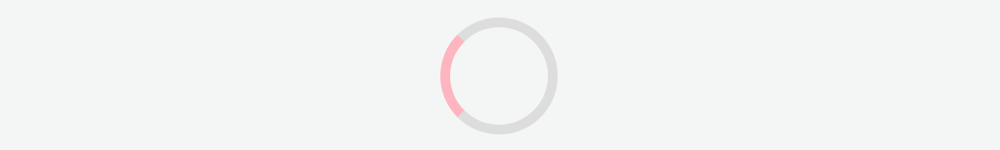
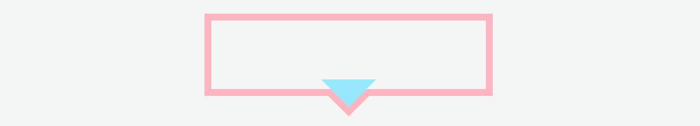

## Normal flow

- 正常流(文档流)：块级元素从上往下纵向排布，行内元素从左向右排列。是传统的 HTML 文档布局。
- 浮动(float)、position 中的绝对定位(absolute)和固定定位(fixed)三种方式定位会脱离文档流。
  - 浮动后，后面的元素无视它占据的区域，直接在它身下布局。但是后面文字会认同浮动元素的区域，围绕它布局，没有脱离文本流。
  - 绝对定位就既脱出文档流又脱出文本流，后面文字无视它占据的区域，不会环绕，直接身下布局。

## 盒子模型 ✨

- 盒模型由 content（内容）、padding（内边距）、border（边框）、margin（外边距）组成。
- 标准模型（w3c）
  - box-sizing：content-box
  - 默认值，width=content，border 和 padding 不计算入 width 之内
- 怪异模型（IE） - box-sizing：border-box - width=content+border+padding（常用）
  
  

## 获取元素的宽度和高度

- 元素自身宽高:`element.clientWidth / element.clientHeight`
  - 包括 padding 但不包括边框 border、外边距 margin 和垂直滚动条（如果有的话）
- 布局宽高:`element.offsetWidth/element.offsetHeight`
  - 包含元素的边框(border)、水平线上的内边距(padding)、竖直方向滚动条(scrollbar)（如果存在的话）、以及 CSS 设置的宽度(width)的值
- element.style.width/height 内联样式
- element.getBoundingClientRect().width/height 宽高和视口位置

## 选择器优先级（权重）✨

- CSS 选择器的优先级是：!important > 内联 > ID 选择器 > 类选择器 > 标签选择器
- !important 声明的样式优先级最高
- 优先级相同，最后出现的优先级高
- 具体组合的如何计算
  - 内联样式(A) > ID 选择器(B) > 类选择器/伪类(C) > 标签选择器/属性选择器/伪元素(D) > 通配符 > 继承 > 浏览器默认属性
  - 从 A 到 D，出现一次，对应计数就加 1，分类计数 {A,B,C,D}。
  - 从 A 的数量逐个比较，直到比较出最大值，即可停止。
  ```css
  ul ol li .red {
    ...;
  } //{0, 0, 1 ,3}
  #red {
  } //{0, 1, 0 ,0}
  ```

## link 和 import 的区别

- 区别：
  - 加载顺序：link 标签引入的 CSS 被同时加载；@import 引入的 CSS 将在页面加载完毕后被加载。
  - 兼容性：link 是 html 提供的标签，无兼容问题，@import 是 CSS2.1 ，IE5 以上才能识别
  - DOM 操作：js 控制 DOM 插入 link 标签来改变样式，DOM 无法控制@import
- 使用
  - 在 html 中使用
  ```html
  <link rel="stylesheet" type="text/css" href="./css/reset.css" />
  ```
- @import 是 css 的语法规则 （可以看成 css 样式）
  - 用于其他样式表扩展
- 使用
  - 在 html 使用
  ```html
  <style type="text/css">
    @import url(CSS文件路径地址);
  </style>
  ```
  - CSS 中使用
  ```css
  @import url(CSS文件路径地址);
  ```

## 居中 ✨

### 水平居中

- 行内元素
  - text-align: center
- 块级元素
  - flex：（父）flex + justify-content: center
  - margin：width：100px ; margin: 0 auto ;或者 子 display:table;margin: 0 auto;
  - absolute+transform：absolute + transform（父 relative+ 子 absolute + left:50% + translateX（-50%））

### 垂直居中

- 单行内联：line-height: height
- 块级元素
  - flex：(父)flex + align-items:center (多个块并排)
  - absolute+负 margin：(父 relative+子 absolute+top:50%+margin-top：-50px)
  - absolute+ transform：（父 relative+子 absolute+top:50%+translateY(-50%)）

### 水平垂直

- 父 flex + justify-content : center+ align-items: center（父要设高度）
- 父 flex/grid + 子 margin auto（最简单）（父要设高度）
- 已知宽高：absolute+top50%+left50%+margin：-50px 0 0 -50px
- 未知宽高：absolute + transform（父 relative+子 absolute+top50%+left50%+translate（-50%，-50%））

## 双飞翼布局

## 层叠上下文

- 层叠顺序：负 z-index < **block < float < inline/inline-block** < z-index:auto or 0 / 不依赖 z-index 的层叠上下文 < 正 z-index
- 谁大谁上：当具有明显的层叠水平标示的时候，如识别的 z-indx 值，在同一个层叠上下文领域，层叠水平值大的那一个覆盖小的那一个。
- 后来居上：当元素的层叠水平一致、层叠顺序相同的时候，在 DOM 流中处于后面的元素会覆盖前面的元素。


## inline-block 的使用场景

- 使用

```css
display: inline-block;
```

- 特性

  - 保持了 inline 元素不换行的特性
  - 拥有了 block 元素可以设置 width 和 height 的特性

- 使用场景(行内排列并且可以设置大小的场景)

  - 网页头部横向排列的菜单列表
  - 用 a 标签做按钮，可设置大小
  - 网页布局如三列布局

- 解决 inline-block 的空隙问题
  - 使用 font-size:0、内部 fontSize 重新设置（推荐）
  - 移除标签之间的空格
  - 使用 margin 负值
  - letter-spacing、字符间距设置负值
  - word-spacing、单词间距设置负值

## 使一个元素不可见的方式（常见 3 种+1 种）

- 简单说它们的特点：display:none 不占空间、visibility:hidden 子孙可取消隐藏、opacity:0 可点击
- display:none 文档流消失，不占空间、回流重绘、不可点击、不会继承
- visibility:hidden 隐藏元素，占空间、重绘、不可点击、可继承（子孙可设置取消隐藏）
- opacity:0 透明度为 0，占空间、(提升为合成层不会重绘)、可点击、可继承（不能取消隐藏）
- z-index:-9999: 层级放最低，被覆盖

## CSS3

- 1、RGBA 和透明度(opacity)
- 2、圆角（border-radius:8px）
- 3、盒模型 box-sizing
- 4、盒阴影 box-shadow：10px 10px 5px #888888(横向，纵向，褪色渐变半径，颜色)
- 5、文字阴影 text-shadow： 5px 5px 5px #FF0000;（水平阴影，垂直阴影，模糊距离，阴影颜色）
- 6、文本换行 word-wrap：break-word（对长的不可分割单词换行）
- 7、边框图片：border-image:url(border.png) 30 30 round
- 8、 background-image (多背景，逗号隔开)
  background-size：length|percentage|cover|contain;
  background-repeat：no-repeat|repeat-x  
  background-origin(content-box/padding-box/border-box)
- 9、transform 转换：旋转、缩放、定位
- 10、transition 过渡
- 11、animation 动画
- 12、媒体查询：当浏览器的尺寸变化时会采用不同的属性
- 13、弹性布局 flex
- 14、栅格布局 grid

## 选择器有哪些

- id 选择器#myid
- 类选择器.myclassname
- 伪类选择器 a:hover,li:nth-child
- 标签选择器 div、h1、p
- 相邻选择器 h1+p（所有紧接在 h1 后面的第一个 p 元素）
- 子选择器 ul>li（父元素为 ul 的所有 li）
- 后代选择器 li a（内部的所有 a 元素，不管嵌套多深）（h 标签的后代使用其他 h 标签，失效）
- 通配符选择器\*
- 属性选择器 a[href="http://www.w3school.com.cn"]{...}、input[type="text"]{...}， `[attribute=value]`用于选取带有指定属性和值的元素。

## 伪类和伪元素（本质：是否抽象创造了新元素）✨

- 伪类：表示元素的一个状态

  - 一个冒号（:）
  - 用途：给某个状态/位置的元素添加的样式
    ```
    :active	匹配被用户激活的元素。即鼠标主键按下的元素或者tab键选中的元素
    :focus	表示获得焦点的元素
    :hover	滑过元素时，pc端指鼠标，移动端指触摸（通常会有bug）
    :link		所有尚未访问的链接
    :visited	用户已访问过的链接
    :first-child	一组兄弟元素中的第一个元素
    :nth-child(n)	找到所有当前元素的兄弟元素中符合条件的元素，例如2n+1就是查找1，3，5，7等
    :last-of-type	一组兄弟元素中的具有相同元素类型的最后一个元素
    :nth-of-type(n)	查找符合条件的相同元素类型的兄弟元素
    ```

- 伪元素：创立了一个 DOM 树外的元素，实际不在文档树中。
  - 两个冒号（::）CSS3 要求
  - 用途：元素前增加文本、画小图标、清除浮动（clear：both）
    ```
    // before/after伪元素通过content属性来添加内容。默认是行内元素
    ::before	// 选中的元素的第一个子元素。
    ::after 	// 选中元素的最后一个子元素。
    ```

## BFC ✨

- BFC 全称是 Block Formatting Context，即块级格式化上下文。
- 特点：
  - BFC 是个独立的容器，外面的元素和里面的元素互不干扰。内部会垂直方向一个个放置。
  - 在同个 BFC 中相邻的块级元素的垂直外边距会折叠(Mastering margin collapsing)。
  - 计算 BFC 高度，浮动元素参与计算
  - BFC 区域不会与浮动元素的 box 重叠
- 应用：
  - 创建不同 BFC，解决同个 BFC 的边距重叠问题
  - 清除浮动（解决浮动元素的父元素高度塌陷）
  - 防止两列布局导致文字环绕（高度不一致）
- 如何创建 BFC
  - 0、根元素`<html>`
  - 1、浮动元素：float:left/right
  - 2、绝对定位：position 为 absolute 或 fixed
  - 3、display ：`inline-box` 、`flex`、`grid`、`table-cell`、 `table` 。
  - 4、overflow 不为 visible: 可以是 hidden、auto、scroll

## 位置 position 属性介绍 ✨

- static：默认值。位置设置为 static 的元素，正常文档流的位置，此时 top, right, bottom, left 和 z-index 属性无效。
- inherit，规定应该从父元素继承 position 属性的值。
- fixed：生成固对定位的元素。默认情况下，可定位于相对于屏幕视口（viewport）的位置。通过 “left”, “top”, “right” 以及 “bottom” 属性进行规定。元素的位置在屏幕滚动时不会改变。如：回到顶部按钮。
- absolute：生成绝对定位的元素。相对于距该元素最近的非 static 定位祖先元素进行定位。此元素的位置可通过 “left”、”top”、”right” 以及 “bottom” 属性来规定。
- relative：生成相对定位的元素，相对于相对于正常文档流进行定位。通过 “left”、”top”、”right” 以及 “bottom” 属性来设置此元素相对于自身位置的偏移。
- sticky：粘性定位。特性近似于 relative 和 fixed 的合体，像 IOS 通讯录的“顶屁股效果”

- 注意
  - 浮动、绝对定位和固定定位会脱离文档流，相对定位不会脱离文档流。
  - 绝对定位相对于该元素最近的已定位的祖先元素，如果没有一个祖先元素设置定位，那么参照物是 body 层。

## 清除浮动的方法（1+2 种）

> flex 布局成主流，不常用浮动，副作用有点大

- BFC：父级添加 overflow: auto 或 overflow: hidden
- 两种形式使用 clear：both
  - 空 div
  ```html
  <div style="clear:both;"></div>
  ```
  - .clearfix 类名（伪元素实现，其最后子元素的后面会添加一个 clear 的 div）
  ```css
  .clearfix {
    &:after {
      content: "";
      display: block;
      width: 0;
      height: 0;
      clear: both;
      visibility: hidden;
    }
  }
  // 或者
  &:after {
    content: "";
    display: table;
    clear: both;
  }
  ```

## flex 布局 ✨

- 容器：

  - flex-direction 主轴方向 ： row/column/row-reverse/column-reverse
  - flex-wrap 换行:nowrap/wrap/wrap-reverse
  - flex-flow = flex-direction 和 flex wrap
  - justify-content 主轴对齐 :flex-start/flex-end/center/space-between/space-around
  - align-items 交叉轴对齐:flex-start/flex-end/center/baseline(容器的基线)/stretch(默认)拉伸
  - align-content 多轴线对齐:flex-start/flex-end/center/space-between/space-around/stretch(默认)拉伸

- 项目：

  - order 顺序 越小越靠前 可为负
  - flex-grow 放大比例，默认为 0。
  - flex-shrink 缩小比例，默认为 1。
  - flex-basis 本身大小（相当于 width、height）
  - flex 简写 grow shrink basis
  - align-self 独自的对齐方式:auto(默认)/flex-start/flex-end/center/baseline/stretch 可重写自己的 align-items

- 常用：
  - flex: auto (1 1 auto) -> (放大比例 1，缩小比例 1，分配多余空间之前占据的主轴空间)
  - flex: 0 1 auto -> (grow 为 0，shrink 为 1，basis 为 auto)

> 引用自知乎一丝：CSS2.1 之前,一直没有一个专门的属性来解决网页布局问题,Float 也好,position 也罢,都只是一种 Tricks 技巧.直到 Flexbox 的出现,非常方便的解决了网页一维布局的问题,而 CSS Grid 则能更好的解决二维布局的问题

- flex 和 grid 布局

  - 布局历史：表格布局 --> 定位布局 --> 浮动布局 --> flexbox 布局 --> gridbox 网格布局
  - 目前移动端布局更多使用 flexbox
  - flexbox 是一维布局，他只能在一条直线上放置你的内容区块；
  - grid 是一个二维布局。它除了可以灵活的控制水平方向之外，还能轻易的控制垂直方向的布局模式，未来的布局。

## flex 计算示例

- [知乎解释](https://zhuanlan.zhihu.com/p/24372279)

```html
<div class="container">
  <div class="left"></div>
  <div class="right"></div>
</div>

<style>
  * {
    padding: 0;
    margin: 0;
  }
  .container {
    width: 600px;
    height: 300px;
    display: flex;
  }
  .left {
    flex: 1 2 500px;
    background: red;
  }
  .right {
    flex: 2 1 400px;
    background: blue;
  }
</style>
```

- 空间不够时，让各个子元素收缩以适应有限的空间，使用 flex-shrink 的计算方式

  - 子元素的 flex-shrink 的值分别为 2，1

- 第一步：计算子元素总溢出值

  - 500 + 400 - 600 = 300

- 第二步：计算子元素的收缩权重总和（每个子元素权重为 flex-shrink \* 宽度）

  - 2 _ 500 + 1 _ 400 = 1400

- 第三步：计算子元素该收缩多少（总溢出值 \* 权重/权重总和）

  - left: 300 _ 2(flex-shrink) _ 500(width) / 1400 = 214.28
  - right: 300 _ 1(flex-shrink) _ 400(width) / 1400 = 85.72

- 第四步：子元素宽度减去收缩值，得到结果
  - left: 500 - 214.28 = 285.72
  - right: 400 - 85.72 = 314.28

```html
<div class="container">
  <div class="left"></div>
  <div class="right"></div>
</div>

<style>
  * {
    padding: 0;
    margin: 0;
  }
  .container {
    width: 1000px;
    height: 300px;
    display: flex;
  }
  .left {
    flex: 1 2 500px;
    background: red;
  }
  .right {
    flex: 2 1 400px;
    background: blue;
  }
</style>
```

- 空间有剩余时，各个子元素根据放大比例来分配剩余空间，使用 flex-grow 的计算方式
  - 子元素的 flex-grow 的值分别为 1，2
- 第一步：计算父元素的剩余空间
  - 1000 - (500 + 400) = 100
- 第二步：计算子元素权重总和
  - 1 + 2 = 3
- 第三步：计算子元素增加多少（剩余空间 \* 放大系数/权重总和）
  - left: 100 \* 1 / 3 = 33.33
  - right: 100 \* 2 / 3 = 66.67
- 第四步：子元素宽度加上增量值，得到结果
  - left: 500 + 33.33 = 533.33
  - right: 400 + 66.67 = 466.67

总结：在不考虑 max/min-width 的前提下，子元素的宽度一定会被调整到适应父元素，或放大或缩小，放大计算比较简单，直接将剩余空间 \* 放大比例即可得出。缩小计算比较复杂，要把自身宽度加入权重比例的计算。

## px、em、rem、vw、vh 区别 ✨

- px ：pixel，像素，绝对单位，页面按精确像素展示。
- em：相对长度单位，基准点为父节点字体的大小，自身有 font-size 的按自身计算，可用于缩进，如 text-indent: 2em。
- rem：相对长度单位，根(root em)，相对根节点 html 的字体大小，CSS3 新加属性，chrome/firefox/IE9+支持，常用于移动端适配

  > rem 是相对于根元素（html）的字体大小，而 em 是相对于其父元素的字体大小

- vw、vh：视窗宽度/高度的 1%,视窗宽高都是 100vw/100vh

  > 类似百分比，不过百分比大部分针对的是父元素

## 中后台常见布局

- 最外层设`relative`，并分为左侧和右侧两大部分
- 左侧：导航栏，`position:fixed`固定定位，里面存放多个菜单选项 el-submenu
- 右侧：整体距离左侧`margin-left`为导航栏的宽度，内部设为竖型的 flex 布局，上下两部分
  - 上部分：横向固定信息栏`position:fixed`，top 和 right 都为 0
  - 下部分：主视区域，存放显示的路由子页面内容`<router-view :key="key"></router-view>`

## 方案&图标集合

- 画 0.5px 线（0.5px 相当于高清屏物理像素的 1px）

  - 方案：svg/transform 在 IOS 和安卓的设备上都能完美支持
  - 伪元素+transform: height: 1px; transform: scaleY(0.5);.

    - 缺点：chrome 缩放会变虚
    - 解决：transform-origin: 50% 100%;
    - 搭配媒体查询

      ```css
      .border_1px:before {
        content: "";
        position: absolute;
        top: 0;
        height: 1px;
        width: 100%;
        background-color: #000;
        transform-origin: 50% 100%;
      }

      /* 2倍屏 */
      @media only screen and (-webkit-min-device-pixel-ratio: 2) {
        .border_1px::before {
          transform: scaleY(0.5);
        }
      }

      /* 3倍屏 */
      @media only screen and (-webkit-min-device-pixel-ratio: 3) {
        .border_1px::before {
          transform: scaleY(0.33);
        }
      }
      ```

  - svg: div 设置 height：1px，background：url("data:")为一个 svg 文件,svg 描边属性为物理像素的 1px

    ```html
    <svg xmlns="http://www.w3.org/2000/svg" width="100%" height="1px">
      <line x1="0" y1="0" x2="100%" y2="0" stroke="#000"></line>
    </svg>
    ```

    - 缺点：firefox 的 background-image，svg 只支持命名的颜色，16 进制无效果。
    - 解决：svg 转成 base64 来解决

  - viewport 缩放为 dpr/1：让 CSS 像素等于真正的物理像素
    ```html
    <meta name="viewport" content="width=device-width,initial-sacle=0.5" />
    ```

- 字体适配：(浏览器有字体最小限制)

  - PC 上最小 font-size=12px
  - 手机上最小 font-size=8px
  - 如果小于最小字体，那么字体默认就是最小字体。
  - 强制缩放如下
    ```css
    .text {
      font-size: 12px;
      /* font-size: 10px; */
      transform: scale(10/12); //0.83
    }
    ```

- 超出部分隐藏：

单行：超出隐藏+超出省略号+禁止换行

```css
.div {
  width: 100px;
  overflow: hidden;
  text-overflow: ellipsis;
  white-space: nowrap;
}
```

多行：显示行数-webkit-line-clamp: 2(不支持 IE 浏览器)

> -webkit-line-clamp CSS 属性 可以把 块容器 中的内容限制为指定的行数，同时还要设置 display:-webkit-box(弹性伸缩盒子) 并且 -webkit-box-orient:vertical(子元素的排列方式)

```css
.div {
  width: 100px;
  overflow: hidden;
  text-overflow: ellipsis;
  white-space: nowrap;
  display: -webkit-box;
  -webkit-line-clamp: 2;
  -webkit-box-orient: vertical;
}
```

- 图片模糊问题

  - 位图（png、jpg...）每个像素点都具有特定的位置和颜色值
  - 每个像素对应在屏幕上使用一个物理像素来渲染，最佳显示效果
  - 高清屏（dpr>1）物理像素点并不能被准确的分配上对应位图像素的颜色
  - 方案一：根据不同 dpr 屏幕展示不同分辨率图片，2 倍图/3 倍图

    - srcset 地址 + 1x 2x 像素密度描述符自动切换 src
      ```html
      
      ```
    - 使用 window.devicePixelRatio 获取设备像素比，遍历所有图片，替换图片地址
      ```js
      const dpr = window.devicePixelRatio;
      const images = document.querySelectorAll("img");
      images.forEach((img) => {
        img.src.replace(".", `@${dpr}x.`);
      });
      ```

  - 方案二：使用 SVG，全称是可缩放矢量图
    ```html
     
    ```

- 横屏和竖屏显示不同的布局

  - JS

    ```js
    window.addEventListener("resize", () => {
      if (window.orientation === 180 || window.orientation === 0) {
        // 正常方向或屏幕旋转180度
        console.log("竖屏");
      }
      if (window.orientation === 90 || window.orientation === -90) {
        // 屏幕顺时钟旋转90度或屏幕逆时针旋转90度
        console.log("横屏");
      }
    });
    ```

  - CSS
    ```css
    @media screen and (orientation: portrait) {
      /*竖屏...*/
    }
    @media screen and (orientation: landscape) {
      /*横屏...*/
    }
    ```

- 画圆形
  - border-radius: 50%宽高的一半

```html
<div class="circle"></div>
```

```css
.circle {
  width: 100px;
  height: 100px;
  background-color: #ffb5bf;
  border-radius: 50%; /* 或者 50px */
}
```

- 画椭圆
  - border-radius：50% 宽为长轴，高为短轴

```html
<div class="circle"></div>
```

```css
.circle {
  width: 200px;
  height: 100px;
  background-color: #ffb5bf;
  border-radius: 50%;
}
```

- 画三角形
  - 等腰三角形：设置 div 宽高为 0，去掉 top 的 border，两边设置 transparent 隐藏

```html
<div class="box"></div>
```

```css
.box {
  width: 0;
  height: 0;
  border-right: 50px solid transparent;
  border-left: 50px solid transparent;
  border-bottom: 50px solid #ffb5bf;
}
```

    - 直角三角形：设置div宽高为0，设置相邻两边border，其中一边设置transparent隐藏

```css
.box {
  width: 0;
  height: 0;
  border-top: 50px solid #ffb5bf;
  border-right: 50px solid transparent;
}
```

- loading 加载动画
  - 静态圆+边框+单边框颜色+动画+状态转换 from {rotate(0deg)} to {rotate(360deg)}

```html
<div class="loading"></div>
```

```css
.loading {
  width: 50px;
  height: 50px;
  display: inline-block;
  border: 5px solid #ddd;
  border-left-color: #ffb5bf;
  border-radius: 50%;
}

.loading {
  animation: loading-animation 1.2s linear infinite;
}
@keyframes loading-animation {
  0% {
    transform: rotate(0deg);
  }
  100% {
    transform: rotate(360deg);
  }
}
```



- 气泡对话框
  - 矩形+两个倒三角错开重叠+叠在上面的三角形颜色设置为背景色

```html
<div class="bubble">
  <div class="triangle common"></div>
  <div class="cover common"></div>
  <!-- 用来覆盖的倒三角 -->
</div>
```

```css
.bubble {
  width: 200px;
  height: 50px;
  border: 5px solid #ffb5bf;
  position: relative;
}
.common {
  width: 0;
  height: 0;
  position: absolute; /* 使用绝对定位 */
  left: 50%;
  transform: translate(-50%, 0); /* 水平居中 */
}
.triangle {
  bottom: -20px;
  border-top: 20px solid #ffb5bf;
  border-right: 20px solid transparent;
  border-left: 20px solid transparent;
}
.cover {
  bottom: -13px;
  border-top: 20px solid #94e8ff;
  border-right: 20px solid transparent;
  border-left: 20px solid transparent;
}
```

- 最后将覆盖的三角形颜色该为背景色即可。



## 预处理器和后处理器

- 预处理器

  - Less、Sass、Stylus，用来预编译 Sass 或 Less 文件，编译出合法的 CSS 给浏览器用。
  - 功能：嵌套层级、mixin、变量、循环、函数等，模块化开发，提高可复用行和工作效率。

- 后处理器
  - PostCSS，通常被视为在完成的样式表中根据 CSS 规范处理 CSS，让其更有效
  - 功能：添加浏览器私有前缀，单位换算。

## 管理 CSS

- 如何选择：对外公共组件库，可用 BEM。业务代码可用局部作用域。
- 1、BEM 命名规范：

  - Bem 是块（block）、元素（element）、修饰符（modifier）的简写
    - 从类名可看出 dom 结构，更清晰，更语义化
    - 冗长的命名 减少了类名重复的可能性
  - 场景：有模块关系才用
  - 使用：block-name\_\_element-name--color

    > \_\_ 双下划线：连接子元素

    > -- 双横线：装饰或状态

  - 结合 less、sass 的预处理器&符 简化冗长的命名

    ```css
    .form {
      width: 12rem;
      height: 6rem;

      &__input {
        font-size: 16px;
      }
      &__submit {
        background: blue;
        &--disabled {
          background: gray;
        }
      }
    }
    // 编译成
    .form {
      width: 12rem;
      height: 6rem;
    }
    .form__input {
      font-size: 16px;
    }
    .form__submit {
      background: blue;
    }
    .form__submit--disabled {
      background: gray;
    }
    ```

- 2、css modules

  - 通过 hash 实现类似于命名空间的方法，是唯一的
  - 在 vue 中模板中使用动态类绑定:class，并在类名前面加上'$style.'。style 标签添加 module 属性`<style module>`，打开 CSS-loader 的模块模式，如果是自定义就去 webpack 配置

    ```html
    <template>
      <div :class="$style.bg">
        ...
      </div>
    </template>

    <style module>
    .bg {
      width: 100px;
      height: 100px;
      background-color: red;
    }
    </style>

    // 生成
    <div class="_3ylglHI_7ASkYw5BlOlYIv_0">...</span>
    ```

- 3、vue 中的 scoped（局部作用域）

  - 原理：加上 scoped 属性的 style 会自动添加一个唯一的属性 。为不同的组件生成不同的属性选择器。
  - 比如 data-v-0467f817 为组件内 CSS 指定作用域，编译的时候 .errShow 会被编译成类似 .errShow[data-v-0467f817]。

    ```html
    <span data-v-0467f817 class="errShow">用户名不得为空</span>

    .errShow[data-v-0467f817] { font-size: 12px; color: red; }
    ```
