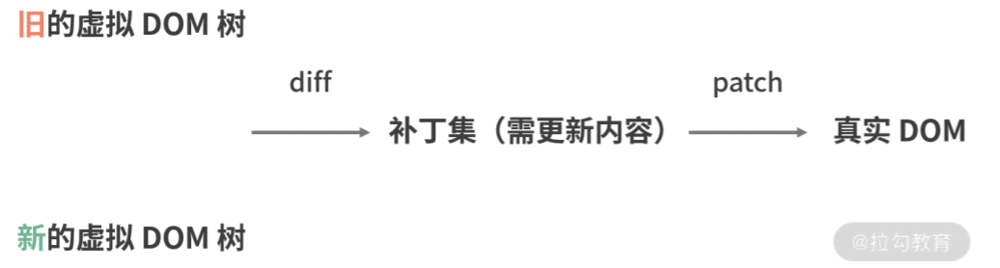

## 主流框架的原理

- 相同：UI=f(state) 框架内部运行机制 根据状态渲染视图
- 区别：更新粒度不同，但没有优劣之分，只是对应实现不同
  - 应用级：React
    - 依赖虚拟 DOM
    - 不关心触发更新的节点（通过虚拟 DOM 全树 进行 diff 对比找到）
  - 组件级：Vue2
    - 依赖虚拟 DOM+ 细粒度更新
    - 关心触发更新的节点（只会对比该节点所在的组件级别的虚拟 DOM 树，不是全树）
  - 节点级：Svelte
    - 依赖预编译+ 细粒度更新，关联节点与其更新的方法，使用发布订阅监听状态变化，执行 update 方法更新视图
    - 关心触发更新的节点（节点和更新方法一一对应）

## React 和 Vue 的区别

> 相同的有：虚拟 DOM、组件化、核心库和功能库分开；

> 不同的有：Vue 推荐模板 template、React 推荐 JSX、React 是单向数据流，Vue 是双向绑定、改变视图数据方式不同、Vue 上手成本低。

- 相同

  - 虚拟 DOM
  - 组件化的架构
  - 核心库和其他功能库(如路由和状态管理库)

- 不同（新）
  | | React | Vue |
  | :------: | :------------------------------------------------: | :-----------------------------------------------------: |
  | 模板语法 | JSX，原生 JS 实现循环，条件 | Template(单文件组件), v-if 等指令实现条件等，也支持 JSX |
  | 数据流 | 单向 | 双向，响应式系统 |
  | 改变数据 | 显式调用 setState 改变状态 | 响应式渲染，通过数据劫持+发布订阅 |
  | 渲染优化 | shouldComponentUpdate 返回 false 避免不必要的 diff | 依赖收集，精确知道哪个组件更新 |
  | 上手成本 | 较高（JSX 和 ES6） | 较低（HTML、CSS、JS） |
  | 优点 | 大型项目、社区生态强大 | 上手简单、渲染快、体积小 |

- 不同（旧）

  - 改变数据：Vue 不需要想 React 那样 setState 改变状态，是响应式渲染页面的。
    - 数据劫持优势 1：无需显示调用，Vue 运用数据劫持+发布订阅,直接通知变化并驱动视图，react 则需要显示调用 setState
    - 数据劫持优势 2：精确得知变化数据 newVal
  - 组件更新：Vue 是收集依赖，精确知道哪个组件要更新，React 需要手动 shouldComponentUpdate 来表示该组件应该更新，较难优化。
  - Template 和 JSX： React 中只能使用 JSX 的渲染函数。Vue 推荐使用模板(单文件组件)，可以在偏视图组件使用模板，偏逻辑组件使用 JSX 或渲染函数。
  - 新建项目：Vue 提供了 CLI 脚手架，可选择适合自己的模板。React 在这方面也提供了 create-react-app，项目生成时不允许配置，只有默认生成单页应用的选项。
  - 上手成本：React 需要知道 JSX 和 ES2015，成本较高，Vue 起步看指南即可建立简单应用。
  - 原生渲染：Vue 对应 weex，React 对应 React Native，实现平台开发。
  - Vue 设置样式的默认方法是单文件组件里类似 style 的标签， React 中是通过 CSS-in-JS 的方案。

  - Vue 的优势是：【模板写法，上手简单】
    - 模板和渲染函数的弹性选择
    - 简单的语法和项目配置
    - 更快的渲染速度和更小的体积
  - React 的优势是：【适合大型、生态系统大】
    - 更适合大型应用
    - 同时适用于 Web 端和原生 App
    - 更大的生态系统，更多的支持和好用的工具

### React、Vue、Angular

|          | React | Vue  | Angular |
| :------: | :---: | :--: | :-----: |
| 虚拟 DOM |  是   |  是  |   否    |
| 数据绑定 | 单向  | 双向 |  双向   |
|   架构   | MVVM  | MVVM |  MVVM   |
| 流行程度 | 最高  | 中等 |  较低   |
| 内置功能 | 较低  | 中等 |  最多   |

## 虚拟 DOM

- Virtual DOM 即虚拟 DOM，是对 DOM 的抽象，本质是 JS 对象，用来描述 真实 DOM，不依赖具体框架。

- 虚拟 DOM 工作流：新旧两棵虚拟 DOM 树进行 diff，然后找出需要更新的内容，最后 patch 到真实 DOM 上。
  
- 批量更新优化 batch：batch 的作⽤是缓冲每次⽣成的需要更新的补丁集，它会把收集到的多个补丁集
  暂存到队列中，再将最终的结果交给渲染函数，最终实现集中化的 DOM 批量更新。

### 优缺点

- 优点
  - 提高开发效率：数据驱动视图，函数式 UI 编程，不用手动操作 DOM。
  - 性能不错：减少操作 DOM，尽量一次性将差异更新到 DOM，性能虽然不是最优，但比粗暴操作 DOM 要好得多。
  - 跨平台能力：多出中间一层描述性的虚拟 DOM 是 JS 对象，通过适配层如 nodeOps 对象判断不同平台所封装的 API（如 Web，iOS，安卓，小程序），提供相同的接口如增加节点、删除节点，使这棵树映射到真实平台环境上，实现一套代码，多端运行。
- 缺点
  - JS 的计算比较耗时，但比起 DOM 操作不在一个量级。
  - 极端情况下，数据内容全部改变，diff 差量更新和操作 DOM 全部更新，性能差别不大。

### React 与 Vue 的 diff 算法有何不同？

- React
  - 使用了分层对比+组件比较+节点 key + 双链表。将单一节点比对转化为了 3 种类型节点的比对，分别是树的分层对比、组件的类型对比及节点 key 的对比，提高遍历效率。
  - 而且自 Fiber 之后，FiberNode 采用双链表结构，可以直接找到兄弟节点和子节点，再加上两个缓冲树交替配合，将 current 指向最新的更新后的虚拟 DOM 树。
- Vue
  - 使用了分层对比+双指针遍历+节点 key + Watcher。双端算法能减少节点移动次数。
  - 而且 Vue 的组件采用 watcher 通知，有改变的 watcher 的组件内部才进行 diff。而 React 是暴力 diff 找哪些组件发生变化了，需要我们用 shouldComponentUpdate 手动优化。

### 虚拟 DOM 的引入与直接操作原生 DOM 相比，哪一个效率更高，为什么

答案：不一定，要看场景

- 如果只是修改一个按钮文案，还是直接操作 DOM 更快。在首次渲染大量 DOM 时，由于多了一层虚拟 DOM 的计算，虚拟 DOM 也会比 innerHTML 插入慢。
- 其实虚拟 DOM 可以提高开发效率，不一定能带来更好的性能，只能说还不错

## 前端路由

前端路由本质上就是监听 URL 的变化，然后匹配路由规则，执行对应回调，显示相应的页面，并且无须刷新，解决单页应用页面跳转，和浏览历史定位问题。

> react-router/vue-router 都是基于前端路由的拓展和封装，原理有两种，hash 和 history API

> 回调指的是对应的路由路径，执行对应的页面跳转，或渲染对应的页面。

    ```js
    Router.route('/', function() {
      changeBgColor('yellow');
    });
    ```

- hash

  - 优点：兼容性好
  - 缺点：#符号不够美观，原理像 Hack
  - 改变：`window.location.hash = 'xx'`
  - 监听：`window.addEventListener('hashchange',fn,false);`
  - 步骤：

    - 简版：不带前进/回退
    - 完整：创建一个 history 保存记录，创建 index 指针指向前进后退的位置，定义后退方法，通过 `window.location.hash` 设置回对应的 hash，再执行刷新方法执行回调。

    ```js
    // 简版
    class Routers {
      constructor() {
        // 保存对应路径和回调
        this.routes = {};
        // 当前url
        this.currentUrl = '';
        this.refresh = this.refresh.bind(this);
        // 监听路由hash变化
        window.addEventListener('load', this.refresh, false);
        window.addEventListener('hashchange', this.refresh, false);
      }
        // route方法定义回调
      route(path, callback) {
        // 将path路径与对应的callback函数储存
        this.routes[path] = callback || function() {};
      }
        // 刷新方法，执行回调
      refresh() {
        this.currentUrl = location.hash.slice(1) || '/';
        this.routes[this.currentUrl]();
      }
    }

    html：
    <li><a href="#/blue">turn blue</a></li>
    <li><a href="#/green">turn green</a></li>
    js:
    window.Router = new Routers();
    Router.route('/blue', function() {
      changeBgColor('blue');
    });
    Router.route('/green', function() {
      changeBgColor('green');
    });
    ```

- history API

  - 优点：URL 美观,实现简洁
  - 缺点：HTML5 兼容性一般 IE10+ Chrome：5+
  - 实现

    - 初始化 `history.replaceState(stateObj, title[, url]);`：不加历史记录,替换当前 url 地址，执行回调
    - 跳转 `history.pushState(stateObj, title[, url])`：追加一条历史记录,修改当前 url，执行回调
    - 监听 popstate 事件：监听回退和前进,触发 pop,执行路由回调
    - 触发 popstate：只有用户点击浏览器倒退按钮和前进按钮，或者使用 JavaScript 调用 `history.back()`、`history.forward()`、`history.go(xx)` 方法时才会触发，`history.pushState` 和 `history.replaceState` 不会触发，需要手动执行回调。

    ```js
    class Routers {
      constructor() {
        this.routes = {};
        // 在初始化时监听popstate事件
        this._bindPopState();
      }
      // 初始化路由
      init(path) {
        history.replaceState({ path: path }, null, path);
        this.routes[path] && this.routes[path]();
      }
      // 将路径和对应回调函数加入hashMap储存
      route(path, callback) {
        this.routes[path] = callback || function () {};
      }

      // 判断链接被点击，触发go函数，执行路由对应回调
      go(path) {
        history.pushState({ path: path }, null, path);
        this.routes[path] && this.routes[path]();
      }
      // 监听popstate事件
      _bindPopState() {
        window.addEventListener("popstate", (e) => {
          const path = e.state && e.state.path;
          this.routes[path] && this.routes[path]();
        });
      }
    }
    ```

## 单页(SPA)和多页(MPA)的区别

- 单页：只有一个主页面 html，局部刷新，只加载一次公共资源(js、css)，每次跳转只是切换显示的组件。
- 多页：多个独立页面 html，整页刷新，每个页面都要加载公共资源(js、css)。
- 场景：对体验和流程度要求高的使用单页，对 SEO 要求较高使用多页。
  - 路由模式：**单页是 hash 或者 history**，多页是普通链接跳转。
  - SEO: 单页较差，页面内容等待异步获取(需要单独方案如 SSR、预渲染)，多页较好，较多静态内容(实现方法简单)。
  - 体验：单页切换快，多页切换慢。
  - 数据传递：单页 Vuex 即可，多页使用缓存(localStorage)或 URL 参数等。
  - 成本：单页开发成本高要用框架，维护简单。多页前期开发成本低，维护麻烦，一个功能改动需要多处更改。
- SEO 优化
  - 网站设计优化：关键词、布局、代码拼写
  - 网站内容优化：栏目关键词、分析用户需求的内容
    .

## MVVM 与 MVC

### MVC

- 全称 MVC：Model–View–Controller（MVC）
- 层级介绍
  - Model 是**数据模型**
  - View 是**视图**，或者说就是我们的软件界面需要去展示的东西
  - Controller 是**逻辑控制器**，用来控制 Model 的读取、存储，以及如何在 View 上 展示数据，更新数据。
- 缺点
  - 常见的 Controller（下称 VC ）中会包含 Model 的读取、存储等功能，除此之外还会有一些控件的事件绑定和响应，甚至还有网络请求等等。一个 VC 在包含了大量的业务逻辑后，代码就会变得特别的臃肿、不易阅读和修改。于是后来就慢慢延伸出了 MVVM 模式

### MVVM


- 全称 MVVM：Model–View–ViewModel
- 核心是 ViewModel 层：向上与视图层进行双向数据绑定，向下与 Model 层请求接口如 Ajax 进行数据交互。
- 层级介绍
  - View 是**视图层**，也就是用户界面。前端主要由 HTML 和 CSS 来构建布局和结构
  - Model 是指**数据模型**，泛指后端进行的各种业务逻辑处理和数据操控对于前端来说就是后端提供的 api 接口
  - ViewModel 是由前端开发人员组织生成和维护的**视图数据层**，对于 Model 数据进行处理和封装，生成符合 View 层使用
- 优点
  - 自动更新 DOM：ViewModel 的内容实时展示在 View 层，不需要操作 DOM 更新视图
  - 降低耦合：ViewModel 解耦 View 层和 Model 层，前后端分离的基础
- 缺点
  - Bug 很难被调试：界面异常有可能是 View 有 Bug，或者是 Model 代码有问题。不容易定位
  - 大型图形应用维护成本高：视图状态较多，ViewModel 的构建和维护的成本都会比较高
- Vue、Angular、React 都是 MVVM 框架
