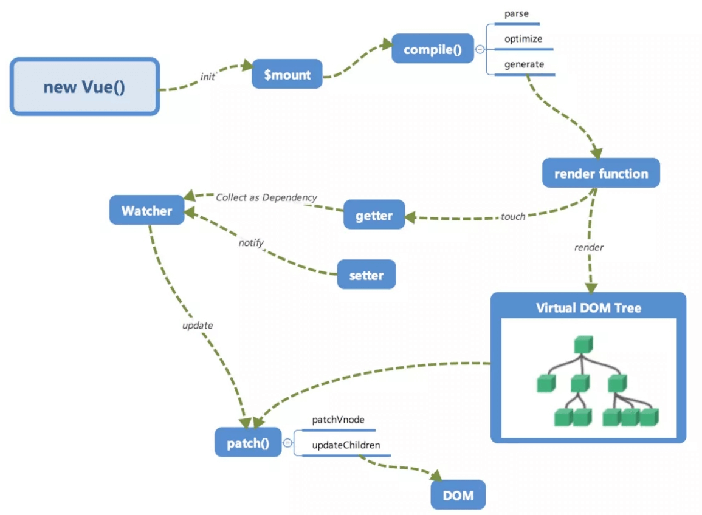
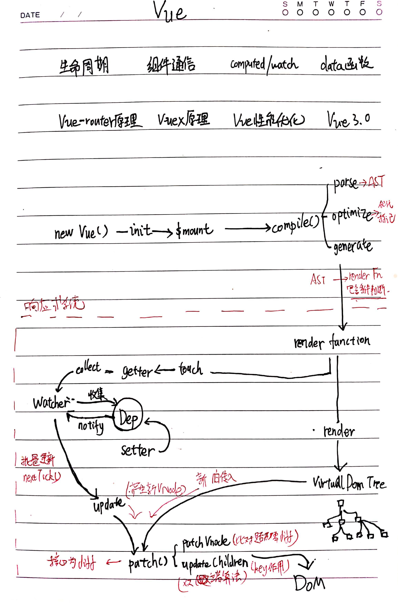
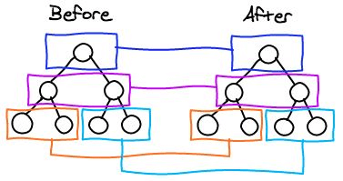
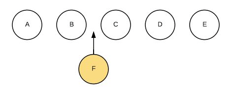
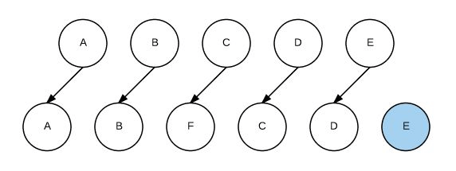
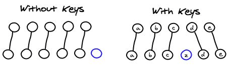
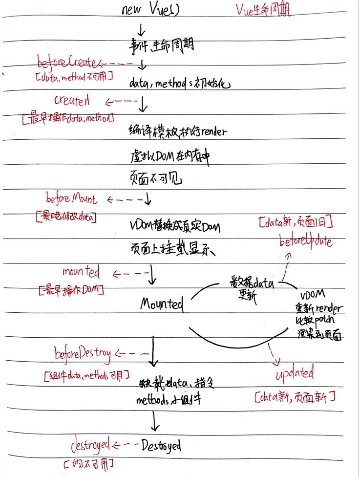
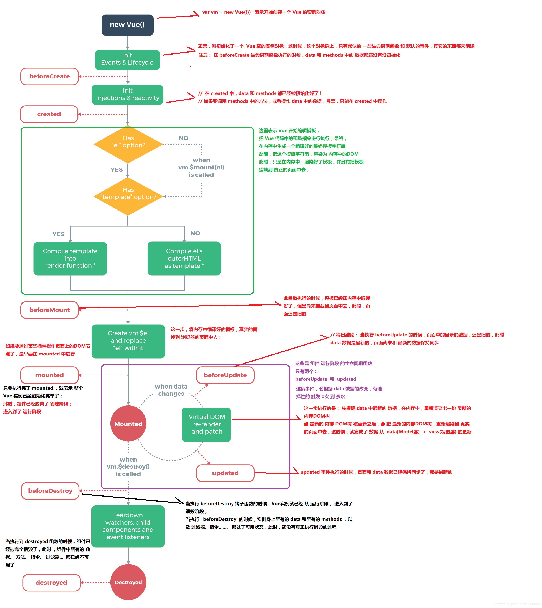
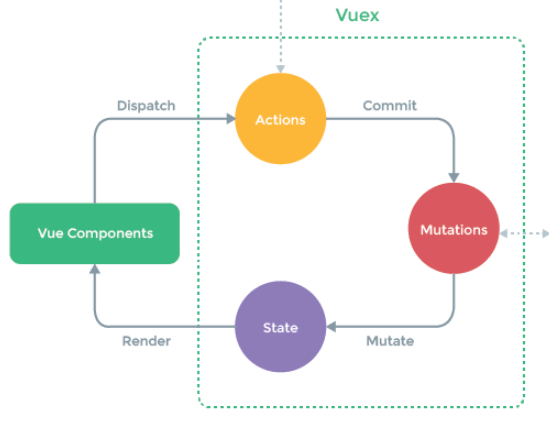
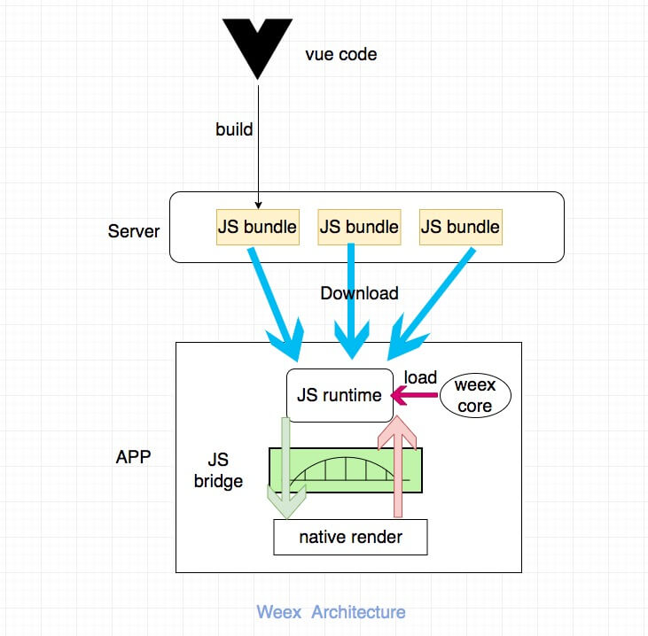

## Vue 全流程 ✨




> new Vue()调用 init 初始化 -> $mount 挂载 -> compile()编译模板 -> render function -> 响应式系统 -> 视图更新

> 响应式系统：render -> touch -> getter -> Dep 依赖收集 Watcher；setter -> Dep.notify -> Watcher.update() -> patch()进行 diff -> DOM

- 分为四个阶段：初始化、挂载编译、响应式、视图更新
  - 1、初始化：new Vue():调用 init 函数初始化，包括生命周期、事件、props、data、methods、watch 等，还有重要就是 Object.defineProperty 设置 setter 和 getter 函数(同时将 this.data.test 代理成 this.test)，用于依赖收集和响应式。
  - 2、编译挂载：初始化后调用$mount 挂载组件，有 template 的情况下，内部执行 compile()编译，包括 parse（解析 template 转成 AST） 、 optimize(标记静态节点、用于 diff 优化跳过静态节点) 与 generate（AST -> render function） 三个阶段，最终得到 render function，用来渲染 VNode，然后生成真实 DOM 显示在页面上。
  - 3、响应式：render function 被渲染，读取所需对象的值，触发 getter 函数，执行依赖收集，将订阅者 Watcher 添加 Dep 订阅器中。修改对象的值时触发 setter，通知 Dep 订阅器中的订阅者 Watcher，需要重新渲染视图，然后 Watcher 调用 update 进行更新。
  - 4、视图更新：数据变化触发 update 后，执行 render function 得到新的 VNode 节点，与旧的 VNode 一起传入 patch 进行比较，经过 diff 算法得到「 差异」，根据差异来修改对应的 DOM。

### 响应式系统

> 每个 Vue 组件都有对应的一个 Watcher 实例，如果一个属性在不同组件上都使用到，将把不同组件的 Watcher 都添加到这个属性的 Dep 订阅器中，表示这些视图依赖这个对象属性，如果发生改变，这些视图都要进行更新。一个 Watcher 可能在多个 Dep 中同时存在。

- 简述：基于[数据劫持+发布者-订阅者模式]，分三个步骤：数据劫持、依赖收集、通知订阅者进行更新
- 步骤：

  - 1、**数据劫持**：Vue 构造函数中，Vue 上的 data 的每个属性会被 Object.defineProperty 方法添加 getter 和 setter 属性。在 vue3.0 中通过 Proxy 代理对象进行类似的操作。

    ```js
    Object.defineProperty(obj, prop, descriptor)

    obj:劫持对象
    prop:对象的属性
    descriptor的属性有：
    enumerable ，属性是否可枚举，默认 false。
    configurable ，属性是否可以被修改或者删除，默认 false。
    get ，获取属性的方法。
    set ，设置属性的方法。
    ```

  - 2、**依赖收集：** 劫持 data 后，根据前面解析器 Compile 新建的 Watcher 订阅者实例，在执行组件渲染 render 时候，data 被 Touch(被读)，getter 函数调用，进行依赖收集，执行 dep.addSub，将 Watcher（订阅者）对象实例添加进当前属性自己的 Dep（订阅器）中进行订阅。
  - 3、**通知订阅者进行更新**：data 改动(被写)时， setter 方法被调用, 执行 dep.notify 通知自己属性的订阅器 Dep 中的每一个 Watcher 订阅者数据有变化，触发 Watcher 订阅者对象自己的 update 方法，也就是所有依赖于此 data 的组件视图去调用他们的 update 和 render 函数进行更新视图。

### 虚拟 DOM 的 diff 和 key 作用



> vue 和 react 的虚拟 DOM 的 Diff 算法大致相同

- 相同：树的分层对比
- 区别：节点 diff 时，react15.x 使用唯一 key 标记，且整个新老数据对比是否需要增删移，vue 使用双指针，减少节点移动次数，且组件级别采用 watcher 通知，内部采用 diff，避免 watcher 太多带来性能开销。

- [React diff 知乎](https://zhuanlan.zhihu.com/p/20346379)

> vue 和 diff 过程概述：通过 Watcher 的 update 产生新的虚拟 DOM 树，和旧虚拟 DOM 树一起传入 patch 函数，如果是 sameVnode，内容存在且不同，进行 updateChildren 更新子节点。旧层级和新层级各有两个头尾的指针变量 StartIdx 和 EndIdx，它们的 2 个变量相互比较，一共有 4 种比较方式：首首、尾尾、旧头新尾、旧尾新头，如果匹配上，指针对应的移动，如果 4 种比较都没匹配，如果设置了 key，就会用 key 进行比较。整个 diff 的过程中，两个下标往中间靠，一旦其中一个的 StartIdx>EndIdx 表明 oldCh 和 newCh 至少有一个已经遍历完了，就会结束比较，将剩下的节点删除或者添加上去。

- 过程：patch（判断子节点是否为 sameVnode）-> patchVnode（sameVnode 进行对比内容是否相同）-> updateChildren（更新子节点，使用双指针和 key 进行对比更新）
- **patch(oldVnode,vnode,parentElm)函数：比对两个 VNode 节点，将「差异」更新到视图上，也就是以旧节点为基础，进行差异修改，增删一些 DOM 节点**。

  - 旧 VNode 节点不存在，则将新 VNode 节点全部添加到父节点 parentElm 上
  - 新 VNode 节点不存在，则将旧 VNode 节点全部移除
  - **旧 VNode 节点和新 VNode 节点都存在且为 sameVnode 时，进行 patchVnode 操作**

  > sameVnode:key、tag、是否注释、有无 data、若为 input 的 type 类型 均一致。

  > 因为相对来说，oldVnode 自己对应的 dom 总是已经存在的，新的 vnode 的 dom 是不存在的，直接复用 oldVnode 对应的 dom，比如直接移动 oldVnode。

- patchVnode 操作：sameVnode 时会执行，对比两个节点的子节点是否存在，子节点不同则需要更新子节点 updateChildren，也就是进行双指针对比，进行更新下一层的节点。
  - 新旧 VNode 节点相同，直接返回
  - 新旧 VNode 节点都是在解析阶段标记的静态 isStatic，且 key 相同，新的直接使用旧的内容，返回
  - 新 VNode 节点文本则直接设置 text，否则比较新旧 VNode 节点的孩子节点
    - **新旧孩子节点都存在且不同，进行最核心的 updateChildren 也就是 diff 算法 更新子节点**
    - 只有新孩子节点，将新节点全部插入父节点下
    - 只有旧孩子节点，没有新孩子节点，将旧节点全部清除
- updateChildren：sameVnode 且子节点存在不同，进行更新子节点。

  - 核心 diff 算法：**因为是同层的树节点进行比较，时间复杂度只需要 O(n)**
  - 例子：重复下面的对比过程，直到新旧数组中任一数组的头指针超过尾指针，循环结束 :
    - 头头对比: 对比两个数组的头部，如果相同，进行 patchVnode，不需要移动 dom，直接更新属性或 Children 即可，双方头指针后移
    - 尾尾对比: 对比两个数组的尾部，如果相同，进行 patchVnode，不需要移动 dom，直接更新属性或 Children 即可，双方尾指针前移
    - 旧头新尾对比: 交叉对比，旧头新尾，如果相同，进行 patchVnode，并把旧头节点移动到旧尾节点后面，完成当前节点差异更新，新尾指针前移，旧头指针后移
    - 旧尾新头对比: 交叉对比，旧尾新头，如果相同，进行 patchVnode，并把旧尾节点移动到旧头节点前面，完成当前节点差异更新，旧尾指针前移，新头指针后移
    - 上面四种情况均不符合，则利用 key 对比: 用新指针对应节点的 key 去旧数组寻找对应的节点,这里分三种情况。
      - 当没有对应的 key，那么创建新的节点，插入旧层级里，新头坐标后移一位；
      - 如果有对应的 key 并且是 sameVnode，两个节点进行 patchVnode，将该 key 对应的旧节点位置赋值 undefined（防止 重复 key），新头元素插入旧头元素前面，新头坐标后移一位；
      - 如果有对应的 key 但不是 sameVnode，则创建新节点，插入旧层级里，新头坐标后移一位。
  - 循环结束后判断两个情况：
    - 旧头超过旧尾，旧数组比较完成，将新节点剩下的未遍历的节点调用 addVnodes 全部插入旧尾的真实 DOM。
    - 新头超过新尾，新数组比较完成，将旧节点剩下的未遍历的节点调用 removeVnodes 全部删除。

- Vue 中的 key 有什么用？

  - key 是 Vue 标记 vnode 的唯一 id
  - 作用：高效更新虚拟 dom，diff 操作更准确、更快速
  - 准确: 如果不加 key，对于列表中每项都是 sameVnode，那么 vue 会选择复用已经渲染好的旧节点(Vue 的就地更新策略)，导致旧节点的子孙节点被保留下来，会产生一些隐藏的 bug。
  - 快速: key 的唯一性可以被 Map 数据结构充分利用，相比于遍历查找的时间复杂度 O(n)，Map 的时间复杂度仅仅为 O(1)。
  - 举个例子：
    - 比如在列表中增加 item，因为列表循环生成的节点都是 sameVnode，所以直接复用前面的旧节点，一些旧节点内容保留，可能会出现数据错位的情况，在列表最后再插入新的 item 节点。
      
      
    - 用了 key 之后，能准确找到对应的位置，并插入，避免一些隐藏的 bug。
      

- 为什么不能使用 index 做 key
  - 使用 index 还是会导致 v-for 结束后仍然是同样的顺序，仍会就地复用旧节点。

### Vue 监测变化细粒度把控

- Vue 的响应式系统是中等细粒度的方案，大量的 Watcher 会使内存开销过大，大量 diff 时间太久。所以采用组件 Watcher + 内部 Diff 的方式

  - 在组件级别进行使用 Watcher 进行监测，对 data 进行依赖收集，一旦数据变化，就知道哪个位置发生变化。
  - 然后在组件内部进行 Virtual Dom Diff 算法，获取更加具体节点的差异。

- React 中，我们用 setState 的 API 显式更新后，React 知道发生变化后，然后暴力的 Diff 操作查找「哪发生变化了」，但是很多组件实际上是肯定不会发生变化的，这个时候需要用 shouldComponentUpdate 进行手动操作来减少 diff，从而提高程序整体的性能。

- Angular 则是脏检查操作。

### nextTick 原理和队列

- 场景：下一个循环：在 DOM 更新结束之后，执行 nextTick()中的回调，在修改数据之后，视图并不会立即更新，在下一个循环更新视图，获得更新后的 DOM，然后执行回调。
- 原理：nextTick 函数传入 callback，存储到 callback 数组队列中，下一个 tick 触发时执行队列所有的 callback，清空队列。
- 实现：2.6 新版本中默认优先是 microtasks,再考虑 macrotasks，都不支持则用 setTimeout。 Promise.then(microtasks)【p.then(flushCallbacks)】 -> MutationObserver 的回调(microtasks) -> setImmediate(ie&node macrotasks) -> setTimeout【setTimeout(flushCallbacks, 0)】
  ```js
  // 修改数据
  this.message = "changed";
  // DOM 还没有更新
  this.$nextTick(function () {
    // DOM 现在更新了
  });
  ```
- 全局 API

  ```js
  // 修改数据
  vm.msg = "Hello";
  // DOM 还没有更新
  Vue.nextTick(function () {
    // DOM 更新了
  });

  // 作为一个 Promise 使用 (2.1.0 起新增，详见接下来的提示)
  Vue.nextTick().then(function () {
    // DOM 更新了
  });
  ```

### 视图更新优化

> 为什么频繁变化但只会更新一次（一个 number 从 0 循环增加 1000 次，只更新至最后的值）

- 原理：Vue 视图更新 DOM 是异步执行的，检测到数据有变化，Vue 开启一个异步队列，下个 tick 更新视图。同一个 watcher 被多次触发，只会被推入到队列中一次。也就是说，number 的 Watcher 只会执行一次更新，就是从 0 -> 1000。
  - 重点：先完成 DOM 更新后，执行排在后面的 nextTick(callback)内的回调，nextTick 是用户定义的其他操作，本质都是异步队列，只是视图更新在它前面。
  - 执行++操作时，不断触发对应 Dep 中的 Watcher 对象的 update 方法。
  - 如果一个 Watcher 对象触发多次，只 push 一次进异步队列 queue 中。
  - 下一个循环 tick 时，触发 Watcher 对象的 run 方法(执行 patch)，执行更新 DOM 视图，number 直接从 0->1000

## Vue 生命周期 ✨

- Vue 实例从创建到销毁的过程，就是生命周期。
- 从开始创建、初始化数据、编译模板、挂载 DOM → 渲染、更新 → 渲染、销毁一系列过程
- 分为 4 个阶段：创建阶段(前/后), 挂载阶段(前/后), 运行阶段(更新前/后), 销毁阶段(前/后)。
- 周期：前四个钩子为第一次页面加载调用。

  - `beforeCreate`：刚创建 Vue 空实例，只有一些生命周期函数和默认事件，data、methods、el 都不可访问。
  - `created`：完整的实例创建好，数据劫持完成，data、methods 可访问、el 不可访问，没有生成真实 DOM。
  - `beforeMount`：已经完成编译模板的工作，生成一个 render function 并调用，生成虚拟 DOM 在内存中，没有生成真实 DOM。
  - `mounted`：完成挂载，生成真实 DOM，页面显示内容，data、method 可访问、el 可访问。
  - `beforeUpdate`：data 数据是新的，但页面是旧的，发生在虚拟 DOM 打补丁之前。适合在更新之前访问现有的 DOM，比如手动移除已添加的事件监听器。
  - `updated`：虚拟 DOM 重新渲染和打补丁，组件真实 DOM 更新之后，页面和 data 都是最新的。更新完成后，如果有 nextTick 回调，会在视图更新后执行。
  - `beforeDestroy`：组件销毁前调用，实例仍然完全可用，做一些清理工作，如清除计时器，移除绑定了 DOM/BOM 对象中的事件，清理 echarts 组件 resize 的监听事件等。也可以使用 hook 监听钩子，就不需要放在对应的钩子中。`this.$once('hook:beforeDestroy', () => { window.removeEventListener('resize', fn) })`
  - `destroyed`：组件销毁后调用，解绑指令，所有事件监听被移除（重点），所有子组件实例销毁，都不可用。
  - keep-alive 在内存中保留组件的状态和元素：
    - `activated`：被 keep-alive 缓存的组件专属，组件被激活时调用
    - `deactivated`： 被 keep-alive 缓存的组件专属，组件被销毁时调用， 可进行清理或改变数据。

- 关键节点简述
  - 创建阶段
    - `beforeCreate`：【data、methods、el 均不可访问】
    - 中间执行：初始化 data、methods、props、computed、watcher、provide。
    - `created`：【data、methods 可访问、el 不可访问】【最早可访问 data】
    ```js
    created() {
      // 允许并推荐
      this.$http.get(xxx).then(res => {
          this.data = res.data
      })
      // 不允许
      this.$el
      this.$ref.demo
      const a = document.getElementById('demo')
    }
    ```
  - 挂载阶段
    - `beforeMount`：【data、methods 可访问、el 不可访问】【虚拟 DOM 编译好在内存中，还未挂载】
    - `mounted`：【data、methods 可访问、el 可访问】【最早可操作 DOM】【页面已显示】
    ```js
    mounted() {
        // 允许
        this.$el
        this.$ref.demo
        let a = document.getElementById('')
    }
    ```
  - 运行阶段
    - `beforeUpdate`：【数据更新后执行】【data 数据是新的，但页面是旧的】
    - 中间执行：`re-render和patch`进行虚拟 DOM 的 diff 和更新渲染
    - `updated`：【视图更新完执行】【data 和页面都是最新的】
  - 销毁阶段
    - `beforeDestroy`：【实例的 data、methods、指令完全可用】
    - `destroyed`：【实例的 data、methods、指令都不可用】
    - 触发销毁钩子的方法
      - 手动调用`$destory()`销毁组件实例
      - v-if 与 v-for 指令（v-show 不行）
      - 路由切换、关闭或刷新浏览器




- 服务器端渲染：beforeCreate、created，其他不可调用

- 实践
  - 【异步请求常放在 created】：官方推荐在 mounted 中调用，实际上可以在 created 生命周期中调用（能更快获取到服务端数据，减少页面 loading 时间）。 服务端渲染时不支持 mounted，需要放到 created 中。
  - 【最早访问 data】：在 created 钩子中可以对 data 数据进行操作，可以进行 ajax 请求将返回的数据赋给 data。
  - 【最晚修改 data】：beforeMount，此时还未挂载到页面。
  - 【最早操作 DOM】：在 mounted 钩子对挂载的 DOM 进行操作，此时，DOM 已经被渲染到页面上。
  - 【updated 函数注意】：
    - beforeUpdate 中可以改 data 吗？可以改，但不建议。在更新前改变值和更新后再次改变值，可能会导致无限更新，死循环。
    - 在数据变化时被触发，但不能准确的判断是那个属性值被改变，可以用 computed 或 watch 函数来监听属性的变化，并做一些其他的操作。
  - 【缓存组件使用 activated】：在使用 vue-router 时有时需要使用`<keep-alive></keep-alive>`来缓存组件状态，这个时候 created 钩子就不会被重复调用了，如果我们的子组件需要在每次加载或切换状态的时候进行某些操作，可以使用 activated 钩子触发。
  - 所有的生命周期钩子自动绑定 this 上下文到实例中，所以不能使用箭头函数来定义一个生命周期方法 (例如 `created: () => this.fetchTodos()`)。这会导致 this 指向父级。
- 父子生命周期

  - 父子组件渲染过程(子挂载完，父才算挂载完)

  ```
  父beforeCreate->父created->父beforeMount->
  子beforeCreate->子created->子beforeMount->子mounted->父mounted
  ```

  - 子组件更新过程(通过 props 传递，或者 vuex 等存在数据流向触发时)

  ```
  父beforeUpdate->子beforeUpdate->子updated->父updated
  ```

  - 父组件更新过程(自身组件更新，自己组件的生命周期)

  ```
  父beforeUpdate->父updated
  ```

  - 销毁过程

  ```
  父beforeDestroy->子beforeDestroy->子destroyed->父destroyed
  ```

- 例题：由 data 控制组件显示隐藏的生命周期过程
  - v-if 绑定一个组件，由 data 的 show 控制显示或隐藏
    ```js
    data(){
        return {
          show: true,
        }
    },
    created(){
        this.show = false;
        console.log(`created: ${this.show}`);
    },
    mounted(){
        this.show = true;
        console.log(`mounted: ${this.show}`);
        this.$nextTick(()=>{
          this.show = false;
          console.log(`nextTick: ${this.show}`)
        })
    },
    beforeUpdate(){
        console.log(`beforeUpdate: ${this.show}`);
    },
    updated(){
        console.log(`updated: ${this.show}`);
    }
    ```
  - created 之前：data 中 show 的默认值是 true，
  - created 中：show 被更改为 false，此时页面还没挂载，进入渲染。
  - mounted 之前：show 为 false，根据指令编译模板，放在内存中。
  - mounted 中：页面初次挂载内容，此时组件不显示。此时将 show 更改为 true，不会立即触发视图更新。
  - 等到下一个循环开始更新视图，触发 beforeUpdate，此时数据最新，但页面还没最新，再触发 updated，此时数据和页面都是最新，组件显示。
  - 视图更新完成，再执行 nextTick()中的回调函数，将 show 更改为 false，再次触发更新。
  - 触发 beforeUpdate，此时数据最新，但页面还没最新组件还是显示，再触发 updated，此时数据和页面都是最新，组件消失。
  - 最终呈现效果就是没有组件显示，刷新太快看不出来，断点调试可看到过程。
    ```js
    created: false      还未显示页面
    mounted: true       组件不显示
    beforeUpdate: true  组件不显示
    updated: true       组件显示
    nextTick: false     组件显示
    beforeUpdate: false 组件显示
    updated: false      组件消失
    ```

## Vue 组件通信 ✨

- [Vue 组件通信的方法如下:](https://juejin.im/post/5d267dcdf265da1b957081a3#heading-0)

- props/$emit+v-on: 父子通信：通过props将数据自上而下传递，而通过$emit 和 v-on(@)来向上传递信息。

- vuex: 是全局数据管理库，可以通过 vuex 管理全局的数据流
- EventBus: 兄弟组件或跨级：事件总线：所有组件的共同事件中心，通过 EventBus 进行信息的发送和监听
  - 不适用多人协作和大项目，较难维护。
  - 组件没有同时显示不应该用 eventbus，一般需要先 on 再 emit。比如两个路由一个还没创建，所以监听不到。而应该使用 vuex。

```js
// event-bus.js

import Vue from "vue";
export const EventBus = new Vue(); // 注册事件总线
import { EventBus } from "./event-bus.js"; // 组件引入
EventBus.$emit("test", { num: this.num }); // A组件发送事件
EventBus.$on("test", (param) => {}); // B组件接收事件
EventBus.$off("test", {}); // 移除监听
```

- provide/inject：跨级：父组件中通过**provide 来提供变量, 然后再子孙后代组件中通过 inject 来注入变**量。不论组件层次有多深，并在起上下游关系成立的时间里始终生效。

  ```js
  provide() {
      return {
        user: this.user
      }
  },

  inject: ['user'],
  ```

- $attrs/$listeners: 跨级： Vue2.4 中加入的$attrs/$listeners，$attrs含有父作用域**不被prop识别的特性**（class和style除外），$listeners 包含了父作用域中的 (不含 .native 修饰器的) v-on 事件监听器，并且可以通过 v-bind="$attrs/$listeners"继续传入内部组件,传递下去。

  - 适合仅传递数据的跨级通信，用 vuex 是大材小用。

- localStorage / sessionStorage
  - 数据和状态比较混乱，不好维护，不过可以结合 vuex, 实现数据的持久保存
  - window.localStorage.getItem(key)获取数据
  - 通过 window.localStorage.setItem(key,value)存储数据
  - JSON.parse() / JSON.stringify() 做数据格式转换

## Vue 事件机制

- 四个事件 API，分别是$on，$once，$off，$emit。
- `$on( event, callback )`
  - 监听当前实例上的自定义事件。事件可以由 vm.$emit 触发，在模板上可使用 v-on:event="fn"。
- `$once( event, callback )`
  - 监听一个自定义事件，但是只触发一次。一旦触发之后，监听器就会被移除。
- `$off( [event, callback] )`
  - 移除自定义事件监听器。没有参数移除所有监听器；只提供了事件，则移除该事件所有的监听器；提供了事件与回调，则只移除这个回调的监听器。
- `$emit( eventName, […args] )`
  - 触发当前实例上的事件。附加参数都会传给监听器回调。

```js
vm.$on("test", function (msg) {
  console.log(msg);
});
vm.$emit("test", "hi");
// => "hi"
```

- 手写解析：
  - on 判断事件是数组则遍历执行 on 方法，不是则将对应的 fn 回调 push 进对应事件名的事件调度中心 events 数组。
  - once 封装一下 on 回调（执行一次 fn 回调时，调用 off 方法关闭监听），然后调用 on 方法将 on 回调 push 进对应事件名的事件调度中心 events 数组。
  - off 判断事件是数组则遍历执行 off 方法，不是则判断有无传入 fn 回调，没传则清空该事件所有的回调函数 events 中的 fn。有传 fn 回调，则移除在 events 上对应的 fn 回调。
  - emit 取出对应 events 中的 fn 回调，遍历执行所有注册的 fn 回调。

```js
class Vue {
  constructor() {
    this._events = Object.create(null);
  }
  $on(event, fn) {
    if (Array.isArray(event)) {
      event.map((item) => {
        this.$on(item, fn);
      });
    } else {
      (this._events[event] || (this._events[event] = [])).push(fn);
    }
    return this;
  }
  $once(event, fn) {
    function on() {
      this.$off(event, on);
      fn.apply(this, arguments);
    }
    on.fn = fn;
    this.$on(event, on);
    return this;
  }
  $off(event, fn) {
    if (!arguments.length) {
      this._events = Object.create(null);
      return this;
    }
    if (Array.isArray(event)) {
      event.map((item) => {
        this.$off(item, fn);
      });
      return this;
    }
    const cbs = this._events[event];
    if (!cbs) {
      return this;
    }
    if (!fn) {
      this._events[event] = null;
      return this;
    }
    let cb;
    let i = cbs.length;
    while (i--) {
      cb = cbs[i];
      if (cb === fn || cb.fn === fn) {
        cbs.splice(i, 1);
        break;
      }
    }
    return this;
  }
  $emit(event) {
    let cbs = this._events[event];
    if (cbs) {
      const args = [].slice.call(arguments, 1);
      cbs.map((item) => {
        args ? item.apply(this, args) : item.call(this);
      });
    }
    return this;
  }
}
```

## Vue 双向绑定 v-model ✨

vue 项目中主要使用 v-model 指令在表单 input、textarea、select 等元素上创建双向数据绑定，我们知道 v-model 本质上不过是语法糖，v-model 在内部为不同类型的标签，绑定不同的属性并传入，并抛出不同的事件：

- input 和 textarea 元素使用 value 属性和 input 事件；
- checkbox 和 radio 使用 checked 属性和 change 事件；
- select 字段将 value 作为 prop 并将 change 作为事件。

- 例子：

  ```html
  <input v-model="something" />

  相当于绑定value属性传入组件内部，并监听组件内部emit出来的input事件

  <input
    v-bind:value="something"
    v-on:input="something = $event.target.value"
  />
  ```

- 自定义组件：v-model 默认会利用名为 value 的 prop 和名为 input 的事件

  ```html
  父组件：
  <MyInput v-model="message"></MyInput>

  子组件：
  <div>{{value}}</div>

  props:{ value: String }, methods: { test() { this.$emit('input', '元气') }, }
  ```

  - vue2.2 新增 model 选项，自定义 prop 和 event，就不需要限定于默认的 value 和 input。下面的 prop 是 checked，event 是 change
    ```
    model: {
      prop: 'checked',
      event: 'change'
    },
     props: {
      checked: Boolean
    },
    // 再使用this.$emit('change', '值')即可触发值的改变，实现双向绑定
    ```

## options ✨

### data 为什么是函数

- 组件被复用时，会创造多个实例。
- 它们来自同个构造函数，如果 data 是对象，也就是引用类型，会影响到所有实例。
- 为了防止实例间 data 的冲突，将 data 变为函数，用 return 返回值，让每个实例维护一份返回对象的独立拷贝。

### 不要在选项或回调上使用箭头函数

- 比如`created: () => console.log(this.a)` 或 `vm.$watch('a', newValue => this.myMethod())`
- 因为箭头函数并没有 this，this 会作为变量一直向上级词法作用域查找，直至找到为止，会导致比如读取不到属性或者方法的错误。

### computed 和 watch 的区别

- computed
  - 是计算属性，依赖其他属性值来计算，将复杂逻辑放在计算属性中而不是模板。
  - 有缓存性，依赖属性值改变后，下次获取 computed 的值时才会重新调用对应的 getter 来计算。
- watch
  - 观察作用，基于某些数据的监听回调，深度监听对象中的属性，deep：true 选项
  - 无缓存性，页面重新渲染时，值不变化也会执行。
- 场景
  - 依赖于其他数据的数值计算时，使用 computed
  - 某个数据变化时做某些异步操作（请求 API），使用 watch

## 常见指令 ✨

### v-if、v-show

- v-if
  - v-if 如果不成立不会生成对应的 vnode，render 时不会渲染
  - 场景：适合条件很少变化的数据
  - 切换开销高
- v-show
  - v-show 会直接生成 vnode，render 时也会被渲染，render 过程修改 display 属性值
  - 场景：适合频繁切换的数据
  - 初始开销高

### v-html

- 原理：
  - v-html 移除节点所有的内容，添加 innerHTML 属性，内容为 v-html 里的内容。

## Vue2.x 检查数组变化 ✨

- 本质：Object.defineProperty 无法监听到数组内部变化、也无法探测创建实例之后普通对象新增的属性(`this.myObject.newProperty = 'hi'`)
- 方案：Vue 采用 hack 的方法实现数组监听
  ```js
  push();
  pop();
  shift();
  unshift();
  splice();
  sort();
  reverse();
  ```
- 原理：Vue 采用改变数组实例的原型对象，指向自己构造的原型对象。
  - 1.将新加入的对象响应式化
  - 2.数组本来的 API 方法如 push、pop，通过`apply(this, args)`执行。
  - 3.dep.notify()提醒观察(订阅)者进行更新。
- 直接`vm.items[indexOfItem] = newValue`是无法检测到的，length 属性不能监听因为无法触发 obj 的 get 方法。
- 另外的方法：
  - 实例的$set方法【vm.$set( target, propertyName/index, value )】
  - 或者全局 API 【Vue.set( target, propertyName/index, value )】：向响应式对象中添加一个 属性 property，并确保这个新 property 同样是响应式的，且可以触发视图更新。
- 最好方案：Vue3.0 采用 Proxy 监听对象和数组

## Vue 路由

- mode 模式有三种（页面不重新加载，只切换显示的组件）
  - hash：【兼容性好、URL 不美观】
    - hash 就是 URL 中#号后面的内容，改变 hash 会向浏览器添加记录。
    - 通过 location.hash 改变 hash，用 hashchange 监听，然后跳转，创建一个 history 保存记录自己维护，点击前进后退可切换历史 hash。
    - 原理：用一个 routes 对象存储路由，定义 route 方法，保存每个 hash 对应的回调方法，监听 hashchange，有变化就执行对应 location.hash 的回调函数，进行刷新。
  - history：【兼容性一般、URL 美观】
    - 使用 HTML5 提供 history.pushState、history.repalceState 等 API ，不刷新页面的情况下，操作浏览器的历史记录（如新增、替换），他们都会使当前地址 URL 进行变更，区别只是有无往历史记录添加此地址。
    - popstate 事件来监听 url 的变化（浏览器前进后退按钮或 JS 触发 history.back(),history.forward()等方法会触发 popstate），执行监听回调，进行页面进行跳转（渲染）
    - 但是 history.pushState、history.repalceState 不会触发 popstate 事件，我们需要手动触发路由的回调，进行跳转，切换显示内容。
    - 原理：初始化路由使用 repalceState 该路径并执行该路径的回调，定义 go 方法，执行 pushState 并手动执行回调，进行刷新。
    - 这个模式**有坑要注意**：服务器没有对应路径的资源会直接返回 404，所以需要服务器进行配置，对匹配不到的资源路径要返回 index.html，也就是我们 APP 依赖的页面，根据当前 url 匹配对应的路由，去执行对应的回调和显示。然后前端需要先配置 404 路由，放在路由列表最后。如果当所有路由匹配不到，就进入我们自己的 404 页面。
    ```js
    // http://mozilla.org/foo.html
    let stateObj = {
      foo: "bar",
    };
    history.pushState(stateObj, "page 2", "bar.html");
    // 状态对象、标题、URL路径(相对或绝对)
    // http://mozilla.org/bar.html, 但并不会导致浏览器加载 bar.html
    ```
  - abstract：没有浏览器 api，进入此模式。如 Node.js 服务器
- 跳转

  > Vue Router 的导航方法 (push、 replace、 go) 在各类路由模式 (history、 hash 和 abstract) 下表现一致。

  - 声明式`<router-link to=""></router-link>`
  - 编程式`this.$router.push('home')`
  - 前进后退`router.go(1)/router.go(-1)`
  - 替换 history 的当前记录`router.replace(...)`

- 占位
  - `<router-view></router-view>`
- 路由懒（按需）加载

  - 没配置路由懒加载的情况下，我们的路由组件在打包的时候，都会打包到同一个 js 文件去，导致越来越大，请求时间变长
  - 把不同路由对应的组件分割成不同的代码块，然后当路由被访问的时候才加载对应的组件， 首屏时不用加载过度的资源，从而减少首屏加载速度。
  - import()方法由 ES6 提出，import()方法是动态加载。

  ```js
  // webpack< 2.4 时
  {
    path:'/',
    name:'home',
    components:resolve=>require(['@/components/home'],resolve)
  }

  // webpack> 2.4 时
  {
    path:'/',
    name:'home',
    components:()=>import('@/components/home')
  }
  ```

### 路由(导航)守卫

用于路由跳转前做一些逻辑处理，确定下一步要跳转的路由地址。

- 如全局前置守卫：beforeEach，to 表示将要跳转去的路由，from 表示正要离开的路由，next()方法用来执行 resolve 这个钩子，进行下一步跳转。
  - next() 下一个钩子，全部钩子执行完就跳转到 to 地址
  - next('/') 跳到指定地址
  - next(false) 中断当前导航，回到 from 地址
  - next(error) 传入 error 实例，传递到 router.onError()的回调

```js
const router = new VueRouter({ ... })

router.beforeEach((to, from, next) => {
  // ...
})
```

- 应用：判断未登录则跳转去登录页

```js
router.beforeEach((to, from, next) => {
  if (to.name !== "Login" && !isAuthenticated) next({ name: "Login" });
  else next();
});
```

- 此外还有全局后置钩子 afterEach:不会接受 next 函数也不会改变导航本身

```js
router.afterEach((to, from) => {
  // ...
});
```

## Vuex 使用和原理

```
npm install vuex --save
```

```js
import Vue from "vue";
import Vuex from "vuex";
Vue.use(Vuex);
```

- 简介：它是全局状态管理容器，将状态抽离到全局，集中共享管理，有几个特点：单向数据流，响应式，非持久化。通过 Vue 结合实现 store 中数据的响应式。因为保存在内存中，所有不具有持久化，默认刷新就重置状态。可通过结合缓存的方法实现持久化。
  

- **场景：中大型单页应用，项目复杂时，多个视图展示需要读取同个状态或多个视图的行为需要变更同个状态**
  - 如插件中设备信息、运行数据、i18n、定时等状态信息。
- 使用

  - 在组件中获取 Vuex 的状态，在根实例注册 store 选项，将实例先注入所有子组件，再使用 this.$store.xxx 访问，最好放在 computed 中，可以响应式监听到变化。

    ```js
    import Vue from 'vue'
    import Vuex from 'vuex';
    Vue.use(Vuex);

    import store from '../store'

    const app = new Vue({
      el: '#app',
      // 把 store 对象提供给 “store” 选项，把 store 的实例注入所有的子组件
      store,
      ...
    })

    const Counter = {
      template: `<div>{{ count }}</div>`,
      computed: {
        count () {
          return this.$store.state.count
        }
      }
    }
    ```

    ```js
    //store.js

    export default new Vuex.Store({
      state: {
        count: 0,
      },
      getters: {
        countPlus: (state) => {
          return state.count++;
        },
      },
      mutations: {
        increment(state, payload) {
          state.count++;
        },
      },
      actions: {
        increment({ commit }) {
          commit("increment");
        },
      },
    });
    ```

  - 辅助函数：mapState、mapGetters、mapMutations、mapActions，使用需要先在根节点注入 store 实例，前面已提到过。

    - 使用`mapState、mapGetters`就不用一个个计算属性的写，然后用`...`展开运算符混入对应组件的 computed 中。

      ```js
      import { mapState, mapGetters } from 'vuex'

      export default {
        // ...
        computed: {
          // 局部组件自身计算值
          localComputed () { /* ... */ },

          // 使用对象展开运算符将 state 混入 computed 对象中
          ...mapState({
            // ...
          })
          // 也可传字符串数组，每个字符串表示与state同名
          ...mapState([
            // ...
          ])

          // 使用对象展开运算符将 getter 混入 computed 对象中
          ...mapGetters([
            'doneTodosCount',
            'anotherGetter',
            // ...
          ])
          // 使用 别名
          ...mapGetters({
            // 把 `this.doneCount` 映射为 `this.$store.getters.doneTodosCount`
            doneCount: 'doneTodosCount'
          })
        }
      }
      ```

    - 使用`mapMutations、mapActions`，将 mutation 和 action 的处理函数混入 methods，就可以直接调用`this.incrementBy(amount)`和`this.incrementBy1(amount)`，自动对应映射为`this.$store.commit('incrementBy', amount)`和 `this.$store.dispatch('incrementBy1', amount)`

      ```js
      import { mapMutations, mapActions } from 'vuex'

      export default {
        // ...
        methods: {
          ...mapMutations([
            'incrementBy' // 将 `this.incrementBy(amount)` 映射为 `this.$store.commit('incrementBy', amount) ` amount为载荷，可传参数
          ]),
          ...mapMutations({
            add: 'increment' // 将 `this.add()` 映射为 `this.$store.commit('increment')` add为自定义别名。
          })

          ...mapActions([
            'incrementBy' // 将 `this.incrementBy(amount)` 映射为 `this.$store.dispatch('incrementBy', amount)`
          ]),
          ...mapActions({
            add: 'increment' // 将 `this.add()` 映射为 `this.$store.dispatch('increment')`
          })
        }
      }
      ```

  - store.js 示例
    ```js
    import Vuex from "vuex";
    Vue.use(Vuex);
    export default new Vuex.Store({
      state: {
        deviceInfo: {},
        deviceDetail: {},
      },
      getters: {
        deviceName(state) {
          return state.isInited ? state.deviceInfo.deviceName : "";
        },
        isPowerOn(state) {
          return state.isInited && state.deviceDetail.power == "on";
        },
      },
      mutations: {
        setDeviceInfo(state, payload) {
          state.deviceInfo = payload;
        },
        setDeviceDetail(state, payload) {
          state.deviceDetail = payload;
        },
      },
      actions: {
        // 查设备信息
        async updateDeviceInfo({ commit }) {
          const response = await nativeService
            .getDeviceInfo()
            .catch((err) => nativeService.toast("设备信息获取失败"));
          commit("setDeviceInfo", response.result);
          return response;
        },
        // 查询lua状态
        async updateDeviceDetail({ commit }, { isShowLoading = true } = {}) {
          const response = await nativeService
            .sendLuaRequest(
              {
                operation: "luaQuery",
                params: {},
              },
              isShowLoading
            )
            .catch((err) => nativeService.toast(err));
          commit("setDeviceDetail", response.result);
          return response;
        },
      },
    });
    ```
  - state：
    - 【状态中心】用于数据的存储，是 store 中的**唯一数据源**，
    - 【读取方式】`this.$store.state.A`
  - getters：
    - 【获取状态】用于数据的筛选和多个数据的相关性计算，**接受 state 作为其第一个参数**。基于 state 数据的二次包装，如 vue 中的 computed 属性。
    - 【属性读取方式】`this.$store.getters.B`，有缓存性；
    - 【方法读取方式】`this.$store.getters.fn(arg)`，可传参，无缓存性。
  - mutations：
    - 【同步更改状态】改变 state 的**唯一**途径，**接受 state 为第一个参数，Payload 为第二个参数**，且不能处理异步事件，如果是两个异步回调的 mutations，就不知道哪个先回调了。
    - 【调用 1】通过 commit 调用 handler 处理函数`this.$store.commit('xxx', { A:'a' })`，commit 第二个参数为载荷 payload，作为参数传入处理函数 xxx 中，`xxx(state, payload){} `。
    - 【调用 2】mapMutations 辅助函数，将 mutation 的处理混入 methods，就可直接使用`this.xxx()`，会自动转为`this.$store.commit('xxx')`
  - actions：
    - 【异步更改状态】如接口获取最新状态，获取之后再通过调用 mutation 来进而改变 state，而不是直接变更 state。接收一个上下文 context 作为参数，在里面使用 context.commit 方法，可以使用参数解构直接使用上下文的 commit，`increment ({ commit }) { commit('increment') }`，更简洁。内部可以多个 commit 执行多个 mutation。比如根据接口返回值，决定 commit 哪一个 mutation。
    - 【调用 1】`this.$store.dispatch('xxx')`
    - 【调用 2】mapActions 辅助函数，将 action 的处理混入 methods，就可直接使用`this.xxx()`，会自动转为`this.$store.dispatch('xxx')`
    - 示例：配合`async/await` 获取设备信息成功后，commit 一个 mutation(setDeviceInfo)，将返回结果存入 state 对象对应的属性中。
      ```js
      actions: {
        async updateDeviceInfo({ commit }) {
            const response = await nativeService.getDeviceInfo().catch(err => nativeService.toast('设备信息获取失败'));
            commit('setDeviceInfo', response.result);
            return response;
        },
      }
      ```
  - modules：

    - 将 store 分割成模块（module）。每个模块拥有自己的 state、getter、mutation、action，便于维护。
    - 模块内部的 action、mutation 和 getter 是注册在全局命名空间的，这样使得多个模块能够对同一 mutation 或 action 作出响应。可通过添加`namespaced: true`这个属性表示带命名空间的模块。

    ```js
    const moduleA = {
      state: () => ({ ... }),
      mutations: { ... },
      actions: { ... },
      getters: { ... }
    }

    const moduleB = {
      state: () => ({ ... }),
      mutations: { ... },
      actions: { ... }
    }

    const store = new Vuex.Store({
      modules: {
        a: moduleA,
        b: moduleB
      }
    })

    store.state.a // -> moduleA 的状态
    store.state.b // -> moduleB 的状态
    ```

  - 大型应用结构参考，分割 actions(异步逻辑封装)和 mutations(同步更改状态)
    ```js
      ├── index.html
      ├── main.js
      ├── api
      │   └── ... # 抽取出API请求
      ├── components
      │   ├── App.vue
      │   └── ...
      └── store
          ├── index.js          # 我们组装模块并导出 store 的地方
          ├── actions.js        # 根级别的 action
          ├── mutations.js      # 根级别的 mutation
          └── modules
              ├── cart.js       # 购物车模块
              └── products.js   # 产品模块
    ```
  - vuex 结合 localStorage 持久化数据

    - vuex 里数据改变的时候把数据保存到 localStorage 里面
    - 刷新后，localStorage 里如果有保存的数据，取出来替换 store 里的 state。

    ```js
    let defaultCity = "上海";
    try {
      // 用户关闭了本地存储功能，此时在外层加个try...catch
      if (!defaultCity) {
        defaultCity = JSON.parse(window.localStorage.getItem("defaultCity"));
      }
    } catch (e) {}
    export default new Vuex.Store({
      state: {
        city: defaultCity,
      },
      mutations: {
        changeCity(state, city) {
          state.city = city;
          try {
            window.localStorage.setItem(
              "defaultCity",
              JSON.stringify(state.city)
            );
            // 数据改变的时候把数据拷贝一份保存到localStorage里面
          } catch (e) {}
        },
      },
    });
    ```

  - weex 中因为每个页面是独立入口，只能每个页面去引入注册 store 使用。

- 原理：核心就是与 Vue 本身结合，利用响应式机制，实现 store 的状态响应式。

  - 混入每个 vm 实例：`Vue.use(Vuex)`安装插件，内部调用 Vuex 插件提供的 install 方法。`Vue.mixin({ beforeCreate: vuexInit });` 先将 vuexInit 混入每个实例的 beforeCreate 钩子，vuexInit 方法内部判断如果是根节点，则`options.store`赋值给 `this.$store`，否则从父节点的 `$store` 中获取。

    ```js

    /*使用时：将 store 放入 Vue 创建时的 option 中*/
    new Vue({
        el: '#app',
        store
    });
    // 下面是实现
    let Vue;
    export default install (_Vue) {
        Vue.mixin({ beforeCreate: vuexInit });
        Vue = _Vue;
    }
    function vuexInit () {
        const options = this.$options;
        if (options.store) {
            this.$store = options.store;
        } else {
            this.$store = options.parent.$store;
        }
    }
    ```

  - 数据响应式化：通过 Vue 核心进行依赖收集，修改时更新视图。
    ```js
    constructor () {
        this._vm = new Vue({
            data: {
                $$state: this.state
            }
        })
    }
    ```
  - 两个 API：commit 和 dispatch
    - commit 方法 用于触发 mutation 。从 ` _mutations` 中取出对应的 mutation，循环执行其中的每一个 mutation。
    ```js
    commit (type, payload, _options) {
        const entry = this._mutations[type];
        entry.forEach(function commitIterator (handler) {
            handler(payload);
        });
    }
    ```
    - dispatch 方法 用于触发 action，可以包含异步状态。取出 `_actions` 中的所有对应 action，将其执行，如果有多个则用 `Promise.all` 进行包装。
    ```js
    dispatch (type, payload) {
        const entry = this._actions[type];
        return entry.length > 1
        ? Promise.all(entry.map(handler => handler(payload)))
        : entry[0](payload);
    }
    ```

## keep-alive ✨

- keep-alive 是 Vue 内置的一个组件，keep-alive 可以实现组件缓存，当组件切换时不会对当前组件进行卸载，避免重新渲染 。
- 提供两个属性 include/exclude：允许组件有条件的进行缓存。
  - include 表示只有名称匹配的组件会被缓存，exclude 表示任何名称匹配的组件都不会被缓存 。
  - exclude 的优先级比 include 高；
- 对应两个生命周期 activated/deactivated
  - 当组件被激活时，触发钩子函数 activated
  - 当组件被移除时，触发钩子函数 deactivated

## 选项的 mixins 混入和 extends ✨

- 区别：
  - 【继承数量】选项 mixins 可以混入多个 mixin，extends 只能继承一个
  - 【优先级】 Vue.extend(挂载到某个节点) > extends > mixins
  - 【动态渲染】构造器`Vue.extend(options) `+ 实例挂载`vm.$mount('#demo')` 实现动态渲染组件到指定的 DOM 节点下

### mixins

- 用来实现组件内容的复用，如埋点发送方法在多个页面都需要使用的，就可以作为 mixin 对象混入。
- 使用：对象混入可以包含任意组件选项 Options，引入方式就是在 mixins 选项，放入数组中。下面是合并策略
  - data 在混入时进行【递归合并】，如果属性有冲突，以当前组件为主。
  - 生命周期钩子函数【合并为一个数组】：
    - 同名钩子放在一起，混入的钩子要优先执行于组件自身的钩子
    - 如果多个对象混入，按 mixins 数组顺序执行。
    ```js
    const mixin1 = {
      created() {
        console.log("第一个打印");
      },
    };
    const mixin2 = {
      created() {
        console.log("第二个打印");
      },
    };
    export default {
      mixins: [mixin1, mixin2],
      created() {
        console.log("第三个打印");
      },
    };
    ```
  - 其他如 methods/components/filter/props 等，都是【合并为同个对象】，键名冲突，以组件自身键值为准。

### Vue.mixin(mixin)

- 全局混入：在所有组件内都生效，影响到每个 Vue 实例，包括第三方组件，需要慎用。
  ```js
  Vue.mixin({
    methods: {
      /*
       * 将埋点方法通过全局混入添加到每个组件内部
       * 也可以将埋点方法绑定到Vue的原型链上面，如： Vue.prototype.$point = () => {}
       */
      point(message) {
        console.log(message);
      },
    },
  });
  ```

### extends

- 继承组件，合并策略和 mixins 一致。
- 为了便于扩展单文件组件，而无需使用 Vue.extend。

```js
// 简单选项对象或构造函数
var CompA = { ... }

// 在没有调用 `Vue.extend` 时候继承 CompA
var CompB = {
  extends: CompA,
  ...
}
```

### Vue.extend(options)

- 为了创建可复用的组件
- `var fn = Vue.extend(options)`生成一个构造函数，参数是组件选项对象，可以用`new fn()`创建子类实例然后挂载到某个节点

```js
// 创建构造器
var Profile = Vue.extend({
  template: "<p>{{firstName}} {{lastName}} aka {{alias}}</p>",
  data: function () {
    return {
      firstName: "Walter",
      lastName: "White",
      alias: "Heisenberg",
    };
  },
});
// 创建 Profile 实例，并挂载到一个元素上。
new Profile().$mount("#mount-point");
```

```html
<p>Walter White aka Heisenberg</p>
```

## Vue3.0 重要特性 ✨

相比于 Vue2.x 主要有四方面的优势和特性：

- 性能更好：采用 proxy 劫持对象 和 Diff 算法优化
- 体积更小：Tree-shaking
- 逻辑清晰：组合式 API Composition API 解决代码反复横跳的问题

#### Proxy 与 Object.defineProperty 的优劣对比?

- 基于数据劫持的双向绑定有两种实现
  - 一个是目前 Vue 在用的 Object.defineProperty
  - 另一个是 Vue3.0 即将加入的 ES2015 中新增的 Proxy
- Proxy 的优势
  - 可以直接监听对象(Object.defineProperty 遍历对象里面的属性，属性是对象还得深度遍历)
  - 可以直接监听数组的变化(Object.defineProperty 无法监听)
  - Proxy 作为新标准将受到浏览器厂商重点持续的性能优化
- Object.defineProperty 的优势:
  - 兼容性好,支持 IE9(不能兼容 IE8 及以下)。而 Proxy 的存在浏览器兼容性问题，且无法用 polyfill 磨平，所以在 Vue3.0 才能引入这个破坏性改变。
  - 缺点：只能劫持对象的属性,需要对每个对象的每个属性进行遍历，如果属性值也是对象那么需要深度遍历。

#### Diff 算法优化

- Diff 算法优化【PatchFlags 类型标志 + 模板传入的事件缓存起来 cacheHandlers 不会重复渲染】

  - 针对类型高效地 diff：在创建 VNode 时就确定其类型，\_createVNode 传入数字表示是 text(1)还是 props(8)，无数字则表示静态，不需要 diff。通过位运算来判断有多种类型组合 VNode 的类型，按位与(组合值)&(类型的值)就可以得出是由哪些类型组合而成的，针对那些类型进行 diff 即可。
  - 类型数值

  ```js
  export const enum PatchFlags {

    TEXT = 1,// 表示具有动态textContent的元素
    CLASS = 1 << 1,  // 表示有动态Class的元素
    STYLE = 1 << 2,  // 表示动态样式（静态如style="color: red"，也会提升至动态）
    PROPS = 1 << 3,  // 表示具有非类/样式动态道具的元素。
    FULL_PROPS = 1 << 4,  // 表示带有动态键的道具的元素，与上面三种相斥
    HYDRATE_EVENTS = 1 << 5,  // 表示带有事件监听器的元素
    STABLE_FRAGMENT = 1 << 6,   // 表示其子顺序不变的片段（没懂）。
    KEYED_FRAGMENT = 1 << 7, // 表示带有键控或部分键控子元素的片段。
    UNKEYED_FRAGMENT = 1 << 8, // 表示带有无key绑定的片段
    NEED_PATCH = 1 << 9,   // 表示只需要非属性补丁的元素，例如ref或hooks
    DYNAMIC_SLOTS = 1 << 10,  // 表示具有动态插槽的元素
  }

  // 组合示例
  let TEXT = 1, STYLE = 4, PROPS = 8;
  1^8 = 9 // “异或”组合,存在text和props类型
  !!(9 & TEXT)  // true “按位与”检查是否有该类型
  !!(9 & PROPS) // true
  !!(9 & STYLE) // false
  ```

  - [蜗牛老湿](https://juejin.im/post/5e9faa8fe51d4546fe263eda)

#### Composition API


- 使用示例：

  ```html
  <template>
    <button @click="increment">
      Count is: {{ state.count }}, double is: {{ state.double }}
    </button>
  </template>

  <script>
    import { reactive, computed } from "vue";

    export default {
      setup() {
        const state = reactive({
          // 原data返回的对象实质也是通过这个方法变成响应式的，因为可以和options选项混用。
          count: 0,
          double: computed(() => state.count * 2),
        });

        function increment() {
          state.count++;
        }

        return {
          state,
          increment,
        };
      },
    };
  </script>
  ```

- 组合式 API

  - 简单理解：

    - 组合：将 data、computed、method、生命周期等集中在 setup()函数中，setup 函数里可以存放多个组合函数，根据传递的参数可以清晰看到每个组合函数之间的依赖关系，通过逻辑关系组织代码，避免逻辑点分散开，通过 return 单一出口暴露的方式，把属性和方法给模板使用。

      ```js
      export default {
        setup() {
          // ...存放多个组合函数
          // 网络状态
          const { networkState } = useNetworkState();
          // 文件夹状态
          const { folders, currentFolderData } =
            useCurrentFolderData(networkState);
          const folderNavigation = useFolderNavigation({
            networkState,
            currentFolderData,
          });
          const createFolder = useCreateFolder(folderNavigation.openFolder);
        },
      };
      // 编写单个组合函数
      function useCreateFolder(openFolder) {
        // 参数是另一个方法
        // 原来的数据 property
        const showNewFolder = ref(false);
        const newFolderName = ref("");

        // 原来的计算属性
        const newFolderValid = computed(() =>
          isValidMultiName(newFolderName.value)
        );

        // 原来的一个方法
        async function createFolder() {
          // ...
          openFolder(result.data.folderCreate.path);
          newFolderName.value = "";
          showNewFolder.value = false;
        }
        // 暴露出去
        return {
          showNewFolder,
          newFolderName,
          newFolderValid,
          createFolder,
        };
      }
      ```

    - 复用：同时让提取和复用变得简单，编写一个用组合式 API 的函数，暴露出去，在 setup()直接引入该函数并解构获取属性/方法即可，不需要再创建组件实例 mixin 去混入，解决属性来源不清晰的问题，还可以通过解构消除 mixin 带来的命名空间冲突。

      - 一个组合函数

      ```js
      import { ref, onMounted, onUnmounted } from "vue";

      export function useMousePosition() {
        const x = ref(0);
        const y = ref(0);

        function update(e) {
          x.value = e.pageX;
          y.value = e.pageY;
        }

        onMounted(() => {
          window.addEventListener("mousemove", update);
        });

        onUnmounted(() => {
          window.removeEventListener("mousemove", update);
        });

        return { x, y };
      }
      ```

      - 混入

        ```js
        import { useMousePosition } from "./mouse";

        export default {
          setup() {
            const { x, y } = useMousePosition();
            // 其他逻辑...
            return { x, y };
          },
        };
        ```

  - 可与现有的 选项 Options API 一起使用
    - 组合式 API 会在 2.x 的选项 (data、computed 和 methods) 之前解析，并且不能提前访问这些选项中定义的 property。
    - setup() 函数返回的 property 将会被暴露给 this
  - 灵活的逻辑组合与复用，混入(mixin) 将不再作为推荐使用
  - Composition API 的入口 setup()

    - Vue 创建组件实例，然后初始化 props ，紧接着就调用 setup 函数，在 beforeCreate 钩子之前被调用。
    - this 在 setup() 中不可用，因为 this 和 2.x 的选项不同。
    - 使用方式

    ```js
    <template>
      <div>{{ count }} {{ object.foo }}</div>
    </template>

    <script>
      import { ref, reactive } from 'vue'

      export default {
        setup() {
          const count = ref(0)
          const object = reactive({ foo: 'bar' }) //在组件中从 data() 返回一个对象，内部实质上通过调用 reactive() 使其变为响应式。

          // 返回对象暴露给模板
          return {
            count,
            object,
          }
        },
      }
    </script>
    ```

  - 主要有六个 API

    - reactive：将传入的对象变成响应式，是深度转换的
    - ref：用来初始化属性，返回一个响应式且可改变的 ref 对象，内部有唯一属性 value，不过在模板不需要写 value 属性，会自动解开。`const showNewFolder = ref(false)`
    - computed：可传入 get 和 set，返回 ref 对象
    - readonly：传入一个对象（响应式或普通）或 ref，返回一个原始对象的只读代理。深层的属性也是只读的。
    - watchEffect：传入的函数被立即执行，当更新时候再继续执行
    - watch：对比上面 watchEffect，是懒执行的。只有监听到变化才执行回调函数。

  - 生命周期对应
    - beforeCreate -> 使用 setup()
    - created -> 使用 setup()
    - beforeMount -> onBeforeMount
    - mounted -> onMounted
    - beforeUpdate -> onBeforeUpdate
    - updated -> onUpdated
    - beforeDestroy -> onBeforeUnmount
    - destroyed -> onUnmounted
    - errorCaptured -> onErrorCaptured
  - 使用方式：

    ```js
    import { onMounted, onUpdated, onUnmounted } from "vue";

    const MyComponent = {
      setup() {
        onMounted(() => {
          console.log("mounted!");
        });
        onUpdated(() => {
          console.log("updated!");
        });
        onUnmounted(() => {
          console.log("unmounted!");
        });
      },
    };
    ```

    注意：生命周期钩子注册函数只能在 setup() 期间同步使用， 因为它们依赖于内部的全局状态来定位当前组件实例（正在调用 setup() 的组件实例）, 不在当前组件下调用这些函数会抛出一个错误。

    - 逻辑提取与复用

#### Tree-shaking

编译时用 import 按需引入，没有使用就不会打包，配合 webpack 的 Tree-shaking，实现更小的体积 10-20kb

## Vue 响应式对比

### Vue 2.x 响应式原理简述

- Vue 在初始化数据时，会使用 Object.defineProperty 重新定义 data 中的所有属性，当开始渲染时，首先会进行依赖收集(收集当前组件的 watcher)，如果属性发生变化会通知相关依赖进行更新操作(发布订阅)。

### Vue 3.x 响应式原理

- Vue3.x 改用 Proxy 替代 Object.defineProperty。因为 Proxy 可以直接监听对象和数组的变化，并且有多达 13 种拦截方法。并且作为新标准将受到浏览器厂商重点持续的性能优化。
- 原生 Proxy 只会代理对象的第一层，Vue3.0 为了实现了深度观测 reactive 实现深度响应式化对象属性，判断当前 Reflect.get 的返回值是否为 Object，如果是则再通过 reactive 方法继续做代理。
- 监测数组的时候可能触发多次 get/set，为了防止触发多次，判断 key 是否为当前被代理对象 target 自身属性，也可以判断旧值与新值是否相等，只有满足以上两个条件之一时，才有可能执行 trigger。

## MVVM 与 MVC


- 全称 MVVM：Model–View–ViewModel；全称 MVC：Model–View–Controller（MVC）
- 核心是 ViewModel 层：向上与视图层进行双向数据绑定，向下与 Model 层请求接口如 Ajax 进行数据交互。
- 层级介绍：
  - View 是视图层，也就是用户界面。前端主要由 HTML 和 CSS 来构建布局和结构 。
  - Model 是指数据模型，泛指后端进行的各种业务逻辑处理和数据操控对于前端来说就是后端提供的 api 接口。
  - ViewModel 是由前端开发人员组织生成和维护的视图数据层，对于 Model 数据进行处理和封装，生成符合 View 层使用。
- 优点：
  - 自动更新 DOM：ViewModel 的内容实时展示在 View 层，不需要操作 DOM 更新视图。
  - 降低耦合：ViewModel 解耦 View 层和 Model 层，前后端分离的基础。
- 缺点：
  - Bug 很难被调试：界面异常有可能是 View 有 Bug，或者是 Model 代码有问题。不容易定位。
  - 大型图形应用维护成本高：视图状态较多，ViewModel 的构建和维护的成本都会比较高
- Vue、Angular、React 都是 MVVM 框架

## Vue 的插槽理解

- [来自掘金](https://juejin.im/post/5ef6d1325188252e75366ab5#heading-1)

- 默认插槽

  - 一居室中默认插槽摆家具

  ```html
  <!-- 组件内部 -->
  <template>
    <!--这是一个一居室-->
    <div class="one-bedroom">
      <!--添加一个默认插槽，用户可以在外部随意定义这个一居室的内容-->
      <slot></slot>
    </div>
  </template>
  ```

  ```html
  <!-- 使用组件 -->
  <template>
    <!--这里一居室-->
    <one-bedroom>
      <!--将家具放到房间里面，组件内部就是上面提供的默认插槽的空间-->
      <span>先放一个小床，反正没有女朋友</span>
      <span>再放一个电脑桌，在家还要加班写bug</span>
    </one-bedroom>
  </template>

  <script>
    import OneBedroom from "../components/one-bedroom";
    export default {
      components: {
        OneBedroom,
      },
    };
  </script>
  ```

- 具名插槽

  - 两居室使用 name="desc"进行区分两个插槽，一个不带 name 的 `<slot> `出口会带有隐含的名字“default”。不指定具体 name 的插槽内容将传入默认 slot 中。

  ```html
  <!-- 组件内部 -->
  <template>
    <div class="two-bedroom">
      <!--这是主卧-->
      <div class="master-bedroom">
        <!---主卧使用默认插槽-->
        <slot></slot>
      </div>
      <!--这是次卧-->
      <div class="secondary-bedroom">
        <!--次卧使用具名插槽-->
        <slot name="secondard"></slot>
      </div>
    </div>
  </template>
  ```

  ```html
  <!-- 使用组件 -->
  <template>
    <two-bedroom>
      <!--主卧使用默认插槽-->
      <div>
        <span>放一个大床，要结婚了，嘿嘿嘿</span>
        <span>放一个衣柜，老婆的衣服太多了</span>
        <span>算了，还是放一个电脑桌吧，还要写bug</span>
      </div>
      <!--次卧，通过v-slot:secondard 可以指定使用哪一个具名插槽， v-slot:secondard 也可以简写为 #secondard-->
      <template v-slot:secondard>
        <!-- vue3将只支持v-slot在template传入，目前仍可用2.6.0起废弃的 slot来传入  <div slot="secondard"> </div>  -->
        <div>
          <span>父母要住，放一个硬一点的床，软床对腰不好</span>
          <span>放一个衣柜</span>
        </div>
      </template>
    </two-bedroom>
  </template>
  <script>
    import TwoBedroom from "../components/slot/two-bedroom";
    export default {
      components: {
        TwoBedroom,
      },
    };
  </script>
  ```

- 作用域插槽

  - 组件内部向外传递参数，外部可根据参数来传入对应内容

  ```html
  <!-- 组件内部 -->
  <template>
    <div class="two-bedroom">
      <!--其他内容省略-->
      <div class="toilet">
        <!--通过v-bind 可以向外传递参数, 告诉外面卫生间可以放洗衣机-->
        <slot name="toilet" v-bind="{ washer: true }"></slot>
      </div>
    </div>
  </template>
  ```

  ```html
  <!-- 使用组件 -->
  <template>
    <two-bedroom>
      <!--其他省略-->
      <!--卫生间插槽，通过v-slot="scope"可以获取组件内部通过v-bind传的值-->
      <template v-slot:toilet="scope">
        <!--判断是否可以放洗衣机-->
        <span v-if="scope.washer">这里放洗衣机</span>
      </template>
    </two-bedroom>
  </template>
  ```

- 插槽的默认值

  - 装修好的房子里已经有默认的家具，不传入插槽，则用默认的插槽内容。

  ```html
  <!-- 组件内部 -->
  <template>
    <div class="second-hand-house">
      <div class="master-bedroom">
        <!--插槽可以指定默认值，如果外部调用组件时没有修改插槽内容，则使用默认插槽-->
        <slot>
          <span>这里有一张水床，玩的够嗨</span>
          <span>还有一个衣柜，有点旧了</span>
        </slot>
      </div>
      <!--这是次卧-->
      <div class="secondary-bedroom">
        <!--次卧使用具名插槽-->
        <slot name="secondard">
          <span>这里有一张婴儿床</span>
        </slot>
      </div>
    </div>
  </template>
  ```

  ```html
  <!-- 使用组件 -->
  <second-hand-house>
    <!--主卧使用默认插槽，只装修主卧-->
    <div>
      <span>放一个大床，要结婚了，嘿嘿嘿</span>
      <span>放一个衣柜，老婆的衣服太多了</span>
      <span>算了，还是放一个电脑桌吧，还要写bug</span>
    </div>
  </second-hand-house>
  ```

## weex 架构 ✨

- 早期混合开发：
  - 使用客户端内置浏览器也就是 webview，前端开发的是 H5 页面。
  - 优点：提高开发效率，满足跨平台需求
  - 缺点：性能较差
- weex
  - 阿里和 vue 合作的性能更好的跨端解决方案，利用 JS 引擎实现了**跨平台能力**，同时又将 JS 控件，对应解析为原生控件进行渲染，实现了**性能的提升**。
  - 流程：
    - vue 代码打包成 JS 文件，APP 请求服务器拉取这些 JS 文件，然后进入 APP 处理
    - APP: 四个重要组成部分 JS runtime、JS bridge、native render、weex core
      - `JS runtime`: 执行 JS 代码，iOS 使用 JS Core，安卓上使用 V8
      - `weex core`: weex 的核心代码，负责 JS 解析工作，构建虚拟 DOM，根据 diff 将修改 patch 到视图上。
      - `JS bridge`: 翻译成原生 native 可执行的代码
      - `native render`:负责视图渲染，渲染器收到指令后，渲染为原生组件，我们写的`<div><p>`等标签，对应变成客户端的原生组件，展示给用户。
  - 优点：跨平台，体验流畅
  - 缺点：框架和平台耦合过多，版本兼容维护比较困难。性能有瓶颈，因为 JS bridge 也存在性能限制。
  - 架构图
    

## 其他

### v-bind

```html
<!-- 绑定一个 attribute -->

<!-- 缩写 -->


<!-- 绑定一个全是 attribute 的对象 -->
<!-- 字段的props透传至element-ui用到此方法 -->
<el-button v-bind="{ type: 'danger', size: 'mini' }"></el-button>
<!-- 等同于 -->
<el-button type="danger" size="mini">主要按钮</el-button>
```
