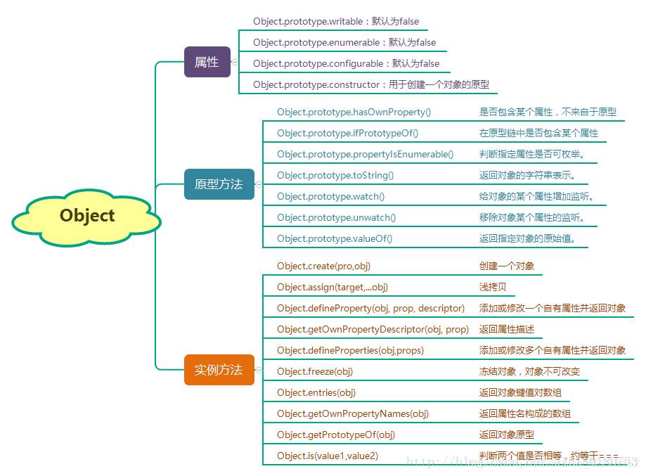
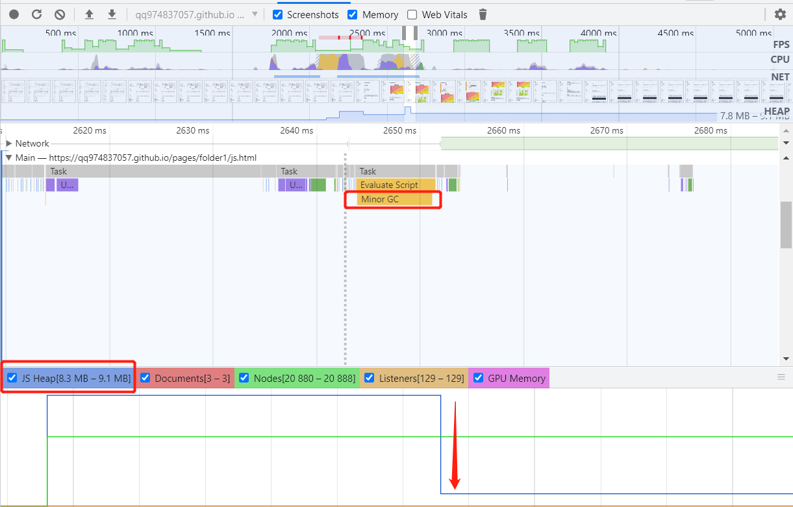
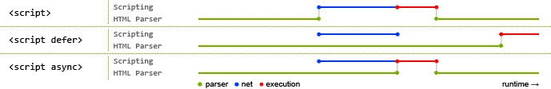

## 学习链接

- [阮一峰-ES6 入门教程](https://es6.ruanyifeng.com/)
- [冴羽-ES6 完全使用手册](https://juejin.im/post/5bfe05505188252098022400#heading-1)
- [JavaScript 教程](https://wangdoc.com/javascript/index.html)
- [MDN](https://developer.mozilla.org/zh-CN/)
- [JS Bin](https://jsbin.com/)

## JS 数据类型

- 基本类型(7)
  - Undefined
  - Null
  - Boolean
  - Number
  - String
  - Symbol(ES6-独一无二且不可变的)
  - BigInt(ES10)
- 引用类型(1)

  - Object 对象
    - Array 数组
    - Function 函数
    - Date 日期
    - RegExp 正则
    - Math 数学对象

- 注意点：

  - 基本类型保存在栈内存。引用类型保存在栈和堆中，栈中保存指针，指向堆中该实体的起始地址。
  - Object 是基础类型，其他所有引用类型都继承它的基本行为。
  - 使用 new + 构造函数 生成的实例，叫对象。构造函数上有定义默认属性和方法。
  - 函数也是对象。
  - 函数参数是按值传递的，和赋值是一样的。基本类型就是复制该变量的值，如果参数是引用类型，赋值对象的内存地址值给函数内的局部变量，改动这个局部变量，外部对象会跟着改变，局部对象使用完会被销毁，如果局部对象更改成另一个对象内存地址，则指向另一个对象，原参数对象不会被改变。
  - JavaScript 中使用双精度浮点数，有效数字是 52 位尾数，11 个指数位，1 个符号位。最大的安全整数 (2^53 - 1)。最小的安全整数 (-(2^53 - 1)).

- null 和 undefined 的区别
  - undefined 表示变量声明但未初始化时的值
  - null 表示“空对象指针”，赋值给一些可能会返回对象的变量，作为初始化
  - 相同点:
    - 都是基本数据类型
    - 在 if 判断语句中,值都默认为 false
    - 大体上两者都是代表无
  - 不同点：
    - null 转为数字类型值为 0,Number(null)=0;undefined 转为数字类型为 NaN(Not a Number)
    - null 的 typeof 运算返回"object"，undefined 的 typeof 运算返回 "undefined"
      设置为 null 的变量或者对象会被回收，常见用法就是作为参数传入(说明该参数不是对象)
    - null 不是对象，虽然 typeof null 是 object，但是历史 Bug，以前低位存储变量的类型信息，000 开头代表对象，而 null 为全 0，所以误判。

## BigInt

- 表示大于 2^53 - 1 的整数，可以表示任意大的整数。
- 也就是超过 Javascript 中可以用 Number 表示的最大数字。
- 使用 typeof 测试时， BigInt 对象返回 "bigint"

- 使用方式

  - 在一个整数字面量后面加 n
  - 调用函数 BigInt()

  ```js
  const BiggestInt1 = 9007199254740991n;

  const BiggestInt2 = BigInt(9007199254740991);
  // ↪ 9007199254740991n
  ```

- 注意：

  - 不能用于 Math 对象中的方法
  - 转换：BigInt 变量在转换成 Number 变量时可能会丢失精度。
  - 计算：BigInt 不能和 Number 实例混合运算，必须为同类型。
  - 排序：BigInt 和 Number 实例混合的数组可以进行 sort。
  - 条件：与 Number 类似，只要不是 0n，BigInt 就被视为 truthy 的值。
  - 位运算：BigInt 可以正常地进行位运算，如|、&、<<、>>和^
  - 比较：BigInt 和 Number 不是严格相等(===)的，但是宽松相等(==)的。

  ```js
  0n === 0;
  // ↪ false

  0n == 0;
  // ↪ true
  ```

- [兼容性](https://www.caniuse.com/#search=bigint)：
  - 目前 IE、Safari、iOS Safari 不支持

## 类型判断

#### 1、typeof

- 基本数据类型使用 typeof 可以返回其类型(字符串形式)，null 类型会返回 object
- 引用数据类型使用 typeof 会返回 object(函数会返回 function)

```js
console.log(typeof 2); // number
console.log(typeof true); // boolean
console.log(typeof "str"); // string
console.log(typeof undefined); // undefined
console.log(typeof null); // object - null 的数据类型被 typeof 解释为 object

console.log(typeof {}); // object
console.log(typeof []); // object
console.log(typeof function () {}); // function
```

#### 2、instanceof

- 判断对象是否为某个类型的实例，原理是判断当前实例对象在它的原型链中能否找到某个构造函数的 prototype 属性。
- instanceof 可以精准判断引用数据类型（Array，Function，Object）
- 基本数据类型不能被 instanceof 精准判断，因为它们有些形式并非实例。

```js
console.log(2 instanceof Number); // false
console.log(true instanceof Boolean); // false
console.log("str" instanceof String); // false
console.log([] instanceof Array); // true
console.log(function () {} instanceof Function); // true
console.log({} instanceof Object); // true
```

#### 3、Object.prototype.toString.call()

- 使用 Object 对象的原型方法 toString ，使用 call 改变 this
- 全部类型可识别，返回形式为`[object Type]`

```js
const a = Object.prototype.toString;

console.log(a.call(2)); //[object Number]
console.log(a.call(true)); //[object Boolean]
console.log(a.call("str")); //[object String]
console.log(a.call([])); //[object Array]
console.log(a.call(function () {})); //[object Function]
console.log(a.call({})); //[object Object]
console.log(a.call(undefined)); //[object Undefined]
console.log(a.call(null)); //[object Null]
```

- 获取 Type 的封装：使用上面 API + 正则匹配将 Type 取出来

```js
function getType(obj) {
  return Object.prototype.toString
    .call(obj)
    .replace(/^\[\w+ (\w+)\]$/, "$1") // w+ 匹配字母数组下划线一个或多个 ()表示子表达式 用$1取出整体匹配表达式后的第一个子表达式，替换掉整体。
    .toLowerCase();
}
```

#### 判断引用类型

判断一：使用 typeof，排除 null 特殊情况。

```js
function isObj(obj) {
  return (typeof obj === "object" || typeof obj === "function") && obj !== null;
}
```

#### 判断函数

- fun typeof function
- fun instanceof Function
- Object.prototype.toString.call(fun)是否为'[object Function]'

#### 判断数组

- 1、Object.prototype.toString.call()
- 2、判断是否在 Array 的原型链上
- 3、Array.isArray()是 ES5 新增的方法

```js
1.  Object.prototype.toString.call(arr) //"[object Array]"

2.  [] instanceof Array; // true

3.  Array.isArray(arr) // true
```

#### 判断 null

- null===x 判断是否为 null
- Object.prototype.`__proto__`===x 原始对象原型的原型即 null

#### 判断 NaN

- Number.isNaN()

## 数据类型转换

在 JS 中类型转换只有三种情况，分别是：

- 转换为布尔值（调用 Boolean()方法）
- 转换为字符串（调用.toString()或者 String()方法）
- 转换为数字（调用 Number()、parseInt()和 parseFloat()方法）

> null 和 undefined 没有 toString 方法


此外还有一些操作符会存在隐式转换，不做展开。

## == 和 ===

- ==：相等。允许类型转换
- ===：严格相等。类型不一致直接 false

- 基本类型比较
  - ==：转为同一类型后比较“值”
  - ===：类型相同就继续比较“值”，类型不同就不等
- 引用类型比较
  - ==和===：无区别
- 基本和引用比较
  - ==：引用转为基本类型后比较“值”
  - ===：类型不同结果 false

## 0.1+0.2 为什么不等于 0.3？

- 一句话：部分浮点数转二进制时因为标准位数 52 位尾数(1 位符号，11 位指数偏移)的限制丢失了精度，计算完再转回十进制时和理论结果不同。

  - 0.1 和 0.2 在转换成二进制后会无限循环，由于标准位数的限制后面多余的位数会被截掉，四舍五入，出现了精度的损失。
  - 相加后再转换为十进制就会变成 0.30000000000000004。

- JS 的 Number 类型遵循的是 IEEE 754 标准，使用的是双精度浮点数，用 64 位长度来表示【符号位(1)+指数(11)+尾数(52)】
  

- 计算过程
  - 转换过程：0.1 > 二进制 > 科学计数法 > IEEE 754(指数和小数分开表示) > 十进制(精度可能丢失)
  - 指数偏移的计算：双浮点固定偏移值 `[2^(11-1)]-1 = 1023` 加上 科学计数法的指数`[如-4]` 再转为 11 位的二进制表示。
  - 尾数计算：科学计数法的小数位选取 52 位，四舍五入。
  ```
  小数转为二进制：小数部分，乘以 2，然后取整数部分的结果(最后组合起来)，再用计算后的小数部分继续乘以 2，直到小数部分为 0。
  指数偏移：1023+(-4) = 1019 -> 011 1111 1011(二进制)
  尾数计算：1.10011001...(无限重复 1001) * 2^-4
  最终0.1的表示为：
    0          011 1111 1011      1001...( 11 x 1001)...1010
    (Sign)     (Exponent)         (Mantissa)
    (符号位)   (指数偏移的二进制)  (尾数：科学计数法后的小数位,选取52位)
  ```
  - 请注意选取 52 位中的最后四位，是 1010 而不是 1001，因为四舍五入有进位，这个进位就是造成 0.1 + 0.2 不等于 0.3 的原因，已经丢失精度。
  - 结果 0.1 + 0.2 = 0.30000000000000004

## 原型、原型链、继承 ✨


- 原型：用来实现对象的属性继承的对象（instance 的`__proto__`）（构造函数的 prototype）
- 构造函数：通过 new 新建一个对象的函数（instance.constructor）（原型的 constructor）
- 实例：通过 new 和构造函数创建的对象，注意实例只有`__proto__`，没有 prototype
- 原型链：每个对象都有`__proto__`属性， 指向该对象构造函数的原型，`__proto__`属性 将对象连接起来组成原型链，有两个特性。
  - 查找特性：一个对象的属性不存在，沿着原型链上一级查找，找到就输出，找不到继续找，直到顶级的原型对象 Object.prototype，没找到就输出 undefined。
  - 修改特性：只会修改实例本身的属性，不存在则添加该属性。修改原型属性时，可以通过构造函数 fn.prototype.x = 1 来修改，继承该对象的属性都会改变。
  - 关系：instance（实例）.constructor.prototype = instance（实例）的`__proto__`
  - 例子：`const instance = new Object()` // instance 为实例，Object 为构造函数，Object.prototype 为原型
- 继承

  - 借助构造函数
    - 父类的构造函数通过 call(this)，在子类构造函数中执行，this 指向子类构造函数的实例
    - 缺点：只能继承父类的属性(拷贝属性副本)，无法继承父类的原型上的方法
  - 借助原型链
    - 使用父类的实例，作为子类构造函数的 prototype
    - 缺点：父类生成的实例属性如果是引用类型(也就是子类原型对象上有引用类型)，则会被子类生成的每个实例共享，改动引用类型的属性会影响其他实例。
  - 组合：构造+原型链
    - 通过构造函数继承属性，通过原型链继承方法，保证每个子类的实例有自己的父类属性副本，而且可以通过原型链复用方法。
    - 缺点：执行了两次父类构造函数，产生多余实例属性，且构造函数指的是父类的构造函数。
  - 寄生组合式
    - 通过构造函数继承属性，通过原形链继承方法，为了隔离开父类原型，让子类拥有自己的构造函数，再创造一个以父类的原型作为原型对象的中间对象，作为子类构造函数的原型对象，再将构造函数放入该原型【Object.create(Parent.prototype)+子类构造函数 Child.prototype.constructor = Child】。
    - 解决：之前组合式中无法区分是父类还是子类直接 new 出来的对象，因为共用了原型对象【`Child.prototype = Parent.prototype`】，构造函数指的都是父类的构造函数，子类无自己构造函数。改进后子类有自己的构造函数，可通过实例的 constructor 查看其构造函数，来看看是由谁直接 new 得到的。
    - 实现：创建的中间对象以父类的原型作为原型对象，中间对象又是子类的原型对象，形成原型链。使父类原型对象和子类原型对象不再是同一个，而是增加一级，然后再给子类添加自己的构造函数。
      

- Object.create(obj)

  - 作用：创建一个新对象，是以参数 obj 作为它的原型对象`__proto__`
  - 实现：
    - 定义了一个临时构造函数 F()
    - 将这个临时构造函数 F()的原型`prototype`指向了传入进来的对象 obj。
    - 返回这个构造函数的一个实例。该实例拥有 obj 的所有属性和方法。

  ```js
  function create(obj) {
    function F() {}
    F.prototype = obj;
    return new F();
  }
  ```

- 在创建新的对象或者类时，方法通常应该关联于对象的原型，而不是定义到对象的构造器中。

  - 原因是这将导致每次构造器被调用时，方法都会被重新赋值一次（也就是说，对于每个对象的创建，方法都会被重新赋值）。

- 获取指定对象的原型（内部`[[Prototype]]`属性的值）
  - `obj.__proto__`
  - `obj.constructor.prototype`
  - `Object.getPrototypeOf(obj)`

```js
var reg = /a/;
reg.__proto__ === RegExp.prototype;
reg.constructor.prototype === RegExp.prototype;
Object.getPrototypeOf(reg) === RegExp.prototype; // true

var proto = {};
var obj = Object.create(proto);
Object.getPrototypeOf(obj) === proto; // true
```

## 作用域、作用域链 ✨

- 作用域：代码中定义变量的区域，确定当前执行代码对变量的访问权限范围。可以看做一个封闭空间。
- 作用域链：由**多个执行上下文(作用域)的变量对象构成的链表**就叫做作用域链。
  - 变量查找特性：(只能下往上查找，不能由上往下，找到就停止，不会继续向上找)
    - 当查找变量的时候，会先从**当前上下文（作用域）的变量对象**中查找，如果没有找到，就会从**父级(词法层面上的父级)**执行上下文的变量对象中查找，一直找到全局上下文的变量对象，也就是全局对象。
- JavaScript 采用静态(词法)作用域：函数作用域在函数定义时决定的，基于函数创建的位置。
- 执行上下文栈：执行一个函数的时候，就会创建一个执行上下文，并且压入执行上下文栈，当函数执行完毕的时候，就会将函数的执行上下文从栈中弹出，底部有 globalContext 全局上下文。
- 执行上下文（作用域）：(全局上下文、函数上下文)
  - 属性
    - 变量对象 VO：存储上下文中定义的变量和函数声明，未进入执行阶段不能访问，叫 VO，进入执行阶段，可访问，叫 AO。
    - 作用域链
    - this
  - 全局上下文
    - 变量对象：全局对象 window，由 Object 实例化的对象
  - 函数上下文
    - 变量(活动)对象 AO：进入上下文被创建激活，属性可被访问(函数的形参、函数声明、变量声明)
  - **变量对象的两个阶段**
    - 分析(进入执行上下文): 创建 AO(函数的形参、函数声明、变量声明)**，优先处理函数声明，如果变量名称与函数相同，不影响已存在函数。**
    - 执行(代码执行) : 按顺序执行，修改 AO 对象的值
  - **作用域链的两个阶段**(只能下往上查找，不能由上往下)
    - 每一个子函数都会拷贝上级的作用域（保存变量对象），形成一个作用域的链条
    - 函数创建时：内部属性 [[scope]]会保存所有父变量对象进去(父变量对象的层级链)
    ```
     bar.[[scope]] = [
            fooContext.AO,
            globalContext.VO
        ];
    ```
    - 函数激活时：将自身 AO 添加到作用域头部，构成完整作用域链
    ```
    Scope = [AO].concat([[Scope]]);
    ```
- 函数执行上下文的变量对象和作用域创建全过程：
  - **函数创建时保存父级作用域 -> 准备执行时创建变量(形参/函数/变量) -> 自身的变量对象压入作用域头部形成作用域链 -> 执行时修改变量 -> 执行完毕弹出执行栈**
  - 函数定义，保存整个父级作用域(变量对象)到函数的内部属性[[scope]]
  - 函数准备执行，创建上下文，压入执行栈
  - 准备工作 1：Scope:[[scope]]创建整个作用域，先将父级作用域存入，进入上下文
  - 准备工作 2：arguments 创建 AO 进行初始化，加入形参、函数声明、变量声明
  - 准备工作 3：AO 压入作用域头部 Scope:[AO, [[Scope]]]
  - 开始执行：修改 AO 属性值
  - 执行完毕：弹出上下文栈
- 变量提升

  - 概念：JS 引擎解析代码，获取所有声明的变量，再一行一行运行。所有变量声明都会提升到自身作用域的代码头部。
  - 例子： 引擎将 var a = 1 拆解为 var a = undefined 和 a = 1，并将 var a = undefined 放到最顶端，a = 1 还在原来的位置

    ```js
    var a = undefined; // (声明提到代码头部)
    console.log(a); // undefined

    a = 1; // 伪代码：(正常写法)var a = 1

    function b() {
      console.log(a);
    }
    b(); // 1
    ```

  - 因为 js 是预解析创建执行上下文包括变量对象和函数参数，然后再执行代码。

    - 扫描函数，若有函数声明，【名称和对应值（函数对象(function-object)）】存入变量对象，同名函数会被覆盖。
    - 扫描变量，若有变量声明，【名称和对应值（undefined）】存入变量对象，同名变量会被覆盖。
    - 若变量和函数或形参同名，则不干扰前面已存在的。函数或形参优先。

    ```js
    console.log(foo);
    function foo() {
      console.log("foo");
    }
    var foo = 1;
    // ƒ foo(){
    //  console.log("foo");
    // }
    ```

    - 执行赋值或打印时，在当前作用域找是否有该变量，若存在，则使用，不存在则向上作用域寻找。
    - 函数的两种情况：函数声明为函数，所以函数声明是可以先在前面访问到。但函数表达式相当于变量，会被提升为 undefined，所以用函数表达式后提前访问会出错。

    ```js
    foo();
    console.log(joe);
    joe();
    function foo() {
      console.log("foo");
    }

    var joe = function () {
      console.log("joe");
    };
    // foo
    // undefined
    // Uncaught TypeError: joe is not a function
    ```

    - 同名冲突处理：
      - 变量和变量：后者覆盖前者
      - 函数和函数：后者覆盖前者
      - 变量和函数：函数声明将覆盖变量声明

  - ES6 中的 let 与 const，阻止了变量提升，未声明就使用会报未定义的错。
  - 作用域分全局作用域、函数作用域、es6 使用 let/const 创建的块级作用域。
  - 作用域链里的变量对象是一层一层 push 的，可以往上查找，但**外层访问不到内层的作用域变量对象**。而变量提升都是在自己的作用域头部，例如全局作用域 or 函数作用域的头部。

- [知乎解释](https://zhuanlan.zhihu.com/p/26533735)

## new 运算符的实现 ✨

- new Object()创建新的对象 obj。
- obj 的`__proto__`链接到构造函数的原型`fn.prototype`。
- 执行构造函数，用 apply 使 this 指向新建的对象`fn.apply(obj, [...arguments].slice(1))`。
- 构造函数执行完若有返回引用类型的值，则返回该对象 res，返回非引用类型的值，则忽略。
- 执行完无返回，则返回创建的对象 obj。

## this 和 call、apply、bind ✨

- 非箭头函数
  - 执行时才确定 this 指向
  - 默认情况下，this 是指向全局对象的，浏览器就是指向 window
  - 隐式绑定：this 指向最后调用它的那个对象，也就是离得最近的对象（注意，如果不是通过对象调用方法，而是直接函数执行，一般都是默认 window 对象）
  ```js
  var name = "windowsName";
  var a = {
    name: "Joe",
    fn: function () {
      console.log(this.name); // Joe
    },
  };
  window.a.fn();
  ```
  - 显式绑定：call、apply、bind
  - new 绑定：this 指向通过 new 构造函数生成的新对象
  - 优先级：new 绑定 > 显式绑定 > 隐式绑定 > 默认绑定
- 箭头函数
  - 指向函数定义时的 this，而非执行时
  - 没有自己的 this，通过作用域链决定 this
  - 被非箭头函数包裹，则为最近的非箭头函数的 this，否则为 undefined
- 匿名函数： this 永远指向 window，一般匿名函数后面加 () 让其自执行，可以给其他函数调用。

- 改变 this 的方法（call、apply、bind）

  - 1、ES6 箭头函数（定义时的 this ）
  - 2、函数内部使用 var \_this = this
  - 3、call、apply、bind
    - call: `fn.call(target, 1, 2)`
    - apply: `fn.apply(target, [1, 2])`
    - bind: `fn.bind(target，1，2)()`
    - apply 第二个参数是数组（或类数组对象如 arguments，ES5 支持），call 和 bind 后面都是接单个参数
    - call 和 apply 默认会自动执行函数，bind 需要在后面加()来自动执行
    - call 比 apply 的性能要好，使用扩展运算符`let params = [1, 2, 3, 4] ；xx.call(obj, ...params)`
  - 每个函数都包含 call、apply、bind，设置函数内 this 对象的指向，改变函数的执行环境。默认是传的 this 是 window 对象。bind 是创建一个函数实例，改变 this 指向后，新建的那个函数即使在全局作用域调用，也是指向改变后的那个 this。
  - 作用是扩充作用域，可以直接通过 call 那个对象，让 this 指向该对象。不用把方法放在一个对象中，再通过这个对象去调用里面的方法。

  ```js
  window.color = "red";
  var o = { color: "blue" };
  function sayColor() {
    alert(this.color);
  }
  sayColor(); // red  隐式在全局作用域window调用该函数，this指向window

  sayColor.call(this); // red  显式在全局作用域window调用该函数
  sayColor.call(window); // red  显式在全局作用域window调用该函数
  sayColor.call(o); // blue 执行环境改变，this指向o
  ```

  箭头函数：

  ```js
  var name = "windowsName";
  var a = {
    name: "Joe",
    func1: function () {
      console.log(this.name);
    },
    func2: function () {
      setTimeout(() => {
        this.func1();
      }, 100);
    },
  };
  a.func2(); // Joe
  ```

  var \_this = this：为了防止在 func2 中的 setTimeout 被 window 调用而导致的在 setTimeout 中的 this 为 window。

  ```js
  var name = "windowsName";
  var a = {
    name: "Joe",
    func1: function () {
      console.log(this.name);
    },
    func2: function () {
      var _this = this;
      setTimeout(function () {
        _this.func1();
      }, 100);
    },
  };
  a.func2(); // Joe
  ```

  this 和作用域的区别

  ```js
  // 作用域 -> 查找当前作用域有该变量，直接用
  var name = "global";
  function a() {
    var name = "joe";
    console.log(name);
  }
  a(); // joe

  // 作用域 -> 查找当前作用域没有该变量，向上查找
  var name = "global";
  function a() {
    console.log(name);
  }
  a(); // global

  // this指向 -> 指向调用它的环境this，这里其实是全局window.a()
  var name = "global";
  function a() {
    var name = "joe";
    console.log(this.name);
  }
  a(); // global
  ```

## 对象

- 创建对象

  - 1、字面量（简洁性能好）
  - 2、构造函数（要调用函数）
  - 3、Object.create

- 对象常用方法
  - `Object.create(proto)` 以 proto 为原型对象，创建一个对象
  - `Object.assign(target, ...obj)` 浅拷贝
  - `Object.defineProperty(obj, prop, descriptor)` 修改自有属性并返回，prop 为指定某个属性名，descriptor 描述符对象(如下)
    - configurable 为 true，该属性的描述符能够被改变
    - enumerable 为 true，该属性出现在对象的枚举属性
    - writable 为 true 时，value 能被赋值运算符改变
    - value 该属性对应的值
    - get 当访问该属性时，会调用此函数
    - set 当属性值被修改时，会调用此函数
    - 如果一个描述符同时拥有 value 或 writable 和 get 或 set 键，则会产生一个异常。
    - 拥有布尔值的键 configurable、enumerable 和 writable 的默认值都是 false。
    - 属性值和函数的键 value、get 和 set 字段的默认值为 undefined。
  - `Object.freeze(obj)` 冻结对象
  - `Object.entries(obj)` 返回对象键值对数组
  - `Object.is(value1, value2)` 判断两个值是否为同一个值
    - 与"=="不同，不会强制转换类型。
    - 与"==="不同，用 Object.is 判断，-0 和+0 不相等，NaN 和 NaN 相等。
  - `Object.getOwnPropertyNames(obj)` 返回自身属性名
  - `Object.getPrototypeOf(obj)` 返回对象原型
    

## 数组 ✨

- 切割推入排序
  - `slice(start, end)`: 返回选中的数据组成的新数组（从 start 到 end），不改变原数组
  - `splice(start, number, value...)`: 返回删除元素组成的数组，**改变原数组**，由 value 替换被删除的位置，无需替换则直接删除。
  - `push / pop`: 末尾推入/弹出，**改变原数组**，push 返回该数组的新长度， pop 返回弹出项的值，一般可用作栈实现，。
  - `unshift / shift`: 头部推入/弹出，**改变原数组**，返回新的长度/操作项
  - `sort(fn) / reverse`: 排序与反转，**改变原数组**，**不传入对比函数，元素按照转换为的字符串的各个字符的 Unicode 位点进行排序（从小到大）。**
- 连接数组
  - `concat`(不改变原数组，浅拷贝)
- 转字符串
  - `join`(不改变原数组，可传入连接符)
- 迭代方法 - `forEach((value元素,index索引,arr) => {})`：数组每一项做一件事，回调函数返回 undefined 值 - `map`：每项通过某种计算返回值 回调函数每次的返回值 最后组成一个新数组，如果不想返回新数组，最好推荐 forEach 或者 for-of 替代。 - `filter`：符合条件的项生成新数组 - `reduce( fn(pre, next) {} )`：前后值通过计算，累计返回最后的值 - `every`：每项都符合条件返回 true - `some`：某项符合条件就 true
  

- 去重
  - `[...new Set(arr)]`
- 拍平
  - `arr.flat(Infinity)` //Infinity 参数表示拍平所有层级，默认为 1 会移除空项
- 先拍平再去重然后排序

```js
[...new Set(arr.flat(Infinity))].sort((a, b) => {
  return a - b;
});
```

- 判断数组是否有某个值：【`indexOf(element, fromIndex)、includes()、find()、findIndex()`】

```js
var arr = [1, 2, 3, 4];
var index = arr.indexOf(3); //不存在返回-1,存在返回该字符串首次出现的位置,fromIndex代表开始查找的位置
if (arr.indexOf(3) !== -1) {
  console.log("存在");
} //判断不为-1，才存在
if (arr.indexOf(3))
  if (arr.includes(3)) {
    //注意这样判断不对，if(-1)为真 if(0)为假

    console.log("存在");
  } //存在返回true

var result = arr.find((item) => {
  return item > 3;
}); //返回数组中满足条件的第一个元素值，没有返回undefined

var result = arr.findIndex((item) => {
  return item > 3;
}); //返回数组中满足条件的第一个元素的下标，没有返回-1
```

- 两个数组取差集

```js
let difference = arr1.filter((v) => !arr2.includes(v));
let difference = arr1.filter((v) => {
  return arr2.indexOf(v) === -1;
});
```

- 判断是否为数组

  - 1、Object 的对象都有 toString 方法，没有重写则返回 [Object type]，由于除了 Object 外，其他类型使用 toString 会变为字符串，所以需要 call 改变上下文，调用原型上的 toString 方法
  - 2、判断原型链上是否有该 Array 的原型 prototype，只能判断对象，原始类型不可以
  - 3、Array.isArray()是 ES5 新增的方法，当不存在 Array.isArray() ，可以用 Object.prototype.toString.call() 实现。

  ```js
  1.  Object.prototype.toString.call(arr) //"[object Array]"

  2.  [] instanceof Array; // true

  3.  Array.isArray(arr) // true
  ```

## JS 中的遍历、枚举 ✨

- 标准 for 循环
  - 需要维护【下标 i 和边界 length】
- forEach
  - 【缺点：无法中止循环】数组太大时，无法在特定条件下`break/continue/return`退出遍历，造成资源浪费。
- for...in 【读取键名，包括继承】
  - 普遍使用，兼容性好，支持`break/continue/return`
  - 遍历对象【自身+继承】的可枚举(enumerable:true)的属性（不含 Symbol 属性）。
  - 若不想获取继承的属性，可多加判断`if(obj.hasOwnProperty(key)) {...}`，不想某些原型属性被遍历，可在原型属性设置(enumerable:false)
- for...of(推荐)【默认读取键值】【对于 Map 结构默认为 entries()，包括键名和键值】

  - 简洁，支持`break/continue/return`退出循环，需要 ES6 以上
  - 依赖对象遍历器 Iterator 的遍历，每次执行遍历器的 next 方法
  - 大多数 JavaScript 的内置对象都支持迭代，例如：Array、Set、Map、String、函数的 arguments 、NodeList 等
  - entries()返回一个遍历器对象，用来遍历[键名, 键值]组成的数组。对于数组，键名就是索引值；对于 Set，键名与键值相同。
  - keys() 返回一个遍历器对象，用来遍历所有的键名。
  - values() 返回一个遍历器对象，用来遍历所有的键值。
  - 普通对象(自己创建对象)不能直接使用`for...of`，需要配合`Object.keys()`

  ```js
  // for...in循环读取键名。
  let arr = ["a", "b", "c"];
  for (let item in arr) {
    console.log(item);
  }
  // '0'
  // '1'
  // '2'

  // for...of循环默认读取键值
  for (let item of arr) {
    console.log(item);
  }
  // 'a'
  // 'b'
  // 'c'

  // 对于Map结构默认为entries()
  let iterable = new Map([
    ["a", 1],
    ["b", 2],
    ["c", 3],
  ]);
  for (let entry of iterable) {
    console.log(entry);
  }
  // ["a", 1]
  // ["b", 2]
  // ["c", 3]

  // 使用entries()返回遍历对象
  let arr = ["a", "b", "c"];
  for (let item of arr.entries()) {
    console.log(item);
  }
  // [ 0, 'a' ]
  // [ 1, 'b' ]
  // [ 2, 'c' ]

  // 使用解构，方便读取值
  let arr = ["a", "b", "c"];
  for (let [key, value] of arr.entries()) {
    console.log(key, value);
  }
  // 0 'a'
  // 1 'b'
  // 2 'c'

  // 下面是类数组对象具备遍历器接口
  // 并不是所有类似数组的对象都具有 Iterator 接口，可以先使用Array.from方法将其转为数组。

  // 字符串
  let str = "hello";
  for (let s of str) {
    console.log(s); // h e l l o
  }

  // arguments对象
  function printArgs() {
    for (let x of arguments) {
      console.log(x);
    }
  }
  printArgs("a", "b");
  // 'a'
  // 'b'

  // 自定义类数组对象
  let arrayLike = { length: 2, 0: "a", 1: "b" };
  for (let x of Array.from(arrayLike)) {
    console.log(x);
  }
  // 'a'
  // 'b'
  ```

- Object.keys() 【读取键名，不包括继承】
  - ES5，兼容好，返回值顺序不定，若对顺序有需求，使用 map 结构或 set 集合,按成员被添加进时的顺序。
  - 获取对象【自身的可枚举属性的键名】（不包括继承属性）
  ```js
  let joe = {
    name: "joe",
    age: 25,
  };
  for (let key of Object.keys(joe)) {
    console.log(key + ": " + joe[key]);
  }
  ```
- 对象的属性遍历
  - 从该属性的描述对象，看可枚举性 enumerable
    ```js
    let obj = { foo: 123 };
    Object.getOwnPropertyDescriptor(obj, "foo");
    //  {
    //    value: 123,
    //    writable: true,
    //    enumerable: true,
    //    configurable: true
    //  }
    ```
  - `for...in`【返回键名，自身 + 可枚举 + 继承（不含 Symbol）】
  - `Object.keys(obj)`【返回键名数组，自身 + 可枚举（不含 Symbol）】
  - `Object.getOwnPropertyNames(obj)`【返回键名数组，自身 + 可枚举 + 不可枚举（不含 Symbol）】
  - `Object.getOwnPropertySymbols(obj)`【返回键名数组，里面是自身 Symbol 属性】
  - `Reflect.ownKeys(obj)`【返回键名数组，自身 + 可枚举 + 不可枚举 + Symbol 属性】

## 类数组对象

- 概念：JS 中，对于一个普通的对象来说，如果它的所有键名均为正整数（由 0 开始 1、2...），同时拥有 length 属性，则为“类数组对象”。
- 例子：(函数中的) arguments / (querySelector 获得的) nodeList
- 转为数组：类数组 -> 数组

  - ES5
    ```js
    let args = [].slice.call(arguments);
    let args = [].splice.call(arguments, 0);
    let args = [].concat.apply([], arguments);
    let args = Array.prototype.slice.call(arguments); //使用Array.prototype原型上的方法也可以
    ```
  - ES6
    ```js
    let args = Array.from(arguments); // ES6 的Array.from()
    let args = [...arguments]; // ES6展开运算符
    ```

- 剩余参数和 arguments 对象的区别
  - 剩余参数只包含那些没有对应形参的实参，而 arguments 对象包含了传给函数的所有实参。
  - arguments 对象不是一个真正的数组，而剩余参数 rest(...rest)是真正的 Array 实例，可以在它上面直接使用所有的数组方法，比如 sort，map，forEach 或 pop。

```js
function sortRestArgs(...theArgs) {
  var sortedArgs = theArgs.sort();
  return sortedArgs;
}
alert(sortRestArgs(5, 3, 7, 1)); // 弹出 1,3,5,7

// 为了在arguments对象上使用Array方法，它必须首先被转换为一个真正的数组。
function sortArguments() {
  var args = Array.prototype.slice.call(arguments);
  var sortedArgs = args.sort();
  return sortedArgs;
}
console.log(sortArguments(5, 3, 7, 1)); // shows 1, 3, 5, 7
```

## ECMAScript

ECMAScript 和 JavaScript 的关系

- 布兰登·艾克于 1995 年设计，1996 年 JavaScript 由欧洲计算机制造商协会(ECMA)标准化
- 前者是标准，后者是实现和扩展
- 完整的 JavaScript 包括以下几个部分：

  - ECMAScript，描述了该语言的语法和基本对象
  - 文档对象模型（DOM），描述处理网页内容的方法和接口
  - 浏览器对象模型（BOM），描述与浏览器进行交互的方法和接口

- 历史：ES5(2011) -> ES6(2015) -> ES7(2016) -> ES8(2017)

## ES6 ✨

- [ES6-掘金参考](https://juejin.im/post/5d9bf530518825427b27639d#heading-7)
- 块级作用域(let,const)：（ 块级作用域、不存在变量提升、不允许重复声明、const 常量）
- Symbol：新基本数据类型
- 箭头函数
- 函数参数允许设置默认值、引入了 rest 参数（形式为...变量名）获取函数的多余参数
- ES Module:模块化(import / export)
- Set 和 Map 数据结构
- Promise 的使用与实现
- generator:
  - yield: 暂停代码
  - next(): 继续执行代码
- ES8（ES2017） 提供的 Async/Await 语法糖

- 扩展运算符`...` : 对象和数组新增
- 模板字符串
- 变量的解构赋值:`const arr = [1, 2, 3, 4]; const [first, second] = arr;`
- 数组新 API: 如 isArray / from / of 方法; 数组实例新增了 entries()，keys() 和 values() 等方法
- 类：提供了定义类的语法糖(class)、类引入导出和继承( class/import/export/extends)

- let、const、var 的区别有哪些？

  - 1、let/const 定义的变量不会出现变量提升（暂存死区，不可访问），而 var 定义的变量会提升。（没 var 关键字的变量总是全局）
  - 2、let、const 创建块级作用域, 外部访问不到该变量，该变量处于从块开始到初始化处理的“暂存死区”。未声明就提前使用会报错 ReferenceError。
  - 3、相同作用域中，let 和 const 不允许重复声明，var 允许重复声明。
  - 4、const 声明只读的常量 (即指针)，必须设置初始值（基本数据不可改变值，引用值可以），只声明不赋值会报错。

  > const 常量的本质：JS 中复杂数据存在栈是堆的内存地址，堆里的值可以改变，但是堆内存的地址不可变。

  > 暂时性死区的本质：只要一进入当前作用域，所要使用的变量就已经存在了，但是不可获取，只有等到声明变量后，才可以获取和使用该变量。

- 箭头函数

  - 箭头函数不属于普通的 function，所以没有独立的上下文。
  - 箭头函数是普通函数的简写，可以更优雅的定义一个函数，和普通函数相比，有以下几点差异：
    - 1、没有自己的 this，函数体内的 this 对象，是定义时所在的对象，而不是使用时所在的对象。
    - 2、没有 arguments 对象。可以用 rest 参数代替。
    - 3、不可以使用 yield 命令，因此箭头函数不能用作 Generator 函数。
    - 4、不可以使用 new 命令，因为：没有自己的 this，无法调用 call，apply，bind。
  - 在以下场景中不要使用箭头函数去定义：
    - 定义对象方法、定义原型方法、定义构造函数、定义事件回调函数。
  - 箭头函数写法：

    - 有括号记得加 return，否则出问题。
    - 没括号才可以省略 return。

    ```js
    // 当箭头函数只有一个参数时，可以省略参数的圆括号
    elements.map((element) => {
      return element.length;
    });

    // 当箭头函数的函数体只有一个 `return` 语句时，可以省略 `return` 关键字和方法体的花括号
    elements.map((element) => element.length);
    ```

- 扩展运算符
  - 和 concat 一样属于浅拷贝

```js
//复制数组
const a1 = [1,2]
const a2 = [...a1]
//合并数组
const arr1 = ['a', 'b'];
const arr2 = ['c'];
const arr3 = ['d', 'e'];
[...arr1, ...arr2, ...arr3] // [ 'a', 'b', 'c', 'd', 'e' ]
//解构赋值
const [first, ...rest] = [1, 2, 3, 4, 5];
first // 1
rest  // [2, 3, 4, 5]
//字符串
[...'joe'] //["j", "o", "e"]

```

- 模板字符串

  - 使用${expr}嵌入一个表达式

  ```js
  //ES5 Version
  function greet(name) {
    return "Hello " + name + "!";
  }

  //ES6 Version
  function greet(name) {
    return `Hello ${name} !`;
  }
  ```

  - 不需要使用转义字符来做多行处理

  ```js
  //ES5 Version
  var lastWords = "\n" + "   I  \n" + "   Am  \n" + "Iron Man \n";

  //ES6 Version
  let lastWords = `
      I
      Am
    Iron Man   
  `;
  ```

- 解构
  - 从对象或数组中获取或提取值更简洁的方法

```js
const employee = {
  name: "Joe",
  position: "Software Developer",
};

var firstName = employee.firstName;
var position = employee.position;

// ES6 简洁取出对应的属性，且可以取别名和默认值
let { firstName: fName, position = "默认" } = employee;
```

- rest 参数(剩余参数)

  - rest 参数（形式为...变量名），用于获取函数的多余参数
  - 该变量名是一个数组，可以直接使用数组方法
  - rest 参数之后不能再有其他参数，即只能是最后一个参数

  ```js
  // arguments变量的写法
  function sortNumbers() {
    return Array.prototype.slice.call(arguments).sort();
  }

  // rest参数的写法
  const sortNumbers = (...numbers) => numbers.sort();
  ```

- 类的声明

  - 是个语法糖，底层是基于原型的继承。
  - 在类的实例上面调用方法，其实就是调用原型上的方法。
  - 类的声明有两种，ES5 和 ES6，如下。

  ```js
  // ES5
  function Point(x, y) {
    this.x = x;
    this.y = y;
  }

  Point.prototype.toString = function () {
    return "(" + this.x + ", " + this.y + ")";
  };

  // 生成实例
  var p = new Point(1, 2);

  // ES6
  class Point {
    constructor(x, y) {
      this.x = x;
      this.y = y;
    }

    toString() {
      return "(" + this.x + ", " + this.y + ")";
    }
  }

  class Point {
    constructor() {
      // ...
    }
    toString() {
      // ...
    }
    toValue() {
      // ...
    }
  }

  // 等同于
  Point.prototype = {
    constructor() {},
    toString() {},
    toValue() {},
  };
  ```

## Map、Set、WeakMap、WeakSet ✨

- 总结：Map/Set、WeakMap/WeakSet 的作用

  - 它们是构造函数，用于生产新的数据结构
  - Set 类似数组，但成员是唯一不重复的。Map 可以用对象或其他类型做键名 key，同个键名则更新键值，注意两个同名对象作为键名，内存地址不一致，仍是两个键。
  - WeakSet 集合中的值、WeakMap 的键名都必须是对象，且它们是弱引用，可以防止内存泄露。WeakSet/WeakMap 都不可遍历(因为成员可能被手动释放，随时消失)
  - 应用
  - Set 常用于数组去重`[...new Set(arr)]`
  - Map 结构提供了“值—值”的对应（不受普通对象 Object“字符串-值”的限制）
  - WeakSet 储存 DOM 节点解决内存泄漏，WeakMap 常用于深拷贝解决循环调用的问题

- Set

  - 成员唯一，没有重复值
    - 判断重复值类似`===`，区别是 NaN 也会被 Set 认为相等
    - 添加值时不会发生类型转换(`5 !== "5"`)
    - 两个对象总是不相等的
  - 用法：`const set = new Set(arr)`
  - 接受参数：数组或具有 iterable 接口可迭代的数据结构（如类数组对象）
  - 常用

    - 数组去重
      ```js
      [...new Set(arr)];
      // 或者
      Array.from(new Set(arr));
      ```
    - 字符串去重
      ```js
      [...new Set("ababbc")].join("");
      ```
    - 实现并集、交集、差集

      ```js
      let a = new Set([1, 2, 3]);
      let b = new Set([4, 3, 2]);

      // 并集
      let union = new Set([...a, ...b]);
      // Set {1, 2, 3, 4}

      // 交集
      let intersect = new Set([...a].filter((x) => b.has(x)));
      // Set {2, 3}

      // 差集
      let difference = new Set([...a].filter((x) => !b.has(x)));
      // Set {1}
      ```

    - 遍历改变原有 set 结构，先映射，再赋值回原有 set

      ```js
      // 方法一
      let set = new Set([1, 2, 3]);
      set = new Set([...set].map((val) => val * 2));
      // set的值是2, 4, 6

      // 方法二
      let set = new Set([1, 2, 3]);
      set = new Set(Array.from(set, (val) => val * 2));
      // set的值是2, 4, 6
      ```

  - 实例属性和方法
    - 属性
      - constructor：构造函数，返回 Set 函数
      - size：返回实例成员总数
    - 方法
      - add(value)：添加值，返回整个 Set
      - delete(value)：删除值，返回布尔
      - has(value)：检查值，返回布尔
      - clear()：清除所有成员，无返回值
      - // 遍历相关方法 ：顺序就是插入顺序（比如保存回调函数列表，按顺序调用）
      - keys()：返回键名的遍历器
      - values()：返回键值的遍历器
      - entries()：返回键值对的遍历器
      - forEach()：使用回调函数遍历每个成员

- WeakSet：弱引用
  - 场景：适合临时存放一组对象：只要这些对象在外部消失，它在 WeakSet 结构中的引用就会自动消失
  - 示例：WeakSet 中的对象都是弱引用，避免内存泄露，如储存 DOM 节点，而不用担心这些节点从文档移除时，会导致内存泄漏。垃圾回收机制不考虑 WeakSet 的引用，直接回收。
  - 规则 1：WeakSet 的成员只能是对象
  - 规则 2：WeakSet **不可遍历**（成员可能随时消失）
  - 原理：WeakSet 对该对象的引用，如果其他对象都不再引用该对象，那么垃圾回收机制会自动回收该对象所占用的内存，忽略 WeakSet 的引用，因为是弱引用。
  - 用法：`const set = new WeakSet(arr)`
  - 属性
    - constructor：构造函数，返回 WeakSet 函数
  - 方法
    - add()：添加值，返回实例
    - delete()：删除值，返回布尔
    - has()：检查值，返回布尔
- Map

  - 传统的对象只能用字符串做键名，Map 不限于字符串，可以包括对象或其他类型（包括函数）。
  - 简单类型（数字、字符串、布尔值），如果符合`===`，就为同个键（特殊情况 NaN,在 Map 也是同一个键）
  - 如果是对象（包括数组），Map 的键实际上是跟内存地址绑定的，只要内存地址不一样，即使同名同值，也视为两个键。解决扩展库的同名属性冲突问题
  - 用法：`const map = new Map(arr)` //双元素数组的数据结构, Set 和 Map 都可以用来生成新的 Map。

    ```js
    // 数组
    const map = new Map([
      ["name", "张三"],
      ["title", "Author"],
    ]);
    map.get("name"); // "张三"

    // Set入参
    const set = new Set([
      ["foo", 1],
      ["bar", 2],
    ]);
    const m1 = new Map(set);
    m1.get("foo"); // 1

    // Map入参
    const m2 = new Map([["baz", 3]]);
    const m3 = new Map(m2);
    m3.get("baz"); // 3
    ```

  - 属性
    - constructor：构造函数，返回 Map 函数
    - size：返回成员总数
  - 方法

    - set(key,value)：添加键名为 key，对应键值为 value，若已存在则更新键值，返回整个 Map 对象，可链式 set
    - get(key)：读取 key 对应的键值，找不到 key，返回 undefined
    - has(key)：返回布尔值，表示某个键名是否在当前 Map 对象中
    - delete(key)：删除值，返回布尔，失败返回 false
    - clear()：清除所有成员，无返回值
    - 遍历相关方法：遍历顺序就是插入顺序
    - keys()：返回键名的遍历器。
    - values()：返回键值的遍历器。
    - entries()：返回所有成员的遍历器。
    - forEach()：遍历 Map 的所有成员。

      ```js
      const map = new Map([
        ["F", "no"],
        ["T", "yes"],
      ]);

      for (let key of map.keys()) {
        console.log(key);
      }
      // "F"
      // "T"

      for (let value of map.values()) {
        console.log(value);
      }
      // "no"
      // "yes"

      for (let item of map.entries()) {
        console.log(item[0], item[1]);
      }
      // "F" "no"
      // "T" "yes"

      // 或者
      for (let [key, value] of map.entries()) {
        console.log(key, value);
      }
      // "F" "no"
      // "T" "yes"

      // 等同于使用map.entries()
      for (let [key, value] of map) {
        console.log(key, value);
      }
      // "F" "no"
      // "T" "yes"
      ```

  - Map 转为数组结构：扩展运算符

    ```js
    const map = new Map([
      [1, 'one'],
      [2, 'two'],
      [3, 'three'],
    ]);
    [...map.keys()]
    // [1, 2, 3]

    [...map.values()]
    // ['one', 'two', 'three']

    [...map.entries()]
    // [[1,'one'], [2, 'two'], [3, 'three']]

    [...map]
    // [[1,'one'], [2, 'two'], [3, 'three']]
    ```

  - 数组转为 Map：传入 Map 构造函数
    ```js
    new Map([
      [true, 7],
      [{ foo: 3 }, ["abc"]],
    ]);
    // Map {
    //   true => 7,
    //   Object {foo: 3} => ['abc']
    // }
    ```
  - Map 转为对象：遍历给 obj 赋值（前提是 Map 键名都是字符串）
    ```js
    function strMapToObj(strMap) {
      let obj = Object.create(null);
      for (let [k, v] of strMap) {
        obj[k] = v;
      }
      return obj;
    }
    ```
  - 对象转为 Map：`Object.entries()`
    ```js
    let obj = { a: 1, b: 2 };
    let map = new Map(Object.entries(obj));
    ```

- WeakMap：弱引用

  - 场景：键名可能会消失时，防止内存泄漏
  - 示例 1：存储 DOM 节点，DOM 节点被移除释放该成员，不会引发内存泄漏
  - 示例 2：部署私有属性，类的内部属性是实例的弱引用，删除实例时它们也随之消失，不会造成内存泄漏
  - 用法：`const map = new WeakMap(arr)`
  - 规则 1：WeakMap 的键名只接受对象作为键名（null 除外）
  - 规则 2：WeakMap 不可遍历
  - WeakMap 的**键名所指向的对象，是弱引用**，不计入垃圾回收机制。键名对应的对象其他引用清除，WeakMap 里面的键名对象和所对应的键值对会自动消失，不用手动删除引用。但键值是正常引用，如果外部消除对键值的引用，内部依然会存在对键值的引用。
  - 属性
    - constructor：构造函数，返回 WeakMap 函数
  - 方法
    - set(key,value)：添加键名为 key，对应键值为 value，若已存在则更新键值，返回整个 WeakMap 对象，可链式 set
    - get(key)：读取 key 对应的键值，找不到 key，返回 undefined
    - has(key)：返回布尔值，表示某个键名是否在当前 WeakMap 对象中
    - delete()：删除键值对，返回布尔
    - 无遍历方法、无清空（即没有 keys()、values()和 entries()、clear()方法）

- 弱引用和强引用
  - 一个对象若只被弱引用所引用，不可访问（或弱可访问），可能在任何时刻被回收。
  - 可用于深拷贝中，当拷贝对象非常大时，使用 Map 造成内存消耗，需要手动清除 Map 的属性。使用 WeakMap 可以成为弱引用，引用的对象释放后，拷贝的属性就会自动释放。
  - 如使用 Map，对象间是存在强引用关系，手动释放 obj，map 对 obj 存在强引用，无法释放该内存。
  ```js
  let obj = { name: "Joe" };
  const map = new Map();
  map.set(obj, "Joo");
  obj = null;
  ```
  - 使用 WeakMap，weak 对 obj 存在弱引用，下一次垃圾回收时，该内存会被释放。
  ```js
  let obj = { name: "Joe" };
  const weak = new WeakMap();
  weak.set(obj, "Joo");
  obj = null;
  ```

## JS 代码执行过程

- JS 引擎首先创建一个执行栈
- JS 引擎会创建一个全局执行上下文，并 push 到执行栈中，为变量分配内存并赋一个初始值（undefined）。
- JS 引擎会进入执行阶段，这个过程 JS 引擎会逐行的执行代码，即为之前分配好内存的变量逐个赋值(真实值)。
- 函数：如果这段代码中存在 function 的声明和调用，那么 JS 引擎会创建一个函数执行上下文，并 push 到执行栈中。
- 闭包：当函数中存在对其它函数的调用时，JS 引擎会在父函数执行的过程中，将子函数的全局执行上下文 push 到执行栈。
- 当子函数执行的过程中，父函数已经 return 了，JS 引擎会将父函数的上下文从执行栈中移除，与此同时，JS 引擎会为还在执行的子函数上下文创建一个闭包，这个闭包里保存了父函数内声明的变量及其赋值，子函数仍然能够在其上下文中访问并使用这边变量/常量。当子函数执行完毕，JS 引擎才会将子函数的上下文及闭包一并从执行栈中移除。
- 异步：JS 引擎是单线程的，当代码中存在异步调用时，比如 setTimeout 或 ajax 请求都是非阻塞(non-blocking)的，执行到异步任务，JS 引擎会将需要异步执行的代码移出调用栈，等到有返回结果时，JS 引擎会立即将回调函数 push 进任务队列中等待被调用，当监视进程检查到执行栈中已经为空时，JS 引擎会立刻将任务队列中的回调函数逐个 push 进调用栈并执行。这个过程我们也称之为事件循环。

## 浏览器事件循环(Event Loop) ✨

- 浏览器多进程的，进程表示 cpu 资源分配的最小单位，一个进程中可以有多个线程
- 关键为**渲染进程**（浏览器内核）分为多条线程，线程是 cpu 调度最小单位
  - GUI 渲染线程
  - JS 引擎线程
  - 事件触发线程
  - 定时触发器线程
  - 异步 http 请求线程
- 浏览器设定 GUI 渲染线程和 JS 引擎线程为互斥关系（同时运行会导致不一致）

- javascript 是一门单线程语言（如果多线程操作，dom 无法预期），Event Loop 是 js 实现异步的一种方法，也是 js 的执行机制。

- **事件循环(宏任务和微任务角度)**
  - 整体代码作为第一次宏任务，进入主线程
  - 遇到宏任务，指定事情完成后，将回调函数分发到宏任务队列 Event Queue
  - 遇到微任务，指定事情完成后，将回调函数分发到微任务队列 Event Queue
  - 第一轮宏任务执行完毕，寻找微任务队列的任务并执行所有微任务。
  - 微任务执行过程中产生新的微任务，继续执行微任务
  - 微任务执行完毕后，GUI 线程接管渲染，更新界面
  - 检查是否存在 Web worker 任务，有则处理
  - 执行第二轮宏任务 Event Queue（每次只读取一个宏任务）
  - 循环反复下去
  - 注意：一次循环中，微任务是全部清空、宏任务是只取一个出来。
    
- **事件循环(同步异步角度)**

  - 任务分两类，一种是同步任务，一种是异步任务
  - 同步任务会进入主线程，异步进入 Event Table 注册函数，指定事情完成后，将函数移入 Event Queue（任务队列）
  - 主线程内的任务执行完毕为空，会去 Event Queue（任务队列）读取对应的函数，进入主线程执行。
  - js 引擎存在 monitoring process 进程，持续检查主线程执行栈是否为空
  - 一旦为空，就去任务队列那检查是否有等待被调用的函数
  - 重复以上过程
    

- 宏任务（Macro-Task）：`script`(整体代码)、I/O 操作(点击)、`setTimeout`、`setInterval`、`setImmediate`（IE&Node 独有、事件队列尾部执行）、requestAnimationFrame(浏览器独有)、ajax 中的回调函数
- 微任务（Micro-Task）：`Promise.then`、`MutationObserver`的回调(监听 DOM、浏览器独有)、`Process.nextTick`（Node 独有）
- （调用）栈：后进先出
- （任务) 队列：先进先出
- 细节

  - 总的来说：宿主环境提供的方法是宏任务，比如 setTimeout、setInterval、requestAnimationFrame、ajax 中的回调函数。JS 引擎自身提供的是微任务，例如 Promise。
  - setTimeout：经过指定时间，将回调函数置入 Event Queue，等待主线程空闲时来执行。`setTimeout(fn, 0)`表示立即加入宏任务队列，当主线程同步任务执行完后，执行完微任务队列，立即执行。即使主线程啥也没有，规范也是最低 4 毫秒。（多个宏任务 setTimeout 记得看时间长短排序）
  - setInterval：每隔指定的时间将注册的函数置入 Event Queue。比如使用定时器每隔 300ms 循环执行一个 promise 请求，如果 promise 有响应，就关闭定时器，如果 promise 响应时间太长，定时器不断将请求加入任务队列，等到 promise.then 返回数据，就会清除计时器，不再往队列里添加，但此时任务队列的多个请求会依次执行完。
  - promise：new Promise 立即执行，then 的回调函数遇到 resolve 后分发到微任务 Event Queue。
  - 遇到 resolve 关键字 后，不管嵌套多少 then，将最近的 then 加入微任务，然后继续执行其他同步代码
  - async/await 基于 promise，await 前面直接执行 ，await 后面只有调用 resolve 后，才会将 promise.then 加入微任务队列

- 优先级

  - 对于微任务 micro-task：process.nextTick(node)(微任务优先级最高) > Promise.then
  - 对于宏任务 macro-task：setTimeout > setImmediate(node)(宏任务优先级最低)

- 输出结果：247536 async2 的结果 1

  ```js
  setTimeout(function () {
    console.log("1");
  }, 0);
  async function async1() {
    console.log("2");
    const data = await async2();
    console.log("3");
    return data;
  }
  async function async2() {
    return new Promise((resolve) => {
      console.log("4");
      resolve("async2的结果");
    }).then((data) => {
      console.log("5");
      return data;
    });
  }
  async1().then((data) => {
    console.log("6");
    console.log(data);
  });
  new Promise(function (resolve) {
    console.log("7");
    //   resolve()
  }).then(function () {
    console.log("8");
  });
  ```

- setTimeout 和 requestAnimationFrame(rAF)的区别
  - setTimeout 根据我们设定延时决定函数执行时机，由于事件队列的原因，实际执行时间不一致，或者与屏幕刷新间隔不同，容易出现丢帧。
  - requestAnimationFrame 的优点是由**系统决定回调函数执行时机，在浏览器下一次重绘之前执行**，参数只需要传递回调函数。常用于动画优化，动画还没结束记得回调函数继续调用`window.requestAnimationFrame(callback)`。
    - 保证回调函数在屏幕每次刷新间隔中只被执行一次，避免丢帧
    - 刷新率 60Hz，回调函数就每 16.7ms 被执行一次
    - 刷新率 75Hz，回调函数就每`1000/75 = 13.3ms`被执行一次

## Node 事件循环

> 依靠 libuv 引擎：是一个基于事件驱动的跨平台抽象层，封装了不同操作系统一些底层特性，对外提供统一的 API，事件循环机制也是它里面的实现。

- 6 个阶段
  
- 顺序：

  - 输入数据(incoming data)->轮询阶段(poll)->检查阶段(check)->关闭事件回调阶段(close callback)->定时器检测阶段(timers)->I/O 事件回调阶段(I/O callbacks)->闲置阶段(idle, prepare)->轮询阶段...

- 阶段解释：

  - 定时器阶段（timers） : 执行计时器的回调如 setTimeout / setInterval，由 poll 阶段控制。
  - I/O 事件回调阶段（I/O callbacks）:
    - 执行上一轮循环中的少数未被执行的 I/O 回调
    - 处理网络、流、TCP 的错误回调
  - 闲置阶段（idle, prepare）：仅 node 内部使用。
  - 轮询阶段（poll）（重要）: 检索新的 I/O 事件;执行与 I/O 相关的回调（除了 timers、 setImmediate()、关闭事件的回调函数之外的回调），node 将在此阻塞一段时间，然后自动进入 check 阶段。具体检测过程如下
    
    - 如有到期的 setTimeout / setInterval， 则去 timer 阶段执行
    - 没有则进入 poll 的回调函数队列，不为空则将回调函数队列执行清空
    - 如果 poll 队列为空，执行事件队列尾部的 setImmediate
      - 如有 setImmediate 的回调要执行，则去 check 阶段执行
      - 如没有 setImmediate 回调要执行，会等待其他回调被加入到队列中并立即执行回调，这里同样会有个超时时间设置防止一直等待下去，一段时间后自动进入 check 阶段。
  - 检查阶段（check）
    - 执行 setImmediate 的回调函数
      > setImmediate()是将事件插入到事件队列尾部，主线程和事件队列的函数执行完成之后立即执行 setImmediate 指定的回调函数（防止一个耗时长的操作阻塞后面操作）
  - 关闭事件的回调阶段（close callbacks）
    - 执行一些关闭类的回调函数。例如`socket.on('close'[,fn])`或者`http.server.on('close, fn)`。

- 示例代码：

```js
setImmediate(() => {
  console.log("timeout1");
  Promise.resolve().then(() => console.log("promise resolve"));
  process.nextTick(() => console.log("next tick1"));
});
setImmediate(() => {
  console.log("timeout2");
  process.nextTick(() => console.log("next tick2"));
});
setImmediate(() => console.log("timeout3"));
setImmediate(() => console.log("timeout4"));

// node10: 执行所有 setImmediate，完成之后执行 nextTick 队列，最后执行微任务队列
// timeout1 => timeout2 => timeout3 => timeout4 => next tick1 => next tick2 => promise resolve

// node11: 执行一个 setImmediate 宏任务，然后执行其微任务队列，再执行下一个宏任务及其微任务
// timeout1 => next tick1 => promise resolve => timeout2 => next tick2 => timeout3 => timeout4
```

- Node 10 以前：
  - 一个阶段中先执行所有的宏任务，再执行微任务。
  - TimersQueue -> 微任务队列-> I/O Queue -> 微任务队列 -> Check Queue -> 微任务队列 -> Close Callback Queue -> 微任务队列 -> TimersQueue ...
    
  - 微任务队列：先执行 nextTick 队列（由`process.nextTick()`创建的回调优先级高于其他微任务），再执行微任务队列中其他的所有任务
- Node 11 以后：
  - 和浏览器统一，一个阶段中每执行一个宏任务就清空当时的微任务队列。

示例代码：

```js
function test() {
  console.log("start");
  setTimeout(() => {
    console.log("children2");
    Promise.resolve().then(() => {
      console.log("children2-1");
    });
  }, 0);
  setTimeout(() => {
    console.log("children3");
    Promise.resolve().then(() => {
      console.log("children3-1");
    });
  }, 0);
  Promise.resolve().then(() => {
    console.log("children1");
  });
  console.log("end");
}

test();

// 以上代码在node11及浏览器的执行结果(取一个宏任务执行，然后清空微任务)
// start
// end
// children1
// children2
// children2-1
// children3
// children3-1

// 以上代码在node11以下版本的执行结果(先执行所有的宏任务，再执行微任务)
// start
// end
// children1
// children2
// children3
// children2-1
// children3-1
```

### 浏览器和 node 事件循环的主要区别：

- 浏览器中的微任务是在每个相应的宏任务完成后执行的，而 node10 中的微任务是每个阶段的宏任务都执行完毕再执行的，也就是在每个阶段之间。而在 node11 之后
  ，一个阶段里的一个宏任务(setTimeout,setInterval 和 setImmediate)执行完成后，就立刻执行当时的微任务队列。

## 异步方案 ✨

- 回调函数（callback）:如 setTimeout【回调地狱】
  - 优点:实现异步
  - 缺点:回调地狱（多个回调函数嵌套难以阅读调试，多个异步操作强耦合），无法 try/catch 错误
  ```js
  ajax("XXX1", () => {
    // callback 函数体
    ajax("XXX2", () => {
      // callback 函数体
      ajax("XXX3", () => {
        // callback 函数体
      });
    });
  });
  ```
- promise:【链式调用】
  - 优点:解决回调地狱，实现链式调用 then，用 catch 捕获错误
  - 缺点:
    - 错误不能被 try catch
    - Promise 传递中间值麻烦
    - 无法中途取消 promise，因为 promise 是一个状态机，只有 pending 和 resolve 和 reject 三个状态，没有 cancel 这个方法，async 也一样。解决方案：Promise.race 竞速方式，同时发起两个 promise，返回先完成的 promise，未完成的就不再监听了，比如设置一个取消按钮，当按钮取消后，在其中一个 promise 直接 reject()，就返回这个 promise，另一个 promise 就不会再监听了
  ```js
  ajax("XXX1")
    .then((res) => {
      // 操作逻辑
      return ajax("XXX2");
    })
    .then((res) => {
      // 操作逻辑
      return ajax("XXX3");
    })
    .then((res) => {
      // 操作逻辑
    });
  ```
- generator：
  - 优点：可以控制函数的执行（暂停/继续）流程更加直观，可被 try.catch，可以调用返回的遍历器对象 it 的 throw()方法抛出错误，不影响下次遍历 next()
  - 缺点：限制较多，必须部署自动运行器，且保证 yield 后的表达式返回一个 Promise
  - 执行到 yield 时暂停，调用 next()方法继续
  ```js
  function* fetch() {
    try {
      yield ajax("XXX1", () => {});
      yield ajax("XXX2", () => {});
      yield ajax("XXX3", () => {});
    } catch (e) {
      //...
    }
  }
  let it = fetch(); //返回的遍历器对象it
  let result1 = it.next();
  let result2 = it.next();
  let result3 = it.next();
  ```
- async await（ES8）:Generator 函数的语法糖，异步最优雅的解决方案

  - 优点
    - 不需要 then 链，更加同步的写法
    - 错误处理友好，可被 try.catch（包裹 await）
    - 传中间值方便；调试友好,同步代码的断点
  - 缺点
    - 使用时要注意并行 promise 的情况，无先后依赖的情况下却用多个 await(多个同时并行请求可以 Promise.all)，会导致耗时长（等前面执行完再执行后面）
  - async 声明一个 function 是异步的、await 等待异步方法执行完成。
  - 一个函数如果加上 async ，那么该函数就会返回一个 Promise
  - 只要一个 await 出现 reject，后面 await 不会执行。

  > await 关键字只能在 async function 中使用。在任何非 async function 的函数中使用 await 关键字都会抛出错误。await 关键字在执行下一行代码之前等待右侧表达式(可能是一个 Promise)返回。

  ```js
  async function test() {
    // 以下代码没有依赖性的话，完全可以使用 Promise.all 的方式
    // 如果有依赖性的话，其实就是解决回调地狱的例子了
    await fetch("XXX1");
    await fetch("XXX2");
    await fetch("XXX3");
  }
  ```

- 良好实践：

  - 当只有一个异步请求，且需要做错误处理的情况下，更倾向于使用 promise。
  - 有嵌套请求的情况下， async/await 更直观。

- [Async/Await 如何通过同步的方式实现异步](https://juejin.im/post/5d2c814c6fb9a07ecd3d8e43#comment)

## Promise ✨

> 表示一个尚未完成且预计在未来完成的异步操作。

- 立即执行
  - `new Promise()`里面是立即执行的代码，位于 resolve 或者 reject 后面的同步代码仍会执行。
- 三种状态
  - pending（进行中，刚完成创建）
  - fulfilled（已成功，执行了 resolve）
  - rejected（已失败，执行了 reject）
- 状态不可逆

  - Promise 状态的一旦变成 resolved 或 rejected 时，无论怎么调用 resolve 和 reject 方法，都无法改变状态和值。

  ```js
  new Promise(function (resolve, reject) {
    console.log("1");
    resolve();
    console.log("1.5");
    reject();
  })
    .then(function () {
      console.log("2");
    })
    .catch(() => {
      console.log("3");
    });

  // 1
  // 1.5
  // 2
  // Promise {<resolved>: undefined}
  ```

- 链式调用 then：Promise 对象的 then 方法返回一个新的 Promise 对象
  - then 可接收两个函数（成功回调，失败回调），只会有一个被调用。
  - 回调函数 return 一个同步值，或者没有返回（默认 return undefined），
  - 回调函数 return 另一个 Promise，根据 Promise 的状态执行下一个的成功或失败回调
  - throw 一个异常，返回 rejected 状态的 Promise（参数为异常值），执行失败的回调函数
  - finally：不管 promise 最后的状态，在执行完 then 或 catch 指定的回调函数以后，都会执行 finally 方法指定的回调函数。但是没有办法知道前面的 Promise 状态到底是 fulfilled 还是 rejected
- 异常捕获和多级 then 执行顺序
  - 异常捕获由 then 第二个回调函数处理，异常信息作为值，异常在第二个回调函数中被处理后，默认 return undefined，返回的 Promise 恢复正常，被下一轮 then 的成功回调函数继续处理。
  - 注意 p1、p2 多级 then 的回调函数是交替执行的，下一轮 then 加入下一轮的微任务。
  - 例子：`foo.bar()` 为不存在的函数

```js
var p1 = new Promise(function (resolve, reject) {
  foo.bar();
  resolve(1);
});

p1.then(
  function (value) {
    console.log("p1 then value: " + value);
  },
  function (err) {
    console.log("p1 then err: " + err);
  }
).then(
  function (value) {
    console.log("p1 then then value: " + value);
  },
  function (err) {
    console.log("p1 then then err: " + err);
  }
);

var p2 = new Promise(function (resolve, reject) {
  resolve(2);
});

p2.then(
  function (value) {
    console.log("p2 then value: " + value);
    foo.bar();
  },
  function (err) {
    console.log("p2 then err: " + err);
  }
)
  .then(
    function (value) {
      console.log("p2 then then value: " + value);
    },
    function (err) {
      console.log("p2 then then err: " + err);
      return 1;
    }
  )
  .then(
    function (value) {
      console.log("p2 then then then value: " + value);
    },
    function (err) {
      console.log("p2 then then then err: " + err);
    }
  );
```

```js
p1 then err: ReferenceError: foo is not defined
p2 then value: 2
p1 then then value: undefined
p2 then then err: ReferenceError: foo is not defined
p2 then then then value: 1
```

- 异常捕获两种方式的区别：

  - 由 then 参数中第二个回调函数处理，状态变为 rejected 时执行，处理**本次 promise**的错误
  - `.catch((err) => {})`捕获**前面所有 promise**产生的错误(推荐)
  - 一旦得到失败回调的处理（可以返回值），then 返回的 Promise 恢复正常，并被下一个 then 处理。

    ```js
    // bad
    promise.then(
      function (data) {
        // success
      },
      function (err) {
        // error
      }
    );

    // good
    promise
      .then(function (data) {
        // success
      })
      .catch(function (err) {
        // error
      });
    ```

- then 的异步回调：
  - new Promise 的代码是同步执行的，then 的回调函数是异步的(微任务)
  - 等 Promise 状态完成改变后再将回调加入微任务
- Promise.resolve()：将现有对象转为 Promise 对象
  - 参数值为值：返回一个 resolved 状态的 Promise 对象，对象值为这个参数。
  - 参数值为 Promise 对象：返回这个 Promise 对象
  - 参数是一个 thenable 对象：将这个对象转为 Promise 对象，然后就立即执行 thenable 对象的 then 方法。
- Promise.reject()

  - 返回一个新的 Promise 实例，该实例的状态为 rejected。
  - Promise.reject()方法的参数，会**原封不动**地作为 reject 的理由（包括 then 对象），变成后续方法的参数。这一点与 Promise.resolve 方法不一致。

- new Promise 中的 resolve 和 reject 方法

  - new Promise 出来是个新对象。
  - resolve 的参数是 Promise 对象时，拆箱获得 Promise 的状态和值，异步的，拆箱完毕，获得里面这个 Promise 它自己的状态，再执行成功或失败回调。
  - 而 reject 的参数是 Promise 对象时，没有拆箱能力，不会异步执行里面的 Promise，直接将参数 Promise 对象传递给失败回调（值为该 Promise 对象）

  ```js
  var p1 = new Promise(function (resolve, reject) {
    resolve(Promise.resolve("resolve"));
  });

  var p2 = new Promise(function (resolve, reject) {
    resolve(Promise.reject("reject"));
  });

  var p3 = new Promise(function (resolve, reject) {
    reject(Promise.resolve("resolve"));
  });

  p1.then(
    function fulfilled(value) {
      console.log("fulfilled: " + value);
    },
    function rejected(err) {
      console.log("rejected: " + err);
    }
  );

  p2.then(
    function fulfilled(value) {
      console.log("fulfilled: " + value);
    },
    function rejected(err) {
      console.log("rejected: " + err);
    }
  );

  p3.then(
    function fulfilled(value) {
      console.log("fulfilled: " + value);
    },
    function rejected(err) {
      console.log("rejected: " + err);
    }
  );
  // p3 rejected: [object Promise] // 无拆箱，直接reject此Promise
  // p1 fulfilled: resolve // 异步拆箱，执行顺序变后
  // p2 rejected: reject
  ```

- **Promise.all**
  - 多个 Promise 实例，包装成一个新的 Promise 实例。用于并发运行多个异步任务。**当这些实例的状态为成功，才会执行 then 方法，返回数据组成数组，只要有一个失败，就将第一个失败的值传给失败回调方法。**
  - 如果不是 Promise 实例，就会先调用 Promise.resolve()方法，将参数转为 Promise 实例
  - `const p = Promise.all([p1, p2, p3])`;
  - 只有 p1、p2、p3 的状态都变成 fulfilled，p 的状态才会变成 fulfilled，此时 p1、p2、p3 的返回值组成一个数组，传递给 p 的回调函数。返回值将会按照参数内的 promise 顺序排列，而不是由调用 promise 的完成顺序决定。
  - **只要 p1、p2、p3 之中有一个被 rejected，p 的状态就变成 rejected，此时第一个被 reject 的实例的返回值，会传递给 p 的回调函数。**
- **Promise.race**
  - 多个 Promise 实例，包装成一个新的 Promise 实例。 **只要该数组中的其中一个 Promise 对象的状态发生变化（无论是 resolve 还是 reject）该方法都会率先返回这个 Promise 的值。**
  - 如果不是 Promise 实例，就会先调用 Promise.resolve()方法，将参数转为 Promise 实例
  - `const p = Promise.race([p1, p2, p3])`;
  - **只要 p1、p2、p3 之中有一个实例率先改变状态，p 的状态就跟着改变。那个率先改变的 Promise 实例的返回值，就传递给 p 的回调函数。**
  - 场景：中止 promise，或者 请求慢，在另一个 promise 中可以报错或者显示缓存。
- Promise.allSettled
  - 等到所有这些参数实例都返回结果，不管是 fulfilled 还是 rejected，包装实例才会结束
  - 一旦结束，状态总是 fulfilled
  - then 传入数组 results：该数组的每个成员都是一个对象，对应传入 Promise.allSettled()的两个 Promise 实例。每个对象都有 status 属性，该属性的值只可能是字符串 fulfilled 或字符串 rejected。fulfilled 时，对象有 value 属性，rejected 时有 reason 属性，对应两种状态的返回值。
  - `[{ status: 'fulfilled', value: 42 },{ status: 'rejected', reason: -1 }]`
  - 适用于不关心异步操作的结果，只关心这些操作有没有结束，确保操作都结束了。

## Iterator

Iterator（迭代器）是一种接口，也可以说是一种规范。为各种不同的数据结构提供统一的访问机制。任何数据结构只要部署 Iterator 接口，就可以完成遍历操作（即依次处理该数据结构的所有成员）。

```js
const obj = {
  [Symbol.iterator]: function () {},
};
```

- [Symbol.iterator]属性名是固定的写法，只要拥有了该属性的对象，就能够用迭代器的方式进行遍历。
- 迭代器的遍历方法是首先获得一个迭代器的指针，初始时该指针指向第一条数据之前，接着通过调用 next 方法，改变指针的指向，让其指向下一条数据
  每一次的 next 都会返回一个对象，该对象有两个属性

  - value 代表当前成员的值
  - done 布尔值，false 表示当前指针指向的数据有值，true 表示遍历已经结束

- Iterator 的作用有三个：
  - 为各种数据结构，提供一个统一的、简便的访问接口；
  - 使得数据结构的成员能够按某种次序排列；
  - ES6 创造了一种新的遍历命令 for…of 循环，Iterator 接口主要供 for…of 消费。
- 遍历过程：
  - 创建一个指针对象，指向当前数据结构的起始位置。也就是说，遍历器对象本质上，就是一个指针对象。
  - 第一次调用指针对象的 next 方法，可以将指针指向数据结构的第一个成员。
  - 第二次调用指针对象的 next 方法，指针就指向数据结构的第二个成员。
  - 不断调用指针对象的 next 方法，直到它指向数据结构的结束位置。
    每一次调用 next 方法，都会返回数据结构的当前成员的信息。具体来说，就是返回一个包含 value 和 done 两个属性的对象。其中，value 属性是当前成员的值，done 属性是一个布尔值，表示遍历是否结束。

```js
let arr = [{ num: 1 }, 2, 3];
let it = arr[Symbol.iterator](); // 获取数组中的迭代器
console.log(it.next()); // { value: Object { num: 1 }, done: false }
console.log(it.next()); // { value: 2, done: false }
console.log(it.next()); // { value: 3, done: false }
console.log(it.next()); // { value: undefined, done: true }
```

## Generator

- Generator 函数可以说是 Iterator 接口的具体实现方式，一般配合 co 库使用。
- Generator 最大的特点就是可以控制函数的执行。
- 调用 Generator 函数，返回迭代器，执行迭代器的 next()方法，暂停在 yield 处，再调用迭代器的 next()方法，到下一个 yield(yield 后的表达式必须返回一个 Promise)。

```js
function* foo(x) {
  let y = 2 * (yield x + 1);
  let z = yield y / 3;
  return x + y + z;
}
let it = foo(5);
console.log(it.next()); // => {value: 6, done: false}
console.log(it.next(12)); // => {value: 8, done: false}
console.log(it.next(13)); // => {value: 42, done: true}
```

- 上面这个示例就是一个 Generator 函数，我们来分析其执行过程：
  - 首先 Generator 函数调用时它会返回一个迭代器
  - 当执行第一次 next 时，传参会被忽略，并且函数暂停在 `yield (x + 1)` 处，所以返回 `5 + 1 = 6`
  - 当执行第二次 next 时，传入的参数等于上一个 yield 的返回值，如果你不传参，yield 永远返回 undefined。此时 `let y = 2 * 12`，所以第二个 yield 等于` 2 * 12 / 3 = 8`
  - 当执行第三次 next 时，传入的参数会传递给 z，所以 `z = 13, x = 5, y = 24，`相加等于 42

## async/await ✨

- Generator 的语法糖，`async function` 代替了` function*`，`await` 代替了 `yield`，不用手写 run 自动执行器：内置执行器。
- 返回 Promise：async 执行完后返回是一个 Promise，return 的值，可使用 then 接收，指定下一步操作

- async:声明一个异步函数
  - 函数内部 return 语句返回的值，会成为 then 方法回调函数的参数。
  - 只有 async 函数内部的异步操作执行完，才会执行 then 方法指定的回调函数。
- await：等异步操作完成再执行后面函数，进行异步过程时 async 函数是暂停的。
  - 可跟 Promise 和原始类型（会被转成 resolved 的 Promise 对象），
  - 正常情况下，await 命令后面是一个 Promise 对象，异步执行，返回该对象的结果。如果不是 Promise 对象，同步执行，就直接返回对应的值。
    ```js
    return await 123; // 等同于 return 123
    ```
  - 一个 await 后的 Promise 变为 reject 状态，中断 async 函数执行，不会执行下一个 await
  - await 命令只能用在 async 函数之中，被其他函数包裹会报错（可用 for 循环包裹）
- 错误处理

  - 捕获错误方法：在内部使用 try...catch 捕获 await 的错误，防止 async 返回的 Promise 为 rejected 状态。
  - 不影响其他 await：单个 await 放入 try，其他 await 写在外面，可以防止因为错误而中断后续的 await 异步操作。也可以在 await 后面的 Promise 对象再跟一个 catch 方法，处理前面可能出现的错误。
  - 影响后续 await：多个 await 可以统一放入 try 里面。

    ```js
    async function main() {
      try {
        const val1 = await firstStep();
        const val2 = await secondStep(val1);
        const val3 = await thirdStep(val1, val2);

        console.log("Final: ", val3);
      } catch (err) {
        console.error(err);
      }
    }
    ```

- 互不依赖的异步操作可以写成同时触发，缩短程序耗时。

  - 1:可以用 Promise.all.
  - 2:可以将函数赋值给一个变量，在 await 这个变量，即可同时触发。

    ```js
    // 写法一
    let [foo, bar] = await Promise.all([getFoo(), getBar()]);

    // 写法二
    let fooPromise = getFoo();
    let barPromise = getBar();
    let foo = await fooPromise;
    let bar = await barPromise;
    ```

- 和 promise 写法对比，每个 step 加 200，然后传值给下个 step。

  ```js
  //promise写法
  function doIt() {
    const time1 = 300;
    step1(time1)
      .then((time2) => step2(time2))
      .then((time3) => step3(time3))
      .then((result) => {
        console.log(`result is ${result}`);
      });
  }
  doIt();

  //async写法
  async function doIt() {
    const time1 = 300;
    const time2 = await step1(time1);
    const time3 = await step2(time2);
    const result = await step3(time3);
    console.log(`result is ${result}`);
  }
  doIt();

  // step1 with 300
  // step2 with 500
  // step3 with 700
  // result is 900
  ```

## 闭包 ✨

> 概念：闭包 =『函数』和『函数对外部作用域的变量引用』的捆绑，即闭包可以从让内部函数访问外部函数作用域。本质是当前环境中存在指向父级作用域的**引用**。

- 如在父函数声明 a=1，在子函数`console.log(a)`
- 闭包的作用域链包含着它自己的作用域，以及包含它的函数的作用域和全局作用域。
- 通常，函数的作用域及其所有变量都会在函数执行结束后被销毁。但是，在创建了一个闭包以后，内部函数引用着外部函数的变量，这个函数的作用域就会一直保存到闭包不存在为止。
- 理论：其实广义上所有的 JavaScript 函数都是闭包，可以访问全局作用域的变量
- 实践：**即使创建子函数的上下文已经销毁，因为引用了父级，所以父级变量对象仍然保存在内存，不会被销毁**
- 创建方法

  - 1.在一个函数内部创建另一个函数，并暴露出来(通过返回或者传给其他函数)
  - 2.IIFE(匿名函数+立即执行函数表达式)创建闭包，保存了全局作用域 window 和当前函数的作用域。
  - 3.异步中使用回调函数，其实就是使用闭包，如 setTimeout、事件监听

  ```js
  // 函数中创建函数，并返回
  function f1() {
    var a = 2;
    function f2() {
      console.log(a);
    }
    return f2;
  }
  var x = f1();
  x(); //2

  // IIFE
  var a = 2;
  (function IIFE() {
    // 输出2
    console.log(a);
  })();

  // 回调
  function waitSomeTime(msg, time) {
    setTimeout(function () {
      console.log(msg);
    }, time);
  }
  waitSomeTime("hello", 1000);

  // 在循环中创建闭包的常见问题：全部输出6
  for (var i = 1; i <= 5; i++) {
    setTimeout(function timer() {
      console.log(i);
    }, 0);
  }
  // 因为setTimeout为宏任务，等循环执行完再排队执行，此时找不到自己作用域的i，向上找到共享函数作用域的i，为6。
  // 需要产生一个私有的作用域来解决。
  // 方法一：使用ES6的块级作用域，作用域以块级为单位
  for (let i = 1; i <= 5; i++) {
    setTimeout(function timer() {
      console.log(i);
    }, 0);
  }
  // 方法二：使用匿名闭包+立即执行函数，中间加个匿名函数，有独立的作用域，每个循环都保存自己的私有变量i
  for (var i = 1; i <= 5; i++) {
    (function (j) {
      setTimeout(function timer() {
        console.log(j);
      }, 0);
    })(i);
  }
  ```

- 特性
  - 函数嵌套函数
  - 函数内部可以引用外部的参数和变量
  - 外部的参数和变量不会被垃圾回收机制回收
- 应用

  - 防抖节流函数！私有化计时器变量，返回传入的函数，供外部使用。
  - 创建私有变量和方法（函数外部不能访问私有变量）

    ```js
    var singleton = (function () {
      // 私有变量
      var age = 22;
      var speak = function () {
        console.log("speaking!!!");
      };

      // 特权（或公有）属性和方法
      return {
        name: "percy",
        getAge: function () {
          return age;
        },
      };
    })();
    ```

  - 模块化代码，避免全局污染

    ```js
    var objEvent = objEvent || {};
    (function () {
      var addEvent = function () {
        // some code
      };
      function removeEvent() {
        // some code
      }

      objEvent.addEvent = addEvent;
      objEvent.removeEvent = removeEvent;
    })();
    ```

- 缺点
  - 常驻内存会增大内存使用量，容易导致内存泄露
  - 非特殊任务，不要在函数内创建其他函数，影响 JS 处理速度和内存消耗

## IIFE（立即调用函数表达式）

- 概念：在定义时就会立即执行的 JS 函数。
- 组成：由圆括号里的匿名函数( function() {...} ) + 使用()执行，有两种形式

```js
(function() {
  ...
})()

(function() {
  ...
}())
```

- 其他省略字符的写法
  - 上面的括号包裹定义函数体，解析器会以函数表达式的方式调用定义函数。所以任何可以将函数变成函数表达式的做法，都可以使解析器正确地调用定义函数。比如“!”就是一个，还有`+ - ||`都有这样的功能。
  ```js
  !(function () {})(); // 加上!变为表达式，可以立即执行。
  ```
- 特性
  - 跟其他函数一样，匿名函数有自己的独立作用域，外界无法访问内部变量。
  - 不同的是，它的函数为匿名形式，所以不会污染全局作用域(命名空间)。

```js
(function () {
  var name = "Barry";
})();
// 外部无法访问变量 name
```

## 高阶函数

- 高阶函数是一个可以接收函数作为参数，甚至返回一个函数的函数。 它就像常规函数一样，只是多了接收和返回其他函数的附加能力，即参数和输出。

- 例如内置的一些高阶函数
  - Array.prototype.map
  - Array.prototype.filter
  - Array.prototype.reduce
- 使用高阶函数使我们的代码更清晰简洁。
- 实现一个高阶函数 map

```js
function map(arr, fn) {
  const result = [];
  // 每次调用此函数时，我们都会创建一个 result 数组
  // 因为我们不想改变原始数组。
  for (let i = 0; i < arr.length; i++) {
    result.push(fn(arr[i], i, arr));
    // 将 fn 返回的结果 push 到 result 数组中
  }
  return result;
}
```

## 高阶函数应用-柯里化

> 定义：柯里化是一种将使用多个参数的函数转换成一系列使用一个参数的函数，并且返回接受余下的参数而且返回结果的新函数的技术

- 简单来说

  - 在一个函数中，首先填充几个参数，然后再返回一个新的函数的技术，称为函数的柯里化。
  - 通常可用于在不侵入函数的前提下，为函数 预设通用参数，供多次重复调用。

- 实现
  - 「用闭包把传入参数保存起来，当传入参数的数量足够执行函数时，就开始执行函数」
  - 其实就是判断当前参数长度够不够，参数够了就立马执行，不够就返回一个新函数，这个新函数并不执行，并且通过 bind 或者闭包保存之前传入的参数。

```js
function currying(fn, length) {
  length = length || fn.length; // 第一次调用获取函数 fn.length 表示参数的长度，后续调用获取 fn 剩余参数的长度
  return function (...args) {
    // currying 包裹之后返回一个新函数，接收参数为 ...args (ES6 剩余参数 args在内部为数组)
    return args.length >= length // 新函数接收的参数长度是否大于等于 fn 剩余参数需要接收的长度
      ? fn.apply(this, args) // 使用apply传数组，满足要求，执行 fn 函数，传入新函数的参数
      : currying(fn.bind(this, ...args), length - args.length); // 不满足要求，递归 currying 函数，新的 fn 为 bind 返回的新函数（bind 绑定了 ...args参数，未执行），新的 length 为 fn 剩余参数的长度
  };
}

const add = currying(function (a, b, c) {
  console.log(a + b + c);
});

// 函数一次执行
add(1, 2)(3); // 6
add(1)(2)(3); // 6

// 函数分多次执行
const f1 = add(1, 2);
const f2 = f1(3); // 6

// 4个参数也可以
const sum = currying(function (a, b, c, d) {
  console.log(a + b + c + d);
});
sum(1)(2, 3, 4); // 10
sum(1, 2)(3, 4); // 10
```

- 应用
  - **add 求和函数、bind 实现**
  - 动态创建函数：添加监听 addEventListener 避免重复判断、跟惰性函数一样功能
  - 参数复用：改造 toString 函数用来判断类型（Object.prototype.toString 设置为传入参数）
  ```js
  Function.prototype.call.bind(Object.prototype.toString);
  ```

#### 函数式编程

- 函数式是一种编程形式，你可以将函数作为参数传递给其他函数，并将它们作为值返回。 在函数式编程中，我们以函数的形式思考和编程。

#### JavaScript 将函数视为一等公民，也叫一等函数(First-class Function)

- 在 JavaScript 中，函数是一种特殊类型的对象。 它们是 Function objects。
- 在 JavaScript 中，函数不仅拥有一切传统函数的使用方式（声明和调用），而且可以做到像简单值一样:
  - 赋值`const func = function() {}`
  - 传参`function func(x, callback) { callback(); }`
  - 返回`function() { return function(){} }`

## 模块规范分类

- 第一种是 CommonJS 方案，它通过 require 来引入模块，通过 module.exports 定义模块的输出接口。这种模块加载方案是服务器端的解决方案，它是以同步的方式来引入模块的，因为在服务端文件都存储在本地磁盘，所以读取非常快，所以以同步的方式加载没有问题。但如果是在浏览器端，由于模块的加载是使用网络请求，因此使用异步加载的方式更加合适。
- 第二种是 AMD 方案，这种方案采用异步加载的方式来加载模块，模块的加载不影响后面语句的执行，所有依赖这个模块的语句都定义在一个回调函数里，等到加载完成后再执行回调函数。require.js 实现了 AMD 规范，使用 `define(deps, callback)` 来异步加载模块。
- 第三种是 CMD 方案，这种方案和 AMD 方案都是为了解决异步模块加载的问题，sea.js 实现了 CMD 规范。它和 require.js 的区别在于模块定义时对依赖的处理不同和对依赖模块的执行时机的处理不同。
- 第四种方案是 ES6 提出的方案，使用 import 和 export 的形式来导入导出模块，大部分主流浏览器都已经支持 ES Modules，在 HTML 中通过为 `<script>` 中添加 `type="module"` 属性来声明 ESM 类型。

## ES6 模块与 CommonJS 模块有什么区别？ ✨

> 其实也就是 import（ES6 Module）和 require（CommonJS）的区别

> CommonJS 是一种模块规范，最初被应用于 Nodejs，成为 Nodejs 的模块规范。运行在浏览器端的 JavaScript 由于也缺少类似的规范，在 ES6 出来之前，前端也实现了一套相同的模块规范 (例如: AMD)，用来对前端模块进行管理。自 ES6 起，引入了一套新的 ES6 Module 规范，在语言标准的层面上实现了模块功能，而且实现得相当简单，有望成为浏览器和服务器通用的模块解决方案。但目前浏览器对 ES6 Module 兼容还不太好，我们平时在 Webpack 中使用的 export 和 import，会经过 Babel 转换为 CommonJS 规范。在使用上的差别主要有：

- CommonJS 模块输出的是一个值的拷贝，ES6 模块输出的是值的引用
- CommonJS 模块是运行时加载，ES6 模块是编译时输出接口
- CommonJs 是动态语法可以写在判断里，ES6 Module 静态语法只能写在顶层
- CommonJs 是单个值导出，ES6 Module 可以导出多个
- CommonJs 的 this 是当前模块，ES6 Module 的 this 是 undefined

## 数组合并&对象合并

- 数组

  - ES6 扩展运算符

  ```js
  const arr1 = [0, 1, 2];
  const arr2 = [3, 4, 5];
  const arr = [...arr1, ...arr2];
  // arr => [0, 1, 2, 3, 4, 5];
  ```

  - concat

  ```js
  const arr1 = [0, 1, 2];
  const arr2 = [3, 4, 5];
  const arr = arr1.concat(arr2);
  // arr => [0, 1, 2, 3, 4, 5]
  ```

  - for

  ```js
  const arr1 = [0, 1, 2];
  const arr2 = [3, 4, 5];
  for (let i in arr2) {
    arr1.push(arr2[i]);
  }
  // arr1 => [0, 1, 2, 3, 4, 5] 改变了arr1的原始值
  ```

  - push.apply

  ```js
  const arr1 = [0, 1, 2];
  const arr2 = [3, 4, 5];
  arr1.push.apply(arr1, arr2);
  // arr1 => [0, 1, 2, 3, 4, 5] 改变了arr1的原始值
  ```

- 对象

  - Object.assign(target, ...sources)

  ```js
  const obj1 = { a: 0, b: 1, c: 2 };
  const obj2 = { c: 3, d: 4, e: 5 };
  const obj = Object.assign(obj1, obj2);
  // obj => { a: 0, b: 1, c: 3, d: 4, e: 5 }
  // obj1 => { a: 0, b: 1, c: 3, d: 4, e: 5 } // 改变了obj1的原始值
  ```

  - ES6 扩展运算符

  ```js
  const obj1 = { a: 0, b: 1, c: 2 };
  const obj2 = { c: 3, d: 4, e: 5 };
  const obj = { ...obj1, ...obj2 };
  // obj => { a: 0, b: 1, c: 3, d: 4, e: 5 }
  ```

## 深浅拷贝 ✨

### 浅拷贝


- 定义：拷贝原对象生成新对象，如果属性是基本类型，拷贝它的值，如果是引用类型，拷贝它的地址，所以改变这个地址的内容，另一个对象也会跟着改变。
- 方法：
  - Object.assign({ },obj)
  - 展开运算符(...) -> {...obj}
  - Array.prototype.concat()
  - Array.prototype.slice()
  - 函数库 lodash 的\_.clone 方法
- 代码：

  ```js
  // Object.assign({ },obj)
  let obj1 = { person: { name: "joe", age: 25 }, sports: "swimming" };
  let obj2 = Object.assign({}, obj1);
  obj2.person.age = 15;
  console.log(obj1.person.age); // 15 被影响

  // 展开运算符(...)
  let obj1 = { name: "joe", address: { x: 100, y: 100 } };
  let obj2 = { ...obj1 };
  obj1.address.x = 120;
  obj1.name = "joo";
  console.log(obj2); // { name: "joe", address: {x: 120, y: 100} }

  // Array.prototype.concat()
  let arr1 = [1, 3, { username: "joe" }];
  let arr2 = arr1.concat();
  arr2[2].username = "joo";
  console.log(arr1); // [ 1, 3, { username: 'joo' } ]

  // Array.prototype.slice()
  let arr1 = [1, 3, { username: "joe" }];
  let arr2 = arr1.slice();
  arr2[2].username = "joo";
  console.log(arr1); // [ 1, 3, { username: 'joo' } ]

  // 函数库
  let obj2 = lodash.clone(obj1);
  ```

### 深拷贝


- 定义：完全拷贝一个新对象，两个独立内存区域。修改时原对象不再受到影响。
- 方法：
  - JSON.parse(JSON.stringify())
    - 性能最快
    - 对象存在循环引用会报错
    - 只拷贝数组和对象，属性值为函数(变为 null)、正则(变为空对象)、Date...时无法深拷贝
  - 手写实现递归
  - 函数库 lodash 的\_.cloneDeep 方法
- 场景：修改数据时，深拷贝一份数据存于当前编辑表单对象中，改动后，取消修改不会影响修改之前的数据。
- 代码：

  ```js
  // JSON.parse(JSON.stringify())
  let arr1 = [1, 3, { name: "joe" }];
  let arr2 = JSON.parse(JSON.stringify(arr1));
  arr2[2].name = "joo";
  console.log(arr1[2].name); // joe

  // 函数库
  let obj2 = lodash.cloneDeep(obj1);

  // 手写递归 - 详见手写API
  ```

## 防抖节流 ✨

- 作用：节约性能开销，避免业务逻辑复杂造成卡顿。
- 防抖 debounce：连续触发只执行一次，停止触发 N 秒后，才能继续执行。
  - 事件触发后，计时 n 秒后执行回调，n 秒内再次触发，重新计时。
  - 场景
    - search 搜索联想:不断输入值时，用防抖来节约请求资源，如隔 350ms。用户注册验证，输入校验。实时保存，如无更改操作 1s 后进行保存。
    - 插件设备温度控制：来回拖动，不能连续发控制请求，等 2s 左右不再拖动，再发出控制请求。
    - 按钮提交：防止多次点击按钮发多次请求，只执行最后提交的一次。
- 节流 throttle：连续触发事件，每隔一段时间只执行一次。
  - 一个单位时间内只能触发一次函数，多次触发只有一次生效，通常每隔 100~500 ms 执行一次即可，多次快速点击也只执行一次。
  - 场景
    - 监听滚动 scroll 事件：鼠标滚动，触发很多次时，页面滚动就会间隔一段时间(1s)判断一次，比如滑到底部自动加载更多。
    - 以固定的速率执行，比较适合应用于动画相关的场景，避免短时间内多次触发动画引起性能问题。
    - 缩放场景：监控浏览器调整窗口时，触发 resize。

## 运算符

- 真值和虚值(truthy 和 falsy)
  - 一个值可以被转换为 true，那么这个值就是所谓的 truthy，如果可以被转换为 false，那么这个值就是所谓的 falsy。
  - 下面是 falsy
  ```js
  null
  NaN
  0
  空字符串（"" or '' or ``）
  undefined
  false
  ```
- 逻辑运算符：

  - `&&` 逻辑与：`expr1 && expr2`，若 expr1 可转换为 true，则返回 expr2；否则，返回 expr1。
    - 可做短路计算
  - `||` 逻辑或：`expr1 || expr2`，若 expr1 可转换为 true，则返回 expr1；否则，返回 expr2。
    - 可做短路计算
    - 可做初始化函数中的默认参数值(ES6 之后函数参数可以直接默认值)
  - `!` 逻辑非：若 expr 可转换为 true，则返回 false；否则，返回 true。
  - 短路计算
    - `(some falsy expression) && (expr)` 短路计算的结果为假。
    - `(some truthy expression) || (expr)` 短路计算的结果为真。
    - 短路意味着上述表达式中的 expr 部分不会被执行，因此 expr 的任何副作用都不会生效（举个例子，如果 expr 是一次函数调用，这次调用就不会发生）。

- `!!` 运算符：可以将值强制转换为布尔值，还可以使用`Boolean()`转换。

- 递增 (++)
  - 概念：递增运算符为其操作数增加 1，返回一个数值。
  - 两个位置：
    - 如果使用后置（postfix），即运算符位于操作数的后面（如 x++），那么将会在递增前返回数值，也就是先返回后增加。
    - 如果使用前置（prefix），即运算符位于操作数的前面（如 ++x），那么将会在递增后返回数值，也就是先增加后返回。

## 内存管理 ✨

- 基本类型普遍被存放在『栈』中，而引用类型是被存放在堆内存的。
  - 不是所有基本类型都存在栈中，当基本类型被闭包引用后，也可以长期在内存堆中。
- 执行栈的函数如何使用保存在堆中的引用类型呢？
  - 上下文会保存一个内存堆对应复杂类型对象的内存地址，通过引用来使用复杂类型对象。

```js
function add() {
  const a = 1;
  const b = {
    num: 2,
  };

  const sum = a + b.num;
}
```

示意图如下(暂时不考虑函数本身的内存)


### 垃圾回收 GC（Garbage Collection）

- V8 的垃圾回收策略：分代回收
  - 新生代：对象的存活时间较短。新生对象或只经过一次垃圾回收的对象。
  - 老生代：对象存活时间较长。经历过一次或多次垃圾回收的对象。
- 回收算法：
  - 新生代：Scavenge 算法 + 对象晋升
  - 老生代：Mark-Sweep + Mark-Compact 算法 + 全停顿优化：Incremental Marking(增量标记)
- 新生代垃圾回收过程
  
  - Scavenge 算法将新生代空间分为两部分，使用中的 semispace 称为 「From 空间」，闲置的 semispace 称为 「To 空间」
  - 1.首先在 From 空间分配对象，如果空间满了，执行垃圾回收
  - 2.检查对象是否存活，不存活则释放该空间
  - 3.对象晋升：若对象存活，检查是否符合晋升（经历过一次 Scavenge 回收或 To 空间内存超过 25%），满足晋升条件直接晋升到老生代，不满足则将对象从 From 空间复制到 To 空间。
  - 4.完成复制后，将 From 空间与 To 空间进行角色翻转（flip），继续下一轮的分配和回收。
    
- 老生代垃圾回收过程
  - Mark-Sweep，标记清除。
    - 标记阶段，它将遍历堆中所有对象，并**对存活的对象进行标记**
    - 清除阶段，对未标记对象的空间进行回收
    - 存在的问题：经过一次标记清除后，内存空间变得不连续，再分配一个大对象时，无内存碎片支持该分配，会提前触发一次没必要的垃圾回收。
      
  - Mark-Compact，标记整理。
    - 标记阶段，同上，再将标记的存活对象集中移到一边
    - 清除阶段，清理边界外的未标记对象。
      
  - 总结：V8 老生代主要使用 Mark-Sweep 算法，然后在当空间内存分配不足时，采用 Mark-Compact 算法。因为 Mark-Compact 需要移动对象，执行速度较慢。
  - 全停顿优化
    - 垃圾回收算法在执行前，需要将应用逻辑暂停，执行完垃圾回收后再执行应用逻辑，这种行为称为 「全停顿」（Stop The World）。例如，如果一次 GC 需要 50ms，应用逻辑就会暂停 50ms。
    - 老生代中，存活对象多，垃圾回收时间长，全停顿造成的影响大。为了减少全停顿的时间，进行增量标记优化。
    - 增量标记(Incremental Marking)：在标记阶段，分成很多小步，每完成一小步，就执行一下应用逻辑，交替多次完成标记。
      

### 内存泄漏

- [参考](https://mp.weixin.qq.com/s?__biz=MzUxMzcxMzE5Ng==&mid=2247496779&idx=2&sn=892d968a86ebd083582ae2e28f48ab8f&chksm=f9524108ce25c81e960471a63357cf2bc59971e2a22ca9549f67c5266100474712fcaa208f28&mpshare=1&scene=1&srcid=&sharer_sharetime=1592813500572&sharer_shareid=f72feefcc9c2c137677aa7f49d02e0f4&key=5275bdb85f6fecb5b863a0f4364938b0f20d3068a623c70bb17408602e09ad9840bc8824054c5f5f3e8b5fdacdf41cf6d13413049806b41cdb497e6abe7e48742dabb92c99874d17f7c19bace4019ecd&ascene=1&uin=MjI1NjQ0MTU1&devicetype=Windows+7+x64&version=62090523&lang=zh_CN&exportkey=AZvo2t51y73c8EhAeN7gjAk%3D&pass_ticket=KfXN%2BILZIw36ijjDu%2F7KSM38UJxJ2Cjf8FTYPf6jp%2Fg%3D)

- [分析 Chrome 性能调试工具 Timeline 简介](https://www.jianshu.com/p/f27b27167125)

> 下面是可能导致内存泄漏的情况及预防

- 滥用全局变量: 如未声明的变量，在函数中滥用 this 指向全局对象，无法被回收
  - 预防：使用严格模式（"use strict"）
- 闭包(返回子函数): 父执行完后，子函数中引用父的变量无法被释放，导致引用的变量被保留。
  - 预防：闭包会经常用到，但要知道何时创建，保留哪些对象
- 定时器: 未被正确关闭，导致所引用的外部变量无法被释放
  - 预防：必要时销毁定时器如 clearInterval
- 事件监听: 没有正确销毁，比如使用**匿名内联函数**作为回调，无法使用 `removeEventListener()` 将其删除
  ```js
  document.addEventListener("keyup", function () {
    doSomething(hugeString);
  });
  ```
  - 预防方法
    - 将执行函数的引用（函数名）传递进 `removeEventListener`，来注销事件监听。
    - 使用 `addEventListener()` 第三个参数`{once: true}`，在处理一次事件后，将自动删除侦听器函数。
    ```js
    function listener() {
      doSomething(hugeString);
    }
    document.addEventListener("keyup", listener);
    document.removeEventListener("keyup", listener);
    ```
- DOM 引用: 在全局中对 DOM 节点的直接引用，删除该 DOM 节点，也不会被垃圾回收

  ```js
  function createElement() {
    const div = document.createElement("div");
    div.id = "detached";
    return div;
  }
  const detachedDiv = createElement();
  document.body.appendChild(detachedDiv);
  // this will keep referencing the DOM element even after deleteElement() is called
  ```

  - 预防方法
    - 使用弱引用 WeakSet 和 WeakMap 保存 DOM 的引用
    - 将对 DOM 的引用移入函数局部作用域，函数使用完，局部变量对 DOM 的引用被销毁。

  ```js
  function createElement() {...}
  function appendElement() {
      const detachedDiv = createElement(); // DOM的引用放在函数内
      document.body.appendChild(detachedDiv);
  }
  appendElement();
  ```

- 如何通过控制台分析内存泄露

  - Chrome 中的 Performance 面板，可视化查看内存的变化情况，找出异常点
    

    - 打开开发者工具，选择 Performance 面板
    - 在顶部勾选 Memory
    - 点击左上角的录制按钮 Record。
    - 在页面上进行各种操作，模拟用户的使用情况。
    - 一段时间后，点击对话框的 stop 按钮，面板上就会显示这段时间的内存占用情况。
    - 关注 **JS Heap**，看到起点不断增高而且没有降低(执行 GC 垃圾回收)释放内存，可能出现异常，点击预览图蓝色线增高点，看看执行了什么操作。去对应的函数中排查问题代码。

      > 垃圾回收，内存下降

      > 

  - Chrome 中的 Memory 面板，可查看活动的 Javascript 对象（以及 DOM 节点）在内存中的分布
    
    - `Heap snapshot` 堆快照，可截操作前后的内存快照，进行对比分析。
    - `on timeline` 时间线，可开始录制操作，执行一段操作，选择内存增大的时间点分析。
    - `Retained Size`：保留大小，就是如果 GC 回收这个对象后，可以释放多少内存，这个我们非常关注
    - `Shallow Size`：浅层大小，就是对象本身的大小（不包括它内部引用的对象），这个我们通常不太关注

## JS 加载方式

- `<script src="script.js"></script>`：浏览器会立即加载并执行指定的脚本，读到就加载并执行，此时 HTML 全程阻塞渲染。
- `<script defer>`: 延迟加载，加载时不阻塞，等元素解析完成后再执行、
- `<script async>`: 异步加载，加载时不阻塞，加载完成后立即执行、执行时会阻塞元素渲染。



> 蓝色线代表网络读取，红色线代表执行时间，这俩都是针对脚本的；绿色线代表 HTML 解析。JS 的加载、解析和执行会阻塞页面的渲染过程。

- 同时使用 defer 和 async，如果浏览器两个属性都支持，则会忽视 defer 属性,按照 async 执行。
- defer 和 async 在网络读取（下载）这块儿是一样的，都是异步的（相较于 HTML 解析）。
- defer 是最接近我们对于应用脚本加载和执行的要求的，先加载，等待 html 加载完再执行。

- JS 延迟加载还有另外两种：JS 脚本放在文档底部、动态创建标签插入 script 标签引入脚本。

## 代码复用

基本有三种形式

- 函数封装
- 继承、借用 apply/call
- 混入 mixin

## “use strict”

- 严格模式，指令只允许出现在脚本或函数的开头
  - 变量先声明后使用
  - 函数参数不能同名
  - 不能删除变量
  - 不能删除函数
  - 不能删除不允许删除的属性，Object.prototype
  - 不能使用 with 语句
  - 不能对只读属性赋值
  - 禁止 this 指向全局对象
  - 增加了保留字（比如 protected、static 和 interface）
