## 学习链接
- [阮一峰-ES6入门教程](https://es6.ruanyifeng.com/)
- [冴羽-ES6完全使用手册](https://juejin.im/post/5bfe05505188252098022400#heading-1)
- [JavaScript教程](https://wangdoc.com/javascript/index.html)
- [MDN](https://developer.mozilla.org/zh-CN/)
- [JS Bin](https://jsbin.com/)

## JS数据类型
- 基本类型(7)
  - Undefined
  - Null
  - Boolean
  - Number
  - String
  - Symbol(ES6-独一无二且不可变的)
  - BigInt(ES10)
- 引用类型(1)
  - Object 对象
    - Array 数组
    - Function 函数
    - Date 日期
    - RegExp 正则
    - Math 数学对象

- 注意点：
  - 基本类型保存在栈内存。引用类型保存在栈和堆中，栈中保存指针，指向堆中该实体的起始地址。
  - Object是基础类型，其他所有引用类型都继承它的基本行为。
  - 使用 new + 构造函数 生成的实例，叫对象。构造函数上有定义默认属性和方法。
  - 函数也是对象。
  - 函数参数是按值传递的，和赋值是一样的。基本类型就是复制该变量的值，如果参数是引用类型，赋值对象的内存地址值给函数内的局部变量，改动这个局部变量，外部对象会跟着改变，局部对象使用完会被销毁，如果局部对象更改成另一个对象内存地址，则指向另一个对象。

- null和undefined的区别
  - undefined 表示变量声明但未初始化时的值
  - null 表示“空对象指针”，赋值给一些可能会返回对象的变量，作为初始化
  - 相同点:
    - 都是基本数据类型
    - 在 if判断语句中,值都默认为 false
    - 大体上两者都是代表无
  - 不同点：
    - null转为数字类型值为0,Number(null)=0;undefined转为数字类型为 NaN(Not a Number)
    - null的typeof 运算返回"object"，undefined的typeof 运算返回 "undefined"
  设置为null的变量或者对象会被回收，常见用法就是作为参数传入(说明该参数不是对象)
    - null不是对象，虽然typeof null 是object，但是历史Bug，以前低位存储变量的类型信息，000开头代表对象，而null为全0，所以误判。

## BigInt
- 表示大于 2^53 - 1 的整数，可以表示任意大的整数。
- 也就是超过Javascript中可以用 Number 表示的最大数字。
- 使用 typeof 测试时， BigInt 对象返回 "bigint" 

- 使用方式
  - 在一个整数字面量后面加 n
  - 调用函数BigInt()
  ```js
  const BiggestInt1 = 9007199254740991n;

  const BiggestInt2 = BigInt(9007199254740991);
  // ↪ 9007199254740991n
  ```
- 注意：
  - 不能用于Math对象中的方法
  - 转换：BigInt 变量在转换成 Number 变量时可能会丢失精度。
  - 计算：BigInt 不能和 Number 实例混合运算，必须为同类型。
  - 排序：BigInt 和 Number 实例混合的数组可以进行sort。
  - 条件：与Number类似，只要不是0n，BigInt就被视为truthy的值。
  - 位运算：BigInt可以正常地进行位运算，如|、&、<<、>>和^
  - 比较：BigInt 和 Number 不是严格相等(===)的，但是宽松相等(==)的。
  ```js
  0n === 0
  // ↪ false

  0n == 0
  // ↪ true
  ```
- [兼容性](https://www.caniuse.com/#search=bigint)：
  - 目前IE、Safari、iOS Safari不支持

## 类型判断

#### 1、typeof
- 基本数据类型使用typeof可以返回其类型(字符串形式)，null类型会返回object
- 引用数据类型使用typeof会返回object(函数会返回function)
```js
console.log(typeof 2);             // number
console.log(typeof true);          // boolean
console.log(typeof 'str');         // string
console.log(typeof undefined);     // undefined
console.log(typeof null);          // object - null 的数据类型被 typeof 解释为 object

console.log(typeof {});            // object
console.log(typeof []);            // object  
console.log(typeof function(){});  // function
```
#### 2、instanceof
- 判断对象是否为某个类型的实例，原理是判断当前实例对象在它的原型链中能否找到某个构造函数的 prototype 属性。
- instanceof可以精准判断引用数据类型（Array，Function，Object）
- 基本数据类型不能被instanceof精准判断，因为它们有些形式并非实例。
```js
console.log(2 instanceof Number);                    // false
console.log(true instanceof Boolean);                // false 
console.log('str' instanceof String);                // false  
console.log([] instanceof Array);                    // true
console.log(function(){} instanceof Function);       // true
console.log({} instanceof Object);                   // true  
```
#### 3、Object.prototype.toString.call()
- 使用 Object 对象的原型方法 toString ，使用 call 改变this
- 全部类型可识别，返回形式为`[object Type]`
```js
const a = Object.prototype.toString;
 
console.log(a.call(2));     //[object Number]
console.log(a.call(true));  //[object Boolean]
console.log(a.call('str')); //[object String]
console.log(a.call([]));    //[object Array]
console.log(a.call(function(){}));  //[object Function]
console.log(a.call({}));            //[object Object]
console.log(a.call(undefined));     //[object Undefined]
console.log(a.call(null));          //[object Null]
```

#### 判断引用类型

判断一：使用typeof，排除null特殊情况。
```js
function isObj(obj) {
    return (typeof obj === 'object' || typeof obj === 'function') && obj !== null
}
```

#### 判断函数
- fun typeof function
- fun instanceof Function
- Object.prototype.toString.call(fun)是否为'[object Function]'

#### 判断数组
- 1、Object.prototype.toString.call()
- 2、判断是否在Array的原型链上
- 3、Array.isArray()是ES5新增的方法
```js
1.  Object.prototype.toString.call(arr) //"[object Array]"

2.  [] instanceof Array; // true

3.  Array.isArray(arr) // true
```

#### 判断null
- null===x 判断是否为null
- Object.prototype.`__proto__`===x 原始对象原型的原型即null

#### 判断NaN
- Number.isNaN()


## 数据类型转换
在 JS 中类型转换只有三种情况，分别是：
  - 转换为布尔值（调用Boolean()方法）
  - 转换为字符串（调用.toString()或者String()方法）
  - 转换为数字（调用Number()、parseInt()和parseFloat()方法）

> null和undefined没有toString方法

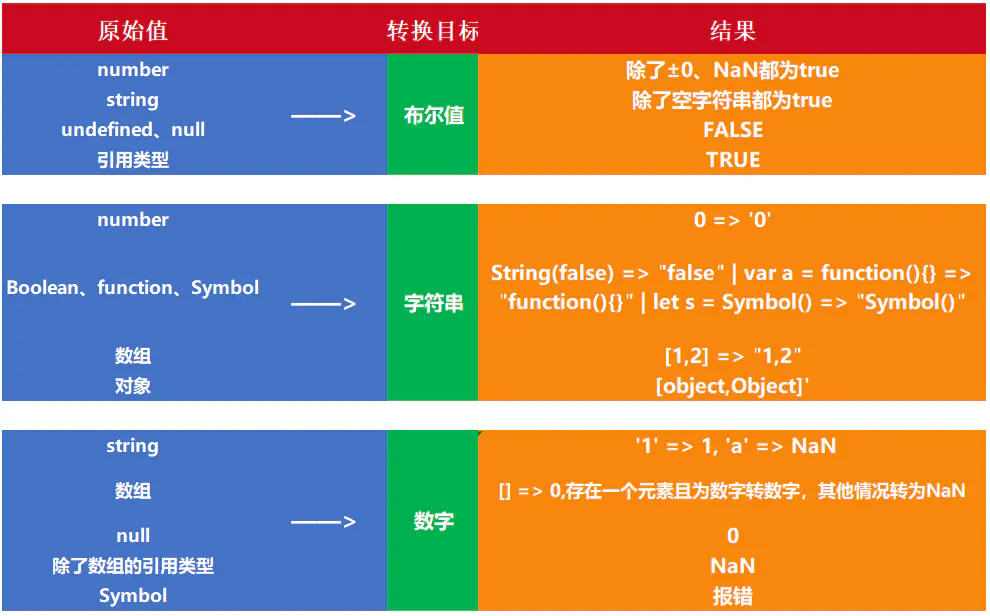
此外还有一些操作符会存在隐式转换，不做展开。

## 0.1+0.2为什么不等于0.3？

- 一句话：部分浮点数转二进制时因为标准位数的限制丢失了精度，计算完再转回十进制时和理论结果不同。
  - 0.1和0.2在转换成二进制后会无限循环，由于标准位数的限制后面多余的位数会被截掉，四舍五入，出现了精度的损失。
  - 相加后再转换为十进制就会变成0.30000000000000004。

- JS 的 Number 类型遵循的是 IEEE 754 标准，使用的是双精度浮点数，用64 位长度来表示【符号位(1)+指数(11)+尾数(52)】
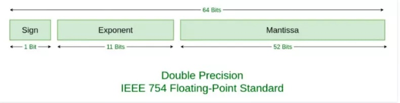

- 计算过程
  - 转换过程：0.1 > 二进制 > 科学计数法 > IEEE 754(指数和小数分开表示) > 十进制(精度可能丢失)
  - 指数偏移的计算：双浮点固定偏移值 [2^(11-1)]-1 = 1023 加上 科学计数法的指数[如-4] 再转为11位的二进制表示。
  - 尾数计算：科学计数法的小数位选取52位，四舍五入。
  ```
  小数转为二进制：小数部分，乘以 2，然后取整数部分的结果(最后组合起来)，再用计算后的小数部分继续乘以 2，直到小数部分为 0。
  指数偏移：1023+(-4) = 1019 -> 011 1111 1011(二进制)
  尾数计算：1.10011001...(无限重复 1001) * 2^-4
  最终0.1的表示为：
    0          011 1111 1011      1001...( 11 x 1001)...1010
    (Sign)     (Exponent)         (Mantissa)
    (符号位)   (指数偏移的二进制)  (尾数：科学计数法后的小数位,选取52位)
  ```
  - 请注意选取52位中的最后四位，是 1010 而不是 1001，因为四舍五入有进位，这个进位就是造成 0.1 + 0.2 不等于 0.3 的原因，已经丢失精度。
  - 结果 0.1 + 0.2 = 0.30000000000000004


## 原型、原型链、继承
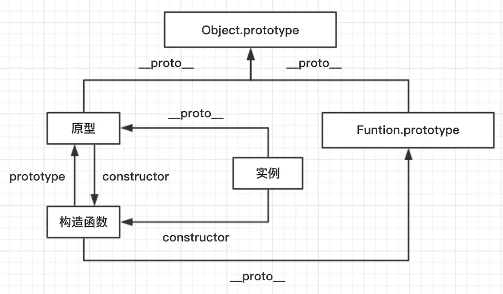

- 原型：用来实现对象的属性继承的对象（instance的`__proto__`）（构造函数的prototype）
- 构造函数：通过new新建一个对象的函数（instance.constructor）（原型的constructor）
- 实例：通过new 和构造函数创建的对象
- 原型链：每个对象都有`__proto__`属性， 指向该对象构造函数的原型，`__proto__`属性 将对象连接起来组成原型链。
  - 查找：一个对象的属性不存在，沿着原型链上一级查找，找到就输出，找不到继续找，直到顶级的原型对象Object.prototype，没找到就输出undefined。
  - 修改：只会修改实例本身的属性，不存在则添加该属性。修改原型属性时，可以b.prototype.x=1，继承该对象的属性都会改变。
  - 关系：instance（实例）.constructor.prototype = instance（实例）的`__proto__`
  - 例子：const instance = new Object() //instance为实例，Object为构造函数，Object.prototype为原型
- 继承
  - 借助构造函数
      - 父类构造函数在子类执行，this指向子类构造函数的实例
      - 缺点：只能继承属性，无法继承父类的原型上的方法
  - 借助原型链
      - 使用父类的实例，作为子类构造函数的prototype
      - 缺点：父类生成的实例属性如果是引用类型(也就是子类原型对象上有引用类型)，则会被子类生成的每个实例共享，改动引用类型的属性会影响其他实例。
  - 组合：构造+原型链
      - 通过构造函数继承属性，通过原型链继承方法，保证每个子类的实例有自己的父类属性副本，而且可以通过原型链复用方法。
      - 缺点：执行了两次父类构造函数
  - 寄生组合式
      - 通过构造函数继承属性，通过原形链继承方法，创造一个父类原型的副本作为子类构造函数的原型【Object.create(Parent.prototype)+子类构造函数Child.prototype.constructor = Child】。
      - 解决：组合式中无法区分是父类创造还是子类创造出来的对象，因为instanceof都为true
      - 实现：创建的中间对象以父类的原型作为原型对象，中间对象又是子类的原型对象，形成原型链
      - 由于共用一个原型对象【Child.prototype = Parent.prototype】，子类无自己构造函数，向上找构造函数是Parent，所以用Object.create隔离开原型
      - 使父类原型对象和子类原型对象不再是同一个，而是增加一级，然后再给子类添加自己的构造函数
      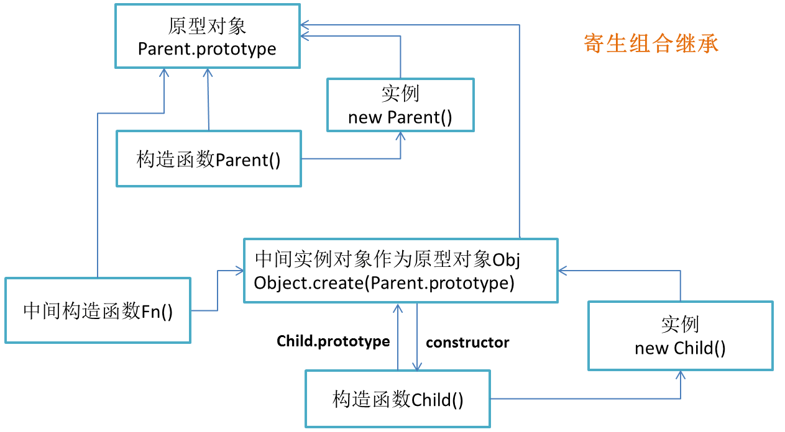


- Object.create(obj)
  - 生成一个新对象，新对象的`__proto__`为参数obj
  - 过程创建一个新的构造函数，它的prototype指向参数obj，再返回这个构造函数的实例，也就是新对象。
  ```js
  function create(obj) {
    function F() {}
    F.prototype = obj;
    return new F();
  }
  ```

- 在创建新的对象或者类时，方法通常应该关联于对象的原型，而不是定义到对象的构造器中。
  - 原因是这将导致每次构造器被调用时，方法都会被重新赋值一次（也就是说，对于每个对象的创建，方法都会被重新赋值）。

- 创建对象
  - 1、字面量（简洁性能好）
  - 2、构造函数（要调用函数）
  - 3、Object.create

- 获取指定对象的原型（内部`[[Prototype]]`属性的值）
  - `obj.__proto__`
  - `obj.constructor.prototype`
  - `Object.getPrototypeOf(obj)`
```js
var reg = /a/;
reg.__proto__ === RegExp.prototype
reg.constructor.prototype === RegExp.prototype
Object.getPrototypeOf(reg) === RegExp.prototype; // true

var proto = {};
var obj = Object.create(proto);
Object.getPrototypeOf(obj) === proto; // true
```

## 作用域、作用域链
- 作用域：代码中定义变量的区域，确定当前执行代码对变量的访问权限范围。可以看做一个封闭空间。
- 作用域链和变量查找(只能下往上查找，不能由上往下，找到就停止，不会继续向上找)
    - 当查找变量的时候，会先从**当前上下文（作用域）的变量对象**中查找，如果没有找到，就会从父级(词法层面上的父级)执行上下文的变量对象中查找，一直找到全局上下文的变量对象，也就是全局对象。这样由多个执行上下文的变量对象构成的链表就叫做作用域链。
- JavaScript 采用静态(词法)作用域：函数作用域在函数定义时决定的，基于函数创建的位置。
- 执行上下文栈：执行一个函数的时候，就会创建一个执行上下文，并且压入执行上下文栈，当函数执行完毕的时候，就会将函数的执行上下文从栈中弹出，底部有globalContext全局上下文。
- 执行上下文（作用域）：(全局上下文、函数上下文)
    - 属性
        - 变量对象VO：存储上下文中定义的变量和函数声明，未进入执行阶段不能访问，叫VO，进入执行阶段，可访问，叫AO。
        - 作用域链
        - this
    - 全局上下文
        - 变量对象：全局对象window，由Object实例化的对象
    -  函数上下文
        - 变量(活动)对象AO：进入上下文被创建激活，属性可被访问(函数的形参、函数声明、变量声明)
    - **变量对象的两个阶段**
        - 分析(进入执行上下文): 创建AO(函数的形参、函数声明、变量声明)**，优先处理函数声明，如果变量名称与函数相同，不影响已存在函数。**
        - 执行(代码执行) :  按顺序执行，修改AO对象的值
    - **作用域链的两个阶段**(只能下往上查找，不能由上往下)
        - 每一个子函数都会拷贝上级的作用域（保存变量对象），形成一个作用域的链条
        - 函数创建时：内部属性 [[scope]]会保存所有父变量对象进去(父变量对象的层级链)
        ```
         bar.[[scope]] = [
                fooContext.AO,
                globalContext.VO
            ];
        ```    
        - 函数激活时：将自身AO添加到作用域头部，构成完整作用域链
        ```
        Scope = [AO].concat([[Scope]]);
        ```
- 函数执行上下文的变量对象和作用域创建全过程：
    - **保存父级作用域-创建变量(形参/函数/变量)-压入作用域头部-修改变量-弹出执行栈**
    - 函数定义，保存整个父级作用域(变量对象)到函数的内部属性[[scope]]
    - 函数准备执行，创建上下文，压入执行栈
    - 准备工作1：Scope:[[scope]]创建整个作用域，先将父级作用域存入，进入上下文
    - 准备工作2：arguments 创建AO进行初始化，加入形参、函数声明、变量声明
    - 准备工作3：AO压入作用域头部Scope:[AO, [[Scope]]]
    - 开始执行：修改AO属性值
    - 执行完毕：弹出上下文栈
- 变量提升
    - 概念：JS引擎解析代码，获取所有声明的变量，再一行一行运行。所有变量声明都会提升到代码头部。
    - 例子： 引擎将var a = 1拆解为var a = undefined和 a = 1，并将var a = undefined放到最顶端，a = 1还在原来的位置
        ```js
            var a = undefined // (声明提到代码头部)
            console.log(a) // undefined
            
            a = 1 // (原)var a = 1
            
            function b() {
                console.log(a)
            }
            b() // 1
        ```
    - 因为js是预解析创建执行上下文包括变量对象和函数参数，然后再执行代码。
        - 扫描函数，若有函数声明，【名称和对应值（函数对象(function-object)）】存入变量对象，同名函数会被覆盖。
        - 扫描变量，若有变量声明，【名称和对应值（undefined）】存入变量对象，同名变量会被覆盖。
        - 若变量和函数或形参同名，则不干扰前面已存在的。函数或形参优先。
        ```js
        console.log(foo);
        function foo(){
            console.log("foo");
        }
        var foo = 1;
        // ƒ foo(){
        //  console.log("foo");
        // }
        ```
        - 执行赋值或打印时，在当前作用域找是否有该变量，若存在，则使用，不存在则向上作用域寻找。
        - 函数的两种情况：函数声明为函数，所以函数声明是可以先在前面访问到。但函数表达式相当于变量，会被提升为undefined，所以用函数表达式后提前访问会出错。
        ```js
        foo();
        console.log(joe);
        joe();
        function foo(){
            console.log("foo");
        }

        var joe = function(){
            console.log("joe");
        };
        // foo
        // undefined
        // Uncaught TypeError: joe is not a function
        ```
        - 同名冲突处理：
            - 变量和变量：后者覆盖前者
            - 函数和函数：后者覆盖前者
            - 变量和函数：函数声明将覆盖变量声明
    - ES6中的let与const，阻止了变量提升，未声明就使用会报未定义的错。
    - 作用域分全局作用域、函数作用域、es6使用let/const创建的块级作用域，作用域链里的变量对象是一层一层push的，可以往上查找，但外层访问不到内层的作用域变量对象。而变量提升都是在自己的作用域头部，例如全局作用域 or 函数作用域的头部。
        
- [知乎解释](https://zhuanlan.zhihu.com/p/26533735)


## new运算符的实现
- new Object()创建新的对象obj。
- obj的`__proto__`链接到构造函数的原型`fn.prototype`。
- 执行构造函数，用apply使this指向新建的对象`fn.apply(obj, [...arguments].slice(1))`。
- 构造函数执行完若有返回引用类型的值，则返回该对象res，返回非引用类型的值，则忽略。
- 执行完无返回，则返回创建的对象obj。


## this和call、apply、bind
- 非箭头函数
    - 执行时才确定this指向
    - 默认情况下，this是指向全局对象的，浏览器就是指向window
    - 隐式绑定：this指向最后调用它的那个对象（注意，如果不是通过对象调用方法，而是直接函数执行，一般都是默认window对象）
    ```js
    var name = "windowsName";
    var a = {
        name: "Joe",
        fn : function () {
            console.log(this.name);      // Joe
        }
    }
    window.a.fn();
    ```
    - 显示绑定：call、apply、bind
    - new绑定：this指向通过new 构造函数生成的新对象
    - 优先级：new绑定 > 显式绑定 >隐式绑定 >默认绑定
- 箭头函数
    - this 始终指向函数定义时的 this，而非执行时
    - 没有自己的this，通过作用域链决定this
    - 被非箭头函数包裹，则为最近的非箭头函数的this，否则为undefined
- 匿名函数： this 永远指向 window，一般匿名函数后面加 () 让其自执行，可以给其他函数调用。

- 改变this的方法（call、apply、bind）
    - 1、ES6箭头函数（定义时的this ）
    - 2、函数内部使用 var _this = this
    - 3、call、apply、bind
        - call: fn.call(target, 1, 2)
        - apply: fn.apply(target, [1, 2])
        - bind: fn.bind(target，1，2)()
        - apply第二个参数是数组（或类数组），call和bind后面都是接单个参数
        - call和apply默认会自动执行函数，bind需要在后面加()来自动执行
        - call比apply的性能要好，使用扩展运算符let params = [1,2,3,4] ；xx.call(obj, ...params)
    - 每个函数都包含call、apply、bind，设置函数内this对象的指向，改变函数的执行环境。默认是传的this是window对象。bind是创建一个函数实例，改变this指向后，新建的那个函数即使在全局作用域调用，也是指向改变后的那个this。
    - 作用是扩充作用域，可以直接通过call那个对象，让this指向该对象。不用把方法放在一个对象中，再通过这个对象去调用里面的方法。
    ```js
    window.color="red";
    var o = { color: "blue"};
    function sayColor() {
        alert(this.color);
    }
    sayColor();             // red  隐式在全局作用域window调用该函数，this指向window
    
    sayColor.call(this);    // red  显式在全局作用域window调用该函数
    sayColor.call(window);  // red  显式在全局作用域window调用该函数
    sayColor.call(o);       // blue 执行环境改变，this指向o
    ```
    箭头函数：
    ```js
      var name = "windowsName";
      var a = {
          name : "Joe",
          func1: function () {
              console.log(this.name)     
          },
          func2: function () {
              setTimeout( () => {
                  this.func1()
              },100);
          }
      };
      a.func2()     // Joe
    ```
    var _this = this：为了防止在 func2 中的 setTimeout 被 window 调用而导致的在 setTimeout 中的 this 为 window。
    ```js
        var name = "windowsName";
        var a = {
            name : "Joe",
            func1: function () {
                console.log(this.name)     
            },
            func2: function () {
                var _this = this;
                setTimeout( function() {
                    _this.func1()
                },100);
            }
        };
        a.func2()       // Joe
    ```
    this和作用域的区别
    ```js
    // 作用域 -> 查找当前作用域有该变量，直接用
    var name = 'global';
    function a() {
        var name = 'joe';
        console.log(name);
    }
    a(); // joe

    // 作用域 -> 查找当前作用域没有该变量，向上查找
    var name = 'global';
    function a() {
        console.log(name);
    }
    a(); // global

    // this指向 -> 指向调用它的环境this，这里其实是全局window.a()
    var name = 'global';
    function a() {
        var name = 'joe';
        console.log(this.name);
    }
    a(); // global

    ```

## 数组
- 切割推入排序
    - slice(start, end): 返回选中的数据组成的新数组（从start到end），不改变原数组
    - splice(start, number, value...): 返回删除元素组成的数组，**改变原数组**，由value 替换被删除的位置
    - push / pop: 末尾推入/弹出，**改变原数组**， 返回推入/弹出项，一般可用作栈实现。
    - unshift / shift: 头部推入/弹出，**改变原数组**，返回新的长度/操作项
    - sort(fn) / reverse: 排序与反转，**改变原数组**，**不传入对比函数，元素按照转换为的字符串的各个字符的Unicode位点进行排序（从小到大）。**
- 连接数组
    - concat(不改变原数组，浅拷贝)
- 转字符串
    - join(不改变原数组，可传入连接符)
- 迭代方法
    - forEach((value元素,index索引,arr) => {})：数组每一项做一件事，回调函数返回 undefined 值
    - map：每项通过某种计算返回值 回调函数每次的返回值 最后组成一个新数组，如果不想返回新数组，最好推荐forEach或者for-of替代。
    - filter：符合条件的项生成新数组
    - reduce(fn(pre, next){ })：前后值通过计算，累计返回最后的值
    - every：每项都符合条件返回true
    - some：某项符合条件就true
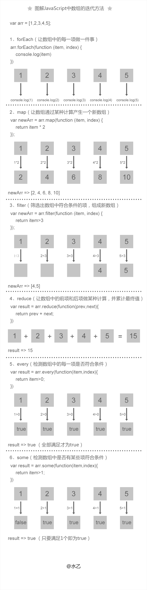

- 去重
    - [...new Set(arr)]
- 拍平
    - arr.flat(Infinity)  //Infinity 参数表示拍平所有层级，默认为1 会移除空项
- 去重拍平排序

```js
[...new Set(arr.flat(Infinity))]
.sort((a,b)=>{ return a-b})
```
- 判断数组是否有某个值：【indexOf()、includes()、find()、findIndex()】
```js
var arr=[1,2,3,4];
var index=arr.indexOf(3); //不存在返回-1
if(arr.indexOf(3)!== -1) {console.log("存在")} //判断不为-1，才存在
if(arr.indexOf(3)) //注意这样判断不对，if(-1)为真 if(0)为假

if(arr.includes(3)){ console.log("存在")} //存在返回true

var result = arr.find(item => {
    return item > 3
}) //返回数组中满足条件的第一个元素值，没有返回undefined

var result = arr.findIndex(item =>{
    return item > 3
}); //返回数组中满足条件的第一个元素的下标，没有返回-1
```

- 判断是否为数组
    - 1、Object 的对象都有 toString方法，没有重写则返回 [Object type]，由于除了Object外，其他类型使用toString会变为字符串，所以需要call改变上下文，调用原型上的toString方法
    - 2、判断原型链上是否有该Array的原型prototype，只能判断对象，原始类型不可以
    - 3、Array.isArray()是ES5新增的方法，当不存在 Array.isArray() ，可以用 Object.prototype.toString.call() 实现。

    ```js
    1.  Object.prototype.toString.call(arr) //"[object Array]"
    
    2.  [] instanceof Array; // true
    
    3.  Array.isArray(arr) // true
    ```

## JS中的遍历、枚举

- 标准for循环
    - 需要维护【下标i和边界length】
- forEach
    - 【无法中止循环】数组太大时，无法在特定条件下`break/continue/return`退出遍历，造成资源浪费。
- for in
    - 普遍使用，兼容性好，支持`break/continue/return`
    - 遍历对象【自身+继承】的可枚举(enumerable:true)的属性（不含 Symbol 属性）。
    - 若不想获取继承的属性，可多加判断`if(obj.hasOwnProperty(key)) {...}`，不想某些原型属性被遍历，可在原型属性设置(enumerable:false)
- for of(推荐)
    - 简洁，支持`break/continue/return`，需要ES6以上，兼容性一般
    - 依赖对象遍历器Iterator的遍历，每次执行遍历器的next方法
    - 大多数JavaScript的内置对象都支持迭代，例如：Array、Set、Map、String、函数的 arguments 、NodeList等
    - 普通对象(自己创建对象)不能直接使用`for...of`，需要配合`Object.keys()`
    - entries()返回一个遍历器对象，用来遍历[键名, 键值]组成的数组。对于数组，键名就是索引值；对于 Set，键名与键值相同。
    - keys() 返回一个遍历器对象，用来遍历所有的键名。
    - values() 返回一个遍历器对象，用来遍历所有的键值。
   
    ```js
    // for...in循环读取键名，for...of循环默认读取键值(对于Map结构默认为entries())。
    let arr = ['a', 'b', 'c'];
    for (let item in arr) {
      console.log(item);
    }
    // '0'
    // '1'
    // '2'
    
    for (let item of arr) {
      console.log(item);
    }
    // 'a'
    // 'b'
    // 'c'
    
    // 使用entries()返回遍历对象
    let arr = ['a', 'b', 'c'];
    for (let item of arr.entries()) {
      console.log(item);
    }
    // [ 0, 'a' ]
    // [ 1, 'b' ]
    // [ 2, 'c' ]
    
    // 使用解构，方便读取值
    let arr = ['a', 'b', 'c'];
    for (let [key, value] of arr.entries()) {
      console.log(key, value);
    }
    // 0 'a'
    // 1 'b'
    // 2 'c'
    
    // 下面是类数组对象具备遍历器接口
    // 并不是所有类似数组的对象都具有 Iterator 接口，可以先使用Array.from方法将其转为数组。
    
    // 字符串
    let str = "hello";
    for (let s of str) {
      console.log(s); // h e l l o
    }
    
    // arguments对象
    function printArgs() {
      for (let x of arguments) {
        console.log(x);
      }
    }
    printArgs('a', 'b');
    // 'a'
    // 'b'
    
    // 自定义类数组对象
    let arrayLike = { length: 2, 0: 'a', 1: 'b' };
    for (let x of Array.from(arrayLike)) {
      console.log(x);
    }
    // 'a'
    // 'b'
    ```
- Object.keys()
    - ES5，兼容好，返回值顺序不定，对顺序有需求，使用map结构或set集合,按成员被添加进时的顺序。
    - 获取对象本身的可枚举属性的键名（不包括继承属性）
    ```js
      let joe = {
        name:'joe',
        age:25,
      }
      for (let key of Object.keys(joe)) {
          console.log(key + ': ' + joe[key]);
       }
    ```
- 属性遍历
    - 从该属性的描述对象，看可枚举性enumerable
        ```js
        let obj = { foo: 123 };
        Object.getOwnPropertyDescriptor(obj, 'foo')
        //  {
        //    value: 123,
        //    writable: true,
        //    enumerable: true,
        //    configurable: true
        //  }
        ```
    - `for...in`【自身+继承+可枚举（不含Symbol）】
    - `Object.keys(obj)`【自身+可枚举（不含Symbol）】
    - `Object.getOwnPropertyNames(obj)`【自身+可枚举+不可枚举（不含Symbol）】
    - `Object.getOwnPropertySymbols(obj)`【自身Symbol属性的键名】
    - `Reflect.ownKeys(obj)`【自身+可枚举+不可枚举+Symbol属性的键名】

## 类数组对象
- 概念：JS中，对于一个普通的对象来说，如果它的所有键名均为正整数（由0开始1、2...），同时拥有length属性，则为“类数组对象”。
- 例子：(函数中的) arguments /  (querySelector获得的) nodeList
- 转为数组：类数组 -> 数组
    - ES5
        ```js
        let args = [].slice.call(arguments);
        let args = [].splice.call(arguments,0);
        let args = [].concat.apply([],arguments);
        let args =  Array.prototype.slice.call(arguments) //使用Array.prototype原型上的方法也可以
        ```
    - ES6
        ```js
        let args = Array.from(arguments)  // ES6 的Array.from()
        let args = [...arguments]         // ES6展开运算符
        ```

- 剩余参数和 arguments对象的区别
  - 剩余参数只包含那些没有对应形参的实参，而 arguments 对象包含了传给函数的所有实参。
  - arguments对象不是一个真正的数组，而剩余参数是真正的 Array实例，也就是说你能够在它上面直接使用所有的数组方法，比如 sort，map，forEach或pop。

```js
function sortRestArgs(...theArgs) {
  var sortedArgs = theArgs.sort();
  return sortedArgs;
}
alert(sortRestArgs(5,3,7,1)); // 弹出 1,3,5,7

// 为了在arguments对象上使用Array方法，它必须首先被转换为一个真正的数组。
function sortArguments() {
  var args = Array.prototype.slice.call(arguments);
  var sortedArgs = args.sort();
  return sortedArgs;
}
console.log(sortArguments(5, 3, 7, 1)); // shows 1, 3, 5, 7
```

## ES6
- [ES6-掘金参考](https://juejin.im/post/5d9bf530518825427b27639d#heading-7)
- 块级作用域(let,const)、（ 块级作用域、不存在变量提升、不允许重复声明、const常量）
- 提供了定义类的语法糖(class)、类引入导出和继承( class/import/export/extends)
- 一种基本数据类型(Symbol)
- 变量的解构赋值:`const arr = [1, 2, 3, 4]; const [first, second] = arr;`
- 函数参数允许设置默认值，引入了rest参数，新增了箭头函数
- 数组新增了一些API，如 isArray / from / of 方法;数组实例新增了 entries()，keys() 和 values() 等方法
- 对象和数组新增了扩展运算符
- 模块化(import/export)
-  Set 和 Map 数据结构
- Promise的使用与实现
- generator:
    - yield: 暂停代码
    - next(): 继续执行代码
- ES8（ES2017） 提供的 Async/Await 语法糖
- let、const、var 的区别有哪些？
    -  1、let/const 定义的变量不会出现变量提升（暂存死区，不可访问），而 var 定义的变量会提升。（没var关键字的变量总是全局）
    -  2、let、const 创建块级作用域, 该变量处于从块开始到初始化处理的“暂存死区”。未声明就提前使用会报错ReferenceError。
    -  3、相同作用域中，let 和 const 不允许重复声明，var 允许重复声明。
    -  4、const 声明只读的常量 (即指针)，必须设置初始值（基本数据不可改变值，引用值可以），只声明不赋值会报错。

    >  const常量的本质：JS中复杂数据存在栈是堆的内存地址，堆里的值可以改变，但是堆内存的地址不可变。

    > 暂时性死区的本质：只要一进入当前作用域，所要使用的变量就已经存在了，但是不可获取，只有等到声明变量后，才可以获取和使用该变量。
    
- 箭头函数
    - 箭头函数不属于普通的 function，所以没有独立的上下文。
    - 箭头函数是普通函数的简写，可以更优雅的定义一个函数，和普通函数相比，有以下几点差异：
        - 1、函数体内的 this 对象，就是定义时所在的对象，而不是使用时所在的对象。
        - 2、没有隐藏的arguments 对象。可以用 rest 参数代替。
        - 3、不可以使用 yield 命令，因此箭头函数不能用作 Generator 函数。
        - 4、不可以使用 new 命令，因为：没有自己的 this，无法调用 call，apply，bind。
    - 在以下场景中不要使用箭头函数去定义：
        - 定义对象方法、定义原型方法、定义构造函数、定义事件回调函数。
    - 箭头函数写法：
        - 有括号记得加return，否则出问题。
        - 没括号才可以省略return。
        ```js
        // 当箭头函数只有一个参数时，可以省略参数的圆括号
        elements.map(element => {
         return element.length;
        });
        
        // 当箭头函数的函数体只有一个 `return` 语句时，可以省略 `return` 关键字和方法体的花括号
        elements.map(element => element.length);
        ```

- 扩展运算符
  - 和concat一样属于浅拷贝
```js
//复制数组
const a1 = [1,2]
const a2 = [...a1] 
//合并数组
const arr1 = ['a', 'b'];
const arr2 = ['c'];
const arr3 = ['d', 'e'];
[...arr1, ...arr2, ...arr3] // [ 'a', 'b', 'c', 'd', 'e' ]
//解构赋值
const [first, ...rest] = [1, 2, 3, 4, 5];
first // 1
rest  // [2, 3, 4, 5]
//字符串
[...'joe'] //["j", "o", "e"]

```

## Map、Set、WeakMap、WeakSet

- Set
    - 成员唯一，没有重复值
        - 判断重复值类似`===`，区别是NaN也会被Set认为相等
        - 添加值时不会发生类型转换(`5 !== "5"`)
        - 两个对象总是不相等的
    - 用法：`const set = new Set(arr)`
    - 接受参数：数组或具有iterable接口可迭代的数据结构（如类数组对象）
    - 常用
        - 数组去重
            ```js
            [...new Set(array)]
            // 或者
            Array.from(new Set(arr))
            ```
        - 字符串去重
            ```js
            [...new Set('ababbc')].join('')
            ```
        - 实现并集、交集、差集
            ```js
            let a = new Set([1, 2, 3]);
            let b = new Set([4, 3, 2]);
            
            // 并集
            let union = new Set([...a, ...b]);
            // Set {1, 2, 3, 4}
            
            // 交集
            let intersect = new Set([...a].filter(x => b.has(x)));
            // Set {2, 3}
            
            // 差集
            let difference = new Set([...a].filter(x => !b.has(x)));
            // Set {1}
            ```
        - 遍历改变原有set结构，先映射，再赋值回原有set
            ```js
            // 方法一
            let set = new Set([1, 2, 3]);
            set = new Set([...set].map(val => val * 2));
            // set的值是2, 4, 6
            
            // 方法二
            let set = new Set([1, 2, 3]);
            set = new Set(Array.from(set, val => val * 2));
            // set的值是2, 4, 6
            ```
    - 实例属性和方法       
        - 属性
            - constructor：构造函数，返回Set函数
            - size：返回实例成员总数
        - 方法
            - add(value)：添加值，返回整个Set
            - delete(value)：删除值，返回布尔
            - has(value)：检查值，返回布尔
            - clear()：清除所有成员，无返回值
            - // 遍历相关方法 ：顺序就是插入顺序（比如保存回调函数列表，按顺序调用）
            - keys()：返回键名的遍历器
            - values()：返回键值的遍历器
            - entries()：返回键值对的遍历器
            - forEach()：使用回调函数遍历每个成员
- WeakSet：弱引用
    - 场景：适合临时存放一组对象：只要这些对象在外部消失，它在WeakSet结构中的引用就会自动消失
    - 示例：WeakSet 中的对象都是弱引用，避免内存泄露，如储存 DOM 节点，而不用担心这些节点从文档移除时，会引发内存泄漏。垃圾回收机制不考虑 WeakSet
    - 规则1：WeakSet 的成员只能是对象
    - 规则2：WeakSet **不可遍历**（成员可能随时消失）
    - 原理：WeakSet对该对象的引用，如果其他对象都不再引用该对象，那么垃圾回收机制会自动回收该对象所占用的内存，不考虑该对象还存在于 WeakSet 之中。
    - 用法：`const set = new WeakSet(arr)`
    - 属性
        - constructor：构造函数，返回WeakSet函数
    - 方法
        - add()：添加值，返回实例
        - delete()：删除值，返回布尔
        - has()：检查值，返回布尔
- Map
    - 传统的对象只能用字符串做键名，Map不限于字符串，可以包括对象或其他类型（包括函数）。
    - 简单类型（数字、字符串、布尔值），如果符合`===`，就为同个键（特殊情况NaN,在Map也是同一个键）
    - 如果是对象（包括数组），Map 的键实际上是跟内存地址绑定的，只要内存地址不一样，即使同名同值，也视为两个键。解决扩展库的同名属性冲突问题
    - 用法：`const map = new Map(arr)` //双元素数组的数据结构, Set和Map都可以用来生成新的 Map。
        ```js
        // 数组
        const map = new Map([
          ['name', '张三'],
          ['title', 'Author']
        ]);
        map.get('name') // "张三"
        
        // Set入参
        const set = new Set([
          ['foo', 1],
          ['bar', 2]
        ]);
        const m1 = new Map(set);
        m1.get('foo') // 1
        
        // Map入参
        const m2 = new Map([['baz', 3]]);
        const m3 = new Map(m2);
        m3.get('baz') // 3
        ```
    - 属性
        - constructor：构造函数，返回Map函数
        - size：返回成员总数
    - 方法
        - set(key,value)：添加键名为key，对应键值为value，若已存在则更新键值，返回整个Map对象，可链式set
        - get(key)：读取key对应的键值，找不到key，返回undefined
        - has(key)：返回布尔值，表示某个键名是否在当前Map对象中
        - delete(key)：删除值，返回布尔，失败返回false
        - clear()：清除所有成员，无返回值
        - 遍历相关方法：遍历顺序就是插入顺序
        - keys()：返回键名的遍历器。
        - values()：返回键值的遍历器。
        - entries()：返回所有成员的遍历器。
        - forEach()：遍历 Map 的所有成员。
            ```js
            const map = new Map([
              ['F', 'no'],
              ['T',  'yes'],
            ]);
            
            for (let key of map.keys()) {
              console.log(key);
            }
            // "F"
            // "T"
            
            for (let value of map.values()) {
              console.log(value);
            }
            // "no"
            // "yes"
            
            for (let item of map.entries()) {
              console.log(item[0], item[1]);
            }
            // "F" "no"
            // "T" "yes"
            
            // 或者
            for (let [key, value] of map.entries()) {
              console.log(key, value);
            }
            // "F" "no"
            // "T" "yes"
            
            // 等同于使用map.entries()
            for (let [key, value] of map) {
              console.log(key, value);
            }
            // "F" "no"
            // "T" "yes"
            ```
    - Map转为数组结构：扩展运算符
        ```js
        const map = new Map([
          [1, 'one'],
          [2, 'two'],
          [3, 'three'],
        ]);
        [...map.keys()]
        // [1, 2, 3]
        
        [...map.values()]
        // ['one', 'two', 'three']
        
        [...map.entries()]
        // [[1,'one'], [2, 'two'], [3, 'three']]
        
        [...map]
        // [[1,'one'], [2, 'two'], [3, 'three']]
        ```
    - 数组转为Map：传入Map构造函数
        ```js
        new Map([
          [true, 7],
          [{foo: 3}, ['abc']]
        ])
        // Map {
        //   true => 7,
        //   Object {foo: 3} => ['abc']
        // }
        ```
    - Map转为对象：遍历给obj赋值（前提是Map键名都是字符串）
        ```js
        function strMapToObj(strMap) {
          let obj = Object.create(null);
          for (let [k,v] of strMap) {
            obj[k] = v;
          }
          return obj;
        }
        ```
    - 对象转为Map：`Object.entries()`
        ```js
        let obj = {"a":1, "b":2};
        let map = new Map(Object.entries(obj));
        ```
- WeakMap：弱引用
    - 场景：键名可能会消失时，防止内存泄漏
    - 示例1：存储DOM节点，DOM节点被移除释放该成员，不会引发内存泄漏
    - 示例2：部署私有属性，类的内部属性是实例的弱引用，删除实例时它们也随之消失，不会造成内存泄漏
    - 用法：`const map = new WeakMap(arr)`
    - 规则1：WeakMap的键名只接受对象作为键名（null除外）
    - 规则2：WeakMap不可遍历
    - WeakMap的**键名所指向的对象，是弱引用**，不计入垃圾回收机制。键名对应的对象其他引用清除，WeakMap 里面的键名对象和所对应的键值对会自动消失，不用手动删除引用。但键值是正常引用，如果外部消除对键值的引用，内部依然会存在对键值的引用。
    - 属性
        - constructor：构造函数，返回WeakMap函数
    - 方法
        - set(key,value)：添加键名为key，对应键值为value，若已存在则更新键值，返回整个WeakMap对象，可链式set
        - get(key)：读取key对应的键值，找不到key，返回undefined
        - has(key)：返回布尔值，表示某个键名是否在当前WeakMap对象中
        - delete()：删除键值对，返回布尔
        - 无遍历方法、无清空（即没有keys()、values()和entries()、clear()方法）
- Map/Set、WeakMap，什么作用【描述】
    - Map可以用对象做key，重复的话更新键值，Set是用作保证值不重复的集合。WeakSet的值、WeakMap的键名都必须是对象，且它们是弱引用，可以防止内存泄露。

- 弱引用和强引用
  - 一个对象若只被弱引用所引用，不可访问（或弱可访问），可能在任何时刻被回收。
  - 可用于深拷贝中，当拷贝对象非常大时，使用Map造成内存消耗，需要手动清除Map 的属性。使用WeakMap可以成为弱引用，引用的对象释放后，拷贝的属性就会自动释放。
  - 如使用Map，对象间是存在强引用关系，手动释放obj，map对obj存在强引用，无法释放该内存。
  ```js
  let obj = { name : 'Joe'}
  const map = new Map();
  map.set(obj,'Joo');
  obj = null;
  ```
  - 使用WeakMap，weak对obj存在弱引用，下一次垃圾回收时，该内存会被释放。
  ```js
  let obj = { name : 'Joe'}
  const weak = new WeakMap();
  weak.set(obj,'Joo');
  obj = null;
  ```


## JS代码执行过程
- JS 引擎首先创建一个执行栈
- JS引擎会创建一个全局执行上下文，并push到执行栈中，所有变量分配内存并赋一个初始值（undefined）
- JS引擎会进入执行阶段，这个过程JS引擎会逐行的执行代码，即为之前分配好内存的变量逐个赋值(真实值)。
- 函数：如果这段代码中存在function的声明和调用，那么JS引擎会创建一个函数执行上下文，并push到执行栈中。
- 闭包：当函数中存在对其它函数的调用时，JS引擎会在父函数执行的过程中，将子函数的全局执行上下文push到执行栈。
- 当子函数执行的过程中，父函数已经return了，JS引擎会将父函数的上下文从执行栈中移除，与此同时，JS引擎会为还在执行的子函数上下文创建一个闭包，这个闭包里保存了父函数内声明的变量及其赋值，子函数仍然能够在其上下文中访问并使用这边变量/常量。当子函数执行完毕，JS引擎才会将子函数的上下文及闭包一并从执行栈中移除。
- 异步：JS引擎是单线程的，当代码中存在异步调用时，比如setTimeout或ajax请求都是非阻塞(non-blocking)的，执行到异步任务，JS引擎会将需要异步执行的代码移出调用栈，等到有返回结果时，JS引擎会立即将回调函数push进任务队列中等待被调用，当监视进程检查到执行栈中已经为空时，JS引擎会立刻将任务队列中的回调函数逐个push进调用栈并执行。这个过程我们也称之为事件循环。

## 浏览器事件循环(Event Loop)
-  浏览器多进程的，进程表示cpu资源分配的最小单位，一个进程中可以有多个线程
-  关键为**渲染进程**（浏览器内核）分为多条线程，线程是cpu调度最小单位
    - GUI渲染线程
    - JS引擎线程
    - 事件触发线程
    - 定时触发器线程
    - 异步http请求线程
-  浏览器设定 GUI渲染线程和JS引擎线程为互斥关系（同时运行会导致不一致）

- javascript是一门单线程语言（如果多线程操作，dom无法预期），Event Loop是js实现异步的一种方法，也是js的执行机制。

- **事件循环(宏任务和微任务角度)**
    - 整体代码作为第一次宏任务，进入主线程
    - 遇到宏任务，指定事情完成后，将回调函数被分发到宏任务队列Event Queue
    - 遇到微任务，指定事情完成后，将回调函数被分发到微任务队列Event Queue
    - 第一轮宏任务执行完毕，寻找微任务队列的任务并执行所有微任务。
    - 微任务执行过程中产生新的微任务，继续执行微任务
    - 微任务执行完毕后，GUI线程接管渲染，更新界面
    - 检查是否存在 Web worker 任务，有则处理
    - 执行第二轮宏任务Event Queue（每次只读取一个宏任务）
    - 循环反复下去
    - 注意：一次循环中，微任务是全部清空、宏任务是只取一个出来。
    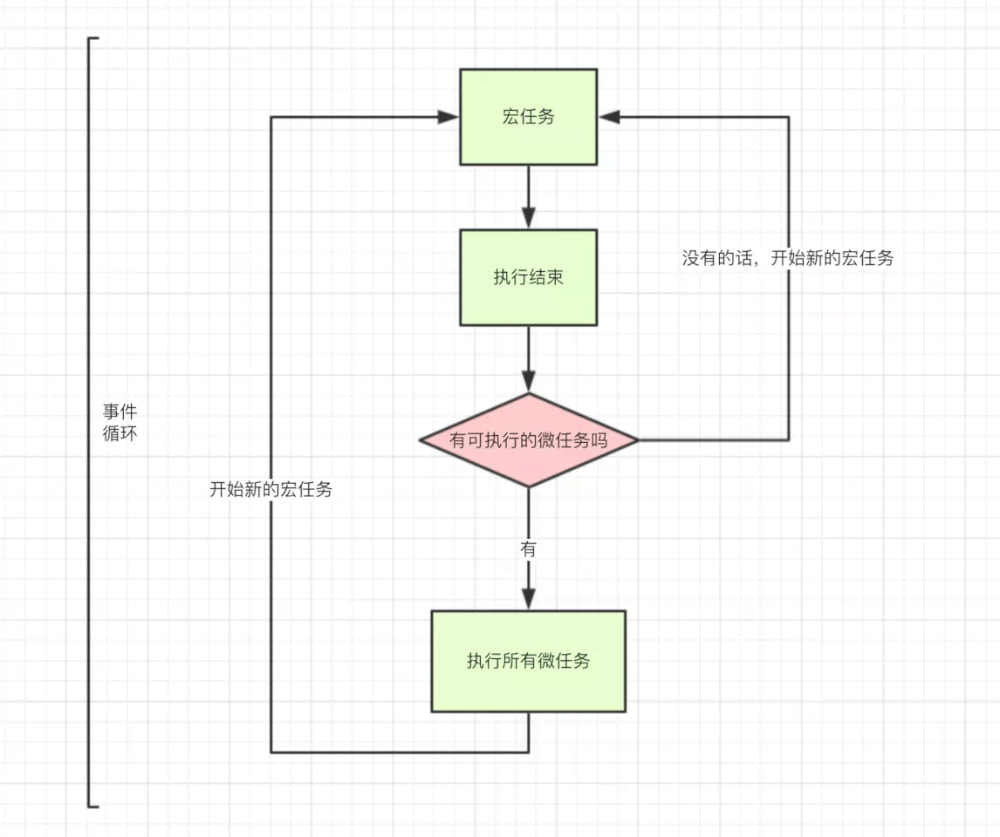
- **事件循环(同步异步角度)**
    - 任务分两类，一种是同步任务，一种是异步任务
    - 同步任务会进入主线程，异步进入Event Table注册函数，指定事情完成后，将函数移入Event Queue（任务队列）
    - 主线程内的任务执行完毕为空，会去Event Queue（任务队列）读取对应的函数，进入主线程执行。
    - js引擎存在monitoring process进程，持续检查主线程执行栈是否为空
    - 一旦为空，就去任务队列那检查是否有等待被调用的函数
    - 重复以上过程
    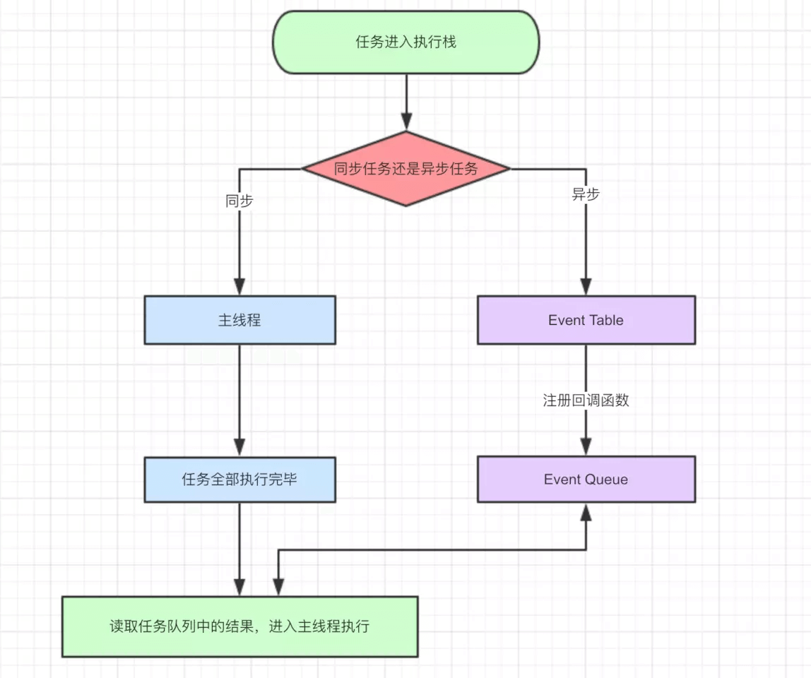

- 宏任务（Macro-Task）：`script`(整体代码)、I/O 操作(点击)、`setTimeout`、`setInterval`、`setImmediate`（IE&Node独有）、requestAnimationFrame(浏览器独有)
- 微任务（Micro-Task）：`Promise.then`、`MutationObserver`的回调(监听DOM、浏览器独有)、`Process.nextTick`（Node独有）
- （调用）栈：后进先出
- （任务) 队列：先进先出
- 细节
  - setTimeout：经过指定时间，将回调函数置入Event Queue，等待主线程空闲时来执行。`setTimeout(fn, 0)`表示立即加入宏任务队列，当主线程同步任务执行完后，执行完微任务队列，立即执行。即使主线程啥也没有，规范也是最低4毫秒。（多个宏任务setTimeout记得看时间长短排序）
  - setInterval：每隔指定的时间将注册的函数置入Event Queue。比如使用定时器每隔300ms循环执行一个promise请求，如果promise有响应，就关闭定时器，如果promise响应时间太长，定时器不断将请求加入任务队列，等到promise.then返回数据，就会清除计时器，不再往队列里添加，但此时任务队列的多个请求会依次执行完。
  - promise：new Promise立即执行，then的回调函数分发到微任务Event Queue。
  - 遇到resolve后，不管嵌套多少then，将最近的then加入微任务，然后继续执行其他同步代码
  - async/await基于promise，await前面类似new promise ，后面类似promise.then
  - 浏览器的requestAnimationFrame姑且也算是宏任务吧，requestAnimationFrame在MDN的定义为，下次页面重绘前所执行的操作，而重绘也是作为宏任务的一个步骤来存在的。

- 优先级
    - 对于微任务micro-task：process.nextTick(node) > Promise.then
    - 对于宏任务macro-task：setTimeout > setImmediate(node)

## Node事件循环

> 依靠libuv引擎：是一个基于事件驱动的跨平台抽象层，封装了不同操作系统一些底层特性，对外提供统一的API，事件循环机制也是它里面的实现。

- 6个阶段

- 顺序：
  - 输入数据(incoming data)->轮询阶段(poll)->检查阶段(check)->关闭事件回调阶段(close callback)->定时器检测阶段(timers)->I/O事件回调阶段(I/O callbacks)->闲置阶段(idle, prepare)->轮询阶段...

- 阶段解释：
  - 定时器阶段（timers） : 执行计时器的回调如 setTimeout / setInterval，由 poll 阶段控制。
  - I/O事件回调阶段（I/O callbacks）: 
      - 执行上一轮循环中的少数未被执行的 I/O 回调
      - 处理网络、流、TCP 的错误回调
  - 闲置阶段（idle, prepare）：仅node内部使用。
  - 轮询阶段（poll）（重要）: 检索新的 I/O 事件;执行与 I/O 相关的回调（除了关闭的回调函数和 由计时器和 setImmediate() 调度的之外的回调），node 将在适当的时候在此阻塞一段时间。具体检测过程如下
      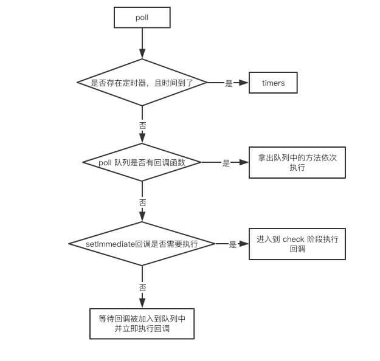
      - 如有到期的setTimeout / setInterval， 则去 timer 阶段执行
      - 没有则进入poll的回调函数队列，不为空则将回调函数队列执行清空
      - 如果poll队列为空
        - 如有setImmediate的回调要执行，则去 check 阶段执行
        - 如没有 setImmediate 回调要执行，会等待其他回调被加入到队列中并立即执行回调，这里同样会有个超时时间设置防止一直等待下去,一段时间后自动进入 check 阶段。
  - 检查阶段（check）
      - 执行setImmediate的回调函数
      > setImmediate()是将事件插入到事件队列尾部，主线程和事件队列的函数执行完成之后立即执行setImmediate指定的回调函数（防止一个耗时长的操作阻塞后面操作）
  - 关闭事件的回调阶段（close callbacks）
      - 执行一些关闭类的回调函数。例如`socket.on('close'[,fn])`或者`http.server.on('close, fn)`。

- 示例代码：
```js
setImmediate(() => {
    console.log('timeout1')
    Promise.resolve().then(() => console.log('promise resolve'))
    process.nextTick(() => console.log('next tick1'))
});
setImmediate(() => {
    console.log('timeout2')
    process.nextTick(() => console.log('next tick2'))
});
setImmediate(() => console.log('timeout3'));
setImmediate(() => console.log('timeout4'));

// node10: 执行所有 setImmediate，完成之后执行 nextTick 队列，最后执行微任务队列
// timeout1 => timeout2 => timeout3 => timeout4 => next tick1 => next tick2 => promise resolve

// node11: 执行一个 setImmediate 宏任务，然后执行其微任务队列，再执行下一个宏任务及其微任务
// timeout1 => next tick1 => promise resolve => timeout2 => next tick2 => timeout3 => timeout4
```

- Node 10以前：
  - 一个阶段中先执行所有的宏任务，再执行微任务。
  - TimersQueue -> 微任务队列-> I/O Queue -> 微任务队列 -> Check Queue -> 微任务队列 -> Close Callback Queue -> 微任务队列 -> TimersQueue ...
  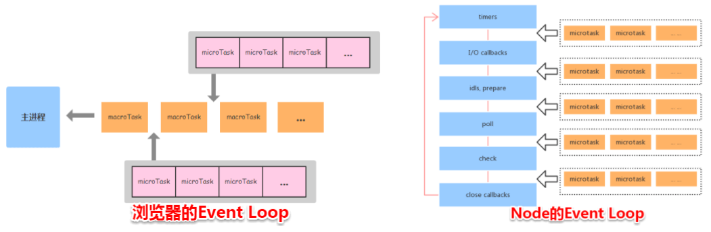
  - 微任务队列：先执行nextTick队列（由`process.nextTick()`创建的回调优先级高于其他微任务），再执行微任务队列中其他的所有任务
- Node 11以后：
  - 和浏览器统一，一个阶段中每执行一个宏任务就清空当时的微任务队列。

示例代码：
```js
function test () {
   console.log('start')
    setTimeout(() => {
        console.log('children2')
        Promise.resolve().then(() => {console.log('children2-1')})
    }, 0)
    setTimeout(() => {
        console.log('children3')
        Promise.resolve().then(() => {console.log('children3-1')})
    }, 0)
    Promise.resolve().then(() => {console.log('children1')})
    console.log('end') 
}

test()

// 以上代码在node11及浏览器的执行结果(取一个宏任务执行，然后清空微任务)
// start
// end
// children1
// children2
// children2-1
// children3
// children3-1


// 以上代码在node11以下版本的执行结果(先执行所有的宏任务，再执行微任务)
// start
// end
// children1
// children2
// children3
// children2-1
// children3-1

```

### 浏览器和node事件循环的主要区别：
- 浏览器中的微任务是在每个相应的宏任务完成后执行的，而node10中的微任务是每个阶段的宏任务都执行完毕再执行的，也就是在每个阶段之间。而在 node11之后
，一个阶段里的一个宏任务(setTimeout,setInterval和setImmediate)就立刻执行对应的微任务队列。

## 异步方案

- 回调函数（callback）:如setTimeout
    - 优点:实现异步
    - 缺点:回调地狱（多个回调函数嵌套难以阅读调试，多个异步操作强耦合），无法try/catch错误
    ```js
    ajax('XXX1', () => {
        // callback 函数体
        ajax('XXX2', () => {
            // callback 函数体
            ajax('XXX3', () => {
                // callback 函数体
            })
        })
    })
    ```
- promise:
    - 优点:解决回调地狱，实现链式调用then，用catch捕获错误
    - 缺点:
        - 错误不能被 try catch；
        - Promise传递中间值麻烦；
        - 无法中途取消promise，因为promise是一个状态机，只有pending和resolve和reject三个状态，没有cancel这个方法，async也一样。解决方案：Promise.race竞速方式，同时发起两个promise，返回先完成的promise，未完成的就不再监听了，比如设置一个取消按钮，当按钮取消后，在其中一个promise直接reject()，就返回这个promise，另一个promise就不会再监听了；
    ```js
    ajax('XXX1')
      .then(res => {
          // 操作逻辑
          return ajax('XXX2')
      }).then(res => {
          // 操作逻辑
          return ajax('XXX3')
      }).then(res => {
          // 操作逻辑
      })
    ```
- generator：
    - 优点：可以控制函数的执行（暂停/继续）流程更加直观
    - 缺点：必须部署自动运行器，且保证yield后的表达式返回一个Promise
    - 执行到yield时暂停，调用next()方法继续
    ```js
    function *fetch() {
        yield ajax('XXX1', () => {})
        yield ajax('XXX2', () => {})
        yield ajax('XXX3', () => {})
    }
    let it = fetch()
    let result1 = it.next()
    let result2 = it.next()
    let result3 = it.next()
    ```
- async await（ES8）:Generator 函数的语法糖，最优雅的解决方案
    - 优点:
      - 不需要then链，读起来更加同步；
      - 传中间值方便；调试友好,同步代码的断点;
      - 错误处理友好可被try.catch（包裹await）
    - 缺点:要注意并行promise的情况，无依赖性，却用多个await(多个同时并行请求可以Promise.all)，会导致耗时长（等前面执行完再执行后面）
    - async声明一个function是异步的、await等待异步方法执行完成。
    - 一个函数如果加上 async ，那么该函数就会返回一个 Promise
    - 只要一个await出现reject，后面await不会执行。

    > await关键字只能在async function中使用。在任何非async function的函数中使用await关键字都会抛出错误。await关键字在执行下一行代码之前等待右侧表达式(可能是一个Promise)返回。
    
    ```js
    async function test() {
      // 以下代码没有依赖性的话，完全可以使用 Promise.all 的方式
      // 如果有依赖性的话，其实就是解决回调地狱的例子了
      await fetch('XXX1')
      await fetch('XXX2')
      await fetch('XXX3')
    }
    ```
- 良好实践：
    - 当只有一个异步请求，且需要做错误处理的情况下，更倾向于使用 promise。
    - 有嵌套请求的情况下， async/await 更直观。

- [Async/Await 如何通过同步的方式实现异步](https://juejin.im/post/5d2c814c6fb9a07ecd3d8e43#comment)

## Promise
> 表示一个尚未完成且预计在未来完成的异步操作。

- 立即执行:
    - `new Promise()`里面是立即执行的代码，位于resolve或者reject后面的同步代码仍会执行。
- 三种状态：
    - pending（进行中，刚完成创建）
    - fulfilled（已成功，执行了resolve）
    - rejected（已失败，执行了reject）
- 状态不可逆：
    - Promise状态的一旦变成resolved或rejected时，无论怎么调用resolve和reject方法，都无法改变状态和值。
    
    ```js
    new Promise(function(resolve,reject) {
        console.log('1');
        resolve();
        console.log('1.5');
        reject();
    }).then(function() {
        console.log('2')
    }).catch(()=>{
        console.log('3')
    })
    
    // 1
    // 1.5
    // 2
    // Promise {<resolved>: undefined}
    ```
- 链式调用then：Promise对象的then方法返回一个新的Promise对象
    - then可接收两个函数（成功回调，失败回调），只会有一个被调用。
    - 回调函数 return 一个同步值，或者没有返回（默认return undefined），
    - 回调函数 return 另一个Promise，根据Promise的状态执行下一个的成功或失败回调
    - throw 一个异常，返回rejected状态的Promise（参数为异常值），执行失败的回调函数
    - finally：不管promise最后的状态，在执行完then或catch指定的回调函数以后，都会执行finally方法指定的回调函数。没有办法知道，前面的 Promise 状态到底是fulfilled还是rejected
- 异常捕获和多级then执行顺序
  - 异常捕获由then第二个回调函数处理，异常信息作为值，异常在第二个回调函数中被处理后，默认return undefined，返回的Promise恢复正常，被下一轮then的成功回调函数继续处理。
  - 注意p1、p2 多级then的回调函数是交替执行的，下一轮then加入下一轮的微任务。
```js
var p1 = new Promise( function(resolve,reject){
  foo.bar();
  resolve( 1 );	  
});

p1.then(
  function(value){
    console.log('p1 then value: ' + value);
  },
  function(err){
    console.log('p1 then err: ' + err);
  }
).then(
  function(value){
    console.log('p1 then then value: '+value);
  },
  function(err){
    console.log('p1 then then err: ' + err);
  }
);

var p2 = new Promise(function(resolve,reject){
  resolve( 2 );	
});

p2.then(
  function(value){
    console.log('p2 then value: ' + value);
    foo.bar();
  }, 
  function(err){
    console.log('p2 then err: ' + err);
  }
).then(
  function(value){
    console.log('p2 then then value: ' + value);
  },
  function(err){
    console.log('p2 then then err: ' + err);
    return 1;
  }
).then(
  function(value){
    console.log('p2 then then then value: ' + value);
  },
  function(err){
    console.log('p2 then then then err: ' + err);
  }
);

```
```js
p1 then err: ReferenceError: foo is not defined
p2 then value: 2
p1 then then value: undefined
p2 then then err: ReferenceError: foo is not defined
p2 then then then value: 1
```


- 异常捕获两种方式的区别：
    - 由then参数中第二个回调函数处理，状态变为rejected时执行，处理**本次promise**的错误
    - `.catch((err) => {})`捕获**前面所有promise**产生的错误(推荐)
    - 一旦得到失败回调的处理（可以返回值），then返回的Promise恢复正常，并被下一个then处理。
        ```js
        // bad
        promise
          .then(function(data) {
            // success
          }, function(err) {
            // error
          });
        
        // good
        promise
          .then(function(data) {
            // success
          })
          .catch(function(err) {
            // error
          });
        ```
- then的异步回调：
    - new Promise的代码是同步执行的，then的回调函数是异步的(微任务)
    - 等Promise状态完成改变后再将回调加入微任务
- Promise.resolve()：将现有对象转为 Promise 对象
    - 参数值为值：返回一个resolved状态的Promise对象，对象值为这个参数。
    - 参数值为Promise对象：返回这个Promise对象
    - 参数是一个thenable对象：将这个对象转为 Promise 对象，然后就立即执行thenable对象的then方法。
- Promise.reject()
    - 返回一个新的 Promise 实例，该实例的状态为rejected。
    - Promise.reject()方法的参数，会**原封不动**地作为reject的理由（包括then对象），变成后续方法的参数。这一点与Promise.resolve方法不一致。

- new Promise中的resolve和reject方法
    - new Promise出来是个新对象。
    - resolve的参数是Promise对象时，拆箱获得Promise的状态和值，异步的，拆箱完毕，获得里面这个Promise它自己的状态，再执行成功或失败回调。
    - 而reject的参数是Promise对象时，没有拆箱能力，不会异步执行里面的Promise，直接将参数Promise对象传递给失败回调（值为该Promise对象）
    ```js
    var p1 = new Promise(function(resolve, reject){
      resolve(Promise.resolve('resolve'));
    });

    var p2 = new Promise(function(resolve, reject){
      resolve(Promise.reject('reject'));
    });

    var p3 = new Promise(function(resolve, reject){
      reject(Promise.resolve('resolve'));
    });

    p1.then(
      function fulfilled(value){
        console.log('fulfilled: ' + value);
      }, 
      function rejected(err){
        console.log('rejected: ' + err);
      }
    );

    p2.then(
      function fulfilled(value){
        console.log('fulfilled: ' + value);
      }, 
      function rejected(err){
        console.log('rejected: ' + err);
      }
    );

    p3.then(
      function fulfilled(value){
        console.log('fulfilled: ' + value);
      }, 
      function rejected(err){
        console.log('rejected: ' + err);
      }
    );
    // p3 rejected: [object Promise] // 无拆箱，直接reject此Promise
    // p1 fulfilled: resolve // 异步拆箱，执行顺序变后
    // p2 rejected: reject
    ```
- **Promise.all**
    - 多个 Promise 实例，包装成一个新的 Promise 实例。用于并发运行多个异步任务。**当这些实例的状态为成功，才会执行then方法，返回数据组成数组，只要有一个失败，就将第一个失败的值传给失败回调方法。**
    - 如果不是 Promise 实例，就会先调用Promise.resolve()方法，将参数转为 Promise 实例
    - `const p = Promise.all([p1, p2, p3])`;
    - 只有p1、p2、p3的状态都变成fulfilled，p的状态才会变成fulfilled，此时p1、p2、p3的返回值组成一个数组，传递给p的回调函数。返回值将会按照参数内的 promise 顺序排列，而不是由调用 promise 的完成顺序决定。
    - **只要p1、p2、p3之中有一个被rejected，p的状态就变成rejected，此时第一个被reject的实例的返回值，会传递给p的回调函数。**
- **Promise.race**
    - 多个 Promise 实例，包装成一个新的 Promise 实例。 **只要该数组中的其中一个 Promise 对象的状态发生变化（无论是resolve还是reject）该方法都会率先返回这个Promise的值。**
    - 如果不是 Promise 实例，就会先调用Promise.resolve()方法，将参数转为 Promise 实例
    - `const p = Promise.race([p1, p2, p3])`;
    - **只要p1、p2、p3之中有一个实例率先改变状态，p的状态就跟着改变。那个率先改变的 Promise 实例的返回值，就传递给p的回调函数。**
    - 场景：中止promise，或者 请求慢，在另一个promise中可以报错或者显示缓存。
- Promise.allSettled
    - 等到所有这些参数实例都返回结果，不管是fulfilled还是rejected，包装实例才会结束
    - 一旦结束，状态总是fulfilled
    - then传入数组results：该数组的每个成员都是一个对象，对应传入Promise.allSettled()的两个 Promise 实例。每个对象都有status属性，该属性的值只可能是字符串fulfilled或字符串rejected。fulfilled时，对象有value属性，rejected时有reason属性，对应两种状态的返回值。
    - `[{ status: 'fulfilled', value: 42 },{ status: 'rejected', reason: -1 }]`
    - 适用于不关心异步操作的结果，只关心这些操作有没有结束，确保操作都结束了。

## Iterator
Iterator（迭代器）是一种接口，也可以说是一种规范。为各种不同的数据结构提供统一的访问机制。任何数据结构只要部署Iterator接口，就可以完成遍历操作（即依次处理该数据结构的所有成员）。
```js
const obj = {
    [Symbol.iterator]: function() {}
}
```
- [Symbol.iterator]属性名是固定的写法，只要拥有了该属性的对象，就能够用迭代器的方式进行遍历。
- 迭代器的遍历方法是首先获得一个迭代器的指针，初始时该指针指向第一条数据之前，接着通过调用 next 方法，改变指针的指向，让其指向下一条数据
每一次的 next 都会返回一个对象，该对象有两个属性
  - value 代表当前成员的值
  - done 布尔值，false表示当前指针指向的数据有值，true表示遍历已经结束

- Iterator 的作用有三个：
  - 为各种数据结构，提供一个统一的、简便的访问接口；
  - 使得数据结构的成员能够按某种次序排列；
  - ES6 创造了一种新的遍历命令for…of循环，Iterator 接口主要供for…of消费。
- 遍历过程：
  - 创建一个指针对象，指向当前数据结构的起始位置。也就是说，遍历器对象本质上，就是一个指针对象。
  - 第一次调用指针对象的next方法，可以将指针指向数据结构的第一个成员。
  - 第二次调用指针对象的next方法，指针就指向数据结构的第二个成员。
  - 不断调用指针对象的next方法，直到它指向数据结构的结束位置。
  每一次调用next方法，都会返回数据结构的当前成员的信息。具体来说，就是返回一个包含value和done两个属性的对象。其中，value属性是当前成员的值，done属性是一个布尔值，表示遍历是否结束。
```js
let arr = [{num:1},2,3]
let it = arr[Symbol.iterator]() // 获取数组中的迭代器
console.log(it.next()) 	// { value: Object { num: 1 }, done: false }
console.log(it.next()) 	// { value: 2, done: false }
console.log(it.next()) 	// { value: 3, done: false }
console.log(it.next()) 	// { value: undefined, done: true }
```

## Generator
- Generator函数可以说是Iterator接口的具体实现方式，一般配合co库使用。
- Generator最大的特点就是可以控制函数的执行。
- 调用Generator函数，返回迭代器，执行迭代器的next()方法，暂停在yield处，再调用迭代器的next()方法，到下一个yield(yield后的表达式必须返回一个Promise)。

```js
function *foo(x) {
  let y = 2 * (yield (x + 1))
  let z = yield (y / 3)
  return (x + y + z)
}
let it = foo(5)
console.log(it.next())   // => {value: 6, done: false}
console.log(it.next(12)) // => {value: 8, done: false}
console.log(it.next(13)) // => {value: 42, done: true}
```
- 上面这个示例就是一个Generator函数，我们来分析其执行过程：
  - 首先 Generator 函数调用时它会返回一个迭代器
  - 当执行第一次 next 时，传参会被忽略，并且函数暂停在 `yield (x + 1)` 处，所以返回 `5 + 1 = 6`
  - 当执行第二次 next 时，传入的参数等于上一个 yield 的返回值，如果你不传参，yield 永远返回 undefined。此时 `let y = 2 * 12`，所以第二个 yield 等于` 2 * 12 / 3 = 8`
  - 当执行第三次 next 时，传入的参数会传递给 z，所以 `z = 13, x = 5, y = 24，`相加等于 42

## async/await
- Generator 的语法糖，`async function` 代替了` function*`，`await` 代替了 `yield`，不用手写run自动执行器：内置执行器。
- 返回Promise：async执行完后返回是一个Promise，return的值，可使用then接收，指定下一步操作

- async:声明一个异步函数
    - 函数内部return语句返回的值，会成为then方法回调函数的参数。
    - 只有async函数内部的异步操作执行完，才会执行then方法指定的回调函数。
- await：等异步操作完成再执行后面函数，进行异步过程时async函数是暂停的。
    - 可跟Promise和原始类型（会被转成resolved的Promise对象），
    - 正常情况下，await命令后面是一个 Promise 对象，异步执行，返回该对象的结果。如果不是 Promise 对象，同步执行，就直接返回对应的值。
        ```js
         return await 123; // 等同于 return 123
        ```
    - 一个await后的Promise变为reject状态，中断async函数执行，不会执行下一个await    
    - await命令只能用在async函数之中，被其他函数包裹会报错（可用for循环包裹）
- 错误处理  
    - 捕获错误方法：在内部使用try...catch捕获await的错误，防止async返回的Promise为rejected状态。
    - 不影响其他await：单个await放入try，其他await写在外面，可以防止因为错误而中断后续的await异步操作。也可以在await后面的 Promise 对象再跟一个catch方法，处理前面可能出现的错误。
    - 影响后续await：多个await可以统一放入try里面。
        ```js
        async function main() {
          try {
            const val1 = await firstStep();
            const val2 = await secondStep(val1);
            const val3 = await thirdStep(val1, val2);
        
            console.log('Final: ', val3);
          }
          catch (err) {
            console.error(err);
          }
        }
        ```
- 互不依赖的异步操作可以写成同时触发，缩短程序耗时。
    - 1:可以用Promise.all.
    - 2:可以将函数赋值给一个变量，在await这个变量，即可同时触发。
        ```js
        // 写法一
        let [foo, bar] = await Promise.all([getFoo(), getBar()]);
        
        // 写法二
        let fooPromise = getFoo();
        let barPromise = getBar();
        let foo = await fooPromise;
        let bar = await barPromise;
        ```

## 闭包
> 概念：闭包 =『函数』和『函数对外部作用域的变量引用』的捆绑，即闭包可以从让内部函数访问外部函数作用域。本质是当前环境中存在指向父级作用域的**引用**。
  - 如在父函数声明a=1，在子函数`console.log(a)`
  - 闭包的作用域链包含着它自己的作用域，以及包含它的函数的作用域和全局作用域。
  - 通常，函数的作用域及其所有变量都会在函数执行结束后被销毁。但是，在创建了一个闭包以后，内部函数引用着外部函数的变量，这个函数的作用域就会一直保存到闭包不存在为止。
- 理论：其实广义上所有的JavaScript函数都是闭包，可以访问全局作用域的变量
- 实践：**即使创建子函数的上下文已经销毁，因为引用了父级，所以父级变量对象仍然保存在内存，不会被销毁**
- 创建方法：
    - 1.在一个函数内部创建另一个函数，并暴露出来(通过返回或者传给其他函数)
    - 2.IIFE(匿名函数+立即执行函数表达式)创建闭包，保存了全局作用域window和当前函数的作用域。
    - 3.异步中使用回调函数，其实就是使用闭包，如setTimeout、事件监听

    ```js
    // 函数中创建函数，并返回
    function f1() {
      var a = 2
      function f2() {
        console.log(a);
      }
      return f2;
    }
    var x = f1();
    x();//2

    // IIFE
    var a = 2;
    (function IIFE(){
      // 输出2
      console.log(a);
    })();

    // 回调
    function waitSomeTime(msg, time) {
    	setTimeout(function () {
    		console.log(msg);
    	}, time);
    }
    waitSomeTime('hello', 1000);

    // 在循环中创建闭包的常见问题：全部输出6
    for(var i = 1; i <= 5; i++) {
      setTimeout(function timer() {
        console.log(i);
      }, 0)
    }
    // 因为setTimeout为宏任务，等循环执行完再排队执行，此时找不到自己作用域的i，向上找到共享函数作用域的i，为6。需要产生一个私有的作用域来解决。
    // 方法一：使用ES6的块级作用域，作用域以块级为单位
    for(let i = 1; i <= 5; i++){
      setTimeout(function timer() {
        console.log(i);
      },0)
    }
    // 方法二：使用匿名闭包+立即执行函数，中间加个匿名函数，有独立的作用域，每个循环都保存自己的私有变量i
    for(var i = 1; i <= 5; i++){
      (function(j) {
        setTimeout(function timer() {
          console.log(j);
        }, 0)
      })(i)
    }
    ```

- 特性：
  - 1.函数嵌套函数 
  - 2.函数内部可以引用外部的参数和变量 
  - 3.外部的参数和变量不会被垃圾回收机制回收
- 应用：
    - 创建私有变量和方法（函数外部不能访问私有变量）
        ```js
        var singleton = (function(){
          // 私有变量
          var age = 22;
          var speak = function(){
            console.log("speaking!!!");
          };
          
          // 特权（或公有）属性和方法
          return {
            name: "percy",
            getAge: function(){
              return age;
            }
          };
        })();
        ```
    - 模块化代码，避免全局污染
        ```js
        var objEvent = objEvent || {};
        (function(){ 
            var addEvent = function(){ 
              // some code
            };
            function removeEvent(){
              // some code
            }
        
            objEvent.addEvent = addEvent;
            objEvent.removeEvent = removeEvent;
        })();
        ```
    - 防抖节流函数！私有化计时器变量，返回传入的函数，供外部使用。

- 缺点：
    - 常驻内存会增大内存使用量，容易导致内存泄露
    - 非特殊任务，不要在函数内创建其他函数，影响JS处理速度和内存消耗

## IIFE（立即调用函数表达式）
- 概念：在定义时就会立即执行的JS函数。
- 组成：由圆括号里的匿名函数( function() {...} ) + 使用()执行，有两种形式
```js
(function() {
  ...
})()

(function() {
  ...
}())
```
- 特性：
  - 跟其他函数一样，匿名函数有自己的独立作用域，外界无法访问内部变量。
  - 不同的是，它的函数为匿名形式，所以不会污染全局作用域(命名空间)。
```js
(function () { 
    var name = "Barry";
})();
// 外部无法访问变量 name
```

## ES6模块与CommonJS模块有什么区别？
> 其实也就是import（ES6 Module）和require（CommonJS）的区别

> CommonJS 是一种模块规范，最初被应用于 Nodejs，成为 Nodejs 的模块规范。运行在浏览器端的 JavaScript 由于也缺少类似的规范，在 ES6 出来之前，前端也实现了一套相同的模块规范 (例如: AMD)，用来对前端模块进行管理。自 ES6 起，引入了一套新的 ES6 Module 规范，在语言标准的层面上实现了模块功能，而且实现得相当简单，有望成为浏览器和服务器通用的模块解决方案。但目前浏览器对 ES6 Module 兼容还不太好，我们平时在 Webpack 中使用的 export 和 import，会经过 Babel 转换为 CommonJS 规范。在使用上的差别主要有：

- CommonJS 模块输出的是一个值的拷贝，ES6 模块输出的是值的引用
- CommonJS 模块是运行时加载，ES6 模块是编译时输出接口
- CommonJs 是动态语法可以写在判断里，ES6 Module 静态语法只能写在顶层
- CommonJs 是单个值导出，ES6 Module可以导出多个
- CommonJs 的 this 是当前模块，ES6 Module的 this 是 undefined

## 数组合并&对象合并
- 数组
  - ES6扩展运算符
  ```js
  const arr1 = [0, 1, 2];
  const arr2 = [3, 4, 5];
  const arr = [...arr1, ...arr2];
  // arr => [0, 1, 2, 3, 4, 5];
  ```

  - concat
  ```js
  const arr1 = [0, 1, 2];
  const arr2 = [3, 4, 5];
  const arr = arr1.concat(arr2);
  // arr => [0, 1, 2, 3, 4, 5]
  ```
  
  - for
  ```js
  const arr1 = [0, 1, 2];
  const arr2 = [3, 4, 5];
  for(let i in arr2) {
    arr1.push(arr2[i]);
  }
  // arr1 => [0, 1, 2, 3, 4, 5] 改变了arr1的原始值
  ```

  - push.apply
  ```js
  const arr1 = [0, 1, 2];
  const arr2 = [3, 4, 5];
  arr1.push.apply(arr1, arr2);   
  // arr1 => [0, 1, 2, 3, 4, 5] 改变了arr1的原始值
  ```

- 对象
  - Object.assign(target, ...sources)
  ```js
  const obj1 = { a: 0, b: 1, c: 2 };
  const obj2 = { c: 3, d: 4, e: 5 };
  const obj = Object.assign(obj1, obj2);
  // obj => { a: 0, b: 1, c: 3, d: 4, e: 5 }
  // obj1 => { a: 0, b: 1, c: 3, d: 4, e: 5 } // 改变了obj1的原始值
  ```

  - ES6扩展运算符
  ```js
  const obj1 = { a: 0, b: 1, c: 2 };
  const obj2 = { c: 3, d: 4, e: 5 };
  const obj = { ...obj1, ...obj2 };
  // obj => { a: 0, b: 1, c: 3, d: 4, e: 5 }
  ```

## 深浅拷贝

### 浅拷贝
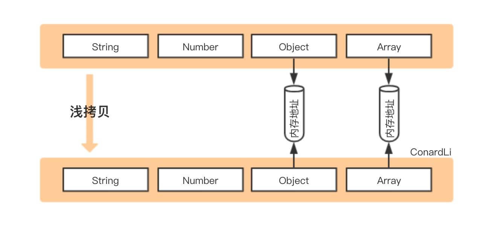
- 定义：拷贝原对象生成新对象，如果属性是基本类型，拷贝它的值，如果是引用类型，拷贝它的地址，所以改变这个地址的内容，另一个对象也会跟着改变。
- 方法：
  - Object.assign({ },obj)
  - 展开运算符(...) -> {...obj}
  - Array.prototype.concat()
  - Array.prototype.slice()
  - 函数库lodash的_.clone方法
- 代码：
  ```js
  // Object.assign({ },obj)
  let obj1 = { person: { name: "joe", age: 25 }, sports: 'swimming' };
  let obj2 = Object.assign({}, obj1);
  obj2.person.age = 15
  console.log(obj1.person.age) // 15 被影响

  // 展开运算符(...)
  let obj1 = { name: 'joe', address:{ x:100, y:100 } }
  let obj2 = { ...obj1 };
  obj1.address.x = 120;
  obj1.name = 'joo';
  console.log(obj2); // { name: "joe", address: {x: 120, y: 100} }

  // Array.prototype.concat()
  let arr1 = [1, 3, { username: 'joe' }];
  let arr2 = arr1.concat();
  arr2[2].username = 'joo';
  console.log(arr1); // [ 1, 3, { username: 'joo' } ]

  // Array.prototype.slice()
  let arr1 = [1, 3, { username: 'joe' }];
  let arr2 = arr1.slice();
  arr2[2].username = 'joo';
  console.log(arr1); // [ 1, 3, { username: 'joo' } ]

  // 函数库
  let obj2 = lodash.clone(obj1);
  ```

### 深拷贝
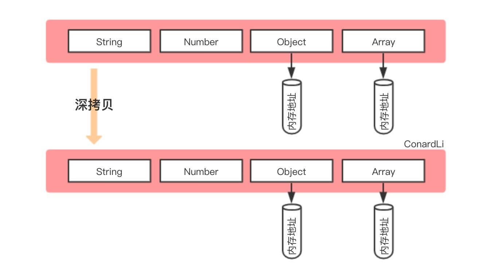
- 定义：完全拷贝一个新对象，两个独立内存区域。修改时原对象不再受到影响。
- 方法：
  - JSON.parse(JSON.stringify())
    - 性能最快
    - 对象存在循环引用会报错
    - 只拷贝数组和对象，属性值为函数(变为null)、正则(变为空对象)、Date...时无法深拷贝
  - 手写实现递归
  - 函数库lodash的_.cloneDeep方法
- 场景：修改数据时，深拷贝一份数据存于当前编辑表单对象中，改动后，取消修改不会影响修改之前的数据。
- 代码：
  ```js
  // JSON.parse(JSON.stringify())
  let arr1 = [1, 3, { name: 'joe' }];
  let arr2 = JSON.parse(JSON.stringify(arr1));
  arr2[2].name = 'joo'; 
  console.log(arr1[2].name); // joe

  // 函数库
  let obj2 = lodash.cloneDeep(obj1);

  // 手写递归 - 详见手写API
  ```

## 防抖节流
- 防抖debounce：连续触发只执行一次，停止触发N秒后，才能继续执行。
    - 事件触发后，计时n秒后执行回调，n秒内再次触发，重新计时。
    - 场景：
        - search搜索联想:不断输入值时，用防抖来节约请求资源，如隔350ms。用户注册验证，输入校验。实时保存，如无更改操作1s后进行保存。
        - 按钮提交：防止多次点击按钮发多次请求，只执行最后提交的一次。
- 节流throttle：连续触发事件，每隔一段时间只执行一次。
    - 一个单位时间内只能触发一次函数，多次触发只有一次生效，通常每隔 100~500 ms执行一次即可，多次快速点击也只执行一次。
    - 场景：
        - 监听滚动scroll事件：鼠标滚动，触发很多次时，页面滚动就会间隔一段时间(1s)判断一次，比如滑到底部自动加载更多。
        - 缩放场景：监控浏览器调整窗口时，触发resize，用防抖来让其只触发一次。
        - 以固定的速率执行，比较适合应用于动画相关的场景，避免短时间内多次触发动画引起性能问题。
        

## 运算符
- 真值和虚值(truthy和falsy)
  - 一个值可以被转换为 true，那么这个值就是所谓的 truthy，如果可以被转换为 false，那么这个值就是所谓的 falsy。
  - 下面是falsy
  ```js
  null
  NaN
  0
  空字符串（"" or '' or ``）
  undefined
  false
  ```
- 逻辑运算符：
  - `&&` 逻辑与：`expr1 && expr2`，若 expr1 可转换为 true，则返回 expr2；否则，返回 expr1。
    - 可做短路计算
  - `||` 逻辑或：`expr1 || expr2`，若 expr1 可转换为 true，则返回 expr1；否则，返回 expr2。
    - 可做短路计算
    - 可做初始化函数中的默认参数值(ES6之后函数参数可以直接默认值)
  - `!` 逻辑非：若 expr 可转换为 true，则返回 false；否则，返回 true。
  - 短路计算
    - `(some falsy expression) && (expr)` 短路计算的结果为假。
    - `(some truthy expression) || (expr)` 短路计算的结果为真。
    - 短路意味着上述表达式中的expr部分不会被执行，因此expr的任何副作用都不会生效（举个例子，如果expr是一次函数调用，这次调用就不会发生）。

- `!!` 运算符：可以将值强制转换为布尔值，还可以使用`Boolean()`转换。

- 递增 (++)
  - 概念：递增运算符为其操作数增加1，返回一个数值。
  - 两个位置：
    - 如果使用后置（postfix），即运算符位于操作数的后面（如 x++），那么将会在递增前返回数值，也就是先返回后增加。
    - 如果使用前置（prefix），即运算符位于操作数的前面（如 ++x），那么将会在递增后返回数值，也就是先增加后返回。


## 图片懒加载原理
```html
<div class="img-area">
    
</div>
<div class="img-area">
    
</div>
```

- 原理：
  - ``标签的src属性先设置为空或者为默认图片的url，这样图片为空或默认图片。
  - 再设置data-src为真实的url，判断图片进入可视区域，通过el.dataset将真实url取出
  - 放入src属性中，浏览器发出请求，显示正常图片。

> alt 属性是一个必需的属性，它规定在图像无法显示时的替代文本。

> data-* 全局属性：构成一类名称为自定义数据属性的属性，可以通过HTMLElement.dataset来访问。

- 实现方法（2种）：
  - getBoundingClientRect
    - 获取元素大小和位置，针对视口左上角的坐标而言
    - 返回的对象包括top、right、botton、left、width、height属性
    - 判断图片已出现在屏幕中：el.getBoundingClientRect().top<=window.clientHeight （图片到可视区域顶部的距离）<=(可视区域的高度)
    - 加载方法是将src赋值为真实url：el.src = el.dataset.src

    - 首次进入页面【window.onload】或者滚动条滚动【window.onscroll】时遍历所有图片，若出现在屏幕内，则加载。
    - 优化：滚动条滚动检查图片采取使用节流函数；滚动时只检查剩余的图片；
  - 示例1：
    ```js
    function isInSight(el) {
      const bound = el.getBoundingClientRect();
      const clientHeight = window.innerHeight;
      //如果只考虑向下滚动加载
      //const clientWidth = window.innerWeight;
      return bound.top <= clientHeight + 100;
    }

    function checkImgs() {
      const imgs = document.querySelectorAll('.my-photo');
      Array.from(imgs).forEach(el => {
        if (isInSight(el)) {
          loadImg(el);
        }
      })
    }

    function loadImg(el) {
      if (!el.src) {
        const source = el.dataset.src;
        el.src = source;
      }
    }
    ```  
  - IntersectionObserver
    - 首次进入页面，通过新建IntersectionObserver对象io 并传入callback函数，用io.observe方法监听每个图片dom节点，当比例大于0小于1时，执行加载图片，加载完毕io.unobserve关掉该图片dom节点的监听。
    - callback函数传入参数为数组，每个元素有自己的target（dom节点）和intersectionRatio（在屏幕中出现比例）
    - 回调函数进行遍历每个元素执行下面操作
      - 判断图片已出现在屏幕中:intersectionRatio > 0 && intersectionRatio <= 1
      - 加载方法是将src赋值为真实url：el.src = el.dataset.src
      - el.onload后关闭观察器io.unobserve(el)。
    
    ```js
    var io = new IntersectionObserver(callback, option);
    io.observe(document.getElementById('example'));// 开始观察
    io.unobserve(element);// 停止观察
    io.disconnect();// 关闭观察器
    ```
    - 兼容性
      - Chrome 51+（发布于 2016-05-25）
      - Firefox 55
      - iOS 12.2  
  - 示例2：
    ```js
    const io = new IntersectionObserver(ioes => {
      ioes.forEach(ioe => {
        const el = ioe.target;
        const intersectionRatio = ioe.intersectionRatio;
        if (intersectionRatio > 0 && intersectionRatio <= 1) {
          loadImg(el);
        }
        el.onload = el.onerror = () => io.unobserve(el);
      });
    });

    function checkImgs() {
      const imgs = Array.from(document.querySelectorAll(".my-photo"));
      imgs.forEach(item => io.observe(item));
    }

    function loadImg(el) {
      if (!el.src) {
        const source = el.dataset.src;
        el.src = source;
      }
    }

    ```    

> 注意：获取dom之后要将所有图片dom节点转为数组对象才能使用数组遍历方法：Array.from

## 内存管理
- 基本类型普遍被存放在『栈』中，而引用类型是被存放在堆内存的。
  - 不是所有基本类型都存在栈中，当基本类型被闭包引用后，也可以长期在内存堆中。
- 执行栈的函数如何使用保存在堆中的引用类型呢？
  - 上下文会保存一个内存堆对应复杂类型对象的内存地址，通过引用来使用复杂类型对象。
```js
function add() {
    const a = 1
    const b = {
        num: 2
    }

    const sum = a + b.num
}
```
示意图如下(暂时不考虑函数本身的内存)
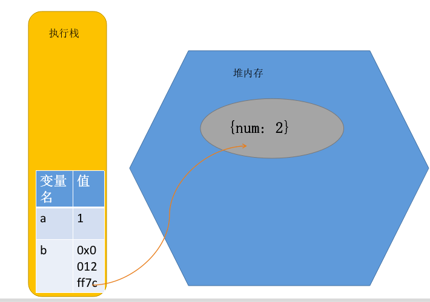

### 垃圾回收GC（Garbage Collection）
- V8的垃圾回收策略：分代回收
  - 新生代：对象的存活时间较短。新生对象或只经过一次垃圾回收的对象。
  - 老生代：对象存活时间较长。经历过一次或多次垃圾回收的对象。
- 回收算法：
  - 新生代：Scavenge 算法 + 对象晋升
  - 老生代：Mark-Sweep + Mark-Compact 算法 + 全停顿优化：Incremental Marking(增量标记)
- 新生代垃圾回收过程
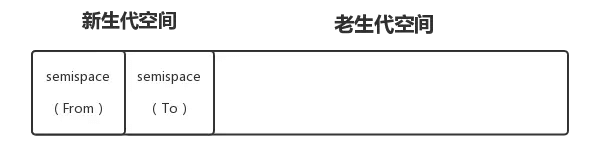
  - Scavenge算法将新生代空间分为两部分，使用中的 semispace 称为 「From 空间」，闲置的 semispace 称为 「To 空间」
  - 1.首先在From空间分配对象，如果空间满了，执行垃圾回收
  - 2.检查对象是否存活，不存活则释放该空间
  - 3.对象晋升：若对象存活，检查是否符合晋升（经历过一次Scavenge回收或To空间内存超过25%），满足晋升条件直接晋升到老生代，不满足则将对象从 From 空间复制到 To 空间。
  - 4.完成复制后，将 From 空间与 To 空间进行角色翻转（flip），继续下一轮的分配和回收。
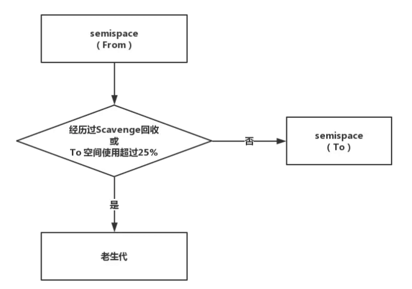
- 老生代垃圾回收过程
  - Mark-Sweep，标记清除。
    - 标记阶段，它将遍历堆中所有对象，并对存活的对象进行标记
    - 清除阶段，对未标记对象的空间进行回收
    - 存在的问题：经过一次标记清除后，内存空间变得不连续，再分配一个大对象时，无内存碎片支持该分配，会提前触发一次没必要的垃圾回收。
    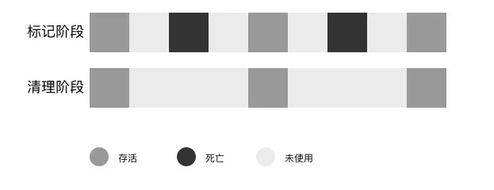
  - Mark-Compact，标记整理。
    - 标记阶段，同上，再将标记的存活对象集中移到一边
    - 清除阶段，清理边界外的未标记对象。
    
  - 总结：V8老生代主要使用Mark-Sweep算法，然后在当空间内存分配不足时，采用Mark-Compact算法。因为Mark-Compact需要移动对象，执行速度较慢。
  - 全停顿优化：
    - 垃圾回收算法在执行前，需要将应用逻辑暂停，执行完垃圾回收后再执行应用逻辑，这种行为称为 「全停顿」（Stop The World）。例如，如果一次GC需要50ms，应用逻辑就会暂停50ms。
    - 老生代中，存活对象多，垃圾回收时间长，全停顿造成的影响大。为了减少全停顿的时间，进行增量标记优化。
    - 增量标记(Incremental Marking)：在标记阶段，分成很多小步，每完成一小步，就执行一下应用逻辑，交替多次完成标记。
    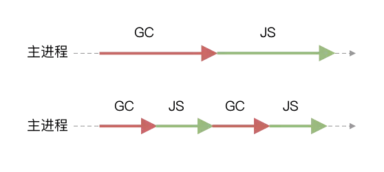

### 内存泄漏
- [参考](https://mp.weixin.qq.com/s?__biz=MzUxMzcxMzE5Ng==&mid=2247496779&idx=2&sn=892d968a86ebd083582ae2e28f48ab8f&chksm=f9524108ce25c81e960471a63357cf2bc59971e2a22ca9549f67c5266100474712fcaa208f28&mpshare=1&scene=1&srcid=&sharer_sharetime=1592813500572&sharer_shareid=f72feefcc9c2c137677aa7f49d02e0f4&key=5275bdb85f6fecb5b863a0f4364938b0f20d3068a623c70bb17408602e09ad9840bc8824054c5f5f3e8b5fdacdf41cf6d13413049806b41cdb497e6abe7e48742dabb92c99874d17f7c19bace4019ecd&ascene=1&uin=MjI1NjQ0MTU1&devicetype=Windows+7+x64&version=62090523&lang=zh_CN&exportkey=AZvo2t51y73c8EhAeN7gjAk%3D&pass_ticket=KfXN%2BILZIw36ijjDu%2F7KSM38UJxJ2Cjf8FTYPf6jp%2Fg%3D)

- [分析Chrome性能调试工具Timeline简介](https://www.jianshu.com/p/f27b27167125)
- 滥用全局变量: 如未声明的变量，在函数中滥用this指向全局对象，无法被回收
  - 预防：使用严格模式（"use strict"）
- 闭包(返回子函数): 父执行完后，子函数中引用父的变量无法被释放，导致引用的变量被保留。
  - 预防：会用到，但要知道何时创建，保留哪些对象
- 定时器: 未被正确关闭，导致所引用的外部变量无法被释放
  - 预防：必要时销毁定时器如clearInterval
- 事件监听: 没有正确销毁，如使用监听执行匿名内联函数，无法使用removeEventListener() 将其删除
  ```js
  document.addEventListener('keyup', function() { 
    doSomething(hugeString); 
  });
  ```
  - 预防：
    - 将执行函数的引用传递进removeEventListener，来注销事件监听。
    - 还可以使用addEventListener() 第三个参数`{once: true}`，在处理一次事件后，将自动删除侦听器函数。
    ```js
    function listener() {
      doSomething(hugeString);
    }
    document.addEventListener('keyup', listener); 
    document.removeEventListener('keyup', listener); 
    ```
- DOM 引用: 在全局中对DOM节点的直接引用，删除该DOM节点，也不会被垃圾回收
  ```js
  function createElement() {
    const div = document.createElement('div');
    div.id = 'detached';
    return div;
  }
  const detachedDiv = createElement();
  document.body.appendChild(detachedDiv);
  // this will keep referencing the DOM element even after deleteElement() is called
  ```
  - 预防：
    - 使用弱引用WeakSet 和 WeakMap 保存 DOM 的引用
    - 将对DOM的引用移入函数局部作用域，函数使用完，局部变量对DOM的引用被销毁。
  ```js
  function createElement() {...} 
  function appendElement() {
      const detachedDiv = createElement(); // DOM的引用放在函数内
      document.body.appendChild(detachedDiv);
  }
  appendElement();
  ```


- 查看内存泄露： 
  - Chrome 中的 Performance 面板，可视化查看内存的变化情况，找出异常点。
  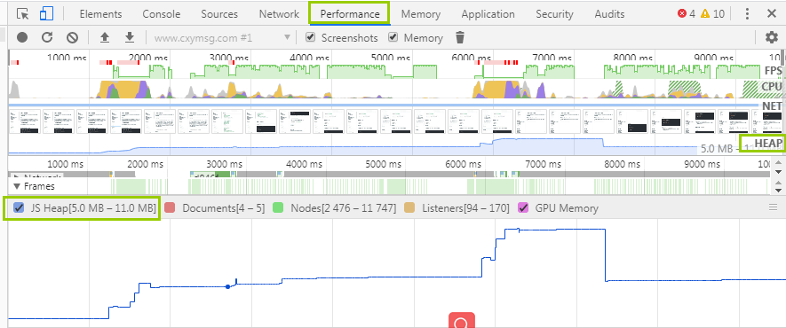
    - 打开开发者工具，选择 Performance 面板
    - 在顶部勾选 Memory
    - 点击左上角的录制按钮Record。
    - 在页面上进行各种操作，模拟用户的使用情况。
    - 一段时间后，点击对话框的 stop 按钮，面板上就会显示这段时间的内存占用情况。
    - 关注JS Heap，看到起点不断增高而没有释放内存，可能出现异常，点击预览图蓝色线增高点，看看执行了什么操作。去对应的函数中排查代码。

  - Chrome 中的 Memory 面板，可查看活动的Javascript对象（以及DOM节点）在内存中的分布
  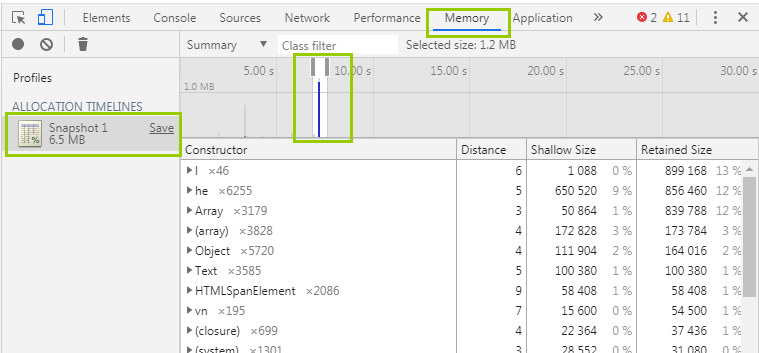
    - Heap snapshot 堆快照，可截操作前后的内存快照，进行对比分析。
    - on timeline 时间线，可开始录制操作，执行一段操作，选择内存增大的时间点分析。

## Web Worker
现代浏览器为JavaScript创造的 多线程环境。可以新建并将部分任务分配到worker线程并行运行，两个线程可 独立运行，互不干扰，可通过自带的 **消息机制** 相互通信，等worker完成计算任务，再将结果返回主线程，为了节省系统资源，使用完毕记得关闭。

- 基本用法:
  - 主线程
    ```js
    const worker = new Worker('work.js') // 来自网络的js文件
    worker.postMessage('Hello World') //主线程传给 Worker 的数据
    worker.onmessage = function(event) { //监听函数，接收子线程发回来的消息
        console.log('Received message' + event.data)
    }
    // 错误监控
    worker.onerror(function (event) {
      console.log([
        'ERROR: Line ', e.lineno, ' in ', e.filename, ': ', e.message
      ].join(''));
    });

    worker.terminate(); //任务完成，关闭
    ```
  - Worker线程(self代表子线程自身，即子线程的全局对象)
    ```js
    self.addEventListener('message', function (e) { // 监听message事件
      self.postMessage('You said: ' + e.data); // self.postMessage()方法用来向主线程发送消息。
    }, false);

    // 示例：
    self.addEventListener('message', function (e) {
      var data = e.data;
      switch (data.cmd) {
        case 'start':
          self.postMessage('WORKER STARTED: ' + data.msg);
          break;
        case 'stop':
          self.postMessage('WORKER STOPPED: ' + data.msg);
          self.close(); // self.close()用于在 Worker 内部关闭自身。
          break;
        default:
          self.postMessage('Unknown command: ' + data.msg);
      };
    }, false);

    // 加载其他脚本：
    importScripts('script1.js', 'script2.js');
    ```
- API
主线程
```js
Worker.onerror：指定 error 事件的监听函数。
Worker.onmessage：指定 message 事件的监听函数，发送过来的数据在Event.data属性中。
Worker.onmessageerror：指定 messageerror 事件的监听函数。发送的数据无法序列化成字符串时，会触发这个事件。
Worker.postMessage()：向 Worker 线程发送消息。
Worker.terminate()：立即终止 Worker 线程。
```
Worker
```js
self.name： Worker 的名字。该属性只读，由构造函数指定。
self.onmessage：指定message事件的监听函数。
self.onmessageerror：指定 messageerror 事件的监听函数。发送的数据无法序列化成字符串时，会触发这个事件。
self.close()：关闭 Worker 线程。
self.postMessage()：向产生这个 Worker 线程发送消息。
self.importScripts()：加载 JS 脚本。
```
- 优势：
    - 能够执行处理器密集型的运算而不会阻塞 UI 线程。
- 应用：
    - 
- 限制:
    - 同源限制：与主线程的脚本同源
    - DOM限制：无法使用 document / window / alert / confirm
    - 文件限制：无法读取本地资源

## 设计模式
- 面向对象的软件设计原则：开放封闭原则。
    - 对扩展开放，意味着有新的需求或变化时，可以对现有代码进行扩展，以适应新的情况。
    - 对修改封闭，意味着类一旦设计完成，就可以独立完成其工作，而不要对类进行任何修改。
    - 实现思路：通过面向对象的继承和对多态机制实现开放，让类依赖于固定的抽象实现封闭。
- 一句话：软件设计开发过程中，针对特点场景和问题的，更优解决方案。
- 核心操作：逻辑的变和不变分离，变的灵活，不变的稳定。
- 前端常见几种：
    - 策略模式
    - 发布-订阅模式
    - 装饰器模式
    - 适配器模式
    - 代理模式
    - 责任链模式
- 策略模式
    - 要实现某一个功能，有多种方案可以选择。我们定义策略，把它们一个个封装起来，并且使它们可以相互转换。
    - 场景：各判断条件下的策略相互独立且可复用；策略内部逻辑相对复杂；策略需要灵活组合
    - 例子：权限验证（多项条件封装成单独的函数，通过添加，可搭配组合）、表单验证
- 发布-订阅模式
    - 消息发布，通过event事件中心，进行广播，通知订阅者。
    - 场景：各模块相互独立；存在一对多的依赖关系；依赖模块不稳定、依赖关系不稳定；各模块由不同的人员、团队开发
    - 例子：流程启动成功后，发送消息中心，更新流程列表，通知审核。
        ```js
        // 简单实现：订阅事件中心
        const EventEmit = function() {
          this.events = {};
          this.on = function(name, cb) {
            if (this.events[name]) {
              this.events[name].push(cb);
            } else {
              this.events[name] = [cb];
            }
          };
          this.trigger = function(name, ...arg) {
            if (this.events[name]) {
              this.events[name].forEach(eventListener => {
                eventListener(...arg);
              });
            }
          };
        };
        // 业务代码
        let event = new EventEmit();
        event.trigger('success');
        
        MessageCenter.fetch() {
          event.on('success', () => {
            console.log('更新消息中心');
          });
        }
        Order.update() {
          event.on('success', () => {
            console.log('更新订单信息');
          });
        }
        Checker.alert() {
          event.on('success', () => {
            console.log('通知管理员');
          });
        }

        ```
- 装饰器模式
    -  一句话：在装饰器中传入一个要装饰的对象，动态的添加对象的行为。
    -  例子：赋予写英文的能力
        ```js
        const kuanWrite = function() {
          this.writeChinese = function() {
            console.log('我只会写中文');
          };
        };
        
        // 通过装饰器给阿宽加上写英文的能力
        const Decorator = function(old) {
          this.oldWrite = old.writeChinese;
          this.writeEnglish = function() {
            console.log('给阿宽赋予写英文的能力');
          };
          this.newWrite = function() {
            this.oldWrite();
            this.writeEnglish();
          };
        };
        
        const oldKuanWrite = new kuanWrite();
        const decorator = new Decorator(oldKuanWrite);
        decorator.newWrite();

        ```
- 适配器模式
    - 一句话：解决我们不兼容的问题，把一个类的接口换成我们想要的接口。类似转接口
- 代理模式
    - 一句话：为其它对象提供一种代理以控制这个对象的访问，具体执行的功能还是这个对象本身
    - 场景：模块职责单一且可复用；两个模块间的交互需要一定限制关系
    - 例子：发邮件，通过代理模式，那么代理者可以控制，决定发还是不发，但具体发的执行功能，是外部对象所决定。
        ```js
        // 屏蔽邮箱list
        const emailList = ['qq.com', '163.com', 'gmail.com'];
        // 代理
        const ProxyEmail = function(email) {
          if (emailList.includes(email)) {
            // 屏蔽处理
          } else {
            // 转发，进行发邮件
            SendEmail.call(this, email);
          }
        };
        
        const SendEmail = function(email) {
          // 发送邮件
        };
        
        // 外部调用代理
        ProxyEmail('cvte.com');
        ProxyEmail('ojbk.com');

        ```
- 责任链模式
    - 避免请求发送者里面执行请求接受者，让多个对象都有可能接收请求，将这些对象连接成一条链，并且沿着这条链传递请求。
    - 场景：你负责的是一个完整流程；各环节可复用；各环节有一定的执行顺序；各环节可重组
    - 例子：流程，上一个通过才能执行下一个。通过一个责任链的类，封装fn，setNext，run等方法，通过执行setNext设定下一步流程，执行run 方法开始启动流程。
        ```js
        // 解耦各节点：执行该流程：申请设备之后，接下来要选择收货地址，然后选择责任人
        const Chain = function(fn) {
          this.fn = fn;
          
          this.setNext = function() {}
        
          this.run = function() {}
        }
        
        const applyDevice = function() {}
        const chainApplyDevice = new Chain(applyDevice);
        
        const selectAddress = function() {}
        const chainSelectAddress = new Chain(selectAddress);
        
        const selectChecker = function() {}
        const chainSelectChecker = new Chain(selectChecker);
        
        chainApplyDevice.setNext(chainSelectAddress).setNext(chainSelectChecker);
        chainApplyDevice.run();
        ```