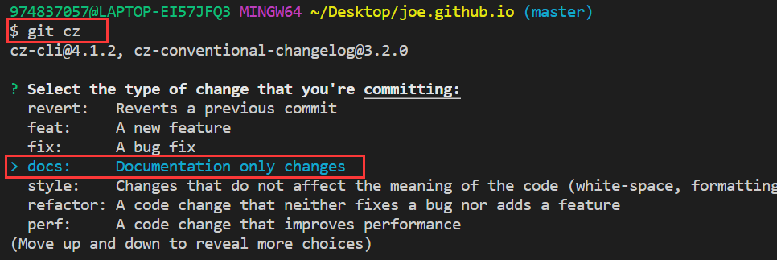
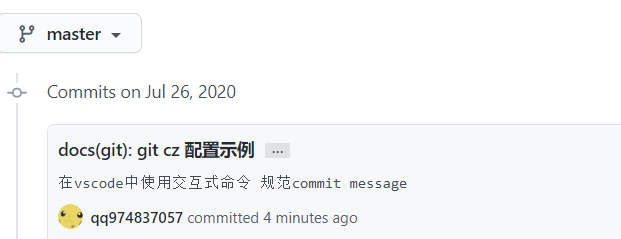

## 项目开发流程

总的来说有四个阶段：需求阶段、开发阶段、测试阶段、发布阶段

- 需求阶段：提交需求，评审，评估工作量和开发人员，定稿。
- 开发阶段：UI 开发，软件开发联调，提交测试。
- 测试阶段：UI 交互检查，SIT 环境测试，UAT 测试，大回归测试。
- 发布阶段：灰度发布，正式发布。

## 提交规范(git cz)

- [掘金参考](https://juejin.im/post/5afc5242f265da0b7f44bee4#heading-4)

> commitizen 可使用 git cz + cz-conventional-changelog 规范适配器 + commitlint 校验 + husky

- 作用：生成规范统一的 commit message，有助于团队成员 review 和项目管理。

- 最终提交格式：

```
<type>(<scope>): <subject> // 类型 范围 标题

<body> // 内容
```




> 注意：windows 下 git bash 无法使用交互式，可直接在 vscode 中使用终端配置 git bash，方可使用上下箭头移动交互。

- 安装：

  - 全局安装：需要 ~/.czrc 配置文件, 为 commitizen 指定 Adapter.

  ```
  npm install -g commitizen cz-conventional-changelog
  // 创建配置文件
  echo '{ "path": "cz-conventional-changelog" }' > ~/.czrc
  ```

  - 项目级安装

  ```
  npm install -D commitizen cz-conventional-changelog

  // package.json
  "script": {
      ...,
      "commit": "git-cz",
  },
   "config": {
      "commitizen": {
        "path": "node_modules/cz-conventional-changelog"
      }
   }
  ```

  - 安装 commitlint 校验规范： @commitlint/config-conventional (符合 Angular 团队规范) + husky(git hook 钩子) 在 commit 提交后进行 lint 校验.

  ```
  npm i -D @commitlint/config-conventional @commitlint/cli husky

  // 创建配置文件.commitlintrc.js，与package.json同级
  module.exports = {
    extends: [
      "@commitlint/config-conventional"
    ],
    rules: {
    }
  };

  // package.json
  "husky": {
      "hooks": {
        "commit-msg": "commitlint -e $GIT_PARAMS"
      }
  }
  ```

- 使用：

  ```

  命令：npm run commit or git cz(全局安装下可使用)

  1.Select the type of change that you're committing 选择改动类型 (<type>)

  2.What is the scope of this change (e.g. component or file name)? 填写改动范围 (<scope>)

  3.Write a short, imperative tense description of the change: 写一个精简的描述 (<subject>)

  4.Provide a longer description of the change: (press enter to skip) 对于改动写一段长描述 (<body>)

  5.Are there any breaking changes? (y/n) 是破坏性修改吗？默认n (<footer>)

  6.Does this change affect any openreve issues? (y/n) 改动修复了哪个问题？默认n (<footer>)

  // 生成的最终格式
  <type>(<scope>): <subject>
  <BLANK LINE>
  <body>
  <BLANK LINE>
  <footer>

  // 填写完毕后，husky会调用commitlint对message进行格式校验，默认规定type及subject为必填项。
  ```

- type 必填：当一次改动包括主要 type 与特殊 type 时，统一采用主要 type。
  ```
      # 主要
      feat：新功能
      fix： 修复bug
      # 特殊
      docs: 文档相关
      style： 代码格式：缩进、空格之类
      build： webpack构建工具或外部依赖变动如npm
      refactor：重构
      revert：执行git revert打印的message
  ```
- scope 必填：改动的范围，格式为项目名/模块名
  ```
  node-pc/common rrd-h5/activity
  ```
- subject: commit 的概述
- body：commit 的具体改动情况和原因
- break changes：破坏性修改：描述接口删除、迁移等
- affect issues: 影响的哪个 issues`（re #123、fix #123）`

## 代码规范(eslint)

- 常用规则：`eslint:recommended`
- 作用：统一代码风格，避免低级错误。常见规则如：分号，引号，禁止 console，禁止条件判断出现常量，禁止 return，break 后面出现不可到达代码等。
- 安装在开发环境

```
npm install eslint --save-dev
```

- 创建.eslintrc 文件（在根目录）

```
eslint --init
```

```js
// .eslintrc.js
module.exports = {
  // 指定解析器
  parse: "",
  // 指定脚本的运行环境
  env: {
    node: true,
    es6: true,
  },
  // 扩展引入规则
  extends: [
    // 同时对 .vue 文件中的 js 代码进行检测，就需要利用 eslint-plugin-vue 插件来搭配使用。
    "plugin:vue/essential",
    // 启用推荐的规则
    "eslint:recommended",
  ],
  // 别人可以直接使用你配置好的ESLint
  root: true,
  // 脚本在执行期间访问的额外的全局变量
  globals: {},
  // 启用的规则及其各自的错误级别
  rules: {
    // 禁止使用 console，提醒开发者，上线时要禁止
    "no-console": process.env.NODE_ENV === "production" ? "error" : "off",
    // 禁止 debugger 语句，提醒开发者，上线时要禁止
    "no-debugger": process.env.NODE_ENV === "production" ? "error" : "off",
  },

  // 指定解析器选项
  parserOptions: {
    parser: "babel-eslint",
  },
};
```

- 配置文件中引入规则配置

  - extends 扩展了（集成）配置，如 element 的
    - 增加了 eslint-plugin-vue 来更好的校验 vue 中的 js 代码。
    - 默认是严格的 plugin:vue/recommended 来校验代码，觉得太严格可修改为 essential。

  ```js
  npm install --save-dev eslint-config-elemefe

  'extends': [
      // 同时对 .vue 文件中的 js 代码进行检测，就需要利用 eslint-plugin-vue 插件来搭配使用。
      'plugin:vue/essential',
      // 启用推荐的规则
      'eslint:elemefe'
  ],
  ```

  - 或者覆盖规则，在 rules 中开启自定义
    - "semi"分号 和 "quotes"引号 是 ESLint 中 规则 的名称。第一个值是错误级别，可以使下面的值之一：
    - "off" or 0 - 关闭规则
    - "warn" or 1 - 将规则视为一个警告（不会影响退出码）
    - "error" or 2 - 将规则视为一个错误 (退出码为 1)

  ```js
  {
      "rules": {
          "semi": ["error", "always"],
          "quotes": ["error", "double"]
      }
  }
  ```

- 关闭校验
  - vcli3 以下：module.rules 中将 eslint-loader 给注释掉即可。
  - vcli3 以上：只要找到 vue.config.js 文件。 进行如下设置 lintOnSave: false 即可。
- 使用命令修复简单错误
  ```
  npm run lint -- --fix
  ```

## CodeReview

- review（强制+发版前+小片段+线上交流+高频率）（代码交流和人员成长，辅助产品质量）

  - 代码规范：明确 Coding 规则
  - 检视指南：消除困惑和迷茫
  - 总结优化：透明问题，持续优化（非常重要）
  - 激励机制：激发主观能动性

## 编码风格-分号

> 尤大总结：至于说 “很难总结什么时候加不加”，其实真的很简单。真正会导致上下行解析出问题的 token 有 5 个：括号，方括号，正则开头的斜杠，加号，减号。我还从没见过实际代码中用正则、加号、减号作为行首的情况，所以总结下来就是一句话：一行开头是括号或者方括号的时候加上分号就可以了，其他时候全部不需要。其实即使是这两种情况，在实际代码中也颇为少见。

- 大部分情况下：JS 引擎会自动为我们添加分号，叫自动分号插入(ASI)。
- 一些特殊场景：JS 判断不需要添加分号，就会导致问题，需要我们注意在特殊情况前面手动添加分号。
- 总结：如果不想在每句代码后面加分号，需要注意特殊情况如括号，方括号，正则开头的斜杠，加号，减号。在这些地方要手动加上分号。

- 使用 ESlint --fix 可以自动添加删除分号，风格迁移成本接近 0。
  - 配置 semi：
    - "always" （默认值）在语句结尾处需要分号
      ```js
      semi: ["error", "always"];
      ```
    - "never" 不允许分号作为语句的末尾（不包括那些为了消除歧义以 [，(，/，+，或 - 开头的语句）
      ```js
      semi: ["error", "never"];
      ```
    - 也可以用数字表示：0，1，2 分别表示 off, warning, error
