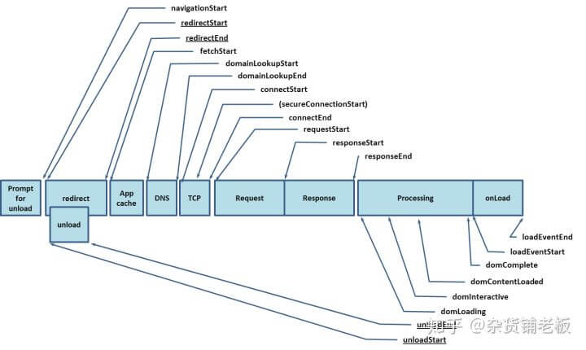
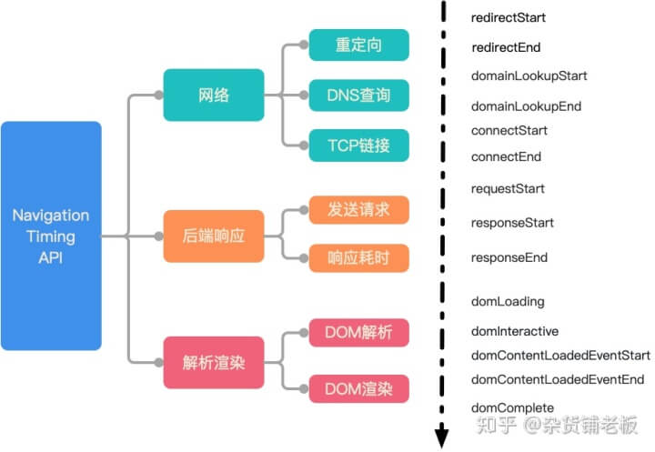
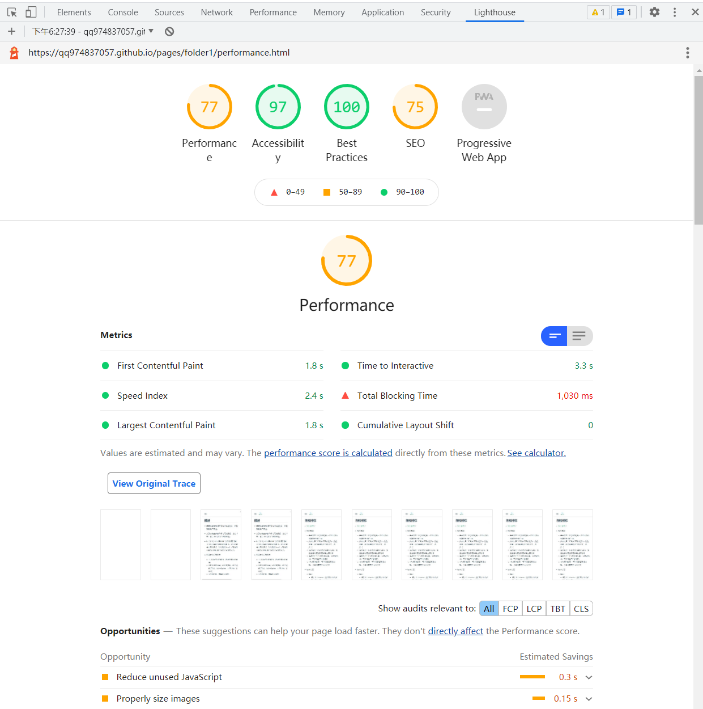
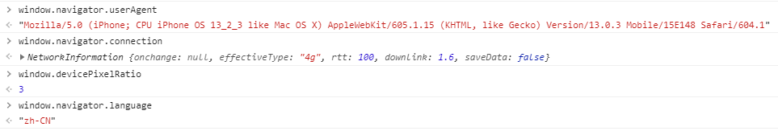
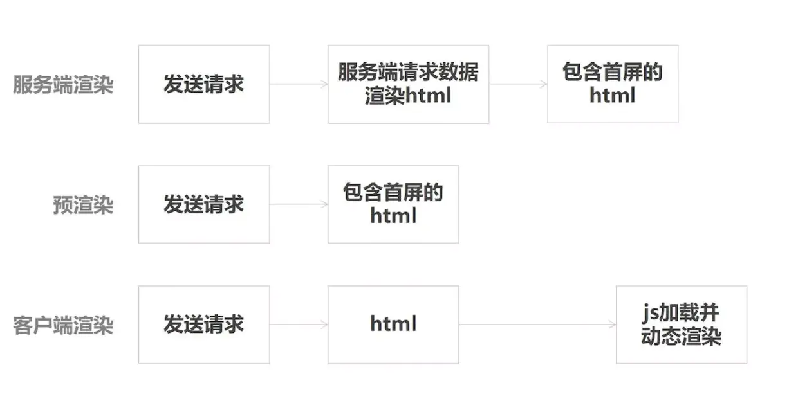
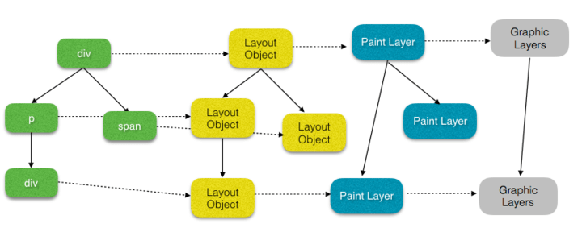
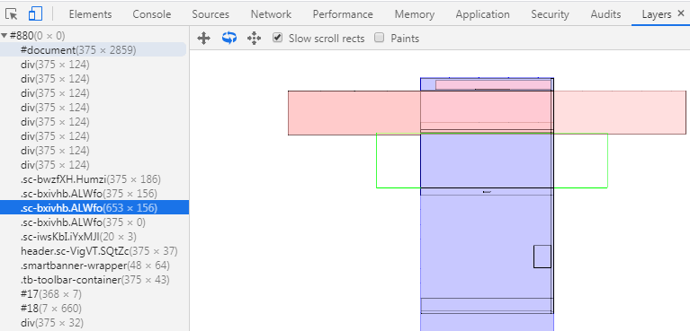

## 概述

- 前端应用最影响性能的是加载速度，直接影响用户体验。
- 大部分页面需要 2 秒内完成加载，超过 3 秒，接近 40%的用户离开网站。
- 所以优化方向就是让用户觉得加载得快！不仅包括加载指标速度的提升，还包括提高用户的体验，如有趣的 loading 或顺畅的骨架屏会让用户感觉并没有等太久。

- 性能优化方案步骤
  - 1.分析目前性能缺陷，确定性能提升目标
  - 2.针对特定场景，做对应方案，如加载时(首屏)，运行时(动画、内存泄漏、长列表)
  - 3.实施方案，查看优化效果

## 性能指标

- [知乎参考](https://zhuanlan.zhihu.com/p/82981365)
- 指标概念

  - 是否发生？FP(首次绘制) - 屏幕首次有视觉变化的时间点
  - 是否发生？FCP(首次内容绘制) - 浏览器第一次向屏幕绘制内容(文本、图片...)
  - 是否有用？FMP(首次有意义绘制) - 页面主要内容出现在屏幕上的时间
  - 是否可用？TTI(可交互时间) - 已渲染完毕，可以响应用户的操作
  - FPS(每秒帧率) - 每秒钟画面更新次数，大部分屏幕为 60 次/秒

- 统计方式
  - 整体：
    - 通过 Performance 工具可以用来录制一段时间的 CPU 占用、内存占用、FPS 等运行时性能问题，如 Bottom Up 看出一段时间较耗时的操作。
    - 通过 Network 工具或者代码统计页面的加载时间来分析加载性能问题。
  - 手动查看分析：**Chrome DevTools - Performance** 面板
    - Timings:查看 FP、FCP、FMP
    - CPU:通过下方的 summary 查看占用比例
      - Loading: 网络通信和 HTML 解析
      - Scripting: JS 执行
      - Rendering: 样式计算和布局
      - Painting: 重绘
      - System: 其它事件花费的时间
      - Idle: 空闲时间
      - Total: 总耗时
    - Main：倒置火焰图，横坐标表示消耗时间，纵坐标为函数调用栈，最上层是父级函数，最下方是调用栈最顶端的函数，可关注哪个函数占据宽度最大，平顶可能表示函数有性能问题。除了函数的耗时，还有 Recalculate Style：样式计算。Layout：布局位置。
    - Frames:FPS 帧率，水平线越低且持续时间长，同时上方会出现红色线条，代表画面卡顿。
    - Rendering：勾选 FPS，可查看帧率和 GPU 内存使用情况
  - 代码：使用 API[window.performance.timing](https://developer.mozilla.org/zh-CN/docs/Web/API/PerformanceTiming)，时间戳单位都是毫秒。
    
    
    - 起始点可选择：navigationStart(在 URL 输入栏回车或者页面按 F5 刷新的时间点) vs fetchStart(准备用 HTTP 请求获取文档的时间，除去重定向)
    - 白屏时间：从用户再按下回车的瞬间 navigationStart 到 解析器完成工作 domInteractive(即能看到第一个内容)
    ```js
    let t = window.performance.timing;
    let blankTime = t.domInteractive - t.navigationStart; // 白屏时间
    let firstTime = t.domContentLoadedEventEnd - t.navigationStart; // 首屏加载时间
    let tcpTime = t.connectEnd - t.connectStart; // tcp连接耗时
    let dnsTime = t.domainLookupEnd - t.domainLookupStart; // dns查询耗时
    ```
  - Lighthouse 网站性能测评工具
    - 运行后会根据实际情况给出对应的评分和建议
    - 有 Performance 页面性能、PWA（渐进式 Web 应用）、Accessibility 可访问性（无障碍）、Best Practices 最佳实践、SEO 的评分
    - 有 FCP、FMP 等时间
      
- 数据上传
  - `navigator.sendBeacon(url, data);`通过 HTTP 将少量数据**异步传输**到 Web 服务器(不支持 IE)
  - 同步的缺点：导致卸载延时。统计和诊断代码通常要在 unload 或者 beforeunload 事件处理器中发起一个同步 XMLHttpRequest 来发送数据。同步的 XMLHttpRequest 迫使用户代理延迟卸载文档，并使得下一个导航出现的更晚。
  - 异步 sendBeacon 的优点：不会导致延迟。使用 sendBeacon() 方法会使用户代理在有机会时异步地向服务器发送数据，同时不会延迟页面的卸载或影响下一导航的载入性能。这就解决了提交分析数据时的所有的问题：数据可靠，传输异步并且**不会影响下一页面的加载**。
  ```js
  window.addEventListener("unload", logData, false);
  function logData() {
    navigator.sendBeacon("/log", analyticsData);
  }
  ```
  - 或者使用`new Image()`方式自动 get 请求，进行降级上报。
- 注意：

  - 白屏时间可以通过 FP、FCP 来粗略代替，精确则使用`window.performance.timing`。
  - SPA 通过`window.performance.timing`，只是首次加载的数据。改变 URL 实际不刷新页面，该 API 是无法获取子路由对应的页面相关时间。

    ```js
    // FP
    function getFPTime() {
      const timings = performance.getEntriesByType("paint");
      return timings ? Math.round(timings[0].startTime) : null;
    }
    // FCP
    function getFCPTime() {
      const timings = performance.getEntriesByType("paint");
      return timings.length > 1 ? Math.round(timings[1].startTime) : null;
    }

    // FMP 尚无标准化的定义

    // TTI 谷歌npm包 - tti-polyfill

    // FPS
    // 不掉帧的情况，requestAnimationFrame 这个方法在一秒内会执行 60 次。
    // 假设动画在时间 A 开始执行，在时间 B 结束，耗时 x ms。
    // 而中间 requestAnimationFrame 一共执行了 n 次，则此段动画的帧率大致为：n / (B - A)。

    // 设备信息
    window.navigator.userAgent; // 获取用户设备信息
    window.navigator.language; // 获取用户设备语言
    window.navigator.connection; // 获取设备网络信息
    window.devicePixelRatio; // 获取设备像素比
    ```

    

- 注意：

  - FP 和 FCP 可能是相同的时间，也可能是先 FP 后 FCP
  - 帧率能够达到 50 ～ 60 FPS 的动画将会相当流畅，让人倍感舒适；帧率在 30 FPS 以下或者帧率波动很大的动画，让人感觉到明显的卡顿和不适感；

- 获取函数执行耗时

  - 只能控制台调试用(不要在生产环境使用)
    - `console.time('1');fn();console.timeEnd('1');`
  - 获取时间戳，然后相减。
    - `Date.now();` 时间精度为 毫秒（10^-3）级别；
    - `new Date().getTime();`
    - `+new Date();`
  - 更精确的方案
    - 浏览器：`window.performance.now()`获取从`window.performance.timing.navigationStart`到当前时刻的毫秒数，带小数点。`performance.timing.navigationStart + performance.now()` 约等于 `Date.now()`。
    ```js
    function doSomething() {
      for (let i = 0; i < 1000; i++) {
        i = i + 1;
      }
    }
    let t0 = window.performance.now();
    doSomething();
    let t1 = window.performance.now();
    console.log("doSomething函数执行了" + (t1 - t0) + "毫秒.");
    // doSomething函数执行了0.09499990846961737毫秒.
    ```
    - Node 环境：`process.hrtime.bigint()`，直接通过两个 bigint 相减来计算差异。在 Node.js 程序中，优先选 `process.hrtime`，其次选 `performance.now`，最后才会是 `Date.now`。
    ```js
    const start = process.hrtime.bigint();
    // 191051479007711n
    setTimeout(() => {
      const end = process.hrtime.bigint();
      // 191052633396993n
      console.log(`基准测试耗时 ${end - start} 纳秒`);
      // 基准测试耗时 1154389282 纳秒
    }, 1000);
    ```

- 打包后文件体积

  ```
  npm run build -- --report 查看打包后的大小
  ```

  - 主要是 vendors 依赖包文件 js 较大，和 app 主代码块较大，下面为某项目举例
    - stat 原始大小 2.7mb
    - parsed 压缩插件处理后 1.08mb (40%)
    - gzip 压缩后 300kb (10%)

## 客户端渲染&服务端渲染&预渲染

- 客户端渲染：用户访问 url，请求 html 文件，前端在浏览器跑一遍 JS，生成 DOM，渲染页面。关键链路较长，有一定的白屏时间；
- 服务端渲染：用户访问 url，服务端根据访问路径请求所需数据，拼接成 html 字符串，将响应返回给前端。前端接收到 html 时已有内容；
- 预渲染：构建阶段生成匹配预渲染路径的 html 文件（注意：每个需要预渲染的路由都有一个对应的 html）。构建出来的 html 文件已有部分内容。不适合个性化、经常变化的内容使用预渲染。
  

- 客户端渲染(CSR)

  - 特点：需要跑 JS 生成 DOM，HTML 初始时没具体内容
  - 优点：客户端体验好
  - 缺点：首屏加载慢，不利于 seo(抓取不到通过 Ajax 获取到的内容)

- 服务端渲染(SSR)
  - 特点：不需要跑 JS，响应已经返回有内容的 HTML
  - 优点
    - 更好的 SEO：数据已包含在页面，无须异步 Ajax 获取内容，方便爬虫抓取。
    - 首屏加载更快：直接渲染好后返回，无须再下载 js 再渲染。
  - 缺点
    - 服务器负载压力大：用户过多，将原本属于服务器的渲染压力分到服务器上，负载太大。
    - 开发条件限制：只支持 beforeCreate 和 created 两个钩子函数，一些外部扩展库需要特殊处理。且服务器需要处于 Node.js 运行环境。
  - 原理
    - 将框架的实例转为字符串
    - 将字符串塞入模板里，返回响应给用户

## 加载时

> 加载时可以以首屏加载速度来做优化

- [参考](https://zhuanlan.zhihu.com/p/37148975)

### 首屏加载

> 首屏的加载速度很重要,过长的白屏会导致用户流失。
> WEEX 生成的是 JS 渲染成原生组件，此部分不适用

- 用户体验感知

  - 前置简单 loading：插件 html-webpack-plugin，将 loading 提前到白屏时展示(首屏体积 = html + css)，不需要等 JS 加载，写好 loading 的 html 和 css，在 html 中使用模板插入对应的 loading 变量到根节点。

  ```html
  <!DOCTYPE html>
  <html lang="en">
    <head>
      <%= htmlWebpackPlugin.options.loading.css %>
    </head>

    <body>
      <div id="root"><%= htmlWebpackPlugin.options.loading.html %></div>
    </body>
  </html>
  ```

  - 骨架屏占位：插件**vue-server-renderer**，展示大体结构，视觉过渡流畅。
    - 将 vue 文件转为 html 和 css 字符串，骨架屏的样式通过`<style></style>`标签直接被插入，而骨架屏的内容也被放置在`div#app`之间

- 网络和缓存
  - HTTP2：二进制分帧、多路复用、头部压缩、服务端推送
  - CDN 缓存提高资源加载速度
  - 拆包 + 缓存策略：webpack 4.x 对 SplitChunksPlugin 插件进行拆包配置 + 强制缓存和协商缓存，将第三方库分别拆开设置较长的强缓存时间并加上 hash
    - 如基础型的 react 等库与工具性的 lodash 和特定库 Echarts 进行拆分
  - 组件的缓存 keep-alive
    - 在页面已经跳转后依然不销毁组件,保存组件的实例在内存中,再次渲染时可以利用缓存的组件实例。
    - 大量实例不销毁,保存在内存中,存在内存泄漏的风险,要调用 deactivated 销毁。
- 懒加载
  - 图片懒加载（vue-lazyload）原理：进入可视区域再加载图片
    - 使用：src 换成 v-lazy
    ```html
    
    ```
  - 路由懒加载（不同路由组件分割代码块 chunk，访问该路由才加载对应 js）结合 Vue 的异步组件和 Webpack 的代码分割(Code Splitting)功能
    ```js
    const Foo = () => import("./Foo.vue");
    const router = new VueRouter({
      routes: [{ path: "/foo", component: Foo }],
    });
    ```
  - 组件级别懒加载
    - 思路：IntersectionObserver 条件判断是否出现在屏幕(图片懒加载也使用过此 API) + v-if 指令渲染组件 + 骨架屏触发屏幕条件判断(大体灰白结构)
- 减少体积

  - Tree Shaking：webpack4.x 默认支持，基于 ES6 的 modules，要设置 modules: false 避免转为 commonjs 规范。
  - gzip 压缩：效果 Content-Encoding：gizp，文件大小降为 30%。服务器 nginx 设置压缩比等 或者 前端安装 compression-webpack-plugin，再配置 productionGzip，构建时生成.gz 文件，服务器就无须再压缩。一般图片不压缩。

    - nginx

    ```
    // nginx的配置方式
    http {
      gzip on;
      gzip_static on;
      gzip_min_length 1024;
      gzip_buffers 4 16k;
      gzip_comp_level 2;
      gzip_types text/plain application/javascript application/x-javascript text/css application/xml text/javascript application/x-httpd-php application/vnd.ms-fontobject font/ttf font/opentype font/x-woff image/svg+xml;
      gzip_vary off;
      gzip_disable "MSIE [1-6]\.";
    }
    ```

    - 前端：config/index.js 里有一个 productionGzip 设置为 true，前端进行 gzip 压缩生成.gz 文件。nginx 的 gzip_static 设为 on，就直接使用同名.gz 文件，不用占用服务器 CPU 资源自己压缩。
    - express：

    ```
    npm i express compression

    // serve.js
    var express = require('express')
    var app = express()

    // 开启gzip压缩,如果你想关闭gzip,注释掉下面两行代码，重新执行`node server.js`
    var compression = require('compression')
    app.use(compression())

    app.use(express.static('dist'))
    app.listen(3000,function () {
      console.log('server is runing on http://localhost:3000')
    })

    node server.js
    ```

  - CDN：剥离第三方库依赖（vue、element-ui）放在 cdn 如 jsDelivr，在 html 中通过 script 引入，不会被打包到代码文件 vendor.js 中，减少包的体积，降低自己服务器压力，CDN 提升依赖加载速度。【如 vue、vue-router、vuex、element-ui 和 axios】，使用 CDN 后卸载对应 npm 包【npm uninstall ...】

    - 将依赖的 vue、vue-router、vuex、element-ui 和 axios 这五个库，改为通过 CDN 链接获取。借助 HtmlWebpackPlugin,可以方便的使用循环语法在 index.html 里插入 js 和 css 的 CDN 链接。

    ```js
    <!-- CDN文件，配置在config/index.js下 -->
    // config/index.js
    module.exports = {
      build: {
        cdn: {
          css: [
            "https://unpkg.com/element-ui/lib/theme-chalk/index.css",
          ],
          js: [
            "https://cdn.jsdelivr.net/npm/vue@2.5.17/dist/vue.min.js",
            "https://cdn.jsdelivr.net/npm/vue-router@3.0.1/dist/vue-router.min.js",
            "https://cdn.jsdelivr.net/npm/vuex@3.0.1/dist/vuex.min.js",
            "https://unpkg.com/element-ui/lib/index.js",
            "https://cdn.jsdelivr.net/npm/axios@0.18.0/dist/axios.min.js"
          ]
        }
      }
    }

    // build/webpack.prod.conf.js

    new HtmlWebpackPlugin(Object.assign(
      { ... },
      config.build.cdn
    )),
    ```

    ```html
    // index.html - 通过模板引入循环插入html
    <head>
      <% for (var i in htmlWebpackPlugin.options.css) { %>
      <link href="<%= htmlWebpackPlugin.options.css[i] %>" rel="stylesheet" />
      <% } %>
    </head>
    <body>
      <% for (var i in htmlWebpackPlugin.options.js) { %>
      <script src="<%= htmlWebpackPlugin.options.js[i] %>"></script>
      <% } %>
    </body>
    ```

    - 在 build/webpack.prod.conf.js 中添加如下代码,使用 CDN 引入外部文件的情况下，依然可以在项目中使用 import 的语法来引入这些第三方库，也就意味着你不需要改动项目的代码，这里的键名是 import 的 npm 包名，键值是该库暴露的全局变量。

    ```js
    // build/webpack.prod.conf.js
    externals: {
      'vue': 'Vue',
      'vue-router': 'VueRouter',
      'vuex': 'Vuex',
      'element-ui':'ELEMENT',
      'axios':'axios'
    }
    ```

  - 动态加载 ES6 代码：ES6 意味着不用经过 Babel 转译，体积更小，性能更好，`<script type="module">`这个标签来判断浏览器是否支持 es6。

- 预渲染&服务端渲染

  - 预渲染：插件**prerender-spa-plugin**，预渲染静态 html 内容，构建过程中，在 dist 目录中开启一个静态服务器，使用无头浏览器（puppeteer）访问对应的路径，执行 JS，捕获内容并输出 html 文件，放在指定路由同名的文件夹，访问时返回对应的已渲染好的 index.html 文件，适合静态内容多的页面（不考虑动态数据的话）。

    - router 设为 history 模式，然后安装插件

    ```
    npm i prerender-spa-plugin --save-dev

    ```

    - 添加配置，定义需要预渲染的路由

    ```js
    //  build/webpack.prod.conf.js
    const PrerenderSPAPlugin = require('prerender-spa-plugin')
    ...
    new PrerenderSPAPlugin({
      staticDir: config.build.assetsRoot,
      routes: [ '/', '/Contacts' ], // 需要预渲染的路由（视你的项目而定）
      minify: {
        collapseBooleanAttributes: true,
        collapseWhitespace: true,
        decodeEntities: true,
        keepClosingSlash: true,
        sortAttributes: true
      }
    })
    ```

    - 调整 main.js

    ```js
    // 激活静态HTML，使他们成为动态的，可根据后续数据变化调整。
    // 强制使用应用程序的激活模式
    new Vue({
      router,
      render: (h) => h(App),
    }).$mount("#app", true);
    ```

  - SSR 服务端渲染(nuxt.js)

- 图片的几种优化方式
  - 选择合适的格式：复杂和色彩层次丰富的用 jpg，线条和颜色简单如 logo 用 png，想要不失真可以用 svg，webp 兼容性不好，不推荐。
  - 小 icon 使用 base64，可直接将字符串解码为图片，不用发 HTTP 请求，webpack 的 url-loader 可以进行配置
  - 图片懒加载
  - srcset 像素密度描述符对应几倍图
    ```html
    
    ```

#### 图片懒加载原理

```html
<div class="img-area">
  
</div>
<div class="img-area">
  
</div>
```

- 原理：
  - ``标签的 src 属性先设置为空或者为默认图片的 url，这样图片为空或默认图片。
  - 再设置 data-src 为真实的 url，判断图片进入可视区域，通过 el.dataset 将真实 url 取出
  - 放入 src 属性中，浏览器发出请求，显示正常图片。

> alt 属性是一个必需的属性，它规定在图像无法显示时的替代文本。

> data-\* 全局属性：构成一类名称为自定义数据属性的属性，可以通过 HTMLElement.dataset 来访问。

- 实现方法（2 种）：

  - getBoundingClientRect

    - 获取元素大小和位置，针对视口左上角的坐标而言
    - 返回的对象包括 top、right、botton、left、width、height 属性
    - 判断图片已出现在屏幕中：el.getBoundingClientRect().top<=window.clientHeight （图片到可视区域顶部的距离）<=(可视区域的高度)
    - 加载方法是将 src 赋值为真实 url：el.src = el.dataset.src

    - 首次进入页面【window.onload】或者滚动条滚动【window.onscroll】时遍历所有图片，若出现在屏幕内，则加载。
    - 优化：滚动条滚动检查图片采取使用节流函数；滚动时只检查剩余的图片；

  - 示例 1：

    ```js
    function isInSight(el) {
      const bound = el.getBoundingClientRect();
      const clientHeight = window.innerHeight;
      //如果只考虑向下滚动加载
      //const clientWidth = window.innerWeight;
      return bound.top <= clientHeight + 100;
    }

    function checkImgs() {
      const imgs = document.querySelectorAll(".my-photo");
      Array.from(imgs).forEach((el) => {
        if (isInSight(el)) {
          loadImg(el);
        }
      });
    }

    function loadImg(el) {
      if (!el.src) {
        const source = el.dataset.src;
        el.src = source;
      }
    }
    ```

  - IntersectionObserver

    - 首次进入页面，通过新建 IntersectionObserver 对象 io 并传入 callback 函数，用 io.observe 方法监听每个图片 dom 节点，当比例大于 0 小于 1 时，执行加载图片，加载完毕 io.unobserve 关掉该图片 dom 节点的监听。
    - callback 函数传入参数为数组，每个元素有自己的 target（dom 节点）和 intersectionRatio（在屏幕中出现比例）
    - 回调函数进行遍历每个元素执行下面操作
      - 判断图片已出现在屏幕中:intersectionRatio > 0 && intersectionRatio <= 1
      - 加载方法是将 src 赋值为真实 url：el.src = el.dataset.src
      - el.onload 后关闭观察器 io.unobserve(el)。

    ```js
    var io = new IntersectionObserver(callback, option);
    io.observe(document.getElementById("example")); // 开始观察
    io.unobserve(element); // 停止观察
    io.disconnect(); // 关闭观察器
    ```

    - 兼容性
      - Chrome 51+（发布于 2016-05-25）
      - Firefox 55
      - iOS 12.2

  - 示例 2：

    ```js
    const io = new IntersectionObserver((ioes) => {
      ioes.forEach((ioe) => {
        const el = ioe.target;
        const intersectionRatio = ioe.intersectionRatio;
        if (intersectionRatio > 0 && intersectionRatio <= 1) {
          loadImg(el);
        }
        el.onload = el.onerror = () => io.unobserve(el);
      });
    });

    function checkImgs() {
      const imgs = Array.from(document.querySelectorAll(".my-photo"));
      imgs.forEach((item) => io.observe(item));
    }

    function loadImg(el) {
      if (!el.src) {
        const source = el.dataset.src;
        el.src = source;
      }
    }
    ```

> 注意：获取 dom 之后要将所有图片 dom 节点转为数组对象才能使用数组遍历方法：Array.from

## 运行时

> 高性能要求的场景，优化代码执行速度，主要分为动画优化、减少回流重绘、减少内存泄漏、长列表优化、多线程运行。

### 渲染原理介绍

- 展示总体步骤
  

  - JS 实现动画或新增 DOM -> Style 计算样式 -> Layout 进行布局计算位置 -> Paint 绘制 -> Composite 渲染层合并

- Composite 详细流程
  
  - Nodes 到 LayoutObjects(布局对象)
    - 每个 Node 节点都有一个对应的 LayoutObject，保存样式位置信息，构成一个树。
  - LayoutObjects 到 PaintLayers(渲染层)
    - 根据层叠上下文的位置创建新渲染层，也有特殊情况会创建新的渲染层。
  - PaintLayers 到 GraphicsLayers(图形层)
    - 合成层拥有独立的图形层，其他渲染层公用一个图形层。每个图形层会生成位图，交给 GPU 将多个位图合成， 然后展现在屏幕上。
  - 层压缩
    - 大量合成层消耗内存，影响性能，所以浏览器会进行自动层压缩，但有些是压缩不了的。

### 提升动画性能

- 动画的三种实现方式

  - CSS3
  - Canvas + JS
  - DOM + JS (非常容易引起回流重绘，尽量避免)

- CSS 动画优化

  - 原则：
    - 尽量将动画提升为一个独立图层(合成层)，避免动画效果导致重绘影响其他渲染层的元素
    - 尽量利用 GPU 硬件加速(提示为合成层也就会用到硬件加速啦)
    - 尽量避免回流和重绘，除了常规的避免，在合成层上使用 transform 和 opacity 也不会导致回流重绘。
  - 提升为合成层的较好的两种方式：

    - CSS 的 will-change 属性。will-change 设置为 opacity、transform、top、left、bottom、right（其中 top、left 等需要设置明确的定位属性，如 relative 等）

    ```css
    #target {
      will-change: transform;
    }
    ```

    - 如不支持，使用 3D transform 属性强制提升。

    ```css
    #target {
      transform: translateZ(0);
    }
    ```

  - 提升为合成层好处
    - 合成层的位图会交给 GPU 合成，速度比 CPU 快
    - 需要重绘时，只重绘自身，不会影响其他层
    - 可以使用 transform 和 opacity 实现动画效果，不会引发回流重绘，在其他渲染层就会。
  - 查看合成层
    - 简单：DevTools，勾选上 Layer Borders
    - 详细：More Tools，添加 Layers 选项卡
    - 可关注 Composite 渲染层合并的时间来优化合成层的数量。
      
  - 硬件加速原理：
    - 让容器有自己的单独的渲染层，由 GPU 直接处理完成样式或其他的处理。
  - 硬件加速开启方式
    - will-change
    - 3D transform
    - video 元素
    - backface-visibility 为 hidden 的元素(翻转后背面不可见)
    - ...
  - 硬件加速优缺点
    - 建议：只在需要的情况下开启，不要滥用
    - 优点：提高渲染速度
    - 缺点：额外内存消耗，耗电量增加

- Canvas 动画优化
  - 使用 requestAnimationFrame 替代 setInterval 来做动画循环
  - 使用 web worker 分担主线程压力，解决大量数据计算，大量 DOM 操作的卡顿问题

### 减少回流重绘

- 重排（回流）：节点尺寸需要重新计算，重新排列元素，引起局部或整个页面重新渲染
- 重绘：样式发生变化，更新外观内容
- 重绘不一定出现重排
- 重排一定会出现重绘

#### 如何触发

- 改变 DOM 元素的几何属性：width、height、padding、margin、left、top、border
- 获取即时性属性：offsetTop、offsetLeft、 offsetWidth、offsetHeight、scrollTop、scrollLeft、scrollWidth、scrollHeight、clientTop、clientLeft、clientWidth、clientHeight
- 增加、删除、更新、移动 DOM 或者 动画
- display: none 隐藏一个 DOM 节点 -> 回流和重绘
- visibility: hidden 隐藏一个 DOM 节点 -> 重绘

#### 如何优化

- 集中改变样式
  - 改变 class（类名）的方式
    ```js
    // 判断是否是黑色系样式
    const theme = isDark ? "dark" : "light";
    // 根据判断来设置不同的class
    ele.setAttribute("className", theme);
    ```
- 离线操作 DOM
  - DocumentFragment：createDocumentFragment 在 dom 树之外创建游离节点，该节点上批量操作，再插入 dom，一次重排
    ```js
    var fragment = document.createDocumentFragment();
    for (let i = 0; i < 10; i++) {
      let node = document.createElement("p");
      node.innerHTML = i;
      fragment.appendChild(node);
    }
    document.body.appendChild(fragment);
    ```
  - display:none，从页面移除该元素，再操作完后添加回来
    ```js
    let container = document.getElementById('container')
    container.style.display = 'none'
    container.style.width = '100px'
    container.style.height = '200px'
    container.style.border = '10px solid red'
    container.style.color = 'red'
    ...（省略了许多类似的后续操作）
    container.style.display = 'block'
    ```
- 提升至合成层
  - CSS 的 will-change
    ```css
    #target {
      will-change: transform;
    }
    ```
  - 重绘时只会影响合成层，不会影响其它层
  - transform 和 opacity 效果，不会触发 layout 和 paint

### 减少内存泄漏

- [参考](https://mp.weixin.qq.com/s?__biz=MzUxMzcxMzE5Ng==&mid=2247496779&idx=2&sn=892d968a86ebd083582ae2e28f48ab8f&chksm=f9524108ce25c81e960471a63357cf2bc59971e2a22ca9549f67c5266100474712fcaa208f28&mpshare=1&scene=1&srcid=&sharer_sharetime=1592813500572&sharer_shareid=f72feefcc9c2c137677aa7f49d02e0f4&key=5275bdb85f6fecb5b863a0f4364938b0f20d3068a623c70bb17408602e09ad9840bc8824054c5f5f3e8b5fdacdf41cf6d13413049806b41cdb497e6abe7e48742dabb92c99874d17f7c19bace4019ecd&ascene=1&uin=MjI1NjQ0MTU1&devicetype=Windows+7+x64&version=62090523&lang=zh_CN&exportkey=AZvo2t51y73c8EhAeN7gjAk%3D&pass_ticket=KfXN%2BILZIw36ijjDu%2F7KSM38UJxJ2Cjf8FTYPf6jp%2Fg%3D)
- 价值：保持小内存开销，有利于用户体验；避免因为内存泄漏，导致浏览器奔溃；
- 内存泄漏往往会发生在使用 Vue 之外的其它进行 **DOM 操作**的三方库时。请在适当的时机做必要的组件清理，比如 beforeDestroy 钩子中。
- 查看内存泄露：

  - Chrome 中的 Performance 面板，可视化查看内存的变化情况，找出异常点。
    

    - 打开开发者工具，选择 Performance 面板
    - 在顶部勾选 Memory
    - 点击左上角的录制按钮 Record。
    - 在页面上进行各种操作，模拟用户的使用情况。
    - 一段时间后，点击对话框的 stop 按钮，面板上就会显示这段时间的内存占用情况。
    - 关注 JS Heap，看到起点不断增高而没有释放内存，可能出现异常，点击预览图蓝色线增高点，看看执行了什么操作。去对应的函数中排查代码。

  - Chrome 中的 Memory 面板，可查看活动的 Javascript 对象（以及 DOM 节点）在内存中的分布
    
    - Heap snapshot 堆快照，可截操作前后的内存快照，进行对比分析。
    - on timeline 时间线，可开始录制操作，执行一段操作，选择内存增大的时间点分析。

- [分析 Chrome 性能调试工具 Timeline 简介](https://www.jianshu.com/p/f27b27167125)

> 下面是可能导致内存泄漏的情况及预防

- 滥用全局变量: 如未声明的变量，在函数中滥用 this 指向全局对象，无法被回收
  - 预防：使用严格模式（"use strict"）
- 闭包(返回子函数): 父执行完后，子函数中引用父的变量无法被释放，导致引用的变量被保留。
  - 预防：会用到，但要知道何时创建，保留哪些对象
- 定时器: 未被正确关闭，导致所引用的外部变量无法被释放
  - 预防：必要时销毁定时器如 clearInterval
- 事件监听: 没有正确销毁，如使用监听执行匿名函数，无法使用 removeEventListener() 将其删除
  ```js
  document.addEventListener("keyup", function () {
    doSomething(hugeString);
  });
  ```
  - 预防：
    - 将执行函数的引用传递进 removeEventListener，来注销事件监听。
    - 还可以使用 addEventListener() 第三个参数`{once: true}`，在处理一次事件后，将自动删除侦听器函数。
    ```js
    function listener() {
      doSomething(hugeString);
    }
    document.addEventListener("keyup", listener);
    document.removeEventListener("keyup", listener);
    ```
- DOM 引用: 在全局中对 DOM 节点的直接引用，删除该 DOM 节点，也不会被垃圾回收
  ```js
  function createElement() {
    const div = document.createElement("div");
    div.id = "detached";
    return div;
  }
  const detachedDiv = createElement();
  document.body.appendChild(detachedDiv);
  // this will keep referencing the DOM element even after deleteElement() is called
  ```
  - 预防：
    - 使用弱引用 WeakSet 和 WeakMap 保存 DOM 的引用
    - 将对 DOM 的引用移入函数局部作用域，函数使用完，局部变量对 DOM 的引用被销毁。
  ```js
  function createElement() {...}
  function appendElement() {
      const detachedDiv = createElement(); // DOM的引用放在函数内
      document.body.appendChild(detachedDiv);
  }
  appendElement();
  ```
- React 常见内存泄漏
  - 卸载组件，异步请求未取消
  - 卸载组件，事件监听未取消
  - 卸载组件，定时任务未清除
  - console.log 打印错误，保持了对 DOM 的引用

### 节流防抖【参考 JS 章节】

### 大数据长列表性能

> 前端渲染大量数据上千行，不允许分页情况下，容易导致卡顿，掉帧现象。

- 解决方案：

  - 虚拟列表 - 只渲染可视区域的数据
  - 时间分片 - 使用 setTimeout 拆分密集型任务
  - Web Worker - 与主线程并行的独立线程，通过 onmessage 和 postMessage 接口进行通信，完成大量的数据计算，结果返回主线程，由主线程更新 DOM 元素。
  - 触底请求分页+节流优化滚动(允许分页请求条件下)

- 常见场景：
  - 插件关联时：不选择对应品类的话，会展示所有品类的全部版本插件，每个插件可能是几十上百个版本，所有品类最多可上万条版本数据供关联。

#### 长列表渲染-虚拟列表 ✨

- 原因：DOM 元素的创建和渲染时间成本很高,大数据完整渲染列表比较慢。
- 场景：适用复杂情况的列表 item，如 element-ui 组件
- 原理：从总数据取一部分数据，只对「可见区域」进行渲染，不可见部分不渲染。
- 步骤：基于 Vue
- item 高度相同同情况下：

  - 创建容器：在容器中创建两块元素，一个是真实可视列表，一个是不可见的元素撑开列表，使用计算属性根据列表数据计算这个不可见元素整个高度，占位让列表滚动条出现。computed:{ contentHeight() { return this.data.length \* itemHeight + 'px' } }
  - 监听滚动：scrollTop 表示已滚出屏幕的高度。监听最外的容器滚动：@scroll="handleScroll"
  - 执行更新：计算高度 const scrollTop = this.$el.scrollTop; 再执行下面 update(scrollTop)方法，更新可视区域数据。
    - 计算可视区域放数据的个数 const visibleCount = Math.ceil(this.$el.clientHeight / this.itemHeight);
    - 计算可视区域的起始 item 坐标 start （比如 0）const start = Math.floor(scrollTop / this.itemHeight); 向下取整
    - 计算可视区域的结束 item 坐标 end （比如 10） const end = start + visibleCount;
    - 取出需要显示的数据，并更新渲染 this.visibleData = this.data.slice(start, end);
    - 把可见区域的 top 设置为起始元素在整个列表中的位置，也就是向下滚动 this.$refs.content.style.transform = `translateY(${ start \* this.itemHeight }px)`;

- item 高度不同（动态高度）情况下：`Element.getBoundingClientRect`返回元素的大小和相对于视口的位置
  - 方案：传入预估高度属性先渲染部分数据，在**updated**钩子中，使用**getBoundingClientRect**获取每一个节点真实高度和 top 和 bottom，存放在一个列表中维护，并缓存下来，根据和预估高度的差值，进行调整，然后使用偏移量执行向下移动。
    - 定义一个`props :estimatedItemSize` 预估高度
    - 定义一个`this.positions = [ {top:0,bottom:100,height:100} ,{...}] `保存每一项的高度及位置信息
    - 执行初始化，将预估高度保存入 positions 里，里面有高度、top、bottom
    - 列表总高度 contentHeight：最后一项距离列表顶部的位置`this.positions[this.positions.length - 1].bottom;`
    - 渲染后，**获取真实位置并缓存**：在 updated 钩子里，遍历列表 item 的数组，获取每个 node 节点的高度**getBoundingClientRect.height**，与预估高度进行对比，如果有差值，进行 bottom 减去这个差值。height 替换为新的 height。更新所有后面的项位置。
    - 屏幕显示的数量 visibleCount：`Math.ceil(this.screenHeight / this.estimatedItemSize);`
    - 查找起始 item：遍历 positions，找到 bottom>scrollTop 的第一项（bottom 是从小到大递增的，这里可用二分法查找优化）
    - 偏移量 offset：`this.offset = this.positions[this.start - 1].bottom`，再执行向下滚动 this.$refs.content.style.transform = `translateY(${ offset }px)`
    - 查找结束坐标：`this.end = this.start + this.visibleCount`;
  - 滚动太快导致白屏的解决方案：
    - 可见区域的上方和下方渲染额外的项目，而不是刚好卡着屏幕能显示的数量。
    ```js
    visibleData(){
      let start = this.start - this.aboveCount;
      let end = this.end + this.belowCount;
      return this._listData.slice(start, end);
    }
    ```

### Web Worker 多线程

现代浏览器为 JavaScript 创造的 多线程环境。**可以将复杂计算任务分配到 worker 线程并行运行，等 worker 完成计算任务，再将结果返回主线程**，两个线程可 独立运行，互不干扰，可通过自带的 **消息机制** 相互通信，为了节省系统资源，使用完毕记得关闭。

- 基本用法:

  - 主线程

    ```js
    const worker = new Worker("work.js"); // 来自网络的js文件
    worker.postMessage("Hello World"); //主线程传给 Worker 的数据
    worker.onmessage = function (event) {
      //监听函数，接收子线程发回来的消息
      console.log("Received message" + event.data);
    };
    // 错误监控
    worker.onerror(function (event) {
      console.log(
        ["ERROR: Line ", e.lineno, " in ", e.filename, ": ", e.message].join("")
      );
    });

    worker.terminate(); //任务完成，关闭
    ```

  - Worker 线程(self 代表子线程自身，即子线程的全局对象)

    ```js
    self.addEventListener(
      "message",
      function (e) {
        // 监听message事件
        self.postMessage("You said: " + e.data); // self.postMessage()方法用来向主线程发送消息。
      },
      false
    );

    // 示例：
    self.addEventListener(
      "message",
      function (e) {
        var data = e.data;
        switch (data.cmd) {
          case "start":
            self.postMessage("WORKER STARTED: " + data.msg);
            break;
          case "stop":
            self.postMessage("WORKER STOPPED: " + data.msg);
            self.close(); // self.close()用于在 Worker 内部关闭自身。
            break;
          default:
            self.postMessage("Unknown command: " + data.msg);
        }
      },
      false
    );

    // 加载其他脚本：
    importScripts("script1.js", "script2.js");
    ```

- API
  主线程

```js
Worker.onerror：指定 error 事件的监听函数。
Worker.onmessage：指定 message 事件的监听函数，发送过来的数据在Event.data属性中。
Worker.onmessageerror：指定 messageerror 事件的监听函数。发送的数据无法序列化成字符串时，会触发这个事件。
Worker.postMessage()：向 Worker 线程发送消息。
Worker.terminate()：立即终止 Worker 线程。
```

Worker

```js
self.name： Worker 的名字。该属性只读，由构造函数指定。
self.onmessage：指定message事件的监听函数。
self.onmessageerror：指定 messageerror 事件的监听函数。发送的数据无法序列化成字符串时，会触发这个事件。
self.close()：关闭 Worker 线程。
self.postMessage()：向产生这个 Worker 线程发送消息。
self.importScripts()：加载 JS 脚本。
```

- 优势：
  - 能够执行处理器密集型的运算而不会阻塞 UI 线程。
- 限制:
  - 同源限制：与主线程的脚本同源
  - DOM 限制：无法使用 document / window / alert / confirm
  - 文件限制：无法读取本地资源

#### 长列表渲染-时间切片

- 原因：DOM 元素的创建和渲染时间成本很高,大数据完整渲染列表比较慢。
- 场景：大量简单的 dom
- 原理：延时加载，setTimeout（回调与系统刷新不一致会有闪屏现象）或 window.requestAnimationFrame 进行分批渲染
- window.requestAnimationFrame(回调函数执行与浏览器刷新频率保持一致，通常是每秒 60 次，更优)下次重绘之前继续更新下一帧动画
- FPS 表示每秒钟画面更新次数，大多数显示器的刷新频率是 60Hz，相当于每秒钟重绘 60 次，人眼睛有视觉停留效应，间隔时间太短 16.7ms（1000/60 ms）让你以为屏幕的图像是禁止的。 50 ～ 60 FPS 的动画将会相当流畅，帧率在 30 FPS 以下的动画，明显的卡顿和不适感；
- 实现：

```html
<div>
  <ul id="container"></ul>
</div>
<script type="text/javascript">
  let ul = document.getElementById("container");
  // 总数
  let total = 50000;
  // 一次插入 20 条
  let once = 20;
  // 每条记录的索引
  let index = 0;

  //循环加载数据
  function loop(curTotal, index) {
    if (curTotal <= 0) {
      return false;
    }
    //每页多少条
    let pageCount = Math.min(curTotal, once);
    window.requestAnimationFrame(function () {
      for (let i = 0; i < pageCount; i++) {
        let li = document.createElement("li");
        li.innerText = index + ":" + i + ":" + ~~(Math.random() * total);
        ul.appendChild(li);
      }
      // 添加下一批数据
      loop(curTotal - pageCount, index + pageCount);
    });
  }

  loop(total, index);
</script>
```

## Vue 项目优化

### 加载时

- 预渲染(Prerender)或服务端渲染(SSR)
  - 参考上方

### 运行时

- 指令场景

  - v-if(条件渲染)用在条件较少改变的场景，v-show(display 切换)用在频繁切换的场景
  - v-for 遍历要加 key(提高 diff 速度)，v-for 遍历避免同时使用 v-if(v-for 比 v-if 优先级高，每次都会遍历)
  - computed 用于进行依赖数值的计算，有缓存。用 watch 用于执行监听数据变化后的回调，可异步。

- Object.freeze()冻结对象

  - 阻止了 Vue 使用数据劫持（用 Object.defineProperty 重写 setter 和 getter）
  - 因为冻结后，不能添加、删除、修改属性值，不能修改可写性、可枚举性等。
  - 适合只是展示的场景，数据不会改变，如大数据表格。

  ```js
  export default {
    data() {
      return {
        users: {},
      };
    },
    async created() {
      const users = await axios.get("/api/users");
      this.users = Object.freeze(users);
    },
  };
  ```

- 扁平化接口返回的数据

  - JSON 数据规范化（normalize），将深层嵌套的 JSON 对象通过定义好的 schema 转变成使用 id 表示的对象，如用户 user 数组集中使用 id 来存放信息，在评论也是写上 id 即可表示是哪个用户评论，快速在 user 数组即可找到这个用户的信息。

- 路由懒加载
  - 参考上方
- 组件级别懒加载
  - 参考上方
- 虚拟列表

  - 参考上方

- 启用 Vue 的生产环境模式 【Vue CLI 默认开启】
  - Vue 源码会根据 process.env.NODE_ENV 决定是否启用生产环境模式，同时构建过程的警告也会被压缩工具去除。
  ```js
  // webpack4 + 使用mode选项配置production
  module.exports = {
    mode: "production",
  };
  ```
- 使用单文件组件(.vue)预编译模板 【Vue CLI 默认开启】
  - 写好的代码自动预编译，包含编译好的渲染函数而不是模板字符串。
- 提取组件的 CSS 【Vue CLI 默认开启】

  - 单文件组件时，组件内的 CSS 会以 `<style>` 标签的方式通过 JavaScript 动态注入，使用插件 extract-text-webpack-plugin + `vue-loader`将所有组件的 CSS 提取到一个文件中。

  ```js
  // webpack.config.js
  var ExtractTextPlugin = require("extract-text-webpack-plugin");

  module.exports = {
    // other options...
    module: {
      rules: [
        {
          test: /\.vue$/,
          loader: "vue-loader",
          options: {
            extractCSS: true,
          },
        },
      ],
    },
    plugins: [new ExtractTextPlugin("style.css")],
  };
  ```
