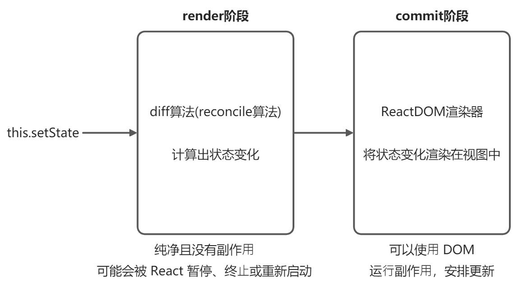
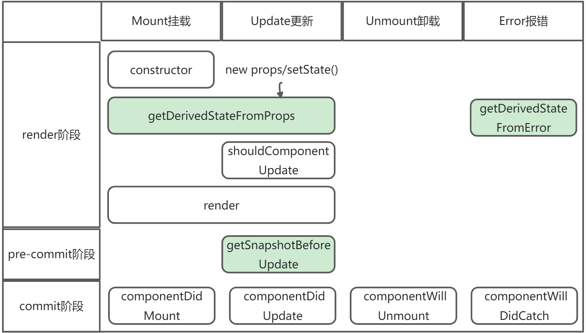
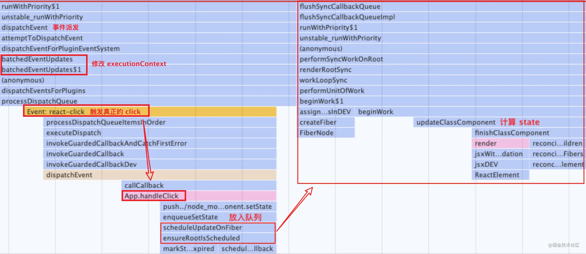
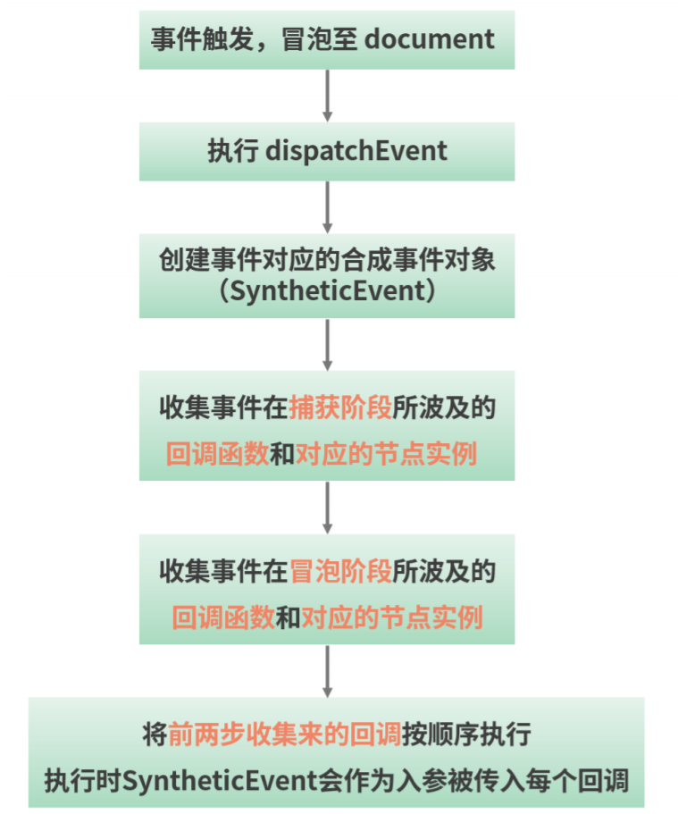
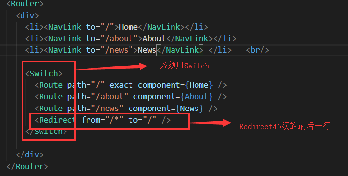
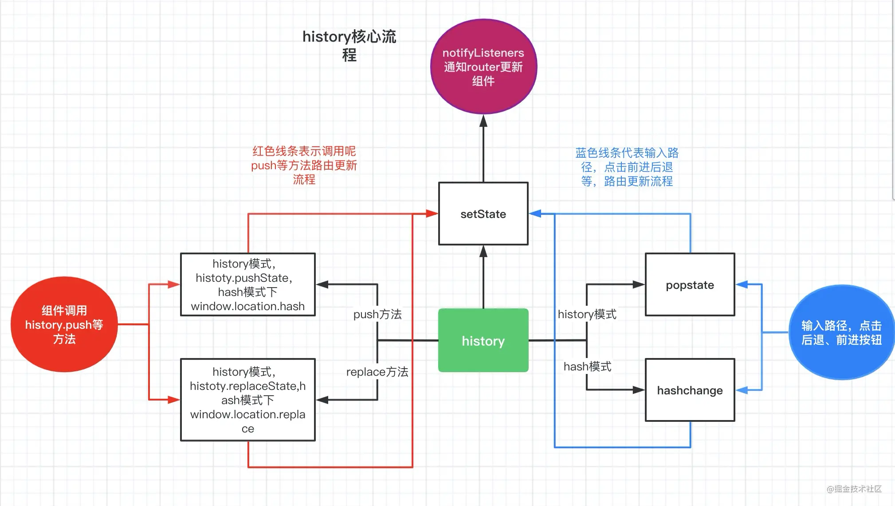
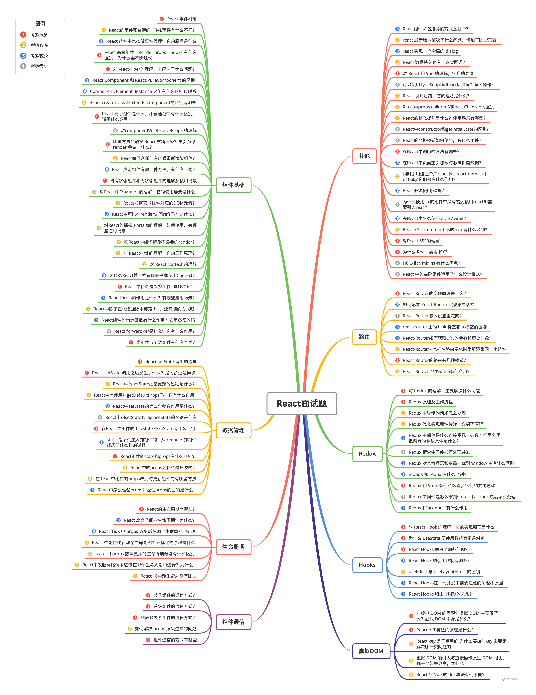

## React 15 和 React 16 的生命周期

### 流程总结

- 整体结构
  
- React 17 生命周期和阶段展示（绿色新为增）
  
- 渲染过程（render 阶段可以同步也可以异步，但 commit ⼀定是同步的。）
  - 调用 ReactDOM.render
  - **进入 Render 阶段**
  - 深度优先遍历创建完整的 Fiber 树（虚拟 DOM 树）
  - 遍历到的节点会执行生命周期函数（constructor->getDerivedStateFromProps/componentWillMount->render）
  - **进入 Commit 阶段**
  - 将整棵 fiber 树对应 DOM 渲染到视图（真实 DOM）中
  - 从子节点开始执行对应的生命周期函数，然后调用父节点的（componentDidMount）
  - **调用 this.setState 改变某个子节点的状态**
  - 进入 Render 阶段
  - 再次深度优先遍历创建完整的 Fiber 树（虚拟 DOM 树）
  - 通过 diff 算法（reconcile 算法）发现不同，标记此次变化。调用该子节点的生命周期函数（getDerivedStateFromProps->render）
  - **进入 Commit 阶段**
  - 执行状态变化对应的操作，执行该子节点生命周期函数（getSnapshotBeforeUpdate）
  - 新创建的 fiber 树替换旧的 fiber 树

### React 15


- 挂载阶段
  - 顺序：`constructor()`->`componentWillMount()`->`render()`-`>componentDidMount()`
  - WillMount() 尽量不要做初始化的动作
  - DidMount() 渲染结束后触发，已经有真实 DOM。可以操作 DOM 和异步请求、数据初始化
- 更新阶段
  - 顺序：`componentWillReceiveProps()`->`shouldComponentUpdate()`->`componentWillUpdate`->`render()`->`componentDidUpdate()`
  - 一种是父组件触发、一种是组件自身 setState 触发
  - 父组件更新（并不是由 props 变化触发的）导致先触发 WillReceiveProps() 周期函数，收到的是新的 props 内容。
  - 子组件调用 this.setState()，先触发 shouldComponentUpdate()，再触发 WillUpdate()， 常用于不涉及 DOM 操作的工作。更新完成后触发 DidUpdate()，可以操作 DOM，常用于子组件更新完毕的标志。
  - shouldComponentUpdate 可以用于优化性能，根据此函数返回值决定是否执行后面的生命周期，是否进行 re-render 重渲染。默认为 true，无条件 re-render。
- 卸载阶段
  - 顺序：`componentWillUnmount()`
  - 如何触发：1 是组件被移除，2 是组件设置了 key，渲染时发现 key 不一样

### React 16


- 挂载阶段
  - 顺序：`constructor()`->`getDerivedStateFromProps()`->`render()`-`>componentDidMount()`
  - 消除 WillMount，新增 getDerivedStateFromProps
  - getDerivedStateFromProps
    - 静态方法，里面访问不到 this
    - 接收参数，props（父组件的 props） 和 state（自身的 state）
    - 函数需要返回一个对象或 null，用于将派生 state，也就是对象里的某个属性进行定向更新，如果不存在则新增该 state
- 更新阶段
  - 顺序：`getDerivedStateFromProps()`->`shouldComponentUpdate()`->`render()`->`getSnapshotBeforeUpdate()`->`componentDidUpdate()`
  - 消除 componentWillReceiveProps，新增 getDerivedStateFromProps
  - 消除 componentWillUpdate，新增 getSnapshotBeforeUpdate
  - getSnapshotBeforeUpdate
    - 在 render 方法之后，在真实 DOM 更新前
    - 函数的 return 返回值传给 DidUpdate()的第三个参数
- 卸载阶段
  - 顺序：`componentWillUnmount()`
  - 与 React 15 保持一致

React 16 的⽣命周期被划分为了 render 和 commit 两个阶段，⽽ commit 阶段⼜被细分为
了 pre-commit 和 commit。**render 阶段在执⾏过程中允许被打断（Fiber 的作用）**，⽽ commit 阶段则总是同步执⾏的。

- render 阶段：纯净且没有副作⽤，可能会被 React 暂停、终⽌或重新启动。
- pre-commit 阶段：可以读取 DOM。
- commit 阶段：可以使⽤ DOM，运⾏副作⽤，安排更新。

#### 为什么不要在 componentWill 开头里面做 setState()、异步请求、操作真实 DOM

- 不建议在 componentWillMount、componentWillUpdate 里面做 setState()、异步请求、操作真实 DOM 的动作
  - 因为他们都是在 render 阶段，Fiber 架构下，可以被打断+重启，在里面执行操作可能导致 bug，如一个请求可能发出多次，一次性删除多个符合条件的 DOM
  - 在 componentWillReceiveProps 和 componentWillUpdate ⾥滥⽤ setState 导致重复渲染死循环
- 解决方法
  - 可以转移到其他生命周期里做，比如 componentDidxxx

## React Class 和 React Hook

### 类组件和函数组件

- 类组件：基于 ES6 的 Class 写法，继承 React.Component 的 React 组件。属于面向对象编程思想。
- 函数组件：函数形态存在的 React 组件，早期没有 Hook，函数组件内部无法维护 state，所以也叫无状态组件。后来 Hook 出现后，补齐一些生命周期和 state 的管理缺失的能力。

- 组件示例
- 类组件

```js
class DemoClass extends React.Component {
  // 初始化类组件的 state
  state = {
    text: "",
  };
  // 编写⽣命周期⽅法 didMount
  componentDidMount() {
    // 省略业务逻辑
  }
  // 编写⾃定义的实例⽅法
  changeText = (newText) => {
    // 更新 state
    this.setState({
      text: newText,
    });
  };
  // 编写⽣命周期⽅法 render
  render() {
    return (
      <div className="demoClass">
        <p>{this.state.text}</p>
        <button onClick={this.changeText}>点我修改</button>
      </div>
    );
  }
}
```

- 函数组件

```js
function DemoFunction(props) {
  const { text } = props;
  return (
    <div className="demoFunction">
      <p>{`function 组件所接收到的来⾃外界的⽂本内容是：[${text}]`}</p>
    </div>
  );
}
```

- 基本区别
  - 类组件可以访问生命周期，函数组件不能
  - 类组件可以获取到实例化的 this，函数组件没有 this
  - 类组件需要继承 class，函数组件不需要
- 重点区别
  - 类组件如果通过 setTimeout 之类的改变了 props 和渲染时机上的关联，会导致拿到一些错误的 props，也就是实时的 props。和上次 setTimeout 的 this.props 不一致了
  - 而函数组件真正将数据和渲染绑定在一起，每次 props 都是重新对函数的一次调用，保证和视图对应得上
- 优缺点
  - 类组件提供了内置的很多东西，如 state 和生命周期，是很强大。
    - 学习成本高，理解成本高，只编写简单组件，用类组件过于复杂
    - 组件难拆分和复用
  - 函数组件
    - 学习成本低、简洁易维护
    - 更灵活、自由选择 Hook 能力

### 为什么需要 React Hook，它的优缺点

- 优点
  - 【避开难以理解的 Class 组件】：this 的不确定性（常用 bind 和箭头函数解决）和生命周期会将逻辑打散塞进去，比如设置订阅和卸载订阅会被分散到不同生命周期去处理
  - 【让状态逻辑复用更简单】：以前是用 HOC 高阶组件等方式实现复用状态逻辑（会破坏组件结构，容易导致嵌套地狱），现在可以通过自定义 Hook 来实现（不会破坏组件结构）
  - 【函数组件更契合 React 的理念】：UI=f(data)，数据驱动视图
- 缺点
  - 不能完全补齐类组件的生命周期，如 getSnapshotBeforeUpdate、 componentDidCatch
  - 使用层面有限制，比如说不能在嵌套、循环、判断中写 Hook

### 主要 Hook 一览

- 基础 Hook
  - useState : 状态钩子，为函数组件提供内部状态
  - useEffect ：副作用钩子，提供了类似于 componentDidMount 等生命周期钩子的功能
  - useContext ：共享钩子，在组件之间共享状态，可以解决 react 逐层通过 props 传递数据
- 额外的 Hook
  - useReducer: action 钩子，提供了状态管理，其基本原理是通过用户在页面上发起的 action，从而通过 reduce 方法来改变 state，从而实现页面和状- 态的通信，使用很像 redux
  - useCallBack：把内联回调函数及依赖项数组作为参数传入 useCallback，它将返回该回调函数的 memoized 版本，该回调函数仅在某个依赖项改变时- 才会更新
  - useMemo：把"创建"函数和依赖项数组作为参数传入 useMemo，它仅会在某个依赖项改变时重新计算， 可以作为性能优化的手段
  - useRef：获取组件的实例，返回一个可变的 ref 对象，返回的 ref 对象在组件的整个生命周期内保持不变
  - useLayoutEffect： 它会在所有 DOM 变更后同步调用 effect

### 核心 Hook

- useState()
  - 为函数组件引入状态，state 类似类组件的 state 中的某个属性，对应一个单独状态，可以存储任何类型的值
  - 初始化`const [state, setState] = useState(initialState);`
  - 触发更新和渲染`setState(newState)`
- useEffect()

  - 两个参数：回调函数和依赖数组
  - 允许函数组件执行副作用操作，一定程度上弥补了生命周期的能力
  - useEffect 回调中返回的函数被称为“清除函数”，会在卸载时执⾏清除函数内部的逻辑。
  - 使用

    - 每次渲染都会执行的副作用`useEffect(callBack)`
    - 仅挂载阶段执行一次的副作用`useEffect(callBack, [])`
    - 仅挂载阶段和卸载阶段执行的副作用：挂载阶段执行 A，卸载阶段执行 B

      ```js
      useEffect(() => {
        // 这⾥是 A 的业务逻辑

        // 返回⼀个函数记为 B
        return () => {};
      }, []);
      ```

    - 根据依赖更新触发执行副作用：React 进行一次新的渲染会对比前后依赖数组中是否有某个元素改变，有就会触发副作用。
      ```js
      useEffect(() => {
        // 业务逻辑
      }, [num1, num2, num3]);
      ```

### Hook 链表原理：为什么不要在循环、条件或嵌套函数中调⽤ Hook

> Hook 的执行是按照单向链表的顺序，而组成链表的成员就是一个个 Hook 对象。

先看 useState 的初始化过程


- 从 useState()源码来看
  - 首次渲染：mountState 构建单向链表并渲染，在 mountState 里，主要用 mountWorkInProgressHook 用来追加进链表的
  - 更新阶段：updateState 依次遍历链表并渲染
- 条件或嵌套函数可能改变 hooks 的顺序
  - hook 相关的信息（memoizedState、baseState、next 等）放在一个 hook 对象里，hook 对象之间用单向链表串联起来。所以 hooks 的渲染是通过“依次遍历”来定位每个 hooks 内容的。
  - 如果前后两次读到的链表在顺序上不一致，可能会取错值，那么渲染的结果⾃然是不可控的。

## React 组件通信

React 的数据流是单向的

- 父->子通信
  - 父组件通过在子组件上通过属性赋值`<Child xx={this.state.data}/>`
  - 子组件通过 `props.xx` 获取父组件传入的值 data
- 子->父通信
  - 在父组件中写一个修改自身数据 setState 的函数 `changeData()`，并作为 props 属性传给子组件`<Child xx={this.changeData}/>`
  - 子组件通过调用 `props.xx('newData')`，更新父组件的数据
- 兄弟组件通信
  - 共用一个父组件
  - 利用这个父组件来进行通信，转换为兄弟 1->父组件，父组件->兄弟 2 的通信形式
- 跨级
  - 层层传递 props：不推荐，作为桥梁的组件引入很多不属于自己的属性，难以维护。
  - 发布订阅模式 EventEmitter
- Context API
  - 三要素：React.createContext、Provider 数据提供者、Consumer 数据消费者
  - 创建一个 context 对象`const AppContext = React.createContext(defaultValue)`
  - 读取 Provider 和 Consumer`const { Provider, Consumer } = AppContext`
  - 使用 Provider 进行包裹根组件` <Provider value={title: this.state.title, content: this.state.content}> </Provider>`
  - 使用 Consumer 进行读取数据 `<Consumer>{value => <div>{value.title}</div>}</Consumer>`
  - 即便组件的 shouldComponentUpdate 返回 false，它仍然可以
    “穿透”组件继续向后代组件进⾏传播，进⽽确保了数据⽣产者和数据消费者之间数据的⼀致性。

## React 状态管理

### Redux

> 重点：在 Redux 的整个⼯作过程中，数据流是严格单向的。

- Redux 工作流
  

- 是一个状态容器：用来存放公共数据的仓库
- 三部分组成：store、reducer 和 action
- 实现组件间的通信的步骤：任何组件可以通过 dispatch 派发 action 对象，由 reducer 读取 action，根据 action 的不同 对数据进行修改，生成新的 state，更新到用来存放数据的 store 里，组件可以通过约定的方式读取到这些状态数据

- 具体使用
  

```js
import { createStore } from "redux";
// 创建 reducer
const reducer = (state, action) => {
  // 此处是各种样的 state处理逻辑
  return new_state;
};
// 基于 reducer 创建 state
const store = createStore(reducer);
// 创建⼀个 action，这个 action ⽤ “ADD_ITEM” 来标识
const action = {
  type: "ADD_ITEM",
  payload: "<li>text</li>",
};
// 使⽤ dispatch 派发 action，action 会进⼊到 reducer ⾥触发对应的更新
store.dispatch(action);
```

## setState

### setState 之后发生什么

- 【数据合并】多个 setState 会进行数据合并，准备批量更新
- 【生成虚拟 DOM】生成新的 虚拟 DOM 树
- 【diff，更新 UI】使用 diff 算法，比较新旧 虚拟 DOM 树，进行 patch，渲染 UI
- 【执行回调函数】setState 第二个参数

### setState 是同步还是异步的

- setState 并不是单纯同步/异步的，本质上是同步的，setTimeout 之类的函数 “逃脱”了 React 对它的管控，不过只要是在 React 管控下的 setState，看起来⼀定是异步的。

- 异步：在 React 钩⼦函数(生命周期)、合成事件中

  - **避免频繁的 re-render**，类似 vue 的 nextTick 和浏览器 EventLoop，将每次 setState 塞入队列，待事件同步代码或生命周期执行结束后，取出队列进行计算，再拿最新的 state 值进行一次更新，也叫批量更新。

  ```js
  // 正常的操作
  handleClick = () => {
    const fans = Math.floor(Math.random() * 10);
    console.log("开始运行");
    this.setState(
      {
        count: this.state.count + fans,
      },
      () => {
        console.log("新增粉丝数:", fans);
      }
    );
    console.log("结束运行");
  };

  // 开始运行
  // 结束运行
  // 新增粉丝数:xx
  ```

- 同步：在 setTimeout、setInterval 等函数中、 DOM 原⽣事件中

  - 异步函数如 setTimeout 帮助我们跳出 React 的事件流或者生命周期，用 setState 立即更新和渲染，就能拿到最新的 state 值，类似同步的效果。

  ```js
  // 脱离 React 控制的操作
  handleClick = () => {
    setTimeout(() => {
      const fans = Math.floor(Math.random() * 10);
      console.log("开始运行");
      this.setState(
        {
          count: this.state.count + fans,
        },
        () => {
          console.log("新增粉丝数:", fans);
        }
      );
      console.log("结束运行");
    });
  };
  // 开始运行
  // 新增粉丝数:xx
  // 结束运行
  ```

- 示意代码
  
  - `flushSyncCallbackQueue` 方法，用来更新 state 并重新进行 render。
  - React 在绑定事件时，会对事件进行合成，统一绑定到 document 上（ react@17 有所改变，变成了绑定事件到 render 时指定的那个 DOM 元素），最后由 React 来派发，事件在触发的时候，都会先调用 batchedEventUpdates$1 这个方法，在这里就会修改 executionContext 的值，React 就知道此时的 setState 在自己的掌控中。

```js
function scheduleUpdateOnFiber(fiber, lane, eventTime) {
  if (lane === SyncLane) {
    // 同步操作
    ensureRootIsScheduled(root, eventTime);
    // 判断当前是否还在 React 事件流中
    // 如果不在，直接调用 flushSyncCallbackQueue 更新，如果在，则等事件方法执行完再执行setState
    if (executionContext === NoContext) {
      flushSyncCallbackQueue();
    }
  } else {
    // 异步操作
  }
}

// executionContext 的默认状态
var executionContext = NoContext;
function batchedEventUpdates$1(fn, a) {
  var prevExecutionContext = executionContext;
  executionContext |= EventContext; // 修改状态
  try {
    return fn(a);
  } finally {
    executionContext = prevExecutionContext;
    // 调用结束后，调用 flushSyncCallbackQueue
    if (executionContext === NoContext) {
      flushSyncCallbackQueue();
    }
  }
}
```

- 推荐使用方式

  - 在调用 setState 时使用函数`(preState, preProps)=>({})`传递 state 值和 props 值，且构建新对象，而不是直接改写它们。
  - 在回调函数中获取最新更新后的 state，也建议使用 componentDidUpdate() 来代替此方式。

  ```js
  componentDidMount() {
      this.setState(preState => ({ index: preState.index + 1 }), () => {
        console.log(this.state.index);
      })
    }
  ```

- 注意
  - componentWillUpdate componentDidUpdate 这两个生命周期中不能调用 setState，会造成死循环，导致程序崩溃。

### 给 setState 传递一个对象与传递一个函数的区别是什么？

- 给 setState 传递一个函数，而不是一个对象，可以确保每次的调用都是读取的就是当前的 state 值，而不是 this.state，**因为 React 不会更新 `this.state.count`，直到该组件被重新渲染才会更新**。
- 例子：传递对象，导致只更新一次，后调用的 setState() 将覆盖同一周期内先调用 setState 的值，因此商品数仅增加一次。

```js
incrementCount() {
  // 注意：这样 *不会* 像预期的那样工作。
  this.setState({count: this.state.count + 1});
}

handleSomething() {
  // 假设 `this.state.count` 从 0 开始。
  this.incrementCount();
  this.incrementCount();
  this.incrementCount();
  // 当 React 重新渲染该组件时，`this.state.count` 会变为 1，而不是你期望的 3。

  // 这是因为上面的 `incrementCount()` 函数是从 `this.state.count` 中读取数据的，
  // 但是 React 不会更新 `this.state.count`，直到该组件被重新渲染。
  // 所以最终 `incrementCount()` 每次读取 `this.state.count` 的值都是 0，并将它设为 1。
}
```

- 例子：传递函数，可以获取到最新的值，最后更新三次

```js
incrementCount() {
  this.setState((state) => {
    // 重要：在更新的时候读取 `state`，而不是 `this.state`。
    return {count: state.count + 1}
  });
}

handleSomething() {
  // 假设 `this.state.count` 从 0 开始。
  this.incrementCount();
  this.incrementCount();
  this.incrementCount();

  // 如果你现在在这里读取 `this.state.count`，它还是会为 0。
  // 但是，当 React 重新渲染该组件时，它会变为 3。
}
```

## React 虚拟 DOM(Virtual DOM)和 diff 算法

### 虚拟 DOM

- 虚拟 DOM 工作流：新旧虚拟 DOM 树进行 diff，然后找出需要更新的内容，最后 patch 到真实 DOM 上。
  
- 【What】虚拟 DOM 是什么：虚拟 DOM 是 JS 对象，是对真实 DOM 的描述，不依赖具体框架。
- 【How】React 中的虚拟 DOM
  - 挂载阶段：结合 JSX 的描述，构建出虚拟 DOM 树，通过 ReactDOM.render 实现虚拟 DOM 到真实 DOM 的映射（触发渲染流水线）
  - 更新阶段：虚拟 DOM 在 JS 层借助 diff 算法找出哪些需要被改变，再讲这些改变作用于真实 DOM
- 【Why】虚拟 DOM 的价值
  - 更好的研发体验和效率：数据驱动视图，函数式 UI 编程，同时性能还不错
  - 跨平台：多出中间一层描述性的虚拟 DOM，可以对接不同平台的渲染逻辑，实现多端运行。

### Diff 算法

- 调和指的是让虚拟 DOM 映射到真实 DOM 上，分别有 React 15 栈调和、React16 的 Fiber 调和
- Diff 算法属于调和 Reconciler 里的一个环节：更新过程调用 Diff 算法
- Diff 的要点
  - 两个虚拟 DOM 树的分层递归对比：降低 diff 算法时间复杂度，O(n^3)->O(n)
  - 类型一致的节点才 Diff：不同组件类型直接替换，不进行 diff，减少冗余递归操作
  - 节点 key 属性的设置：使尽可能重用同一层级的节点，有了唯一的标记，每次 diff 会找到对应元素 key，key 值一致可以重用该节点，而不会因为位置顺序不同，直接做删除重建处理。

## React Fiber

- 初识

  - Fiber 会使原本同步的渲染过程变成异步的，进行增量渲染。
  - 特性：任务可拆解，过程可打断，可恢复，恢复后是“重新执行一遍任务，而不是接着上次那行代码”
  - Fiber 会将⼀个⼤的更新任务拆解为许多个⼩任务。每当执⾏完⼀个⼩任务时，渲染任务会交出主线程，看看有没有优先级更⾼的⼯作要处理，避免同步渲染带来的卡顿。在 React15 之前，**虚拟 DOM 进行的深度优先遍历 Diff 会进行同步递归**，长时间占据主线程，会导致卡顿/假死。

- Fiber 的含义
  - React 内部的数据结构，构成 Fiber 树的节点（虚拟 DOM）
  - 对 React 核心算法（调和）的重写
- Fiber 核心：可中断、可恢复、优先级
- React 架构
  - React16 之前：Reconciler 找不同->Renderer 渲染不同
  - React16 之后：Scheduler (调度器)优先级->Reconciler 找不同->Renderer 渲染不同
- 联系上下文 React15 和 16 的生命周期改动
  - 因为调度器会将整个更新任务拆分为多个小的任务，并给它们分配了优先级，然后根据优先级来进行打断任务和恢复任务
  - render 阶段的打断和恢复会重复执行一些 WillMount 的生命周期钩子，为了避免，React16 废弃了这些钩子

### 常见问题

- Fiber 节点如何连接
  - child 指向子节点
  - return 指向父节点
  - sibling 指向第一个兄弟节点
- Fiber 树：由多个 Fiber 节点组成，数据结构本质上已经从树变为链表了
- completeWork：负责处理 Fiber 节点到 DOM 节点的映射逻辑，是自底向上处理的
  - 创建 DOM 节点（CreateInstance），创建好的 DOM 节点放在 stateNode 属性里
  - 将 DOM 节点插⼊到 DOM 树中（AppendAllChildren），挂载到父 Fiber 节点的 DOM 节点里去
  - 为 DOM 节点设置属性（FinalizeInitialChildren）

### React 3 种启动方式

> 主要是 mode 属性的不同，决定着这个⼯作流【初始化 → render → commit 】是⼀⽓呵成（同步）的，还是分⽚执⾏（异步）的。Fiber 架构在 React 中并不能够和异步渲染画严格的等号，它是⼀种同时兼容了同步渲染与异步渲染的设计。

- legacy 模式：`ReactDOM.render(<App />,rootNode)`，目前的使用方式
- concurrent 模式：`ReactDOM.createRoot(rootNode).render(<App />)`，实验中，未来的默认模式
- blocking 模式：介于两者之间，渐进迁移用

### Fiber 架构下 异步渲染（Concurrent 模式）的 Scheduler 调度层的核心

- 时间分片

  - React 会根据浏览器的帧率，计算出时间切⽚的⼤⼩，并结合当前时间计算出每⼀个切⽚的到期时间。在 循环创建 Fiber 节点的函数中，while 循环每次执⾏前，会询问当前时间切⽚是否到期，若已到期，则结束循环、交出主线程的控制权，避免长时间占用主线程。（在同步渲染模式下，没有这个判断，会循环调用，直到节点为空）

- 优先级调度
  - React 发 起 Task 调 度 的 姿 势 有 两 个 ： setTimeout 、MessageChannel。在宿主环境不⽀持 MessageChannel 的情况下，会降级到 setTimeout。都是异步任务
  - 先创建一个 task，根据任务开始时间，推入两个队列（待执行、已过期）其中一个
  - 队列是小顶堆的数据结构，堆顶是需要最早被执行的任务
  - 如果任务开始时间小于当前时间，那么推入 taskQueue 过期任务队列。
  - 如果任务开始时间大于当前时间，则先判断有没有过期任务，有就发起即时任务并执行
  - 再去看未过期的任务队列，是堆顶任务就派发延时任务，等过期后加入另一个队列，等待执行

## React 性能优化

## React 事件系统

- 大部分事件采用事件委托，是统一绑定在页面的 document（ react@17 有所改变，绑定事件到 render 时指定的 DOM 元素），document 上 React 的统一事件处理程序会将事件分发到具体的组件实例中，模拟事件冒泡和捕获过程。

### React 合成事件

- 简介：它是 React 自定义的事件对象，底层抹平了不同浏览器的差异，上层提供与原生事件相同的接口，它保存了原生 DOM 事件的引用，通过`e.nativeEvent` 属性可以获取。
- 优点
  - 开发者可以专注逻辑开发，不必关注兼容问题
  - 帮助 React 实现了对所有事件的中⼼化管控

### React 事件系统工作流原理

- 事件的注册
  - 在 document 上检查是否已经对该事件类型（如 click）进行了监听，如果已经注册过，那么就跳过
  - 源码上使用原生 JS 的 `addEventListener(eventType,listener)`来进行监听
    - eventType 表示事件类型如 click
    - listener 是注册到 document 的统一事件分发函数，里面调用原生 JS 的 `dispatchEvent`
- 事件的触发
  - 【冒泡】事件触发，冒泡到 document->执行 dispatchEvent->创建事件对应的合成对象
  - 【收集 DOM 节点】获取是 DOM 元素的 Fiber 节点，收集到一个节点数组里
  - 【模拟捕获】倒序遍历节点数组：收集捕获的回调函数和节点实例
  - 【模拟冒泡】正序遍历节点数组：收集冒泡阶段的回调函数和节点实例
  - 合成事件就有了两个属性`_dispatchListeners` 和`_dispatchInstances`，分别存放捕获-目标-冒泡这个三个阶段所涉及的回调集合和节点实例集合，按顺序执行即可。



### React 事件和原生事件的区别

- 【事件名小驼峰】react 事件命令采用**小驼峰式**，而不是纯小写
- 【事件方法函数】使用 JSX 语法时，需要**传入一个函数**作为事件处理函数，而不是一个字符串
- 【阻止默认行为】不能通过 `return false` 来阻止默认行为。必须明确调用 `e.preventDefault()`。

### React 事件和原生事件的触发顺序

- react 的所有事件都挂载在 document 中，当真实 dom 触发后冒泡到 document 后才会对 react 事件进行处理

1. **原生的事件会先执行**
2. **执行 react 合成事件**
3. 最后**执行真正在 document 上挂载的事件**

## React 错误处理

React 异常捕获：使用错误边界组件包裹

> 错误边界是一种 React 组件，这种组件可以捕获并打印发生在其子组件树任何位置的 JavaScript 错误，并且，它会渲染出备用 UI，而不是渲染那些崩溃了的子组件树。错误边界在渲染期间、生命周期方法和整个组件树的构造函数中捕获错误。

- 如何编写组件

  - 使用 componentDidCatch() 变成一个错误边界，可以用它**打印错误信息**
  - 使用 static getDerivedStateFromError() **改变 state，渲染备用 UI**

    ```js
    class ErrorBoundary extends React.Component {
      constructor(props) {
        super(props);
        this.state = { hasError: false };
      }

      static getDerivedStateFromError(error) {
        // 更新 state 使下一次渲染能够显示降级后的 UI
        return { hasError: true };
      }

      componentDidCatch(error, errorInfo) {
        // 你同样可以将错误日志上报给服务器
        logErrorToMyService(error, errorInfo);
      }

      render() {
        if (this.state.hasError) {
          // 你可以自定义降级后的 UI 并渲染
          return <h1>Something went wrong.</h1>;
        }

        return this.props.children;
      }
    }
    ```

- 如何使用

  - 错误边界的粒度自我把控，可以包装在最顶层，也可以包装在单独页面组件。

    ```js
    <ErrorBoundary>
      <MyWidget />
    </ErrorBoundary>
    ```

- 错误边界无法捕获的错误

  - 事件处理：使用普通的 JavaScript try / catch 语句处理
  - 异步代码：例如 setTimeout 或 requestAnimationFrame 回调函数
  - 自身的错误：错误边界仅可以捕获其子组件的错误，无法捕获自身的错误
  - 服务端渲染

- 注意
  - 错误边界只针对 React 组件
  - 只有 class 组件才可以成为错误边界组件

## React-router

- 设置重定向，使用 RedirectAPI 放最后，且搭配 Switch 包裹
  

- 源码
  - react-router 库：⽀持使⽤ hash（对应 HashRouter）和 browser（对应 BrowserRouter） 两种路由规则。
  - history 库 ：提供核心的 API，HashRouter 调 ⽤ 了 createHashHistory ， BrowserRouter 调 ⽤ 了 createBrowserHistory，这两个 history 的实例化⽅法均来源于 history 这个独⽴的代码库
  - react-router-dom 库：在 react-router 的核心基础上，添加了用于跳转的 Link 组件，和 histoy 模式下的 BrowserRouter 和 hash 模式下的 HashRouter 组件等
- 流程图
  

## React 题目参考



- [参考答案 1](https://juejin.cn/post/6941546135827775525#heading-1)
- [参考答案 2](https://juejin.cn/post/6940942549305524238#heading-1)

## React 题目一、组件基础

### React Fiber 是什么，解决什么问题

- 原因：React15 渲染时，深度优先遍历 diff 会对虚拟 DOM 树进行递归，找出变动的节点，同步更新，这个过程 React 会占用主线程，导致用户感觉卡顿。React16 通过 Fiber 架构，让这个过程可中断，可恢复，能够及时响应用户交互。
- 核心：Fiber 会将⼀个⼤的更新任务拆解为许多个⼩任务。每当执⾏完⼀个⼩任务时，渲染任务会交出主线程，看看有没有优先级更⾼的⼯作要处理，空闲后再继续渲染，避免同步渲染带来的卡顿。
- 时间分片：React 会根据浏览器的帧率，计算出时间切⽚的⼤⼩，并结合当前时间计算出每⼀个切⽚的到期时间。在 循环创建 Fiber 节点的函数中，while 循环每次执⾏前，会询问当前时间切⽚是否到期，若已到期，则结束循环、交出主线程的控制权，避免长时间占用主线程。（在同步渲染模式下，没有这个判断，会循环调用，直到节点为空）
- 任务调度
  - React 发 起 Task 调 度 的 姿 势 有 两 个 ： setTimeout 、MessageChannel。在宿主环境不⽀持 MessageChannel 的情况下，会降级到 setTimeout。都是异步任务
  - 先创建一个 task，根据任务开始时间，推入两个队列（待执行、已过期）其中一个
  - 队列是小顶堆的数据结构，堆顶是需要最早被执行的任务
  - 如果任务开始时间小于当前时间，那么推入 taskQueue 过期任务队列。
  - 如果任务开始时间大于当前时间，则先判断有没有过期任务，有就发起即时任务并执行
  - 再去看未过期的 timerQueue 任务队列，是堆顶任务就派发延时任务，等过期后加入另一个队列，等待执行

### 类组件与函数组件有什么异同？

- 概念
  - 类组件：基于 ES6 的 Class 写法，继承 React.Component 的 React 组件
  - 函数组件：函数形态存在的 React 组件，早期没有 Hook，函数组件内部无法维护 state，所以也叫无状态组件。后来 Hook 出现后，补齐一些生命周期和 state 的状态管理的能力
- 相同
  - 可复用的最小代码片段，返回要渲染的元素
- 不同
  - 编程模式：类组件面向对象，函数组件是函数式编程
  - 生命周期：类组件可以访问生命周期，函数组件不能
  - this：类组件可以获取到实例化的 this，函数组件没有 this
  - 灵活性：类组件难拆分和复用，函数组件灵活，可自由选择 Hook 能力
  - 性能优化：类组件用 shouldComponentUpdate 阻止更新，函数组件依靠 React.memo 缓存渲染结果

### React 事件机制

- 概念
  - JSX 上写的事件并没有绑定在对应的真实 DOM 上，而是通过事件委托的方式，将所有的事件都统一绑定在了 document 上。这样的方式不仅减少了内存消耗，还能在组件挂载销毁时统一订阅和移除事件。
  - 另外冒泡到 document 上的事件也不是原生浏览器事件，而是 React 自己实现的合成事件（SyntheticEvent）。
- 合成事件

  - 简介：它是 React 自定义的事件对象，底层抹平了不同浏览器的差异，上层提供与原生事件相同的接口，它保存了原生 DOM 事件的引用，通过`e.nativeEvent` 属性可以获取
  - 优点：开发者可以专注逻辑开发，不必关注兼容问题。帮助 React 对所有事件进行统一管理，中⼼化管控
  - 顺序：先执行原生事件，后执行 react 合成事件

- 原理
  - 注册：源码上使用原生 JS 的 `addEventListener(eventType,listener)`来进行监听，listener 是注册到 document 的统一事件分发函数，里面调用原生 JS 的 `dispatchEvent`
  - 触发：事件触发，冒泡到 document->执行 dispatchEvent->创建事件对应的合成对象，收集节点的回调和节点实例，作为合成对象的两个属性，`_dispatchListeners` 和`_dispatchInstances`，分别存放捕获-目标-冒泡这个三个阶段所涉及的回调集合和节点实例集合，按顺序执行即可。

### React 事件和 HTML 原生事件的区别

- 【事件名小驼峰】react 事件命令采用**小驼峰式**，原生事件是纯小写
- 【事件方法函数】使用 JSX 语法时，需要**传入一个函数**作为事件处理函数，原生事件是一个字符串
- 【阻止默认行为】不能通过 `return false` 来阻止默认行为。必须明确调用 `e.preventDefault()`阻止默认行为

### HOC 高阶组件是什么，和普通组件有什么区别

- 概念
  - 是一个函数，接收组件为参数，返回新的组件
- 优缺点
  - 优点：逻辑复用，不影响被包裹组件的内部逻辑
  - 缺点：HOC 传递给被包裹组件的 props 容易重名，导致被覆盖
- 作用
  - 代码复用，逻辑抽象
  - 根据条件渲染被包裹组件
  - 更改 被包裹组件 State 和 Props
- 实际应用
  - 权限控制
  - 渲染事件计算

```js
// hoc的定义
function withSubscription(WrappedComponent, selectData) {
  return class extends React.Component {
    constructor(props) {
      super(props);
      this.state = {
        data: selectData(DataSource, props)
      };
    }
    // 一些通用的逻辑处理
    render() {
      // ... 并使用新数据渲染被包装的组件!
      return <WrappedComponent data={this.state.data} {...this.props} />;
    }
  };

// 使用
const BlogPostWithSubscription = withSubscription(BlogPost,
  (DataSource, props) => DataSource.getBlogPost(props.id));

```

### React 高阶组件、Render props、hooks 有什么区别，为什么要不断迭代

- Render props
  - 概念：组件有一个 props，它是一个返回 React 元素的 render 函数
  - 优点：代码复用，数据共享
  - 缺点：无法在 return 语句外访问数据、嵌套写法不够优雅

```js
// DataProvider组件内部的渲染逻辑如下
class DataProvider extends React.Components {
  state = {
    name: "Tom",
  };

  render() {
    return (
      <div>
        <p>共享数据组件自己内部的渲染逻辑</p>
        {this.props.render(this.state)}
      </div>
    );
  }
}

// 调用方式
<DataProvider render={(data) => <h1>Hello {data.name}</h1>} />;
```

- 自定义 hook
  - 概念：使用 React16.8 的 Hook API，写自定义 hook，复用代码逻辑
  - 优点：使用简介直观；解决了 prop 的重名问题；解决 render props 嵌套的问题；
  - 缺点：只能在顶层使用，不能在分支语句中使用

```js
// 自定义一个获取订阅数据的hook
function useSubscription() {
  const data = DataSource.getComments();
  return [data];
}
//
function CommentList(props) {
  const {data} = props;
  const [subData] = useSubscription();
    ...
}
// 使用
<CommentList data='hello' />

```

- 总结
  - 都是为了解决代码逻辑复用的问题
  - HOC 和 render props 有一些缺点
  - Hooks 的代码逻辑复用更简介清晰，也避免了 HOC 和 render props 的问题

### React 中什么是受控组件和非控组件？

- 受控组件（推荐使用）
  - `<input type="text">, <textarea> 和 <select>` 之类的标签它们都接受一个 value 属性，当表单的状态发生变化，就会触发 onChange 事件，更新组件的 state。`this.setState({value: event.target.value});`
  - 缺点：如果多个输入框，每个都要写事件处理函数，比较繁琐
  ```jsx
  <input
    type="text"
    value="{this.state.value}"
    onChange="{this.handleChange}"
  />
  ```
- 非受控组件
  - 概念：一个表单组件没有 value props（单选和复选按钮对应的是 checked props）时，就可以称为非受控组件
  - 在非受控组件中，可以使用一个 ref 来从 DOM 获得表单值。而不是为每个状态更新编写一个事件处理程序

```js
class NameForm extends React.Component {
  constructor(props) {
    super(props);
    this.handleSubmit = this.handleSubmit.bind(this);
    this.input = React.createRef();
  }

  handleSubmit(event) {
    alert("A name was submitted: " + this.input.current.value);
    event.preventDefault();
  }

  render() {
    return (
      <form onSubmit={this.handleSubmit}>
        <label>
          Name:
          <input type="text" ref={this.input} />
        </label>
        <input type="submit" value="Submit" />
      </form>
    );
  }
}
```

- 总结
  - React 推荐使用受控组件，与 state 有关
  - 想快速编写代码，减少代码量使用非受控组件，与组件 state 无关

### 对 React context 的理解

- 概念
  - 组件层级太多，不想逐层传递 props 数据，可以用 context 实现跨层级数据传递
  - 组件上的 context 由父节点的所有 context 对象组合成的，所以可以访问到父组件链上的所有节点 context 属性

### 在 React 中如何避免不必要的 render？

- shouldComponentUpdate 返回 false
  - 减少因父组件更新触发子组件的 render
- React.memo
  - React16.6 的 API，用来缓存组件的渲染，只能用于函数组件

## React 题目二、数据管理

### React setState 源码调用的原理

- 将新的 `state` push 进组件的状态队列
- 调用函数对组件实例进行更新，这里根据 batchingStrategy 对象的`isBatchingUpdates`属性决定是否立即更新（false），还是要排队等待（true）。
- isBatchingUpdates 初始值是 false，如果 React 要执行批量更新的时候，会把它置为 true。在没更新完之前，要更新的组件都进入 dirtyComponents 排队等待下一次的批量更新。

### React setState 调用之后发生了什么？是同步还是异步？

- 调用 setState 后
  - 【数据合并】多个 setState 会进行数据合并，准备批量更新
  - 【生成虚拟 DOM】生成新的 虚拟 DOM 树
  - 【diff，更新 UI】使用 diff 算法，比较新旧 虚拟 DOM 树，进行 patch，渲染 UI
  - 【执行回调函数】setState 第二个参数
- 同步和异步要看情况
  - 异步：React 控制的地方就是异步，如生命周期、合成事件中
  - 同步：脱离 React 控制的地方是同步，如原生事件 setTimeout、setInterval、addEventListener
- 异步设计的好处
  - 性能优化，避免每次调用 setState 都进行 render 更新，可以做批量更新
  - 同步的话可能会导致 state 和 prop 和最新的不一致

### React 中的 setState 批量更新的过程是什么？

- 批量更新
  - 将每次 setState 塞入队列，待事件同步代码或生命周期执行结束后，取出队列进行计算
  - 多次 setState 合并成一次状态，再拿最新的 state 值进行一次更新，渲染
  - 比如同步代码里多次对一个 state 属性进行更新，只会保留最后一次更新。

### 在 React 中组件的 this.state 和 setState 有什么区别？

- this.state 通常是用来初始化 state 的，this.setState 是用来修改 state 值的。
- 如果初始化了 state 之后再使用 this.state，之前的 state 会被覆盖掉，如果使用 this.setState，只会替换掉相应的 state 值。
- 所以，如果想要修改 state 的值，就需要使用 setState，而不能直接修改 state，直接修改 state 之后页面是不会更新的。

### React 组件的 state 和 props 有什么区别？

- state

  - 主要用于组件自身的状态，通过 this.setState 修改，修改 state 会导致组件重新渲染

- props
  - 主要用于父组件向子组件传递数据，是可读，不可变的。只能通过外部传入新的 props，将新的 props 更新到 state，实现子组件渲染。

### React 中的 props 为什么是只读的？

- 原则上只能是从父组件流向子组件，保证相同的输入，显示内容一致

### 在 React 中组件的 props 改变时更新组件的有哪些方法？

- getDerivedStateFromProps
  - 使用：通过参数提供的 nextProps 以及 prevState 来进行判断，根据新传入的 props 来映射到 state
  - 如果 props 传入的内容不需要影响到你的 state，那么就需要返回一个 null，表示不对 state 进行操作

```js
static getDerivedStateFromProps(nextProps, prevState) {
    const {type} = nextProps;
    // 当传入的type发生变化的时候，更新state
    if (type !== prevState.type) {
        return {
            type,
        };
    }
    // 否则，对于state不进行任何操作
    return null;
}

```

## React 题目三、生命周期

### React 的生命周期有哪些？


生命周期可分为三个阶段：挂载阶段、更新阶段、卸载阶段

- 挂载阶段：完成组件第一次渲染，只发生一次
  - 顺序：`constructor()`->`getDerivedStateFromProps()`->`render()`-`>componentDidMount()`
  - `constructor`：初始化 state，事件处理方法绑定 this
  - `getDerivedStateFromProps(nextProps,prevState)`
    - 静态方法，里面访问不到 this
    - 接收参数，props（父组件的新 props） 和 state（当前自身的 state）
    - 函数需要返回一个对象用于将派生 state，不需要更新则返回 null
  - `render`：返回要渲染的内容（原生 DOM、React 组件、字符串、null 等），是每个组件必须的一个方法
  - `componentDidMount`：插入 DOM 树后调用，常用于发送请求、操作 DOM、添加订阅
- 更新阶段：当组件 props 改变或调用 setState 会触发，可发生多次
  - 顺序：`getDerivedStateFromProps()`->`shouldComponentUpdate()`->`render()`->`getSnapshotBeforeUpdate()`->`componentDidUpdate()`
  - `shouldComponentUpdate(nextProps,nextState)`：在父组件更新，所有子组件都会重新渲染，可利用这个阻止子组件重新渲染。可以比较 this.props 和 nextProps ，this.state 和 nextState 值是否变化，来确认返回 true 或者 false。当返回 false 时，组件就停止更新过程，后面的 render、componentDidUpdate 也不会被调用。
  - `getSnapshotBeforeUpdate(prevProps, prevState)`
    - 在 render 方法之后，在真实 DOM 更新前
    - 要和 componentDidUpdate 配合使用，函数的 return 返回值传给 DidUpdate()的第三个参数，默认为 null
  - `componentDidUpdate(prevProps, prevState, snapshot)`：组件更新完成后调用，一般用于操作 DOM，发请求。
- 卸载阶段：组件销毁之前调用
  - 顺序：`componentWillUnmount()`
  - 作用：一般用来取消订阅、清除计时器等
  - 注意：不要在这里 setState 了
- 错误处理阶段：
  - 顺序：`componentDidCatch(error, info)`
  - 后代组件抛出错误时调用，error 是错误信息，info 是堆栈信息

React 16 的⽣命周期被划分为了 render 和 commit 两个阶段，⽽ commit 阶段⼜被细分为
了 pre-commit 和 commit。**render 阶段在执⾏过程中允许被打断（Fiber 的作用）**，⽽ commit 阶段则总是同步执⾏的。

- render 阶段：计算状态信息，可能会被 React 暂停、终⽌或重新启动。
- pre-commit 阶段：还没最终更新到真实 DOM，但可以读取 DOM。
- commit 阶段：真正完成真实 DOM 更新，可以使⽤ DOM，运⾏副作⽤。

### React 新增/废弃了哪些生命周期？为什么？

- 新增
  - getDerivedStateFromProps
  - getSnapshotBeforeUpdate
  - getDerivedStateFromError
- 废弃 will 之类的
  - componentWillMount
  - componentWillReceiveProps
  - componentWillUpdate

废弃这三个函数的原因：fiber 的出现，高优先级任务会打断当前任务，导致被执行多次。而且避免开发者滥用生命周期，导致不好维护。

- componentWillMount：初始化可以在 constructor 里操作，还有有些开发者会把异步请求放这里，其实错误，并不能提高获取结果的速度，放在 componentDidMount 就可以。
- componentWillReceiveProps：可用 getDerivedStateFromProps 代替，只能根据新 props 对比前 state，来派生新的 state，不能访问 this，写不出副作用的代码
- componentWillUpdate：可用 getSnapshotBeforeUpdate 替换，获取 render 前的 DOM 元素状态，保证和 componentDidUpdate 的状态保持一致

### React 16.X 中 props 改变后在哪个生命周期中处理

getDerivedStateFromProps

- 根据新的 props 和组件自身的旧 state 来映射新 state
- 如果 props 不影响 state，则返回 null

```js
static getDerivedStateFromProps(nextProps, prevState) {
    const {type} = nextProps;
    // 当传入的type发生变化的时候，更新state
    if (type !== prevState.type) {
        return {
            type,
        };
    }
    // 否则，对于state不进行任何操作
    return null;
}

```

### React 性能优化在哪个生命周期？它优化的原理是什么？

- 父组件 render 会导致子组件重新渲染，有时候子组件不需要更新，导致影响性能。
- 可进行优化的生命周期：shouldComponentUpdate

  - 拿当前 props 中值和下一次 props 中的值进行对比，数据相等时，返回 false，反之返回 true。
  - 是浅比较

  ```js
  shouldComponentUpdate(nextProps) {
      if (this.props.num === nextProps.num) {
          return false
      }
      return true;
  }
  ```

### state 和 props 触发更新的生命周期分别有什么区别？

### React 中发起网络请求应该在哪个生命周期中进行？为什么？

- 异步请求，最好放在 componentDidMount 中去操作，componentDidMount 方法中的代码，是在组件已经完全挂载到网页上才会调用被执行，所以可以保证数据的加载。此外，在这方法中调用 setState 方法，会触发重新渲染。
- react16.0 以后，componentWillMount 可能会因为中断任务被执行多次。

## React 题目四、组件通信

- 组件通信的方式有哪些
  - 父子组件的通信方式？
  - 跨级组件的通信方式？
  - 非嵌套关系组件的通信方式？
- 如何解决 props 层级过深的问题

## React 题目五、路由

- React-Router 的实现原理是什么？
- React-Router 的路由有几种模式？
- 如何配置 React-Router 实现路由切换
- react-router 里的 Link 标签和 a 标签的区别
- React-Router 如何获取 URL 的参数和历史对象？
- React-Router 4 的 Switch 有什么用？

## React 题目六、Redux

- 对 Redux 的理解，主要解决什么问题
- Redux 原理及工作流程
- Redux 中异步的请求怎么处理
- Redux 怎么实现属性传递，介绍下原理
- Redux 和 Vuex 有什么区别，它们的共同思想

## React 题目七、Hooks

- 对 React Hook 的理解，它的实现原理是什么
- 常用 Hooks 有哪些
- 为什么 useState 要使用数组而不是对象
- React Hooks 解决了哪些问题？
- React Hook 的使用限制有哪些？
- useEffect 与 useLayoutEffect 的区别
- React Hooks 在平时开发中需要注意的问题和原因
- React Hooks 和生命周期的关系？

## React 题目八、虚拟 DOM

- 对虚拟 DOM 的理解？虚拟 DOM 主要做了什么？虚拟 DOM 本身是什么？（参考框架通识）
- React diff 算法的原理是什么？
- React key 是干嘛用的 为什么要加？key 主要是解决哪一类问题的
- 虚拟 DOM 的引入与直接操作原生 DOM 相比，哪一个效率更高，为什么
- React 与 Vue 的 diff 算法有何不同？

## React 题目九、其他

- 为什么  React 要用 JSX？React 必须使用 JSX 吗？
- react 最新版本解决了什么问题，增加了哪些东西
- React 数据持久化有什么实践吗？
- React 设计思路，它的理念是什么？
- React 的状态提升是什么？使用场景有哪些？
- 在 React 中遍历的方法有哪些？
- 同时引用这三个库 react.js、react-dom.js 和 babel.js 它们都有什么作用？
- 在 React 中怎么使用 async/await？
- React.Children.map 和 js 的 map 有什么区别？
