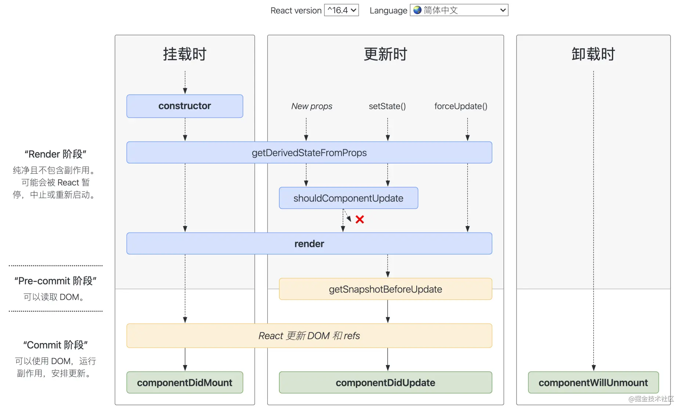

## React 15 和 React 16 的生命周期

### React 15


- 挂载阶段
  - 顺序：`constructor()`->`componentWillMount()`->`render()`-`>componentDidMount()`
  - WillMount() 尽量不要做初始化的动作
  - DidMount() 渲染结束后触发，已经有真实 DOM。可以操作 DOM 和异步请求、数据初始化
- 更新阶段
  - 顺序：`componentWillReceiveProps()`->`shouldComponentUpdate()`->`componentWillUpdate`->`render()`->`componentDidUpdate()`
  - 一种是父组件触发、一种是组件自身 setState 触发
  - 父组件更新（并不是由 props 变化触发的）导致先触发 WillReceiveProps() 周期函数，收到的是新的 props 内容。
  - 子组件调用 this.setState()，先触发 shouldComponentUpdate()，再触发 WillUpdate()， 常用于不涉及 DOM 操作的工作。更新完成后触发 DidUpdate()，可以操作 DOM，常用于子组件更新完毕的标志。
  - shouldComponentUpdate 可以用于优化性能，根据此函数返回值决定是否执行后面的生命周期，是否进行 re-render 重渲染。默认为 true，无条件 re-render。
- 卸载阶段
  - 顺序：`componentWillUnmount()`
  - 如何触发：1 是组件被移除，2 是组件设置了 key，渲染时发现 key 不一样

### React 16



- 挂载阶段
  - 顺序：`constructor()`->`getDerivedStateFromProps()`->`render()`-`>componentDidMount()`
  - 消除 WillMount，新增 getDerivedStateFromProps
  - getDerivedStateFromProps
    - 静态方法，里面访问不到 this
    - 接收参数，props（父组件的 props） 和 state（自身的 state）
    - 函数需要返回一个对象或 null，用于将派生 state，也就是对象里的某个属性进行定向更新，如果不存在则新增该 state
- 更新阶段
  - 顺序：`getDerivedStateFromProps()`->`shouldComponentUpdate()`->`render()`->`getSnapshotBeforeUpdate()`->`componentDidUpdate()`
  - 消除 componentWillReceiveProps，新增 getDerivedStateFromProps
  - 消除 componentWillUpdate，新增 getSnapshotBeforeUpdate
  - getSnapshotBeforeUpdate
    - 在 render 方法之后，在真实 DOM 更新前
    - 函数的 return 返回值传给 DidUpdate()的第三个参数
- 卸载阶段
  - 顺序：`componentWillUnmount()`
  - 与 React 15 保持一致

React 16 的⽣命周期被划分为了 render 和 commit 两个阶段，⽽ commit 阶段⼜被细分为
了 pre-commit 和 commit。render 阶段在执⾏过程中允许被打断（Fiber 的作用），⽽ commit 阶段则总是同步执⾏的。

- render 阶段：纯净且没有副作⽤，可能会被 React 暂停、终⽌或重新启动。
- pre-commit 阶段：可以读取 DOM。
- commit 阶段：可以使⽤ DOM，运⾏副作⽤，安排更新。

#### 为什么不要在 componentWill 开头里面做 setState()、异步请求、操作真实 DOM

- 不建议在 componentWillMount、componentWillUpdate 里面做 setState()、异步请求、操作真实 DOM 的动作
  - 因为他们都是在 render 阶段，Fiber 架构下，可以被打断+重启，在里面执行操作可能导致 bug，如一个请求可能发出多次，一次性删除多个符合条件的 DOM
  - 在 componentWillReceiveProps 和 componentWillUpdate ⾥滥⽤ setState 导致重复渲染死循环
- 解决方法
  - 可以转移到其他生命周期里做，比如 componentDidxxx

## React Class

## React Hook

## React Fiber

- 初识
  - Fiber 会使原本同步的渲染过程变成异步的。
  - 特性：任务可拆解，过程可打断，重启后是“重新执行一遍整个任务，而不是接着上次那行代码”
  - Fiber 会将⼀个⼤的更新任务拆解为许多个⼩任务。每当执⾏完⼀个⼩任务时，渲染线程都会把主线程交回去，看看有没有优先级更⾼的⼯作要处理，确保不会出现其他任务被“饿死”的情况，进⽽避免同步渲染带来的卡顿。在这个过程中，渲染线程不再“⼀去不回头”，⽽是可以被打断的，这就是所谓的“异步渲染”。

## React 组件通信

React 的数据流是单向的

- 父->子通信
  - 父组件通过在子组件上通过属性赋值`<Child xx={this.state.data}/>`
  - 子组件通过 `props.xx` 获取父组件传入的值 data
- 子->父通信
  - 在父组件中写一个修改自身数据 setState 的函数 `changeData()`，并作为 props 属性传给子组件`<Child xx={this.changeData}/>`
  - 子组件通过调用 `props.xx('newData')`，更新父组件的数据
- 兄弟组件通信
  - 共用一个父组件
  - 利用这个父组件来进行通信，转换为兄弟 1->父组件，父组件->兄弟 2 的通信形式
- 跨级
  - 层层传递 props：不推荐，作为桥梁的组件引入很多不属于自己的属性，难以维护。
  - 发布订阅模式 EventEmitter
- Context API
  - 三要素：React.createContext、Provider 数据提供者、Consumer 数据消费者
  - 创建一个 context 对象`const AppContext = React.createContext(defaultValue)`
  - 读取 Provider 和 Consumer`const { Provider, Consumer } = AppContext`
  - 使用 Provider 进行包裹根组件` <Provider value={title: this.state.title, content: this.state.content}> </Provider>`
  - 使用 Consumer 进行读取数据 `<Consumer>{value => <div>{value.title}</div>}</Consumer>`
  - 即便组件的 shouldComponentUpdate 返回 false，它仍然可以
    “穿透”组件继续向后代组件进⾏传播，进⽽确保了数据⽣产者和数据消费者之间数据的⼀致性。

## React 状态管理

### Redux

> 重点：在 Redux 的整个⼯作过程中，数据流是严格单向的。

- Redux 工作流
  

- 是一个状态容器：用来存放公共数据的仓库
- 三部分组成：store、reducer 和 action
- 实现组件间的通信的步骤：任何组件可以通过 dispatch 派发 action 对象，由 reducer 读取 action，根据 action 的不同 对数据进行修改，生成新的 state，更新到用来存放数据的 store 里，组件可以通过约定的方式读取到这些状态数据

- 具体使用
  

```js
import { createStore } from "redux";
// 创建 reducer
const reducer = (state, action) => {
  // 此处是各种样的 state处理逻辑
  return new_state;
};
// 基于 reducer 创建 state
const store = createStore(reducer);
// 创建⼀个 action，这个 action ⽤ “ADD_ITEM” 来标识
const action = {
  type: "ADD_ITEM",
  payload: "<li>text</li>",
};
// 使⽤ dispatch 派发 action，action 会进⼊到 reducer ⾥触发对应的更新
store.dispatch(action);
```

## React 性能优化

## React 错误处理
