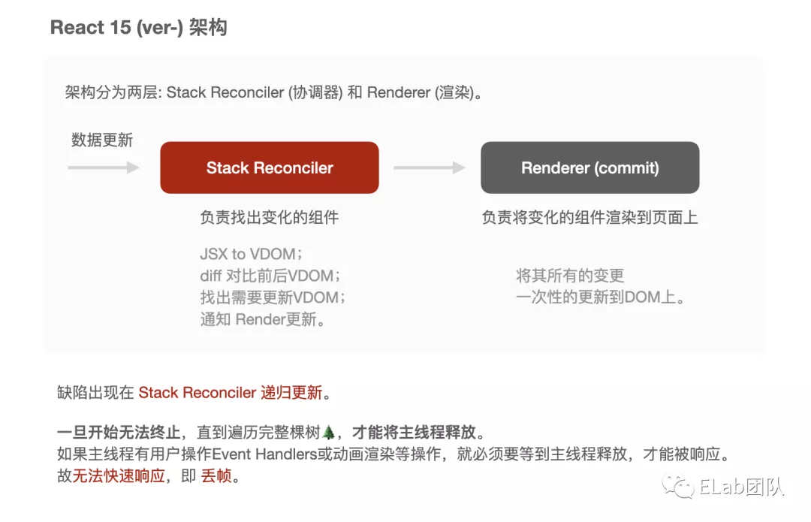
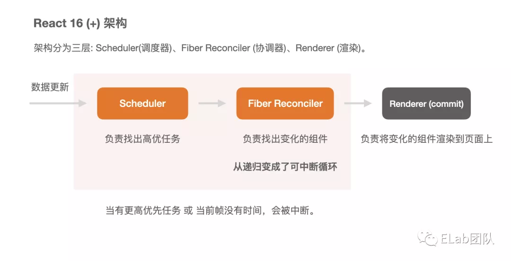
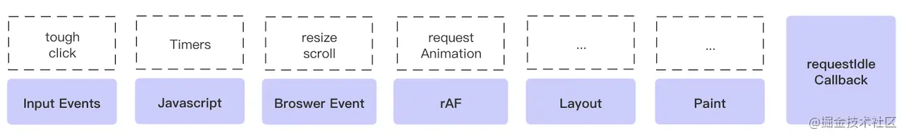

## 核心要点汇总

### ✨ 全流程总结

- 整体结构
  
- React 17 生命周期和阶段展示（绿色新为增）
  
- 渲染过程（render 阶段可以同步也可以异步，但 commit ⼀定是同步的）

  - 调用 ReactDOM.render
  - **进入 Render 阶段**【schedulerUpdateOnFiber 为标志】
  - 深度优先遍历创建完整的 Fiber 树（虚拟 DOM 树）
  - 遍历到的节点会执行生命周期函数（constructor->getDerivedStateFromProps/componentWillMount->render）
  - **进入 Commit 阶段**【commitRoot 为标志】
  - 将整棵 fiber 树对应 DOM 渲染到视图（真实 DOM）中
  - 从子节点开始执行对应的生命周期函数，然后调用父节点的（componentDidMount）
  - **调用 this.setState 改变某个子节点的状态**
  - 进入 Render 阶段
  - 再次深度优先遍历创建完整的 Fiber 树（虚拟 DOM 树）
  - 通过 diff 算法（reconcile 算法）发现不同，标记此次变化。调用该子节点的生命周期函数（getDerivedStateFromProps->render）
  - **进入 Commit 阶段**
  - 执行状态变化对应的操作，执行该子节点生命周期函数（getSnapshotBeforeUpdate）
  - 新创建的 fiber 树替换旧的 fiber 树

- 源码流程
  - jsx 经过 babel 转变成 render 函数
  - create update 创建更新
  - enqueueUpdate 更新入队（每个 fiber 节点有属于自己的 update 队列，存储多个更新，是链表的形式）
  - workLoop 大循环 【分同步和异步模式，当 workInProgress 不为空时，异步会多一个 shouldYield（需要让出）的变量决定是否继续执行】
    - performUnitOfWork（while 循环执行这个函数）
      - beginWork【递】（对单个节点工作，返回子节点 next）
      - completeUnitOfWork【归】（没有 next 的话，回溯向上找兄弟节点或父节点）
  - 拿到全部 Effect List（明确的 DOM 操作如插入/更新/删除）
  - commit 完成渲染

### ✨React Fiber 是什么，解决什么问题

Fiber 结构本质是链表结构，有三类属性：实例属性（组件类型）、构建属性（return、child、sibling）、工作属性（数据、effectList、优先级）Fiber ，用来存储节点更新信息 effectList 和 dom 信息。

#### 架构对比

- React-15 架构图

  - Reconciler(协调器) 找不同->Renderer 渲染不同
    

- React-16 架构图
  - Scheduler (调度器)找高优先级->Reconciler(协调器) 找不同->Renderer 渲染不同
    
  - Scheduler 负责时间切片和任务调度：每个更新任务都会被赋予⼀个优先级。当更新任务抵达调度器时，⾼优先级的更新任务（记为 A）会更快地被调度进 Reconciler 层；此时若有新的更新任务（记为 B）抵达调度器，调度器会检查它的优先级，若发现 B 的优先级⾼于当前任务 A，那么当前处于 Reconciler 层的 A 任务就会被中断，调度器会将 B 任务推⼊ Reconciler 层。当 B 任务完成渲染后，新⼀轮的调度开始，之前被中断的 A 任务将会被重新推⼊ Reconciler 层。
  - Reconciler 的工作就是使用 Diff 算法对比 current Fiber 和 React Element ，生成 workInProgress Fiber ，这个阶段是可中断的（中断遍历），Renderer 的工作是把 workInProgress Fiber 转换成真正的 DOM 节点。
- **总结：React15 的架构是 Reconciler+Renderer，创建和更新渲染时，会对虚拟 DOM 树进行递归（深度优先遍历），找出变动的节点，这个过程没有优先级，所以 React 会占用主线程，无法及时响应优先级更高的任务，渲染超过时间，导致用户感觉卡顿。为了解决不可中断和缺少优先级的痛点，React16 设计了 Fiber 架构，Scheduler+Reconciler+Renderer，使用 Concurrency 并发模式，让这个过程可中断，可恢复，这样能够及时处理优先级更高的任务，将正在执行的中途任务暂存，待完成任务后再去执行。主要的四个设计：**

  - **第一是 Scheduler 的时间分片的设计，根据 浏览器的帧率将渲染进程切分为一个个时间分片，如果在一个时间分片内没有完成我们的更新操作，也就是 workLoop 大循环时候的 shouldYield 变量为 true，退出循环，中断更新，保存状态，交出执行权给浏览器进行重绘重排。等到下个分片再恢复执行。**
  - **第二是 Scheduler 的任务调度的设计，React 根据不同场景赋予任务不同优先级，同一时间可能产生不同的任务，放入 taskQueue 队列中，这个队列采用了小顶堆的数据结构，按照任务的过期时间从小到大排列，可以很快找到最早过期或是最高级的任务。**
  - **第三是使用双缓存机制，用两个 fiber 树，一个是屏幕上显示内容对应的 Fiber 树，叫 current Fiber 树，另一个因为数据变化重新在内存里构建的新 Fiber 树，叫 workInProgress Fiber 树，通过 alternate 属性(指针) 建立连接。实现节点复用，每个节点的 alternate 属性指向上一棵树对应的节点。React 根节点用 current 指针指向当前的 current Fiber 树，当 workInProgress 树构建完成交给 renderer 渲染到了页面上后，此时将 current 指向新的 workInProgress 树，完成晋升变成 current Fiber 树**。
  - **第四是副作用链的设计，每个 Fiber 都有自己的 effectList（fistEffect 和 lastEffect），在 effectTag 存放待更新的副作用 DOM 操作类型。在 completeUnitOfWork 函数，顺序是从叶子节点自底向上，将当前节点的副作用链插入到父节点的副作用链中。最后在 组件根节点 rootFiber 上，拿到存储当前 Fiber 树的所有副作用集合。方便 commit 阶段对整个 effectList 进行遍历然后更新。**

- react-17
  - 实现多版本共存，可嵌套不同版本的 react，将事件委托挂载到渲染树的根 DOM 容器，之前是在 document 上
  - 实现新的优先级算法 lanes 车道，可以表示批量优先级，更细粒度地优先级排序

#### 核心流程和设计

- 核心
  - Fiber 会将⼀个⼤的更新任务拆解为许多个⼩任务。每当执⾏完⼀个⼩任务时，渲染任务会交出主线程，看看有没有优先级更⾼的⼯作要处理，空闲后再继续渲染，避免同步渲染带来的卡顿。
- 流程
  - 数据更新时，执行调度更新函数 **schedulerUpdateOnFiber**，进入 render 阶段，渲染 render 的入口模式。先判断当前是否需要调度，不需要直接同步构造 fiber 树（比如使用了 ReactDOM.render 同步模式）。如果需要调度（比如 ReactDOM.createRoot 并发模式），搭配 Scheduler 处理。注册回调函数分为同步任务构建树（performSyncWorkOnRoot 里面调用 workLoopSync）和异步任务构建树（performConcurrentWorkOnRoot 调用 workLoopConcurrent），异步任务是可中断的。
  - Scheduler 的 workLoop 会根据当前时间和任务时间判断是否需要中断（shouldYield），中断则退出循环，不需要中断则取出任务队列（expirationTime 过期时间的小顶堆结构）中堆顶的回调函数逐个执行。
  - 同步/异步构建树的 workLoop 大循环 【分同步和异步模式，当 workInProgress 不为空时，异步会多一个 shouldYield（需要让出）的变量决定是否继续执行】
    - performUnitOfWork（while 循环执行这个函数）
      - beginWork【递】（对单个节点工作，返回子节点 next）
      - completeUnitOfWork【归】（没有 next 的话，回溯向上找兄弟节点或父节点）

#### Concurrent 模式（异步渲染）下的“时间切⽚”和“优先级”实现

- 时间分片
  - React 会根据浏览器的帧率，默认是 5ms，计算出时间切⽚的⼤⼩，并计算出每⼀个切⽚的到期时间（当前时间+切片时间长度）。
  - 在 循环创建 Fiber 节点的函数 workLoopConcurrent 中，while 循环每次执⾏前，会询问当前时间切⽚是否到期 shouldYield（当前时间大于切片到期时间），若已到期，则中断，结束循环，交出主线程的控制权，避免长时间占用主线程。（在同步渲染模式下，workLoopSync 没有这个判断，会循环调用，直到节点 workInProgress 为空）

> 优先级有两种，一种是任务优先级，一种是 Fiber 优先级

- Scheduler 任务优先级调度
  - React 发 起 Task 调 度 的 姿 势 有 两 个 ： setTimeout 、MessageChannel。在宿主环境不⽀持 MessageChannel 的情况下，会降级到 setTimeout。都是异步任务。本质是模拟 requestIdleCallback 这个 API，让任务在一帧的空余时间内执行。
  - React 根据不同场景赋予任务不同优先级，同一时间可能产生不同的任务，放入 taskQueue 队列中，这个队列采用了小顶堆的数据结构，按照任务的过期时间从小到大排列，可以很快找到最早过期或是最高级的任务。
  - 过期时间越小，也就是 timeout 越小，代表优先级越高`expirationTime = startTime + timeout` startTime 是当前时间
  - 五种优先级：
  - ImmediatePriority 99 IMMEDIATE_PRIORITY_TIMEOUT=-1 立即执行的优先级，优先级最高
  - UserBlockingPriority 98 USER_BLOCKING_PRIORITY=250：用户阻塞级别
  - NormalPriority 97 NORMAL_PRIORITY_TIMEOUT=5000：正常优先级
  - LowPriority 96 LOW_PRIORITY_TIMEOUT=10000：较低优先级
  - IdlePriority 85 LOW_PRIORITY_TIMEOUT=10000 ：优先级最低，可以闲置的
  - 举例：生命周期方法优先级最高，是用户输入也属于同步执行的。一些交互事件是高优先级的，数据请求那些就是低优先级的。
- 一帧的顺序
  
- Fiber 的 update 优先级（在一棵 Fiber 树里，哪些 Fiber 以及 哪些 Update 对象，是高优先级的）
  - React16 的 expirationTimes 模型以某个优先级作为标准，只能区分是否>=expirationTimes 决定节点是否更新，导致难以从一批任务抽出单个任务。
  - React17 的 lanes 模型可以指定一个连续的优先级区间**lanes**，并且动态的向区间中增减优先级，可以处理更细粒度的更新。比如触发一个更新的优先级，拿它去和 lanes 对比，赛道被占用就下降一个优先级。
    - 以前使用 expirationTime 表示的字段，都改为了 lane。Lane 和 Lanes 就是单数和复数的关系, 代表单个任务的定义为 Lane ，代表多个任务的定义为 Lanes，表示批的概念 ，代表优先级范围。
    - Lane 的类型，被定义为二进制变量，使用一个 31 位的二进制代表 31 种可能性，这样，我们在做优先级计算的时候，用的都是位运算，计算速度也更快，比如按位与对比 a 和 b 是否有交集(0)，按位或将 a 和 b 进行合并。
    - React 一共定义了 18 种 Lane/Lanes 变量 ，每一个变量占有 1 个或多个比特位，每一种 Lane/Lanes 都有对应的优先级，越低优先级的 lanes 占用的位越多。
    - 点击事件回调中触发 this.setState 产生的 update 会获得 `InputDiscreteLanePriority` = 14。同步的 update 会获得 `SyncLanePriority` = 17（更高）。
    - NoLane、SyncLane、

### ✨React 3 种启动方式

> 主要是 fiber 节点的 mode 属性的不同，决定着这个⼯作流【初始化 → render → commit 】是⼀⽓呵成（同步）的，还是分⽚执⾏（异步）的。Fiber 架构在 React 中是⼀种同时兼容了同步渲染与异步渲染的设计。

- legacy 模式：`ReactDOM.render(<App />,rootNode)`，目前的使用方式，render 是同步渲染模式。
- concurrent 模式：`ReactDOM.createRoot(rootNode).render(<App />)`，实验中，未来的默认模式。拥有时间分片功能，可中断，可恢复
- blocking 模式：介于两者之间，渐进迁移用

### ✨ 类组件与函数组件有什么异同？

- 概念
  - 类组件：基于 ES6 的 Class 写法，继承 React.Component 的 React 组件
  - 函数组件：函数形态存在的 React 组件，早期没有 Hook，函数组件内部无法维护 state，所以也叫无状态组件。后来 Hook 出现后，补齐一些生命周期和 state 的状态管理的能力
- 相同
  - 可复用的最小代码片段，返回要渲染的元素
- 不同
  - 编程模式：类组件面向对象，函数组件是函数式编程
  - 生命周期：类组件可以访问生命周期，函数组件不能
  - this：类组件可以获取到实例化的 this，函数组件没有 this
  - 灵活性：类组件难拆分和复用，函数组件灵活，可自由选择 Hook 能力
  - 性能优化：类组件用 shouldComponentUpdate 阻止更新，函数组件依靠 React.memo 缓存渲染结果

### ✨React 事件机制

- 概念
  - JSX 上写的事件并没有绑定在对应的真实 DOM 上，而是通过事件委托的方式，将所有的事件都统一绑定在了 document 上。这样的方式不仅减少了内存消耗，还能在组件挂载销毁时统一订阅和移除事件。不过在 React17 为了实现多 React 版本共存，将事件绑定在 React 渲染树的根 DOM 容器。
  - 另外冒泡到 document 上的事件也不是原生浏览器事件，而是 React 自己实现的合成事件（SyntheticEvent）。
- 合成事件

  - 简介：它是 React 自定义的事件对象，底层抹平了不同浏览器的差异，上层提供与原生事件相同的接口，它保存了原生 DOM 事件的引用，通过`e.nativeEvent` 属性可以获取
  - 优点：开发者可以专注逻辑开发，不必关注兼容问题。帮助 React 对所有事件进行统一管理，中⼼化管控
  - 顺序：先执行原生事件，后执行 react 合成事件

- 原理
  - 注册：源码上使用原生 JS 的 `addEventListener(eventType,listener)`来进行监听，listener 是注册到 document 的统一事件分发函数，里面调用原生 JS 的 `dispatchEvent`
  - 触发：事件触发，冒泡到 document->执行 dispatchEvent->创建事件对应的合成对象，收集节点的回调和节点实例，作为合成对象的两个属性，`_dispatchListeners` 和`_dispatchInstances`，分别存放捕获-目标-冒泡这个三个阶段所涉及的回调集合和节点实例集合，按顺序执行即可。

### ✨HOC 高阶组件是什么，和普通组件有什么区别

- 概念
  - 是一个函数，接收组件为参数，返回新的组件。使用了装饰模式
- 优缺点
  - 优点：逻辑复用，不影响被包裹组件的内部逻辑
  - 缺点：
    - 被包裹，导致 refs 属性不能透传，需要用 React.forwardRef 解决
    - 静态方法不能给返回的类组件使用
    - HOC 传递给被包裹组件的 props 容易重名，导致被覆盖
- 作用
  - 代码复用，逻辑抽象
  - 根据条件渲染被包裹组件
  - 更改 被包裹组件 State 和 Props
- 实际应用
  - 权限控制
  - 渲染性能：时间计算
  - react-redux ：connect 就是一个高阶组件，接收一个 component，并返回一个新的 component，处理了监听 store 和后续的处理

```js
// hoc的定义
function withSubscription(WrappedComponent, selectData) {
  return class extends React.Component {
    constructor(props) {
      super(props);
      this.state = {
        data: selectData(DataSource, props)
      };
    }
    // 一些通用的逻辑处理
    render() {
      // ... 并使用新数据渲染被包装的组件!
      return <WrappedComponent data={this.state.data} {...this.props} />;
    }
  };

// 使用
const BlogPostWithSubscription = withSubscription(BlogPost,
  (DataSource, props) => DataSource.getBlogPost(props.id));

```

### ✨React setState 源码调用的原理

- 调用函数 enqueueSetState，将新的 `state` push 进组件的状态队列
- 调用函数 enqueueUpdate 对组件实例进行更新，这里根据 batchingStrategy 对象的`isBatchingUpdates`属性决定是否立即更新（false），还是要排队等待（true）。
- isBatchingUpdates 初始值是 false，如果 React 要执行批量更新的时候，会把它置为 true。在没更新完之前，要更新的组件都进入 dirtyComponents 排队等待下一次的批量更新。

### ✨React setState 调用之后发生了什么？是同步还是异步？

- 调用 setState 后
  - 【数据合并】多个 setState 会进行数据合并，准备批量更新
  - 【生成虚拟 DOM】生成新的 虚拟 DOM 树
  - 【diff，更新 UI】使用 diff 算法，比较新旧 虚拟 DOM 树，进行 patch，渲染 UI
  - 【执行回调函数】setState 第二个参数
- 是同步还是异步
  - 本质是同步，只是改变 state 时机不同，由全局唯一的是否在进行批量更新的变量 isBatchingUpdates 判断的，在执行生命周期和 React 事件前，React 会将这个锁设置为 true，保证每一次 setState 都有效，手动开启批量更新，执行完后再设置为 false，导致了异步的现象。
  - 异步：React 控制的地方就是异步，如生命周期、合成事件中
  - 同步：脱离 React 控制的地方是同步，如原生事件 setTimeout、setInterval、addEventListener
- 异步设计的好处
  - 性能优化，避免每次调用 setState 都进行 render 更新，可以做批量更新
  - 同步的话可能会导致 state 和 prop 和最新的不一致

### ✨React 中的 setState 批量更新的过程是什么？

- 批量更新
  - 将每次 setState 塞入队列，待事件同步代码或生命周期执行结束后，取出队列进行计算
  - 多次 setState 合并成一次状态，再拿最新的 state 值进行一次更新，渲染
  - 比如同步代码里多次对同一个 this.state.xx 属性进行更新，因为 this.state.xx 还没更新，获取到的都是旧的那个值，队列里同个属性更新只会保留最后一次更新。

### ✨ 给 setState 传递一个对象与传递一个函数的区别是什么？

- 给 setState 传递一个函数，而不是一个对象，可以确保每次的调用都是读取的就是当前的 state 值，而不是 this.state，**因为 React 不会更新 `this.state.count`，直到该组件被重新渲染才会更新**。
- 例子：传递对象，导致只更新一次，后调用的 setState() 将覆盖同一周期内先调用 setState 的值，因此商品数仅增加一次。

```js
incrementCount() {
  // 注意：这样 *不会* 像预期的那样工作。
  this.setState({count: this.state.count + 1});
}

handleSomething() {
  // 假设 `this.state.count` 从 0 开始。
  this.incrementCount();
  this.incrementCount();
  this.incrementCount();
  // 当 React 重新渲染该组件时，`this.state.count` 会变为 1，而不是你期望的 3。

  // 这是因为上面的 `incrementCount()` 函数是从 `this.state.count` 中读取数据的，
  // 但是 React 不会更新 `this.state.count`，直到该组件被重新渲染。
  // 所以最终 `incrementCount()` 每次读取 `this.state.count` 的值都是 0，并将它设为 1。
}
```

- 例子：传递函数，可以获取到最新的值，最后更新三次

```js
incrementCount() {
  this.setState((state) => {
    // 重要：在更新的时候读取 `state`，而不是 `this.state`。
    return {count: state.count + 1}
  });
}

handleSomething() {
  // 假设 `this.state.count` 从 0 开始。
  this.incrementCount();
  this.incrementCount();
  this.incrementCount();

  // 如果你现在在这里读取 `this.state.count`，它还是会为 0。
  // 但是，当 React 重新渲染该组件时，它会变为 3。
}
```

### ✨React 的生命周期有哪些？


生命周期可分为三个阶段：挂载阶段、更新阶段、卸载阶段

- 挂载阶段：完成组件第一次渲染，只发生一次
  - 顺序：`constructor()`->`getDerivedStateFromProps()`->`render()`-`>componentDidMount()`
  - `constructor`：初始化 state，事件处理方法绑定 this
  - `getDerivedStateFromProps(nextProps,prevState)`
    - 静态方法，里面访问不到 this
    - 接收参数，props（父组件的新 props） 和 state（当前自身的 state）
    - 函数需要返回一个对象用于将派生 state，不需要更新则返回 null
  - `render`：返回要渲染的内容（原生 DOM、React 组件、字符串、null 等），是每个组件必须的一个方法
  - `componentDidMount`：插入 DOM 树后调用，常用于发送请求、操作 DOM、添加订阅
- 更新阶段：当组件 props 改变或调用 setState 会触发，可发生多次
  - 顺序：`getDerivedStateFromProps()`->`shouldComponentUpdate()`->`render()`->`getSnapshotBeforeUpdate()`->`componentDidUpdate()`
  - `shouldComponentUpdate(nextProps,nextState)`：在父组件更新，所有子组件都会重新渲染，可利用这个阻止子组件重新渲染。可以比较 this.props 和 nextProps ，this.state 和 nextState 值是否变化，来确认返回 true 或者 false。当返回 false 时，组件就停止更新过程，后面的 render、componentDidUpdate 也不会被调用。
  - `getSnapshotBeforeUpdate(prevProps, prevState)`
    - 在 render 方法之后，在真实 DOM 更新前
    - 要和 componentDidUpdate 配合使用，函数的 return 返回值传给 DidUpdate()的第三个参数，默认为 null
  - `componentDidUpdate(prevProps, prevState, snapshot)`：组件更新完成后调用，一般用于操作 DOM，发请求。
- 卸载阶段：组件销毁之前调用
  - 顺序：`componentWillUnmount()`
  - 作用：一般用来取消订阅、清除计时器等
  - 注意：不要在这里 setState 了
- 错误处理阶段：
  - 顺序：`componentDidCatch(error, info)`
  - 后代组件抛出错误时调用，error 是错误信息，info 是堆栈信息

React 16 的⽣命周期被划分为了 render 和 commit 两个阶段，⽽ commit 阶段⼜被细分为
了 pre-commit 和 commit。**render 阶段在执⾏过程中允许被打断（Fiber 的作用）**，⽽ commit 阶段则总是同步执⾏的。

- render 阶段：计算状态信息，可能会被 React 暂停、终⽌或重新启动。
- pre-commit 阶段：还没最终更新到真实 DOM，但可以读取 DOM。
- commit 阶段：真正完成真实 DOM 更新，可以使⽤ DOM，运⾏副作⽤。

### ✨React 中发起网络请求应该在哪个生命周期中进行？为什么？

- 异步请求，最好放在 componentDidMount 中去操作，componentDidMount 方法中的代码，是在组件已经完全挂载到网页上才会调用被执行，所以可以保证数据的加载。此外，在这方法中调用 setState 方法，会触发重新渲染。
- react16.0 以后，componentWillMount 可能会因为中断任务被执行多次。

### ✨ 组件通信的方式有哪些

**总结：父子通信可以用 props 和父组件传入函数，兄弟组件可以通过父组件进行转接，跨级组件可以层次传递 props 或者使用 Context API，没有任何关系的组件可以用自定义的发布订阅或者使用 redux 全局状态管理**

- 父->子通信：props
  - 父组件通过在子组件上通过属性赋值`<Child xx={this.state.data}/>`
  - 子组件通过 `props.xx` 获取父组件传入的值 data
- 子->父通信：props 传入父的函数
  - 在父组件中写一个修改自身数据 setState 的函数 `changeData()`，并作为 props 属性传给子组件`<Child xx={this.changeData}/>`
  - 子组件通过调用 `props.xx('newData')`，将数据传给父组件
- 兄弟组件通信
  - 共用一个父组件
  - 利用这个父组件来进行通信，转换为兄弟 1->父组件，父组件->兄弟 2 的通信形式
- 跨级

  - 层层传递 props：不推荐，作为桥梁的组件引入很多不属于自己的属性，难以维护。

  - 使用 Context API
    - 三要素：React.createContext、Provider 数据提供者、Consumer 数据消费者
    - hooks 则使用 useContext 替换 Consumer 即可`const ctx = useContext(Context); ctx.xx`
    - 创建一个 context 对象`const AppContext = React.createContext(defaultValue)`
    - 读取 Provider 和 Consumer`const { Provider, Consumer } = AppContext`
    - 使用 Provider 进行包裹根组件` <Provider value={title: this.state.title, content: this.state.content}> </Provider>`
    - 使用 Consumer 在孙子组件进行读取数据 `<Consumer>{value => <div>{value.title}</div>}</Consumer>`
    - 即便组件的 shouldComponentUpdate 返回 false，它仍然可以“穿透”组件继续向后代组件进⾏传播，进⽽确保了数据⽣产者和数据消费者之间数据的⼀致性。

- 没有任何关系的组件
  - 发布订阅模式 EventEmitter
  - redux 全局状态管理

### ✨Redux 原理及工作流程

- Redux 工作流
  
- React 数据流是单向的，简单的 props 传递不足以支撑大型项目对很多 state 状态的管理
- Redux 是一个状态容器：用来存放公共数据的仓库，它由三部分组成：store、reducer 和 action。react- redux 作用是将 Redux 的状态机和 React 的 UI 呈现绑定在一起，当你 dispatch action 去改变 state 的时候，会自动更新页面。
- 工作流程：任何组件可以通过 dispatch 派发 action 对象，由 reducer 读取 action，根据 action 的不同 对数据进行修改，生成新的 state，更新到用来存放数据的 store 里。
- 任何组件可以通过约定的方式如 getState()读取到这些状态数据，也可以通过派发 Action 修改全局状态，实现组件数据的穿梭。

- 源码模块

  - createStore.js 提供作为生成唯一 store 的函数（重要）
    - 接收参数 reducer、初始 state、中间件
    - 定义了 getState、subscribe、dispatch 等方法
    - 执行一次 dispatch 完成初始化
    - 将方法放入 store 对象中，并返回
  - applyMiddleware.js 这个方法通过中间件来增强 dispatch 的功能
  - 以下是工具性质
  - compose.js 提供从右到左组合函数
  - combineReducers.js 合并多个 reducer 的函数

- 源码细节（注册、发布、订阅监听）

  - 创建 store 对象成功后，通过 store.subscribe 注册监听函数，会保存在 listeners 数组中
  - 在 dispatch 发布时，通过上锁的方式，避免开发者在 reducer 中又调用 dispatch 进行操作导致死循环
  - reducer 执行完后，触发订阅，将 listeners 数组中的监听函数逐个执行

- 数据传递顺序：view-->action-->reducer-->store-->view
- 具体使用
  

  ```js
  import { createStore } from "redux";
  // 创建 reducer
  const reducer = (state, action) => {
    // 此处是判断action的类型，做各种样的 state处理逻辑
    return new_state;
  };
  // 基于 reducer 创建 state
  const store = createStore(reducer);
  // 创建⼀个 action，这个 action ⽤ “ADD_ITEM” 来标识
  const action = {
    type: "ADD_ITEM",
    payload: "<li>text</li>",
  };
  // 使⽤ dispatch 派发 action，action 会进⼊到 reducer ⾥触发对应的更新
  store.dispatch(action);
  ```

- react-redux 使用，主要是两个 API

  - Provider: 从最外部封装整个应用，并向 connect 模块传递 store;
  - connect: （高阶组件）负责连接 react 和 redux
    - 包装原组件：将 state,action 通过 props 的方式传入到原组件内部
    - 监听 store tree 变化：使其包装的原组件可以响应 state 的变化，调用 setState()进行更新渲染

  ```js
  import React from "react";
  import ReactDOM from "react-dom";
  import { createStore } from "redux";
  import { Provider, connect } from "react-redux";
  class App extends React.Component {
    render() {
      let { text, click, clickR } = this.props;
      return (
        <div>
          <div>数据:已有人{text}</div>
          <div onClick={click}>加人</div>
          <div onClick={clickR}>减人</div>
        </div>
      );
    }
  }
  const initialState = {
    text: 5,
  };
  const reducer = function (state, action) {
    switch (action.type) {
      case "ADD":
        return { text: state.text + 1 };
      case "REMOVE":
        return { text: state.text - 1 };
      default:
        return initialState;
    }
  };

  let ADD = {
    type: "ADD",
  };
  let Remove = {
    type: "REMOVE",
  };

  const store = createStore(reducer);

  let mapStateToProps = function (state) {
    return {
      text: state.text,
    };
  };

  let mapDispatchToProps = function (dispatch) {
    return {
      click: () => dispatch(ADD),
      clickR: () => dispatch(Remove),
    };
  };

  const App1 = connect(mapStateToProps, mapDispatchToProps)(App);

  ReactDOM.render(
    <Provider store={store}>
      <App1></App1>
    </Provider>,
    document.getElementById("root")
  );
  ```

### ✨Redux 的中间件

- 基本概念
  - 前端框架实现了数据到视图的绑定，我们只需要关心数据流就可以了。相比 context 的混乱的数据流，redux 的 view -> action -> store -> view 的单向数据流更清晰且容易管理。
  - 前端代码中有很多异步过程，这些异步过程之间可能有串行、并行甚至更复杂的关系，放在组件里并不好管理，可以放在 redux 的中间件里。
  - redux 的中间件就是对 dispatch 的层层包装，比如 redux-thunk 就是判断了下 action 是 function 就执行下，否则就是继续 dispatch
  - redux-thunk 并没有提供多个异步过程管理的机制，复杂异步过程的管理还是得用 redux-saga 或者 redux-observable。
- Redux 的中间件主要用于改变数据流，做一些"副作用"的操作，如异步请求、打印日志等，主要是 applyMiddleware 这个方法。通过在创建 store 时将 applyMiddleware()的返回值 作为参数传入的。
  - 未使用 redux: action -> reducer
  - 使用 redux: 自定义拦截，变成 action -> middlewares -> reducer
  - applyMiddleware 会对 dispatch 进行改写，让他触发 reducer 之前，先执行 Redux 的中间件链式调用。
  - 使用 compose 组合函数，原理是数组的 reduce 方法。

### ✨Redux 和 Vuex 有什么区别，它们的共同思想

- 相同
  - 都是从 Flux 衍生
  - 单一数据源、单向数据流
- 不同
  - Vuex 以 mutations 变化函数取代 Reducer，无需 switch 判断，只需在 action 函数中使用 commit 对应的 mutation 函数，由 mutation 直接改变指定的 state 值即可，Vue 检测到数据变化自动渲染
  - Redux 是可以用到 Vue 中的，但不如 vuex 契合度更高
- 和 Flux 有何不同
  - Store 数目：Flux 可以多个，Redux 只有一个

### ✨Redux 和 Mobx 有什么区别

- redux 数据存在单一的 store 中，适用于单个全局状态管理。mobx 数据存在多个分散的 store 中，适用于多个全局状态
- redux 状态是不能直接修改的，需要通过 dispatch 来派发 action。mobx 是可以直接修改的
- redux 保存数据后手动处理变化后的操作，mobx 用 observable 保存数据，数据变化自动处理响应操作
  - 结合 react-redux 可实现自动变更，mobx 使用 mobx-react-lite，自定义 hook 获取 store 的实例，用 observer 将组件包裹起来完成监测，数据变动会更新

### ✨ 项目使用哪种方案

- 简单场景：使用组件通信
- 中等场景：优先考虑使用 React 提供的 API 进行管理，如 React.createContext 和 useContext
- 复杂场景：第三方状态管理库 Redux、Mobx

- 方案汇总
  - React Context
    - createContext、useContext 和 useReducer
    - 缺点：嵌套 Provider 的写法难受，而且 context 小部分 state 变更导致消费 context 的组件重渲染，需要结合 memo 优化
  - Redux
    - 搭配 react-redux
    - 缺点：嵌套模板写法难受，副作用要使用中间件隔离
  - umi 的 useModel
    - 常用于中台项目的全局共享数据
    - 就是一个普通的自定义 hooks，但 @umijs/plugin-model 把其中的状态变成了『全局状态』，多个组件中使用该 model 时，拿到的同一份状态。
    - `const { user, fetchUser } = useModel('user', model => ({ user: model.user, fetchUser: model.fetchUser }));`

### ✨ 对 React Hook 的理解，为什么需要它，解决了什么问题

- 以前的函数组件无法维护 state 状态，也叫无状态组件。设计了 hooks 来补全生命周期，state 管理能力，同时更契合 React 理念，也就是数据驱动视图。还可以让状态复用变得更简单，不用破坏组件结构。**Hooks 本质是链表**
- 优点
  - 【避开难以理解的 Class 组件】：this 的不确定性（常用 bind 和箭头函数解决）和生命周期会将逻辑打散塞进去，比如设置订阅和卸载订阅会被分散到不同生命周期去处理
  - 【让状态逻辑复用更简单】：以前是用 HOC 高阶组件等方式实现复用状态逻辑（会破坏组件结构，容易导致嵌套地狱），现在可以通过自定义 Hook 来实现（不会破坏组件结构）
  - 【解决业务逻辑难以拆分的问题】比如订阅和取消订阅会被分散在不同生命周期里，导致不聚合。用 hook 可以实现聚合。
  - 【函数组件更契合 React 的理念】：UI=f(data)，数据驱动视图
- 缺点
  - 不能完全补齐类组件的生命周期，如 getSnapshotBeforeUpdate、 componentDidCatch
  - 使用层面有限制，比如说不能在嵌套、循环、判断中写 Hook

### ✨ 常用 Hooks 有哪些

- 基础 Hook
  - useState : 状态钩子，为函数组件提供内部状态。
  - useEffect ：副作用钩子，提供了类似于 componentDidMount 等生命周期钩子的功能
  - useContext ：共享钩子，在组件之间共享状态，可以解决 react 逐层通过 props 传递数据
- 额外的 Hook

  - useReducer: action 钩子，提供了状态管理，其基本原理是通过用户在页面上发起的 action，从而通过 reduce 方法来改变 state，从而实现页面和状- 态的通信，**使用很像 redux**，但无法提供中间件功能
  - useCallBack：把内联回调函数及依赖项数组作为参数传入 useCallback，它将返回该回调函数的 memoized 版本，该回调函数仅在某个依赖项改变时才会更新
  - useMemo：把"创建"函数和依赖项数组作为参数传入 useMemo，它仅会在某个依赖项改变时重新计算， 可以作为性能优化的手段
  - useRef：获取组件的实例，返回一个可变的 ref 对象，返回的 ref 对象在组件的整个生命周期内保持不变
  - useLayoutEffect： 它会在所有 DOM 变更后同步调用 effect

- 核心 Hook：

  - useState()
    - 为函数组件引入状态，state 类似类组件的 state 中的某个属性，对应一个单独状态，可以存储任何类型的值
    - 初始化`const [state, setState] = useState(initialState);`
    - 触发更新和渲染`setState(newState)`
    - 入参是函数的情况：初始状态需要复杂计算时，初始状态是复杂对象时
  - useEffect()

    - 两个参数：回调函数和依赖数组
    - 允许函数组件执行副作用操作，一定程度上弥补了生命周期的能力
    - useEffect 回调中返回的函数被称为“清除函数”，会在卸载时执⾏清除函数内部的逻辑。
    - 使用

      - 每次渲染都会执行的副作用`useEffect(callBack)`
      - 仅挂载阶段执行一次的副作用`useEffect(callBack, [])`
      - 仅挂载阶段和卸载阶段执行的副作用：挂载阶段执行 A，卸载阶段执行 B

        ```js
        useEffect(() => {
          // 这⾥是 A 的业务逻辑

          // 返回⼀个函数记为 B
          return () => {};
        }, []);
        ```

      - 根据依赖更新触发执行副作用：React 进行一次新的渲染会对比前后依赖数组中是否有某个元素改变，有就会触发副作用。
        ```js
        useEffect(() => {
          // 业务逻辑
        }, [num1, num2, num3]);
        ```

  - useContext（适合复杂嵌套透传场景）
    - 第一步：使用 createContext 声明一个 Context
    - 第二步：将 Provider 包在顶层
    - 第三步：通过 useContext 获取透传数据
  - useMemo
    - 缓存一些耗时计算
    - 保证引用不变
  - useCallback（用 useMemo 可以代替 useCallback）
  - 简化版的 useMemo，方便缓存函数的引用

### ✨useState 和 useRef 如何选择维护状态

- 维护 UI 状态，使用 useState
- 值更新不需要重绘，使用 useRef
- 不变更的值，用 useState，不返回变更函数

### ✨ 使用 React.memo 解决 context 引起的一部分数据的经常变更问题

- 增加多一层组件，将单纯依赖的数据用 useMemo 包裹起来，通过 props 传给真正渲染的组件
- 真正渲染的组件再用 React.memo 包裹一次

```js
import { useMemo, useContext } from "react";
import { SomeContext } from "./SomeContext";

function PickContextData(props) {
  const ctx = useContext(SomeContext);
  const someDataFromContext = useMemo(() => {
    return ctx.data;
  }, [ctx.data]);
  return <RenderComponent data={someDataFromContext} {...props} />;
}

const RenderComponent = React.memo((props) => {
  // 略
});
```

### ✨useState

- 为什么 useState 要使用数组而不是对象
  - 解构赋值可以按顺序自定义命名
  - 如果返回对象，用来解构，需要保持同名，或者修改为别名，比较麻烦
- 一个父组件更新了，那么这个子组件如果没有更新，会不会触发 rerender?子组件会不会重复触发 useState 的初始化？
  - 子组件会重新渲染，不会触发子组件的 useState 初始化。因为源码里判断一个 fiber 处于 mount 还是 update 阶段，是根据 fiberNode 的 alternate 是否存在来判断的。
- 如果我 useState 的回调函数里还是 设置了相同的变量，会不会触发更新？
  - 不会，因为 hooks 算出来的 updatePayload 是相同的。
  - PS: useState 不会，但是 setState 会

### ✨hooks 源码解析

- 前置知识
  - 每个组件是一个 fiber 节点，里面有 memoizedState 存放这个组件里面的所有 hook 对象，是单向链表
  - 挂载时和更新时的 hook 函数是区分开的。每个 hook 第一步都是获取当前 hook 对象 workInProgressHook ，里面存放一些记忆值 memoizedState，queue 更新值队列，对象，函数，next 指针等。
- useState 其实是预置了 reducer 的 useReducer，内部也是调用 updateReducer，这个 reducer 只是判断函数就执行函数，否则返回值。
  - mountState：（⾸次）构建链表，根据传入的初始值 initialState，创建一个记忆 memoizedState
  - updateState：（更新）遍历链表，基于上一个 state，根据 queue 队列中的环形链表（方便优先级操作）去更新每一步的 state 值（存在多个 updateState 调用的情况），并返回 hook.memoizedState 和一个 dispatch 函数（用于触发更新）。
- useEffect
  - mountEffect 保存传入的副作用函数 create 和依赖项
  - `hook.memoizedState = {create, nextDeps}`
  - updateEffect 根据情况是否执行 create 函数
- useRef
  - mountRef 创建一个对象，里面有 current 属性，存放 initialValue
  - `hook.memoizedState = ref`（ref 其实就是`{current:initialValue}`）
  - updateRef 直接返回对象 hook.memoizedState
- useMemo（可以用来实现 useCallback）
  - mountMemo 会执行一遍你传入的函数，缓存函数计算出来的值
  - `hook.memoizedState = [nextValue, nextDeps]`
  - updateMemo 用 Object.is 浅比较前后依赖项 deps 的值，一致则返回之前的 value 值。如果不一致，则再次执行传入的函数，获取新的值。
- useCallback
  - mountCallback 不会执行你传入的函数，缓存你的函数
  - `hook.memoizedState = [callback, nextDeps]`
  - updateCallback 用 Object.is 浅比较前后依赖项 deps 的值，一致则返回之前缓存的 callback 函数。如果不一致，并返回传入的 callback 函数。

### ✨React Hook 的使用限制有哪些？React Hooks 在平时开发中需要注意的问题和原因

- 不要在循环、条件或嵌套函数中调用 Hook，要在顶层使用
  - 会导致遍历 hooks 对象时，顺序不一致，发生数据错位
- 只能在 React 的函数组件中调用 Hook

### ✨useEffect 与 useLayoutEffect 的区别

- 不同点

  - useLayoutEffect 会在 DOM 更新完成后**同步调用**，会在绘制之前完成，阻塞浏览器绘制。主要用于处理 DOM 操作、避免页面闪烁的问题
  - 而 useEffect 是**异步调用**的，不阻塞浏览器更新屏幕。
  - useLayoutEffect 总是比 useEffect 先执行。
  - 大多数据情况下，effect 不需要同步地执行，个别情况下（例如测量布局），有单独的 useLayoutEffect hook 可使用，其 API 与 useEffect 相同

- 相同点
  - 都是执行副作用
  - 使用方式一致
- 建议
  - 先用 useEffect，一般问题不大；如果页面有异常或者要 DOM 操作，再直接替换为 useLayoutEffect 即可

### ✨React Hooks 和生命周期的关系？

- constructor -> `useState`
- getDerivedStateFromProps -> `useState` 里的 update 函数
- shouldComponentUpdate -> `useMemo`
- componentDidMount -> `useEffect(callBack, [])`
- componentDidUpdate -> `useEffect(callBack, [num1,num2])`
- componentWillUnmount -> `useEffect` 返回的函数

### ✨ 函数组件的闭包问题：Hooks 的 capture values

- 本质：**非 useRef 相关的 Hooks API，本质上都形成了闭包，闭包有自己独立的状态**
- capture values：每次 Render 的内容都会形成一个快照并保留下来，每个 Render 状态都拥有自己固定不变的 Props 与 State。
- 异步回调的场景下，会拿到旧的 state 值，比如使用定时器，初始化 setInterval 时候，将 count 闭包起来，导致无论调用多少次，都是初始的那个值

```js
function Counter() {
  const [count, setCount] = useState(0);

  useEffect(() => {
    const id = setInterval(() => {
      // 初始化时的这个render时刻，count已固定为0
      setCount(count + 1);
    }, 1000);
    return () => clearInterval(id);
  }, []);

  return <h1>{count}</h1>;
}
```

```js
const App = () => {
  const [temp, setTemp] = React.useState(5);

  const log = () => {
    setTimeout(() => {
      // 虽然延时3秒，但还是在那个render时刻里面的值，是5。
      console.log("3 秒前 temp = 5，现在 temp =", temp);
    }, 3000);
  };

  return (
    <div
      onClick={() => {
        log();
        setTemp(3);
        // 3 秒前 temp = 5，现在 temp = 5
      }}
    >
      xyz
    </div>
  );
};
```

- 我们可以用 useRef 解决，它的引用不变，通过`const countRef = useRef(count);countRef.current = count;` 通过 countRef.current 来访问最新的值
- 还可以使用 setState()的函数形式，获取最新的 state
- 还可以 useEffect 诚实的写上我们所依赖元素，让它重新执行

### ✨Diff 算法原理

- 调和指的是让虚拟 DOM 映射到真实 DOM 上，分别有 React 15 栈调和、React16 的 Fiber 调和
- Diff 算法属于调和 Reconciler 里的一个环节：更新过程调用 Diff 算法
- React 的 Diff 的三个策略
  - 树层面：两个虚拟 DOM 树的分层递归对比：降低 diff 算法时间复杂度，O(n^3)->O(n)
  - 组件层面：类型一致的节点才 Diff，不同组件类型直接替换，不进行 diff，减少冗余递归操作
  - 节点层面：节点 key 属性的设置，使尽可能重用同一层级的节点，有了唯一的标记，每次 diff 会找到对应元素 key，key 值一致可以重用该节点，而不会因为位置顺序不同，直接做删除重建处理。

### ✨React 性能优化

- 三种情况导致重绘
  - state 变更
  - 父组件重渲染
  - 依赖的 context 变更
- 三大主要手段

  - shouldComponentUpdate（针对类组件）
  - PureComponent 和 Immutable.js（针对类组件）
  - React.memo 和 useMemo（针对函数组件）

- shouldComponentUpdate：根据返回值 true 则执行 render，false 则不 render

  ```js
  shouldComponentUpdate(nextProps, nextState) {
    /* 当 props 发生改变的时候，重新更新组件 */
    return nextProps.data1 !== this.props.data1
  }

  ```

- PureComponent + Immutable.js
  - PureComponent 内置了一个功能，在 shouldComponentUpdate 中对组件更新前后的 props 和 state 进⾏浅⽐较，并根据浅⽐较的结果，决定是否需要继续更新流程。`export default class ChildA extends React.PureComponent`
  - “浅⽐较”将针对值类型数据对⽐其值是否相等，⽽针对数组、对象等引⽤类型的数据则对⽐其引⽤是否相等。在 PureComponent 对引用类型可能会判断失误，比如引用没变，但是内部属性值变了，不会导致重渲染。
  - 使用不可变值的库 Immutable.js，创建一个 Map 对象，调用其 api 如 set 修改内容，会返回一个新的对象，搭配 PureComponent，判断数据变更了，就会执行渲染，避免误判的情况。
- React.memo 和 useMemo 包裹组件
  - React.memo 接收两个参数，一个是目标组件，一个是可选的 props 的对比逻辑（类似 shouldComponentUpdate 内的逻辑），如果不传，默认进行 props 的浅比较。
  - useMemo 控制是否需要重复执行某段逻辑（组件内的某个小函数组件），React.memo 控制是否重渲染某个组件
  - useMemo `const memoizedValue = useMemo(() => compute(a, b), [a, b]);` 如果依赖没变，那么会复用该记忆值，依赖改变，重新计算。
- 其他

  - useCallback 包裹回调，react.memo 可以判断出 callback 函数没改变
  - 合并 state，多个 state 合并为一个
  - 缓存数据不放在 state 中，跟视图相关的才放在 state 中，避免不必要的渲染。
  - 循环的 key 写法，不要用 index，要用唯一 id
  - 懒加载：Suspense 和 lazy 可以实现 dynamic import 懒加载效果

  ```js
  const LazyComponent = React.lazy(() => import("./LazyComponent"));

  function demo() {
    return (
      <div>
        <Suspense fallback={<div>Loading...</div>}>
          <LazyComponent />
        </Suspense>
      </div>
    );
  }
  ```

### ✨React-Router 的路由有几种模式？

- React-Router 支持使用 HashRouter 和 BrowserRouter 两种路由规则
- BrowserRouter

  - basename 路由的基准 URL

  ```js
  // 相当于<a href="/calendar/today" />
  <BrowserRouter basename="/calendar">
    <Link to="/today" />
  </BrowserRouter>
  // 使用确认函数，内部是window.confirm
  <BrowserRouter getUserConfirmation={getConfirmation} />
  ```

- HashRouter
  - hashType
    - slash - 后面跟一个斜杠，例如 #/ 和 #/sunshine/lollipops；
    - noslash - 后面没有斜杠，例如 # 和 #sunshine/lollipops；
    - hashbang - Google 风格的 ajax crawlable，例如 #!/ 和 #!/sunshine/lollipops。

```js
<HashRouter basename={string} getUserConfirmation={func} hashType={string} />
```

### ✨React-router 的源码

- react-router 库：⽀持使⽤ hash（对应 HashRouter）和 browser（对应 BrowserRouter） 两种路由规则。
- history 库 ：提供核心的 API，HashRouter 调 ⽤ 了 createHashHistory ， BrowserRouter 调 ⽤ 了 createBrowserHistory，这两个 history 的实例化⽅法均来源于 history 这个独⽴的代码库
- react-router-dom 库：在 react-router 的核心基础上，添加了用于跳转的 Link 组件，和 histoy 模式下的 BrowserRouter 和 hash 模式下的 HashRouter 组件等
- 流程图
  

## 一、组件基础

### React 事件和 HTML 原生事件的区别

- 【事件名小驼峰】react 事件命令采用**小驼峰式**，原生事件是纯小写
- 【事件方法函数】使用 JSX 语法时，需要**传入一个函数**作为事件处理函数，原生事件是一个字符串
- 【阻止默认行为】不能通过 `return false` 来阻止默认行为。必须明确调用 `e.preventDefault()`阻止默认行为

### React 组件设计

- 显示组件
  - 样式组件（复杂样式简化配置）
  - 容器组件（类似插槽，根据不同的位置放入）
- 功能组件
  - 高阶组件抽离逻辑（登录、埋点）

### React 高阶组件、Render props、hooks 有什么区别，为什么要不断迭代

- Render props
  - 概念：组件有一个 props，它是一个返回 React 元素的 render 函数
  - 优点：代码复用，数据共享
  - 缺点：无法在 return 语句外访问数据、嵌套写法不够优雅

```js
// DataProvider组件内部的渲染逻辑如下
class DataProvider extends React.Components {
  state = {
    name: "Tom",
  };

  render() {
    return (
      <div>
        <p>共享数据组件自己内部的渲染逻辑</p>
        {this.props.render(this.state)}
      </div>
    );
  }
}

// 调用方式
<DataProvider render={(data) => <h1>Hello {data.name}</h1>} />;
```

- 自定义 hook
  - 概念：使用 React16.8 的 Hook API，写自定义 hook，复用代码逻辑
  - 优点：使用简介直观；解决了 prop 的重名问题；解决 render props 嵌套的问题；
  - 缺点：只能在顶层使用，不能在分支语句中使用

```js
// 自定义一个获取订阅数据的hook
function useSubscription() {
  const data = DataSource.getComments();
  return [data];
}
//
function CommentList(props) {
  const {data} = props;
  const [subData] = useSubscription();
    ...
}
// 使用
<CommentList data='hello' />

```

- 总结
  - 都是为了解决代码逻辑复用的问题
  - HOC 和 render props 有一些缺点
  - Hooks 的代码逻辑复用更简介清晰，也避免了 HOC 和 render props 的问题

### React 中什么是受控组件和非控组件？

- 受控组件（推荐使用）
  - `<input type="text">, <textarea> 和 <select>` 之类的标签它们都接受一个 value 属性，当表单的状态发生变化，就会触发 onChange 事件，更新组件的 state。`this.setState({value: event.target.value});`
  - 缺点：如果多个输入框，每个都要写事件处理函数，比较繁琐
  ```jsx
  <input
    type="text"
    value="{this.state.value}"
    onChange="{this.handleChange}"
  />
  ```
- 非受控组件
  - 概念：一个表单组件没有 value props（单选和复选按钮对应的是 checked props）时，就可以称为非受控组件
  - 在非受控组件中，可以使用一个 ref 来从 DOM 获得表单值。而不是为每个状态更新编写一个事件处理程序

```js
class NameForm extends React.Component {
  constructor(props) {
    super(props);
    this.handleSubmit = this.handleSubmit.bind(this);
    this.input = React.createRef();
  }

  handleSubmit(event) {
    alert("A name was submitted: " + this.input.current.value);
    event.preventDefault();
  }

  render() {
    return (
      <form onSubmit={this.handleSubmit}>
        <label>
          Name:
          <input type="text" ref={this.input} />
        </label>
        <input type="submit" value="Submit" />
      </form>
    );
  }
}
```

- 总结
  - React 推荐使用受控组件，与 state 有关
  - 想快速编写代码，减少代码量使用非受控组件，与组件 state 无关

### 对 React context 的理解

- 概念
  - 组件层级太多，不想逐层传递 props 数据，可以用 context 实现跨层级数据传递
  - 组件上的 context 由父节点的所有 context 对象组合成的，所以可以访问到父组件链上的所有节点 context 属性

## 二、数据管理

### 在 React 中组件的 this.state 和 setState 有什么区别？

- this.state 通常是用来初始化 state 的，this.setState 是用来修改 state 值的。
- 如果初始化了 state 之后再使用 this.state，之前的 state 会被覆盖掉，如果使用 this.setState，只会替换掉相应的 state 值。
- 所以，如果想要修改 state 的值，就需要使用 setState，而不能直接修改 state，直接修改 state 之后页面是不会更新的。

### React 组件的 state 和 props 有什么区别？

- state

  - 主要用于组件自身的状态，通过 this.setState 修改，修改 state 会导致组件重新渲染

- props
  - 主要用于父组件向子组件传递数据，是可读，不可变的。只能通过外部传入新的 props，将新的 props 更新到 state，实现子组件渲染。

### React 中的 props 为什么是只读的？

- 原则上只能是从父组件流向子组件，保证相同的输入，显示内容一致

### 在 React 中组件的 props 改变时更新组件的有哪些方法？

- getDerivedStateFromProps
  - 使用：通过参数提供的 nextProps 以及 prevState 来进行判断，根据新传入的 props 来映射到 state
  - 如果 props 传入的内容不需要影响到你的 state，那么就需要返回一个 null，表示不对 state 进行操作

```js
static getDerivedStateFromProps(nextProps, prevState) {
    const {type} = nextProps;
    // 当传入的type发生变化的时候，更新state
    if (type !== prevState.type) {
        return {
            type,
        };
    }
    // 否则，对于state不进行任何操作
    return null;
}

```

## 三、生命周期

### React 新增/废弃了哪些生命周期？为什么？

- 新增
  - getDerivedStateFromProps
  - getSnapshotBeforeUpdate
  - getDerivedStateFromError
- 废弃 will 之类的
  - componentWillMount
  - componentWillReceiveProps
  - componentWillUpdate

废弃这三个函数的原因：fiber 的出现，高优先级任务会打断当前任务，导致被执行多次。而且避免开发者滥用生命周期，导致不好维护。

- componentWillMount：初始化可以在 constructor 里操作，还有有些开发者会把异步请求放这里，其实错误，并不能提高获取结果的速度，放在 componentDidMount 就可以。
- componentWillReceiveProps：可用 getDerivedStateFromProps 代替，只能根据新 props 对比前 state，来派生新的 state，不能访问 this，写不出副作用的代码
- componentWillUpdate：可用 getSnapshotBeforeUpdate 替换，获取 render 前的 DOM 元素状态，保证和 componentDidUpdate 的状态保持一致

### React 16.X 中 props 改变后在哪个生命周期中处理

getDerivedStateFromProps

- 根据新的 props 和组件自身的旧 state 来映射新 state
- 如果 props 不影响 state，则返回 null

```js
static getDerivedStateFromProps(nextProps, prevState) {
    const {type} = nextProps;
    // 当传入的type发生变化的时候，更新state
    if (type !== prevState.type) {
        return {
            type,
        };
    }
    // 否则，对于state不进行任何操作
    return null;
}

```

### React 性能优化在哪个生命周期？它优化的原理是什么？

- 两种情况导致不必要的重新渲染影响性能。
  - setState 函数设置同个变量，是会触发重新渲染的。`this.setState({number: this.state.number})`
  - 父组件 render 会导致子组件重新渲染，有时候子组件不需要更新
- 可进行优化的生命周期：shouldComponentUpdate

  - 拿当前 props 中值和下一次 props 中的值进行对比，数据相等时，返回 false，反之返回 true。
  - 是浅比较

  ```js
  shouldComponentUpdate(nextProps) {
      if (this.props.num === nextProps.num) {
          return false
      }
      return true;
  }
  ```

## 四、组件通信

> React 的数据流是单向的

### 如何解决 props 层级过深的问题

- 使用 Context API：提供一种组件之间的状态共享，而不必通过显式组件树逐层传递 props
- 使用 Redux 等状态库

## 五、路由

### React-Router 的实现原理是什么？

- 基于 hash
- 基于 H5 的 history API

### 如何配置 React-Router 实现路由切换

- Route 组件

  - 比较 path 属性和当前地址的 pathname
  - 匹配到了渲染内容，匹配不到渲染 null
  - 没配置 path 属性始终被匹配

  ```js
  // when location = { pathname: '/about' }
  <Route path='/about' component={About}/> // renders <About/>
  <Route path='/contact' component={Contact}/> // renders null
  <Route component={Always}/> // renders <Always/>

  ```

- Route 组件 + Switch 组件

  - Switch 包裹多个 Route 组件，遍历它们，找到匹配的第一个元素。不加 Switch 的话可能会匹配多个，然后同时展示
  - 搭配 exact 实现精准匹配
  - Switch 除了 Route 和 Redirect ，不能放其他元素。

  ```js
  import { Switch, Route } from "react-router-dom";

  <Switch>
    <Route exact path="/" component={Home}></Route>
    <Route exact path="/login" component={Login}></Route>
  </Switch>;
  ```

- Link、NavLink、Redirect 组件

  - Link 组件会渲染成`<a>`标签，创建一个链接，to 属性表示将跳转的路由地址

  ```js
  <Link to="/">Home</Link>
  // <a href='/'>Home</a>
  ```

### React-Router 如何获取 URL 的参数和历史对象？

- 获取 URL 参数
  - ？传值：`/admin?id=xxx`
    - `this.props.location.search` 可以获取字符串`'?id=xxx'`
  - 动态路由传值：`path='/admin/:id'`
    - `this.props.match.params.id` 获取 id 的值
  - query 或 state：在 Link 组件的 to 属性中可以传递`{pathname:'/admin',query:'111',state:'111'}`
    - `this.props.location.state` 或 `this.props.location.query`
- 获取历史对象 history

  - useHistory
  - this.props.history

  ```js
  import { useHistory } from "react-router-dom";
  let history = useHistory();
  // or
  let history = this.props.history;
  ```

### React-router 的使用

- 设置重定向，使用 RedirectAPI 放最后，且搭配 Switch 包裹
  

## 六、Redux

### Redux 中异步的请求怎么处理

- 使用 redux 的异步中间件：主流有两种
  - redux-thunk
  - redux-saga

## 七、Hooks

### 创建自定义 Hooks

- 定义一个 hook 函数，并返回一个数组（内部可以调用 react 其他 hooks）
- 从自定义的 hook 函数中取出对象的数据，做业务逻辑处理即可

## 八、虚拟 DOM

### 虚拟 DOM

- 虚拟 DOM 工作流：新旧虚拟 DOM 树进行 diff，然后找出需要更新的内容，最后 patch 到真实 DOM 上。
  
- 【What】虚拟 DOM 是什么：虚拟 DOM 是 JS 对象，是对真实 DOM 的描述，不依赖具体框架。
- 【How】React 中的虚拟 DOM
  - 挂载阶段：结合 JSX 的描述，构建出虚拟 DOM 树，通过 ReactDOM.render 实现虚拟 DOM 到真实 DOM 的映射（触发渲染流水线）
  - 更新阶段：虚拟 DOM 在 JS 层借助 diff 算法找出哪些需要被改变，再讲这些改变作用于真实 DOM
- 【Why】虚拟 DOM 的价值
  - 更好的研发体验和效率：数据驱动视图，函数式 UI 编程，同时性能还不错
  - 跨平台：多出中间一层描述性的虚拟 DOM，可以对接不同平台的渲染逻辑，实现多端运行。

## 九、错误处理

React 异常捕获：使用错误边界组件包裹

> 错误边界是一种 React 组件，这种组件可以捕获并打印发生在其子组件树任何位置的 JavaScript 错误，并且，它会渲染出备用 UI，而不是渲染那些崩溃了的子组件树。错误边界在渲染期间、生命周期方法和整个组件树的构造函数中捕获错误。

- 如何编写组件

  - 使用 componentDidCatch() 变成一个错误边界，可以用它**打印错误信息**
  - 使用 static getDerivedStateFromError() **改变 state，渲染备用 UI**

    ```js
    class ErrorBoundary extends React.Component {
      constructor(props) {
        super(props);
        this.state = { hasError: false };
      }

      static getDerivedStateFromError(error) {
        // 更新 state 使下一次渲染能够显示降级后的 UI
        return { hasError: true };
      }

      componentDidCatch(error, errorInfo) {
        // 你同样可以将错误日志上报给服务器
        logErrorToMyService(error, errorInfo);
      }

      render() {
        if (this.state.hasError) {
          // 你可以自定义降级后的 UI 并渲染
          return <h1>Something went wrong.</h1>;
        }

        return this.props.children;
      }
    }
    ```

- 如何使用

  - 错误边界的粒度自我把控，可以包装在最顶层，也可以包装在单独页面组件。

    ```js
    <ErrorBoundary>
      <MyWidget />
    </ErrorBoundary>
    ```

- 错误边界无法捕获的错误

  - 事件处理：使用普通的 JavaScript try / catch 语句处理
  - 异步代码：例如 setTimeout 或 requestAnimationFrame 回调函数
  - 自身的错误：错误边界仅可以捕获其子组件的错误，无法捕获自身的错误
  - 服务端渲染

- 注意
  - 错误边界只针对 React 组件
  - 只有 class 组件才可以成为错误边界组件

## 十、其他

### React 的状态提升是什么？使用场景有哪些？

- 将多个组件需要共享的状态提升到它们最近的父组件上，在父组件上改变这个状态然后通过 props 分发给子组件。
- 父组件中有两个 input 子组件，如果想在第一个输入框输入数据，来改变第二个输入框的值，这就需要用到状态提升。

### 在 React 中遍历的方法有哪些？

- 遍历数组 map 和 forEach

```js
import React from "react";

class App extends React.Component {
  render() {
    let arr = ["a", "b", "c", "d"];
    return (
      <ul>
        {arr.map((item, index) => {
          return <li key={index}>{item}</li>;
        })}
      </ul>
    );
  }
}

class App extends React.Component {
  render() {
    let arr = ["a", "b", "c", "d"];
    return (
      <ul>
        {arr.forEach((item, index) => {
          return <li key={index}>{item}</li>;
        })}
      </ul>
    );
  }
}
```

- 遍历对象 map 和 for...in

```js
class App extends React.Component {
  render() {
    let obj = {
      a: 1,
      b: 2,
      c: 3,
    };
    return (
      <ul>
        {(() => {
          let domArr = [];
          for (const key in obj) {
            if (obj.hasOwnProperty(key)) {
              const value = obj[key];
              domArr.push(<li key={key}>{value}</li>);
            }
          }
          return domArr;
        })()}
      </ul>
    );
  }
}

// Object.entries() 把对象转换成数组
class App extends React.Component {
  render() {
    let obj = {
      a: 1,
      b: 2,
      c: 3,
    };
    return (
      <ul>
        {Object.entries(obj).map(([key, value], index) => {
          // item是一个数组，把item解构，写法是[key, value]
          return <li key={key}>{value}</li>;
        })}
      </ul>
    );
  }
}
```

### 为什么  React 要用 JSX？React 必须使用 JSX 吗？

不是必须的，每个 JSX 元素只是调用 `React.createElement(component, props, ...children)` 的语法糖。

### 同时引用这三个库 react.js、react-dom.js 和 babel.js 它们都有什么作用？

- react：包含 react 所必须的核心代码
- react-dom：react 渲染在不同平台所需要的核心代码
- babel：将 jsx 转换成 React 代码的工具

---

## 分割线

---

## React 15 和 React 16 的生命周期

### React 15


- 挂载阶段
  - 顺序：`constructor()`->`componentWillMount()`->`render()`-`>componentDidMount()`
  - WillMount() 尽量不要做初始化的动作
  - DidMount() 渲染结束后触发，已经有真实 DOM。可以操作 DOM 和异步请求、数据初始化
- 更新阶段
  - 顺序：`componentWillReceiveProps()`->`shouldComponentUpdate()`->`componentWillUpdate`->`render()`->`componentDidUpdate()`
  - 一种是父组件触发、一种是组件自身 setState 触发
  - 父组件更新（并不是由 props 变化触发的）导致先触发 WillReceiveProps() 周期函数，收到的是新的 props 内容。
  - 子组件调用 this.setState()，先触发 shouldComponentUpdate()，再触发 WillUpdate()， 常用于不涉及 DOM 操作的工作。更新完成后触发 DidUpdate()，可以操作 DOM，常用于子组件更新完毕的标志。
  - shouldComponentUpdate 可以用于优化性能，根据此函数返回值决定是否执行后面的生命周期，是否进行 re-render 重渲染。默认为 true，无条件 re-render。
- 卸载阶段
  - 顺序：`componentWillUnmount()`
  - 如何触发：1 是组件被移除，2 是组件设置了 key，渲染时发现 key 不一样

### React 16


- 挂载阶段
  - 顺序：`constructor()`->`getDerivedStateFromProps()`->`render()`-`>componentDidMount()`
  - 消除 WillMount，新增 getDerivedStateFromProps
  - getDerivedStateFromProps
    - 静态方法，里面访问不到 this
    - 接收参数，props（父组件的 props） 和 state（自身的 state）
    - 函数需要返回一个对象或 null，用于将派生 state，也就是对象里的某个属性进行定向更新，如果不存在则新增该 state
- 更新阶段
  - 顺序：`getDerivedStateFromProps()`->`shouldComponentUpdate()`->`render()`->`getSnapshotBeforeUpdate()`->`componentDidUpdate()`
  - 消除 componentWillReceiveProps，新增 getDerivedStateFromProps
  - 消除 componentWillUpdate，新增 getSnapshotBeforeUpdate
  - getSnapshotBeforeUpdate
    - 在 render 方法之后，在真实 DOM 更新前
    - 函数的 return 返回值传给 DidUpdate()的第三个参数
- 卸载阶段
  - 顺序：`componentWillUnmount()`
  - 与 React 15 保持一致

React 16 的⽣命周期被划分为了 render 和 commit 两个阶段，⽽ commit 阶段⼜被细分为
了 pre-commit 和 commit。**render 阶段在执⾏过程中允许被打断（Fiber 的作用）**，⽽ commit 阶段则总是同步执⾏的。

- render 阶段：纯净且没有副作⽤，可能会被 React 暂停、终⽌或重新启动。
- pre-commit 阶段：可以读取 DOM。
- commit 阶段：可以使⽤ DOM，运⾏副作⽤，安排更新。

#### 为什么不要在 componentWill 开头里面做 setState()、异步请求、操作真实 DOM

- 不建议在 componentWillMount、componentWillUpdate 里面做 setState()、异步请求、操作真实 DOM 的动作
  - 因为他们都是在 render 阶段，Fiber 架构下，可以被打断+重启，在里面执行操作可能导致 bug，如一个请求可能发出多次，一次性删除多个符合条件的 DOM
  - 在 componentWillReceiveProps 和 componentWillUpdate ⾥滥⽤ setState 导致重复渲染死循环
- 解决方法
  - 可以转移到其他生命周期里做，比如 componentDidxxx

## React Class 和 React Hook

### 类组件和函数组件

- 类组件：基于 ES6 的 Class 写法，继承 React.Component 的 React 组件。属于面向对象编程思想。
- 函数组件：函数形态存在的 React 组件，早期没有 Hook，函数组件内部无法维护 state，所以也叫无状态组件。后来 Hook 出现后，补齐一些生命周期和 state 的管理缺失的能力。

- 组件示例
- 类组件

```js
class DemoClass extends React.Component {
  // 初始化类组件的 state
  state = {
    text: "",
  };
  // 编写⽣命周期⽅法 didMount
  componentDidMount() {
    // 省略业务逻辑
  }
  // 编写⾃定义的实例⽅法
  changeText = (newText) => {
    // 更新 state
    this.setState({
      text: newText,
    });
  };
  // 编写⽣命周期⽅法 render
  render() {
    return (
      <div className="demoClass">
        <p>{this.state.text}</p>
        <button onClick={this.changeText}>点我修改</button>
      </div>
    );
  }
}
```

- 函数组件

```js
function DemoFunction(props) {
  const { text } = props;
  return (
    <div className="demoFunction">
      <p>{`function 组件所接收到的来⾃外界的⽂本内容是：[${text}]`}</p>
    </div>
  );
}
```

- 基本区别
  - 类组件可以访问生命周期，函数组件不能
  - 类组件可以获取到实例化的 this，函数组件没有 this
  - 类组件需要继承 class，函数组件不需要
- 重点区别
  - 类组件如果通过 setTimeout 之类的改变了 props 和渲染时机上的关联，会导致拿到一些错误的 props，也就是实时的 props。和上次 setTimeout 的 this.props 不一致了
  - 而函数组件真正将数据和渲染绑定在一起，每次 props 都是重新对函数的一次调用，保证和视图对应得上
- 优缺点
  - 类组件提供了内置的很多东西，如 state 和生命周期，是很强大。
    - 学习成本高，理解成本高，只编写简单组件，用类组件过于复杂
    - 组件难拆分和复用
  - 函数组件
    - 学习成本低、简洁易维护
    - 更灵活、自由选择 Hook 能力

### 为什么需要 React Hook，它的优缺点

- 优点
  - 【避开难以理解的 Class 组件】：this 的不确定性（常用 bind 和箭头函数解决）和生命周期会将逻辑打散塞进去，比如设置订阅和卸载订阅会被分散到不同生命周期去处理
  - 【让状态逻辑复用更简单】：以前是用 HOC 高阶组件等方式实现复用状态逻辑（会破坏组件结构，容易导致嵌套地狱），现在可以通过自定义 Hook 来实现（不会破坏组件结构）
  - 【函数组件更契合 React 的理念】：UI=f(data)，数据驱动视图
- 缺点
  - 不能完全补齐类组件的生命周期，如 getSnapshotBeforeUpdate、 componentDidCatch
  - 使用层面有限制，比如说不能在嵌套、循环、判断中写 Hook

### 主要 Hook 一览

- 基础 Hook
  - useState : 状态钩子，为函数组件提供内部状态
  - useEffect ：副作用钩子，提供了类似于 componentDidMount 等生命周期钩子的功能
  - useContext ：共享钩子，在组件之间共享状态，可以解决 react 逐层通过 props 传递数据
- 额外的 Hook
  - useReducer: action 钩子，提供了状态管理，其基本原理是通过用户在页面上发起的 action，从而通过 reduce 方法来改变 state，从而实现页面和状- 态的通信，使用很像 redux
  - useCallBack：把内联回调函数及依赖项数组作为参数传入 useCallback，它将返回该回调函数的 memoized 版本，该回调函数仅在某个依赖项改变时才会更新
  - useMemo：把"创建"函数和依赖项数组作为参数传入 useMemo，它仅会在某个依赖项改变时重新计算， 可以作为性能优化的手段
  - useRef：获取组件的实例，返回一个可变的 ref 对象，返回的 ref 对象在组件的整个生命周期内保持不变
  - useLayoutEffect： 它会在所有 DOM 变更后同步调用 effect

### 核心 Hook

- useState()
  - 为函数组件引入状态，state 类似类组件的 state 中的某个属性，对应一个单独状态，可以存储任何类型的值
  - 初始化`const [state, setState] = useState(initialState);`
  - 触发更新和渲染`setState(newState)`
  - 入参是函数的情况：初始状态需要复杂计算时，初始状态是复杂对象时
- useEffect()

  - 两个参数：回调函数和依赖数组
  - 允许函数组件执行副作用操作，一定程度上弥补了生命周期的能力
  - useEffect 回调中返回的函数被称为“清除函数”，会在卸载时执⾏清除函数内部的逻辑。
  - 使用

    - 每次渲染都会执行的副作用`useEffect(callBack)`
    - 仅挂载阶段执行一次的副作用`useEffect(callBack, [])`
    - 仅挂载阶段和卸载阶段执行的副作用：挂载阶段执行 A，卸载阶段执行 B

      ```js
      useEffect(() => {
        // 这⾥是 A 的业务逻辑

        // 返回⼀个函数记为 B
        return () => {};
      }, []);
      ```

    - 根据依赖更新触发执行副作用：React 进行一次新的渲染会对比前后依赖数组中是否有某个元素改变，有就会触发副作用。
      ```js
      useEffect(() => {
        // 业务逻辑
      }, [num1, num2, num3]);
      ```

- useContext（适合复杂嵌套透传场景）
  - 第一步：使用 createContext 声明一个 Context
  - 第二步：将 Provider 包在顶层
  - 第三步：通过 useContext 获取透传数据
- useMemo
  - 缓存一些耗时计算
  - 保证引用不变
- useCallback（用 useMemo 可以代替 useCallback）
  - 简化版的 useMemo，方便缓存函数的引用

### useState 和 useRef 如何选择维护状态

- 维护 UI 状态，使用 useState
- 值更新不需要重绘，使用 useRef
- 不变更的值，用 useState，不返回变更函数

### 使用 React.memo 解决 context 引起的一部分数据的经常变更问题

- 增加多一层组件，将单纯依赖的数据用 useMemo 包裹起来，通过 props 传给真正渲染的组件
- 真正渲染的组件再用 React.memo 包裹一次

```js
import { useMemo, useContext } from "react";
import { SomeContext } from "./SomeContext";

function PickContextData(props) {
  const ctx = useContext(SomeContext);
  const someDataFromContext = useMemo(() => {
    return ctx.data;
  }, [ctx.data]);
  return <RenderComponent data={someDataFromContext} {...props} />;
}

const RenderComponent = React.memo((props) => {
  // 略
});
```

### Hook 链表原理：为什么不要在循环、条件或嵌套函数中调⽤ Hook

> Hook 的执行是按照单向链表的顺序，而组成链表的成员就是一个个 Hook 对象。

先看 useState 的初始化过程


- 从 useState()源码来看
  - 首次渲染：mountState 构建单向链表并渲染，在 mountState 里，主要用 mountWorkInProgressHook 用来追加进链表的
  - 更新阶段：updateState 依次遍历链表并渲染
- 条件或嵌套函数可能改变 hooks 的顺序
  - hook 相关的信息（memoizedState、baseState、next 等）放在一个 hook 对象里，hook 对象之间用单向链表串联起来。所以 hooks 的渲染是通过“依次遍历”来定位每个 hooks 内容的。
  - 如果前后两次读到的链表在顺序上不一致，可能会取错值，那么渲染的结果⾃然是不可控的。

## React 组件通信

React 的数据流是单向的

- 父->子通信
  - 父组件通过在子组件上通过属性赋值`<Child xx={this.state.data}/>`
  - 子组件通过 `props.xx` 获取父组件传入的值 data
- 子->父通信
  - 在父组件中写一个修改自身数据 setState 的函数 `changeData()`，并作为 props 属性传给子组件`<Child xx={this.changeData}/>`
  - 子组件通过调用 `props.xx('newData')`，更新父组件的数据
- 兄弟组件通信
  - 共用一个父组件
  - 利用这个父组件来进行通信，转换为兄弟 1->父组件，父组件->兄弟 2 的通信形式
- 跨级
  - 层层传递 props：不推荐，作为桥梁的组件引入很多不属于自己的属性，难以维护。
  - 发布订阅模式 EventEmitter
- Context API
  - 三要素：React.createContext、Provider 数据提供者、Consumer 数据消费者
  - 创建一个 context 对象`const AppContext = React.createContext(defaultValue)`
  - 读取 Provider 和 Consumer`const { Provider, Consumer } = AppContext`
  - 使用 Provider 进行包裹根组件` <Provider value={title: this.state.title, content: this.state.content}> </Provider>`
  - 使用 Consumer 进行读取数据 `<Consumer>{value => <div>{value.title}</div>}</Consumer>`
  - 即便组件的 shouldComponentUpdate 返回 false，它仍然可以
    “穿透”组件继续向后代组件进⾏传播，进⽽确保了数据⽣产者和数据消费者之间数据的⼀致性。

## React 状态管理

### Redux

> 重点：在 Redux 的整个⼯作过程中，数据流是严格单向的。

- Redux 工作流
  

- 是一个状态容器：用来存放公共数据的仓库
- 三部分组成：store、reducer 和 action
- 实现组件间的通信的步骤：任何组件可以通过 dispatch 派发 action 对象，由 reducer 读取 action，根据 action 的不同 对数据进行修改，生成新的 state，更新到用来存放数据的 store 里，组件可以通过约定的方式读取到这些状态数据

- 具体使用
  

```js
import { createStore } from "redux";
// 创建 reducer
const reducer = (state, action) => {
  // 此处是各种样的 state处理逻辑
  return new_state;
};
// 基于 reducer 创建 state
const store = createStore(reducer);
// 创建⼀个 action，这个 action ⽤ “ADD_ITEM” 来标识
const action = {
  type: "ADD_ITEM",
  payload: "<li>text</li>",
};
// 使⽤ dispatch 派发 action，action 会进⼊到 reducer ⾥触发对应的更新
store.dispatch(action);
```

## setState

### setState 之后发生什么

- 【数据合并】多个 setState 会进行数据合并，准备批量更新
- 【生成虚拟 DOM】生成新的 虚拟 DOM 树
- 【diff，更新 UI】使用 diff 算法，比较新旧 虚拟 DOM 树，进行 patch，渲染 UI
- 【执行回调函数】setState 第二个参数

### setState 是同步还是异步的

- setState 并不是单纯同步/异步的，本质上是同步的，setTimeout 之类的函数 “逃脱”了 React 对它的管控，不过只要是在 React 管控下的 setState，看起来⼀定是异步的。

- 异步：在 React 钩⼦函数(生命周期)、合成事件中

  - **避免频繁的 re-render**，类似 vue 的 nextTick 和浏览器 EventLoop，将每次 setState 塞入队列，待事件同步代码或生命周期执行结束后，取出队列进行计算，再拿最新的 state 值进行一次更新，也叫批量更新。

  ```js
  // 正常的操作
  handleClick = () => {
    const fans = Math.floor(Math.random() * 10);
    console.log("开始运行");
    this.setState(
      {
        count: this.state.count + fans,
      },
      () => {
        console.log("新增粉丝数:", fans);
      }
    );
    console.log("结束运行");
  };

  // 开始运行
  // 结束运行
  // 新增粉丝数:xx
  ```

- 同步：在 setTimeout、setInterval 等函数中、 DOM 原⽣事件中

  - 异步函数如 setTimeout 帮助我们跳出 React 的事件流或者生命周期，用 setState 立即更新和渲染，就能拿到最新的 state 值，类似同步的效果。

  ```js
  // 脱离 React 控制的操作
  handleClick = () => {
    setTimeout(() => {
      const fans = Math.floor(Math.random() * 10);
      console.log("开始运行");
      this.setState(
        {
          count: this.state.count + fans,
        },
        () => {
          console.log("新增粉丝数:", fans);
        }
      );
      console.log("结束运行");
    });
  };
  // 开始运行
  // 新增粉丝数:xx
  // 结束运行
  ```

- 示意代码
  
  - `flushSyncCallbackQueue` 方法，用来更新 state 并重新进行 render。
  - React 在绑定事件时，会对事件进行合成，统一绑定到 document 上（ react@17 有所改变，变成了绑定事件到 render 时指定的那个 DOM 元素），最后由 React 来派发，事件在触发的时候，都会先调用 batchedEventUpdates$1 这个方法，在这里就会修改 executionContext 的值，React 就知道此时的 setState 在自己的掌控中。

```js
function scheduleUpdateOnFiber(fiber, lane, eventTime) {
  if (lane === SyncLane) {
    // 同步操作
    ensureRootIsScheduled(root, eventTime);
    // 判断当前是否还在 React 事件流中
    // 如果不在，直接调用 flushSyncCallbackQueue 更新，如果在，则等事件方法执行完再执行setState
    if (executionContext === NoContext) {
      flushSyncCallbackQueue();
    }
  } else {
    // 异步操作
  }
}

// executionContext 的默认状态
var executionContext = NoContext;
function batchedEventUpdates$1(fn, a) {
  var prevExecutionContext = executionContext;
  executionContext |= EventContext; // 修改状态
  try {
    return fn(a);
  } finally {
    executionContext = prevExecutionContext;
    // 调用结束后，调用 flushSyncCallbackQueue
    if (executionContext === NoContext) {
      flushSyncCallbackQueue();
    }
  }
}
```

- 推荐使用方式

  - 在调用 setState 时使用函数`(preState, preProps)=>({})`传递 state 值和 props 值，且构建新对象，而不是直接改写它们。
  - 在回调函数中获取最新更新后的 state，也建议使用 componentDidUpdate() 来代替此方式。

  ```js
  componentDidMount() {
      this.setState(preState => ({ index: preState.index + 1 }), () => {
        console.log(this.state.index);
      })
    }
  ```

- 注意
  - componentWillUpdate componentDidUpdate 这两个生命周期中不能调用 setState，会造成死循环，导致程序崩溃。

### 给 setState 传递一个对象与传递一个函数的区别是什么？

- 给 setState 传递一个函数，而不是一个对象，可以确保每次的调用都是读取的就是当前的 state 值，而不是 this.state，**因为 React 不会更新 `this.state.count`，直到该组件被重新渲染才会更新**。
- 例子：传递对象，导致只更新一次，后调用的 setState() 将覆盖同一周期内先调用 setState 的值，因此商品数仅增加一次。

```js
incrementCount() {
  // 注意：这样 *不会* 像预期的那样工作。
  this.setState({count: this.state.count + 1});
}

handleSomething() {
  // 假设 `this.state.count` 从 0 开始。
  this.incrementCount();
  this.incrementCount();
  this.incrementCount();
  // 当 React 重新渲染该组件时，`this.state.count` 会变为 1，而不是你期望的 3。

  // 这是因为上面的 `incrementCount()` 函数是从 `this.state.count` 中读取数据的，
  // 但是 React 不会更新 `this.state.count`，直到该组件被重新渲染。
  // 所以最终 `incrementCount()` 每次读取 `this.state.count` 的值都是 0，并将它设为 1。
}
```

- 例子：传递函数，可以获取到最新的值，最后更新三次

```js
incrementCount() {
  this.setState((state) => {
    // 重要：在更新的时候读取 `state`，而不是 `this.state`。
    return {count: state.count + 1}
  });
}

handleSomething() {
  // 假设 `this.state.count` 从 0 开始。
  this.incrementCount();
  this.incrementCount();
  this.incrementCount();

  // 如果你现在在这里读取 `this.state.count`，它还是会为 0。
  // 但是，当 React 重新渲染该组件时，它会变为 3。
}
```

## React 虚拟 DOM(Virtual DOM)和 diff 算法

### 虚拟 DOM

- 虚拟 DOM 工作流：新旧虚拟 DOM 树进行 diff，然后找出需要更新的内容，最后 patch 到真实 DOM 上。
  
- 【What】虚拟 DOM 是什么：虚拟 DOM 是 JS 对象，是对真实 DOM 的描述，不依赖具体框架。
- 【How】React 中的虚拟 DOM
  - 挂载阶段：结合 JSX 的描述，构建出虚拟 DOM 树，通过 ReactDOM.render 实现虚拟 DOM 到真实 DOM 的映射（触发渲染流水线）
  - 更新阶段：虚拟 DOM 在 JS 层借助 diff 算法找出哪些需要被改变，再讲这些改变作用于真实 DOM
- 【Why】虚拟 DOM 的价值
  - 更好的研发体验和效率：数据驱动视图，函数式 UI 编程，同时性能还不错
  - 跨平台：多出中间一层描述性的虚拟 DOM，可以对接不同平台的渲染逻辑，实现多端运行。

### Diff 算法

- 调和指的是让虚拟 DOM 映射到真实 DOM 上，分别有 React 15 栈调和、React16 的 Fiber 调和
- Diff 算法属于调和 Reconciler 里的一个环节：更新过程调用 Diff 算法
- Diff 的要点
  - 两个虚拟 DOM 树的分层递归对比：降低 diff 算法时间复杂度，O(n^3)->O(n)
  - 类型一致的节点才 Diff：不同组件类型直接替换，不进行 diff，减少冗余递归操作
  - 节点 key 属性的设置：使尽可能重用同一层级的节点，有了唯一的标记，每次 diff 会找到对应元素 key，key 值一致可以重用该节点，而不会因为位置顺序不同，直接做删除重建处理。

## React Fiber

- 初识

  - Fiber 会使原本同步的渲染过程变成异步的，进行增量渲染。
  - 特性：任务可拆解，过程可打断，可恢复，恢复后是“重新执行一遍任务，而不是接着上次那行代码”
  - Fiber 会将⼀个⼤的更新任务拆解为许多个⼩任务。每当执⾏完⼀个⼩任务时，渲染任务会交出主线程，看看有没有优先级更⾼的⼯作要处理，避免同步渲染带来的卡顿。在 React15 之前，**虚拟 DOM 进行的深度优先遍历 Diff 会进行同步递归**，长时间占据主线程，会导致卡顿/假死。

- Fiber 的含义
  - React 内部的数据结构，构成 Fiber 树的节点（虚拟 DOM）
  - 对 React 核心算法（调和）的重写
- Fiber 核心：可中断、可恢复、优先级
- React 架构
  - React16 之前：Reconciler 找不同->Renderer 渲染不同
  - React16 之后：Scheduler (调度器)优先级->Reconciler 找不同->Renderer 渲染不同
- 联系上下文 React15 和 16 的生命周期改动
  - 因为调度器会将整个更新任务拆分为多个小的任务，并给它们分配了优先级，然后根据优先级来进行打断任务和恢复任务
  - render 阶段的打断和恢复会重复执行一些 WillMount 的生命周期钩子，为了避免，React16 废弃了这些钩子

### 常见问题

- Fiber 节点如何连接
  - child 指向子节点
  - return 指向父节点
  - sibling 指向第一个兄弟节点
- Fiber 树：由多个 Fiber 节点组成，数据结构本质上已经从树变为链表了
- completeWork：负责处理 Fiber 节点到 DOM 节点的映射逻辑，是自底向上处理的
  - 创建 DOM 节点（CreateInstance），创建好的 DOM 节点放在 stateNode 属性里
  - 将 DOM 节点插⼊到 DOM 树中（AppendAllChildren），挂载到父 Fiber 节点的 DOM 节点里去
  - 为 DOM 节点设置属性（FinalizeInitialChildren）

## React 事件系统

- 大部分事件采用事件委托，是统一绑定在页面的 document（ react@17 有所改变，绑定事件到 render 时指定的 DOM 元素），document 上 React 的统一事件处理程序会将事件分发到具体的组件实例中，模拟事件冒泡和捕获过程。

### React 合成事件

- 简介：它是 React 自定义的事件对象，底层抹平了不同浏览器的差异，上层提供与原生事件相同的接口，它保存了原生 DOM 事件的引用，通过`e.nativeEvent` 属性可以获取。
- 优点
  - 开发者可以专注逻辑开发，不必关注兼容问题
  - 帮助 React 实现了对所有事件的中⼼化管控

### React 事件系统工作流原理

- 事件的注册
  - 在 document 上检查是否已经对该事件类型（如 click）进行了监听，如果已经注册过，那么就跳过
  - 源码上使用原生 JS 的 `addEventListener(eventType,listener)`来进行监听
    - eventType 表示事件类型如 click
    - listener 是注册到 document 的统一事件分发函数，里面调用原生 JS 的 `dispatchEvent`
- 事件的触发
  - 【冒泡】事件触发，冒泡到 document->执行 dispatchEvent->创建事件对应的合成对象
  - 【收集 DOM 节点】获取是 DOM 元素的 Fiber 节点，收集到一个节点数组里
  - 【模拟捕获】倒序遍历节点数组：收集捕获的回调函数和节点实例
  - 【模拟冒泡】正序遍历节点数组：收集冒泡阶段的回调函数和节点实例
  - 合成事件就有了两个属性`_dispatchListeners` 和`_dispatchInstances`，分别存放捕获-目标-冒泡这个三个阶段所涉及的回调集合和节点实例集合，按顺序执行即可。


### React 事件和原生事件的区别

- 【事件名小驼峰】react 事件命令采用**小驼峰式**，而不是纯小写
- 【事件方法函数】使用 JSX 语法时，需要**传入一个函数**作为事件处理函数，而不是一个字符串
- 【阻止默认行为】不能通过 `return false` 来阻止默认行为。必须明确调用 `e.preventDefault()`。

### React 事件和原生事件的触发顺序

- react 的所有事件都挂载在 document 中，当真实 dom 触发后冒泡到 document 后才会对 react 事件进行处理

1. **原生的事件会先执行**
2. **执行 react 合成事件**
3. 最后**执行真正在 document 上挂载的事件**

## React 关键概念理解

- [React 技术揭秘](https://react.iamkasong.com/)
- [React 关键概念](https://juejin.cn/post/7010539227284766751#heading-0)
- [优先级概念](https://zhuanlan.zhihu.com/p/182411298)

## React 题目参考


- [参考答案 1](https://juejin.cn/post/6941546135827775525#heading-1)
- [参考答案 2](https://juejin.cn/post/6940942549305524238#heading-1)
