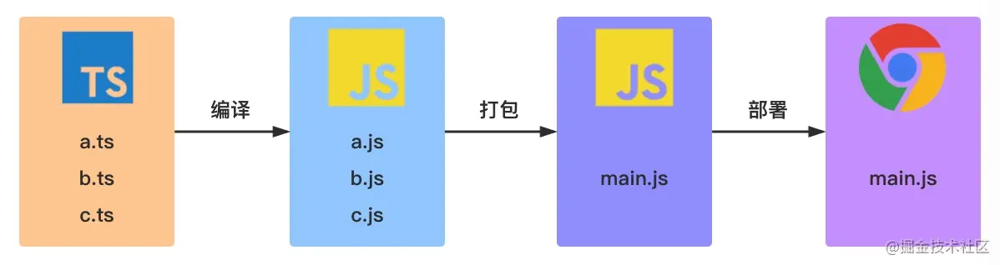

# TypeScript

- JS 是一种脚本语言，是弱类型的，可直接在浏览器中使用。
- TS 是 JS 的超集，是强类型的，添加了类型系统，编译成 JS 浏览器才能识别，可在编译时发现和纠正错误。
- 优点
  - 【更好维护】清晰的函数参数/接口属性，增加了代码可读性和可维护性
  - 【静态检查】静态检查和编辑器提示减少低级错误的发生
  - 【使用友好】对库的使用者比较友好，有对应提示
  - 【可选的】不要求全部用 TS 覆盖，降低门槛
  - 【Check JS】js 中也可以获得自动提示和静态检查
- 缺点

  - 【编译耗时】编译代码时间较长
  - 【第三方库无定义文件】部分第三方库没有类型定义文件

  > Deno 内部将把部分 ts 代码改为 js，不仅是因为编译慢，还有就是 ts 无法为 Deno runtime 生成满足他们规范的高性能的 js 代码，所以选择手写 js。不过对大部分项目，ts 生成的 js 还是非常优秀的。

- 场景
  - 错误提示和静态检查：函数传参类型错误提示，vscode 的静态检查
  - API 文档说明：定义函数的 API 文档，在使用中有类型提示
  - 后台数据接口注释：根据后台文档定义字段写一些注释，用于请求接口数据的返回结构。 比如可以用 Promise 的泛型参数定义好的接口类型，then 里面返回的数据就是满足接口类型的。
  - 增强后的 class 和 enum 枚举：class 只有公有属性才允许使用。在 enum 当中，正反都可以当做 key 来用。
- 使用 TS 的情况
  - 公共组件、公共库、大型项目有必要
  - 不重要的业务代码、节奏快的业务代码可不用
- TS 工作流程

  

- 接口 interface 和 类型别名 type 的区别

  - 如何选择
    - 优先选择 interface，满足不了再使用 type
    - 因为在扩展时有冲突，interface 会报错，而 type 进行类型合并，导致有 never 类型产生
  - 相同点

    - 都可以描述对象或函数
    - 都可以扩展

      ```ts
      // 接口interface
      interface Point {
        x: number;
        y: number;
      }
      interface SetPoint {
        (x: number, y: number): void;
      }

      // 类型type
      type Point = {
        x: number;
        y: number;
      };
      type SetPoint = (x: number, y: number) => void;
      ```

  - 不同点

    - 【声明范围不同】interface 必须是对象结构，type 可以是其他的类型：原始类型、联合类型、元祖
    - 【重复定义表现不一致】interface 会自动合并为一个，type 会报错
    - 【扩展形式不同】interface 通过 `extends` 继承，type 通过 `&` 来扩展

      ```ts
      // 接口扩展
      interface SisterAn {
        name: string;
      }
      interface Sister extends SisterAn {
        age: number;
      }

      // 类型别名扩展
      type SisterRan = {
        age: number;
      };
      type SisterPro = SisterRan & {
        name: string;
      };
      ```

- 总览

  - 原始类型
  - 数组
  - 枚举(enum)
  - 任意值(any)(使用不存在的属性和方法不会报错)
  - unknown 类型(unknown 类型只能被赋值给 any 类型和 unknown 类型本身，而且使用不存在的属性和方法会报错)
  - Tuple 元组类型
  - Never 类型(永不存在的值)
  - 联合类型("|")
  - 接口(interface)
  - 类型别名 type(常用于联合类型的自定义名字)
  - 函数(声明式和表达式的类型定义有区别)
  - 断言
  - 类型推论：没有指定类型，根据初次赋值来确定
  - 泛型`<T>`(调用这个方法的时候决定类型)
  - 类的属性方法修饰符(public 公共、private 私有、protected 保护)

- 原始类型

  ```ts
  // 布尔值
  let isDone: boolean = false;

  // 数值
  let decLiteral: number = 6;

  // 字符串
  let myName: string = "Tom";

  // 没有返回值的函数为void
  function alertName(): void {
    alert("My name is Tom");
  }

  // void：声明一个 void 类型的只能将它赋值为 undefined 和 null
  let unusable: void = undefined;

  // undefined和null： undefined 类型的变量只能被赋值为 undefined，null 类型的变量只能被赋值为 null
  let u: undefined = undefined;
  let n: null = null;
  ```

- 数组

  ```ts
  let fibonacci: number[] = [1, 1, 2, 3, 5];
  let fibonacci: Array<number> = [1, 1, 2, 3, 5];

  // 用接口表示数组
  interface NumberArray {
    [index: number]: number;
  }
  let fibonacci: NumberArray = [1, 1, 2, 3, 5];

  // 类数组
  function sum() {
    let args: IArguments = arguments;
  }

  // 错误操作：push 方法只允许传入 number 类型的参数，但是却传了一个 string 类型的参数，所以报错了。
  let fibonacci: number[] = [1, 1, 2, 3, 5];
  fibonacci.push("8");
  ```

- 枚举 enum

  - 数字枚举，不必都写值对应，有默认增加规则
  - 字符串枚举，必须都有字符串值对应
  - 异构枚举，数字和字符串混合的枚举
  - 常量枚举`const enum = {}` 、不会编译

    ```ts
    // 枚举（Enum）类型用于取值被限定在一定范围内的场景，比如一周只能有七天
    // 数字枚举
    enum Days {
      Sun,
      Mon,
      Tue,
      Wed,
      Thu,
      Fri,
      Sat,
    }
    console.log(Days["Sun"]); // 0
    console.log(Days[0]); // 'Sun'
    // 字符串枚举
    enum Str {
      One = "One",
      Two = "Two",
    }
    // 异构枚举
    enum Test {
      A,
      B,
      C = "C",
      D = "D",
      E = 8,
    }
    // 常量枚举
    const enum Joe {
      name = "joe",
      age = "25",
    }
    const joeAge = Joe.age;
    ```

- 任意值 any

  ```ts
  let anyThing: any = "hello";
  let anyThing: any = 888;
  let anyThing: any = true;

  // 变量如果在声明的时候，未指定其类型，那么它会被识别为任意值类型：
  let any;
  any = true;
  ```

- unknown 类型

  ```ts
  let value: unknown;

  value = true; // OK
  value = 42; // OK
  value = "Hello World"; // OK

  let value1: unknown = value; // OK
  let value2: any = value; // OK
  let value3: boolean = value; // Error
  let value4: number = value; // Error
  ```

- Tuple 元组类型

  - 必须提供每个元素的值
  - 类型要一一对应上

  ```ts
  let tupleType: [string, boolean];
  tupleType = ["semlinker", true];
  ```

- Never 类型

  ```ts
  // 返回never的函数必须存在无法达到的终点
  function error(message: string): never {
    throw new Error(message);
  }

  // 使用never避免新增联合类型导致没有对应的条件分支实现，保证绝对类型安全
  type Foo = string | number;
  function controlFlowAnalysisWithNever(foo: Foo) {
    if (typeof foo === "string") {
      // 这里 foo 被收窄为 string 类型
    } else if (typeof foo === "number") {
      // 这里 foo 被收窄为 number 类型
    } else {
      // 如果执行到这，会无法赋值给never类型，报错
      const check: never = foo;
    }
  }
  ```

- 联合类型

  ```ts
  let num: 1 | 2 = 1;

  // 当你允许某个变量被赋值多种类型的时候,使用联合类型,管道符进行连接
  let myFavoriteNumber: string | number;
  myFavoriteNumber = "seven";
  myFavoriteNumber = 7;

  // 也可用于方法的参数定义, 都有toString方法,访问 string 和 number 的共有属性是没问题的
  function getString(something: string | number): string {
    return something.toString();
  }
  ```

- 接口 interface 表示对象类型

  ```ts
  interface Person {
    readonly id: number; // 只读属性
    name: string; // 必须有此属性，类型是string
    age?: number; // 表示这个属性可有可无
  }

  let tom: Person = {
    id: 89757, // 只读，不可二次赋值
    name: "Tom",
  };

  // 任意属性：索引签名的形式
  interface Person {
    name: string;
    age?: number;
    [propName: string]: any;
  }

  const p1 = { name: "semlinker" };
  const p2 = { name: "lolo", age: 5 };
  const p3 = { name: "kakuqo", sex: 1 };
  ```

- 类型别名 type：常用与联合类型自定义名字

  ```ts
  type Name = string;
  type NameResolver = () => string;
  type NameOrResolver = Name | NameResolver;
  function getName(n: NameOrResolver): Name {
    if (typeof n === "string") {
      return n;
    } else {
      return n();
    }
  }
  ```

- 函数

  - 声明式类型定义比较简单
  - 表达式需要对左侧的值手动加类型，否则就会根据类型推论来确定。

    ```ts
    // 需要把参数输入和结果输出都考虑到，例子均为number
    function sum(x: number, y: number): number {
      return x + y;
    }

    // 表达式的类型限制
    // => 用来表示函数的定义，左边是输入类型，需要用括号括起来，右边是输出类型。
    let mySum: (x: number, y: number) => number = function (
      x: number,
      y: number
    ): number {
      return x + y;
    };

    // 也可以用接口定义
    interface SearchFunc {
      (source: string, subString: string): boolean;
    }

    let mySearch: SearchFunc;
    mySearch = function (source, subString) {
      return source.search(subString) !== -1;
    };

    // 可选参数
    function buildName(firstName: string, lastName?: string) {
      if (lastName) {
        return firstName + " " + lastName;
      } else {
        return firstName;
      }
    }
    let tomcat = buildName("Tom", "Cat");
    let tom = buildName("Tom");

    // 参数默认值
    function buildName(firstName: string, lastName: string = "Cat") {
      return firstName + " " + lastName;
    }
    ```

- 断言

  - 类型断言
  - 非空断言
  - 确定赋值断言

    ```ts
    // 类型断言

    形式1：值 as 类型
    形式2：<类型>值

    let someValue: any = "this is a string";
    let strLength: number = (someValue as string).length;

    // 可以使用类型断言，将 something 断言成 string
    function getLength(something: string | number): number {
        if ((<string>something).length) {
            return (<string>something).length;
        } else {
            return something.toString().length;
        }
    }

    // 非空断言
    type NumGenerator = () => number;
    function myFunc(numGenerator: NumGenerator | undefined) {
      // Object is possibly 'undefined'.(2532)
      // Cannot invoke an object which is possibly 'undefined'.(2722)
      const num1 = numGenerator(); // Error
      const num2 = numGenerator!(); //OK
    }

    // 确定赋值断言
    let x!: number; // 告诉TS未来会赋值
    initialize();
    console.log(2 * x); // Ok 不报错

    function initialize() {
      x = 10;
    }
    ```

- 类型推论

  ```ts
  // 如果没有明确的指定类型
  // 那么 TypeScript 会依照类型推论（Type Inference）的规则推断出一个类型
  let myFavoriteNumber = "seven";
  // 等价于
  let myFavoriteNumber: string = "seven";
  ```

- 泛型`<T>`

  - T 表示泛型，具体什么类型是调用这个方法的时候决定的
  - 可以为泛型中的类型参数指定默认类型。当使用泛型时没有在代码中直接指定类型参数，从实际值参数中也无法推测出时，这个默认类型就会起作用。

    ```ts
    // 表示入参和返回值都是T类型，根据调用时的类型决定
    function getData<T>(value: T): T {
      return value;
    }
    getData<number>(123);
    getData<string>("1214231");

    // 接口定义泛型
    // 定义接口
    interface ConfigFn {
      <T>(value: T): T;
    }
    var getData: ConfigFn = function <T>(value: T): T {
      return value;
    };
    getData<string>("张三");
    getData<string>(1243); //错误

    // 泛型的默认类型
    function createArray<T = string>(length: number, value: T): Array<T> {
      let result: T[] = [];
      for (let i = 0; i < length; i++) {
        result[i] = value;
      }
      return result;
    }
    ```

- TypeScript 中类的用法

  - public 修饰的属性或方法是公有的，可以在任何地方被访问到，默认所有的属性和方法都是 public 的
  - private 修饰的属性或方法是私有的，不能在声明它的类的外部访问
  - protected 修饰的属性或方法是受保护的，它和 private 类似，区别是它在子类中也是允许被访问的

    ```ts
    class Animal {
      private name;
      public constructor(name) {
        this.name = name;
      }
    }

    let a = new Animal("Jack");
    console.log(a.name); // 报错
    a.name = "Tom"; // 报错
    ```

- 常见概念解释

  - 接口：一个类只能继承自另一个类，有时候不同类之间可以有一些共有的特性，这时候就可以把特性提取成接口（interfaces）相当于一个小类，用 implements 关键字来实现继承方法。
    - 比如车、和防盗门都有报警器方法。`interface Alarm { }，class Car implements Alarm { }`
    - 接口之间可以继承、接口也可以继承类。`interface LightableAlarm extends Alarm { }`
  - 枚举：用于取值被限定在一定范围内的场景，比如一周只能有七天，颜色限定为红绿蓝等。
  - 泛型：是指在定义函数、接口或类的时候，不预先指定具体的类型，而在使用的时候再指定类型的一种特性。

- 编译配置

  - tsconfig.json 的作用

    - 用于标识 TypeScript 项目的根路径；
    - 用于配置 TypeScript 编译器；
    - 用于指定编译的文件。

  - tsconfig.json 重要字段

    - files - 设置要编译的文件的名称；
    - include - 设置需要进行编译的文件，支持路径模式匹配；
    - exclude - 设置无需进行编译的文件，支持路径模式匹配；
    - compilerOptions - 设置与编译流程相关的选项。

  - compilerOptions 选项

    - compilerOptions 支持很多选项，常见的有 baseUrl、 target、baseUrl、 moduleResolution 和 lib 等。
    - compilerOptions 每个选项的详细说明如下：

      ```ts
      {
        "compilerOptions": {

          /* 基本选项 */
          "target": "es5",                       // 指定 ECMAScript 目标版本: 'ES3' (default), 'ES5', 'ES6'/'ES2015', 'ES2016', 'ES2017', or 'ESNEXT'
          "module": "commonjs",                  // 指定使用模块: 'commonjs', 'amd', 'system', 'umd' or 'es2015'
          "lib": [],                             // 指定要包含在编译中的库文件
          "allowJs": true,                       // 允许编译 javascript 文件
          "checkJs": true,                       // 报告 javascript 文件中的错误
          "jsx": "preserve",                     // 指定 jsx 代码的生成: 'preserve', 'react-native', or 'react'
          "declaration": true,                   // 生成相应的 '.d.ts' 文件
          "sourceMap": true,                     // 生成相应的 '.map' 文件
          "outFile": "./",                       // 将输出文件合并为一个文件
          "outDir": "./",                        // 指定输出目录
          "rootDir": "./",                       // 用来控制输出目录结构 --outDir.
          "removeComments": true,                // 删除编译后的所有的注释
          "noEmit": true,                        // 不生成输出文件
          "importHelpers": true,                 // 从 tslib 导入辅助工具函数
          "isolatedModules": true,               // 将每个文件做为单独的模块 （与 'ts.transpileModule' 类似）.

          /* 严格的类型检查选项 */
          "strict": true,                        // 启用所有严格类型检查选项
          "noImplicitAny": true,                 // 在表达式和声明上有隐含的 any类型时报错
          "strictNullChecks": true,              // 启用严格的 null 检查
          "noImplicitThis": true,                // 当 this 表达式值为 any 类型的时候，生成一个错误
          "alwaysStrict": true,                  // 以严格模式检查每个模块，并在每个文件里加入 'use strict'

          /* 额外的检查 */
          "noUnusedLocals": true,                // 有未使用的变量时，抛出错误
          "noUnusedParameters": true,            // 有未使用的参数时，抛出错误
          "noImplicitReturns": true,             // 并不是所有函数里的代码都有返回值时，抛出错误
          "noFallthroughCasesInSwitch": true,    // 报告 switch 语句的 fallthrough 错误。（即，不允许 switch 的 case 语句贯穿）

          /* 模块解析选项 */
          "moduleResolution": "node",            // 选择模块解析策略： 'node' (Node.js) or 'classic' (TypeScript pre-1.6)
          "baseUrl": "./",                       // 用于解析非相对模块名称的基目录
          "paths": {},                           // 模块名到基于 baseUrl 的路径映射的列表
          "rootDirs": [],                        // 根文件夹列表，其组合内容表示项目运行时的结构内容
          "typeRoots": [],                       // 包含类型声明的文件列表
          "types": [],                           // 需要包含的类型声明文件名列表
          "allowSyntheticDefaultImports": true,  // 允许从没有设置默认导出的模块中默认导入。

          /* Source Map Options */
          "sourceRoot": "./",                    // 指定调试器应该找到 TypeScript 文件而不是源文件的位置
          "mapRoot": "./",                       // 指定调试器应该找到映射文件而不是生成文件的位置
          "inlineSourceMap": true,               // 生成单个 soucemaps 文件，而不是将 sourcemaps 生成不同的文件
          "inlineSources": true,                 // 将代码与 sourcemaps 生成到一个文件中，要求同时设置了 --inlineSourceMap 或 --sourceMap 属性

          /* 其他选项 */
          "experimentalDecorators": true,        // 启用装饰器
          "emitDecoratorMetadata": true          // 为装饰器提供元数据的支持
        }
      }

      ```

- 迁移代码切换为 TS

  - 标记类型和声明 interface
  - vue 2.x 结合不是很好，vue 的 ts 语法需要使用 class 风格

- 参考
  - [接口 Interfaces、枚举 enum、泛型 Generics](https://github.com/xcatliu/typescript-tutorial/blob/master/advanced/generics.md)
  - [掘金阿宝哥](https://juejin.cn/post/6872111128135073806#heading-118)
- 工具
  - [TypeDoc](TS生成文档)
  - [在线 TS 编译效果面板](https://www.typescriptlang.org/play?#code/MYewdgzgLgBApmArgWxgKRHGBvAUDAmMAQ2SwF4YAiAK0yoBp9DiBzC6gJgFZHmBfZqEiw6cAILsYlDHAB0JMgG4gA)
