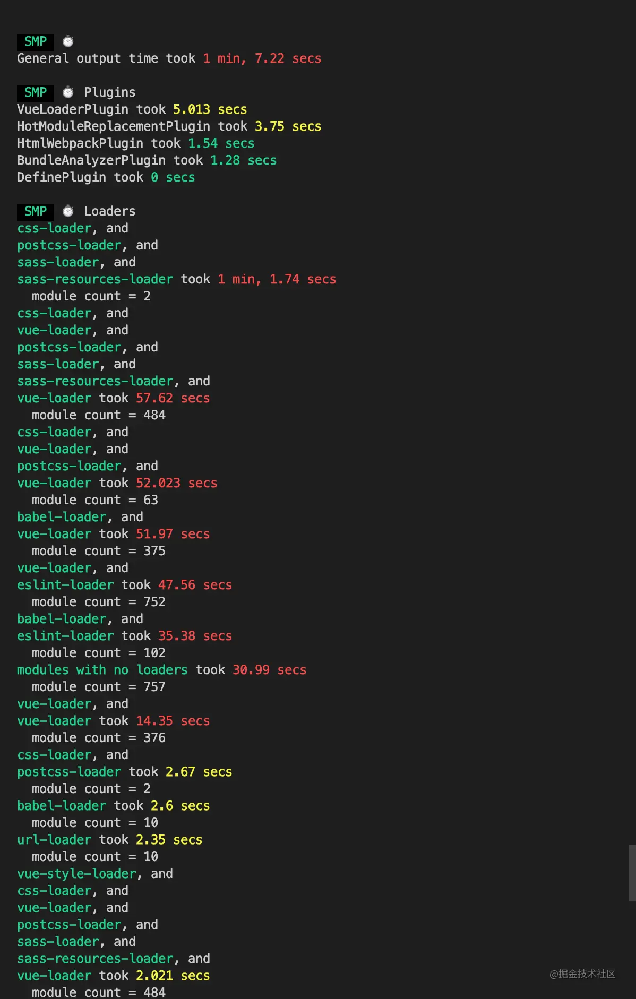

## 构建流程 ✨

- 简单说
  - 初始化：启动构建，读取与合并配置参数，加载 Plugin，实例化 Compiler
  - 编译：从 Entry 出发，针对每个 Module 串行调用对应的 Loader 去翻译文件的内容，再找到该 Module 依赖的 Module，递归地进行编译处理，形成依赖图
  - 输出：将编译后的 Module 组合成 Chunk，将 Chunk 转换成文件，输出到文件系统中
- 1、初始化参数：拷贝配置文件 webpack.config.js 合并参数，并实例化插件，得到最终 options 对象。
- 2、开始编译：初始化 Compiler 编译对象，传入各插件的 apply 方法，为事件挂载对应的回调，**执行 Compiler 的 run 方法开始编译**，以下是一些关键事件点。

```js
function webpack(options) {
  var compiler = new Compiler();
  ...// 检查options,若watch字段为true,则开启watch线程
  return compiler;
}
...
```

- 3、确定入口：根据 entry 找到入口文件
- 4、编译模块：用 **Loader 进行转换**后，再找出对应依赖模块
- 5、完成编译：确定了转换好的内容和它们之间的依赖关系
- 6、输出资源：根据入口和模块 module 的依赖关系，组装成包含多个 module 的 chunk，每个 chunk 转成一个文件并生成 hash，加载到 输出列表【代码优化和功能添加的关键环节】。
- 7、执行输出：根据 output 路径和文件名，写入文件系统。
- 【事件钩子】执行 run 开始编译：过程中触发一些钩子 beforeRun->run->beforeCompile->compile（开始编译）->make（入口分析依赖）->seal（构建封装，不可更改）->afterCompile（完成构建，缓存数据）->emit （输出 dist 目录），每个节点会触发对应的 webpack 事件，**plugin 插件监听事件**进行对应的处理。
- 【监听事件】编写插件 plugin 的时候，在 apply 中执行`compilation.plugin('xxx', callback)`绑定对应的监听事件，监听到就会执行特定的逻辑
- 【获取构建文件】`compiler.hooks.emit.tap('xxx',(compilation)=>{})` 这个钩子可以获取到 emit 阶段的 compilation 对象，compilation.assets 有所有构建好的资源文件，可以方便我们处理
- compiler 对象是一个全局单例，他负责把控整个 webpack 打包的构建流程。
- compilation 对象是每一次构建的上下文对象，它包含了当次构建所需要的所有信息，每次热更新和重新构建，compiler 都会重新生成一个新的 compilation 对象，负责此次更新的构建过程。

## webpack.config.js 配置

- 配置合并：
  - 在加载插件之前，webpack 将 webpack.config.js 中的各个配置项拷贝到 options 对象中。
  - options 作为最后返回结果，包含了之后构建阶段所需的重要信息。
  ```js
  {
      entry: {},//入口配置
      output: {}, //输出配置
      plugins: [], //插件集合(配置文件 + shell指令)
      module: { loaders: [ [Object] ] }, //模块配置
      context: //工程路径
      ...
  }
  ```

```js
var path = require("path");
var node_modules = path.resolve(__dirname, "node_modules");
var pathToReact = path.resolve(node_modules, "react/dist/react.min.js");

module.exports = {
  // 入口文件，是模块构建的起点，同时每一个入口文件对应最后生成的一个 chunk。
  entry: {
    bundle: [
      "webpack/hot/dev-server",
      "webpack-dev-server/client?http://localhost:8080",
      path.resolve(__dirname, "app/app.js"),
    ],
  },
  // 文件路径指向(可加快打包过程)。
  resolve: {
    alias: {
      react: pathToReact,
    },
  },
  // 生成文件，是模块构建的终点，包括输出文件与输出路径。
  output: {
    path: path.resolve(__dirname, "build"),
    filename: "[name].js",
  },
  // 这里配置了处理各模块的 loader ，包括 css 预处理 loader ，es6 编译 loader，图片处理 loader。
  module: {
    loaders: [
      {
        test: /\.js$/,
        loader: "babel",
        query: {
          presets: ["es2015", "react"],
        },
      },
    ],
    noParse: [pathToReact],
  },
  // webpack 各插件对象，在 webpack 的事件流中执行对应的方法。
  plugins: [new webpack.HotModuleReplacementPlugin()],
};
```

## bundle，chunk，module 分别指什么

- Entry：作为构建依赖图的入口文件
- Output：输出创建的 bundles 到指定文件夹，默认值为 ./dist。
- bundle（包）：webpack 打包出来的文件
- chunk（代码块）：由多个模块 module 组合而成，代码分割的产物（如 webpack4 的 SplitChunksPlugin），也就是按需加载的分块。将一些代码单独打包为一个 Chunk ，用于按需加载或缓存。
- module（模块）：Webpack 里一切皆模块（图片、ES6 模块）、一个模块对应一个文件。Webpack 会从配置的 Entry 开始递归找出所有依赖的模块。
- module 和 chunk 的图解

  

## Loader 和 Plugin 的区别 ✨

- Loader(加载器)
  - 用于文件转换，单一原则，每个 Loader 只做一种"转义"工作。webpack 链式调用每个 loader，从后往前，可以理解为出栈过程。
  - webpack 原生只能解析 js，loader 使 webpack 可以加载和解析非 js 文件(css、图片)
  - 用法：module.rules 配置，数组里面每项都是 object，描述了{ test 针对类型、loader 使用什么加载、options 配置的参数 }
    ```js
    module: {
      rules: [
        {
          test: /\.vue$/,
          loader: "vue-loader",
          options: vueLoaderConfig,
        },
        {
          test: /\.scss$/,
          loaders: ["style-loader", "css-loader", "sass-loader"],
        },
      ];
    }
    ```
- 常见 Loader
  - file-loader：加载文件资源
  - url-loader：小文件以 base64 的方式把文件内容注入到代码中去
  - css-loader：加载 CSS，支持模块化、压缩、文件导入等特性
  - style-loader：把外部 CSS 代码注入到 html 的 head 标签中。
  - sass-loader: sass 语法转换
  - node-sass: sass-loader 依赖需要
  - babel-loader:把 ES6+ 转换成 ES5
  - eslint-loader： ESLint 检查 JavaScript 代码
- 自己实现一个 loader

  - 导出一个函数，这个函数接收 content 匹配到的文件内容，对这些传入的字符串进行处理，然后返回，在 webpack.config.js 的 module.rules 数组里加上一个对象，描述匹配的文件和导入 js 文件和写 options 配置。
  - 获取 options 配置：loader-utils 库`loaderUtils.getOptions(this)`
  - 返回形式推荐写法：`this.callback(null, "{};" + content)`两个参数，error + 编译完的 content。
  - 异步 loader：使用 async/await

- Plugin(插件)
  - 用于扩展 webpack 的功能（如代码分割、压缩、定义变量、替换静态资源引用路径）
  - 构建过程调用原理：Webpack 会在构建过程中对应的钩子中广播出特定的事件，插件在监听到感兴趣的事件后会执行特定的逻辑，并且插件可以调用 Webpack 提供的 API 改变 Webpack 的输出结果
  - 钩子：beforeRun -> run -> beforeCompile -> compile（开始编译）-> make（入口分析依赖）-> seal（构建封装，不可更改）-> afterCompile（完成构建，缓存数据）-> emit （发射 stream，输出 dist 目录）
  - 用法：plugins 中单独配置，数组里每项都是一个 plugin 实例，参数由构造函数传入。
    ```js
    plugins: [
      new HtmlWebpackPlugin(),
      new ProgressBarPlugin(),
      new webpack.LoaderOptionsPlugin({
        minimize: true,
      }),
      new VueLoaderPlugin(),
    ];
    ```
- 常见 Plugin

  - terser-webpack-plugin：webpack4 默认的代码压缩插件，默认开启多进程和缓存
  - split-chunks-plugin: 代码分割 （Webpack 4 满足条件会自动拆分 chunk，如默认大于 30kb 的文件、可复用...）
  - define-plugin：定义环境变量（开发环境和生产环境的域名或 API，或全局版本号：通过日期时间计算拼接，代码中直接使用）

  ```js
  new webpack.DefinePlugin({
    WEIGHT_VERSION: JSON.stringify(getPluginVersion()),
  });
  ```

  - banner-plugin: 给每个 chunk 头部添加 banner，如注释

  ```js
  new webpack.BannerPlugin({
      banner: '// { "framework": "Vue" }\n',
      raw: true // banner内容直出，不以注释出现
  }),
  ```

  - html-webpack-plugin：生成 html 文件，里面添加了 JS 文件的 script 标签，还可以设置 loading
  - webpack-bundle-analyzer: 可视化 webpack 输出文件的体积(业务组件、依赖第三方模块)

  ```js
  const UglifyJsPlugin = require("uglifyjs-webpack-plugin");

  module.exports = {
    plugins: [
      new UglifyJsPlugin({
        cache: true, //缓存
        sourceMap: false, //压缩
        parallel: 4, //多核
      }),
    ],
  };
  ```

  - webpack-parallel-uglify-plugin: 多核压缩,提高压缩速度

- 自己实现一个 plugin
  - 写一个带 apply(compiler) 方法的 class 类，暴露出去，可以给外部新建 plugin 实例
  - 事件流开始的时候，实例化所有插件，执行插件的 apply 方法，在事件流上挂载回调的方法
  - 构建过程中钩子广播出事件，然后执行对应回调，改变输出结果

## HMR 热更新原理（hot module replacement）✨

> 当你对代码进行修改并保存后，webpack 将对代码重新打包，并将新的模块发送到浏览器端，浏览器通过新的模块替换老的模块，这样在不刷新浏览器的前提下就能够对应用进行更新。

- 在 webpack 的 watch 模式下，文件系统中某一个文件发生修改，对修改的模块重新编译打包。
- webpack-dev-middleware 处理打包后的文件存在内存里。
- webpack-dev-server 和 webpack-dev-server/client（浏览器端）建立 websocket 长连接，利用这个连接，传递修改模块的 hash 和编译打包的状态信息给浏览器。
- HMR.runtime 收到新模块的 hash(非最新)，Jsonp.runtime 向 webpack-dev-server 服务端发送 ajax 请求，获取模块更新列表的 manifest 描述文件（包含更新模块的最新 hash）再通过 Jsonp 获取最新 hash 对应的模块代码。
- HotModulePlugin 进行模块对比，替换模块及更新依赖树 modules tree 引用。
- HMR 失败，通过浏览器刷新整个页面获取最新代码。
  

- 疑问：为什么不在 socket 发送更新好的模块代码
  - 应该是为了功能解耦
  - dev-server/client 只负责消息传递、不负责新模块的获取
  - HMR runtime 才应该是获取新代码的地方。

## webpack 打包体积优化(Tree-shaking)

- 分析打包后的模块文件大小
  - webpack-bundle-analyzer
  ```
  npm i -D webpack-bundle-analyzer
  npm run build -- --report
  ```
- Tree-shaking

  - webpack4 默认开启 Tree-shaking（mode 为 production）：清除代码中无用的部分。

  ```js
  //index.js
  import { add, minus } from "./math";
  add(2, 3); //minus不会参与构建
  ```

  - 原理
    - 基于 ES6 modules 的静态检测也就是 import 语法（确保引用的模块都是 ES6 规范）
    - ESM 下模块之间的依赖关系是高度确定的，与运行状态无关，编译工具只需要对 ESM 模块做静态分析，就可以从代码字面量中推断出哪些模块值未曾被其它模块使用。
    - 其他模块方式是动态的，很难预测，如：CommonJS 模块是运行时加载，ES6 模块是编译时输出接口，CommonJs 是动态语法可以写在判断里，ES6 Module 静态语法只能写在顶层。
  - 实现：先标记模块导出值哪些没被使用，使用 Terser 删掉这些没用的语句。

    - Make 阶段，收集模块导出变量并记录到模块依赖关系图 ModuleGraph 变量中
    - Seal 阶段，遍历 ModuleGraph 标记模块导出变量有没有被使用
    - 生成产物时，若变量没有被其它模块使用则删除对应的导出语句

  - 避免无意义的赋值
    - 也就是导入值赋值之后给一个变量后，没有使用
    - 而静态分析只是看代码中有没有出现这个变量和有没有被其他模块引用
    - 从而导致没有 Tree Shaking 。
  - 导出值的粒度控制

    - 只用到`export default {}` 导出值的其中一个属性，整个 default 对象依然会被完整保留。
    - 优化：保持原子性

      ```js
      const bar = "bar";
      const foo = "foo";

      export { bar, foo };
      ```

  - 防止 Tree Shaking 失效

    - 禁止 Babel 转译模块导入导出语句：modules: false， webpack 2.0 开始原生支持 ES Module，也就是说不需要 babel 把 ES Module 转换成曾经的 commonjs 模块
    - 失效原因：**使用 babel-loader，将 es6 模块转成 commonjs 了，无法检测**
    - 解决：.babelrc 或 webpack.config.js 里设置 `modules: false` ，避免 module 被转换 commonjs

      ```js
      // .babelrc
      {
        "presets": [
          ["@babel/preset-env",
            {
              "modules": false
            }
          ]
        ]
      }
      // 或者
      // webpack.config.js
      module: {
          rules: [
              {
                  test: /\.js$/,
                  use: {
                      loader: 'babel-loader',
                      options: {
                          presets: ['@babel/preset-env', { modules: false }]
                      }
                  }，
                  exclude: /(node_modules)/
              }
          ]
      }

      ```

  - sideEffects: false
    - webpack 4 在 package.json 文件中设置 sideEffects: false 表示模块是无副作用的（是否修改了 window 上的属性，是否复写了原生对象方法等），可以放心进行判断删除。
    - 我这个包在设计的时候就是期望没有副作用的，即使他打完包后是有副作用的，webpack 同学你摇树时放心的当成无副作用包摇就好啦！
    - 使用：
      ```js
      // 第三方npm模块 的 package.json
      {
          "name": "your-project",
          "sideEffects": false
      }
      // 业务代码的 webpack.prod.conf.js
      module.exports = {
          module: {
              rules: [
                  {
                      test: /\.jsx?$/,
                      exclude: /(node_modules|bower_components)/,
                      use: {
                          loader: 'babel-loader',
                      },
                      sideEffects: false || []
                  }
              ]
          },
      }
      ```

- SplitChunksPlugin 拆包配置，配置 cacheGroups

  - 字段
    - chunks：initial 是将异步和非异步的文件分离，分离页面首次需要加载的包。
    - minSize：文件最小打包体积
    - test：匹配正则打包规则
    - priority：打包优先级，数字越大越优先
    - minChunks： 最少引入次数
  - 方案
    - vendors：项目基本框架 react 之类单独打包，首页必须用到的
    - echartsVenodr：体积较大的第三方异步加载包，单独拆出来
    - async-commons：体积一般可以合并的第三方异步加载包，合并为一个
    - commons：同步加载包，引入两次就打包进去
  - 建议：最大的包保持在 100k 左右，当然也不建议拆的特别小，因为浏览器 http1 一次性支持 6 次下载文件，太多可能会适得其反

  ```js
  module.exports = {
    optimization: {
      concatenateModules: false,
      splitChunks: {
        //分割代码块
        maxInitialRequests: 6, //默认是5
        cacheGroups: {
          vendors: {
            // 基本框架
            chunks: "all",
            test: /(react|react-dom|react-dom-router|babel-polyfill|mobx)/,
            priority: 100,
            name: "vendors",
          },
          echartsVenodr: {
            // 异步加载体积较大的echarts包，指定页面需要的时候再异步加载
            test: /(echarts|zrender)/,
            priority: 100, // 设置高于async-commons，避免打包到async-common中
            name: "echartsVenodr",
            chunks: "async",
          },
          "async-commons": {
            // 其余异步加载包
            chunks: "async",
            minChunks: 2,
            name: "async-commons",
            priority: 90,
          },
          commons: {
            // 其余同步加载包
            chunks: "all",
            minChunks: 2,
            name: "commons",
            priority: 80,
          },
        },
      },
    },
  };
  ```

- 配置 Externals（推荐）：外部引入，将不需要打包的库或静态资源从构建逻辑中剔除，使用 **CDN** 的方式去引用。
  - 步骤：在 externals 中配置 key[包名]+value[CDN 全局变量名]，然后在 HTML 中引入 CDN 的 script 标签。就能实现 import 引入了。
  ```js
  // index.html
  <script
    src="https://code.jquery.com/jquery-3.1.0.js"
    integrity="sha256-slogkvB1K3VOkzAI8QITxV3VzpOnkeNVsKvtkYLMjfk="
    crossorigin="anonymous"
  ></script>;
  //webpack.config.js
  module.exports = {
    //...
    externals: {
      //jquery通过script引入之后，全局中即有了 jQuery 变量
      jquery: "jQuery",
    },
  };
  ```
  - 常见 CDN 链接由 host 域名+包名+版本号+路径
  ```js
  <script src="https://cdn.bootcss.com/react/16.9.0/umd/react.production.min.js"></script>
  ```
  - 有些 CDN 服务不稳定，尽量选择成熟的 CDN 服务。

## webpack 打包加速优化(缓存 + 多进程 + 提取资源 + DLL 分包) ✨

- 分析工具
  - 体积：webpack-bundle-analyzer
  - 速度：插件 speed-measure-webpack-plugin 查看 loader 和 plugin 的耗时
- 优化总结
  - 利用缓存：cache-loader 放在其他 loader 前面、loader/plugin 开启 自身的 cache 配置（如 babel-loader/terser-webpack-plugin 默认开启 ）、hard-source-webpack-plugin 提供二次缓存加速效果
  - 利用多进程：thread-loader 放在耗时的 loader 前面、TerserWebpackPlugin 默认开启多进程（也不要开太多 worker，有一定启动开销和通信开销）
  - 体积优化：Tree-Shaking 基于 ES6 的静态检测删除无用代码、SplitChunksPlugin 拆包 cacheGroups 配置、Externals 基础包用 CDN 引入
  - Dll 打包：先 DllPlugin 预编译，再用 DllReferencePlugin 加载模块。避免反复编译不常变更的第三方库
  - 优化搜索时间：loader 的 test 和 include/exclude（比如 babel-loader 排除 node_modules）、 resolve 的 module 模块搜索目录/alias 别名/extensions 后缀
  - 提高配置：升级 Webpack 和 Node.js 和机器
  - vue：关闭生成 sourcemap
- 提高热更新速度
  - 提高热更新速度，上百页 2000ms 内搞定，10 几页面区别不大
  ```js
  //在.env.development环境变量配置
  VUE_CLI_BABEL_TRANSPILE_MODULES: true;
  ```
  - 原理：利用插件，在开发环境中将异步组件变为同步引入，也就是 import()转化为 require()
  - 一般页面到达几十上百，热更新慢的情况下需要用到。
  - webpack5 即将发布，大幅提高了打包和编译速度
- 分析打包时长：

  - 速度分析插件[speed-measure-webpack-plugin](https://www.npmjs.com/package/speed-measure-webpack-plugin)
    

  ```
  npm install --save-dev speed-measure-webpack-plugin
  ```

  ```js
  //vue.config.js
  //导入速度分析插件
  const SpeedMeasurePlugin = require("speed-measure-webpack-plugin");
  //实例化插件
  const smp = new SpeedMeasurePlugin();

  module.exports = {
    configureWebpack: smp.wrap({
      plugins: [
        // 这里是自己项目里需要使用到的其他插件
        new yourOtherPlugin(),
      ],
    }),
  };
  ```

- 较耗时：代码的编译或压缩（转化 AST 树 -> 遍历 AST 树 -> 转回 JS 代码）
  - 编译 JS、CSS 的 Loader
  - 压缩 JS、CSS 的 Plugin
- 利用缓存：让二次构建时，不需要再去做重复的工作[没有变化的直接使用缓存，速度更快]
  - 开启 Loader、压缩插件的 cache 配置【如 babel-loader 的`cacheDirectory:true`】，uglifyjs-webpack-plugin【如`cache: true`】，构建完将缓存存放在`node_modules/.cache/..`。
  - [cache-loader](https://www.npmjs.com/package/cache-loader)：将 loader 的编译结果写入硬盘缓存，再次构建如果文件没有发生变化则会直接拉取缓存,添加在时间长的 loader 的最前面。
  ```js
  module: {
      rules: [
          {
              test: /\.ext$/,
              use: ['cache-loader', ...loaders],
              include: path.resolve('src'),
          },
      ],
  }
  ```
- 利用多进程：充分利用了硬件本身的优势

  - thread-loader：添加在此 loader 后面的放入单独的 worker 池里运行，配置简单

    ```js
    //安装：npm install thread-loader -D
    module.exports = {
      module: {
        //我的项目中,babel-loader耗时比较长，所以我给它配置 thread-loader
        rules: [
          {
            test: /\.jsx?$/,
            use: ["thread-loader", "cache-loader", "babel-loader"],
          },
        ],
      },
    };
    ```

  - 多进程压缩

    - 默认的 TerserWebpackPlugin（比 uglifyjs 性能更好）：默认开启了多进程和缓存，缓存文件 `node_modules/.cache/terser-webpack-plugin`
    - 其他并行压缩插件：
      - webpack-parallel-uglify-plugin:子进程并发执行把结果送回主进程，多核并行压缩来提升代码压缩速度
      - uglifyjs-webpack-plugin 自带的 parallel：【如`parallel: true`】配置项开启多核编译

  - happypack(不维护了)：

    - 原理：将 Loader 转换分解到多个子进程中去并行处理，子进程处理完成后把结果发送到主进程中，从而减少总的构建时间
    - 使用方法：开启系统 CPU 最大线程，通过插件将 loader 包装，暴露 id，直接 module.rules 引用该 id。
    - happypack 默认开启 CPU 核数 - 1 个进程，当然，我们也可以传递 threads 给 happypack。

    ```js
    //安装：npm install happypack -D
    //引入：const Happypack = require('happypack');
    exports.plugins = [
      new Happypack({
        id: "jsx",
        threads: 4,
        loaders: ["babel-loader"],
      }),

      new Happypack({
        id: "styles",
        threads: 2,
        loaders: ["style-loader", "css-loader", "less-loader"],
      }),
    ];

    exports.module.rules = [
      {
        test: /\.js$/,
        use: "Happypack/loader?id=jsx",
      },

      {
        test: /\.less$/,
        use: "Happypack/loader?id=styles",
      },
    ];
    ```

- 提取公共资源
  - SplitChunksPlugin 进行拆包 cacheGroups 配置
  - 配置 Externals（推荐）
- DLL 打包

  - 内置 webpack 的 DllPlugin 编译 和 DllReferencePlugin 引入 dll，避免反复编译，提高打包速度

  - Vue 全家桶、element-ui、echarts、工具库 lodash 不常变更的依赖 【几十秒】，避免每次构建都进行打包
  - 通过 **DllPlugin** 来对那些我们引用但是不会经常修改的 npm 包来进行预编译
  - 再通过 **DllReferencePlugin** 将预编译的模块加载进来，避免反复编译浪费时间，提高打包速度
  - 步骤：

    - 新建一个 webpack.dll.config.js 的配置文件(与 webpack 配置同级)，配置 DllPlugin 插件和打包的库和输出文件的位置
    - package.json 添加 dll 命令，执行 webpack.dll.config.js 文件
    - npm run dll 命令，生成第三方代码集合 js 文件
    - webpack.config.js 里配置 DllReferencePlugin 插件、找到 manifest.json 文件映射到依赖并打包引入
    - 修改 index.html，加入 script 标签，写上对应 dll 路径
    - 如果更新依赖包，执行`npm run dll`,新的 dll 文件名便会加上新的 hash

    ```js
    // webpack.config.dll.js
    const webpack = require('webpack');
    const path = require('path');

    module.exports = {
        entry: {
            react: ['react', 'react-dom']
        },
        mode: 'production',
        output: {
            filename: '[name].dll.[hash:6].js',
            path: path.resolve(__dirname, 'dist', 'dll'),
            library: '[name]_dll' //暴露给外部使用
            //libraryTarget 指定如何暴露内容，缺省时就是 var
        },
        plugins: [
            new webpack.DllPlugin({
                //name和library一致
                name: '[name]_dll',
                path: path.resolve(__dirname, 'dist', 'dll', 'manifest.json') //manifest.json的生成路径
            })
        ]
    }

    // package.json 中新增 dll 命令
    {
        "scripts": {
            "build:dll": "webpack --config webpack.config.dll.js"
        },
    }

    // npm run build:dll 后，会生成
    dist
        └── dll
            ├── manifest.json
            └── react.dll.9dcd9d.js

    // manifest.json 用于让 DLLReferencePlugin 映射到相关依赖上。至此 dll 准备工作完成，接下来在 webpack 中引用即可。

    // webpack.config.js
    const webpack = require('webpack');
    const path = require('path');
    module.exports = {
        //...
        devServer: {
            contentBase: path.resolve(__dirname, 'dist')
        },
        plugins: [
            new webpack.DllReferencePlugin({
                manifest: path.resolve(__dirname, 'dist', 'dll', 'manifest.json')
            }),
            new CleanWebpackPlugin({
                cleanOnceBeforeBuildPatterns: ['**/*', '!dll', '!dll/**'] //不删除dll目录
            }),
            //...
        ]
    }
    // 修改 public/index.html 文件，在其中引入 react.dll.js
    <script src="/dll/react.dll.9dcd9d.js"></script>
    // 使用 npm run build 构建，可以看到 bundle.js 的体积大大减少，提高打包速度。
    ```

  - 优化搜索时间

    ```js
    // 编译代码的基础配置
    module.exports = {
      // ...
      module: {
        // 项目中使用的 jquery 并没有采用模块化标准，webpack 忽略它
        noParse: /jquery/,
        rules: [
          {
            // 这里编译 js、jsx
            // 注意：如果项目源码中没有 jsx 文件就不要写 /\.jsx?$/，提升正则表达式性能
            test: /\.(js|jsx)$/,
            // babel-loader 支持缓存转换出的结果，通过 cacheDirectory 选项开启
            use: ["babel-loader?cacheDirectory"],
            // 排除 node_modules 目录下的文件
            // node_modules 目录下的文件都是采用的 ES5 语法，没必要再通过 Babel 去转换
            exclude: /node_modules/,
          },
        ],
      },
      resolve: {
        // 设置模块导入规则，import/require时会直接在这些目录找文件
        // 可以指明存放第三方模块的绝对路径，以减少寻找
        modules: [
          path.resolve(`${project}/client/components`),
          path.resolve("h5_commonr/components"),
          "node_modules",
        ],
        // import导入时省略后缀
        // 注意：尽可能的减少后缀尝试的可能性
        extensions: [".js", ".jsx", ".react.js", ".css", ".json"],
        // import导入时别名，减少耗时的递归解析操作
        alias: {
          "@compontents": path.resolve(`${project}/compontents`),
        },
      },
    };
    ```

- Vue 关闭在 vue.config.js： `module.exports= { productionSourceMap:false （表示生产环境进行代码压缩） }`
  - 优点：构建速度快，体积变小，不需要源码 map 文件，进行代码压缩加密
  - 缺点：运行时有错误，无法准确定位哪一行。
- 更直接
  - 升级机器配置
  - 升级 webpack5 或 node 版本
- 效果提升：(20 页)
  - 初次打包：20s
  - 二次打包：8s

## sourcemap 和源码对应原理

一般来说 source map 的应用都是在监控系统中，开发者构建完应用后，通过插件将源代码及 source map 上传至平台中。一旦客户端上报错误后，我们就可以还原源代码的报错位置，方便开发者快速定位线上问题。

### 浏览器查找 map 文件

- 开启 source map 选项以后，产物应该为两个文件，分别为 bundle.js 以及 bundle.js.map。
- sourceMappingURL 表示该文件的 map 地址

```js
// bundle.js
console.log(1);
//# sourceMappingURL=bundle.js.map
```

### map 文件对应位置原理

```js
// bundle.js.map
{
  version: 3,
  sources:["webpack://webpack-source-demo/./src/index.js"],
  names: ['console', 'log'],
  mappings: 'AACAA,QAAQC,IADE',
}
```

- 字段解释

  - version：顾名思义，指代了版本号，目前 source map 标准的版本为 3，也就是说这份 source map 使用的是第三版标准产出的
  - file：编译后的文件名
  - sources：多个源文件名
  - names：一个优化用的字段，后续会在 mappings 中用到
  - mappings：这是最重要的内容，表示了源代码及编译后代码的关系，但是先略过这块，下文中会详细解释

- 映射原理主要是 mapping 字段，使用 Base 64 VLQ 编码，表示压缩代码的位置和源码的位置，通过 AST 的节点描述定位的。

  - 英文：有特殊映射关系，比如 A 代表 0、C 代表 1
  - 逗号：分割一行代码中的内容
  - 分号：换行

- 每串英文的字母代表一个位置
  - 压缩代码的第几列（压缩代码只有一行）
  - 哪个源代码文件
  - 源码第几行
  - 源码第几列
  - names 字段里的索引

## webpack 在 vue cli3 的使用

- 默认 splitChunks 和 minimize

  - 代码就会自动分割、压缩、优化，
  - 可结合 import 和魔术注释实现代码分割，通过配置对分离出的 chunk 命名

    ```js
    // index.js
    import (
    /* webpackChunkName: “my-chunk-name” */
    './footer'
    )

    // webpack.config.js
    {
    output: {
        filename: “bundle.js”,
        chunkFilename: “[name].lazy-chunk.js”
    }
    }
    ```

  - 可单独拆包配置，如 elementUI
  - 同时 webpack 也会自动帮你 Scope hoisting（变量提升） 和 Tree-shaking

  ```js
  splitChunks: {
  // ...
      cacheGroups: {
          elementUI: {
              name: "chunk-elementUI", // 单独将 elementUI 拆包
              priority: 15, // 权重需大于其它缓存组
              test: /[\/]node_modules[\/]element-ui[\/]/
          }
      }
  }
  ```

- 默认 CSS 压缩：mini-css-extract-plugin

  - 升级：将原先内联写在每一个 js chunk bundle 的 css，单独拆成了一个个 css 文件。
  - css 独立拆包最大的好处就是 js 和 css 的改动，不会影响对方，导致缓存失效。
  - 配合 optimization.splitChunks 去拆开打包独立的 css 文件

- 合并配置：配置 configureWebpack 选项，可为对象或函数(基于环境有条件地配置), 合并入最终的 webpack 配置
  ```js
  // vue.config.js
  module.exports = {
    configureWebpack: {
      plugins: [new MyAwesomeWebpackPlugin()],
    },
  };
  // vue.config.js
  module.exports = {
    configureWebpack: (config) => {
      if (process.env.NODE_ENV === "production") {
        // 为生产环境修改配置...
      } else {
        // 为开发环境修改配置...
      }
    },
  };
  ```
- 链式操作：修改/新增/替换 Loader，更细粒度的控制其内部配置
  ```js
  // vue.config.js
  module.exports = {
    chainWebpack: (config) => {
      config.module
        .rule("vue")
        .use("vue-loader")
        .loader("vue-loader")
        .tap((options) => {
          // 修改它的选项...
          return options;
        });
    },
  };
  ```

## 文件指纹

- 文件指纹是打包后输出的文件名的后缀。

  - Hash：和整个项目的构建相关，只要项目文件有修改，整个项目构建的 hash 值就会更改
  - Chunkhash：和 Webpack 打包的 chunk 有关，不同的 entry 会生出不同的 chunkhash，有文件改动就会影响到对应的 chunk
  - Contenthash：根据文件内容来定义 hash，文件内容不变，则 contenthash 不变

- vue-cli 的指纹默认设置
  - JS：设置 output 的 filename，用 chunkhash。
  - CSS：设置 MiniCssExtractPlugin 的 filename，使用 contenthash，避免和 js 使用共同的 chunkhash，导致改动其中一个，影响到两个。
  - 图片：设置 file-loader 的 name，使用 hash。

```js
// js
module.exports = {
  entry: { app: "./scr/app.js", search: "./src/search.js" },
  output: { filename: "[name][chunkhash:8].js", path: __dirname + "/dist" },
};
// css
module.exports = {
  entry: { app: "./scr/app.js", search: "./src/search.js" },
  output: { filename: "[name][chunkhash:8].js", path: __dirname + "/dist" },
  plugins: [
    new MiniCssExtractPlugin({ filename: `[name][contenthash:8].css` }),
  ],
};
// 图片
const path = require("path");
module.exports = {
  entry: "./src/index.js",
  output: { filename: "bundle.js", path: path.resolve(__dirname, "dist") },
  module: {
    rules: [
      {
        test: /\.(png|svg|jpg|gif)$/,
        use: [
          {
            loader: "file-loader",
            options: { name: "img/[name][hash:8].[ext]" },
          },
        ],
      },
    ],
  },
};
```

## vite

- [vite 多久后能干掉 webpack？- 尤雨溪的回答](https://www.zhihu.com/question/477139054/answer/2156019180)
- Vite 核心
  - 源码部分：是基于浏览器原生的 ES Module，在浏览器请求源码时进行转换
  - 依赖部分：使用 esbuild 对 ts、jsx、js 代码进行转换
  - HMR 部分：也是基于 ESModule，源码是协商缓存，依赖模块是强缓存
  - 生产环境：用 Rollup 打包代码，因为 esbuild 代码分割和 CSS 还不成熟。
- Webpack 和 Vite 的区别

  - Webpack 会先打包整个应用，然后启动开发服务器，请求服务器时直接给予打包结果。
  - Vite 是直接启动开发服务器，请求哪个模块再对该模块进行实时编译，不需要分析模块的依赖、不需要编译。因此启动速度非常快。
    
    

- esbuild
  - esbuild 是一个「JavaScript」Bundler 打包和压缩工具，支持压缩、Tree-shaking、sourcemap。
  - 使用 GO 语言编写，全部实现机器码，性能快，比其他 JS 写的编译工具快几十倍

## 参考阅读

- [掘金-webpack 优化](https://juejin.cn/post/6844904093463347208#heading-0)
- [掘金-拆包实践](https://juejin.cn/post/6844903728374546445#heading-9)
- [掘金-webpack 常见问题](https://juejin.cn/post/6844904094281236487#heading-0)
- [Webpack 4 和单页应用入门](https://github.com/wallstreetcn/webpack-and-spa-guide)
