## webpack

### 构建流程
- 1、初始化参数：拷贝配置文件webpack.config.js合并参数，并加载插件，得到最终options对象。
- 2、开始编译：初始化Compiler编译对象，执行Compiler的run方法开始编译，以下是一些关键事件点。
```js
function webpack(options) {
  var compiler = new Compiler();
  ...// 检查options,若watch字段为true,则开启watch线程
  return compiler;
}
...
```
- 3、确定入口：根据entry找到入口文件
- 4、编译模块：用loader进行翻译后，找出对应依赖模块
- 5、完成编译：确定了翻译的内容和依赖关系
- 6、输出准备：根据入口和模块的依赖关系，组装成包含多个模块的chunk，每个chunk转成一个文件并生成hash，加载到输出列表【代码优化和功能添加的关键环节】。
- 7、执行输出：根据output路径和文件名，写入文件系统。
- 执行run开始编译：过程中触发一些钩子beforeRun->run->beforeCompile->compile（开始编译）->make（入口分析依赖）->seal（构建封装，不可更改）->afterCompile（完成构建，缓存数据）->emit （输出dist目录），每个节点会触发对应的webpack事件。
- 【编写插件plugin的时候，钩子发出对应的事件`compilation.plugin('xxx', callback)`，监听到就会执行特定的逻辑】

### webpack.config.js 配置

- 配置合并：
    - 在加载插件之前，webpack 将 webpack.config.js 中的各个配置项拷贝到 options 对象中。
    - options 作为最后返回结果，包含了之后构建阶段所需的重要信息。
    ```js
    { 
        entry: {},//入口配置
        output: {}, //输出配置
        plugins: [], //插件集合(配置文件 + shell指令) 
        module: { loaders: [ [Object] ] }, //模块配置
        context: //工程路径
        ... 
    }
    ```

```js
var path = require('path');
var node_modules = path.resolve(__dirname, 'node_modules');
var pathToReact = path.resolve(node_modules, 'react/dist/react.min.js');

module.exports = {
  // 入口文件，是模块构建的起点，同时每一个入口文件对应最后生成的一个 chunk。
  entry: {
    bundle: [
      'webpack/hot/dev-server',
      'webpack-dev-server/client?http://localhost:8080',
      path.resolve(__dirname, 'app/app.js')
    ]
  },
  // 文件路径指向(可加快打包过程)。
  resolve: {
    alias: {
      'react': pathToReact
    }
  },
  // 生成文件，是模块构建的终点，包括输出文件与输出路径。
  output: {
    path: path.resolve(__dirname, 'build'),
    filename: '[name].js'
  },
  // 这里配置了处理各模块的 loader ，包括 css 预处理 loader ，es6 编译 loader，图片处理 loader。
  module: {
    loaders: [
      {
        test: /\.js$/,
        loader: 'babel',
        query: {
          presets: ['es2015', 'react']
        }
      }
    ],
    noParse: [pathToReact]
  },
  // webpack 各插件对象，在 webpack 的事件流中执行对应的方法。
  plugins: [
    new webpack.HotModuleReplacementPlugin()
  ]
};
```

### bundle，chunk，module分别指什么
- Entry：作为构建依赖图的入口文件
- Output：输出创建的bundle到指定文件夹
- bundle（包）：webpack打包出来的文件
- chunk（代码块）：代码分割的产物（如webpack4的SplitChunksPlugin），也就是按需加载的分块。将一些代码单独打包为一个 Chunk ，由多个模块module组合而成，用于按需加载或缓存。
- module（模块）：Webpack 里一切皆模块（图片、ES6模块）、一个模块对应一个文件。Webpack 会从配置的 Entry 开始递归找出所有依赖的模块。
- module和chunk的图解
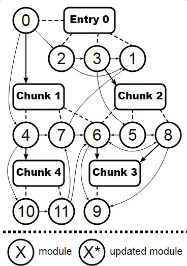

### Loader和Plugin的区别
- Loader(加载器)
    - 用于文件转换
    - webpack原生只能解析js，loader使webpack可以加载和解析非js文件(css、图片)
    - 用法：module.rules配置，数组里面每项都是object，描述了{ test针对类型、loader使用什么加载、options使用的参数 }
        ```js
        module: {
            rules: [
                {
                    test: /\.vue$/,
                    loader: 'vue-loader',
                    options: vueLoaderConfig
                },
                {
                    test: /\.scss$/,
                    loaders: ['style-loader', 'css-loader', 'sass-loader']
                },
            ]
        }
        ```
- 常见Loader
    - url-loader：小文件以 base64 的方式把文件内容注入到代码中去
    - css-loader：加载 CSS，支持模块化、压缩、文件导入等特性
    - style-loader：把外部 CSS 代码注入到 html 中，通过 DOM 操作去加载 CSS。
    - sass-loader: sass语法转换
    - babel-loader:把 ES6 转换成 ES5
    - eslint-loader： ESLint 检查 JavaScript 代码

- Plugin(插件)
    - 用于扩展webpack的功能（如打包优化、压缩、定义变量）
    - 构建过程调用原理：Webpack 会在构建过程中对应的钩子中广播出特定的事件，插件在监听到感兴趣的事件后会执行特定的逻辑，并且插件可以调用 Webpack 提供的 API 改变 Webpack 的运行结果
    - 钩子：beforeRun -> run -> beforeCompile -> compile（开始编译）-> make（入口分析依赖）-> seal（构建封装，不可更改）-> afterCompile（完成构建，缓存数据）-> emit （输出dist目录）
    - 用法：plugins中单独配置，数组里每项都是一个plugin实例，参数由构造函数传入。
        ```js
        plugins: [
            new HtmlWebpackPlugin(),
            new ProgressBarPlugin(),
            new webpack.LoaderOptionsPlugin({
                minimize: true
            }),
            new VueLoaderPlugin(),
        ]
        ```
- 常见Plugin
    - define-plugin：定义环境变量（或全局版本号：通过日期时间计算拼接，代码中直接使用）
    ```js
    new webpack.DefinePlugin({
        'WEIGHT_VERSION': JSON.stringify(getPluginVersion())
    })
    ```
    - banner-plugin: 给每个chunk头部添加banner，如注释
    ```js
    new webpack.BannerPlugin({
        banner: '// { "framework": "Vue" }\n',
        raw: true // banner内容直出，不以注释出现
    }),
    ```
    - html-webpack-plugin：简化html文件创建，设置loading
    - TerserWebpackPlugin：webpack4默认的代码压缩插件，默认开启多进程和缓存
    - uglifyjs-webpack-plugin：通过UglifyES压缩ES6代码
    ```js
    const UglifyJsPlugin = require('uglifyjs-webpack-plugin')

    module.exports = {
      plugins: [
        new UglifyJsPlugin({
        cache: true, //缓存
        sourceMap: false, //压缩 
        parallel: 4,//多核
        })
      ]
    }
    ```
    - webpack-parallel-uglify-plugin: 多核压缩,提高压缩速度
    - webpack-bundle-analyzer: 可视化webpack输出文件的体积

### HMR热更新原理（hot module replacement）

> 当你对代码进行修改并保存后，webpack 将对代码重新打包，并将新的模块发送到浏览器端，浏览器通过新的模块替换老的模块，这样在不刷新浏览器的前提下就能够对应用进行更新。

- 在 webpack 的 watch 模式下，文件系统中某一个文件发生修改，对修改的模块重新编译打包。
- webpack-dev-middleware处理打包后的文件存在内存里。
- webpack-dev-server和webpack-dev-server/client（浏览器端）建立websocket长连接，利用这个连接，传递修改模块的hash和编译打包的状态信息给浏览器。
- HMR.runtime收到新模块的hash(非最新)，Jsonp.runtime向webpack-dev-server服务端发送ajax请求，获取模块更新列表的manifest描述文件（包含更新模块的最新hash）再通过Jsonp获取最新hash对应的模块代码。
- HotModulePlugin进行模块对比，替换模块及更新依赖树modules tree引用。
- HMR失败，通过浏览器刷新整个页面获取最新代码。
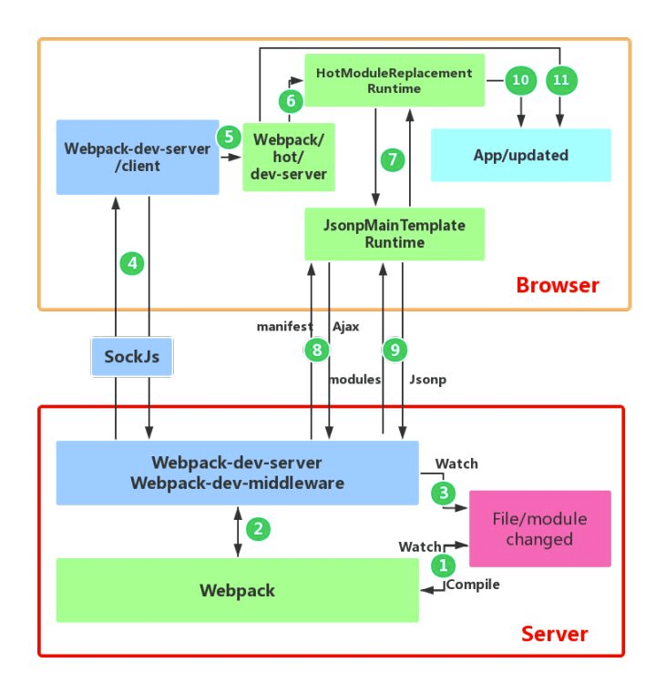

- 疑问：为什么不在socket发送更新好的模块代码
    - 应该是为了功能解耦
    - dev-server/client 只负责消息传递、不负责新模块的获取
    - HMR runtime 才应该是获取新代码的地方。

### webpack打包体积优化(Tree-shaking)
- 分析打包后的模块文件大小
    - webpack-bundle-analyzer 
    ```
    npm i -D webpack-bundle-analyzer
    npm run build -- --report
    ```
- Tree-shaking
    - webpack4默认开启Tree-shaking（mode为production）：清除代码中无用的部分。
    ```js
    //index.js
    import {add, minus} from './math';
    add(2,3);//minus不会参与构建
    ```
    - 原理：
        - 基于ES6 modules 的静态检测也就是import 语法（确保引用的模块都是ES6规范）
        - 来清除未使用的代码（比如引入但没有该变量的引用）
    
    - modules: false
        - 失效原因：**使用babel插件babel-preset-env，将es6模块转成commonjs了，无法检测**
        - 解决：.babelrc 或webpack.config.js里设置 `modules: false` ，避免module被转换commonjs
            ```js
            // .babelrc
            {
              "presets": [
                ["@babel/preset-env",
                  {
                    "modules": false
                  }
                ]
              ]
            }
            // 或者
            // webpack.config.js
            module: {
                rules: [
                    {
                        test: /\.js$/,
                        use: {
                            loader: 'babel-loader',
                            options: {
                                presets: ['@babel/preset-env', { modules: false }]
                            }
                        }，
                        exclude: /(node_modules)/
                    }
                ]
            }
    
            ```
    - sideEffects: false
        - webpack 4在package.json 文件中设置 sideEffects: false表示模块是无副作用的（是否修改了 window 上的属性，是否复写了原生对象方法等），可以放心进行判断删除。
        - 我这个包在设计的时候就是期望没有副作用的，即使他打完包后是有副作用的，webpack 同学你摇树时放心的当成无副作用包摇就好啦！
        - 使用：
            ```js
            // 第三方npm模块 的 package.json
            {
                "name": "your-project",
                "sideEffects": false
            }
            // 业务代码的 webpack.prod.conf.js
            module.exports = {
                module: {
                    rules: [
                        {
                            test: /\.jsx?$/,
                            exclude: /(node_modules|bower_components)/,
                            use: {
                                loader: 'babel-loader',
                            },
                            sideEffects: false || []
                        }
                    ]
                },
            }
            ```

### webpack打包加速优化(缓存 + 多核 + 抽离)
- 提高热更新速度：
    - 提高热更新速度，上百页 2000ms内搞定，10几页面区别不大
    ```js
    //在.env.development环境变量配置
    VUE_CLI_BABEL_TRANSPILE_MODULES:true
    ```
    - 原理：利用插件，在开发环境中将异步组件变为同步引入，也就是import()转化为require())
    - 一般页面到达几十上百，热更新慢的情况下需要用到。
    - webpack5 即将发布，大幅提高了打包和编译速度
- 分析打包时长：
    - 速度分析插件[speed-measure-webpack-plugin](https://www.npmjs.com/package/speed-measure-webpack-plugin)
    ```
    npm install --save-dev speed-measure-webpack-plugin
    ```
    ```js
    //vue.config.js
    //导入速度分析插件
    const SpeedMeasurePlugin = require("speed-measure-webpack-plugin");
    //实例化插件
    const smp = new SpeedMeasurePlugin();
    
    module.exports = {
    configureWebpack: smp.wrap({
            plugins: [
                // 这里是自己项目里需要使用到的其他插件
                new yourOtherPlugin()
            ]
        })
    }
    ```
- 较耗时：代码的编译或压缩（转化 AST树 -> 遍历AST树 -> 转回JS代码）
    - 编译 JS、CSS 的 Loader 
    - 压缩 JS、CSS 的 Plugin 
- 缓存：让二次构建时，不需要再去做重复的工作[没有变化的直接使用缓存，速度更快]
    - 开启Loader、压缩插件的cache配置【如babel-loader的`cacheDirectory:true`】，uglifyjs-webpack-plugin【如`cache: true`】，构建完将缓存存放在`node_modules/.cache/..`。
    - [cache-loader](https://www.npmjs.com/package/cache-loader)：将 loader 的编译结果写入硬盘缓存，再次构建如果文件没有发生变化则会直接拉取缓存,添加在时间长的 loader 的最前面。
    ```js
    module: {
        rules: [
            {
                test: /\.ext$/,
                use: ['cache-loader', ...loaders],
                include: path.resolve('src'),
            },
        ],
    }
    ```
- 多核：充分利用了硬件本身的优势
    - happypack：
        - 原理：将Loader转换分解到多个子进程中去并行处理，子进程处理完成后把结果发送到主进程中，从而减少总的构建时间
        - 使用方法：开启系统CPU最大线程，通过插件将loader包装，暴露id，直接module.rules引用该id。
        - happypack 默认开启 CPU核数 - 1 个进程，当然，我们也可以传递 threads 给 happypack。
        ```js
        //安装：npm install happypack -D
        //引入：const Happypack = require('happypack');
        exports.plugins = [
          new Happypack({
            id: 'jsx',
            threads: 4,
            loaders: [ 'babel-loader' ]
          }),
        
          new Happypack({
            id: 'styles',
            threads: 2,
            loaders: [ 'style-loader', 'css-loader', 'less-loader' ]
          })
        ];
        
        exports.module.rules = [
          {
            test: /\.js$/,
            use: 'Happypack/loader?id=jsx'
          },
        
          {
            test: /\.less$/,
            use: 'Happypack/loader?id=styles'
          },
        ]
        ```
    - thread-loader：添加在此loader后面的放入单独的 worker 池里运行，配置简单
        ```js
        //安装：npm install thread-loader -D
        module.exports = {
            module: {
                    //我的项目中,babel-loader耗时比较长，所以我给它配置 thread-loader
                    rules: [
                        {
                            test: /\.jsx?$/,
                            use: ['thread-loader', 'cache-loader', 'babel-loader']
                        }
                    ]
            }
        }
        ```
    - 多进程压缩    
        - 默认的TerserWebpackPlugin（比uglifyjs性能更好）：默认开启了多进程和缓存，缓存文件 `node_modules/.cache/terser-webpack-plugin`
        - 其他并行压缩插件：
            - webpack-parallel-uglify-plugin:子进程并发执行把结果送回主进程，多核并行压缩来提升代码压缩速度
            - uglifyjs-webpack-plugin自带的parallel：【如`parallel: true`】配置项开启多核编译
- 抽离：
    - dll：内置webpack的 DllPlugin编译 和 DllReferencePlugin 引入dll，提高打包速度
        - Vue全家桶、element-ui、echarts、工具库lodash不常变更的依赖 【几十秒】，避免每次构建都进行打包
        - 通过DllPlugin来对那些我们引用但是不会经常修改的npm包来进行预编译，
        - 再通过DllReferencePlugin将预编译的模块加载进来,避免反复编译浪费时间，提高打包速度。
        - 步骤：
            - 新建一个webpack.dll.config.js 的配置文件(与webpack配置同级)，配置DllPlugin插件和打包的库和输出文件的位置
            - package.json 添加 dll命令，执行webpack.dll.config.js文件
            - npm run dll命令，生成第三方代码集合js文件
            - webpack.config.js里配置DllReferencePlugin插件、找到manifest.json文件映射到依赖并打包引入
            - 修改index.html，加入script标签，写上对应dll路径
            - 如果更新依赖包，执行`npm run dll`,新的dll文件名便会加上新的hash
            ```js
            // webpack.config.dll.js
            const webpack = require('webpack');
            const path = require('path');
            
            module.exports = {
                entry: {
                    react: ['react', 'react-dom']
                },
                mode: 'production',
                output: {
                    filename: '[name].dll.[hash:6].js',
                    path: path.resolve(__dirname, 'dist', 'dll'),
                    library: '[name]_dll' //暴露给外部使用
                    //libraryTarget 指定如何暴露内容，缺省时就是 var
                },
                plugins: [
                    new webpack.DllPlugin({
                        //name和library一致
                        name: '[name]_dll', 
                        path: path.resolve(__dirname, 'dist', 'dll', 'manifest.json') //manifest.json的生成路径
                    })
                ]
            }
            
            // package.json 中新增 dll 命令
            {
                "scripts": {
                    "build:dll": "webpack --config webpack.config.dll.js"
                },
            }

            // npm run build:dll 后，会生成 
            dist
                └── dll
                    ├── manifest.json
                    └── react.dll.9dcd9d.js
            
            // manifest.json 用于让 DLLReferencePlugin 映射到相关依赖上。至此 dll 准备工作完成，接下来在 webpack 中引用即可。
            
            // webpack.config.js
            const webpack = require('webpack');
            const path = require('path');
            module.exports = {
                //...
                devServer: {
                    contentBase: path.resolve(__dirname, 'dist')
                },
                plugins: [
                    new webpack.DllReferencePlugin({
                        manifest: path.resolve(__dirname, 'dist', 'dll', 'manifest.json')
                    }),
                    new CleanWebpackPlugin({
                        cleanOnceBeforeBuildPatterns: ['**/*', '!dll', '!dll/**'] //不删除dll目录
                    }),
                    //...
                ]
            }
            // 修改 public/index.html 文件，在其中引入 react.dll.js
            <script src="/dll/react.dll.9dcd9d.js"></script>
            // 使用 npm run build 构建，可以看到 bundle.js 的体积大大减少，提高打包速度。
            ```
    - 配置Externals（推荐）：外部引入，将不需要打包的库或静态资源从构建逻辑中剔除，使用 **CDN** 的方式去引用。
        - 步骤：在externals中配置key[包名]+value[CDN全局变量名]，然后在HTML中引入CDN的script 标签。就能实现import引入了。
        ```js
        // index.html
        <script
          src="https://code.jquery.com/jquery-3.1.0.js"
          integrity="sha256-slogkvB1K3VOkzAI8QITxV3VzpOnkeNVsKvtkYLMjfk="
          crossorigin="anonymous">
        </script>
        //webpack.config.js
            module.exports = {
                //...
                externals: {
                    //jquery通过script引入之后，全局中即有了 jQuery 变量
                    'jquery': 'jQuery'
                }
            }
        ```
        - 常见CDN链接由host域名+包名+版本号+路径
        ```js
        <script src="https://cdn.bootcss.com/react/16.9.0/umd/react.production.min.js"></script>
        ```
        - 有些 CDN 服务不稳定，尽量选择成熟的CDN服务。

- Vue关闭在vue.config.js： `module.exports= { productionSourceMap:false （表示生产环境进行代码压缩） }`
    - 优点：构建速度快，体积变小，不需要源码map文件，进行代码压缩加密
    - 缺点：运行时有错误，无法准确定位哪一行。
- 更直接：
    - 升级机器配置
    - 升级webpack5或node版本 
- 效果提升：(20页)
    - 初次打包：20s
    - 二次打包：8s

### webpack在vue cli3的使用
- 默认splitChunks和minimize
    - 代码就会自动分割、压缩、优化，
    - 可单独拆包配置，如elementUI
    - 同时 webpack 也会自动帮你 Scope hoisting（变量提升） 和 Tree-shaking
    ```js
    splitChunks: {
    // ...
        cacheGroups: {    
            elementUI: {
                name: "chunk-elementUI", // 单独将 elementUI 拆包
                priority: 15, // 权重需大于其它缓存组
                test: /[\/]node_modules[\/]element-ui[\/]/
            }
        }
    }
    ```
- 默认CSS压缩：mini-css-extract-plugin
    - 升级：将原先内联写在每一个 js chunk bundle的 css，单独拆成了一个个 css 文件。
    - css 独立拆包最大的好处就是 js 和 css 的改动，不会影响对方，导致缓存失效。
    - 配合optimization.splitChunks去拆开打包独立的css文件

- 合并配置：配置configureWebpack选项，可为对象或函数(基于环境有条件地配置), 合并入最终的 webpack 配置
    ```js
    // vue.config.js
    module.exports = {
      configureWebpack: {
        plugins: [
          new MyAwesomeWebpackPlugin()
        ]
      }
    }
    // vue.config.js
    module.exports = {
      configureWebpack: config => {
        if (process.env.NODE_ENV === 'production') {
          // 为生产环境修改配置...
        } else {
          // 为开发环境修改配置...
        }
      }
    }
    ```
- 链式操作：修改/新增/替换Loader，更细粒度的控制其内部配置    
    ```js
    // vue.config.js
    module.exports = {
      chainWebpack: config => {
        config.module
          .rule('vue')
          .use('vue-loader')
            .loader('vue-loader')
            .tap(options => {
              // 修改它的选项...
              return options
            })
      }
    }
    ```

## Git
- 参考[廖雪峰的Git教程](https://www.liaoxuefeng.com/wiki/896043488029600/897013573512192)

### git flow 工作流
- 两个长期分支
    - 主分支master:稳定的发布版（已发布代码）（一般有保护功能）
    - 主开发分支develop:最新的开发代码
- 三个短期分支（用完该删除）
    - 新功能分支feature:开发新功能（由develop分支上面分出来，开发完并入Develop）
    - 预发布分支release:发布前的测试复查、版本控制、缺陷修复、（由Develop分支上面分出来，结束后并入develop和master）
    - 补丁分支hotfix:紧急修复bug(issue编号+名字)，从master上某个tag创建，修补结束，写上"fixes #14" 合并如master和develop。
- 特点：
    - 基于版本发布
    - 优点是清晰可控
    - 缺点是相对复杂，需要同时维护两个长期分支。
    - Github flow 适合持续发布，只有一个长期分支就是master
    - GitLab flow 上游master优先，由master分出其他分支如production，去发布版本。上游没问题，才合并到下游。
- 总流程
    - 并行开发：新功能新建feature分支，开发完后合并到主开发分支develop
    - 协作开发：从develop上创建新分支，即包括所有已完成的feature
    - 预发布：develop上创建一个release分支，发布到测试环境测试，有问题在此分支修复，修复完毕合并到develop和master分支。
    - 紧急修复：在已发布的tag上新建修复hotfix分支，修补结束合并如master和develop。
- tag 
    - 概念：对某个提交点打上标签，如发布版本后打 tag。
    - 作用：便于以后回滚特定版本，而不需要 revert。

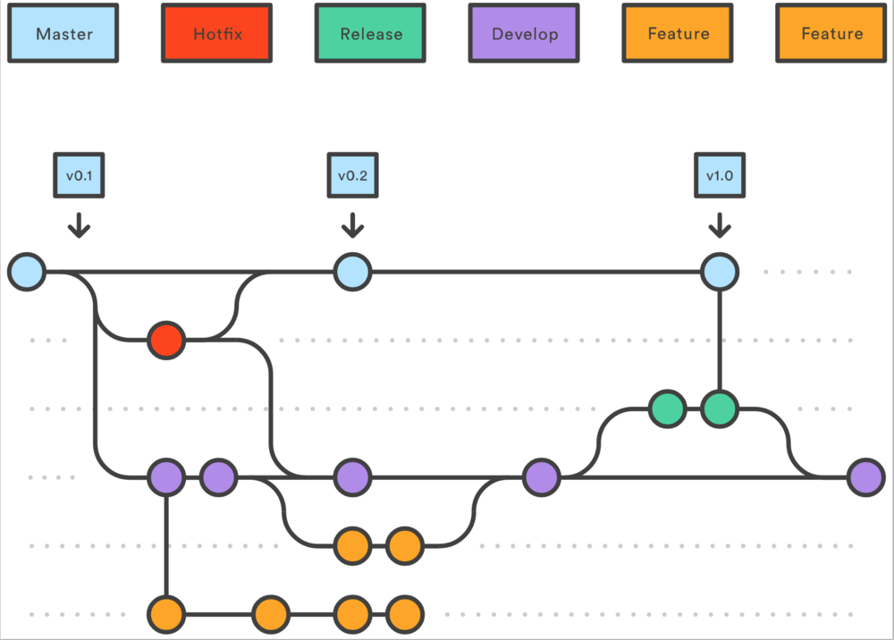

### git merge合并的几种模式

- git merge (默认--ff,fast-farward)
    - 结果：被merge的分支和当前分支在图形上并为一条线，被merge的提交点commit合并到当前分支，没有新的提交点merge。
    - 缺点：主分支混入其他分支的零碎commit点。而且删除分支，会丢失分支信息。

- git merge --no-ff (不快速合并)(推荐)
    - 结果：被merge的分支和当前分支不在一条线上，被merge的提交点commit还在原来的分支上，并在当前分支产生一个新提交点merge。
    - 优点：利于回滚整个大版本(主分支自己的commit点)。

- git merge --squash
    - 结果：把多次分支commit历史压缩为一次

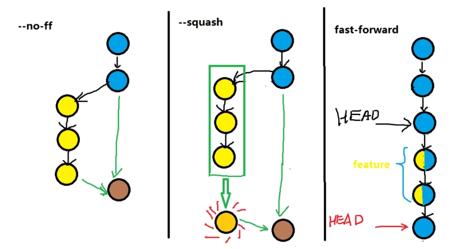

- 回退的区别：
    - 执行`git reset HEAD^ --hard` 回退最近一次提交时，如果是将dev合并进master，那使用--ff模式后，回退到dev的提交点，因为commit历史已合并。而--no-ff模式后，会回退到master的提交点，因为主分支只有merge进来的提交点，剩下的是主分支自己的提交点。

- pull Request （Merge Request）发起合并请求
    ```js
        //从master上创建develop出来
        git checkout -b develop master
        
        //合并：先切换到Master分支
    　　git checkout master
    　　
    　　//合并：再把Develop分支合并进来Master
    　　git merge --no-ff develop
    　　
    　　//打上tag标签
    　　git tag -a 1.2
    　　
    　　//删除功能分支
    　　git branch -d feature-x
    ```

- git pull 实际上是两个命令合成了一个：git fetch 和 git merge。
    - 当我们从来源拉取修改时，我们首先是像 git fetch 那样取回所有数据，然后最新的修改会自动合并到本地分支中。

### git checkout / git reset / git revert的区别


> reset使用--hard需要小心，会影响工作区的修改内容。--soft只回退commit历史记录，修改内容仍保留在工作区和暂存区。

- 版本回退-**自己分支**：**自己的分支回退直接用git reset**，根据设定的commit_id来回移动HEAD，它有三种模式。

    - `--hard`：硬重置，影响工作区、暂存区、本地历史记录区【回退后，工作区的修改内容或文件会丢失】
    - `--mixed`（默认）：影响到暂存区、本地历史记录区【回退后，修改内容只保留在工作区】
    - `--soft`：软重置，只影响本地历史记录区【回退后，修改内容在工作区、暂存区都保留】
        - 工作区：在 git 管理下的正常目录都算是工作区，我们平时的编辑工作都是在工作区完成
        - 暂存区：git add之后的临时区域，里面存放将要提交文件的快照
        - 历史记录区：git commit 后的记录区
        ```
        git reset --hard commit_id
        git push -f         // 强制推送远程分支
        ```
        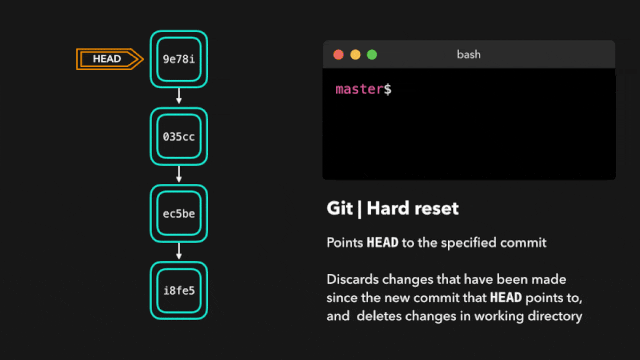
- 版本回退-**公共分支**：如develop回滚用revert，**产生一次新的提交**（避免丢掉成员的提交）
    ```
    git revert 0ffaacc     // 撤销0ffaacc这次提交
    git revert HEAD        // 撤销最近一次提交
    git revert HEAD~1      // 撤销最近2次提交，注意：数字从0开始
    git push -f            // 强制推送远程分支
    ``` 
    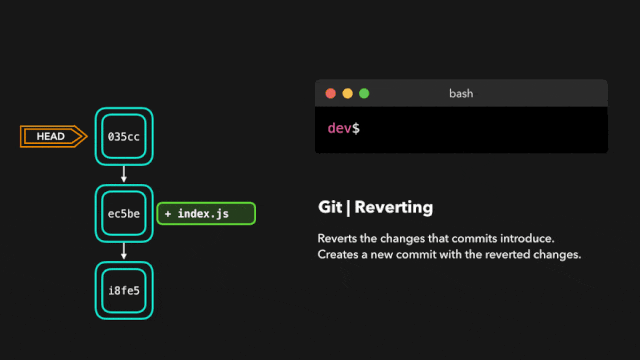

- HEAD表示最新提交 ；HEAD^上一次； HEAD~n表示第n次(从0开始，表示最近一次)

- 本地撤回修改
    - 丢弃工作区的修改或者是已add后的修改（**路径要找对才可以**，要进入对应的文件夹）
        ```
        git checkout -- filename    // 彻底丢弃某个文件的改动
        git checkout .              // 放弃本地所有改动
        ```
    - 已git add 添加到暂存区，`reset filename` 取消文件的缓存
        ```
        git reset HEAD filename   // 放弃指定文件的缓存（HEAD表示最新版本）
        git reset HEAD .          // 放弃所有的缓存
        ```
    - 已git commit 添加到本地历史记录区，`reset commit_id`加上--hard会丢弃工作区修改的内容，直接回到上次commit的修改状态。默认mixed，则将修改内容回退到工作区。
        ```
        git reset --hard commit_id  // 自己分支使用的版本回退，丢弃已commit的其他版本
        git reset --hard HEAD^      // 上一次commit的版本
        ```

- 查找对应版本commit_id
    ```
    git log     //查看提交的版本历史
    git reflog  //查看所有命令历史。包括已被回退的commit id，可用于穿梭到未来的commit点。
    ```

### git merge / git rebase 的区别
- [知乎解释](https://zhuanlan.zhihu.com/p/75499871)
- [git解释](https://github.com/geeeeeeeeek/git-recipes/wiki/5.1-%E4%BB%A3%E7%A0%81%E5%90%88%E5%B9%B6%EF%BC%9AMerge%E3%80%81Rebase-%E7%9A%84%E9%80%89%E6%8B%A9)
- [其他解释](https://www.html.cn/archives/10077)

- 一句话：
    - rebase意思是变基，改变分支的起始位置，在dev上`git rebase master`，将dev的多次commit一起拉到要master最新提交的后面(时间最新)，变成一条线，用于整理自己的dev提交历史，把master最新代码合进来。
    - merge会保留两个分支的commit信息，而且是交叉着的，即使是ff模式，两个分支的commit信息会混合在一起，用于自己dev合并进master。
- git merge ：自动创建一个新的合并(merge-commit)，且包含两个分支记录， 如果合并的时候遇到冲突，仅需要修改后重新commit
    - 场景：如**dev要合并进主分支master**，保留详细的合并信息。
    - 优点：展示真实的commit情况
    - 缺点：分支杂乱
        ```
        $ git checkout master
        $ git merge dev
        ```
        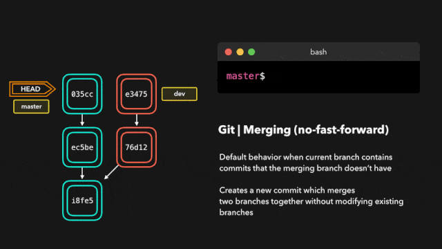

- git rebase：不产生merge commit，变换起始点位置，“整理”成一条直线，且能使用命令合并多次commit。
    - 如在develop上git rebase master 就会拉取到master上的最新代码合并进来，也就是将分支的起始时间指向master上最新的commit上。自动保留的最新近的修改，不会遇到合并冲突。而且可交互操作（执行合并删除commit），可通过交互式变基来合并分支之前的commit历史`git rebase -i HEAD~3`
    - 场景：主要**发生在个人分支**上，如 git rebase master整理自己的dev变成一条线。频繁进行了git commit提交，可用交互操作`drop`删除一些提交，`squash`提交融合前一个提交中。
    - 优点：简洁的提交历史
    - 缺点：发生错误难定位
        ```
        $ git checkout dev
        $ git rebase master
        ```
        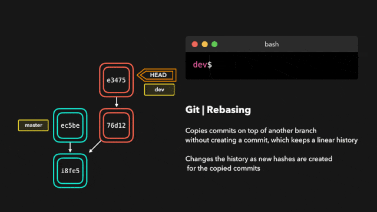
        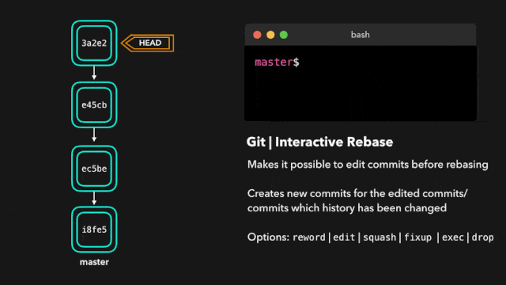

- 使用rebase还是merge更多的是管理风格的问题，有个较好实践：就是dev在merge进主分支（如master）之前，最好将自己的dev分支给rebase到最新的主分支（如master）上，然后用pull request创建普通merge请求。用rebase整理成重写commit历史，所有修改拉到master的最新修改前面，保证dev运行在当前最新的主branch的代码。避免了git历史提交里无意义的交织。
    - 假设场景：从 dev 拉出分支 feature-a。
        - 那么当 dev 要合并 feature-a 的内容时，使用 `git merge feature-a`。
        - 反过来当 feature-a 要更新 dev 的内容时，使用 `git rebase dev`。

- review（强制+发版前+小片段+线上交流+高频率）（代码交流和人员成长，辅助产品质量）
    - 代码规范：明确Coding规则
    - 检视指南：消除困惑和迷茫
    - 总结优化：透明问题，持续优化（非常重要）
    - 激励机制：激发主观能动性

- git merge图示
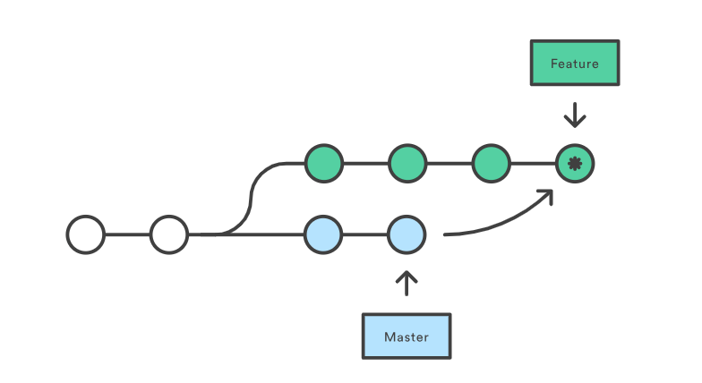
- git rebase图示
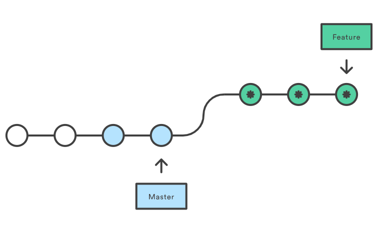


### git commit 规范(git cz)
- [掘金参考](https://juejin.im/post/5afc5242f265da0b7f44bee4#heading-4)

> commitizen 可使用git cz + cz-conventional-changelog 规范适配器 + commitlint 校验 + husky

- 作用：生成规范统一的commit message，有助于团队成员review和项目管理。

- 最终提交格式：

```
<type>(<scope>): <subject> // 类型 范围 标题

<body> // 内容
```


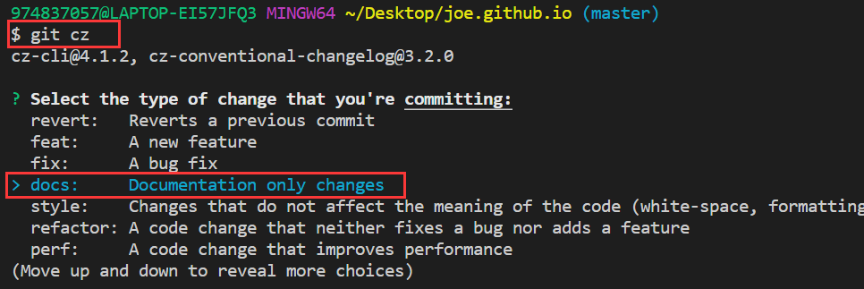
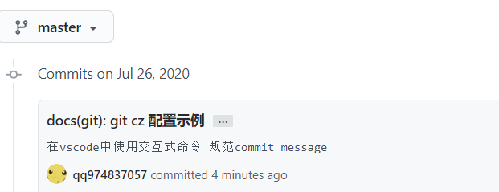

> 注意：windows下git bash无法使用交互式，可直接在vscode中使用终端配置git bash，方可使用上下箭头移动交互。

- 安装：
    - 全局安装：需要 ~/.czrc 配置文件, 为 commitizen 指定 Adapter.
    ```
    npm install -g commitizen cz-conventional-changelog
    // 创建配置文件
    echo '{ "path": "cz-conventional-changelog" }' > ~/.czrc
    ```
    - 项目级安装
    ```
    npm install -D commitizen cz-conventional-changelog
    
    // package.json
    "script": {
        ...,
        "commit": "git-cz",
    },
     "config": {
        "commitizen": {
          "path": "node_modules/cz-conventional-changelog"
        }
     }
    ```
    - 安装commitlint校验规范： @commitlint/config-conventional (符合 Angular团队规范) + husky(git hook钩子) 在commit提交后进行lint校验.
    ```
    npm i -D @commitlint/config-conventional @commitlint/cli husky
    
    // 创建配置文件.commitlintrc.js，与package.json同级
    module.exports = {
      extends: [
        "@commitlint/config-conventional"
      ],
      rules: {
      }
    };
    
    // package.json
    "husky": {
        "hooks": {
          "commit-msg": "commitlint -e $GIT_PARAMS"
        }
    }
    ```
- 使用：
    
    ```
    
    命令：npm run commit or git cz(全局安装下可使用)
    
    1.Select the type of change that you're committing 选择改动类型 (<type>)

    2.What is the scope of this change (e.g. component or file name)? 填写改动范围 (<scope>)
    
    3.Write a short, imperative tense description of the change: 写一个精简的描述 (<subject>)
    
    4.Provide a longer description of the change: (press enter to skip) 对于改动写一段长描述 (<body>)
    
    5.Are there any breaking changes? (y/n) 是破坏性修改吗？默认n (<footer>)
    
    6.Does this change affect any openreve issues? (y/n) 改动修复了哪个问题？默认n (<footer>)
    
    // 生成的最终格式
    <type>(<scope>): <subject>
    <BLANK LINE>
    <body>
    <BLANK LINE>
    <footer>
    
    // 填写完毕后，husky会调用commitlint对message进行格式校验，默认规定type及subject为必填项。
    ```


- type必填：当一次改动包括主要type与特殊type时，统一采用主要type。
    ```
        # 主要
        feat：新功能
        fix： 修复bug
        # 特殊
        docs: 文档相关
        style： 代码格式：缩进、空格之类
        build： webpack构建工具或外部依赖变动如npm
        refactor：重构
        revert：执行git revert打印的message
    ```
- scope必填：改动的范围，格式为项目名/模块名
    ```
    node-pc/common rrd-h5/activity
    ```
- subject: commit 的概述    
- body：commit的具体改动情况和原因
- break changes：破坏性修改：描述接口删除、迁移等
- affect issues: 影响的哪个issues`（re #123、fix #123）`


### 编码风格-分号

> 尤大总结：至于说 “很难总结什么时候加不加”，其实真的很简单。真正会导致上下行解析出问题的 token 有 5 个：括号，方括号，正则开头的斜杠，加号，减号。我还从没见过实际代码中用正则、加号、减号作为行首的情况，所以总结下来就是一句话：一行开头是括号或者方括号的时候加上分号就可以了，其他时候全部不需要。其实即使是这两种情况，在实际代码中也颇为少见。

- 大部分情况下：JS引擎会自动为我们添加分号，叫自动分号插入(ASI)。
- 一些特殊场景：JS判断不需要添加分号，就会导致问题，需要我们注意在特殊情况前面手动添加分号。
- 总结：如果不想在每句代码后面加分号，需要注意特殊情况如括号，方括号，正则开头的斜杠，加号，减号。在这些地方要手动加上分号。

- 使用ESlint --fix 可以自动添加删除分号，风格迁移成本接近0。
    - 配置semi：
        - "always" （默认值）在语句结尾处需要分号
            ```js
            semi: ["error", "always"]
            ```
        - "never" 不允许分号作为语句的末尾（不包括那些为了消除歧义以 [，(，/，+，或 - 开头的语句）
            ```js
            semi: ["error", "never"]
            ```
        - 也可以用数字表示：0，1，2分别表示off, warning, error    


## 前端工程化
- 模块化
    - JS模块化
    - CSS模块化
    - 资源模块化
- 组件化
    - 复杂页面按功能拆分成多个独立的组件
    - 通用组件
    - 业务组件
- 规范化
    - UI 规范
    - 接口规范
    - 编码规范(eslint)
    - 提交规范(commitizen 工具 + cz-conventional-changelog 规范适配器)
    - 开发流程(GitFlow工作流、CodeReview、测试、部署)

## 前端错误监控体系
- [错误监控参考](http://jartto.wang/2018/11/20/js-exception-handling/)

### 异常分类
- JS语法错误、代码异常
- AJAX请求异常
- 静态资源加载异常
- Promise异常
- 跨域
- 奔溃、卡顿

### 处理方式总结（try-catch -> window.onerror -> addEventListener捕获 -> unhandledrejection未处理的reject -> Vue捕获）

1. 可疑区域使用`try-catch`:监控特定的错误，捕获同步的运行时的错误

2. 全局监控JS运行异常`window.onerror`：捕获预料之外的错误：` window.onerror` 可捕获同步+异步，语法错误和静态资源捕获不到

```
window.onerror = function(message, source, line, column, error) {
    console.log('捕获到异常：',{message, source, lineno, colno, error});
    //message:错误消息 source：脚本URL line/column：行列 error：错误对象
}
```

3. 全局静态资源异常和网络请求异常，error不会冒泡，使用捕获阶段监听` window.addEventListener('error',(error)=>{},true)`

4. 捕获没有catch的Promise：`window.addEventListener('unhandledrejection',e => {})`

5. Vue异常捕获
- 捕获error： `Vue.config.errorHandler(err, vm, info)`
```js
Vue.config.errorHandler = function(err, vm, info) { //err指代error对象，info是一个Vue特有的字符串，vm指代Vue应用本身。
    console.log(`Error: ${err.toString()}\nInfo: ${info}`);
}
```

```js
// weex中的错误监控
Vue.config.errorHandler = function(err, vm, info) {
  let errObj = {
    path: weex.config.bundleUrl,
    errDesc: err.toString(),
    errDetail: JSON.stringify(err),
    info: info
  }
  let errMsg = '执行时错误信息: \n' + JSON.stringify(errObj, null, 4)
  console.error(errMsg)
}
```

- 捕获warning： `Vue.config.warnHandler(msg, vm, trace)` //trace表示组件树，生产环境不可用

6. Script error表示跨域（加载自不同域的脚本）
- 为 script 标签添加 crossOrigin 属性
- 服务器设置Access-Control-Allow-Origin：* 响应头

7. 错误(埋点)上报方式（可设置采集率）：
```js
Reporter.send = function(data) {
  // 采集率 30% 避免收集太多条
  if(Math.random() < 0.3) {
    send(data)      // 上报错误信息
  }
}
```
- [方式总结](https://toutiao.io/posts/xpy6p8/preview)
- 通过 Ajax 发送数据(get/post)
    - 一般打点域名不是当前域名，容易造成跨域
- 通过请求其他文件
    - 要插入dom才发请求，性能不好
    - 加载资源会阻塞页面渲染
- 动态创建img标签的形式（简单常用1x1的透明GIF）
    - 使用：
        ```js
        (new Image()).src = 'http://baidu.com/tesjk?logs=error'(?后加信息)
        ```
    - 优点：
        - 无跨域问题，不需要操作dom
        - 1X1最小合法图片
        - gif支持透明，且体积最小为43字节。

8. 监控网页奔溃：window对象的load和beforeunload
```js
window.addEventListener('load', function () {
    sessionStorage.setItem('good_exit', 'pending');
    setInterval(function () {
        sessionStorage.setItem('time_before_crash', new Date().toString());
    }, 1000);
  });

  window.addEventListener('beforeunload', function () {
    sessionStorage.setItem('good_exit', 'true');
  });

  if(sessionStorage.getItem('good_exit') &&
    sessionStorage.getItem('good_exit') !== 'true') {
    /*
        insert crash logging code here
    */
    alert('Hey, welcome back from your crash, looks like you crashed on: ' + sessionStorage.getItem('time_before_crash'));
  }
```

## 项目重构
- [参考](https://www.itzhai.com/refactoring/refactoring-principle.html)
- 它的概念：不影响目前功能情况下，对软件内部结构进行调整。
- 它的优点：提高代码可读性；降低维护成本；
- 它的作用：消除重复代码；更容易找到BUG；
- 执行时机：添加功能时；修复BUG时；
- 新业务紧急和重构技术的选择：新模块考虑用新做法，旧模块建议先融入并整理逻辑，待后期业务不紧急考虑进行重构。

## 埋点方案