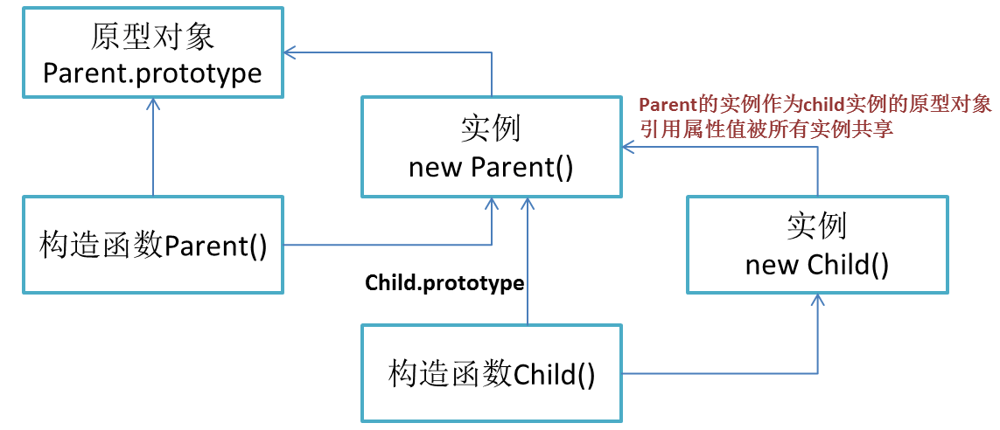

## 继承
> 在原型对象Parent.prototype上定义方法，在构造函数中定义属性。

分别有下面几类继承方式
- 构造函数：父类的构造函数通过call(this)，在子类构造函数中执行，继承父类的属性(拷贝属性副本)，但是父类原型上的方法无法继承。
- 原型链：将父类的实例当作子类构造函数的prototype原型对象，继承父类属性和方法，但是父类生成的实例属性如果是引用类型(也就是子类原型对象上有引用类型)，则会被子类生成的实例共享。
- 组合式：通过构造函数继承属性，通过原型链继承方法，保证每个子类的实例有自己的父类属性副本，而且可以通过原型链复用方法。
- 寄生组合式：由于组合式中，子类/父类的原型对象都是Parent.prototype，子类没有自己的constructor，无法区分是由父类直接new出来还是子类直接new出来的实例，所以通过Object.create(Parent.prototype)，创建一个中间对象，使得父类/子类的原型对象可以隔离开，然后将constructor指向Child构造函数，就完成最理想的整个继承过程。

#### 构造函数继承：借助构造函数（父类构造函数在子类执行，this指向子类构造函数的实例）
- 缺点：只能继承属性，无法继承父类的原型上的方法
  ```js
  function Parent() {
      this.name = 'parent';
  }
  Parent.prototype.say = function() {
      
  }
  function Child() {
      Parent.call(this) 
      this.type = 'child'
  }
  console.log(new Child()) //name: "parent" type: "child"
  ```
#### 原型链继承：借助原型链（子类构造函数的prototype赋值为父类的实例）
- 可以继承父类的原型上的属性和方法
- 但是包含引用类型值的原型对象的属性会被实例共享(这也是为什么要在构造函数上定义属性，而不是原型对象中定义属性的原因)
- 缺点：new Parent()出来的实例被当成Child生成出所有实例的原型对象，所以原型对象包含引用类型值的属性，就会被Child生成的实例所共享，改动其中一个，另一个实例也跟着改变。如改变play数组。
  ```js
  function Parent() {
      this.name = 'parent';
      this.play = [1, 2, 3];
  }
  Parent.prototype.say = function() {
      
  }
  function Child() {
      this.type = 'child';
  }
  Child.prototype = new Parent();
  console.log(new Child()); // Child {type: "child"} : type: "child" __proto__: Parent

  let child1 = new Child();
  let child2 = new Child();
  child1.play.push(4);
  console.log(child1.play); // [ 1, 2, 3, 4 ]
  console.log(child2.play); // [ 1, 2, 3, 4 ]
  ```

#### 组合继承
- 使用原型链实现继承原型方法，使用构造函数继承实例属性，每个实例都有自己的属性副本，避免共享引用属性。
- 缺点：执行了两次父类构造函数，且构造函数指的是父类的构造函数。
  ```js
  function Parent() {
      this.name = 'parent';
      this.play = [1, 2, 3]
  }
  Parent.prototype.say = function() {
      
  }
  function Child() {
      Parent.call(this) //执行第一次
      this.type = 'child'
  }
  // Child.prototype = new Parent() //执行第二次
  // 优化：换成父类构造函数的原型
  Child.prototype = Parent.prototype

  console.log(new Child) // Child {name: "parent", play: Array(3), type: "child"}
  let  child1 = new Child();
  let  child2 = new Child();
  child1.play.push(4);
  console.log(child1.play) // [ 1, 2, 3, 4 ]
  console.log(child2.play) // [ 1, 2, 3 ]
  child1.say()
  child2.say()
  ```
#### 寄生组合继承：使用构造函数继承属性，使用原型链继承方法，创造一个父类原型的副本作为子类构造函数的原型。
- 前面组合式由于共用一个原型对象(Parent.prototype)，子类无自己构造函数，向上找构造函数是Parent。所以用Object.create隔离开原型，再给子类添加自己的构造函数）
- Object.create(obj) 创建的中间对象以参数为原型对象，形成原型链
- 内部原理：创建一个新的构造函数，它的prototype指向参数obj，再返回这个构造函数的实例，也就是新对象Obj。
  ```js
  function Parent() {
      this.name = 'parent';
      this.play = [1, 2, 3]
  }
  Parent.prototype.say = function() {
      
  }
  function Child() {
      Parent.call(this) //执行第一次
      this.type = 'child'
  }
  Child.prototype = Object.create(Parent.prototype)
  Child.prototype.constructor = Child
  var child = new Child()
  console.log(child instanceof Child , child instanceof Parent)
  console.log(child.constructor)
  // true true  -> 根据原型链，instanceof判断都为true，那怎么区分开是父类实例化，还是子类实例化的？打印constructor就可以看到是父类构造函数还是子类构造函数。
  // function Child() {
  //     Parent.call(this) //执行第一次
  //     this.type = 'child'
  // }

  // child实例 -> 原型为Object.create(obj)中间实例对象Obj -> 它原型为Parent的prototype 
  //          -> 也就是Obj的构造函数和Parent的构造函数指向同一个原型对象
  ```

#### ES6 : class / extends 语法糖
  ```js
  class Parent {
        constructor(name) {
          this.name = name;
        }
        sayHello() {
          console.log("I'm parent!" + this.name);
        }
      }

  class Child extends Parent {
    constructor(name) {
      super(name);
    }
    sayChildHello() {
      console.log("I'm child " + this.name)
    }
    // 重新声明父类同名方法会覆写,ES5的话就是直接操作自己的原型链上
    sayHello(){
      console.log("override parent method !,I'm sayHello Method")
    }
  }

  let testA = new Child('Joe')
  ```
#### 区别
  - ES5 的继承使用借助构造函数实现，实质是先创造子类的实例对象this，然后再将父类的方法添加到this上面。ES6 的继承机制完全不同，实质是先创造父类的实例对象this（所以必须先调用super方法），然后再用子类的构造函数修改this。
  - ES6 在继承的语法上不仅继承了类的原型对象，还继承了类的静态属性和静态方法


## Object.create

作用：创建一个新对象，以参数obj作为新对象的__proto__

- 定义了一个临时构造函数
- 将这个临时构造函数的原型指向了传入进来的对象。
- 返回这个构造函数的一个实例。该实例拥有obj的所有属性和方法。

```js
function create(obj) {
  function F() {}
  F.prototype = obj;
  return new F();
}
```

## new

- new Object()创建新的对象obj。
- obj的`__proto__`链接到构造函数的原型`fn.prototype`。
- 执行构造函数，用apply使this指向新建的对象`fn.apply(obj, [...arguments].slice(1))`。
- 构造函数执行完若有返回引用类型的值，则返回该对象res，返回非引用类型的值，则忽略。
- 执行完无返回，则返回创建的对象obj。


```js
function New(fn) {
  const obj = new Object();
  if(fn.prototype !== null) {
    obj.__proto__ = fn.prototype;
  }
  const res = fn.apply(obj, [...arguments].slice(1));
  if((typeof res === 'object' || typeof res === 'Function' ) && res !== null) {
    return res;
  }
  return obj;
}


// 测试用例1-构造函数返回对象-返回res
function test1(name, age) {
    this.weight = 60;
    this.age = age;
    return {
        name: name,
        habit: 'Games'
    }
}
// const joe1 = new test1('Joe', '25');
const joe1 = New(test1, 'Joe', '25');
console.log(joe1.name) // Joe
console.log(joe1.habit) // Games
console.log(joe1.weight) // undefined
console.log(joe1.age) // undefined

// 测试用例2-构造函数返回字符串-返回创建的obj
function test2 (name, age) {
    this.weight = 60;
    this.age = age;
    return 'handsome boy';
}
// const joe2 = new test2('Joe', '25');
const joe2 = New(test2, 'Joe', '25');
console.log(joe2.name) // undefined
console.log(joe2.habit) // undefined
console.log(joe2.weight) // 60
console.log(joe2.age) // 25
```


## call、apply
### call
```js
// 设置目标this的fn为函数本身
// 不要第一个this参数，取剩余传入的参数
// 目标this执行该fn函数(带参数)
// 删除该fn函数，返回结果

Function.prototype.call2 = function(context = window) {
  let result;
  context.fn = this;
  let args = [...arguments].slice(1);
  result = context.fn(...args);
  delete context.fn;
  return result;
}

// 测试用例
let test = { value: 666 };

function joe(name, age) {
  // 函数的传参
  console.log(name);
  console.log(age);
  // this对象里的内容
  console.log(this.value);
}

joe.call2(test, 'joe', 25);
// 'joe' 25 666
```
### apply
```js
// 设置目标this的fn为函数本身
// 取argument[1]数组为参数，展开并传入
// 目标this执行该fn函数(带参数，若无argument[1]则不带)
// 删除该fn函数，返回结果

Function.prototype.apply2 = function(context = window) {
  let result;
  context.fn = this;
  if(arguments[1]) {
    result = context.fn(...arguments[1]);
  } else {
    result = context.fn();
  }
  delete context.fn;
  return result;
}

// 测试用例
let test = { value: 666 };

function joe(name, age) {
  console.log(name);
  console.log(age);
  console.log(this.value);
}

joe.apply2(test, ['joe', 25]);
// 'joe' 25 666
```
## bind

> bind() 方法会创建一个新函数。当这个新函数被调用时，bind() 的第一个参数将作为它运行时的 this，之后的一序列参数将会在传递的实参前传入作为它的参数。(来自于 MDN )

- 非函数调用bind报错
- 1. 返回一个函数，指定this为传入的第一个参数
- 2. 两个地方可传参数，执行bind时，执行bind的返回函数时，所以要将bind函数的arguments参数和返回函数的arguments参数concat()在一起。
- 3. bind返回的函数作为构造函数，bind时指定的this失效，但传入参数仍有效。
- 4. 判断this有没有被new构造函数改成指向实例，若被new调用(改变this)，则apply执行的this指向this，使context的this失效，否则为context。
- 5. 返回的函数作为构造函数需要实现继承(通过返回bound构造函数new出来的实例可以继承绑定函数的原型中的值)，为了避免绑定函数的prototype被同时修改，使用Object.create隔离开原型，再通过原型链实现继承。

```js
Function.prototype.bind2 = function(context) {
  if(typeof this !== 'function') {
    throw Error('not a function');
  }
  let fn = this;
  let args = [...arguments].slice(1);
  let bound = function() {
    return fn.apply(this instanceof bound ? this : context, args.concat([...arguments]));
  }
  // bound.prototype = fn.prototype; (不好)
  bound.prototype = Object.create(fn.prototype);
  return bound;
}

// 测试用例1

// 函数需要传 name 和 age 两个参数，可以在 bind 的时候，只传一个 name，在执行返回的函数的时候，再传另一个参数 age。
var test = { value: 1 };
function joe(name, age) {
    console.log(this.value);
    console.log(name);
    console.log(age);
}
var bindJoe = joe.bind2(test, 'joe');
bindJoe('25');  // 1 'joe' '25'

// 测试用例2

// 修改的是 bindFoo.prototype ，bar.prototype 的值没被影响修改
function bar() {}
var bindFoo = bar.bind2(null);
bindFoo.prototype.value = 1;
console.log(bindFoo.prototype.value); // 1
console.log(bar.prototype.value);     // undefined
```

## instanceof
- 检测构造函数的`prototype`属性是否出现在某个实例对象的原型链上
- 用法：object instanceof constructor （实例对象 instanceof 构造函数）
- String 对象和 Date 对象都属于 Object 类型，下面的类型Car生成auto的实例对象，即属于Car，又属于Object。
```js
// __proto__: 代表原型对象链
instance.[__proto__]=== instance.constructor.prototype

// 示例：Car作为构造函数，auto为实例对象
function Car(make, model, year) {
  this.make = make;
  this.model = model;
  this.year = year;
}
const auto = new Car('Honda', 'Accord', 1998);

console.log(auto instanceof Car);     // true
console.log(auto instanceof Object);  // true

var simpleStr = "This is a simple string"; //(基本类型，查不到__proto__)
var newStr = new String("String created with constructor");//(对象，有__proto__)
var myDate = new Date();

simpleStr instanceof String; // false
newStr instanceof String;   // true
newStr instanceof Object;   // true
myDate instanceof Date;     // true
myDate instanceof Object;   // true
```
- 模拟实现instanceof
```js
function instance_of(L, R) {
  var O = R.prototype, L = L.__proto__;
  while (true) {
    if(L === null) return false;
    if(O === L) return true;
    L = L.__proto__;
  }
}
```

## 防抖
- [木易杨](https://muyiy.cn/blog/7/7.2.html#underscore-%E6%BA%90%E7%A0%81%E8%A7%A3%E6%9E%90)
- 带立即执行的防抖
```js
function debounce(fn, wait = 100, immediate) {
    // 创建一个定时器
    let timer = null;
    return function() {
        if(immediate && !timer) { // 首次触发，立即执行
            fn.apply(this, arguments);
        }
        //  如果持续触发，清除定时器，不会执行 fn 函数
        clearTimeout(timer);
        // 创建一个新的 setTimeout
        timer = setTimeout(() => {
            fn.apply(this, arguments);
        }, wait)
    }
}
```

## 节流
- 时间戳版
- 定时器版

## 浅拷贝、深拷贝
### 浅拷贝
- 思路：直接递归赋值再返回即可。

```js
function clone(target) {
  let  copy = {};
  for (const key in target) {
    copy[key] = target[key];
  }
  return copy;
}
let obj1 = {name:'joe',sport:{name:'swim'}};
let obj2 = clone(obj1);
console.log(obj2); // { name: 'joe', sport: { name: 'swim' } }

obj2.sport.name = 'joo';
console.log(obj1); // { name: 'joe', sport: { name: 'joo' } }
```

### 深拷贝
- 思路：
  - 如果是基本类型或者函数，直接返回，两个对象使用一个在内存中处于同一个地址的函数也是没有任何问题。
  - 如果是 RegExp 或者 Date 类型，返回对应类型。
  - 如果是引用类型(数组、对象)，进行递归赋值。
  - 考虑循环引用的问题、使用一个WeakMap结构存储已经被拷贝的对象，每一次进行拷贝的时候就先向WeakMap查询该对象是否已经被拷贝，如果已经被拷贝则取出该对象并返回，WeakMap键名只能为对象，不能为基本类型。 使用WeakMap，map和obj存在的就是弱引用关系，垃圾回收时内存会释放掉，节省内存消耗 。

- 常规版

```js
function deepClone(obj, map = new WeakMap()) {

  if(obj instanceof Date) return new Date(obj);     // 专门处理Date
  if(obj instanceof RegExp) return new RegExp(obj); // 专门处理RegExp
  if (obj === null || typeof obj !== 'object') {    
    // 不是引用数据类型或是function, 直接返回
    return obj;
  }

  // 解决循环引用问题
  if(map.get(obj)) {
    return map.get(obj);
  }
  let copy = Array.isArray(obj) ? [] : {};
  map.set(obj, copy);

  // 遍历+递归赋值
  for(const key in obj) {
    copy[key] = deepClone(obj[key], map);
  }
  return copy;
}
// 测试用例
const obj = {
  arr: [1, 2],
  joe: {key: '对象'},
  a:() => {
    console.log('函数');
  },
  date: new Date(),
  reg: /正则/g
}
obj.obj = obj;

const obj1 = deepClone(obj);
console.log(obj1);
// { 
// arr: [ 1, 2 ],
// joe: { key: '对象' },
// a: [Function: a],
// date: 2020-07-01T09:39:52.799Z,
// reg: /正则/g,
// obj: [Circular] 
// }

```

- 增强版

```js
// 考虑Set、Map
function deepClone(obj, map = new WeakMap()) {

  if(obj instanceof Date) return new Date(obj);     // 专门处理Date
  if(obj instanceof RegExp) return new RegExp(obj); // 专门处理RegExp
  if (obj === null || typeof obj !== 'object') {    
    // 不是引用数据类型或是function, 直接返回
    return obj;
  }

  // 解决循环引用问题
  if(map.get(obj)) {
    return map.get(obj);
  }
  let copy = Array.isArray(obj) ? [] : {};
  map.set(obj, copy);

  // 克隆set
  if (obj instanceof Set) {
    copy = new Set();
    obj.forEach(value => {
        copy.add(deepClone(value, map));
    });
    return copy;
  }

  // 克隆map
  if (obj instanceof Map) {
    copy = new Map();
    obj.forEach((value, key) => {
      copy.set(key, deepClone(value, map));
    });
    return copy;
  }

  // 遍历+递归赋值
  for(const key in obj) {
    copy[key] = deepClone(obj[key], map);
  }
  return copy;
}

// 测试用例
let mySet = new Set();
mySet.add(1); // Set [ 1 ]
mySet.add(2); // Set [ 1, 2 ]
let myMap = new Map();
myMap.set('keyString', "和键'a string'关联的值");
myMap.set('keyObj', "和键keyObj关联的值");

const obj = {
  arr: [1, 2],
  joe: {key: '对象'},
  a:() => {
    console.log('函数');
  },
  date: new Date(),
  reg: /正则/g,
  set: mySet,
  map: myMap
}
obj.obj = obj;

const obj1 = deepClone(obj);
console.log(obj1);
// { 
//   arr: [ 1, 2 ],
//   joe: { key: '对象' },
//   a: [Function: a],
//   date: 2020-07-01T09:44:28.949Z,
//   reg: /正则/g,
//   set: Set { 1, 2 },
//   map:Map {
    //      'keyString' => '和键\'a string\'关联的值',
    //      'keyObj' => '和键keyObj关联的值' 
    //       },
//   obj: [Circular] 
// }
```

## Promise/A+ 实现

#### Promise/A+规范：

（1）一个promise必须有3个状态（state），pending（等待态），fulfilled（成功态），rejected（失败态）。当处于pending状态的时候，可以转移到fulfilled或者rejected状态。当处于fulfilled状态或者rejected状态的时候，就不可变。

（2）一个promise必须有一个then方法，then方法接受两个参数：

```js
promise.then(onFulfilled, onRejected)
```
其中onFulfilled方法表示状态从pending——>fulfilled时所执行的方法，且有不可改变的值(value)，而onRejected表示状态从pending——>rejected所执行的方法，且有不可改变的值(reason)。

（3）为了实现链式调用，then方法必须返回一个promise
```js
promise2 = promise1.then(onFulfilled, onRejected)
```

（4）executor函数报错 直接执行reject();

#### 用法：
```js
const promise = new Promise((resolve, reject) => {
  if('操作成功') {
    resolve(result)
  } else {
    reject(error)
  }
})

promise.then(function(res) {
  // success
  console.log(res)
}, function(err) {
  // failure
  console.log(err)
})
// 也可以使用箭头函数
```

#### 简版实现
- [资料](https://juejin.im/post/5b2f02cd5188252b937548ab#)

- promise用类class声明
- new Promise会传入函数，也就是构造函数的参数叫executor，传入就立即执行。
- 构造函数中
   - 声明状态和回调函数数组、定义resolve、reject函数
   - `resolve/reject`中判断`pending`状态、改变state为`fulfilled/rejected`，赋值`this.value/this.reason`并遍历执行回调函数数组中的每个函数。
   - 执行传入的参数executor函数，try...catch... 执行出错直接`reject(err)`
- then方法
  - 传入两个参数，`then(onFulfilled, onRejected)`
  - 分三个状态：
    - 'fulfilled'-> 执行回调函数 `onFulfilled(this.value)` 
    - 'rejected' -> 执行回调函数 `onRejected(this.reason)`
    - 'pending' -> 传入回调函数数组保存起来 `this.onResolvedCallbacks.push(() => {onFulfilled(this.value);})`
    - 'pending'-> 传入回调函数数组保存起来  `this.onRejectedCallbacks.push(() => {onRejected(this.reason);})`

```js
class Promise {
  constructor(executor) {
    // 初始化state为等待态
    this.state = 'pending';
    this.value = undefined;
    this.reason = undefined;

    // 解决异步调用resolve的情况，保存回调方法
    this.onResolvedCallbacks = [];
    this.onRejectedCallbacks = [];

    let resolve = (value) => {
      if(this.state === 'pending') {
        this.state = 'fulfilled';
        this.value = value;
        this.onResolvedCallbacks.forEach(fn => fn());
      }
    };
    let reject = (reason) => {
      if(this.state === 'pending') {
        this.state = 'rejected';
        this.reason = reason;
        this.onRejectedCallbacks.forEach(fn => fn());
      }
    };
    // 如果executor执行报错，直接执行reject
    try {
      executor(resolve, reject);
    } catch(err) {
      reject(err);
    }
  }
  // then 方法的两个参数onFulfilled onRejected
  then(onFulfilled, onRejected) {
    if(this.state === 'fulfilled') {
      // 这里可以用setTimeout解决异步问题，放在下一个宏任务(标准是微任务)
      // setTimeout(() => { 
        onFulfilled(this.value)
        // 这里可以实现链式调用（主要是then.call(x, fn, fn)的调用）
        // let x = onFulfilled(this.value);
        // resolvePromise(x, resolve, reject); 
      // },0)
    }
    if(this.state === 'rejected') {
      onRejected(this.reason);
    }
    // 一个promise可以有多个then，then时state还是pending等待状态，我们就需要在then调用的时候，将成功和失败存到各自的数组，一旦reject或者resolve，就调用它们
    if(this.state === 'pending') {
      // onFulfilled传入到成功处理函数的回调数组
      this.onResolvedCallbacks.push(() => {
        onFulfilled(this.value);
      })
      // onRejected传入到失败处理函数的回调数组
      this.onRejectedCallbacks.push(() => {
        onRejected(this.reason);
      })
    }
  }
}
```
- resolvePromise(x, resolve, reject)函数：实现链式调用then，让不同的promise代码互相套用
  - 取x.then作为下一个then
  - `then.call(x, y => { resolvePromise(y, resolve, reject); }, err => {reject(err);})`
  - 通过上面绑定x环境执行then，然后成功回调判断是否继续链式then，失败回调直接reject。

```js
function resolvePromise(x, resolve, reject) {
  if((typeof x === 'object' || typeof x === 'function') && x !== null) {
      let then = x.then;
      // 如果then是函数，就默认是promise
      if(typeof then === 'function') {
        // 让then执行 第一个参数是this ，后面是 成功的回调 和 失败的回调
        then.call(x, y => {
          // 继续判定是否仍为promise，是的话继续执行
          resolvePromise(y, resolve, reject);
        }, err => {
          reject(err);
        })
      } else {
        // 不是promise，直接成功即可
        resolve(x);
      }
  } else {
    // 普通值直接resolve
    resolve(x);
  }
}
```

#### Promise.all实现
- 实现Promise.all
- 思路
  - 首先返回个new Promise
  - 设置一个结果数组result和一个计数count
  - `for(let [key, val] of promises)`  遍历promsies数组，使用`Promise.resolve(p)`转为promise对象
  - then成功回调将res保存到result中，判断count是否执行完所有promsie，是的话`resolve(result)`
  - then失败回调将err抛出，`reject(err)`

```js
function all(promises) {
  return new Promise((resolve, reject) => {
    let result = [];
    let count = 0;
    for(let [i, p] of promises) {
      Promise.resolve(p).then(res => {
        count++;
        result[i] = res;
        if(count === promises.length) {
          resolve(result);
        }
      }, err => {
        reject(err);
      })
    }
  })
}
```

#### Promise.race实现
```js
function race(promises) {
  return new Promise((resolve, reject) => {
    promises.forEach(p => {
      Promise.resolve(p).then(resolve, reject)
    })
  })
}
```

#### 完整版
> 通过promise/A+ : 包括链式调用resolvePromise、then异步队列、判断onFulfilled、onRejected非函数的情况、失败和成功只调用一次、catch

- then标准是将其放在microTask微任务实现的，我们模拟只是用setTimeout实现异步，放在宏任务队列中。setTimeout和promise同时存在时，代码顺序会存在问题。
- 返回new Promise + resolvePromise来实现链式调用
- 思路：
  - 待整理...

```js
// 通过 promise/A+
class Promise {
  constructor(executor) {
    // 初始化state为等待态
    this.state = 'pending';
    this.value = undefined;
    this.reason = undefined;

    // 解决异步调用resolve的情况，保存回调方法
    this.onResolvedCallbacks = [];
    this.onRejectedCallbacks = [];

    let resolve = (value) => {
      if(this.state === 'pending') {
        this.state = 'fulfilled';
        this.value = value;
        this.onResolvedCallbacks.forEach(fn => fn());
      }
    };
    let reject = (reason) => {
      if(this.state === 'pending') {
        this.state = 'rejected';
        this.reason = reason;
        this.onRejectedCallbacks.forEach(fn => fn());
      }
    };
    // 如果executor执行报错，直接执行reject
    try {
      executor(resolve, reject);
    } catch(err) {
      reject(err);
    }
  }
  // then 方法 有两个参数onFulfilled onRejected
  // 规定onFulfilled,onRejected都是可选参数，如果他们不是函数，必须被忽略
  // onFulfilled返回一个普通的值，成功时直接等于 value => value
  // onRejected返回一个普通的值，失败时如果直接等于 value => value，则会跑到下一个then中的onFulfilled中，所以直接扔出一个错误reason => throw err

  then(onFulfilled, onRejected) {

     // onFulfilled如果不是函数，就忽略onFulfilled，直接返回value
    onFulfilled = typeof onFulfilled === 'function' ? onFulfilled : value => value;
     // onRejected如果不是函数，就忽略onRejected，直接扔出错误
    onRejected = typeof onRejected === 'function' ? onRejected : err => { throw err };

    // then执行完会返回一个promise，叫promise2，方便链式调用
    let promise2 = new Promise((resolve, reject) => {
      if(this.state === 'fulfilled') {
        setTimeout(() => {
          try {
            // x 为回调函数执行完的返回值
            let x = onFulfilled(this.value);
            // resolvePromise函数，处理自己return的promise和默认的promise2的关系
            resolvePromise(promise2, x, resolve, reject);
          } catch (e) {
            reject(e);
          }
        }, 0)
      }
      if(this.state === 'rejected') {
        setTimeout(() => {
          try {
            let x = onRejected(this.reason);
            resolvePromise(promise2, x, resolve, reject);
          } catch (e) {
            reject(e);
          }
        }, 0)
      }
      if(this.state === 'pending') {
        // onFulfilled传入到成功处理函数的回调数组
        this.onResolvedCallbacks.push(() => {
          setTimeout(() => {
            try {
              let x = onFulfilled(this.value);
              resolvePromise(promise2, x, resolve, reject);
            } catch (e) {
              reject(e);
            }
          }, 0)
        });
        // onRejected传入到失败处理函数的回调数组
        this.onRejectedCallbacks.push(() => {
          setTimeout(() => {
            try {
              let x = onRejected(this.reason);
              resolvePromise(promise2, x, resolve, reject);
            } catch (e) {
              reject(e);
            }
          }, 0)
        });
      }
    });
    // 返回promise，完成链式
    return promise2;
  }
  catch(fn) {
    return this.then(null, fn);
  }
}

// resolvePromise 让不同的promise代码互相套用
function resolvePromise(promise2, x, resolve, reject) {
  // 循环引用报错
  if(x === promise2) {
    return reject(new TypeError('cycle error'));
  }
  let called; // 防止多次调用，成功和失败只能调用一个
  if((typeof x === 'object' || typeof x === 'function') && x !== null) {
    try {
      // A+规定，声明then = x的then方法
      let then = x.then;
      // 如果then是函数，就默认是promise了
      if(typeof then === 'function') {
        // 让then执行 第一个参数是this   后面是成功的回调 和 失败的回调
        then.call(x, y => {
          if(called) return;
          called = true;
          // 继续判定是否仍为promise，是的话继续执行
          resolvePromise(promise2, y, resolve, reject);
        }, err => {
          if(called) return;
          called = true;
          reject(err);
        })
      } else {
        // 不是promise，直接成功即可
        resolve(x);
      }
    } catch(e) {
      if(called) return;
      called = true;
      // 取then出错了那就不要再继续执行
      reject(e); 
    }
  } else {
    // 普通值直接resolve
    resolve(x);
  }
}

//resolve方法 - 此处存在问题，如果传入的是promise，应该直接返回这个promise
Promise.resolve = function(val) {
  return new Promise((resolve, reject) => {
    resolve(val);
  });
}
//reject方法
Promise.reject = function(val) {
  return new Promise((resolve, reject) => {
    reject(val);
  });
}
//race方法 
Promise.race = function(promises) {
  return new Promise((resolve,reject) => {
    for(let i = 0; i < promises.length; i++) {
      promises[i].then(resolve, reject)
    };
  })
}
//all方法(获取所有的promise，都执行then，把结果放到数组result，一起返回)
Promise.all = function(promises) {
  return new Promise((resolve, reject) => {
    let result = [];
    let count = 0;
    for(let [i, p] of promises) {
      resolve(p).then(res => {
        count++;
        result[i] = res;
        if(count === promises.length) {
          resolve(result);
        }
      }, err => {
        reject(err);
      })
    }
  })
}
```

- 测试：符不符合promisesA+规范 
    - npm 有一个promises-aplus-tests插件 用来测试自己的promise。
    - npm i promises-aplus-tests -g 可以全局安装。
    - 命令行 promises-aplus-tests [js文件名] 即可验证。

```js
// 进行测试之前，需要为 promises-aplus-tests 提供一个 deferred 的钩子：

Promise.deferred  = function() {
  const defer = {}
  defer.promise = new Promise((resolve, reject) => {
    defer.resolve = resolve
    defer.reject = reject
  })
  return defer
}
module.exports = Promise;
```

## AJAX的promise版
